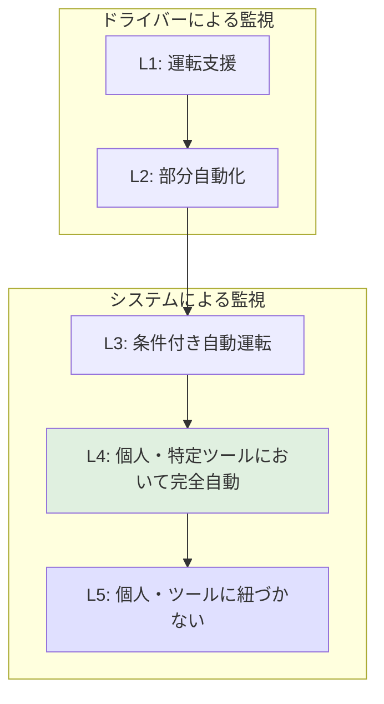

## はじめに

**本記事は中規模以上のエンタープライズ企業を想定しています。**

AI テクノロジーの進化にともない、人間とシステムの役割分担が変わりつつある、という見方があります。直近、OpenClaw が GitHub で注目を集め、Microsoft が Copilot Cowork に Claude を採用する動きがありました。日本では生成 AI の導入が進む一方、AI エージェントは「利用中 3%・検討・関心層で 6 割超」（矢野経済研究所 2026 年等）と、これから伸びる領域として語られています。限定されたスコープ内では、自律的に動作するエージェントも現れています。

一方で「AI エージェント」「Agentic AI」はまだ定義が定まっておらず、何ができて何が違うか議論がかみ合いにくい面があります。本記事では、**国が定義する自動運転のレベル（国土交通省が採用する SAE J3016 に基づくレベル 1〜5）を、自律度と人の介在度を整理するための類推として用い**、AI エージェントの分類を 5 段階でまとめます。あくまで一つの整理の提案であり、検索（Search）→ 回答（Answers）→ アクション（Actions）の進化と、紐づき方（個人・特定ツールに紐づくか、紐づかないか）を重ねたものです。「どのレベルにいるか」でトレンドや製品を置く地図の一助になれば幸いです。本ブログの [AI生産性を整理する（組織・経営の視点で解像度を上げる）](https://zenn.dev/knowledge_graph/articles/understanding-ai-productivity-organization-2026-02) では経営層とエンジニアの解像度の違いを扱いました。

---

## 5 段階の分類（自動運転レベルとの対応）

国が定義する**自動運転のレベル**（[国土交通省の定義](https://www.mlit.go.jp/common/001226541.pdf)／SAE J3016 に基づくレベル 1〜5）を**類推**として用い、AI エージェントの自律度を 5 段階で整理します。イメージとしては、**ドライバーがメインで運転・監視する**（L1〜L2）、**システムがメインでドライバーは介入時のみ対応する**（L3）、**ドライバーが関与する必要もなくシステムが自律する**（L4〜L5）、という段階です。国土交通省の図では、**ドライバーによる監視**（L1〜L2）と**システムによる監視**（L3〜L5）で境界が分かれており、L3 は「システムが全タスクを実施するが、介入要求等にドライバーが対応する必要がある」、L4 は「特定条件下においてシステムが全タスク＋応答も担い、ドライバー不要」です。**HITL** は **Human In The Loop**（人の承認・監視がループに含まれること）の略で、本記事では HITL の要否で L2 以下と L3 以上を分けます。異なる枠組みを取る考え方もあり、ここで述べる対応は一つの整理です。

*図：自動運転のレベル分けについて（国土交通省 別添3、官民ITS構想・ロードマップ等を基に作成）*

| レベル | 自動運転での位置づけ | AI エージェントの対応づけ | 例 |
|--------|----------------------|----------------------------|-----|
| **L1** | **運転支援**（縦 or 横のいずれかをシステムが支援、ドライバーが常時運転） | **検索・回答**のみ。人が常時「運転」＝承認（HITL＝Human In The Loop 必須） | RAG、GraphRAG、ChatGPT など |
| **L2** | **部分運転自動化**（**ドライバーが常時監視**・必要時対応） | 少ない指示で多くのタスクを実行。**人が常時監視・トリガー**（HITL は適度に減る） | Dify、n8n、MCP、Claude Code、Claude Cowork など |
| **L3** | **条件付き自動運転**（**システムが監視**、介入要求等にドライバーが対応） | 特定のプラットフォーム・条件下でシステムがタスクを実施するが、介入要求等に人が対応する必要がある | SubAgent、AgentForce など |
| **L4** | **特定条件下における完全自動**（**システムが監視**、ドライバー不要） | **個人または特定ツールにおいて**人が介在せず完全自動 | OpenClaw、Moltbook、Agent Teams など |
| **L5** | **完全自動運転**（あらゆる条件下でドライバー不要） | **個人や特定ツールに紐づかない**。企業向けナレッジグラフを用いることでこの領域に至る、という議論がある | 企業向けナレッジグラフを土台とした設計 など |

図は国土交通省の境界（L2/L3 の間で「ドライバーによる監視」から「システムによる監視」へ）を反映。境界の切り口と各レベルの理由は以下の各節を参照してください。

---

## レベル 1：運転支援に相当（検索して回答・HITL 必須）

自動運転の**レベル 1（運転支援）**では、システムが縦方向 or 横方向のいずれかを支援し、ドライバーが常時運転します。AI エージェントのレベル 1 はこれに対応し、**Search（検索）・回答**だけをシステムが担い、**人が常時「運転」＝判断・承認**（**HITL（Human In The Loop）** 必須）です。

Read、要約、ドラフト生成が典型的な用途で、検索の精度を上げてもグラフを組み込んでも、やっていることは**検索して回答**の範囲です。外部ツールや業務システムの**更新・設定・操作はしません**。人が主に操作し、答えを確認・承認する前提の活用が典型的です。RAG、GraphRAG、ChatGPT などはここに含まれます。レベル 1 は、検索・回答に留まる活用として多くの現場で有効です。GraphRAG は検索の高度化であり、レベル 1 の枠内での進化と捉えられます（「検索の先」は [RAG を超える知識統合](https://zenn.dev/knowledge_graph/articles/beyond-rag-knowledge-graph) に譲ります）。

---

## レベル 2：部分運転自動化に相当（少ない指示で多くのタスク・人が常時監視）

自動運転の**レベル 2（部分運転自動化）**では、システムが縦・横の両方を同時に実行しますが、ドライバーは常時監視し、必要時に対応します。AI エージェントのレベル 2 はこれに対応し、**少ない指示でたくさんのタスク**を実行する一方、**人が常時監視・トリガー**する形です。

Search に加えて **Answers（回答）** を出し、一部は **Actions（アクション）** として外部ツールの更新・設定まで行います。定型ワークフローに LLM を組み込んだ **Dify** や **n8n**、MCP や Workflow でつなげた各種ツール、タスク単位の **Claude Code**・**Claude Cowork** などがこの範囲です。**HITL（Human In The Loop、人の承認・監視）は適度に減ります**が、タスクのたびに人が指示を出す（またはトリガーする）前提です。

---

## レベル 3：条件付き自動運転に相当（システムが監視・介入要求に人が対応）

自動運転の**レベル 3（条件付き自動運転）**では、**システムによる監視**に移行し、限定領域でシステムがすべての運転タスクを実行しますが、作動継続が困難な場合など**介入要求にドライバーが対応する必要**があります。AI エージェントのレベル 3 はこれに対応し、特定のプラットフォーム・条件下でシステムがタスクを実施する一方、**介入要求等に人が対応する**位置づけです。

例として、**Claude Code の SubAgent** は、メインエージェントの指示で起動し、定義されたスコープ内で自律的にタスクを実行します。介入が必要な場合は人が対応する運用にすれば、本分類では L3 に位置づけます。**AgentForce（Salesforce）** は Salesforce プラットフォーム内でエージェントが動作しますが、Salesforce は Human in the Loop（人の監督）を設計原則としており、いつ人にエスカレーションするかを自然言語で定義できるため、本分類では L3 に位置づけます（[Salesforce Admins ブログ](https://admin.salesforce.com/blog/2026/the-importance-of-human-in-the-loop-for-agentforce) 等の公式説明に基づく）。製品の実際の動作・レベルは利用形態に依存するため、導入時は各社の説明や挙動の確認が推奨されます。

---

## レベル 4：特定条件下における完全自動に相当（個人または特定ツールにおいて完全自動）

自動運転の**レベル 4（特定条件下における完全自動）**では、**システムによる監視**の下、特定条件下でシステムがすべての運転タスクと作動継続困難時への応答も担い、ドライバーは不要です。AI エージェントのレベル 4 はこれに対応し、**個人または特定ツールにおいて**人が介在せず完全自動で動く位置づけです。

例として、**OpenClaw** は個人の作業範囲において、**Moltbook** は SNS という特定ツール内において、それぞれ人が介在せず完全自動で動作する形態です。**Claude Code の Agent Teams** は、開発というスコープ内で複数エージェントが共有タスクリストとメッセージングにより自律的に協業する形態であり、本分類では L4 に位置づける解釈があります（実験的機能であり、公式ドキュメントで挙動を確認することを推奨します）。

組織がこうした L4 のエージェントを導入・許容する際には、次の 3 つの技術的基盤がよく議論されます。**精度**：現場で「正解」を出すには RAG だけでは不十分で、構造化データと非構造化データの密結合や異種システム間のデータを動的にリンクする能力が求められる、という見方があります。**安全性**：自律エージェントの暴走を防ぐため、複数システムにまたがる操作を一単位としたスナップショット・ロールバックや、権限・リソース枠に基づくガードレールが語られることが多いです。**マルチプレイヤー**：個人のツールからチーム全体で知能を共有する環境へ進めるには、誰が何を知る権利があるかを扱う Permission-ware なナレッジグラフが鍵とされる、という議論があります。

---

## レベル 5：完全運転自動化に相当（個人・特定ツールに紐づかない）

自動運転の**レベル 5（完全運転自動化）**では、あらゆる条件下でシステムがすべての運転タスクと応答を担い、ドライバーは不要です。AI エージェントのレベル 5 は、本記事では**個人や特定ツールに紐づかない**領域として対応づけます。L4 は個人または特定ツールというスコープ内で完全自動であるのに対し、L5 はそのスコープに依存せず、組織の知能を個人やツールに縛られない形で扱う位置づけです。この領域に至る設計として、**企業向け（組織の）ナレッジグラフ**を土台に据える、という議論があります。L5 を MCP（Model Context Protocol）で実現できるのでは、と言われることがありますが、MCP の限界・課題については [MCP の課題とナレッジグラフ](https://zenn.dev/knowledge_graph/articles/mcp-knowledge-graph) を参照してください。

---

## 直近のトレンドをレベルで見る

冒頭のニュースや機能を 5 段階で置きます。製品の実際の動作・レベルは公式ドキュメントや利用形態でご確認ください。

- **Claude Cowork** → 人がタスクごとに指示する運用なら **L2**。
- **Claude Code** → タスクのたびに人が起動するなら **L2**。**SubAgent** がメインエージェントの指示で起動し限定範囲で自律する運用なら **L3**。**Agent Teams**（複数エージェントが自律協業）は **L4** に位置づける解釈があります。
- **GraphRAG の一般化** → **L1**（検索・回答の枠内・HITL（Human In The Loop）必須）
- **OpenClaw** → **L4**（個人において完全自動）
- **Moltbook** → **L4**（SNS という特定ツール内で完全自動）
- **AgentForce（Salesforce）** → **L3**（Salesforce プラットフォーム内で動作。Human in the Loop が設計原則のため。公式説明に基づく）
- **個人・特定ツールに紐づかないエージェント** → **L5**（企業向けナレッジグラフでこの領域に至る議論がある）

定義は表と各節を参照してください。この切り口でニュースや自社の目指すレベルを整理する際の参考にしていただければ幸いです。

---

## まとめ

AI エージェントの自律度を、**国が定義する自動運転のレベル（レベル 1〜5）** に沿って 5 段階で整理しました。**ドライバーによる監視**（L1〜L2）と**システムによる監視**（L3〜L5）の境界は L2 と L3 の間にあります。L1 は検索・回答のみで人が常時承認、L2 は人が常時監視・トリガー、L3 はシステムが監視するが介入要求に人が対応、L4 は個人または特定ツールにおいて人が介在せず完全自動、L5 は個人・特定ツールに紐づかない領域（企業向けナレッジグラフでこの領域に至る設計が議論される）です。検索・回答に留まる L1 は多くの現場で有効であり、L2〜L4 の選択肢も広がっています。どのレベルを目指すかは組織や現場の文脈によります。実装面では、L2 ではワークフローと権限設計、L4 ではイベント駆動と SoR 接続などがよく議論されます（詳細は [Connecting the Dots](https://zenn.dev/knowledge_graph/articles/ai-engineer-mindset-connecting-the-dots) 等に譲ります）。

---

## 参考・出典

- [自動車の自動運転に係るレベル定義（国土交通省）](https://www.mlit.go.jp/common/001226541.pdf)（SAE J3016 に基づくレベル 1〜5 の定義）
- [AI生産性を整理する（組織・経営の視点で解像度を上げる）](https://zenn.dev/knowledge_graph/articles/understanding-ai-productivity-organization-2026-02)（本ブログ）
- [Microsoft taps Anthropic's Claude to power Copilot Cowork](https://techstartups.com/2026/03/09/microsoft-taps-anthropics-claude-to-power-copilot-cowork-autonomous-ai-agents-in-a-blow-to-openai/)（Tech Startups, 2026-03）
- [OpenClaw](https://github.com/openclaw/openclaw)（GitHub）および関連報道
- [企業 IT 動向調査 2026 速報](https://www.fnn.jp/articles/-/1014209)（日本情報システム・ユーザー協会）
- [国内生成AI／AIエージェントの利用実態に関する法人アンケート調査](https://www.yano.co.jp/press/press.php/003991)（矢野経済研究所, 2026 年）
- [RAG を超える知識統合](https://zenn.dev/knowledge_graph/articles/beyond-rag-knowledge-graph)、[AIエンジニアのマインドセット：Connecting the Dots](https://zenn.dev/knowledge_graph/articles/ai-engineer-mindset-connecting-the-dots)、[MCP の課題とナレッジグラフ](https://zenn.dev/knowledge_graph/articles/mcp-knowledge-graph)（本ブログ。L5 と MCP の関係・MCP の限界は当該記事を参照）
- [Claude Code - SubAgents](https://code.claude.com/docs/ja/sub-agents)（Anthropic。L3 の解釈は本機能の説明に基づく。Agent Teams は L4 の解釈の参考として、公開されている機能説明を参照）
- [The Importance of Human in the Loop for Agentforce](https://admin.salesforce.com/blog/2026/the-importance-of-human-in-the-loop-for-agentforce)（Salesforce Admins。AgentForce を L3 に位置づける根拠）

---

## 更新履歴

- 2026-03-14: 初版（下書き）

---

## フィードバック受け付け

内容に誤りや追加情報があれば、Zenn のコメントよりお知らせください。
