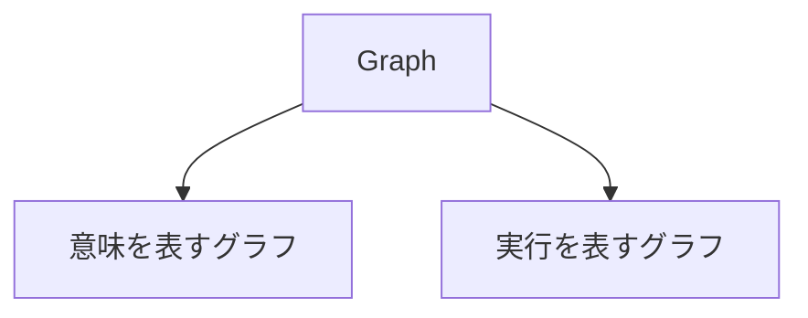
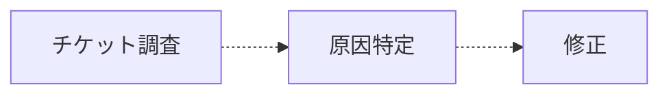
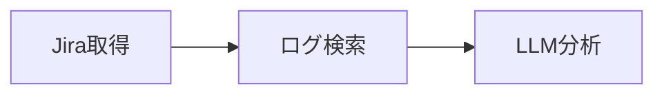
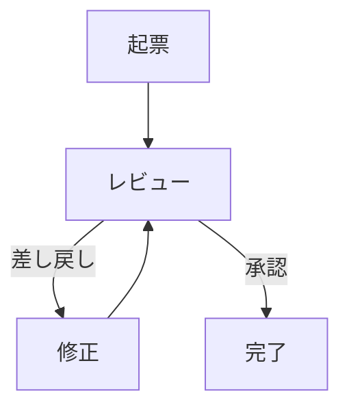
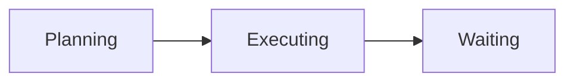
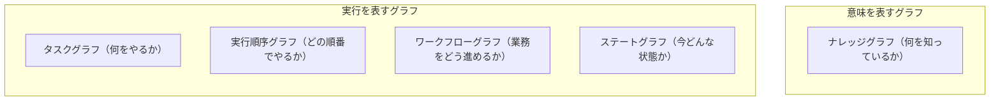

:::message
**本シリーズ 第1部**（全3部）: AI エージェント文脈のグラフを Node / Edge の意味で 5 種類に分類します。特殊化は [第2部](https://zenn.dev/knowledge_graph/articles/ai-agent-graph-specialization)、レイヤー連携と本番構成は [第3部](https://zenn.dev/knowledge_graph/articles/ai-agent-graph-production-layers) で扱います。

**前提**: ナレッジグラフの基礎（エンティティ・関係・GraphRAG との区別）は「[ナレッジグラフ入門](https://zenn.dev/knowledge_graph/articles/knowledge-graph-intro)」「[RAG を超える知識統合](https://zenn.dev/knowledge_graph/articles/beyond-rag-knowledge-graph)」で扱っています。
:::

記事や製品説明を読むと、「ナレッジグラフを使っています」と書いてあるのに、実際には GraphRAG の話だったり、Neo4j を入れただけの話だったりすることが少なくありません。

また、「ナレッジグラフ ＝ グラフDB」だと思っている人も多いように感じます。グラフDB は保存・照会の技術であり、**何を Node に、何を Edge に置くか**は設計次第です。

LangGraph や Dify / n8n を触っている人も多いと思います。ただ、**5 種類の役割を意識して設計している人はまだ少ない**はずです。製品名に Graph と付くと、中身の違うものが 1 つに見えてしまう。これが混乱の正体です。

本記事では、AI エージェントに**一般的に必要となる**グラフを、次の 5 種類に分類します。意味を保持する 1 種類と、実行を支える 4 種類です。

- ナレッジグラフ
- タスクグラフ
- 実行順序グラフ（DAG＝Directed Acyclic Graph、有向非巡回グラフ）
- ワークフローグラフ
- ステートグラフ

分類の鍵は、Node が何を表すか、Edge が何を表すか、だけです。タスクグラフや DAG といった**名前は、役割の違いを言い分けるためのラベル**です。覚えることが目的ではなく、**問いごとに別のグラフ（論理層）に分ける**ことが目的です。1 枚に混在していると、LLM やエージェントが毎回「この Node はどの意味で読むか」を推測させることになり、参照・実行の**精度**が落ちやすくなります。

多くの現場では LangGraph だけ、Dify だけ、Neo4j だけ、と **1 ツールから始める**のが普通です。次に設計するときは、名称より **役割が分離されているか** を見ることが第一歩です。

---

## Markdown ウィキだけでは足りない理由

Obsidian や [LLM Wiki](https://gist.github.com/karpathy/442a6bf555914893e9891c11519de94f)、社内 Markdown ウィキは、**人が読む（または LLM が読む）ナラティブ**を蓄える用途では強いです。双方向リンクや `[[ノート]]` は「関連がある」ことを示します。

ただし、本記事でいう 5 種類のグラフが担う **問い** は、Markdown ウィキだけでは型として持てません。以下の表では、冒頭で挙げた 5 種類の名称を使います。

| 本記事のグラフ | Markdown ウィキで書けること | ウィキだけでは弱い点 |
| --- | --- | --- |
| ナレッジグラフ | 説明文・リンクで「関連」を書く | 同一実体の ID、`blocks` / `owns` など **Edge の意味**、矛盾する主張の整理 |
| タスクグラフ | 手順・チェックリスト | 「何の作業か」と「実行順序」「承認ルール」「いまの状態」が **1 枚の MD に混在**しやすい |
| 実行順序グラフ（DAG） | 「先に A、次に B」の列挙 | **実行エンジンが保証する順序**と、人向けの説明が別物 |
| ワークフローグラフ | 承認フローの文章描述 | **差し戻しの循環**を、実行ルールとして機械が解釈できる形で持てない |
| ステートグラフ | 「Phase 2」などの見出し | **ランタイムの現在状態**（Planning / Waiting 等）と、ドキュメント上の章立てが別物 |

Wikipedia が記事本文（ナラティブ）の裏に Wikidata（セマンティック層）を持つのと同型です。LLM Wiki の `CLAUDE.md` / `AGENTS.md` はウィキの維持ルールであり、Wikidata 相当の **実体・型付き関係・クレーム** そのものではありません。ナラティブ層とセマンティック層の対比は [LLM Wiki と Wikipedia／Wikidata：ナラティブ層とセマンティック層の対応関係](https://zenn.dev/knowledge_graph/articles/llm-wiki-wikidata-narrative-semantic) に詳述しています。

SKILL.md や計画用 Markdown も、タスク分解や手順の **叙述** には向きます。一方、エージェントが複数 SaaS を跨いで動き、権限・監査・依存・再開の問いが出てくる段階では、叙述だけでは **Node が何の問いに答えるか** が固定されません。本記事は、その役割の違いを 5 種類の名前で整理した地図です。

埋め込みベクトルによる類似検索（「近いノートを探す」）は、本シリーズの「グラフ」とは別の層です。Edge が離散的な relation ではなく距離になるため、第1部の分類軸（Node / Edge が何を表すか）には載せません。

---

## まず 2 種類に分ける

意味を管理するグラフと、実行を管理するグラフ。この 2 つを区別できれば、残りは自然に整理できます。

---

## 意味を表すグラフ：ナレッジグラフ

意味を表すグラフは 1 種類で、**ナレッジグラフ（Knowledge Graph）** です。Node はエンティティ、Edge は意味のある関係を表し、**何を知っているか** を保持します。実行順序・業務フロー・エージェントの状態は扱いません。

RAG だけに頼ると、検索で拾った断片を LLM がその都度つなぎ合わせます。顧客と契約の関係、製品と障害の依存、担当者の所属など、**社内で当たり前のつながり**を毎回推測させることになります。GraphRAG でも検索の精度は上がりますが、主目的はあくまで検索の補強です。意味そのものを組織の外側に固定して持つ、という役割とは別です。

ナレッジグラフがあれば、「Customer が Product を利用している」「Issue が Release をブロックしている」といった関係を Node / Edge として先に置けます。LLM は毎回関係を推測するのではなく、**すでに構造化された意味**を参照できます。GraphRAG も検索結果から関係をその場で組み立てる方式であり、**意味を先に固定して持つ**ナレッジグラフとは役割が異なります。

ナレッジグラフの定義・価値・GraphRAG との違いは、[ナレッジグラフ入門](https://zenn.dev/knowledge_graph/articles/knowledge-graph-intro) と [RAG を超える知識統合](https://zenn.dev/knowledge_graph/articles/beyond-rag-knowledge-graph) を参照してください。

---

## 実行を表すグラフ：4 種類

AI エージェントが動くには知識だけでは足りません。実行を表すグラフは 4 種類に分かれます。

| グラフ | 役割 | Node | Edge | 主な問い |
| --- | --- | --- | --- | --- |
| タスクグラフ | 何をやるか | 作業単位 | 分解・前提 | どんな作業が必要か？ |
| 実行順序グラフ（DAG） | どの順番でやるか | 処理ステップ | 実行順序 | どの処理を先に実行するか？ |
| ワークフローグラフ | 業務をどう進めるか | 業務ステップ | 遷移条件 | 承認や差し戻しをどう管理するか？ |
| ステートグラフ | 今どんな状態か | 状態 | 状態遷移 | エージェントは今どこにいるか？ |

ここまでの分類は、Node / Edge が何を表すかという**論理の話**です。同じグラフDB（Neo4j など）に載せるにしても、上表のどの列に当てはまるかで別物になります。一方、実行順序グラフやステートグラフは Workflow Engine やランタイム側に置かれることも多く、5 種類すべてが 1 つのグラフDB に入るわけではありません。

「Neo4j を入れた」場合に限っても、RDF か Property Graph かを選ぶのは、上表の**ナレッジグラフ**の列を永続化するときの話です。製品・顧客・チケットをエージェントがグラフ上をたどりながら辿るなら Property Graph が向きやすく、オントロジーや標準語彙での推論、外部データとの URI 連携を重視するなら RDF が向きやすいです。比較の詳細は [RDF vs Property Graph](https://zenn.dev/knowledge_graph/articles/rdf-vs-property-graph-2025) にまとめています。

以下では、残り 4 種類の実行グラフを順に見ていきます。

### 通し題材：障害対応

ユーザーが「この障害を直して」と依頼し、エージェントがチケット調査・原因特定・修正を進める場面を、4 種類すべてで共通の題材にします。第2部では、この障害対応を起点に特殊化の話も続けます。

---

## タスクグラフ

タスクグラフが答えるのは「**何をやるか**」のみです。Node に載せるのは**業務上の作業**（チケット調査、原因特定、修正など）です。どの順番で実行するか、承認を誰が挟むか、今どのフェーズにいるかは、それぞれ別のグラフの役割です。

点線は「計画上の前提関係」です。**何の作業が必要か**と、その依存を固定するだけで、Workflow Engine がこの順序を強制するわけではありません。

ユーザーが「この障害を直して」と一言だけ渡すと、LLM は調査・原因特定・修正・報告を一度に抱え込みがちです。途中で何が未完了かも曖昧なまま進み、サブタスクの取りこぼしや手戻りが起きやすくなります。

タスクグラフで作業単位を先に分解しておけば、エージェントは「今は原因特定フェーズだ」と認識できます。何をやるかがはっきりすると、そのあと見ていく実行順序や状態管理も整理しやすくなります。

---

## 実行順序グラフ（DAG）

タスクグラフで「何をやるか」が決まったあと、**各作業をシステムがどの順番で処理するか**を固定するのが実行順序グラフです。Node に載せるのは**処理ステップ**（API 呼び出し、DB クエリ、LLM 推論など）で、タスクグラフの業務作業とは粒度が異なります。

たとえば上の「原因特定」という業務タスクを実行するとき、システム内部では次のような処理順序になります。

実線は、Workflow Engine が**守る実行順序**です。多くは `DAG`（Directed Acyclic Graph、有向非巡回グラフ）として実装され、Edge に方向があり循環しません。

| | タスクグラフ | 実行順序グラフ（DAG） |
| --- | --- | --- |
| Node | 業務上の作業 | システムの処理ステップ |
| Edge | 計画上の前提 | 実行順序（エンジンが保証） |
| 例 | チケット調査 → 原因特定 → 修正 | Jira取得 → ログ検索 → LLM分析 |

見た目はどちらも矢印でつながりますが、**タスクグラフは計画、DAG は実行の保証**という違いです。

DAG が答えるのは「**どの処理を先に実行するか**」です。実装では Temporal、Apache Airflow、AWS Step Functions などの Workflow Engine が、この順序保証を担うことが多いです。製品選定や構成の詳細は [LLM 依存度を下げる業務 AI アーキテクチャ設計](https://zenn.dev/knowledge_graph/articles/llm-formal-layer-architecture) を参照してください。

最近、エージェントがゴールに向かって観察・実行・検証を繰り返す **ループエンジニアリング**（Loop Engineering）も注目されています。ループそのものが問題なのではなく、**ループすべき場所**と**ループではなく正しい順番で実行すべき場所**を混ぜてしまうことが問題になりやすいです。

たとえば「原因特定」全体を LLM の自由なループに任せると、Jira取得の前にログ検索を試したり、毎回違う順で処理を回したりしがちです。一方、結論が出るまで別の切り口で試す、検証に失敗したらやり直す、といった**試行錯誤が必要な部分**はループに載せるのが自然です。

実行順序グラフは、Jira取得 → ログ検索 → LLM分析のように**順序が決まっている処理**を外側で固定する役割です。DAG で順序を保証しておけば、ループは本当に反復が必要な部分に集中でき、トークンの無駄遣いも減らせます。

---

## ワークフローグラフ

ここまで見てきたタスクグラフと実行順序グラフ（DAG）が「何をやるか」と「処理をどの順番で実行するか」を担うのに対し、ワークフローグラフが担うのは**業務プロセスの進め方**です。Node は業務ステップ（起票、レビュー、完了など）、Edge は**条件付きの遷移**（承認、差し戻し、エスカレーション）を表します。

たとえば「修正」タスクが終わったあと、変更内容を本番に反映する前に人のレビューを挟む場面を考えます。

Dify や LangGraph でも、上のような循環付きの図は描けます。**名称で争う必要はありません。** 分けるのは **Edge が答える問い** です。`修正 → レビュー` の戻りは「次の API をどれに実行するか」（実行順序）というより **差し戻しの業務ルール**（遷移条件）を表すので、ワークフローグラフ側の役割に置きます。原因特定の Jira取得 → ログ検索 → LLM分析 のように、処理順序だけを固定したい部分は、実行順序グラフ（DAG）側の役割に置きます。

| | タスクグラフ | DAG | ワークフローグラフ |
| --- | --- | --- | --- |
| 主な問い | 何の作業が必要か | 処理をどの順番で実行するか | 業務をどう進めるか |
| Node | 業務上の作業 | システムの処理ステップ | 業務ステップ（起票、レビューなど） |
| Edge | 計画上の前提 | 実行順序（前へ進む） | 遷移条件（承認・差し戻し・分岐） |
| 循環 | なし（前提関係のみ） | なし | あり得る（差し戻しなど） |
| 例 | 調査 → 原因特定 → 修正 | Jira取得 → ログ検索 → LLM分析 | 起票 → レビュー ⇄ 修正 → 完了 |

上表の 3 種類は、用途が違うだけで競合しません。同じフロー図の中でも、**作業の分解・処理順序の固定・承認や差し戻しのルール**は別の役割として分けて設計します。

エージェントに実行権限だけ渡すと、起票も承認もエージェント任せになり、人の判断を挟むべき場面をすっ飛ばすことがあります。逆に、すべてを人が都度指示すると、エージェントは「次に何をすべきか」を毎回聞き返すだけの存在になります。

ワークフローグラフで遷移条件を明示すれば、「レビューで差し戻されたら修正へ戻る」「一定金額を超えたら承認を挟む」といった**業務ルール**を実行の外側に置けます。n8n や Dify のフロー設計、ServiceNow の承認ルートなども、この層に近い考え方です。Human-in-the-Loop の設計も、ここに載せるのが自然です。

---

## ステートグラフ

ワークフローグラフが**業務の段階**（起票、レビュー、完了）を表すのに対し、ステートグラフが追うのは**エージェントの実行状態**（Planning、Executing、Waiting など）です。業務上は「レビュー中」でも、エージェント内部では「Waiting（人の承認待ち）」にいる、というように両方が同時に存在します。

エージェントが **今どこにいるか** を追跡します。LangGraph の `StateGraph` はこの考え方に近く、ナレッジグラフとは別物です（エージェント設計の具体例は [kg-puzzle-agent-langgraph](https://zenn.dev/knowledge_graph/articles/kg-puzzle-agent-langgraph) を参照）。

チャットだけでエージェントを動かすと、各ターンは独立に見え、システム側から「いま Planning か Executing か」が分かりにくいことがあります。長時間タスクの途中で切断されたあと、どこから再開すればよいかも曖昧です。監視やデバッグのときも、「止まっているのか、待っているのか」の区別がつきにくくなります。

ステートグラフがあれば、システム側から「いま Planning か Executing か」を常に把握できます。切断後にどこから再開するか、いつタイムアウトするか、人にエスカレートするかも、現在の状態を起点に決められます。これがなければ、チャット上では動いているように見えても、裏側で止まっているのか待っているのか、運用者には区別がつきません。

---

## どの製品で、何が足りるか

LangGraph も Dify / n8n も、名前に Graph が付きますが、**設計上の役割分担が異なります**。1 つの製品で多くのことを書けるからといって、5 種類を 1 枚のグラフに詰め込む必要はありません。役割を分けて設計し、ツールはその実装に割り当てる方が、拡張と運用の両方で整理しやすくなります。

| グラフ | LangGraph | Dify / n8n |
| --- | --- | --- |
| ナレッジグラフ | 別途 Neo4j 等が必要 | 別途必要（RAG ノードは検索用で KG ではない） |
| タスクグラフ | 作業分解の第一級モデルではない | フローブロックの分割に留まる |
| DAG | ノード列で近似可能 | 直列・分岐フローが主用途 |
| ワークフロー | 条件分岐は可能。承認・差し戻しの中核には向かない | 連携と業務フローが主用途 |
| ステートグラフ | `StateGraph` が中核 | 長時間の状態追跡・再開は非対応に近い |

### LangGraph を中心に組んでいる場合

LangGraph は、エージェントの状態管理（Planning / Executing）、ツール呼び出し、試行錯誤のループを担う設計向きです。組織横断の承認・差し戻しや、顧客・製品・チケットの関係を固定するナレッジグラフは、別コンポーネントで用意する前提になります。

すべてを `StateGraph` に載せると、「この Node は人のレビューなのか、エージェントの待機なのか」が混在し、責務の境界が曖昧になります。

### Dify / n8n を中心に組んでいる場合

Dify / n8n は、SaaS 連携、LLM ノードの直列、承認付きの業務フローを担う設計向きです。エージェント内部の状態管理、切断後の再開、Planning と Executing の区別は、LangGraph など別ランタイムに委ねる構成が一般的です。

### 次に設計すべきレイヤ

現行ツールで担えていない役割が、追加設計の候補になります。

- LangGraph 中心 → 承認・差し戻しは Dify / n8n、意味の固定は Neo4j 等
- Dify / n8n 中心 → エージェントの状態管理は LangGraph
- Neo4j のみ → 実行系 4 種（タスク・DAG・ワークフロー・ステート）を別途設計

製品選定の詳細は [LLM 依存度を下げる業務 AI アーキテクチャ設計](https://zenn.dev/knowledge_graph/articles/llm-formal-layer-architecture) にまとめています。

---

## 5 種類の全体像

:::message
この図は実行パイプラインではなく、**役割の地図**です。上から下へ「この順番で動く」という意味ではありません。
:::

---

## 5 種類で足りるか

ここまでの 5 種類は、AI エージェントに**最低限そろえたい役割**の整理です。

- 意味を保持する（ナレッジグラフ）
- 何をやるか（タスクグラフ）
- どの順番で実行するか（DAG）
- 業務をどう進めるか（ワークフローグラフ）
- 今どんな状態か（ステートグラフ）

エージェントが「知り、計画し、実行し、状態を追う」には、この 5 役割が揃っている必要があります。分類の地図としては、この枠組みで十分です。

ただし、**実際の AI プラットフォームは 5 種類だけでは動きません**。権限・同一性・依存関係・時間軸など、用途ごとに切り出されたグラフがさらに登場します。それらは新しい種類ではなく、本記事で示したグラフの特殊化です。

本シリーズは全 3 部構成です。第 2 部「[AIプラットフォームのグラフ特殊化](https://zenn.dev/knowledge_graph/articles/ai-agent-graph-specialization)」では、権限・同一性・依存・時間軸など、5 種類から派生する **6 つの特殊化**グラフのカタログを整理します。本記事の分類だけでは足りない理由を、そこで具体的に見ていきます。第 3 部「[5種類のグラフは1つのDBに入らない。本番のレイヤー設計](https://zenn.dev/knowledge_graph/articles/ai-agent-graph-production-layers)」では、レイヤー間の連携と本番の組み方を扱います。

---

## まとめ

- **ナレッジグラフ**: 意味を保持する（実行・状態は扱わない）
- **タスクグラフ**: 何をやるか
- **DAG**: どの順番で実行するか
- **ワークフローグラフ**: 業務をどう進めるか
- **ステートグラフ**: 今どんな状態か

5 種類は AI エージェントに必要なグラフの**最低限の地図**です。名称を暗記するより、**問いごとにグラフを分け、解釈のぶれを減らす**設計の方が、エージェントの精度は上がりやすくなります。本番のプラットフォームを組むには、この先にもう一段の解像度が要ります。

---

## 関連記事

| テーマ | 記事 |
| --- | --- |
| ナレッジグラフの基礎 | [ナレッジグラフ入門](https://zenn.dev/knowledge_graph/articles/knowledge-graph-intro) |
| LLM Wiki とセマンティック層 | [LLM Wiki と Wikipedia／Wikidata：ナラティブ層とセマンティック層の対応関係](https://zenn.dev/knowledge_graph/articles/llm-wiki-wikidata-narrative-semantic) |
| GraphRAG と KG の区別 | [RAG を超える知識統合](https://zenn.dev/knowledge_graph/articles/beyond-rag-knowledge-graph) |
| RDF / Property Graph の比較 | [RDF vs Property Graph](https://zenn.dev/knowledge_graph/articles/rdf-vs-property-graph-2025) |
| 形式レイヤ・Workflow Engine | [LLM 依存度を下げる業務 AI アーキテクチャ設計](https://zenn.dev/knowledge_graph/articles/llm-formal-layer-architecture) |
| LangGraph エージェント設計 | [LLM に巨大パズルを解かせるな](https://zenn.dev/knowledge_graph/articles/kg-puzzle-agent-langgraph) |
| 本シリーズ 第2部 | [AIプラットフォームのグラフ特殊化](https://zenn.dev/knowledge_graph/articles/ai-agent-graph-specialization) |
| 本シリーズ 第3部 | [5種類のグラフは1つのDBに入らない。本番のレイヤー設計](https://zenn.dev/knowledge_graph/articles/ai-agent-graph-production-layers) |

---

## 参考・出典

- [LangGraph Documentation](https://langchain-ai.github.io/langgraph/)（StateGraph）

---

## 更新履歴

- 2026-07-11: 初版公開

---

## フィードバック受け付け

内容に誤りや追加情報があれば、Zenn のコメントよりお知らせください。
