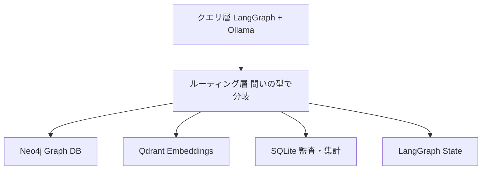

:::message
**本シリーズ 第3部**（全3部）: [第1部](https://zenn.dev/knowledge_graph/articles/ai-agent-five-graph-types)で 5 種類の地図、[第2部](https://zenn.dev/knowledge_graph/articles/ai-agent-graph-specialization)で 6 つの特殊化を整理しました。本記事は **どの問いをどの物理層に置くか**（レイヤー配置）と、エージェントへの渡し方を扱います。

**前提**: ナレッジグラフの基礎（エンティティ・関係・GraphRAG との区別）は「[ナレッジグラフ入門](https://zenn.dev/knowledge_graph/articles/knowledge-graph-intro)」「[RAG を超える知識統合](https://zenn.dev/knowledge_graph/articles/beyond-rag-knowledge-graph)」で扱っています。
:::

第1部で 5 種類、第2部で特殊化まで整理すると、次に出てくるのが「じゃあ全部 Neo4j に入れればいいのか」「LangGraph だけで足りるのか」です。

現場では、この問いに対して「グラフ DB を入れた」「エージェント基盤を入れた」で安心しがちです。ただ、第1部でも触れたとおり、**5 種類すべてが 1 つのグラフ DB に入るわけではありません**。実行順序やステートはランタイム側に置かれることも多く、似た障害探しや件数集計は、別のストアの方が向くことも多いです。

本記事では、役割（論理）と置き場（物理）を分けたうえで、障害対応エージェントを題材に **問いごとに物理層を選ぶ** 設計を整理します。通し題材は第1部・第2部と同じ障害対応です。デモ用の架空チケットは INC-001（製品 Acme Search、顧客 Globex Corp）です。

多くの現場では、まず Markdown や Skill、次に Neo4j や LangGraph のどれか 1 つ、という順で育ちます。本記事はその延長線上で、用途別に置き場を分ける段階までを見ます。手元で再現できる小さな構成（Neo4j + Qdrant + SQLite + LangGraph）も示します。

デモが示すのは、エージェントに **正確な情報をどう渡すか** までです。チケット更新や承認実行など、世界を変える操作そのものの正しさまでは扱いません。手順の細部は [experiment README](https://github.com/DevRev-JP/tech-blog/tree/main/experiments/ai-agent-graph-production-layers) に任せ、本記事は判断の芯と代表例に絞ります。

---

## 役割と置き場は別の話

第1部・第2部で分けたのは、主に **役割** です。「この問いは権限か」「同一性か」「時間軸か」という設計上の区別です。権限グラフを切り出すと言っても、必ずしも権限専用の Graph DB をもう一台買う意味ではありません。IAM やポリシーエンジンに載せてもよい、と第2部でも整理しています。

一方で、役割を分けたあとに「全部 Neo4j に入れれば実装は終わり」とも限りません。似た障害を探すならベクトル検索の方が向きやすく、件数集計なら SQL の方が向きやすい、という **置き場の向き不向き** が残るからです。

| よくある誤解 | 実際 |
| --- | --- |
| ナレッジグラフ ＝ Neo4j だけ | Neo4j は関係をたどるのに強い。類似検索や集計は別層の方が向くことが多い |
| LangGraph があれば全部いける | 実行順や現在状態には向く。権限・監査・集計の主戦場ではない |

設計の核心は、第1部と同じです。名称より問いです。本記事ではそれを一段進め、**問いの型ごとに物理層を選ぶ** ところまで見ます。

LangGraph と Dify / n8n の役割分担は [第1部「どの製品で、何が足りるか」](https://zenn.dev/knowledge_graph/articles/ai-agent-five-graph-types#どの製品で何が足りるか) にまとまっています。本記事では製品名の勝負ではなく、置き場の対応に進みます。

---

## 成熟段階：ファイル → 単一 DB → 用途別に分ける

本番の置き場は、いきなり完成形になるわけではありません。多くの現場は、次の 3 段階に近い育ち方をします。

| 段階 | どう持つか | 典型例 | 限界が来るとき |
| --- | --- | --- | --- |
| 0: ファイル | Markdown、JSON、ディレクトリ | AI-DLC Workflows、CLAUDE.md、LLM Wiki | チーム横断、マルチエージェント、横断クエリ |
| 1: 単一グラフ DB | Neo4j に全部載せる | 多くの GraphRAG 実装 | 集計・類似検索・時間範囲が重い |
| 2: 用途別に分ける | 問いごとに最適な置き場を組み合わせる | 本番の AI プラットフォーム | ← 本記事のメイン |

段階 0 を否定しません。始めるならファイルで十分です。ファイルだけでは型付きの関係を持ちにくい、という限界は [第1部](https://zenn.dev/knowledge_graph/articles/ai-agent-five-graph-types#markdown-ウィキだけでは足りない理由) と [第2部](https://zenn.dev/knowledge_graph/articles/ai-agent-graph-specialization#ファイルだけでは足りない理由特殊化) で整理済みです。

段階 1 で「全部 Graph DB」にすると、集計や類似まで Cypher に押し込みがちです。見た目はグラフでも、問いによっては材料が弱くなります。後述のデモでは、この「Neo4j だけ」の弱さも見ます。

段階 2 は、頭の中では 1 つの業務世界でも、**取り出し口を問いごとに分ける** 設計です。用途ごとに得意なストアを組み合わせる考え方は、[Polyglot Persistence](https://martinfowler.com/bliki/PolyglotPersistence.html) として知られています。

いま自社がどこにいるかで、次の一手は変わります。

- まだ Markdown / Skill だけ → 段階 0 のまま。第1部・第2部の問いが現場で詰まったら、置き場を足す候補にする
- Neo4j に全部載せ始めた → 類似や件数集計が重いなら、ベクトルや SQL への分離を検討する
- すでに LangGraph + Neo4j → 次節の対応表で「足りない置き場」を 1 つ足す

---

## 問いごとに物理層を選ぶ

段階 2 を、もう少し具体にします。置き場ごとに得意な問いが違います。

| 物理層 | 得意な問い | 載せる役割（第1部・第2部） |
| --- | --- | --- |
| Graph DB | 関係を多ホップでたどる | ナレッジグラフ、依存、権限、同一性、WF 遷移、時間軸のイベント |
| Embeddings DB | 意味的に近いものを探す | コンテキスト（類似障害） |
| SQL Store | 件数・期間で集計する | 監査 |
| Time Series（本番） | 長い時間範囲の変化を扱う | 時間軸（規模が大きくなったとき） |
| In-memory | 「いま」の状態を持つ | ステートグラフ、DAG の実行 |

全部を一度にそろえる必要はありません。本記事の小さな構成は、次の 4 層に縮小しています。

```
Neo4j（関係・権限・同一性・Event・WF 遷移）
  + Qdrant（類似障害）
  + SQLite（監査・集計）
  + LangGraph（DAG 実行 + ステート）
```

本番では全文検索や専用の Time Series DB も足せます。小規模では、時間軸は Neo4j の `:Event`、集計は SQLite で足ります。まずは 4 層で始め、必要になったら層を足す、という順序です。

---

## 障害対応エージェントの本番配置

第1部・第2部と同じ障害対応を、段階 2 で次のように配置します。エージェントは毎回同じ置き場を見に行くのではなく、問いの型で振り分けます。



| 問い | 物理層 | なぜその置き場か |
| --- | --- | --- |
| このチケットの顧客は？（Q1） | Neo4j KG | チケット→製品→顧客の関係をたどる |
| 類似の過去障害は？（Q2） | Qdrant | 意味的な近さはベクトル向き |
| ログ基盤の影響範囲は？（Q3） | Neo4j `BLOCKS` | 依存をたどる |
| このエージェントは見てよいか？（Q4） | Neo4j `CAN_READ` | 許可を先に評価する |
| 過去 30 日 P0 トップ製品は？（Q5） | SQLite | 件数集計は SQL 向き |
| Slack とメールは同一顧客か？（Q6） | Neo4j `SAME_AS` | 名寄せの関係をたどる |
| P0 昇格の 30 分前に何が？（Q7） | Neo4j `:Event` | イベントを時間順にたどる |
| このターンで渡したノードは？（Q8） | コンテキスト部分グラフ | 見せる範囲を切り出す |
| いまエージェントはどの状態？ | LangGraph `state.phase` | 実行中の現在地はメモリ向き |

問いの意味そのもの（同一性とは何か、など）は [第2部](https://zenn.dev/knowledge_graph/articles/ai-agent-graph-specialization) のカタログ側です。本記事で見るのは、**置き場の対応** です。

ここで大事なのは、「全部を分ける」ではないことです。たとえば Q7（昇格の 30 分前）は Neo4j のイベント鎖で足ります。一方 Q2（類似障害）と Q5（件数集計）は、Neo4j だけだと材料が弱くなりやすい。**分けるべき問いと、分けなくてよい問い** がある。これがタイトル「5 種類のグラフは 1 つの DB に入らない」の中身です。

---

## 宣言的 Graph と推論的 Graph

置き場と並んで、グラフの作り方も渡し方に効きます。

| | 宣言的（Ontology-first） | 推論的（Inferred） |
| --- | --- | --- |
| 構築 | スキーマを先に定義しデータを流す | ドキュメントの共起から動的に構築 |
| 代表例 | 社内マスタ、Cypher seed | GraphRAG、Glean 系 |
| エージェントへの渡し方 | 型付き Edge を辿った事実 | 断片・類似から推測しがち |
| 本記事のデモ | `incident.cypher` | `fragments.json`（段階 0） |

検索だけなら、推論的でも回ることが多いです。同じ LLM に渡す材料を型付きの事実にそろえると、断定や「見せない」判断の根拠が残ります。本番で操作まで任せるなら、根拠を辿れる宣言的 Graph の方が材料として向きます。本記事のデモが示すのは、その **渡し方の差** までです。

本番で時系列やエピソード記憶を動的に構築するなら [Graphiti](https://github.com/getzep/graphiti) や Zep が選択肢になります。本記事のデモでは、時間軸は Neo4j の `:Event` と `BEFORE` を宣言的に seed しています。動的抽出は、まず必要になってから足せば十分です。

---

## トークンと応答速度にも効く

物理層を分ける利点は、答えの質だけではありません。

毎回テーブル一覧を見て JOIN を推測する方式では、問いのたびに探索の往復が乗ります。関係を事前に固定したグラフでは「隣接 Edge を辿る」だけで済み、渡すコンテキストが小さくなりやすいです。

本番では、チケット作成の時点で Graph・ベクトル・監査へ書いておく（いわゆる write-time enrichment）と効きます。クエリ時は取り出すだけです。本記事のデモは、その結果を seed 済みの事実として再現します。次節で、メモ全文と型付き事実では、渡している量も違うことが見えます。

自前で Neo4j + LangGraph を組み合わせるか、統合プラットフォームに乗るかは、組織の選択です。自前は層間の整合を自分で保証する代わりに自由度が高い。統合は制約に乗る代わりに実装がまとまりやすい。本記事のデモは組み合わせの縮小版です。統合側の深掘りは [DevRev KG アーキテクチャ](https://zenn.dev/knowledge_graph/articles/devrev-kg-architecture-deep-dive) にまとまっています。

---

## 手を動かす：渡すものが変わると、答えも変わる

第1部で、Markdown だけでは Edge の型を持てないと整理しました。ここではその続きとして、**型付きの事実を物理層から取り、エージェントに渡すと答えがどう変わるか** を見ます。

ハンズオンは本リポジトリの [experiment](https://github.com/DevRev-JP/tech-blog/tree/main/experiments/ai-agent-graph-production-layers) だけで完結します（他 experiment は不要です）。画面には Q1〜Q8 という番号も出ますが、読むときは日本語の問いを先に追ってください。番号はログ合わせ用です。

確認したいことは 3 つです。

1. 同じ障害でも、問いが変わると効くグラフの種類も変わる（第1部の地図）
2. 同じ問いでも、メモを渡す場合とグラフの事実を渡す場合で答えが変わる
3. 全部 Neo4j に押し込むと、類似や集計で材料が弱くなる（タイトルの主張）

**前提**: Docker または [Podman](https://podman.io/)、Python 3.11+、ホスト [Ollama](https://ollama.com/)。LLM 回答に `gemma2:2b`、類似検索に `nomic-embed-text` を使います。他 experiment の Neo4j とはポートが競合するため、同時に起動しないでください。

```bash
# リポジトリを clone したうえで
git clone https://github.com/DevRev-JP/tech-blog.git
cd tech-blog/experiments/ai-agent-graph-production-layers

ollama serve                    # 別ターミナル
ollama pull gemma2:2b
ollama pull nomic-embed-text

cp env.sample .env && pip install -r requirements.txt
./run_demo.sh setup
./run_demo.sh scenario   # 1: 障害の物語（Ollama 不要）
./run_demo.sh agent      # 2・3: 渡し方と層分離
./run_demo.sh compare    # 8 問の一覧（任意・Ollama 不要）
```

`./run_demo.sh agent` では、次の 4 問をこの順で見ます。詳細手順と成功の目安は [experiment README](https://github.com/DevRev-JP/tech-blog/tree/main/experiments/ai-agent-graph-production-layers) にあります。

| 順 | 問い | 見るポイント |
| --- | --- | --- |
| 1 | Slack とメールは同一顧客か？（Q6） | メモ vs グラフで答えが変わる |
| 2 | P0 昇格の 30 分前に何が？（Q7） | 同上。Neo4j だけで足りる例でもある |
| 3 | 過去 30 日の P0 トップ製品は？（Q5） | **ここだけ** Neo4j 単体との 3 段比較が出る |
| 4 | このエージェントは見てよいか？（Q4） | メモだと漏れ、グラフだと遮断 |

### メモを読む AI と、グラフを読む AI

第2部の同一性の問いを、渡し方だけ変えて見ます。モデルは同じです。違うのは、プロンプトに載せる材料だけです。以下は `gemma2:2b` での実際の出力です。

```text
問い: Slack とメールは同一顧客か？

--- A. メモ断片を読む AI ---
【AI に渡したコンテキスト】
  globex-support: 検索が遅い。別チケット INC-099 も同じ症状？
  From: ops@globex.example / 障害報告。製品 Acme Search。
【AI の回答】 断定できない。

--- B. グラフ（層分離）を読む AI ---
【AI に渡したコンテキスト】
  (ChannelAccount {id:slack-globex-support})-[:SAME_AS]->(Customer {name:Globex Corp})
  (ChannelAccount {id:email-globex-ops})-[:SAME_AS]->(Customer {name:Globex Corp})
  → Slack とメールは SAME_AS で同一顧客（Globex Corp）に繋がる
【AI の回答】 はい。
```

A では、Slack っぽい文字列とメールアドレスが並んでいるだけで、両者を結ぶ型がありません。だから AI は正しく「断定できない」と答えます。B では `SAME_AS` が同一顧客であることを保証するので、根拠つきで「はい」と答えられます。これが、Markdown ではなくグラフを使う意味です。

同じ差は、時間軸（Q7）と権限（Q4）でも起きます。特殊化の意味は第2部、ここでは渡す材料の差だけ見てください。渡す根拠が違うと、同じモデルでも答えと漏洩の傾向が変わります。本番で操作まで任せるなら、この差はさらに効きます。本デモでは操作そのものは扱いません。

### グラフ 1 つでは足りない問い

タイトルの核心です。「グラフに進めば十分か」ではなく、**全部 1 つの Graph DB に押し込むと fact が弱くなる** ことがあります。

`./run_demo.sh agent` では、Q5 だけ次の 3 段が並びます。

- A: メモ断片
- B: 層を分けた場合（SQLite で集計）
- C: 全部 Neo4j から無理に取った場合

類似障害（Q2）でも、同じ「Neo4j 単体 vs 層分離」の差が出ます。seed 固定の例です。

```text
類似の過去障害は？（Q2）
  Neo4j単体   ▲ 推測   ベクトル層なし。タイトルのキーワード一致のみ
              → ['INC-001']
  分離        ◎ 確定   Qdrant の意味的類似
              → ['INC-00042', 'INC-00017']

過去30日の P0 件数トップ製品は？（Q5）
  Neo4j単体   ▲ 推測   Issue.severity 固定値だけ。audit_log と乖離
              → {'Acme Search': 1}
  分離        ◎ 確定   SQLite audit_log 集計
              → {'Acme Search': 2, 'Platform Logging': 1}
```

Q2 は類似（Embeddings）、Q5 は監査集計（SQL）が主戦場です。一方 Q7（時間軸）は Neo4j の `:Event` + `BEFORE` で足ります。**分けるべき問いと分けなくてよい問いの見極め**が、本番設計の一部です。

---

## まとめ

- 第1部・第2部の役割は、問いごとに **物理層へ載せる**（1 つの DB に入れない）
- 成熟度はファイル → 単一 DB → 用途別に分ける、の 3 段階
- 宣言的 Graph は根拠を辿れる渡し方に向き、推論的 Graph は立ち上げ速度に向く
- 事前計算（write-time enrichment）はトークンとレイテンシを下げる。本デモはその結果を seed で再現する
- 全部を分ける必要はない。類似や集計は分け、時間軸は Neo4j で足りることがある
- 第1部の地図 → 第2部のカタログ → 第3部の配置で、設計が一連でつながる

デモで確認できるのは、渡し方と層分離の差までです。`./run_demo.sh agent` で、メモを読む AI とグラフを読む AI、そして Q5 の Neo4j 単体 vs 層分離を手元で再現できます。

---

## 関連記事

| テーマ | 記事 |
| --- | --- |
| 本シリーズ 第1部 | [ナレッジグラフだけじゃない。AIエージェントが使う5種類のグラフ](https://zenn.dev/knowledge_graph/articles/ai-agent-five-graph-types) |
| 本シリーズ 第2部 | [AIプラットフォームのグラフ特殊化](https://zenn.dev/knowledge_graph/articles/ai-agent-graph-specialization) |
| 形式レイヤ・Workflow Engine | [LLM 依存度を下げる業務 AI アーキテクチャ設計](https://zenn.dev/knowledge_graph/articles/llm-formal-layer-architecture) |
| DevRev KG 実装の深度 | [DevRev ナレッジグラフアーキテクチャ深掘り](https://zenn.dev/knowledge_graph/articles/devrev-kg-architecture-deep-dive) |
| Polyglot Persistence | [Martin Fowler の説明](https://martinfowler.com/bliki/PolyglotPersistence.html) |

---

## 更新履歴

- 2026-07-16: 初版公開

---

## フィードバック受け付け

内容に誤りや追加情報があれば、Zenn のコメントよりお知らせください。
