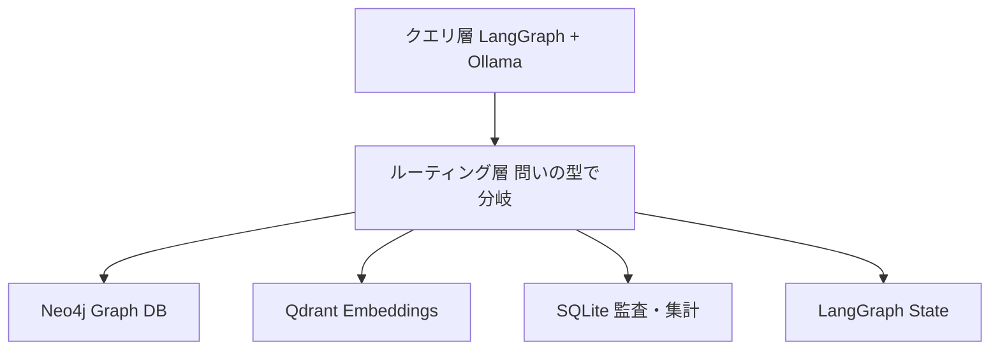

:::message
**本シリーズ 第3部**（全3部）: [第1部](https://zenn.dev/knowledge_graph/articles/ai-agent-five-graph-types)で 5 種類の地図、[第2部](https://zenn.dev/knowledge_graph/articles/ai-agent-graph-specialization)で 6 つの特殊化を整理しました。本記事は **どの問いをどの物理層に置くか**（レイヤー配置）を扱います。

**前提**: ナレッジグラフと GraphRAG の区別は [ナレッジグラフ入門](https://zenn.dev/knowledge_graph/articles/knowledge-graph-intro)・[RAG を超える知識統合](https://zenn.dev/knowledge_graph/articles/beyond-rag-knowledge-graph) を参照してください。
:::

第1部で 5 種類、第2部で 6 つの特殊化は分かった。次の問いは「全部 Neo4j に入れればいいのか」「LangGraph だけで足りるのか」です。

答えは **いいえ** です。同じ障害対応エージェントでも、問いの型によって最適な保存・照会の仕組みが変わります。関係をたどる問い、類似検索、集計、権限、時間軸、今の実行状態。これらを 1 つの DB に押し込むと、遅くなるか、読めなくなるか、漏れるかのどれかが起きます。

本記事では、成熟度 3 段階（ファイル → 単一 DB → Polyglot Persistence）を軸に、小規模チームが手元で再現できる **4 層 PoC**（Neo4j + Qdrant + SQLite + LangGraph）までを示します。通し題材は第1部・第2部と同じ **障害対応**（INC-001、製品 Acme Search、顧客 Globex Corp）です。

---

## はじめに：5 種類は分かった。で、どこに置くのか

5 種類のグラフは **論理層** の話です。本番では、その論理層を **物理層**（Graph DB、ベクトル DB、SQL、インメモリ実行エンジン）に載せ替えます。

| よくある誤解 | 実際 |
| --- | --- |
| ナレッジグラフ ＝ Neo4j だけ | テキスト検索・類似検索・集計は別層の方が速いことが多い |
| LangGraph があれば全部いける | DAG・ステート・一部 WF 実行は向く。権限・監査・集計の主戦場ではない |
| GraphRAG を入れれば KG 完成 | GraphRAG は検索補強。意味を先に固定するナレッジグラフとは役割が異なる |

設計の核心は **クエリパターンごとに物理層を選ぶ** ことです。第3部の experiment では、同じ Q1〜Q8 を段階 0→1→2 で辿り、「1 つの DB に入れない」理由を CLI で確認できます。

---

## 成熟段階：ファイル → 単一 DB → Polyglot Persistence

| 段階 | 表現 | 典型例 | 限界が来るとき |
| --- | --- | --- | --- |
| 0: ファイルベース | MD + JSON + ディレクトリ | AI-DLC Workflows、CLAUDE.md、LLM Wiki | チーム横断、マルチエージェント、横断クエリ |
| 1: 単一グラフ DB | Neo4j に全部載せる | 多くの GraphRAG 実装 | 集計・類似検索・時間範囲が重い |
| 2: Polyglot Persistence | 用途別に物理層を分ける | 本番 AI プラットフォーム | ← 本記事のメイン |

段階 0 を否定しません。始めるならファイルで十分です。第2部で [AI-DLC Workflows](https://github.com/awslabs/aidlc-workflows) を例にしたのも同じ立場です。

段階 1 で「全部 Graph DB」にすると、Cypher で集計を無理やり書いたり、類似検索を無理やり載せたりします。experiment の `stage1` はそのつらさをログで見せます。

段階 2 は **1 つの論理グラフを、問いごとに最適な物理層から引く** 設計です。Dify / n8n はワークフローの GUI 実装、LangGraph はステートグラフとエージェント制御。名称争いではなく **役割分担** で捉えます。

---

## Polyglot Persistence：1 つの論理グラフを複数の物理層で持つ

[Polyglot Persistence](https://martinfowler.com/bliki/PolyglotPersistence.html) は、用途ごとに最適なストアを組み合わせる考え方です。AI エージェント基盤では次の対応が典型です。

| 物理層 | 担うクエリ | 5 種類 + 特殊化 |
| --- | --- | --- |
| Graph DB | 関係 traversal（多ホップ） | ナレッジグラフ、依存、権限、同一性 |
| Embeddings DB | 意味的類似 | コンテキスト（類似障害） |
| SQL Store | 集計・JOIN | 監査グラフ（件数・期間） |
| Time Series（本番） | 時間範囲・変化追跡 | 時間軸グラフ |
| In-memory | ミリ秒の現在状態 | ステートグラフ |

**小規模 PoC の 4 層縮小版**:

```
Neo4j（宣言的 KG + 権限 + 依存 + 同一性 + Event）
  + Qdrant（類似障害）
  + SQLite（監査・集計）
  + LangGraph（DAG + WF 実行 + ステート）
```

本番では、キーワード検索を担う Inverted Index（全文検索）や、時間範囲クエリに特化した専用 Time Series DB も層に加わります。ただし小規模チームでは、時間軸は Neo4j の `:Event` で、集計は SQLite で十分に代替できます。まずは 4 層で始め、必要になったら層を足す、という順序です。

---

## 宣言的 Graph vs 推論的 Graph

第2部で伏線にした「推論的」側を、ここで回収します。

| | 宣言的（Ontology-first） | 推論的（Inferred） |
| --- | --- | --- |
| 構築 | スキーマを先に定義しデータを流す | ドキュメントの共起から動的構築 |
| 代表例 | 社内マスタ、Cypher seed | GraphRAG、Glean 系 |
| アクション安全性 | 高い（根拠が辿れる） | 低い（推論ベースのアクションは事故リスク） |
| PoC での例 | `incident.cypher` | `stage0` の `fragments.json` |

**検索だけ**なら推論的でも許容できます。**チケット更新などアクション**をエージェントに任せるなら、宣言的 Graph の方が安全です。experiment では `stage0`（断片）と `graphs`（型付き Edge）の対照で体感できます。

本番で時系列やエピソード記憶を動的に構築するなら [Graphiti](https://github.com/getzep/graphiti) や Zep が選択肢になります。ただし本記事の PoC では、時間軸は Neo4j の `:Event` と `BEFORE` Edge を宣言的に seed するだけで完結します。動的抽出の仕組みは、まず必要になってから足せば十分です。

---

## トークンコストと応答速度：事前計算の効果

物理層を分ける利点は精度だけではありません。応答のトークンとレイテンシにも効きます。

毎回スキーマを探索して JOIN を推測する方式では、AI は「テーブル一覧を取得し、カラムを読み、結合キーを推測し、クエリを組み立てる」を問いのたびに繰り返します。対して、関係を事前に固定したグラフでは「この Node の隣接 Edge を辿る」だけで済みます。探索の往復が消えるぶん、渡すコンテキストが小さくなり、応答も速くなります。

鍵は **write-time enrichment**（書き込み時の事前計算）です。チケット作成の時点で Graph・ベクトル・監査ログへ同時に書き込んでおけば、クエリ時は「隣接 Edge を辿る」「類似ベクトルを引く」「SQL で集計する」だけになります。前節の `agent` で、MD 断片（全文を毎回貼る）とグラフ（必要な fact だけ渡す）のコンテキスト量の差を、自分の目で確かめられます。

---

## 組み合わせ vs 統合プラットフォーム

| | 組み合わせ | 統合 |
| --- | --- | --- |
| 構成 | Neo4j + LangGraph + … を自前で選ぶ | 1 プラットフォームに集約 |
| 辛いところ | **層間の整合性を自分で保証** | プラットフォームの制約に乗る |
| 向く組織 | インフラを自社で持ちたい技術チーム | 差別化を上のレイヤーに寄せたいチーム |

どちらが正解という話ではありません。小規模チーム向け本記事は **組み合わせの縮小版** を experiment で示し、統合プラットフォームは [DevRev KG アーキテクチャ](https://zenn.dev/knowledge_graph/articles/devrev-kg-architecture-deep-dive) などへの参照に留めます。

---

## 障害対応エージェントの本番配置（通し題材の着地）

第1部・第2部と同じ障害対応を、段階 2 で次のように配置します。



| 問い | 物理層 |
| --- | --- |
| このチケットの顧客は？（Q1） | Neo4j KG |
| 類似の過去障害は？（Q2） | Qdrant |
| ログ基盤の影響範囲は？（Q3） | Neo4j `BLOCKS` |
| このエージェントは見てよいか？（Q4） | Neo4j `CAN_READ` |
| 過去 30 日 P0 トップ製品は？（Q5） | SQLite |
| Slack とメールは同一顧客か？（Q6） | Neo4j `SAME_AS` |
| P0 昇格の 30 分前に何が？（Q7） | Neo4j `:Event` |
| このターンで渡したノードは？（Q8） | コンテキスト部分グラフ |
| 今エージェントはどの状態？ | LangGraph `state.phase` |

第1部の 5 種類（KG・タスク・DAG・WF・ステート）も、同じ experiment 内で Neo4j 型付き Edge と LangGraph StateGraph として動かします。`./run_demo.sh scenario` で、この 5 種が 1 件の障害対応の中でどう効くかを 1 本の物語として辿れます。

---

## 手を動かす：MD とグラフで AI の答えがどう変わるか

ここが本記事の核心です。同じ障害対応の問いを、AI に **MD 断片で渡す** 場合と **グラフから型付き fact で渡す** 場合で、答えがどう変わるかを CLI で体験します。ハンズオンは `experiments/ai-agent-graph-production-layers/` だけで完結し、他 experiment のコマンドは不要です。

**前提**: Docker または [Podman](https://podman.io/)、Python 3.11+、ホスト [Ollama](https://ollama.com/)。LLM 回答に `gemma2:2b`、Q2 の意味的類似に `nomic-embed-text` を使います。他 experiment の Neo4j とはポートが競合するため、同時に起動しないでください。

```bash
ollama serve                    # 別ターミナル
ollama pull gemma2:2b           # LLM 回答用
ollama pull nomic-embed-text    # Q2 の意味的類似用

cd experiments/ai-agent-graph-production-layers
cp env.sample .env && pip install -r requirements.txt
./run_demo.sh setup
./run_demo.sh scenario   # 第1部5種を1本の障害物語で辿る（Ollama 不要）
./run_demo.sh agent      # 本丸: MD を読む AI vs グラフを読む AI
./run_demo.sh compare    # 8 問の精度ラベルを一覧（Ollama 不要）
./run_demo.sh full       # scenario + agent + compare
```

### 第1部の 5 種類を 1 本の物語で辿る（`scenario`）

まず `scenario` で、同じ障害 INC-001 が問いによって別の種類のグラフに効くことを確認します。顧客特定は [1] ナレッジグラフ、調査の前提は [2] タスクグラフ、実行順は [3] DAG、承認と差し戻しは [4] ワークフローグラフ、今どの段階かは [5] ステートグラフ。5 種は覚えるカタログではなく、1 件の障害対応の中で **別の問い・別の制御** に効いている、という体験です。

### MD 断片を読む AI vs グラフを読む AI（`agent`）

次が本丸です。同じ問いを LangGraph エージェントに聞き、**MD 断片を渡す場合**と**グラフから型付き fact を渡す場合**で答えがどう変わるかを見ます。以下は `gemma2:2b` での実際の出力です。

```text
Q6: Slack とメールは同一顧客か？

--- A. MD 断片を読む AI（段階0）---
【AI に渡したコンテキスト】
  globex-support: 検索が遅い。別チケット INC-099 も同じ症状？
  From: ops@globex.example / 障害報告。製品 Acme Search。
【AI の回答】 断定できない。

--- B. グラフ（層分離）を読む AI（段階2）---
【AI に渡したコンテキスト】
  (ChannelAccount {id:slack-globex-support})-[:SAME_AS]->(Customer {name:Globex Corp})
  (ChannelAccount {id:email-globex-ops})-[:SAME_AS]->(Customer {name:Globex Corp})
  → Slack とメールは SAME_AS で同一顧客（Globex Corp）に繋がる
【AI の回答】 はい。
```

MD 断片には `globex-support` と `ops@globex.example` が別々の文字列として並ぶだけで、両者を結ぶ型がありません。だから AI は正しく「断定できない」と答えます。一方グラフでは `SAME_AS` Edge が同一顧客であることを保証するので、AI は根拠つきで「はい（同一顧客）」と答えられます。これが **MD ではなくグラフを使う意味** です。

時間軸（Q7）でも同じことが起きます。「P0 昇格の 30 分前に何があったか？」を MD 断片で聞くと「断定できません」と返りますが、`(Event)-[:BEFORE]->(escalation)` を辿るグラフでは「リリース v2.3.1 のデプロイ → レイテンシ悪化の検知」と時系列で答えます。権限（Q4）に至っては、MD を読む AI は閲覧権限のないエージェントにチケット内容を答えてしまう一方、`CAN_READ` Edge を辿るグラフ側は取得段階で遮断します。**アクションを取らせるほど、この差は事故か安全かの分かれ目になります。**

### グラフ 1 つ vs 5 種類の使い分け（`compare`）

次の問いは「グラフは 1 つで足りるのか」です。全部 Neo4j に載せた段階 1 と、問いごとに層を分けた段階 2 を比べます。

```text
Q2: 類似の過去障害は？
  Neo4j単体   ▲ 推測   ベクトル層なし。タイトルのキーワード一致のみ
              → ['INC-001']
  分離        ◎ 確定   Qdrant 意味的類似（Embeddings 層）
              → ['INC-00042', 'INC-00017']
```

「類似の過去障害は？」（Q2）は、Neo4j のキーワード一致だと現在のチケットしか拾えず、過去障害を取りこぼします。Qdrant に意味ベクトルを分けて置くと、症状に意味的に近い過去障害（INC-00042 / INC-00017）が挙がります。**関係の traversal は Neo4j、意味的類似は Qdrant。使い分けるほど、同じ問いへの精度が上がります。**

`compare` は 8 問すべてを ◎（確定）/ ▲（推測）/ ✗（不可）で一覧します。ファイル断片では集計（Q5）・権限（Q4）・時系列（Q7）が ✗ に、同一性（Q6）が ▲ に並び、層分離ではそれらが ◎ に変わる様子を目視できます。

| コマンド | 確認すること |
| --- | --- |
| `scenario` | 第1部 5 種が 1 本の障害物語で別役割に効く |
| `agent` | MD vs グラフで LLM の回答が変わる（本丸） |
| `compare` | 8 問の精度ラベル ◎/▲/✗ を一覧 |
| `graphs` | 第1部 5 種の Edge 型が表示される（開発用） |
| `stage0` / `stage2` | ファイル断片の限界と層分離の解決を個別に確認 |
| `full` | scenario + agent + compare が連続で通る |

各 script 末尾の `=== 確認 ===` ブロックがチェックリストです。詳細手順・成功の目安・トラブルシューティングは [experiment README](https://github.com/DevRev-JP/tech-blog/tree/main/experiments/ai-agent-graph-production-layers) を参照してください。

---

## まとめ

- 5 種類のグラフは 1 つの DB に入らない。問いの型で物理層を分ける
- 成熟度はファイル → 単一 DB → Polyglot Persistence の 3 段階
- 宣言的 Graph はアクションの安全性、推論的 Graph は立ち上げ速度。用途で使い分ける
- 事前計算（write-time enrichment）がトークンとレイテンシを下げる鍵
- 第1部の地図 → 第2部のカタログ → 第3部の配置図で、設計が一連で完結する
- そしてこれらは机上の分類ではありません。`./run_demo.sh agent` で「MD を読む AI」と「グラフを読む AI」の答えの差を、小規模チームでも手元で丸ごと再現できます

---

## 関連記事

- [ナレッジグラフだけじゃない。AIエージェントが使う5種類のグラフ](https://zenn.dev/knowledge_graph/articles/ai-agent-five-graph-types)（第1部）
- [AIプラットフォームのグラフ特殊化](https://zenn.dev/knowledge_graph/articles/ai-agent-graph-specialization)（第2部）
- [LLMの形式レイヤーアーキテクチャ](https://zenn.dev/knowledge_graph/articles/llm-formal-layer-architecture)
- [DevRev ナレッジグラフアーキテクチャ深掘り](https://zenn.dev/knowledge_graph/articles/devrev-kg-architecture-deep-dive)
- [Polyglot Persistence（Martin Fowler）](https://martinfowler.com/bliki/PolyglotPersistence.html)

---

## 更新履歴

- 2026-07-12: ドラフト作成

---

## フィードバック受け付け

本記事はドラフトです。物理層の割り当て、PoC の範囲、宣言的／推論的の整理について、実務での違和感や補足があればコメントや X などでお知らせください。反映して精度を上げます。
