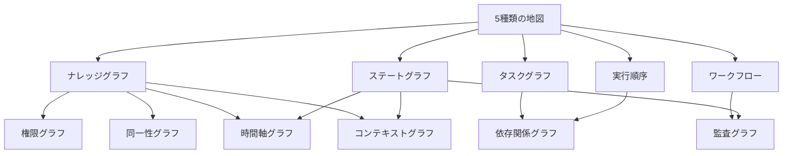
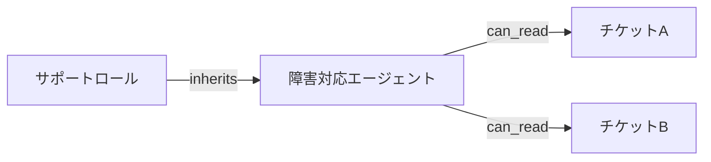
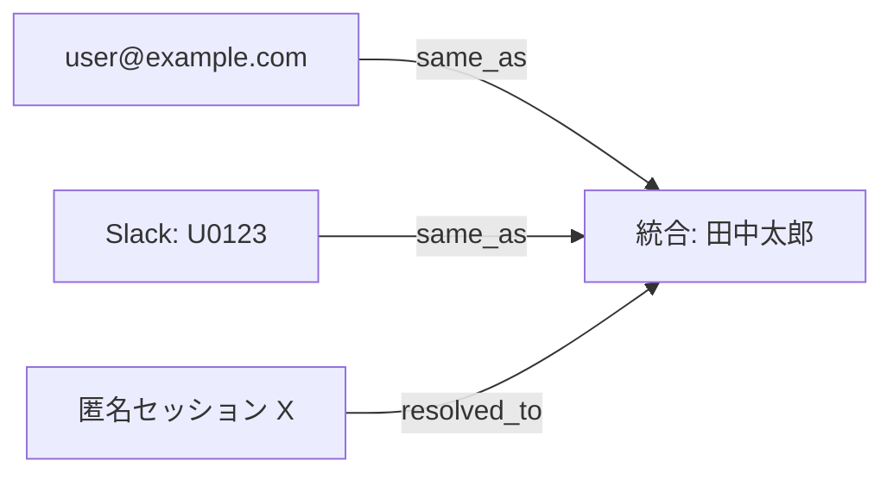
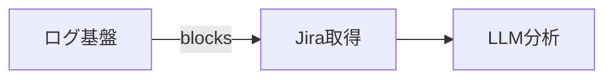
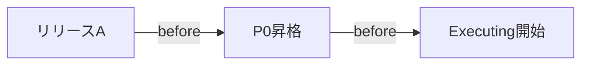
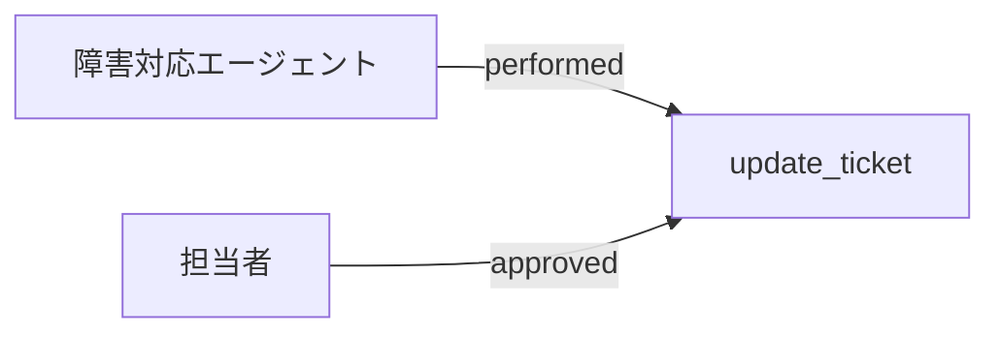

:::message
**本シリーズ 第2部**（全3部）: 第1部「[ナレッジグラフだけじゃない。AIエージェントが使う5種類のグラフ](https://zenn.dev/knowledge_graph/articles/ai-agent-five-graph-types)」で整理した5種類**から派生する特殊化**を扱います。レイヤー間の連携と本番の組み方は第3部（執筆予定）のテーマです。
:::

第1部では、AI エージェント文脈のグラフを 5 種類の役割に分類しました。ナレッジグラフ、タスクグラフ、実行順序グラフ（DAG＝Directed Acyclic Graph、有向非巡回グラフ）、ワークフローグラフ、ステートグラフです。

多くの現場では LangGraph や Neo4j など 1 ツールから始め、5 種類のうち 1 つだけを意識している段階だと思います。本記事は、その次の設計段階を想定しています。第1部の地図の先に、本番のプラットフォームではどんなグラフが増えるかを整理します。

増えるグラフは、第 6 の種類ではありません。5 種類から派生する特殊化です。Node の中身が混ざり始めたとき、用途ごとに切り出すためのカタログです。

第1部では、Obsidian・LLM Wiki・SKILL.md のように **手順・ルール・メモを Markdown で書く** 方法で、5 種類の多くを説明としてカバーできる一方、**Edge の意味を型として持てない** 点を整理しました（[第1部「Markdown ウィキだけでは足りない理由」](https://zenn.dev/knowledge_graph/articles/ai-agent-five-graph-types#markdown-ウィキだけでは足りない理由)）。

本記事の特殊化 6 つも根っこは同じです。Markdown・YAML・ディレクトリ構成（AWS の [AI-DLC Workflows](https://github.com/awslabs/aidlc-workflows) など）は、「関連がある」「この順で読む」「ここで人の承認を挟む」ことは書けます。ただしリンクや並び順は、LLM や実行エンジンから見ると **同じ種類の関係** に見えがちです。特殊化が必要になるのは、**問いごとに Edge の型が違う** ときです。

---

## 特殊化とは

特殊化グラフは、5 種類のいずれかを**用途に特化して切り出した**グラフです。

| 観点 | 5 種類（第1部） | 特殊化（本記事） |
| --- | --- | --- |
| 役割 | 最低限そろえたい**地図** | 本番で**切り出す**ビュー |
| Node | 役割ごとの代表例 | その用途に特化したエンティティ |
| 数え方 | 5 固定 | プラットフォームごとに増える |
| 例 | タスクグラフ全体 | 依存関係だけを独立させたグラフ |

たとえばナレッジグラフに「顧客」「製品」「チケット」を載せているうちは、第1部の分類で十分です。エージェントが増え、誰がどのチケットを見られるかだけが複雑になったら、権限グラフとして切り出す、というイメージです。

:::message
この図は**派生関係**であり、実行順序ではありません。矢印が複数入る特殊化は、複数の基礎種類から派生する、という意味です。
:::

### 論理の切り出しと、実装の分離

第1部と同様、ここまでの話は Node / Edge が何を表すか、という論理の整理です。

権限グラフを切り出すとき、必ずしも Neo4j とは別のグラフ DB を増やす必要はありません。本番では、次のような既存の仕組みが権限の実装になり得ます。

- **IAM**（ユーザーとロールの管理）
- **ACL**（リソース単位のアクセス制御）
- **ポリシーエンジン**（許可ルールを外部ファイルに書き、呼び出しのたびに allow / deny を返す）

ポリシーエンジンの代表例に **Open Policy Agent（OPA）** があります。OPA では **Rego** というポリシー言語でルールを記述します。

いずれの方式でも、ナレッジグラフの検索に「この主体にはこの範囲だけ」という条件を足す分担で成立します。レイヤー配置の具体例は [LLM 依存度を下げる業務 AI アーキテクチャ設計](https://zenn.dev/knowledge_graph/articles/llm-formal-layer-architecture) にまとまっています。

逆に、1 つのグラフ DB に権限 Edge を足し続けると、意味のたどりと許可のたどりが同じ画面に載り、変更の影響範囲が読めなくなります。論理上は分け、実装は既存コンポーネントに載せる、のが現実的な落としどころです。

---

## なぜ切り出すか

5 種類を 1 枚のグラフに載せ続けると、Node の意味が混ざります。

- 「レビュー」Node が、業務ステップ（ワークフロー）なのか、エージェントの Waiting（ステート）なのか
- 「Customer」Node が、意味上の顧客（KG）なのか、アクセス可能なリソース（権限）なのか
- Slack ID とメールアドレスが、同一人物（同一性グラフ）なのか別 Node なのか
- 「ログ検索 → LLM分析」の Edge が、実行順序（DAG）なのか、監査上の記録（監査グラフ）なのか

特殊化は、混ざり始めた Node を用途別に分離する設計判断です。権限・同一性・監査などをナレッジグラフと分けると、クエリやツール呼び出しのたびに「どの意味で読むか」を推測させずに済み、応答と実行の精度が上がりやすくなります。

切り出すタイミングの目安は次のとおりです。

- 1 種類の Node に 2 つの問いが載り始めた
- クエリやポリシーが 1 つのグラフに集中し、変更の影響範囲が読めなくなった
- エージェントが増え、権限・同一性・監査・依存のどれかだけ先に詰まった

### 障害対応エージェントの例

第1部で通し題材にした障害対応（チケット調査・原因特定・修正）を例にすると、次のような順で特殊化が必要になります。

1. **最初:** Neo4j にチケット・製品の関係（KG）、LangGraph で原因特定（ステート + DAG）だけ
2. **権限が先に詰まる:** 部門を跨いだエージェントが、見えてはいけないチケットまで参照する → 権限グラフを切り出す
3. **同一顧客が別チャネルで重複報告:** Slack とメールで同じ障害を報告してきた顧客を別人扱いし、重複チケットが発生 → 同一性グラフを切り出す
4. **依存が見えない:** ログ基盤の障害が原因特定をブロックしているのに、DAG 上は「次の Node に進めない」だけ → 依存関係グラフを切り出す
5. **時系列の説明が必要:** 「いつ P0 に昇格したか」「その直前にどのリリースがあったか」と問われて答えられない → 時間軸グラフを切り出す
6. **あとから:** ツール実行の説明責任、見せる KG 範囲の固定 → 監査グラフ、コンテキストグラフ

6 つ全部を一度に設計する必要はありません。先に詰まった問いから 1 つ足す、という順序が現実的です。試作（PoC）では LangGraph や AI-DLC Workflows のようなファイルベースの制御だけで十分だったのに、本番投入で権限だけ先に破綻する、というパターンがよくあります。

---

## ファイルだけでは足りない理由（特殊化）

ファイル（Markdown・YAML・ディレクトリ構成）は、**人が読む説明文を書くこと**と、**どのファイルをどの順で読むか決めること**には向いています。一方、特殊化が担う問いは、**実行のたびにプログラムが機械的に答える関係**です。第1部の表が「5 種類 × ウィキ」の対比だったのに対し、ここでは **6 つの特殊化 × ファイル** を対比します。

| 特殊化 | ファイルで書けること | ファイルだけでは弱い点 |
| --- | --- | --- |
| 権限グラフ | 「このフォルダはエンジニア向け」などの注釈、README の運用ルール | **誰が・どのリソースを・どの操作まで** 許可されるかを、主体×リソースごとに実行前に評価する |
| 同一性グラフ | 同一人物のメモを 1 ファイルにまとめる、フロントマターに email を書く | Slack ID・メール・CRM ID を **`same_as` / `resolved_to` として名寄せ**し、問い合わせのたびに解決する |
| 依存関係グラフ | ディレクトリの並び、「先に A してから B」の手順書 | **`requires`（前提）と `blocks`（待ち）** を型として分け、サービス横断の影響を traversal で返す |
| 時間軸グラフ | 「Phase 2」見出し、ファイルの更新日時 | **いつ・どの関係が変わったか** をイベントの鎖として保持し、「30 分前に何があったか」に答える |
| 監査グラフ | Markdown 上の承認ゲート、Human-in-the-Loop の手順 | **誰が・いつ・どの tool call を実行したか** を、ワークフロー記録と実行記録で分裂させない |
| コンテキストグラフ | フェーズごとにルール一式を読み込む、プロンプト用 MD を選ぶ | **このターン・この主体に見せる KG の部分** を `includes` / `excludes` として固定する |

ポイントは、ファイルのリンク `[[ノート]]` やディレクトリ順が **「関連」「次に読む」という 1 種類の Edge に見える** ことです。特殊化は、`can_read`・`blocks`・`same_as` のように **Edge に名前（型）を付け、問いごとに分離する** 設計です。Neo4j が必須という意味ではなく、**論理上 Node / Edge の意味を固定する** ことが目的です（実装は IAM やポリシーエンジンに載せてもよい、と「論理の切り出しと、実装の分離」で述べたとおり）。

以下のカタログでは、上表の「弱い点」が障害対応の場面でどう表面化するかを、具体例で見ていきます。

---

## 特殊化カタログ

本記事では、AI プラットフォームでよく登場する 6 つの特殊化を整理します。すべての現場に 6 つ必要なわけではありません。詰まっている用途から 1 つ選んで切り出す、という使い方を想定しています。

| 特殊化 | 主な派生元 | Node | Edge | 主な問い |
| --- | --- | --- | --- | --- |
| 権限グラフ | ナレッジグラフ | 主体・リソース・ロール | 許可・継承 | 誰が何にアクセスできるか |
| 同一性グラフ | ナレッジグラフ | 識別子・チャネル・統合エンティティ | same_as（同一）・resolved_to（名寄せ）・belongs_to_org（所属） | この人／この組織は本当に誰か |
| 依存関係グラフ | タスク・DAG | サービス・作業・成果物 | 依存・ブロック | 何が何を待っているか |
| 時間軸グラフ | ナレッジグラフ・ステート | イベント・状態 | 前後・因果 | いつ何が起きたか |
| 監査グラフ | ワークフロー・ステート | アクション・実行者 | 実行・承認 | 誰がいつ何をしたか |
| コンテキストグラフ | ナレッジグラフ（参照側） | セッション・スコープ | 参照・含有 | この実行で何を見ているか |

以下、各特殊化を同じ型で見ていきます。主な問い → Node / Edge → 障害対応の場面 → 切り出す目安 → 避けたい混在、の順です。

---

## 権限グラフ

**派生元:** ナレッジグラフ

**主な問い:** 誰が何を見られるか

Node は主体（ユーザー、エージェント、ロール）とリソース（チケット、ドキュメント、顧客レコード）。Edge は `can_read` / `can_write` / `inherits` などの許可関係です。

エージェントにツールアクセスを渡すだけだと、権限外のデータまで LLM のコンテキストに入りやすくなります。たとえば障害対応エージェントが、他部門の未公開インシデントを検索結果に含めてしまう、といった事態です。RAG の検索結果を後からフィルタするより、クエリ前に権限条件を注入する設計の方が、情報漏洩のリスクを構造的に下げられます。

経営・コンプライアンスの観点でも、「検索後に除外」より「最初から見せない」方が説明しやすいです。監査で「なぜ LLM がそのデータを見たのか」と問われたとき、権限グラフが先に評価されていれば、根拠を辿れます。実装の具体例は [LLM 依存度を下げる業務 AI アーキテクチャ設計](https://zenn.dev/knowledge_graph/articles/llm-formal-layer-architecture) が手がかりになります。レイヤー配置は第3部（執筆予定）で扱います。

**切り出す目安:** 部門・ロール・テナント（組織・契約単位）を跨いだエージェント運用が始まったとき。ナレッジグラフをたどるたびに、毎回「この人にはこの範囲だけ」という検索条件を足しているなら、権限グラフとして独立させる候補です。

**避けたい混在:** Customer ノードに「意味上の顧客」と「このエージェントが読める顧客」を同じ Node で表すこと。意味は KG、可視性は権限グラフ、と分けます。

---

## 同一性グラフ（Identity Graph）

**派生元:** ナレッジグラフ

**主な問い:** この識別子は本当に誰か（どの組織か）

Node は識別子（メールアドレス、Slack ID、CRM の Contact ID、チャットウィジェットの匿名セッション）と統合エンティティ（1 人の人間、1 つの組織）。Edge は同一（`same_as`）・名寄せ（`resolved_to`）・所属（`belongs_to_org`）です。

障害対応エージェントに問い合わせが来たとき、同じ顧客が Slack で先に報告し、あとからメールでも連絡してくるケースは珍しくありません。同一性グラフがなければ、エージェントはこれを別人の 2 件として扱い、重複対応やコンテキストの断絶が起きます。

マルチチャネル対応のエージェントでは、「この Slack メッセージの送信者は、CRM 上のどの Contact か」をリアルタイムに解決する必要があります。KG に全チャネルの ID を雑に載せると、`Customer` ノードが「意味上の顧客」なのか「特定チャネルのアカウント」なのか曖昧になります。

同一性グラフは名寄せ（複数の ID を「同一の人・組織」と結びつける処理）の結果を構造として保持する役割です。名寄せのロジック自体は ML やルールで実装し、その結果を `same_as` Edge としてグラフに固定します。

**切り出す目安:** エージェントが複数チャネル（メール、チャット、Slack、CRM）から問い合わせを受け、同一人物の判定が必要になったとき。KG の `Customer` ノードにチャネル別の ID を列挙し始めているなら、同一性グラフとして独立させる候補です。

**避けたい混在:** `Customer` ノードに「この人は田中太郎である」（意味）と「このメールアドレスはこの Slack ID と同一人物」（同一性解決）を同じ Edge で表すこと。意味は KG、名寄せは同一性グラフ、と分けます。

---

## 依存関係グラフ

**派生元:** タスクグラフ・実行順序グラフ（DAG）

**主な問い:** 何が完了するまで、何が待たされているか

タスクグラフは「何の作業が必要か」、DAG は「どの順番で実行するか」に答えます。依存関係グラフは、サービスやチーム間のブロック関係に焦点を当てます。Node はサービス、マイクロサービス、作業単位、デプロイ成果物。Edge は `depends_on` / `blocks` / `requires` です。

障害対応で「原因特定」の前に「ログ基盤の復旧」が必要、といった横断的な待ちは、タスクの分解だけでは見えにくくなります。第1部の DAG では Jira取得 → ログ検索 → LLM分析 の順序は固定されていますが、ログ基盤自体が落ちているとき、なぜ Jira取得 の前で止まっているのかは DAG だけでは説明できません。

エージェントが「次に何をすべきか」を LLM に推測させると、ログ基盤の復旧を飛ばして分析を試み、トークンを消費しがちです。ブロック関係を外側に置けば、待つ理由を実行前に固定できます。

**切り出す目安:** エージェントが複数 SaaS や内部 API を連携し、1 つの失敗が連鎖するとき。DAG の Node 列だけでは「なぜ今ここで止まっているか」が説明できない場合です。

**避けたい混在:** DAG の実行順序 Edge と、サービス間の `blocks` を同じグラフに書くこと。順序は DAG、待ちの理由は依存関係グラフ、と分けると変更の影響範囲が読みやすくなります。

---

## 時間軸グラフ

**派生元:** ナレッジグラフ・ステートグラフ

**主な問い:** いつ何が起きたか（関係はいつ変わったか）

ステートグラフは「いまどの状態か」、時間軸グラフは「過去にどう変わってきたか」に答えます。Node はイベントや状態スナップショット、Edge は `before` / `after` / `caused_by` です。

障害対応では、「いつ P0 に昇格したか」「その 30 分前にどのリリースがあったか」といった問いが、原因特定の後半で必ず出てきます。KG に `created_at` プロパティを載せるだけでは、関係の変化（たとえば Issue が Release をブロックし始めた時刻）までは追いにくいです。

エージェントの長時間タスクでは、切断後の再開も時間軸と接続します。ステートグラフが「いま Executing」と言っていても、いつからその状態に入ったかは時間軸グラフの領域です。

**切り出す目安:** 「このチケットはいつ P0 になったか」「リリース A の 30 分前に何が起きたか」といった問いが増えたとき。イベントログを都度 LLM に貼り付けているなら、時系列をグラフとして固定する候補です。

**避けたい混在:** ステートグラフの現在 Node と、履歴全体を同じグラフに詰め込むこと。現在の実行状態はステート、時系列の記録は時間軸、と分担します。

---

## 監査グラフ

**派生元:** ワークフローグラフ・ステートグラフ

**主な問い:** 誰が、いつ、何を実行したか

ワークフローは「次にどこへ進むか」、監査グラフは「誰が進めたか」の記録に答えます。Node はアクション（起票、承認、ツール呼び出し）と実行者（人・エージェント）。Edge は `performed` / `approved` / `delegated` です。

人の承認を挟む運用（Human-in-the-Loop）やエージェントの自律実行が増えると、説明責任の要求が強くなります。障害対応でエージェントが `update_ticket` を呼んだあと、「誰の承認なしにステータスを変えたのか」と問われる場面は、本番運用では珍しくありません。ワークフロー上は「レビュー → 完了」のルールがあっても、エージェントの tool call がその外側で走れば、記録が分裂します。

監査グラフはコンプライアンス対応だけでなく、デバッグと事後分析にも効きます。「Planning から Executing に遷移した直後に、どのツールが呼ばれたか」を追えれば、再現もしやすくなります。

**切り出す目安:** 承認フローとエージェント実行が共存し、後から「誰の判断か」を説明できない場面が出たとき。ワークフローの遷移ログとエージェントの tool call ログを別々に持ち始めているなら、統合の候補です。

**避けたい混在:** ワークフローの「次にどこへ進むか」と、監査の「誰が進めたか」を同じ Edge で表すこと。進行ルールはワークフロー、記録は監査、と分けます。

---

## コンテキストグラフ

**派生元:** ナレッジグラフ（参照・スコープ側）

**主な問い:** この実行で LLM に何を見せるか

最小単位はセッション（1 回の実行・1 ターン）です。マルチエージェントやマルチテナント（組織単位）では、ロール・チーム・テナントごとに見せる範囲が異なる設計もあります。Node はセッション、スコープ、参照対象（KG 上のサブグラフ）。Edge は `includes` / `references` / `excludes` です。

ナレッジグラフ全体を毎回 LLM に渡すわけにはいきません。障害対応でも、サポート担当が見る範囲と、エンジニア向けエージェントが見る範囲は異なります。同じ Issue ノードでも、このターンで渡す近傍サブグラフ（関連チケット 3 件まで、など）を固定しないと、プロンプトが膨らみ、毎回違う断片が入ります。

コンテキストグラフは「このターンで見せる部分」を切り出す役割です。GraphRAG の検索結果の束ね方や、エージェントへの部分グラフの提示と接続します。詳しい設計例は [Claude の外側にコンテキストグラフを置くと、速く・正確に・トークンを抑えられる](https://zenn.dev/knowledge_graph/articles/context-graph-improves-llm) にあります。

**切り出す目安:** 同一 KG から、エージェント・ユーザー・タスクごとに見せる範囲が異なるとき。セッションだけでなく、チームやテナント単位のスコープを毎回手で調整しているなら、コンテキストグラフとして固定する候補です。

**避けたい混在:** KG の意味関係と、「今回の実行で見せるかどうか」を同じ Edge で表すこと。意味は KG、スコープはコンテキストグラフ、と分けます。

---

## 5 種類と特殊化の対応

特殊化を設計するとき、どの基礎種類から派生したかを言えるようにしておくと、第1部の地図と接続したまま拡張できます。

| 基礎種類（第1部） | 混ざりやすい特殊化 | 分離の鍵 |
| --- | --- | --- |
| ナレッジグラフ | 権限・同一性・コンテキスト・時間軸 | 意味 / 可視性 / 名寄せ / スコープ / いつ |
| タスクグラフ | 依存関係 | 作業の前提 / システムのブロック |
| DAG | 依存関係・監査 | 実行順序 / 待ち理由 / 実行記録 |
| ワークフロー | 監査 | 進行ルール / 誰が進めたか |
| ステートグラフ | 時間軸・監査・コンテキスト | 現在 / 履歴・記録・このターンの範囲 |

1 つの Node に上表の「分離の鍵」が 2 列以上載り始めたら、特殊化を検討する、という判断材料になります。

---

## 次に切り出すのはどれか

特殊化は詰まっている問いから選ぶのが現実的です。0〜1 ツールから始めた直後に 6 つ全部は不要です。

| いま困っていること | 切り出す候補 |
| --- | --- |
| エージェントが権限外データを見ている | 権限グラフ |
| 同じ顧客が別チャネルから来ると別人扱いになる | 同一性グラフ |
| 1 つの障害が複数サービスで連鎖する | 依存関係グラフ |
| 「いつから」「その前に何が」が説明できない | 時間軸グラフ |
| 誰が承認・実行したか説明できない | 監査グラフ |
| 同じ KG なのに、セッション・チーム・テナントごとに見せる範囲を毎回手で調整している | コンテキストグラフ |

優先度の目安です。本番投入の初期段階では、権限・同一性・依存のいずれかが先に詰まりやすい印象です（マルチチャネル対応では同一性が権限より先に表面化することもあります）。監査はそのあと、コンテキストと時間軸はエージェントの利用が増え、トークンコストや事後分析の要求が強くなってからで十分なことが多いです。

判断の第一歩は、第1部と同じです。この Node はどの役割か（5 種類のどれか、またはどの特殊化か）と言えるかどうか。名称より、問いが 1 つに絞れているかを見ます。言えなければ、まだ 1 枚に載せすぎているサインです。

---

## 第3部で扱うこと

特殊化を切り出しても、グラフは単体では動きません。本記事はカタログと切り出し基準までです。

レイヤー間をどう接続し、LangGraph・Dify / n8n・Neo4j・権限エンジンを本番でどう配置するかは、シリーズ第3部（執筆予定）のテーマです。形式レイヤ全体の構成は [LLM 依存度を下げる業務 AI アーキテクチャ設計](https://zenn.dev/knowledge_graph/articles/llm-formal-layer-architecture) に、DevRev の実装深度は [DevRev Knowledge Graph アーキテクチャ解剖](https://zenn.dev/knowledge_graph/articles/devrev-kg-architecture-deep-dive) に詳述しています。

---

## まとめ

- 5 種類は地図、本番では特殊化して増える（第 6 の種類ではない）
- 名称より問いごとにグラフを分けると、エージェントの解釈のぶれが減り精度が上がりやすい
- Node に 2 つの問いが載り始めたら、詰まっている用途から 1 つ切り出す
- 論理上は分け、実装は既存コンポーネント（権限エンジン、ワークフローエンジン等）に載せてよい
- 一覧は「特殊化カタログ」、境界は「5 種類と特殊化の対応」表を見る
- レイヤー連携と本番配置は第3部（執筆予定）

---

## 関連記事

| テーマ | 記事 |
| --- | --- |
| 本シリーズ 第1部 | [ナレッジグラフだけじゃない。AIエージェントが使う5種類のグラフ](https://zenn.dev/knowledge_graph/articles/ai-agent-five-graph-types) |
| LLM Wiki とセマンティック層 | [LLM Wiki と Wikipedia／Wikidata：ナラティブ層とセマンティック層の対応関係](https://zenn.dev/knowledge_graph/articles/llm-wiki-wikidata-narrative-semantic) |
| コンテキストグラフ | [Claude の外側にコンテキストグラフを置くと、速く・正確に・トークンを抑えられる](https://zenn.dev/knowledge_graph/articles/context-graph-improves-llm) |
| 形式レイヤ・Workflow Engine | [LLM 依存度を下げる業務 AI アーキテクチャ設計](https://zenn.dev/knowledge_graph/articles/llm-formal-layer-architecture) |
| DevRev KG 実装の深度 | [DevRev Knowledge Graph アーキテクチャ解剖](https://zenn.dev/knowledge_graph/articles/devrev-kg-architecture-deep-dive) |
| 本シリーズ 第3部（執筆予定） | レイヤー連携と本番の組み方 |

---

## 更新履歴

- 2026-07-12: 初版公開

---

## フィードバック受け付け

内容に誤りや追加情報があれば、Zenn のコメントよりお知らせください。
