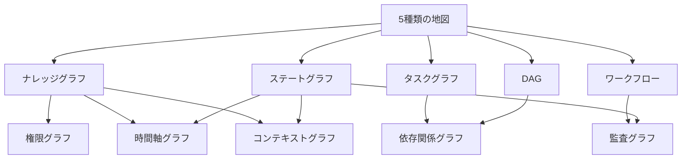
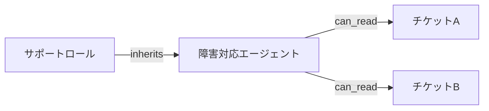
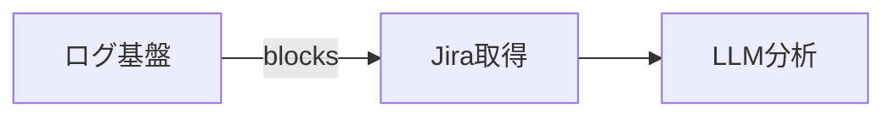

:::message
**本シリーズ 第2部**（全3部）: 第1部「[ナレッジグラフだけじゃない。AIエージェントが使う5種類のグラフ](https://zenn.dev/knowledge_graph/articles/ai-agent-five-graph-types)」で整理した5種類の**特殊化**を扱います。レイヤー間の連携と本番の組み方は第3部（執筆予定）のテーマです。
:::

第1部では、AI エージェント文脈のグラフを **5 種類の役割**に分類しました。ナレッジグラフ、タスクグラフ、実行順序グラフ（DAG）、ワークフローグラフ、ステートグラフです。

多くの現場では LangGraph や Neo4j など **1 ツールから始め**、5 種類のうち 1 つだけを意識している段階だと思います。本記事は、その次の設計段階を想定しています。第1部の地図の先に、本番のプラットフォームではどんなグラフが増えるかを整理します。

増えるグラフは、第 6 の種類ではありません。**5 種類の特殊化**です。Node の中身が混ざり始めたとき、用途ごとに切り出すためのカタログです。

---

## 特殊化とは

特殊化グラフは、5 種類のいずれかを**用途に特化して切り出した**グラフです。

| 観点 | 5 種類（第1部） | 特殊化（本記事） |
| --- | --- | --- |
| 役割 | 最低限そろえたい**地図** | 本番で**切り出す**ビュー |
| Node | 役割ごとの代表例 | その用途に特化したエンティティ |
| 数え方 | 5 固定 | プラットフォームごとに増える |
| 例 | タスクグラフ全体 | 依存関係だけを独立させたグラフ |

たとえばナレッジグラフに「顧客」「製品」「チケット」を載せているうちは、第1部の分類で十分です。エージェントが増え、**誰がどのチケットを見られるか**だけが複雑になったら、権限グラフとして切り出す、というイメージです。

:::message
この図は**派生関係**であり、実行順序ではありません。矢印が複数入る特殊化は、複数の基礎種類から派生する、という意味です。
:::

### 論理の切り出しと、実装の分離

第1部と同様、ここまでの話は **Node / Edge が何を表すか** という論理の整理です。権限グラフを切り出すとき、必ずしも Neo4j とは別のグラフ DB を増やす必要はありません。IAM、OPA、社内の ACL サービスが権限の実装になり、ナレッジグラフのクエリに条件を注入する、という分担でも成立します。

逆に、1 つの Property Graph に権限 Edge を足し続けると、意味の traversals と許可の traversals が同じ画面に載り、変更の影響範囲が読めなくなります。**論理上は分け、実装は既存コンポーネントに載せる**のが現実的な落としどころです。

---

## なぜ切り出すか

5 種類を 1 枚のグラフに載せ続けると、Node の意味が混ざります。

- 「レビュー」Node が、業務ステップ（ワークフロー）なのか、エージェントの Waiting（ステート）なのか
- 「Customer」Node が、意味上の顧客（KG）なのか、アクセス可能なリソース（権限）なのか
- 「ログ検索 → LLM分析」の Edge が、実行順序（DAG）なのか、監査上の記録（監査グラフ）なのか

特殊化は、**混ざり始めた Node を用途別に分離する**設計判断です。新しいグラフ DB を増やす必要は必ずしもありません。論理上の役割を分け、実装を別コンポーネントに割り当てる、という整理でも成立します。

切り出すタイミングの目安は次のとおりです。

- 1 種類の Node に**2 つの問い**が載り始めた
- クエリやポリシーが**1 つのグラフに集中**し、変更の影響範囲が読めなくなった
- エージェントが増え、**権限・監査・依存**のどれかだけ先に詰まった

### 障害対応エージェントの例

第1部の障害対応を例にすると、次のような順で特殊化が必要になります。

1. **最初:** Neo4j にチケット・製品の関係（KG）、LangGraph で原因特定（ステート + DAG）だけ
2. **権限が先に詰まる:** 部門を跨いだエージェントが、見えてはいけないチケットまで参照する → **権限グラフ**を切り出す
3. **依存が見えない:** ログ基盤の障害が原因特定をブロックしているのに、DAG 上は「次の Node に進めない」だけ → **依存関係グラフ**を切り出す
4. **あとから:** 「誰がいつツールを実行したか」の説明責任、見せる KG の範囲の固定 → **監査グラフ**、**コンテキストグラフ**

5 つ全部を一度に設計する必要はありません。**先に詰まった問い**から 1 つ足す、という順序が現実的です。PoC では LangGraph だけで十分だったのに、本番投入で権限だけ先に破綻する、というパターンがよくあります。

---

## 特殊化カタログ

本記事では、AI プラットフォームでよく登場する **5 つの特殊化**を整理します。すべての現場に 5 つ必要なわけではありません。詰まっている用途から 1 つ選んで切り出す、という使い方を想定しています。

| 特殊化 | 主な派生元 | Node | Edge | 主な問い |
| --- | --- | --- | --- | --- |
| 権限グラフ | ナレッジグラフ | 主体・リソース・ロール | 許可・継承 | 誰が何にアクセスできるか |
| 依存関係グラフ | タスク・DAG | サービス・作業・成果物 | 依存・ブロック | 何が何を待っているか |
| 時間軸グラフ | ナレッジグラフ・ステート | イベント・状態 | 前後・因果 | いつ何が起きたか |
| 監査グラフ | ワークフロー・ステート | アクション・実行者 | 実行・承認 | 誰がいつ何をしたか |
| コンテキストグラフ | ナレッジグラフ（参照側） | セッション・スコープ | 参照・含有 | この実行で何を見ているか |

以下、各特殊化を順に見ていきます。障害対応の例を通し、第1部の 5 種類との境界も示します。

---

## 権限グラフ

**派生元:** ナレッジグラフ（主）

ナレッジグラフが「何が存在し、どう関連しているか」を表すのに対し、権限グラフが答えるのは「**誰が何を見られるか**」です。Node は主体（ユーザー、エージェント、ロール）、リソース（チケット、ドキュメント、顧客レコード）、Edge は `can_read` / `can_write` / `inherits` などの許可関係です。

エージェントにツールアクセスを渡すだけだと、権限外のデータまで LLM のコンテキストに入りやすくなります。たとえば障害対応エージェントが、他部門の未公開インシデントを検索結果に含めてしまう、といった事態です。RAG の検索結果を後からフィルタするより、**クエリ前に権限条件を注入する**設計の方が、情報漏洩のリスクを構造的に下げられます。

経営・コンプライアンスの観点でも、「検索後に除外」より「最初から見せない」方が説明しやすいです。監査で「なぜ LLM がそのデータを見たのか」と問われたとき、権限グラフが先に評価されていれば、根拠を辿れます。実装パターンは [LLM 依存度を下げる業務 AI アーキテクチャ設計](https://zenn.dev/knowledge_graph/articles/llm-formal-layer-architecture) および第3部（執筆予定）で扱います。

**切り出す目安:** 部門・ロール・テナントを跨いだエージェント運用が始まったとき。ナレッジグラフをたどるたびに、毎回 `WHERE` 相当の権限条件を足しているなら、権限グラフとして独立させる候補です。

**避けたい混在:** Customer ノードに「意味上の顧客」と「このエージェントが読める顧客」を同じ Node で表すこと。意味は KG、可視性は権限グラフ、と分けます。

---

## 依存関係グラフ

**派生元:** タスクグラフ・実行順序グラフ（DAG）

タスクグラフが「何の作業が必要か」、DAG が「処理をどの順番で実行するか」を表すのに対し、依存関係グラフが答えるのは「**何が完了するまで、何が待たされているか**」です。Node はサービス、マイクロサービス、作業単位、デプロイ成果物。Edge は `depends_on` / `blocks` / `requires` です。

障害対応で「原因特定」の前に「ログ基盤の復旧」が必要、といった**横断的な待ち**は、タスクの分解だけでは見えにくくなります。第1部の DAG では Jira取得 → ログ検索 → LLM分析 の順序は固定されていますが、ログ基盤自体が落ちているとき、**なぜ Jira取得 の前で止まっているのか**は DAG だけでは説明できません。依存関係グラフは、作業の前提ではなく**システム・チーム間のブロック**を明示する用途です。

エージェントが「次に何をすべきか」を LLM に推測させると、ログ基盤の復旧を飛ばして分析を試み、トークンを消費しがちです。ブロック関係を外側に置けば、**待つ理由**を実行前に固定できます。

**切り出す目安:** エージェントが複数 SaaS や内部 API を連携し、1 つの失敗が連鎖するとき。DAG の Node 列だけでは「なぜ今ここで止まっているか」が説明できない場合です。

**避けたい混在:** DAG の実行順序 Edge と、サービス間の `blocks` を同じグラフに書くこと。順序は DAG、待ちの理由は依存関係グラフ、と分けると変更の影響範囲が読みやすくなります。

---

## 時間軸グラフ

**派生元:** ナレッジグラフ・ステートグラフ

ナレッジグラフのスナップショットだけでは「**いつ**その関係が成立したか」が弱くなります。時間軸グラフは、イベント、状態の変化、リリース、障害発生などを**時系列**で保持します。Node はイベントや状態スナップショット、Edge は `before` / `after` / `caused_by` です。

ステートグラフが「いま Planning か Executing か」を追うのに対し、時間軸グラフは「**過去にどう遷移してきたか**」を追います。障害対応では、「いつ P0 に昇格したか」「その 30 分前にどのリリースがあったか」といった問いが、原因特定の後半で必ず出てきます。KG に `created_at` プロパティを載せるだけでは、**関係の変化**（たとえば Issue が Release をブロックし始めた時刻）までは追いにくいです。

エージェントの長時間タスクでは、切断後の再開も時間軸と接続します。ステートグラフが「いま Executing」と言っていても、**いつからその状態に入ったか**は時間軸グラフの領域です。

**切り出す目安:** 「このチケットはいつ P0 になったか」「リリース A の 30 分前に何が起きたか」といった問いが増えたとき。イベントログを都度 LLM に貼り付けているなら、時系列をグラフとして固定する候補です。

**避けたい混在:** ステートグラフの現在 Node と、履歴全体を同じグラフに詰め込むこと。現在の実行状態はステート、時系列の記録は時間軸、と分担します。

---

## 監査グラフ

**派生元:** ワークフローグラフ・ステートグラフ

ワークフローが「業務をどう進めるか」を表すのに対し、監査グラフが答えるのは「**誰が、いつ、何を実行したか**」です。Node はアクション（起票、承認、ツール呼び出し）、実行者（人・エージェント）、Edge は `performed` / `approved` / `delegated` です。

Human-in-the-Loop やエージェントの自律実行が増えると、**説明責任**の要求が強くなります。障害対応でエージェントが `update_ticket` を呼んだあと、「誰の承認なしにステータスを変えたのか」と問われる場面は、本番運用では珍しくありません。ワークフロー上は「レビュー → 完了」のルールがあっても、エージェントの tool call がその外側で走れば、**記録が分裂**します。

監査グラフはコンプライアンス対応だけでなく、**デバッグと事後分析**にも効きます。「Planning から Executing に遷移した直後に、どのツールが呼ばれたか」を追えれば、再現もしやすくなります。

**切り出す目安:** 承認フローとエージェント実行が共存し、後から「誰の判断か」を説明できない場面が出たとき。ワークフローの遷移ログとエージェントの tool call ログを別々に持ち始めているなら、統合の候補です。

**避けたい混在:** ワークフローの「次にどこへ進むか」と、監査の「誰が進めたか」を同じ Edge で表すこと。進行ルールはワークフロー、記録は監査、と分けます。

---

## コンテキストグラフ

**派生元:** ナレッジグラフ（参照・スコープ側）

エージェントの 1 回の実行で LLM が参照する範囲を、**セッション単位でスコープ化**するのがコンテキストグラフです。Node はセッション、スコープ、参照対象（KG 上のサブグラフ）、Edge は `includes` / `references` / `excludes` です。

ナレッジグラフ全体を毎回 LLM に渡すわけにはいきません。障害対応でも、サポート担当が見る範囲と、エンジニア向けエージェントが見る範囲は異なります。同じ Issue ノードでも、**このターンで渡す近傍サブグラフ**（関連チケット 3 件まで、など）を固定しないと、プロンプトが膨らみ、毎回違う断片が入ります。

コンテキストグラフは「**このターンで見せる部分**」を切り出す役割です。GraphRAG の検索結果の束ね方や、エージェントへの部分グラフの提示と接続します。詳細は [Claude の外側にコンテキストグラフを置くと、速く・正確に・トークンを抑えられる](https://zenn.dev/knowledge_graph/articles/context-graph-improves-llm) を参照してください。

**切り出す目安:** 同一 KG から、エージェント・ユーザー・タスクごとに**見せる範囲が異なる**とき。プロンプトに毎回長いコンテキストを手で貼っているなら、スコープをグラフとして固定する候補です。

**避けたい混在:** KG の意味関係と、「今回の実行で見せるかどうか」を同じ Edge で表すこと。意味は KG、スコープはコンテキストグラフ、と分けます。

---

## 5 種類と特殊化の対応

特殊化を設計するとき、**どの基礎種類から派生したか**を言えるようにしておくと、第1部の地図と接続したまま拡張できます。

| 基礎種類（第1部） | 混ざりやすい特殊化 | 分離の鍵 |
| --- | --- | --- |
| ナレッジグラフ | 権限・コンテキスト・時間軸 | 意味 / 可視性 / スコープ / いつ |
| タスクグラフ | 依存関係 | 作業の前提 / システムのブロック |
| DAG | 依存関係・監査 | 実行順序 / 待ち理由 / 実行記録 |
| ワークフロー | 監査 | 進行ルール / 誰が進めたか |
| ステートグラフ | 時間軸・監査・コンテキスト | 現在 / 履歴・記録・このターンの範囲 |

1 つの Node に上表の「分離の鍵」が 2 列以上載り始めたら、特殊化を検討する、という判断材料になります。

---

## 次に切り出すのはどれか

特殊化は**詰まっている問い**から選ぶのが現実的です。0〜1 ツールから始めた直後に 5 つ全部は不要です。

| いま困っていること | 切り出す候補 |
| --- | --- |
| エージェントが権限外データを見ている | 権限グラフ |
| 1 つの障害が複数サービスで連鎖する | 依存関係グラフ |
| 「いつから」「その前に何が」が説明できない | 時間軸グラフ |
| 誰が承認・実行したか説明できない | 監査グラフ |
| 同じ KG なのに見せる範囲を毎回手で調整している | コンテキストグラフ |

優先度の目安です。本番投入の初期段階では、**権限 → 依存 → 監査**の順で詰まりやすい印象です。コンテキストと時間軸は、エージェントの利用が増え、トークンコストや事後分析の要求が強くなってからで十分なことが多いです。

判断の第一歩は、第1部と同じです。**この Node は 5 種類のどれか、またはどの特殊化か**と言えるかどうか。言えなければ、まだ 1 枚に載せすぎているサインです。

---

## 第3部で扱うこと

特殊化を切り出しても、グラフは**単体では動きません**。本記事はカタログと切り出し基準までです。

レイヤー間をどう接続し、LangGraph・Dify / n8n・Neo4j・権限エンジンを本番でどう配置するかは、シリーズ第3部（執筆予定）のテーマです。形式レイヤ全体の構成は [LLM 依存度を下げる業務 AI アーキテクチャ設計](https://zenn.dev/knowledge_graph/articles/llm-formal-layer-architecture)、具体製品の深度は [DevRev Knowledge Graph アーキテクチャ解剖](https://zenn.dev/knowledge_graph/articles/devrev-kg-architecture-deep-dive) を参照してください。

---

## まとめ

- 5 種類は地図、本番では**特殊化**して増える（第 6 の種類ではない）
- Node に 2 つの問いが載り始めたら、詰まっている用途から 1 つ切り出す
- 論理上は分け、実装は既存コンポーネント（IAM、Workflow Engine 等）に載せてよい
- 詳細な一覧は**特殊化カタログ**、基礎種類との境界は**5 種類と特殊化の対応**表を参照
- レイヤー連携と本番配置は第3部（執筆予定）

---

## 関連記事

| テーマ | 記事 |
| --- | --- |
| 本シリーズ 第1部 | [ナレッジグラフだけじゃない。AIエージェントが使う5種類のグラフ](https://zenn.dev/knowledge_graph/articles/ai-agent-five-graph-types) |
| コンテキストグラフ | [Claude の外側にコンテキストグラフを置くと、速く・正確に・トークンを抑えられる](https://zenn.dev/knowledge_graph/articles/context-graph-improves-llm) |
| 形式レイヤ・Workflow Engine | [LLM 依存度を下げる業務 AI アーキテクチャ設計](https://zenn.dev/knowledge_graph/articles/llm-formal-layer-architecture) |
| DevRev KG 実装の深度 | [DevRev Knowledge Graph アーキテクチャ解剖](https://zenn.dev/knowledge_graph/articles/devrev-kg-architecture-deep-dive) |
| 本シリーズ 第3部（執筆予定） | レイヤー連携と本番の組み方 |

---

## 更新履歴

- 2026-07-10: 初版公開

---

## フィードバック受け付け

内容に誤りや追加情報があれば、Zenn のコメントよりお知らせください。
