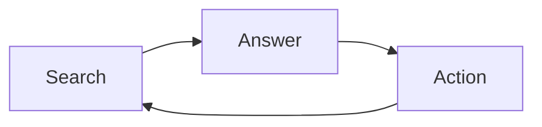
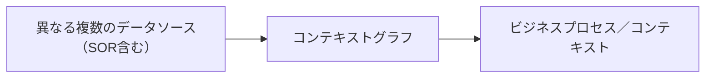
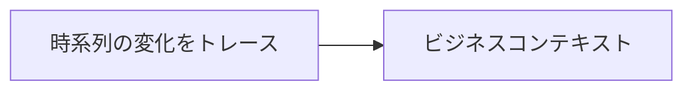

# AIエンジニアのマインドセット：AIの仕事は「Connecting the Dots」

## 背景

自分は速くなったがチームの出荷は変わらない、チャットAIを入れたが成果が見えない——心当たりはないだろうか。AIの進化により、多くの企業が「AIを導入すれば生産性が上がる」と考えていますが、実際の現場では、単にチャットAIやプロンプトベースのエージェントを導入しても、期待した価値が出ないケースが少なくありません。背景やデータは[「GenAI Divide」とナレッジグラフ](https://zenn.dev/knowledge_graph/articles/genai-divide-knowledge-graph)に譲ります。

理由はシンプルです。**AIは会話ができるだけでは価値にならないからです。** 重要なのは、AIがビジネスの文脈を理解できること、そして**業務プロセスそのものが AI で処理しやすい形になっているか**です。

本記事では、AIエンジニアを「**組織の Change Agent（変革の担い手）**」として位置づけ、AI ができない仕事やプロセスは何かが正しくないという視点と、その先にある **Connecting the Dots** のマインドセットを述べます。まず仕事の本質（Search → Answer → Action）と「点をつなぐ」意味を整理し、そのうえで市場が何をどう評価しているかにも触れます。**本記事では Search → Answer → Action と、その点と点（Dots）をつなぐことを一つの地図として使います。**

---

## 仕事は Search から始まる——人間も AI も同じ

すべての人間が、仕事で問題にぶつかったとき、まず**現状把握や理想像のための情報収集（Search）** を行います。脳内の記憶をたどることも、外部のデータを調べることも、広い意味では Search です。Search の結果、**Answer（答え・判断）** を出し、そのあと **Action（実行）** によって問題を解決します。この **Search → Answer → Action** の流れは、人間でも AI でも同じです。

**このサイクルを速く・確実に回すことが、組織の成長につながります。** 本記事のキーワードである **Connecting the Dots** とは、このサイクルのそれぞれの「点」——異なるデータソース、時系列、変更履歴、関係性——をつなぐことです。人間の「アハ体験」や、英語でいう **Wow Moment** も、点と点がつながる瞬間に起きます（ナレッジグラフとひらめきの文脈では[AI とナレッジグラフのニューカマーズ](https://zenn.dev/knowledge_graph/articles/kg-ai-newcomers-chaos-2025)でも触れています）。仕事における Search・Answer・Action の点と点をつなぐことで、AI は初めてビジネスの中で価値を生み出します。営業やサポートなどの Sales Cycle に組み込む場合も、単体の AI ではなく、複数のボットやエージェントがこのサイクルをつなぐ形で連携することが想定されます。

---

## Conversational AI だけでは価値にならない——Context Graph へ

多くの AI プロダクトは Chat / Prompt / Bot といった **Conversational AI** を中心に設計されています。便利ですが、本質的な問題は **Context が欠けている** ことです。企業のデータは分散したまま互いに関係づけられておらず、[RAG を超える知識統合](https://zenn.dev/knowledge_graph/articles/beyond-rag-knowledge-graph)で触れる「情報の断片化・関係性の欠如」と同根です。

本記事では、その「関係」と「変化」を表現するモデルを **Context Graph（コンテキストグラフ）** と呼びます（一般用語ではありません。ビジネスの意味関係と変化をグラフで接続したもの）。

意味レイヤとしての位置づけや実装の考え方（ナレッジグラフ・グラフ DB による関係と推論）は、[ナレッジグラフ入門](https://zenn.dev/knowledge_graph/articles/knowledge-graph-intro)、[RAG を超える知識統合](https://zenn.dev/knowledge_graph/articles/beyond-rag-knowledge-graph)、[RAG なしで始めるナレッジグラフ QA](https://zenn.dev/knowledge_graph/articles/kg-no-rag-starter) に譲ります。

---

## Context は「変化」から生まれる

もう一つ重要なのが **時間** です。ビジネスの文脈は静的ではありません。人間も AI も、**「変化」を意識することで、より具体的なコンテキストを把握できます。**

例えば「今の社長は誰か」という**その時点のスナップショット**だけを見るより、「その社長がどういう経歴・実績で就任したか」「前社長は何がどうなって交代したか」という**変化の履歴（Change Trace）** を得たほうが、コンテキストは明確になります。AI においても、この**変化の情報をコンテキストに含めること**が重要です。

- Time Series（時系列）
- Memory（過去のスナップショット）
- Change Trace（何がいつ、なぜ変わったか）

こうした**変化のコンテキストをグラフネットワークで接続する**のが、本記事でいう Context Graph です。

---

## AIエンジニアは Change Agent である

AI が「できない仕事」や「うまく回らないプロセス」に直面したとき、**その仕事やプロセスそのものが、AI 時代の To-Be と照らして正しいか**を問う必要があります。AIエンジニアに求められるのは、モデルの精度だけでなく、**組織のプロセスとデータのあり方を「AI が処理しやすい形」に変えていく Change Agent としての役割**です。

そのために有効なのが、**To-Be 像を明確にし、現時点との GAP を可視化し、その GAP を AI で補完する**という流れです。ゴール設計やインパクトの選定については[AI 生産性を整理する](https://zenn.dev/knowledge_graph/articles/understanding-ai-productivity-organization-2026-02)・[AI POC の成功・失敗基準](https://zenn.dev/knowledge_graph/articles/ai-poc-success-failure-criteria-2026)も参照してください。現状の業務をそのままチャットやプロンプトで包んでも、得られるのは「フレキシブルな RPA」程度に留まることが多いです。RAG の限界（「検索する AI」の枠、関係性・推論の制約）は[RAG を超える知識統合](https://zenn.dev/knowledge_graph/articles/beyond-rag-knowledge-graph)で詳述します。本当の価値は、**定型業務の先に「次に何をすべきか」を考えられるコンテキスト**を用意することにあります。

---

## 市場が示す「効率化の10%」と「本当の成功」の差

一般的には「AI が流行っているから、AI をやれば伸びる」と思いがちです。しかし市場データはそう単純ではありません。

[SaaStr の分析](https://www.saastr.com/the-performing-major-b2b-stocks-of-2025-what-the-ai-divide-tells-us-about-the-future-of-saas/)によれば、2025 年時点の B2B 市場では**二極化**が起きています。AI インフラ・データ基盤を前面に出す企業（Palantir +142%、Cloudflare +80%、MongoDB +70%、Snowflake +45〜50% など）に加え、**AI で必須となるセキュリティ**を担う企業（CrowdStrike +50%、Zscaler +70%、Palo Alto Networks +20% など）も株価が急伸しています。一方、従来型のエンタープライズ SaaS に位置づく企業（HubSpot -51%、GitLab -32%、Adobe -35%、Atlassian -32%、Salesforce -31%、Asana -31%、ServiceNow -26% など）では株価調整が目立っています。市場がみているのは、**その企業がエンタープライズ SaaS としての成長期待に織り込まれているか、それともデータ・AI インフラあるいはセキュリティなど AI 時代に不可欠な領域として位置づけられているか**という違いです。データ・コンテキストを基盤に置く設計が、市場から期待されているとも言えます。

本当に成果を出している企業は、数十％の効率化ではなく**数倍から数十倍の成長や生産性変化**を狙っています。米国では AI 導入により人員削減を表明する企業も出てきています（例：Salesforce が 2025 年、AI により約 4,000 人規模の削減を表明）。経営層向け調査でも、すでに AI により人員削減を実施した企業が約 3 割にのぼるという結果があります。

**したがって、「AI で業務効率化を数十％」にとどまる設計は、市場が評価する意味での成功とは言えません。** 本記事で述べたように、To-Be（あるべき姿）を明確にし、現状との GAP を可視化したうえで、その GAP を AI で補完する——つまり Dots をつなぐ——設計にすると、成果が格段に跳ね上がる可能性があります。

### 「AIエージェント」と名乗っていても、提供するレイヤーは違う

多くのベンダーが「AIエージェント」を掲げていますが、**何を提供しているかは企業ごとに異なります。** 分析では、おおまかに (1) インフラ・データ層、(2) インテリジェンス層（LLM・API）、(3) オーケストレーション・アプリ層に分けて整理されます（詳細は Logic の[エージェントプラットフォーム評価](https://logic.inc/resources/ai-agent-platforms)、Rōnin Consulting の[AI Agent Stack](https://www.ronin.consulting/artificial-intelligence/ai-agent-stack/)を参照）。

- **モデル・API とエンタープライズ基盤**：OpenAI Frontier、Anthropic のエンタープライズ向けエージェント（Cowork）、Perplexity Computer など、2026 年時点で各社がビジネスコンテキストと既存システムの接続を訴求しています。いずれも「既存 SaaS にチャットを載せただけ」ではなく、エージェント基盤・オーケストレーションで差別化する位置づけです。
- **既存 SaaS にエージェント機能を載せる形**：Salesforce の Agentforce、ServiceNow の AI Agents などは、CRM や ITSM の上にエージェントを載せた製品です。**「AIエージェント」を出していても、提供するレイヤー（データ・インフラ層で価値を出しているか、既存の席単価型 SaaS の延長か）で、市場の評価は分かれます**（株価の二極化は前節の SaaStr 分析を参照）。

この違いを押さえておくことは、AI エンジニアが「どのレイヤーに Dots を置き、どこを自社でつなぐか」を判断するうえで重要です。

---

## RPA の次：定型の先を考える

これまで RPA で業務自動化を行ってきた企業も少なくありません。それを、チャットやプロンプトで AI エージェントが処理する形に置き換えるだけでは、Change Agent の節で触れた**「フレキシブルな RPA」止まり**で、十分とは言えません。Context Graph を持つことで、**定型業務の次に求められる業務が何か**を考え、Search → Answer → Action のサイクルを設計しやすくなります。その先の「理解する AI」やナレッジグラフによる推論は[RAG を超える知識統合](https://zenn.dev/knowledge_graph/articles/beyond-rag-knowledge-graph)を参照してください。

---

## イノベーターとしての AI エンジニア

Everett Rogers の『イノベーションの普及』（Diffusion of Innovations）によれば、新しい技術やアイデアの採用者には段階があります。**Innovators（イノベーター）は全体の約 2.5％**、その次に来る **Early Adopters（アーリーアダプター）は約 13.5％** とされています（Rogers の区分の通り）。組織でいえば、100 人に 2〜3 人がイノベーター、十数％がアーリーアダプター程度です。

**AI エンジニアに求められるポジションは、まさにこの Innovator です。** To-Be と GAP を可視化し、プロセスとデータを「AI が処理しやすい形」に変え、Search → Answer → Action の点と点をつなぐ——その役割は、組織のなかで最も早く変化を受け入れ、技術と事業の両方を見る Change Agent そのものです。だからこそ、**組織の To-Be と GAP を可視化し、どこに Dots を置くかを提案する** Change Agent の役割が、イノベーターとしての AI エンジニアに求められます。

---

## AI エンジニアに必要な視点

AI エンジニアに必要なのは、モデルの精度だけではありません。むしろ重要なのは、本記事で述べた **Context Graph と「変化」の追跡**に集約される視点——データ構造・データの関係・時系列・コンテキスト——です。AI を「チャットボット」として作るのではなく、**ビジネスのコンテキストを構築するシステム**として設計する必要があります。Context Graph の第一歩は、関係性の可視化や時系列・Change Trace の取り込みなどで、実装の詳細は[RAG なしで始めるナレッジグラフ QA](https://zenn.dev/knowledge_graph/articles/kg-no-rag-starter)を参照してください。**まず何をするか**であれば、[AI 生産性を整理する](https://zenn.dev/knowledge_graph/articles/understanding-ai-productivity-organization-2026-02)の L6 から始めるか、[RAG なしで始めるナレッジグラフ QA](https://zenn.dev/knowledge_graph/articles/kg-no-rag-starter)で Dots の試し方から、のどちらかで一歩を踏み出すとよいでしょう。

---

## まとめ

- AI の価値は「会話」ではなく**ビジネス文脈の理解**と、**Search → Answer → Action のサイクルを速く回すこと**にある。
- AI エンジニアの仕事はモデルづくりではなく、**Connecting the Dots**——異なるデータソース、時系列、変更履歴、関係性をつなぎ、AI に文脈を与えることである。
- AI ができない仕事やプロセスは、**その設計が To-Be と照らして正しくない**可能性がある。AI エンジニアは **Change Agent** として、To-Be と GAP を可視化し、AI で補完する形を提案する。
- 本当の成功は「数十％の効率化」ではなく数倍〜数十倍の設計にあり、市場データもそれを反映している。
- イノベーター（約 2.5％）・アーリーアダプター（約 13.5％）という役割が、AI エンジニアに期待されるポジションである。

**AI エンジニアの仕事とは、AI に文脈を与え、組織の変化を先導することなのです。**

---

## 更新履歴

- 2025-03-06: 初版作成（下書き）

## 参考文献

- Everett M. Rogers, _Diffusion of Innovations_, 5th ed., Simon and Schuster, 2003.（イノベーター 2.5%、アーリーアダプター 13.5% 等） https://www.simonandschuster.com/books/Diffusion-of-Innovations-5th-Edition/Everett-M-Rogers/9780743222099
- SaaStr, "The Great B2B Bifurcation of 2025: Why Some SaaS Stocks Are Up 142% While Others Are Down 51%," 2025. https://www.saastr.com/the-performing-major-b2b-stocks-of-2025-what-the-ai-divide-tells-us-about-the-future-of-saas/
- CNBC, "Salesforce CEO confirms 4,000 layoffs 'because I need less heads' with AI," Sep 2025. https://www.cnbc.com/2025/09/02/salesforce-ceo-confirms-4000-layoffs-because-i-need-less-heads-with-ai.html
- Chief Executive, "C-Suite Survey Finds AI Already Cutting Jobs At One-Third Of Companies," 2025. https://chiefexecutive.net/c-suite-survey-finds-ai-already-cutting-jobs-at-one-third-of-companies-even-as-hiring-rebounds/

- Logic, "Evaluating AI Agent Platforms: What Engineering Teams Need for Production." https://logic.inc/resources/ai-agent-platforms
- Rōnin Consulting, "The AI Agent Stack - Where does SaaS Fit?" https://www.ronin.consulting/artificial-intelligence/ai-agent-stack/
- Reuters, "OpenAI unveils AI agent service as part of push to attract businesses," Feb 2026. https://www.reuters.com/business/finance/openai-unveils-ai-agent-service-part-push-attract-businesses-2026-02-05/
- Technology.org, "Anthropic wants to replace your entire office with AI agents, one plug-in at a time," Feb 2026. https://www.technology.org/2026/02/25/anthropic-wants-to-replace-your-entire-office-with-ai-agents-one-plug-in-at-a-time/
- VentureBeat, "Perplexity launches 'Computer' AI agent that coordinates 19 models, priced at $200 a month," Feb 2026. https://venturebeat.com/ai/perplexity-launches-computer-ai-agent-that-coordinates-19-models-priced-at/

誤りや追加したい情報がありましたら、Zenn のコメントでお知らせください。
