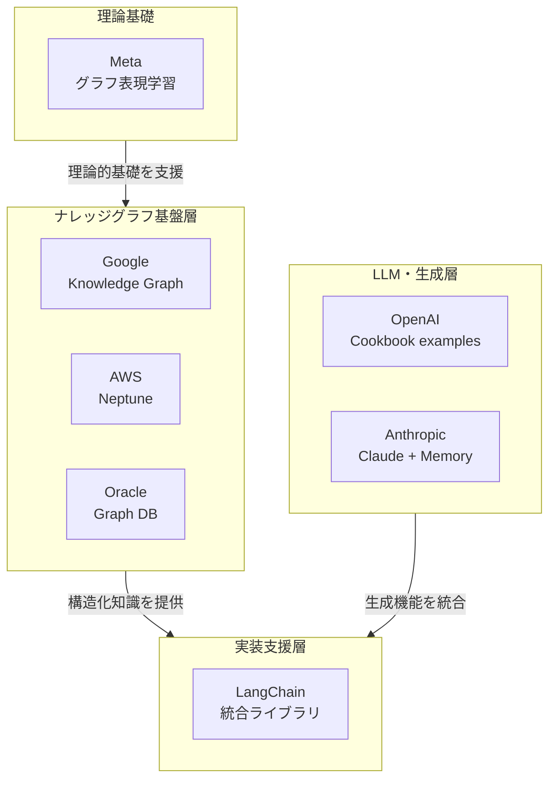

※本記事では「ナレッジグラフ（Knowledge Graph）」に焦点を当てています。
「GraphRAG」はナレッジグラフを検索補強に利用する**手法**であり、本記事で扱うナレッジグラフは企業の**知識基盤そのもの**です。
詳細な比較については「[RAG を超える知識統合 ── ナレッジグラフで"つながる推論"を実現する](https://zenn.dev/knowledge_graph/articles/beyond-rag-knowledge-graph.md)」をご参照ください。

---

## はじめに

生成 AI が普及した現在、単に「LLM に文書を読ませる」だけでは、精度や再現性には限界があります。その背景には、知識の構造が失われていることがあります。

多くの企業や OSS プロジェクトは今、知識を関係性を保ったまま構造化・更新・再利用する仕組み ── つまり**ナレッジグラフ（Knowledge Graph）**に再び注目しています。

本記事では、Google、AWS、Oracle、OpenAI、Anthropic、Meta、LangChain、n8n といった主要プレイヤーが、どのようにナレッジグラフを扱っているのかを整理します。

目的は、各社の取り組みの**多様性と実態**を明確にすることです。

---

## Google：検索と生成を支える長期的知識基盤

Google は 2012 年に Knowledge Graph を検索へ導入し、"Things, not strings"（「文字列ではなく実体を」）という理念のもと、単なるキーワードマッチングから、**実体（エンティティ）と関係（リレーション）**で世界を表現する検索へと進化させました。
• 公式発表: https://blog.google/products/search/introducing-knowledge-graph-things-not/
• 開発者向け Google Knowledge Graph Search API: https://cloud.google.com/enterprise-knowledge-graph/docs/search-api
• 企業向け Vertex AI Search（エンティティ抽出・リンク付けと生成の統合）: https://cloud.google.com/enterprise-search

実装の要点：生成（LLM）は"出力層"、その下に"構造化された外部知識層（KG）"がある階層設計を採用しています。まずエンティティと関係をモデル化し、そこから QA や生成に接続する構成が自然です。

---

## AWS：Neptune を核に"KG ＋ LLM"を実装できる

AWS は Amazon Neptune（Property Graph/RDF）で大規模グラフを運用でき、KG を前提としたアーキテクチャを公開しています。
• 「Knowledge Graphs on AWS」: https://aws.amazon.com/neptune/knowledge-graphs-on-aws/
• Bedrock × Neptune による GraphRAG 構成例:
https://aws.amazon.com/blogs/database/using-knowledge-graphs-to-build-graphrag-applications-with-amazon-bedrock-and-amazon-neptune/
※本構成は GraphRAG（検索補強手法）であり、ナレッジグラフそのものではありません。
• 映像・ドキュメントからの KG 構築例:
https://aws.amazon.com/blogs/database/build-a-knowledge-graph-on-amazon-neptune-with-ai-powered-video-analysis-using-media2cloud/

実装の要点：Neptune 上に**永続的なナレッジグラフ（構造化された外部知識層）**を構築し、Bedrock などの LLM がそれを参照する形で設計するのが基本です。

---

## Oracle：RDF/Property Graph と PGQL でエンタープライズ KG

Oracle は Oracle Graph と Autonomous Database 上で、RDF（知識グラフ）と Property Graph をサポートし、PGQL（SQL ライクなグラフ問い合わせ）を提供しています。
• 「Integrated Graph Database Features」: https://www.oracle.com/database/integrated-graph-database/features/
• 「Using Oracle Graph with Autonomous AI Database」:
https://docs.oracle.com/en-us/iaas/autonomous-database-shared/doc/graph-autonomous-database.html
• ハンズオン（KG 構築チュートリアル）: https://docs.oracle.com/en/learn/oci-graph-23ai/index.html

実装の要点：厳格なスキーマ／RDF 推論が必要な領域では RDF、柔軟で高速な探索には Property Graph と使い分け、ナレッジグラフを企業データベースの中核層に置く設計が効果的です。

---

## OpenAI：Cookbook で"時系列 KG ＋マルチホップ"を提示

OpenAI は公式 Cookbook で KG 活用のレシピを公開しています。
• Temporal Agents with Knowledge Graphs（時系列エンティティ・関係の管理）:
https://cookbook.openai.com/examples/partners/temporal_agents_with_knowledge_graphs/temporal_agents_with_knowledge_graphs
• RAG with a Graph Database（Neo4j ＋ LLM の統合例）:
https://cookbook.openai.com/examples/rag_with_graph_db
※本構成は GraphRAG（検索補強手法）であり、ナレッジグラフそのものではありません。

実装の要点：ベクトル検索だけでなく、エンティティ／関係を抽出 →KG に永続化 → マルチホップ取得 → 生成の流れを確立すること。
特に「時系列更新」が前提となる動的ドメインでは有効です。

> ※この実装例は研究的要素が強く、API レベルでの直接提供は行われていません。

---

## Anthropic：記憶機能と生成の統合

Anthropic は Claude に Memory 機能を導入し、
ユーザーやプロジェクトの文脈を保持する仕組みを提供しています。
• 公式発表（Memory）: https://www.anthropic.com/news/memory

実装の要点：Anthropic は LLM 自体にユーザー文脈を保持する層を統合していますが、
独立したナレッジグラフ製品やナレッジグラフ活用の推奨アーキテクチャを公言していません。
Memory 機能はセッション内の文脈保持であり、
エンティティ・リレーションの明示的なモデリングを前提としていません。

> 長期記憶や永続的知識管理の方向性も今後の研究課題として挙げられています。

---

## Meta：研究として"関係構造の理解"を深掘り

Meta は、AI 研究部門でナレッジグラフやグラフ表現学習（Graph Representation Learning）に長年取り組んでいます。
• Joint Knowledge Graph Completion and Question Answering:
https://ai.meta.com/research/publications/joint-knowledge-graph-completion-and-question-answering/
• Using Local Knowledge Graph Construction to Scale Seq2Seq Models to Multi-Document Inputs:
https://research.facebook.com/publications/using-local-knowledge-graph-construction-to-scale-seq2seq-models-to-multi-document-inputs/

実装の要点：Meta は理論的基礎を提供していますが、ナレッジグラフの商用製品やプラットフォームは公開していません。研究成果が実際の推奨アーキテクチャとしてどう活用されているかについては、公開情報が限定的です。

---

## LangChain：テキスト →KG（エンティティ＆関係）を最短で実装

LangChain は、テキストからエンティティと関係を抽出し、グラフデータベース（Neo4j など）に保存する機能を提供しています。
• Neo4j 連携ドキュメント: https://python.langchain.com/docs/integrations/graphs/neo4j_cypher/

実装の要点：文書 → 抽出 → グラフ化 → 参照 → 応答の流れを OSS で構築できます。まずナレッジグラフを作り、その上に QA/RAG を重ねる順序が堅実です。

---

## 各社のナレッジグラフ対応の全体像

_図：ナレッジグラフは、インフラ層で構築され、LLM と統合され、ツール層で実装される。Meta の研究は理論基礎を提供している_

---

## まとめ：ナレッジグラフへのアプローチの多様性

Google、AWS、Oracle、OpenAI、Anthropic、Meta、LangChain といった主要プレイヤーは、ナレッジグラフに対して異なるアプローチで取り組んでいます。

**基盤層（インフラ）**では、Google・AWS・Oracle がグラフ型データベースやナレッジグラフを直接提供しています。
各企業の方針の違いは明確です：

- Google は検索・生成を統合する Vertex AI
- AWS はグラフ DB（Neptune）の提供
- Oracle は厳格なスキーマと推論機能を備えた RDF

**LLM 層**では、OpenAI は参考実装（Cookbook）を提供し、Anthropic はセッション内の文脈保持機能を備えています。ただし、Anthropic はナレッジグラフの活用を明示的に推奨していません。

**実装支援層**では、LangChain がテキストからナレッジグラフへの抽出・統合を支援しています。

**理論基礎**では、Meta がグラフ表現学習の研究を深掘りしています。

各社が共通して指摘しているのは、「LLM の精度や再現性を高めるために、外部の構造化知識層が有効である」という点です。ただし、その実装方法・推奨アーキテクチャ・投資レベルは企業ごとに大きく異なっています。

---

## 注記

本記事は、各社の公開情報に基づいて調査・整理したものです。ナレッジグラフに関する各社の取り組みについて、誤りや最新でない情報がありましたら、お知らせいただければ幸いです。

---

## 更新履歴

- **2025-10-25** — 初版公開

※本記事は AI を活用して執筆しています。
