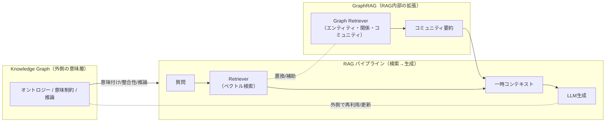

## RAG の限界とナレッジグラフ ──“検索する AI”から“理解する AI”へ

生成 AI の業務活用が進むなかで、「RAG（Retrieval-Augmented Generation）」はその中心的な手法となっています。社内文書や FAQ、ナレッジベースをベクトル化して検索し、生成 AI に外部知識を与える ── この構成は、多くの企業が最初に採用する「AI 導入の標準形」といえるでしょう。

RAG は、生成 AI の「知識の鮮度」や「事実性」を補う点で有効です。しかし、使い込むほどに次のような課題が浮かび上がります。

- **情報が断片的である**：検索対象がテキストの塊にすぎず、意味的な構造を持たない。

- **関係性を理解できない**：概念間のリンクが失われ、関連する知識を自動で結びつけられない。

- **更新や拡張に弱い**：新しい知識を加えるたびに再埋め込みが必要で、体系的な成長が難しい。

こうした構造的な制約のため、RAG は「情報を引き出す」ことは得意でも、「知識を理解する」ことはできません。つまり、**RAG は“検索する AI”の枠を超えられない**のです。

---

## GraphRAG という発展形

こうした RAG の課題に対して、近年注目されているのが「GraphRAG（Graph-based RAG）」です。これは、検索対象のドキュメントを単なるベクトル集合ではなく、**ノードとエッジから成るグラフ構造**として管理する手法です。Microsoft Research などが提案している実装では、文章中のエンティティ（人・場所・概念など）をノードとして抽出し、関係性（関係動詞・文脈）をエッジとして接続することで、「より意味的な検索」を目指しています。

GraphRAG の狙いは、RAG の弱点である「文脈の断片化」を補うことです。グラフ構造により、関連知識をたどる検索（例：A→B→C のような経路探索）が可能となり、単純なベクトル類似検索よりも、より論理的な文脈を再構築できるようになります。

このように見ると、GraphRAG は確かに RAG を進化させる有効な方向性の一つです。しかし、ここに大きな限界も存在します。

---

### GraphRAG の実装と限界

Microsoft Research の公式ページによれば、GraphRAG は「LLM を用いて入力コーパスから知識グラフを自動生成し、そのグラフとクラスタ要約を使って質問応答を行う」手法です。具体的には、入力ドキュメントからエンティティ抽出・関係抽出を行い、ノードとエッジからなるグラフ構造を構築。さらにグラフをクラスタ化（“community summaries”）し、質問時にはそのクラスタ要約を参照して生成モデルに渡します（[Microsoft Research: GraphRAG](https://www.microsoft.com/en-us/research/project/graphrag/?utm_source=chatgpt.com)、[arXiv:2404.16130](https://arxiv.org/abs/2404.16130?utm_source=chatgpt.com)）。

ただし、この手法は Knowledge Graph の **推論（reasoning）層** や **オントロジーレベルの意味制約** を扱っているわけではありません。GraphRAG は検索対象の文脈的関連を強化してはいますが、「知識の意味構造化」や「論理的推論」は実装範囲外です。

したがって、GraphRAG は RAG の欠点（単純なベクトル検索）を補うには有効であるものの、依然として **Graph Embedding ＋ Context Retrieval の枠組み**にとどまります。

#### 実装フロー（要約）

- **グラフ生成**：LLM でエンティティ／関係を抽出しノード・エッジ化。

- **コミュニティ検出と要約**：グラフをコミュニティ分割し、各コミュニティの要約（community summaries）を生成。

- **検索モード**：質問に応じて

  - _Global Search_：コミュニティ要約を活用してコーパス全体を俯瞰、

  - _Local Search_：特定エンティティ近傍へファンアウト、

  - _DRIFT Search_：Local にコミュニティ情報を組み合わせて検索精度を高める。

- **コンテキスト生成**：抽出した要約・証拠テキストをプロンプトに組み込み、LLM で回答生成。  
（参考：Microsoft Research 公式[ブログ](https://www.microsoft.com/en-us/research/blog/graphrag-unlocking-llm-discovery-on-narrative-private-data/)／[プロジェクトサイト](https://www.microsoft.com/en-us/research/project/graphrag/)）

#### 図解：RAG/GraphRAG/Knowledge Graph の位置づけ

_図：RAG は外部知識を検索して生成を補助する仕組み。GraphRAG はその内部構造を強化し、Knowledge Graph は外側の意味層として整合性・推論・更新を担う。_

一方で、近年の Enterprise Knowledge Graph や Semantic Data Fabric の研究動向では、知識グラフを単なる「検索補助」ではなく、**意味モデル（semantic model）** として扱う方向が主流です。AllegroGraph の解説では「データファブリックの基盤にはセマンティック・ナレッジグラフが不可欠」とされ（[AllegroGraph: Semantic Knowledge Graphs](https://allegrograph.com/the-foundation-of-data-fabrics-and-ai-semantic-knowledge-graphs/?utm_source=chatgpt.com)）、また Gartner も「Semantic Technologies が 2025 年以降の AI 基盤の中核になる」と予測しています（[Ontoforce Blog](https://www.ontoforce.com/blog/gartner-semantic-technologies-take-center-stage-in-2025?utm_source=chatgpt.com)）。

これらの動向を踏まえると、「Knowledge Graph を RAG の中で使う（GraphRAG 的手法）」のではなく、**RAG の外側に配置し、知識の一貫性・意味構造・継続的な更新を担わせる設計**こそが現実的です。言い換えれば、GraphRAG は RAG の延命策であり、Knowledge Graph は構造的な進化策と言えるでしょう。

---

## Knowledge Graph がもたらす“意味の層”

Knowledge Graph は、RAG や GraphRAG のように文脈を“再構築する”技術ではなく、**文脈を保持する仕組み**です。ノードとエッジで表されるエンティティ間の関係を通じて、「意味のネットワーク」を形成します。これにより、LLM が苦手とする次のような課題を克服できます。

- **意味的に近い概念を統合**（同義語・階層関係を保持）

- **論理的推論を実行**（経路探索やルールベース推論）

- **知識の永続性を確保**（モデル更新やドキュメント変化に影響されにくい）

たとえば、製品知識や研究情報をナレッジグラフとして整理すれば、RAG のように「文書を検索して回答する」のではなく、「知識を辿って答えを導く」ことが可能になります。

つまり、Knowledge Graph は **RAG の“外側”にある意味層（semantic layer）** として、AI の理解力と学習能力を拡張する基盤になるのです。

---

### 参考文献

- Microsoft Research Blog: **GraphRAG — Unlocking LLM discovery on narrative private data**（2024-02-13）. [link](https://www.microsoft.com/en-us/research/blog/graphrag-unlocking-llm-discovery-on-narrative-private-data/)

- Microsoft Research Project: **Project GraphRAG**（公式サイト：機能概要）. [link](https://www.microsoft.com/en-us/research/project/graphrag/)

- Edge, D. et al., **A Graph RAG Approach to Query-Focused Summarization**（arXiv:2404.16130, 2024）. [arXiv](https://arxiv.org/abs/2404.16130)

- Microsoft Research Blog: **Improving global search via dynamic community selection（Global/Local/DRIFT）**. [link](https://www.microsoft.com/en-us/research/blog/graphrag-unlocking-llm-discovery-on-narrative-private-data/)

- AllegroGraph: **The foundation of data fabrics and AI — Semantic Knowledge Graphs**. [link](https://allegrograph.com/the-foundation-of-data-fabrics-and-ai-semantic-knowledge-graphs/)

- Ontoforce Blog: **Gartner — Semantic technologies take centre stage in 2025**. [link](https://www.ontoforce.com/blog/gartner-semantic-technologies-take-center-stage-in-2025)

## まとめ ── 検索の限界を超えて、理解の AI へ

RAG は生成 AI の外部知識参照を実現し、実務利用を大きく前進させました。しかし、その構造的制約ゆえに、知識を“理解する”段階には至っていません。GraphRAG はその延長として検索を強化しますが、あくまで「検索の中での改善」にすぎません。

これからの AI に求められるのは、**知識を生成・蓄積・再利用できる構造**です。ナレッジグラフはそのための基盤として、RAG の外側に意味を与え、AI が本当に「学習する」世界への扉を開く技術になるでしょう。

---

※本記事は AI を活用して執筆しています。
