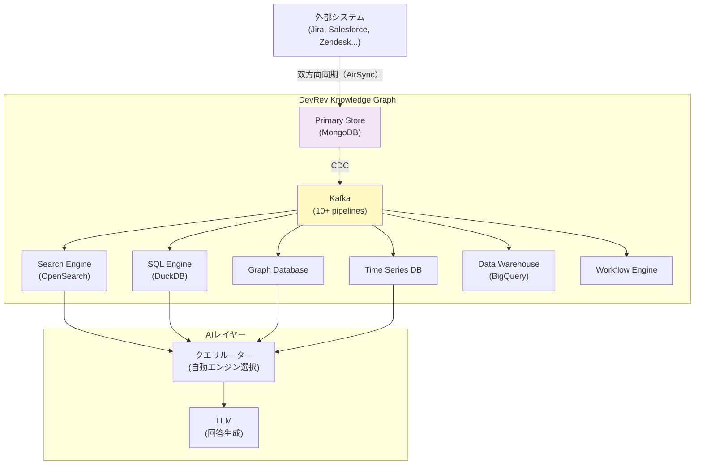
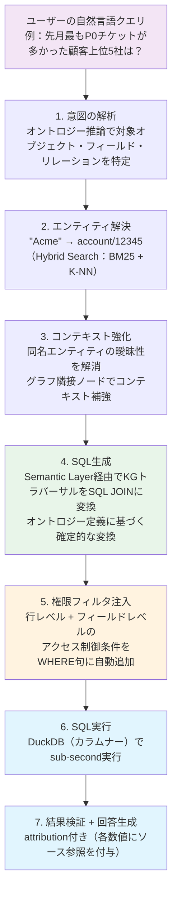
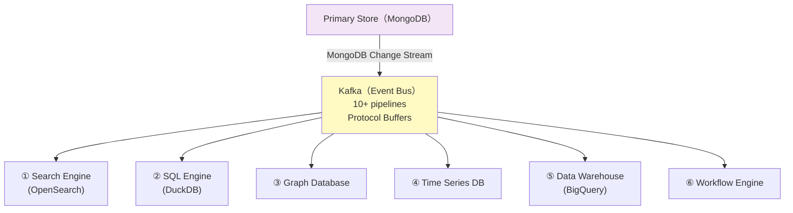
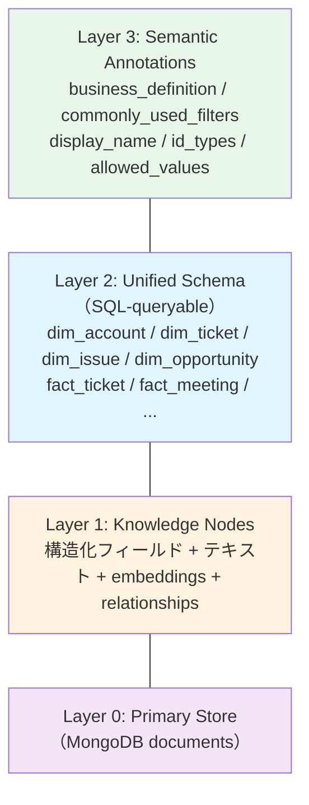

# DevRev Knowledge Graphアーキテクチャ解剖：精度・速度・具体性の源泉

> この記事は約15分で読めます。DevRevのKnowledge Graphアーキテクチャを公開情報から技術的に解剖します。

DevRevのKnowledge Graphを評価するとき、エンジニアが必ず抱く3つの問いがあります。

1. **なぜAIエージェントの回答精度が高いのか**
2. **なぜクエリが速いのか**
3. **なぜ「正確な数字」を含む回答が出せるのか**

本記事はこの3つに実装レベルで答えます。他記事への参照なしに、この記事単体で完結するように書いています。

---

## 答えの概要（一文）

> プレビルトのドメインオントロジー上に、6つの特化型エンジンがCDCで同期され、AIが最適なクエリパスを自動選択する。

この一文を分解して説明していきます。

---

## アーキテクチャの全体像

まず大きな構造を示します。



重要なポイントは2つです。

- **外部システムのデータが事前に統合されている**。クエリのたびにAPIを叩くのではなく、CDCでリアルタイムに同期済みの状態を常に保っています。
- **6つのエンジンが専門特化している**。1つの万能データベースではなく、クエリの性質ごとに最適なエンジンへルーティングされます。

---

## なぜ精度が高いのか

### 問題の根源：LLMはスキーマを「推測」している

一般的なRAGベースのシステムが精度の壁にぶつかる理由を、具体例で示します。

**クエリ例：「支払い顧客の一覧を出して」**

このクエリを受け取ったLLMは、テーブルスキーマを見て「paying customer」の定義を推測しなければなりません。

- `account_type = 'Customer'` かもしれない
- `status = 'active'` かもしれない
- `acv > 0` の条件が必要かもしれない

LLMは推測するしかなく、正解は企業のビジネスロジックに依存します。このハルシネーションのリスクをゼロにする仕組みが、Ontology Annotationです。

### Ontology Annotation：ビジネスロジックをスキーマに埋め込む

DevRevのKnowledge Graphでは、各フィールドに「LLM-friendly」なアノテーションが付与されています。これは単なるカラムの説明文ではなく、ビジネスロジックをスキーマレベルで定義するものです。

```json
{
  "table": "dim_account",
  "field": "forecast_category",
  "annotation": {
    "display_name": "Forecast Category",
    "business_definition": "アカウントの商談進行状態。Closed Won = 受注確定",
    "allowed_values": [
      "pipeline", "best_case", "commit", "closed_won", "omitted"
    ],
    "commonly_used_filters": [
      {
        "label": "支払い顧客",
        "condition": "forecast_category = 'closed_won' OR (account_type = 'customer' AND acv > 0)"
      },
      {
        "label": "パイプライン",
        "condition": "forecast_category IN ('pipeline', 'best_case', 'commit')"
      }
    ]
  }
}
```

LLMは「支払い顧客」という言葉を受け取ったとき、`commonly_used_filters` の定義を参照して正確なSQL条件に変換します。推測ではなく、定義への参照です。

このアプローチの有効性は業界でも認識されています。Snowflake Cortex Analystのドキュメントでは「汎用的なAIはスキーマだけ与えられてもText-to-SQLに苦労する。スキーマにはビジネスプロセスの定義や指標の扱い方が欠けているから」と明記されており（[Cortex Analyst Documentation](https://docs.snowflake.com/en/user-guide/snowflake-cortex/cortex-analyst)）、semantic modelが精度の前提条件と位置づけられています。このモデルの設計・維持にはデータエンジニアリングのコスト（Schema Tax）がかかります。DevRevのKnowledge Graphでは、このsemantic modelがSaaS業務ドメイン（顧客・チケット・プロダクト・イシュー等）向けにプレビルトされているため、ユーザー側のセットアップなしに同等の精度が得られます。

### Text-to-SQLパイプライン：7段階の処理

ユーザーの自然言語クエリから回答が返るまで、以下の7段階が順次処理されます。



ここで重要な洞察があります。**LLMは回答を「生成」していません**。

ステップ6でDuckDBが`SELECT account_name, COUNT(*) as ticket_count FROM fact_ticket WHERE priority = 'P0' AND created_at >= ... GROUP BY account_name ORDER BY ticket_count DESC LIMIT 5`を実行し、その結果をステップ7でLLMが読み上げているだけです。数字の正確さはLLMの能力ではなく、SQLの実行結果に依存します。だから数字が間違わない。

### ハルシネーション防止の多層防御

| Layer | メカニズム | 何を防ぐか |
|-------|-----------|-----------|
| RAG source grounding | 回答は必ず検索・SQL結果に基づく | 根拠のない生成 |
| Attribution | 各数値にソースオブジェクトへの参照を付与 | 検証不能な回答 |
| SQL determinism | 数値はSQL実行結果。LLMは読むだけ | 数字のハルシネーション |
| Permission pre-filtering | 権限外データはLLMに渡さない | 情報漏洩 |
| Confidence scoring | 確信度が低い場合は回答を抑制 | 不確かな断定 |

---

## なぜ速いのか

### Pre-replicated vs Federated：構造的な速度差

MCPや多くのツール呼び出し型エージェントは「Federated」アプローチを採ります。クエリのたびにAIが各システムへAPIコールし、返ってきた断片をその場で結合する設計です。この設計では最も遅いAPIが全体のボトルネックになり、複数システムを横断する質問ではレイテンシが直列的に累積します。また、LLMがスキーマを探索してリレーションシップを推論する「地図を描く」作業もクエリごとに発生します。

DevRevのKnowledge Graphは「Pre-replicated」アプローチです。外部システムのデータがCDCで事前に統合されており、クエリ時点では「地図を読む」だけで済みます。外部APIコールがゼロ、リレーションシップは確定済み、エンティティ解決も事前リンクされているため、1クエリで構造化データが返ります。

DevRevが公開しているベンチマーク（[devrev.ai](https://devrev.ai)トップページおよび比較資料）では、同一クエリ（「高優先度のエンジニアリングIssueごとに、同じプロダクト領域でサポートチケットが開いている顧客アカウントを示せ」）を7回実行した結果として、以下が報告されています:

- Claude（MCP経由）: ~3.2M tokens / ~9分
- DevRev Computer: ~157K tokens / ~1.5分
- 差: **95%少ないトークン、5.5倍高速**

この差は「パフォーマンス最適化」の結果ではなく、推論すべき地図が最初から存在するかどうかという構造の違いから生まれています。Claudeはクエリのたびにスキーマを探索し直す（MCP経由でもこのコストは変わらなかった）のに対し、DevRevはプレビルトのKGに対して確定的なSQLを実行するだけです。

### SQL Engineの速度の仕組み（DuckDB）

速度を担保しているコアが、SQL EngineとしてのDuckDBの採用です。

- **Apache Parquetカラムナーフォーマット**: 集計クエリに最適化されたストレージ。`COUNT`, `SUM`, `GROUP BY` が列単位でスキャンされるため、行ベースのRDBMSより大幅に高速
- **Apache Arrowのzero-copy in-memory転送**: メモリコピーなしでデータを処理。CPUとメモリ効率が高い
- **テナントごとの独立DBファイル**: 各テナントが独立した `.duckdb` ファイルを持ち、他テナントの負荷に引きずられない
- **クライアントサイドDuckDB**: ブラウザ内での軽量クエリもDuckDBで即座実行し、サーバー負荷を分散

これらの組み合わせにより、動画内でsub-secondのクエリ応答（数十億レコードでも）が可能と説明されています。

---

## 6つのエンジン：なぜ1つで済まないのか

Knowledge Graphは6つの特化型エンジンの集合体です。

| # | エンジン | 最適なクエリパターン | 技術基盤 |
|---|--------|---------------------|----------|
| 1 | Search Engine | 「何を探しているか分からない」 | OpenSearch（BM25 + K-NN） |
| 2 | SQL Engine | 「正確な数字が欲しい」 | DuckDB（カラムナー） |
| 3 | Graph Database | 「関連するものを辿りたい」 | Graph Store（隣接探索） |
| 4 | Time Series DB | 「いつ何が変わったか」 | Time Series Store + Parquet |
| 5 | Data Warehouse | 「全データを横断分析したい」 | BigQuery（バッチ） |
| 6 | Workflow Engine | 「条件を満たしたら自動で動く」 | Event-driven Serverless |

なぜ1つに統合できないのか。理由は物理的な制約です。

- 転置インデックス（全文検索に最適）とカラムナーストレージ（集計に最適）は、データの持ち方が根本的に異なる
- ベクトルインデックス（K-NN）と正確なWHERE句フィルタリングは、異なるインデックス構造が必要
- N-hopグラフトラバーサルと時系列クエリは、アクセスパターンがまったく異なる

ユーザーがこの複雑さを意識しないのは、クエリルーターが自動的に最適なエンジンを選択するためです。「チケットが最も多い顧客を5社」と聞けばSQL Engine、「このチケットに関連するIssueの担当者が所属するチームは」と聞けばGraph Databaseにルーティングされます。

### 各エンジンの実装詳細

**Search Engine**

BM25（キーワード一致）とK-NN（ベクトル類似度）のハイブリッドで動作します。スコアはRRF（Reciprocal Rank Fusion）で統合され、Top-Kの結果をCross-encoder（ペアワイズスコアリングモデル）がリランキングします。

注目すべきは検索結果の「コンテキスト強化」です。マッチしたKnowledge Nodeの隣接ノードをGraph Databaseから取得し、関連エンティティをLLMのコンテキストに追加します。これにより、単純なキーワードマッチを超えた、業務的に関連した情報が回答に含まれます。

また権限外のドキュメントはスコアリング前に除外（pre-filtering）されます。後述するアクセス制御レイヤーがOpenSearchのフィルタクエリとして注入されます。

**SQL Engine（DuckDB）**

テナントのライフサイクルが状態機械として管理されています。

```
bootstrapping → hydrating → syncing → ready → serving
                                                 ↓
                                             draining → retired
                                                 ↑
                                               fatal（異常検知）
```

`hydrating` はCDCの初期データ投入フェーズ、`syncing` はCDCでリアルタイム同期中の状態です。StatefulSetとしてKubernetes上で管理されており、EBSバックドストレージによりPod再起動後もデータが永続します。

**Graph Database**

N-hopトラバーサルに特化します。「このチケットに関連するIssueの担当者が所属するチームの他のメンバーを教えて」という問いを、ノードとエッジのトラバーサルとして処理します。CDCで新しいリレーションシップが検出されると即座にエッジが追加されます。

**Time Series DB**

フィールドレベルの変更履歴を時系列で保持します。イベントソーシングにより任意の時点の状態を再現可能です。OpenTelemetryメトリクスを取り込んでParquetに格納し、PromQL → SQL変換で実行します。「このチケットの優先度が先月何回変更されたか」「先週のステータス推移を見せて」といった問いに答えられます。

---

## CDC Fan-out：6エンジンを同期する仕組み

6つのエンジンすべてを最新の状態に保つコアが、CDC（Change Data Capture）ファンアウトです。



| 項目 | 仕様 |
|------|------|
| ソース | MongoDB Change Stream |
| メッセージバス | Kafka（マルチパーティション） |
| シリアライゼーション | Protocol Buffers |
| パイプライン数 | 10以上（機能別に分離） |
| 順序保証 | パーティションキー = tenant_id + object_id |
| 冪等性 | 各Consumerがイベントを冪等に処理 |
| ラグ目標 | ニアリアルタイム（秒単位） |

各Consumerは独立してconsumeしており、1つのエンジンが止まっても他には影響しません。障害は個別エンジンに隔離されます。

### CDCのv1→v2：スケールで顕在化した設計問題

DevRevはCDCをv1からv2へ全面的に書き直しています（[DevRev Engineering Blog](https://devrev.ai/blog/making-applications-and-data-silos-invisible)で言及）。

**v1の問題点（マイクロサービスアンチパターン）:**
- Kafka Connectが全サービスのスキーマに依存するモノリシック設計
- スキーマ変更のたびにCDC全体の再デプロイが必要
- 1サービスの後方互換性破壊がCDC全体を止めるリスク

**v2の解決策:**
- CDCを「サービス」から「共有ライブラリ」に変更
- 各サービスが自身のTransformerを所有
- CDCEventのProtoをサービス非依存に再構造化
- Consumerを機能別に完全分離

CDCは「最初はシンプルに作れる」のですが、スケールと運用で問題が顕在化する典型的なコンポーネントです。DevRevが全面書き直しを経験していることは、このアーキテクチャを自前で構築するときの現実的なコストを示しています。

---

## Unified SQL Schema：AIがデータに到達する地図

6エンジンを横断してAIが参照するのが、Unified SQL Schemaです。



`dim_*` はその時点の最新状態のスナップショット、`fact_*` は30〜90日の変更履歴です。

### 自己説明的なスキーマ

通常のRDBでは多対多関係を扱うためのlink tableが必要で、LLMはJOINの方法を推論しなければなりません。Unified SQL Schemaでは `id_types` アノテーションによりこの推論が不要になります。

```json
{
  "table": "fact_ticket",
  "field": "account_id",
  "id_types": ["account"],
  "comment": "このフィールドでdim_accountにJOINできる"
}
```

`ticket.account_id` に `id_types: ["account"]` があれば、LLMは「このフィールドで account テーブルにJOINできる」と外部ドキュメントなしに推論できます。スキーマが自己説明的であることがLLMの精度に直結します。

### 設計の不変原則

- **Name Continuity**: テーブル名・フィールド名が変わらないことを保証する。AIエージェントが過去のクエリパターンを学習できる前提条件
- **Stock = Custom統一**: 標準オブジェクト（ticket, issue等）もカスタムオブジェクトも同一のスキーマ規則。LLMから見て区別がない
- **Backward Compatible Evolution**: スキーマ変更は既存クエリを壊さない。フィールドの削除禁止

---

## 権限がアーキテクチャに組み込まれている

DevRevの権限フィルタリングは「クエリ後フィルタ」ではなく**「クエリ前フィルタ」**として設計されています。全クエリパスにアクセス制御条件が注入されます。

| クエリパス | アクセス制御の適用方法 |
|-----------|----------------------|
| Hybrid Search | OpenSearchフィルタクエリとして権限条件を注入 |
| SQL（DuckDB） | WHERE句に権限条件を自動追加 |
| Graph Traversal | エッジフィルタリングで権限外ノードを除外 |
| Time Series | テナント + ロール単位でのデータ分離 |
| Vector Search | ベクトルインデックスにアクセス制御ビットマスクを適用 |

「クエリ後フィルタ」では一度LLMが権限外データを見てしまいます。「クエリ前フィルタ」ならLLMのコンテキストに権限外データが入りません。この差が情報漏洩の「原理的な排除」と「事後処理での排除」の違いです。

権限は2層で構成されています。

- **オブジェクトレベルRBAC**: 「このアカウント情報はこのユーザーには見せない」
- **フィールドレベルRBAC**: 「ARRフィールドはセールスマネージャー以上のみ閲覧可」「個人情報フィールドは人事部のみ参照可」など、個人情報保護法対応としても機能する粒度

外部システム（Jira, Salesforce等）の権限変更は双方向同期エンジン経由でnear-real-timeに同期されます。「Salesforceで権限が剥奪されたが、Knowledge Graph上ではまだ見える」という状態が生じないよう設計されています。

---

## 耐障害性：6エンジン構成が招くトレードオフ

6エンジン構成は「6つの障害ポイントを持つ」ということでもあります。このアーキテクチャで一般的に起きうる障害パターンを示します。

### 典型的な障害パターン

**パターン1: CDC Consumerのレースコンディションによるデータ消失**

CDCベースのマテリアライズドビューでは、Consumer側のバグによりレプリカ上のデータが消失するリスクがあります。スナップショットからの復元機構がなければ、CDC全量を再ハイドレーションする必要が生じ、復旧に数時間を要します。

教訓：データ削除操作へのガードレールと、定期スナップショットからの自動復元機構が必須。

**パターン2: データマイグレーション時のリソース枯渇**

大量データの初回インポートやマイグレーション時にイベントバーストが発生すると、定常運用前提でサイジングされたエンジンがOOM（Out of Memory）に陥ります。通常運用とマイグレーション時ではアクセスパターンが根本的に異なるため、リソース割り当ての動的調整が必要です。

**パターン3: 制御プレーンがPrimary Storeを圧迫**

分散エンジンの制御プレーン（状態管理ループ）がPrimary Storeに非効率なクエリを発行し続けると、Primary Store全体のCPU使用率が上昇し、全サービスのレイテンシが劣化します。制御プレーンとデータプレーンの分離、およびレート制限が必要です。

### Level-Triggered Reconciliation

CDCベースのシステムで最も難しいのは「イベントの取りこぼし」の検出と修復です。Edge-Triggered（イベント到着トリガー）だけでは、ネットワーク障害等でlost eventが発生しても検出できません。

DevRevはLevel-Triggered Reconciliationを採用しています。定期的にPrimary StoreとReplicaの状態を比較し、差分を補正します。

```python
# Level-Triggered Reconciliation Loop（概念コード）
while true:
    expected_state = query_primary_store(tenant_id)
    actual_state   = query_replica_engine(tenant_id)
    diff = compute_diff(expected_state, actual_state)
    if diff:
        apply_corrections(diff)
        alert_if_large(diff)
    sleep(reconciliation_interval)
```

これにより、CDCパイプラインのどこかでイベントが失われても、最終的には必ず正しい状態に収束します（eventual consistency with bounded divergence）。

---

## 「個別パーツは作れる。統合が地獄」

CDC、Polyglot Persistence、Semantic Layer、CQRS——これらの個別パターンはすべて既知の技術です。論文もOSSも存在します。

問題は、これらを**「6エンジン × マルチテナント × リアルタイム権限 × LLMアクセスレイヤー」という制約下で同時に成立させること**にあります。

具体的に何が起きるかを示します。

**スキーマ変更を1つ入れると：**
6つのエンジンすべてのスキーマを後方互換性を保ちながら進化させる必要があります。1つのエンジンだけ変更が反映されない場合、そのクエリパスだけが静かに失敗します。

**権限ルールを1つ変えると：**
Search、SQL、Graph、Time Series、Workflowの全アクセスパスで同一ルールの適用を保証する必要があります。1箇所でも漏れれば情報漏洩が発生します。

**テナントを1つ追加すると：**
6エンジンすべてにデータ隔離を設定し、CDCストリームを新テナントにルーティングし、リソースのbin-packingを再計算する必要があります。

**1エンジンで障害が起きると：**
他の5エンジンは動き続けなければなりません。「検索は動くがSQLは動かない」状態でのUXをどう設計するかという問題も生じます。

制約を1つ緩めれば設計は容易になります。すべてを同時に満たすところに、このアーキテクチャの本質的な困難さがあります。

---

## まとめ：3つの問いへの回答

**なぜ精度が高いのか：**
Ontology Annotationによりビジネスロジックがスキーマに定義されており、LLMは推測ではなく定義への参照でSQLを生成します。推測の余地がないため、ハルシネーションが起きにくい構造です。

**なぜ速いのか：**
データが事前にリンクされたPre-replicatedアーキテクチャにより、LLMがスキーマ探索やリレーションシップの推論をクエリのたびに行う必要がありません。DuckDBのカラムナーストレージとテナント隔離により、SQLがsub-secondで返ります。

**なぜ数字が正確なのか：**
LLMが「約30件」と推測するのではなく、DuckDBが「正確に27件」を返したSQLの実行結果をLLMが読み上げています。生成ではなく実行結果の報告です。

これら3つはそれぞれ独立した機能ではなく、「6エンジン × CDC × オントロジー × pre-link」という一体のアーキテクチャから生まれています。

---

## 参考情報

本記事で言及した数値・アーキテクチャ情報の出典です。

| 内容 | 出典 |
|------|------|
| 5層アーキテクチャ・「5つの表現」の公式説明 | [Dheeraj Pandey on Knowledge Graphs Driving AI Enterprises（YouTube）](https://www.youtube.com/watch?v=syErxoX3eP8) |
| 5.5倍高速・トークン95%削減のベンチマーク | [devrev.ai トップページ「Computer's proven efficiency」セクション](https://devrev.ai) |
| CDCv1→v2の設計変更・ナレッジグラフ設計思想 | [Making Applications and Data Silos Invisible（DevRev Blog）](https://devrev.ai/blog/making-applications-and-data-silos-invisible) |
| AirSync同期アーキテクチャ | [DevRev AirSync Documentation](https://support.devrev.ai/en-US/devrev/article/i96Xvth5-airsync-overview) |
| Semantic modelがText-to-SQL精度の前提条件である根拠 | [Snowflake Cortex Analyst Documentation](https://docs.snowflake.com/en/user-guide/snowflake-cortex/cortex-analyst) |

---

## フィードバック受け付け

本記事の内容に誤りや補足すべき点がございましたら、コメントでご指摘いただけると幸いです。特に同種のアーキテクチャを設計・運用されているエンジニアの方からの知見をお待ちしています。

---

## 更新履歴

- 2026-05-30: 初版公開

---

### 注記

本記事はAIを活用して執筆しています。記載した数値・アーキテクチャ情報はすべて上記の公開情報に基づきます。
