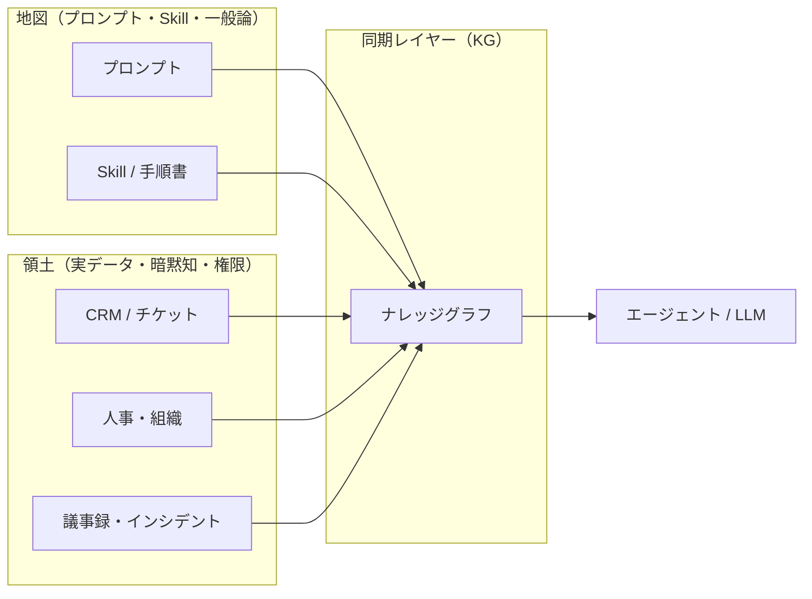
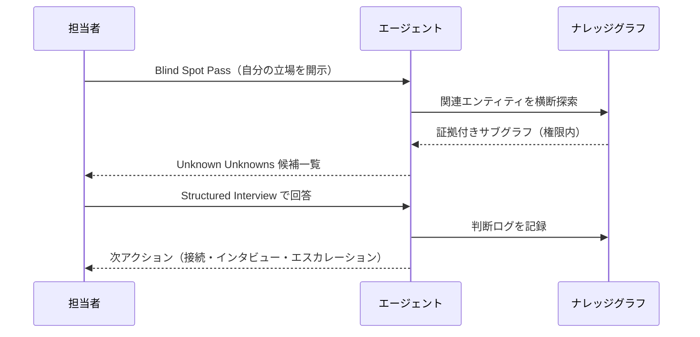

# Finding Unknownsを組織に — Claude Fable 5とナレッジグラフ

> この記事は独立して読めます（約10分）

Anthropic の Claude Code チーム、Thariq Shihipar 氏の記事「[A field guide to Claude Fable 5: Finding your unknowns](https://claude.com/blog/a-field-guide-to-claude-fable-finding-your-unknowns)」が話題になっています。Fable 5 では、モデル能力より **ユーザーが自分の未知をどれだけ言語化できるか** がボトルネックになる、という主張です。

本記事では、そのフレームワークを **コードベースの外 — 企業の業務文脈** に翻訳し、**ナレッジグラフ（KG）** が果たせる役割を整理します。GraphRAG の検索強化ではなく、AI の理解力を支える **意味レイヤ** としての KG を前提に書きます（区別は [RAG を超える知識統合](https://zenn.dev/knowledge_graph/articles/beyond-rag-knowledge-graph) を参照）。

---

## Fable 5が言う「地図は領土ではない」

Shihipar 氏は、プロンプトや Skill が **地図（Map）**、実際のコードベースや制約が **領土（Territory）** だと説明します。両者のギャップが **unknowns（未知）** で、ここが埋まらないほど、モデルは業界のデフォルトや推測で穴を埋めます。

未知は次の 4 分類で整理されます。

| 分類 | 意味 | コーディングでの例 |
|------|------|-------------------|
| **Known Knowns** | プロンプトに明示したこと | 「OAuth プロバイダを追加したい」 |
| **Known Unknowns** | 自分では分からないと自覚していること | 「このリポジトリの auth モジュールの構造は未把握」 |
| **Unknown Knowns** | 暗黙知で、書かないが見れば分かること | 既存の命名規則やディレクトリ慣習 |
| **Unknown Unknowns** | 気づいていない盲点 | 別チームが既に似た実装を持っている、など |

Fable 5 向けの代表的な技法は **Blind Spot Pass**（盲点パス）です。「blind spot pass」「unknown unknowns」と明示し、自分の立場と経験を伝えたうえで、盲点の洗い出しをモデルに頼みます。ほかに構造化インタビュー、プロトタイプ、実装中の `implementation-notes.md` など、**実装の前・中・後** で未知を安く発見するループが紹介されています。

コーディング文脈では非常に説得力があります。リポジトリを読めるエージェントがいれば、地図と領土のギャップはかなり縮められます。

---

## 企業業務で読むと、話は別になる

同じ 4 分類を **組織の業務** に当てはめると、比重が変わります。

- **Known Knowns** は、個人のメモや一部のドキュメントに散在し、検索しても出てこないことが多い
- **Known Unknowns** は「この顧客の過去対応は分からない」と自覚していても、**どこを見ればよいか** が組織に共有されていない
- **Unknown Knowns** は、ベテランだけが知る暗黙知、廃止予定の例外運用、部門間の言葉のズレ
- **Unknown Unknowns** は、サイロ、権限制約、過去インシデントの未連携など、**外部からは見えない領土** が大半

つまり企業では、Fable 5 の記事が想定する「コードベースという領土」より、**Unknown Unknowns の海** の方が広い、という読み方ができます。

この状態でチャット AI に業務相談を投げると、「業界ベストプラクティス」で穴が埋まり、**自社の特殊事情や権限境界を無視した回答** になりやすい。PoC は動くが本番で使われない、という話の背景にも、この地図と領土のズレがあります（scatter-gather 問題は [AIエージェントが毎回データを取りに行く設計の限界](https://zenn.dev/knowledge_graph/articles/kg-agent-memory-first-design) を参照）。

ここで浮かび上がるのが、**ナレッジグラフの役割** です。KG は検索ツールというより、**地図と領土を同期するレイヤー** として機能し得ます。



---

## KGが「未知と既知の線」をはっきりさせる

社内の顧客・案件・担当者・インシデント・ドキュメントを KG でつなぐと、4 分類が **運用可能な状態** に近づきます。

| タイプ | 従来の状態 | KG 導入後 | 具体的なアクション例 |
|--------|-----------|-----------|-------------------|
| Known Knowns | 個人メモや一部ドキュメント | グラフ上で即時クエリ可能 | 検索・エージェント活用 |
| Known Unknowns | 「知らない」と自覚するだけ | 「存在はするが未接続」と判別できる | 優先接続対象の特定 |
| Unknown Knowns | 組織の暗黙知 | 関連エンティティの探索で浮上 | インタビュー・ナレッジ化 |
| Unknown Unknowns | 見落とされる | 横断探索で候補として提示 | Blind Spot Pass |

### 地図と領土を同期するために必要な3点

製品名に依存しない一般論として、組織 KG で効くのは次の設計です。

1. **ソースとの同期** — CRM やチケット、人事マスタなどからの更新を遅延なく反映する（CDC やイベント駆動）。地図が古いままでは Unknown が増え続けます。
2. **権限境界（permission-aware）** — 誰がどのサブグラフを見られるかを機械的に判定する。未知を可視化するほど、**見せてはいけない情報の漏洩** リスクも上がるため、探索と権限はセットです（[コンテキストグラフ](https://zenn.dev/knowledge_graph/articles/context-graph-improves-llm) の論点と重なります）。
3. **エージェント向けの探索契約** — オントロジー（型・関係・向き）と、辿り方のルールを Skill やプロジェクト指示に固定する。推測で穴埋めしない **`unknown` 返却** など（[Graph Traversal Contract](https://zenn.dev/knowledge_graph/articles/graph-traversal-contract-skill)）。

KG は **GraphRAG の検索補強** ではなく、上記を満たす **組織の意味レイヤ** として位置づけると、Fable 5 の「Finding Unknowns」と接続しやすくなります。

---

## 企業版 Finding Unknowns ワークフロー

Shihipar 氏の前・中・後のループを、KG 付きエージェント向けに拡張した例です。

### 1. Blind Spot Pass（盲点パス）

Fable 5 原典と同様、「blind spot pass」「unknown unknowns」を明示します。違いは、**コードの代わりに KG を探索の起点** にすることです。

```text
この商談からオンボーディングまでのプロセスについて、私は営業視点しか持っていません。
ナレッジグラフ上の関連エンティティ（顧客・案件・過去インシデント・他部署ドキュメント）を横断し、
私の unknown unknowns を洗い出してください。
推測で埋めず、根拠となるノード ID と関係を列挙してください。
権限のない領域は「参照不可」と明示してください。
```

エージェントはグラフを辿り、**営業担当者の地図に無かった領土**（サポートの既知不具合、法務の特約、過去の解約理由など）を候補として返せます。

### 2. Structured Interview（構造化インタビュー）

盲点が粗く出たら、Fable 5 の **インタビュー** 技法を使います。KG が「すでに分かっている事実」を先に渡すので、モデルは **アーキテクチャを変える質問** に集中しやすくなります。

- 「この顧客には過去に SLA 違反チケットが 3 件あります。オンボーディング SLA を現状のまま約束してよいですか？」
- 「担当 CS の異動予定がグラフ上にあります。引き継ぎ計画は Known Unknown として未登録です。誰が埋めますか？」

### 3. 探索メモ（implementation-notes の組織版）

実装中の `implementation-notes.md` に相当するものを、業務では **判断ログ** として残します。KG 上のエンティティに紐づけ、「なぜ通常フローから外れたか」を記録します。次の Blind Spot Pass の入力になり、**同じ Unknown Unknowns の再発** を防ぎます。

### 4. 証拠付き回答のルール

Fable 5 でも、モデルが賢いほど **見えていないものをもっともらしく埋める** リスクは残ります。KG 連携では、回答に **ノード ID・辿った辺・経路** を含め、欠ける場合は `unknown` と返す契約を Skill に書きます。これはコーディング向け Graph Traversal Contract の組織版です。



---

## まとめ

Claude Fable 5 の **Finding Unknowns** は、エージェント時代の核心スキルです。ただしそのまま企業業務に持ち込むと、領土がコードではなく **組織の暗黙知とサイロ** になるため、地図と領土のギャップはむしろ大きくなります。

**ナレッジグラフ** は、4 分類の未知を「運用可能」にし、Blind Spot Pass や構造化インタビューを **根拠付き** で回すための同期レイヤーになり得ます。モデルを Fable 5 に上げるだけでは埋まらないギャップを、**外付けの意味と権限** で埋める、というのが本記事のメッセージです。

---

## 参考・出典

- [A field guide to Claude Fable 5: Finding your unknowns](https://claude.com/blog/a-field-guide-to-claude-fable-finding-your-unknowns) — Thariq Shihipar（Anthropic）。4 分類の未知、Blind Spot Pass、地図と領土の比喩の原典。
- [The GenAI Divide – State of AI in Business 2025](https://mlq.ai/media/quarterly_decks/v0.1_State_of_AI_in_Business_2025_Report.pdf) — MIT Media Lab Project NANDA。企業 GenAI 投資の多くが ROI に結びつかない現象の整理（本ブログでは [「GenAI Divide」とナレッジグラフ](https://zenn.dev/knowledge_graph/articles/genai-divide-knowledge-graph) で紹介）。

## 関連記事

| 記事 | テーマ |
|------|--------|
| [AIエージェントが毎回データを取りに行く設計の限界](https://zenn.dev/knowledge_graph/articles/kg-agent-memory-first-design) | scatter-gather と Memory-first |
| [Claude の外側にコンテキストグラフを置くと…](https://zenn.dev/knowledge_graph/articles/context-graph-improves-llm) | 権限・コンテキストの外付け |
| [Graph Traversal Contract](https://zenn.dev/knowledge_graph/articles/graph-traversal-contract-skill) | 探索契約と `unknown` 返却 |
| [RAG を超える知識統合](https://zenn.dev/knowledge_graph/articles/beyond-rag-knowledge-graph) | KG と GraphRAG の区別 |

---

## 更新履歴

- 2026-07-07: 初版作成（ドラフト）

## フィードバック受け付け

本記事は AI を活用して執筆しています。Fable 5 の技法の組織への当てはめや、KG 設計の具体例について、誤りや補足があれば Zenn のコメントよりお知らせください。
