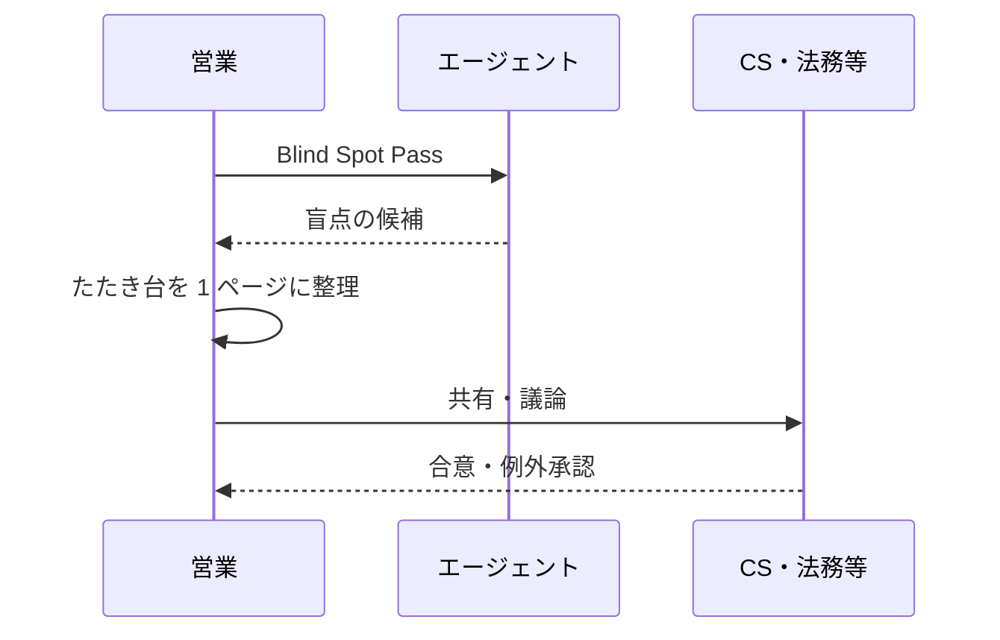

# Finding Unknownsを組織に — Claude Fable 5とナレッジグラフ

> この記事は独立して読めます（約10分）

Anthropic の Thariq Shihipar 氏が公開した「[A field guide to Claude Fable 5: Finding your unknowns](https://claude.com/blog/a-field-guide-to-claude-fable-finding-your-unknowns)」が話題です。技法の詳細は原典に任せ、この記事では **なぜ注目されているのか** と、**シングルプレイヤー前提の原典に足りない組織の視点** を掘り下げます。

---

## なぜ今、話題になっているのか

ひとことで言うと、「プロンプトを上手く書く」より **自分の盲点を先に洗い出す** 方が、Fable 5 時代の上限を決める、というメッセージだからです。

Shihipar 氏は、Fable 5 では律速要因がモデル能力ではなく **未知の言語化** に移ったと書いています。モデルが賢いほど、書いていない前提を業界のデフォルトで埋めるリスクも上がります。詳細が足りないときも、書きすぎて柔軟性を失うときも、どちらも unknowns の扱いがボトルネックになる、という整理です。

「地図と領土」の比喩が刺さるのは、エージェント利用の失敗に名前が付くからです。「指示は合っているのにずれる」は、地図（プロンプト・Skill）と領土（コードベースや制約）のズレとして説明できます。加えて Blind Spot Pass など **前・中・後のループ** として書かれており、プロンプト例集ではなくワークフローとして読める点も、Claude Code 利用者以外への広がりを生んでいます。

---

## 原典に足りない視点 — シングルプレイヤーと組織

原典の視野は **シングルプレイヤー** です。1 人がプロンプトを書き、1 人がコードベースを読み、1 人が未知を減らす。コーディングではそれで回ります。

組織はそう動きません。答えは一人が持っていない。**複数の担当者が、利害と文脈を持ちながら議論して作っていくもの** です。商談からオンボーディングへ渡すとき、地図を更新するのは個人ではなく引き継ぎの連鎖そのものになります。営業が書いた商談メモ、CS が持つ引き継ぎチェックリスト、法務が知る特約。それぞれが **地図の断片** を持ち、誰も全体を一人では見ていません。

| 原典（シングルプレイヤー） | 組織（マルチプレイヤー） |
|--------------------------|------------------------|
| 1 人が地図を更新する | 担当者が変わり、地図は引き継がれる |
| コードベースが領土 | CRM・チケット・人事が散在し、領土が分裂する |
| 答えは実装に落ちる | 答えは会議・合意・例外承認を経る |
| 未知は個人のスキル | 未知は部門間のサイロと権限境界 |

### 外から見た企業と、中から見た企業は別物

LLM の学習データや業界ベストプラクティスは、本質的に **外から見た企業** の言語でできています。整った回答を返しても、社内から見れば的外れになり得ます。

たとえばオンボーディングを LLM に相談すると、業界標準の手順が返ってきても、例外 SLA・法務レビュー・CS の運用ルールが抜けていることがあります。外側からは「ベストプラクティス」に見える提案が、内側からは **動かない正論** になります。具体例は次のミニシナリオを参照してください。

- 「こうすべき」は **誰が決める権限を持つか** で変わる
- 「標準プロセス」は現場では **例外運用とセット** で回っている
- 「顧客満足」は部門ごとに **測り方が違う**

カルチャーや暗黙の合意、会議でしか出ない前提といった組織のプロセスは、プロンプトに全部書くことも、リポジトリのように機械的に読むことも難しい領域です。

Finding Unknowns を企業に持ち込むとき、目標は「LLM に正解を出させる」ことではなく、**議論の材料を揃える** ことに近いはずです。盲点の候補を出し、関係者に渡し、組織の中で合意を作る。原典が個人の言語化スキルとして書いている部分を、ここで読み替える必要があります。

---

## ミニシナリオ：商談クローズ後、何が起きるか

営業担当が大型案件をクローズしたとします。オンボーディング開始日を顧客に口頭で伝え、社内では「いつものフローで」と CS に連絡した。ここまでがよくある現場です。

このとき LLM に「オンボーディング計画を作って」とだけ頼むと、きれいなガントチャートが返ってきます。しかし社内では、

1. サポートに **既知の不具合** があり、その顧客の利用機能と重なる
2. 法務が **データ処理の特約** をまだレビューしていない
3. 担当 CS が来月異動し、**引き継ぎ先が未決**

といった論点が、営業の地図には載っていません。LLM の計画は外から見て正しく、内から見て **実行不能** です。

Finding Unknowns の使い方は、計画を完成させることではなく、**上記 1〜3 を「盲点の候補」として先に表に出す** ことです。正しさはそのあと、CS・法務・サポートの会議で作ります。

---

## 試せるプロンプト例と、議論への渡し方

### Blind Spot Pass

`blind spot pass` と `unknown unknowns` をそのまま書き、自分の立場を開示します。

```text
この商談からオンボーディングまでのプロセスについて、私は営業視点しか持っていません。
blind spot pass で、私の unknown unknowns を洗い出してください。
参照したシステム名・ドキュメント名を列挙し、推測は推測とラベル付けしてください。
```

CRM やチケット、社内 Wiki をツール連携で読めるなら、それが領土の代わりになります。なければ手元の資料を添付するだけでも足ります。

### Structured Interview（そのあと）

盲点候補として「顧客の過去 SLA 実績を確認していない」「担当 CS の引き継ぎが未設計」などが出たあと、次のように structured interview を依頼します。

```text
先ほどの盲点候補について、structured interview してください。
一問ずつ、答えがプロセスや顧客への約束を変える質問だけを優先してください。
```

返ってきた質問の例は次のとおりです。

- 「SLA 違反の履歴を確認していませんでした。オンボーディング SLA を現状のまま約束してよいですか？」
- 「担当 CS の異動予定を把握していませんでした。引き継ぎ計画は誰が埋めますか？」

### 議論に渡すときの型

LLM の出力をそのまま「答え」にしない。次の形に整えてから関係者に渡すと、会議が始めやすくなります。

| 項目 | 書くこと |
|------|----------|
| 自分の立場 | 営業のみ、オンボーディング未経験、など |
| 盲点候補 | 推測と事実を分けて列挙 |
| 確認したい部門 | CS / 法務 / サポート のどれか |
| 決めたいこと | 開始日を約束してよいか、例外承認が要るか、など |

1 ページに収め、**合意が必要な論点だけ** を残します。判断ログとして「なぜ通常フローから外れたか」も短く残し、次の引き継ぎの入力にします。



---

## KG があるときだけ足す差分

顧客・案件・インシデントが社内ナレッジグラフでつながっているなら、Blind Spot Pass に次を足します。

```text
社内ナレッジグラフ上の関連エンティティも横断してください。
根拠となるノード ID と関係を列挙し、権限のない領域は「参照不可」と明示してください。
```

たとえば営業が知らなかった「同一顧客の過去インシデント」と「法務特約ノード」が、候補として根拠付きで出ます。会議では「LLM がそう言った」ではなく、**どの記録に紐づく論点か** から議論を始められます。KG は正解を握る装置ではなく、部門をまたいだ **たたき台の質** を上げる補助です。探索のルールづけは [Graph Traversal Contract](https://zenn.dev/knowledge_graph/articles/graph-traversal-contract-skill)、データが分散したまま残る構造の話は [AIエージェントが毎回データを取りに行く設計の限界](https://zenn.dev/knowledge_graph/articles/kg-agent-memory-first-design) を参照してください。

---

## まとめ

組織では答えは一人が持たず、外から見た理想論は内側から的外れになり得ます。

明日から試すなら、次の順で十分です。

1. 業務判断の前に blind spot pass を 1 回走らせ、盲点候補を出す
2. 推測と事実を分け、1 ページのたたき台にする
3. そのたたき台を **答えではなく議題** として、関係者の会議に渡す

社内データがグラフでつながっている環境では、同じ流れに根拠付き探索を足すだけで、議論の出発点が一段具体になります。

---

## 参考・出典

- [A field guide to Claude Fable 5: Finding your unknowns](https://claude.com/blog/a-field-guide-to-claude-fable-finding-your-unknowns) — Thariq Shihipar（Anthropic）

---

## 更新履歴

- 2026-07-07: 初版公開

## フィードバック受け付け

本記事は AI を活用して執筆しています。話題の背景や組織への当てはめについて誤りや補足があれば、Zenn のコメントよりお知らせください。
