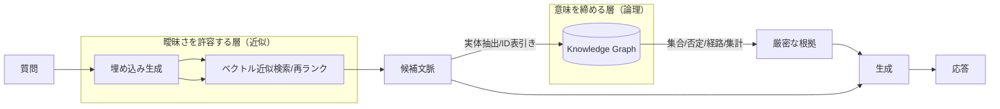
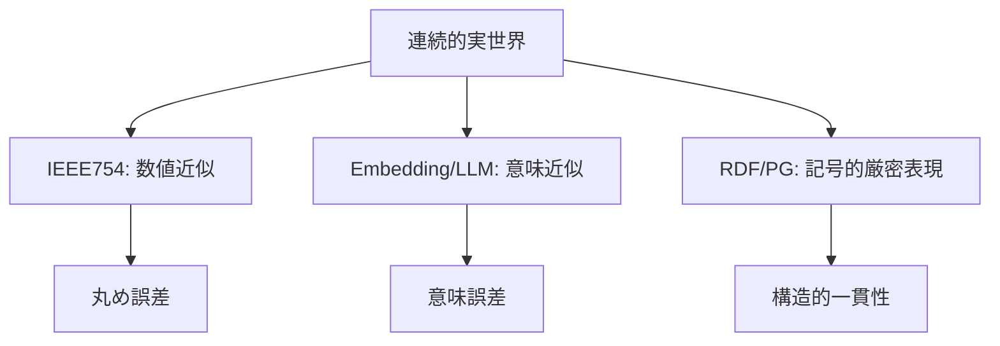

## はじめに — なぜ“誤差”から始めるのか

エンジニアが LLM／RAG／ベクトル DB を扱うときに悩みがちな「それっぽいけど決定的ではない」曖昧さは、数値計算における“浮動小数点誤差”にたとえると直感的に理解できます。本稿では、浮動小数点の基本から手を動かすミニ実験までを通じて、ベクトル類似度・しきい値判定・近似探索（ANN）の曖昧さを実務の観点で捉え直し、最後にナレッジグラフが担う「論理的厳密さ」との補完関係を整理します。

### 本稿の主張（3 行）

- 近似表現（浮動小数点・ベクトル類似）は「それっぽさ」を定量化するが、しきい値の境界で判定が不安定になりうる
- 論理的厳密さ（RDF/PG のクエリ・制約）は「正しさ」を担保するが、創発的連想や曖昧照合は不得手
- 実務では「曖昧さを許容する層（検索・類似）と、意味を締める層（知識グラフ）」のハイブリッドが現実解

> 注意（比喩の限界）：本稿でいう「浮動小数点 ≒ ベクトルの曖昧さ」は構造的な類似性を示す比喩であり、数学的に同一の現象ではありません。以下では誤解を避けるため、各所に注意書きを付しています。

## 背景・課題

LLM（大規模言語モデル）やベクトルデータベース、RAG（Retrieval-Augmented Generation）、ナレッジグラフなどの技術が注目されています。これらは情報検索や生成タスクにおいて強力ですが、その内部で扱われるデータの「それっぽさ」や曖昧さに起因する問題が多く見られます。本稿では、数値計算における浮動小数点誤差を比喩的な切り口として、こうした曖昧さを技術的に理解し、誤差を前提に設計する考え方を整理します。

浮動小数点誤差は、コンピュータが実数を有限のビット数で表現する際に生じる誤差であり、計算結果が厳密に一致しないことがあります。この現象は、LLM やベクトル DB における類似度計算や意味表現の曖昧さと構造的に類似していると考えられます。本記事では、浮動小数点誤差の基本から始め、Python による実験を通じてその性質を確認し、LLM や RAG、ナレッジグラフとの関係性を探ります。

## 技術的分析

### 浮動小数点誤差の基礎

浮動小数点数は、有限のビット数で実数を近似的に表現します。そのため、例えば「0.1 + 0.2」が「0.3」と厳密に等しくならないことがよく知られています。これは、2 進数で表現できない数値が存在するためであり、計算機内部での微小な誤差が累積することによって生じます。

> 注意：ここでの「誤差」は IEEE 754 浮動小数点表現・演算則に基づく丸め誤差などを指します。プログラムやハードウェアのバグとは区別してください。

※ 浮動小数点の基礎をすでに理解している方は、この節はざっと流し読みでも構いません。

### 体験 1：最小例（0.1 + 0.2 問題）

以下のコードは、Python で浮動小数点誤差を確認する簡単な例です。

```python
a = 0.1 + 0.2
b = 0.3
print(a == b)  # False
print(a)       # 0.30000000000000004
print(b)       # 0.3
```

この結果は、計算結果が厳密に一致しないことを示しています。こうした誤差は、数値計算の精度管理やアルゴリズム設計において重要な考慮点となります。

### 体験 2：isclose と許容誤差（しきい値の性質）

```python
import math
x = 0.1 + 0.2
print(math.isclose(x, 0.3, rel_tol=1e-9, abs_tol=0.0))  # False（厳しめ）
print(math.isclose(x, 0.3, rel_tol=1e-7))                # True（やや緩め）
```

許容誤差（トレランス）をどこに置くかで判定が反転します。わずかな閾値の違いが結果を変える構造は、後述するベクトル類似検索の「スコア閾値設定」と同じです。誤差を前提にした設計が不可欠です。

### 体験 3：桁落ち・補償和（Kahan Summation）

```python
def kahan_sum(values):
    s = 0.0
    c = 0.0
    for x in values:
        y = x - c
        t = s + y
        c = (t - s) - y
        s = t
    return s

vals = [1e-8] * 100_000  # 10万回
naive = sum(vals)
kahan = kahan_sum(vals)
print(naive, kahan, naive - kahan)
```

小さな値の多数回加算では、丸め誤差の蓄積が結果に影響します。補償和（Kahan）などの数値的工夫で安定性を改善できます。
このテクニックそのものを覚える必要はなく、「同じ数を足しているだけでも、実装次第で結果が少し変わる」ことを押さえておけば十分です。

### 体験 4：単精度/倍精度の違い（float32 vs float64）

```python
import numpy as np
a32 = np.float32(0.1) + np.float32(0.2)
a64 = np.float64(0.1) + np.float64(0.2)
print(a32 == np.float32(0.3))  # 結果は実装・丸めに依存
print(a64 == np.float64(0.3))  # False が一般的
```

同じ式でも表現精度（ビット幅）が異なると結果は一致しません。少なくとも float64 では「0.1 + 0.2 != 0.3」が再現され、float32 ではさらに誤差が顕著になります。

### LLM や RAG との“構造的”類似（比喩）

LLM やベクトル DB では、語彙や文脈をベクトル表現に変換し、類似度計算を行います。このベクトル表現もまた有限の次元数と精度で近似されているため、完全な一致は期待できません。ここでの「それっぽさ」は、浮動小数点誤差と同様に、近似的な表現の中で意味の類似性を評価することに起因しています。

RAG では、外部知識ベースからの情報を検索し、その結果を元に生成を行いますが、検索結果の曖昧さや不完全性は、浮動小数点誤差が計算結果に与える影響に似ています。つまり、情報の不確かさや誤差を前提とした設計が求められます。

> 注意：浮動小数点の誤差は数学的丸めの問題、ベクトル検索の曖昧さは意味表現・高次元幾何・近似探索アルゴリズム（ANN）由来であり、厳密な原因は異なります。ここでは「しきい値境界で判定が反転しうる」「近似である」という性質の比喩として扱います。

### 体験 5：ベクトル類似と閾値反転

```python
import numpy as np

def cos(a, b):
    return np.dot(a, b) / (np.linalg.norm(a) * np.linalg.norm(b))

def unit(theta):
    return np.array([np.cos(theta), np.sin(theta)], dtype=float)

u  = unit(0.0)
v1 = unit(np.deg2rad(5.1))  # 類似度 ≈ 0.996
v2 = unit(np.deg2rad(6.2))  # 類似度 ≈ 0.994
tau = 0.995

print("cos(u,v1)=", cos(u, v1))
print("cos(u,v2)=", cos(u, v2))
print("pass(v1)=", cos(u, v1) >= tau, "pass(v2)=", cos(u, v2) >= tau)
```

しきい値 `tau=0.995` のわずかな差で、`v1` は通り、`v2` は落ちます。実際の埋め込み空間は高次元で、かつ近似最近傍探索（ANN）や量子化の影響も加わるため、境界に近いアイテムの採否は小さな要因で反転しがちです。特に量子化インデックスでは、境界近傍のベクトルが隣接セルに分類されることで順位が入れ替わる現象も起こり得ます。

> 実務メモ：`top_k`/`score_threshold` の設計は「境界の挙動」を意識し、再現性（乱数・インデックス更新・モデル更新）に対するロバスト性を評価するのが重要です。

### RDF/PG の厳密性と“誤差”の意味の違い

一方で、RDF（Resource Description Framework）や PG（Property Graph）などのナレッジグラフは、意味的に厳密な関係性をグラフ構造で表現します。クエリ（Cypher/SPARQL）は論理的に定義可能で、否定・集合・経路・交差・集計などを正確に表現できます。

> 注意：「厳密＝真実」ではありません。KG はデータの整合性・一貫性を担保できますが、入力データが誤っていれば誤った事実を厳密に返します。ここで言う“誤差がない”は「論理評価に丸めがなく可観測性が高い」という意味に限られます。

このように、浮動小数点誤差を通じて、LLM や RAG の曖昧さとナレッジグラフの厳密さの違いを理解することができます。両者の特性を活かしたハイブリッドなシステム設計が今後の課題となるでしょう。

つまり、RDF/PG における「誤差がない」とは、**論理構造の整合性が保持される**ことを意味し、数値的な誤差や近似とは異なる概念です。

### Symbolic AI と Statistical AI の構造的違い

RDF や Property Graph は、記号を厳密に扱う **Symbolic AI（記号論的 AI）** に分類されます。一方、LLM や RAG は確率分布と近似空間を扱う **Statistical AI（統計的 AI）** に属します。

| 観点       | Symbolic AI（RDF/PG） | Statistical AI（LLM/RAG）      |
| ---------- | --------------------- | ------------------------------ |
| 表現対象   | 記号・関係・構造      | 意味・文脈・確率分布           |
| 主要な誤差 | 構造不整合            | 意味誤差・曖昧一致             |
| 比較手法   | 厳密一致（=`==`）     | 類似度・尤度（`>= threshold`） |
| 精度設計   | 一貫性・整合性重視    | 閾値・確率・スコア調整         |
| 主な強み   | 論理推論・説明可能性  | 柔軟性・創発的推論             |

実務上は両者を組み合わせて使うことが一般的であり、ここでの対比は典型的な特性として理解してください。

### 参考：詳細な比較と実装記事

- RAG と KG の役割分担・図解・実務観点の比較は「RAG を超える知識統合」を参照（Zenn）  
  https://zenn.dev/knowledge_graph/articles/beyond-rag-knowledge-graph
- KG 単独での QA を Docker で再現・RAG ベースラインと比較（5/50 項目）  
  https://zenn.dev/knowledge_graph/articles/kg-no-rag-starter
- GraphRAG/LightRAG の設計・比較・ベンチマーク観測（実験リポ参照）  
  https://github.com/DevRev-JP/tech-blog/blob/main/experiments/graphrag-lightrag/README.md

## 事例・応用

実際の応用例としては、LLM による文章生成とナレッジグラフによる事実検証の組み合わせが挙げられます。LLM は柔軟で創造的な出力を生成しますが、誤情報や曖昧な表現が含まれることがあります。ナレッジグラフを活用して事実関係を検証し、誤差を補正することで、より信頼性の高いシステムを構築可能です。例えば、ベクトル検索で得た文脈候補に対してナレッジグラフ上でエンティティ ID を照合し、確定した ID 群のみを LLM のプロンプトに組み込むと、曖昧な検索結果を構造的に補正できます。
この構成にしておくと、同じ質問に対する回答のブレを後から検証できるようになり、再現性の評価が容易になります。

また、ベクトル DB の類似度検索においても、誤差の性質を理解することで検索結果の解釈やチューニングが容易になります。例えば、閾値設定やクラスタリング手法の選定において、浮動小数点誤差の影響を考慮することが重要です。

### ハイブリッド構成の最小パターン



> ポイント：近似層は「広く拾う」、論理層は「正確に絞る」。論理層で ID・関係を確定させてから LLM に渡すと、再現性と説明性が上がります。GraphRAG/LightRAG のような構造化検索は中間に置く選択肢です（詳細は上記リンク参照）。

> 設計上は「誤差をゼロにする」ことではなく、**誤差を前提に安定化させる**発想が重要です。数値計算で許容誤差（epsilon）を設けるように、類似検索でも閾値や再ランクを調整しながら安定性を担保します。

### エンジニア向け要点

- しきい値（`score_threshold`）や `top_k` は再現性を見ながら決める（境界反転チェックを含む）
- インデックスや embedding の更新に対するドリフトを監視する（小数点の丸め誤差と同様、微小差の蓄積が境界をまたぐ）
- 否定・集合・経路・交差・集計が主となる問合せは KG 側で完結させる
- 生成前に根拠 ID/エッジをメタ情報として保持（Justified Context）

### 有限表現の三層モデル



この図は、有限精度で世界を扱う 3 つのアプローチを対比的に示しています。  
数値層では丸め誤差、意味層では曖昧さ、記号層では整合性がそれぞれ支配的要素になります。

## まとめ

本記事では、浮動小数点誤差という数値計算における基本的な現象を出発点として、LLM やベクトル DB、RAG の「それっぽさ」や曖昧さの本質を考察しました。浮動小数点誤差が示す近似的な表現の限界は、自然言語処理や情報検索の分野でも類似の課題として現れています。

一方で、RDF や PG のようなナレッジグラフは論理的厳密性を追求します（＝丸め誤差のような「演算上の曖昧さ」は基本的に持ちません）。今後はこれら二つのアプローチの長所を活かし、曖昧さと厳密さを適切に使い分けるシステム設計が求められるでしょう。

---

## 参考文献

- IEEE 754-2008: IEEE Standard for Floating-Point Arithmetic. https://ieeexplore.ieee.org/document/4610935
- Goldberg, D. (1991). What every computer scientist should know about floating-point arithmetic. ACM Computing Surveys (CSUR), 23(1), 5-48. https://dl.acm.org/doi/10.1145/103162.103163
- Python docs: `decimal` — Decimal fixed point and floating point arithmetic. https://docs.python.org/3/library/decimal.html
- NumPy documentation. https://numpy.org/doc/stable/
- Hogan, A., et al. (2021). Knowledge Graphs. https://kgbook.org/
- 関連記事（自著）: RAG を超える知識統合（Zenn）https://zenn.dev/knowledge_graph/articles/beyond-rag-knowledge-graph
- 関連記事（自著）: RAG なしで始めるナレッジグラフ QA（Zenn）https://zenn.dev/knowledge_graph/articles/kg-no-rag-starter
- 実験リポ: GraphRAG/LightRAG 比較と環境 https://github.com/DevRev-JP/tech-blog/tree/main/experiments/graphrag-lightrag

## 更新履歴

- 2025-11-08: 初版作成

## 注記

本記事は AI を活用して執筆しています。内容に誤りや補足があれば、Zenn のコメントよりお知らせください。
