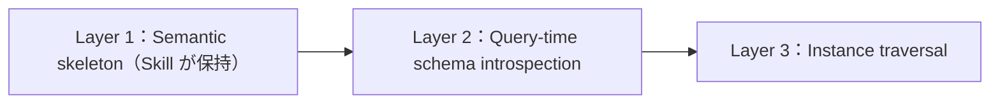

# Claude Code / Cursor Skill における Graph Traversal Contract

## 2026年ごろに見える「ナレッジグラフ」の再評価

2026年初頭から3月ごろにかけて、ナレッジグラフ（KG）は「RAG の補助」というより、**AI エージェントが長く・複雑なタスクで破綻しにくくする基盤**として語られる機会が増えています。以下の整理は網羅ではなく、**2026年3月時点の GitHub・ブログ等の公開情報**に基づく動機づけです（ツールの仕様はリポジトリの README が最優先です）。

### コードと依存をグラフにし、コーディングエージェントに渡す

リポジトリやモジュール、API 依存をエンティティと関係として表し、**MCP や CLI で Claude Code / Cursor / Windsurf 等から問い合わせる**構成が OSS で増えています。代表例として [**GitNexus**](https://github.com/abhigyanpatwari/GitNexus) があります。README や紹介記事では、リポジトリ解析から知識グラフを構築し、MCP サーバ経由でコーディングエージェントがクエリする流れ、依存関係・コールチェーン・影響範囲（blast radius）をグラフで扱う旨が説明されています。GitHub 上のスター数は **2026年3月21日時点**で **約 1.85 万**です。解説記事の例として [Medium（ion-oaie）](https://medium.com/@ion-oaie/gitnexus-the-nervous-system-your-ai-agent-was-missing-bc7eec3c0eba)、[yuv.ai のブログ](https://yuv.ai/blog/gitnexus)、[paperclipped.de の英語記事](https://www.paperclipped.de/en/blog/gitnexus-code-knowledge-graph-ai-agents) があります。

同様の発想で、ローカルコードベースを RDF/SPARQL の知識グラフとしてエージェントから扱う [**codekg-sparql**](https://github.com/pebaryan/codekg-sparql) は、README に CLI および MCP 経由でのアクセスを明記しています。永続メモリと知識グラフをまとめた MCP 実装として [**novyx-mcp**](https://github.com/novyxlabs/novyx-mcp) が公開されており、複数の MCP ツールと監査ログ等を謳う README が確認できます。

ほか、X 上では tree-sitter でスキャンしたグラフを可視化しチーム共有する、といった開発者投稿や、Claude Code 向けのローカル知識グラフを紹介する投稿も見られます（投稿単位の URL は変動しやすいため、本稿ではツール名に留めます）。**共通しているニーズ**は、ファイルgrepや単純なコンテキストウィンドウだけでは足りず、**プロジェクト全体の意味構造をグラフで短く・検査可能に渡す**ことです。

### セッションをまたぐ「記憶」を、フラットなログではなくグラフで持つ

エージェントの永続メモリを、単なる要約テキストではなく **型付きのノードとエッジ**で積む設計が、フレームワークや MCP 実装の議論に出てきます。意味が崩れにくい、検証しやすい、という理由です（上記 novyx-mcp のような「メモリ＋グラフ」を一つの MCP にまとめる例も含みます）。

### GraphRAG／ハイブリッド検索と本稿の関係

コミュニティ要約やクラスタ検索に加え、リレーショナルやログからグラフを更新して検索パイプラインに載せる、といった話も増えています。ナレッジグラフと GraphRAG の違いそのものは [RAG を超える知識統合](https://zenn.dev/knowledge_graph/articles/beyond-rag-knowledge-graph) を参照してください。

---

こうした背景のうえで、**多くの開発者が日々触っている Claude Code や Cursor** から KG にアクセスする場合、接続（MCP や API）以前に決定的なのは次の問いです。

**「エージェントに、グラフをどう読ませるかを固定しているか」**

接続はできても、関係の向きや探索の始点が実行ごとに変われば、Cypher や Gremlin の生成は安定せず、結果として **根拠のない補完（いわゆる幻覚）** が混ざります。本稿のメインは、その対策として Skill に **Graph Traversal Contract（グラフ探索契約）** を書く、という実務上のコツです。

Claude Code と Cursor は製品が異なりますが、**エージェントに長文のルールや Skill を渡して外部ツールと組み合わせる**という使い方は近く、本稿の契約は **リポジトリにコミットできるテキスト**として共通化しやすい、という意味で併記しています。  
なお **Skill の置き場所・ファイル形式は製品ごとに異なります**（Claude Code の Skill／プロジェクト指示、Cursor の Project Rules 等）。最新のパスや書き方は、**各製品の公式ドキュメント**を参照してください。

> **本ブログでの位置づけ**  
> MCP と KG の役割分担や「意味のキャッシュ」としての KG は [MCP の課題とナレッジグラフ](https://zenn.dev/knowledge_graph/articles/mcp-knowledge-graph) を、形式レイヤ全般は [LLM/RAG の曖昧性を抑える形式レイヤの実装ガイド](https://zenn.dev/knowledge_graph/articles/formal-layer-llm-rag-2025-11) を参照してください。本稿は **Claude Code / Cursor 上で KG を読ませるときの「読み方の規約」** に絞ります。

---

## Claude Code / Cursor から KG を使うときのコツ

Skill（やプロジェクトルール、AGENTS 系の指示）は、エージェントに **外部システムの使い方** を渡すインターフェースとして機能します。KG の場合、よくある失敗は「Skill にプロパティ一覧や例データを詰め込みすぎる」ことです。モデルは長いスキーマを一貫して解釈しきれず、**都度、関係の向きや探索の深さを推測**します。

実務で効くのは次の方針です。

1. **Skill はナレッジストアにしない** — 事実とトポロジは KG 側。Skill には **正規の型・関係・向き・入口・hop 上限・証拠ルール**だけを書く。
2. **質問の種類ごとに「探索の入口」を決める** — 「誰が所有」「何に依存」「どの障害が何に影響」など、意図別にスタートノードの型を固定する。
3. **ID の解決順を固定する** — `slug` と `display_name` が両方あるときに毎回ブレないよう、優先順位を文章で明示する。
4. **答えは証拠付きに限定する** — ノード ID・辿った辺・経路が揃わないときは **推測で埋めず**、`unknown` や候補一覧に落とす、と Skill に書く。
5. **契約をリポジトリで版管理する** — アプリのコードと同様、探索仕様も **変更履歴のあるテキスト**として扱うと、スキーマが増えても「正規部分」だけ追従しやすい。

これらを一つの Skill にまとめたものを、本稿では **Graph Traversal Contract** と呼びます。以下では契約の中身を例示し、Skill と KG の責務分離まで落とし込みます。

---

## なぜ「契約」が要るか

原因は KG そのものより、**エージェント側に探索仕様がない**ことにあります。代表的には次の不安定さが出ます。

| 問題                   | 起きること                                                          |
| ---------------------- | ------------------------------------------------------------------- |
| 関係意味の揺れ         | `OWNS` や `DEPENDS_ON` の向きを推測し、生成クエリが実行ごとに変わる |
| エンティティ解決の揺れ | `alias` / `display_name` / `slug` など複数候補から、開始点がブレる  |
| 深さの暴走             | hop 無制限・無関係な拡張・意図しない結合                            |
| 証拠なし回答           | 走査が空振りしても LLM が穴埋めし、決定的な正答が成立しない         |
| スキーマドリフト       | ラベルや関係が増えるほど、解釈が追従できない                        |

KG は事実の置き場（truth source）であり、**「どう辿るか」の仕様は別レイヤ**に置く、という分離がここでは鍵です。

---

## Contract に書く内容（例）

Skill は **インスタンス知識や全プロパティ一覧を保持しない**前提で、次のような **安定した解釈規則だけ** を宣言します。

### コア型と正規関係（例）

- **Entity types**: `Service`, `System`, `Team`, `Incident`, `Document`
- **Canonical relations（向き付き）**  
  `Team OWNS Service` / `Service DEPENDS_ON System` / `Incident IMPACTS Service` / `Document DESCRIBES Service`

### 向きの固定（推測禁止）

- `OWNS`: Team → Service
- `DEPENDS_ON`: Service → System
- `IMPACTS`: Incident → Service
- `DESCRIBES`: Document → Service

### Identity の優先順位（例）

- Service: `service_id` > `canonical_name` > `alias`
- Team: `team_id` > `slug` > `display_name`
- Document: `doc_id` > `title`

### 質問型ごとの入口（Entry points）

- 所有・担当: Team または Service から
- 依存: Service から
- 影響: Incident から
- ドキュメント: Document から

### 走査の制約

- **最大 hop 数**（例: 3）
- **許可する拡張順序**（例: 1-hop は正規関係のみ → 依存チェーン → 影響伝播など、運用で定義）

### 証拠要件

回答には **サポートするノード ID・関係型・辿った経路** を含める。欠ける場合は **`unknown` を返す** など、推測で埋めないポリシーを明示します。

### 曖昧さの扱い

複数マッチ時は **候補一覧を返し、勝手に 1 件に絞らない**。

### 禁止行為（明示）

- 欠損エッジの推論
- 関係の向きの当て推量
- 存在しないエンティティの合成
- 走査証拠のない断定回答

### Skill.md の記載例（本稿ドメイン）

上記の型・関係・ルールを **1 ファイルにまとめた例**です。契約本文は **英語**で書くことが多く、**指示・禁止の語彙がモデルの学習分布と重なりやすく制約が伝わりやすい**ことに加え、同じ内容なら **トークン数を抑えやすい**という実務上の理由があります（チームの作業言語が日本語でも、Contract だけ英語にする運用はよくあります）。Claude Code の Skill や Cursor の Project Rules 等へ置くときは、**製品ごとのパス・命名**に合わせてください。YAML の `description` は、エージェントが Skill を選ぶ際の要約として機能します。

````markdown
---
name: graph-traversal-contract-ops
description: Graph Traversal Contract for KG queries (Service/Team/System/Incident/Document). Fixes relation direction, entry points, hops, evidence rules, and prohibited actions. No instance knowledge.
---

# Graph Traversal Contract (ops domain example)

## Purpose

This Skill is not a knowledge store. Facts and topology live in the KG. This Skill only declares **canonical types, relations, direction, entry points, hop cap, and evidence rules**.

## Entity types (canonical)

- `Service`, `System`, `Team`, `Incident`, `Document`

## Canonical relations (direction is mandatory; do not guess)

- `Team OWNS Service` / `Service DEPENDS_ON System` / `Incident IMPACTS Service` / `Document DESCRIBES Service`
- Direction:
  - `OWNS`: Team → Service
  - `DEPENDS_ON`: Service → System
  - `IMPACTS`: Incident → Service
  - `DESCRIBES`: Document → Service
- Do **not** reinterpret directions. If unclear, do not run a query; return `unknown`.

## Identity resolution (priority order)

- Service: `service_id` > `canonical_name` > `alias`
- Team: `team_id` > `slug` > `display_name`
- Document: `doc_id` > `title`
- System / Incident: follow the KG schema (if unset, prefer tool schema introspection)

## Entry points by question type

- Ownership / responsibility: start from Team or Service
- Dependencies: start from Service
- Impact: start from Incident
- Documentation: start from Document

## Traversal limits

- Max hops: **3**
- At 1-hop, allow **canonical relations only** (expansion order as defined by ops)

## Evidence requirement

Answers must include **node IDs, relation types, and traversed paths** supporting the claim. If missing, return **`unknown`**; do not guess.

## Ambiguity

If multiple matches, return a **candidate list**. Do **not** pick one arbitrarily.

## Prohibited

- Inferring missing edges
- Guessing relation direction
- Inventing entities
- Definitive answers without traversal evidence
````

---

## Skill と KG の責務分離

| レイヤ                       | 役割                                                                          |
| ---------------------------- | ----------------------------------------------------------------------------- |
| **Skill（本稿の Contract）** | グラフ意味の固定、入口・向き・ID 優先、推論・深さの制約、証拠ベース回答の強制 |
| **KG**                       | フルスキーマ、プロパティ、インスタンス、別名、時刻、トポロジ                  |

エージェントの典型フローは次のようになります。

1. Skill を読み Contract を取得
2. KG からスキーマ（必要なら）を取得
3. エンティティ候補を列挙し、解決規則を適用
4. 制約付きで走査を実行
5. **証拠サブグラフ**を組み立てる
6. 証拠に基づき自然文を生成（または構造化出力）

Claude Code / Cursor では、この Skill を **チームで共有する単一の「読み方」**として置くことで、モデル差やセッション差によるブレを減らせます。

---

## 設計原則（4 つ）

**原則 1 — Skill はオントロジーの「薄い骨格」だけ**  
含める: 正規型・正規関係・向き・ID 優先・入口・解釈規則・証拠制約。  
含めない: 全プロパティ一覧、インスタンス知識、都合よい派生関係、都度変わるラベル設計の丸ごと載せ。

**原則 2 — Skill は知識ストアではなく推論コントローラ**  
「何を知っているか」ではなく「**どう読むか**」を制御する。

**原則 3 — 安定語彙だけを保持**  
ownership / dependency / impact / containment / description のような **意味が長期安定**する軸に寄せる。一時ラベルやインデックス専用プロパティだけの意味は載せない。

**原則 4 — 層は 3 つに分け、Skill は Layer 1 のみ**



実行時のスキーマ内省や実データの走査は、Skill の外（ツール実装・KG 側）で行います。

---

## 期待できる効果

- 走査とクエリ生成の **再現性**
- **幻覚の抑制**（証拠なし回答をポリシーで止める）
- 曖昧一致の **検出**（候補提示）
- スキーマ変更に対する **解釈の耐性**（Contract をバージョン管理し、型・関係の「正規部分」だけ追従）

### 限界・注意

契約の行数が増えすぎると、Skill 自体が**またスキーマのように**読みづらくなります。ドメインが変わるたびに正規関係を増やし続けると、**契約の保守**がボトルネックになります。あくまで「薄い骨格」に留め、説明責任が必要な本番では**監査ログやツール呼び出しの記録**（誰がどの経路に基づき回答したか）を別途設計することが多いです。  
組織では **契約テキストの変更を誰が承認するか**（ドメインオーナーやアーキテクチャレビューをどう回すか）を決めておくと、正規関係の追加・変更の**帰属**が追いやすくなります。

---

## 関連記事（本ブログ）

- [MCP の課題とナレッジグラフ](https://zenn.dev/knowledge_graph/articles/mcp-knowledge-graph) — 接続と意味のレイヤ分離
- [RAG を超える知識統合](https://zenn.dev/knowledge_graph/articles/beyond-rag-knowledge-graph) — GraphRAG と KG の区別
- [RAG なしで始めるナレッジグラフ QA](https://zenn.dev/knowledge_graph/articles/kg-no-rag-starter) — Cypher 等による決定的な問い合わせのイメージ
- [LLM/RAG の曖昧性を抑える形式レイヤの実装ガイド](https://zenn.dev/knowledge_graph/articles/formal-layer-llm-rag-2025-11) — 形式レイヤとしての KG

---

## 参考文献（外部・公開情報）

本稿の「コードベースのグラフ化と MCP」に関する記述は、主に次の一次情報に基づきます（**執筆時点のスナップショット**であり、スター数・README の内容は変動します。本文の GitNexus スター数は **2026年3月21日時点**）。

- [abhigyanpatwari / GitNexus（GitHub）](https://github.com/abhigyanpatwari/GitNexus) — リポジトリ・README・スター数
- [pebaryan / codekg-sparql（GitHub）](https://github.com/pebaryan/codekg-sparql) — CLI / MCP の README 記載
- [novyxlabs / novyx-mcp（GitHub）](https://github.com/novyxlabs/novyx-mcp) — 永続メモリ・MCP ツール群の README 記載
- [GitNexus: The nervous system your AI agent was missing（Medium, ion-oaie）](https://medium.com/@ion-oaie/gitnexus-the-nervous-system-your-ai-agent-was-missing-bc7eec3c0eba)
- [yuv.ai Blog — GitNexus](https://yuv.ai/blog/gitnexus)
- [GitNexus: Code Knowledge Graph for AI Agents（paperclipped.de）](https://www.paperclipped.de/en/blog/gitnexus-code-knowledge-graph-ai-agents)

X 上の開発者投稿・ハッシュタグ付きの紹介は、URL が固定されにくいため本文では概要にとどめました。必要に応じて各ハンドル名と日付で検索してください。

---

## 更新履歴

- 2026-03-22: 初版公開

---

## フィードバック受け付け

本稿の前提や用語の取り方に誤り・改善点があれば、Zenn のコメントでご指摘いただけると助かります。
