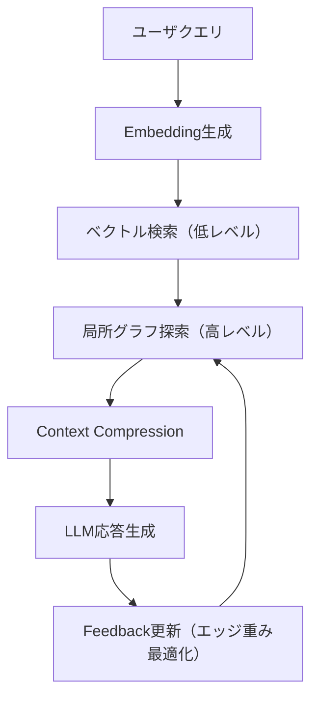

# GraphRAG の限界と LightRAG の登場

## はじめに — Beyond-RAG の続編として

本稿は、既報「[RAG を超える知識統合](https://zenn.dev/knowledge_graph/articles/beyond-rag-knowledge-graph)」の続編です。  
前稿では、RAG（Retrieval-Augmented Generation）の限界として「文脈の連鎖を理解できない」「関係性を推論できない」という問題を扱いました。

その課題を克服しようとするのが **GraphRAG** でした。  
GraphRAG は「物語（narrative）」の発見を目指し、文書をグラフ構造として結びつけることで、生成 AI に“語り”を与えようとする試みです。  
しかし、運用や拡張の段階で新たな問題が生まれます。

本稿では、GraphRAG の**narrative discovery 構造の限界**を整理し、それを超えるために設計された**LightRAG**の技術的意図と構造を分析します。  
最終的には、LightRAG を「RAG の次」ではなく、**“構造化生成モデル（Structure-first Generation）”**として再定義します。

---

## 背景 — GraphRAG の語り構造とその限界

GraphRAG は、文書間の関係をグラフで表し、LLM が「語りの骨格」を再構築する仕組みでした。  
Microsoft Research の _“GraphRAG — Unlocking LLM discovery on narrative private data”_ に代表されるように、目的は「ナラティブ（語り）を構造化して再発見する」ことです。

しかし、この“語りの発見（narrative discovery）”構造にはいくつかの限界があります。

### GraphRAG（narrative discovery）の限界 ── どこで詰まるのか

- **クラスター前提の要約バイアス**：意味が近い断片が「同じ物語」とみなされ、少数派の因果線が埋もれる。
- **固定深度探索の限界**：疎な関係を十分にたどれず、本質的な関係に届かない。
- **再現性の欠如**：どのエッジが答えに効いたのかが曖昧で、再実行時に説明性が失われる。
- **更新コストの高さ**：新しい文書や関係を追加するたびにグラフ全体を再構築する必要がある。

> **LightRAG が狙う穴**  
> これらの課題を解消するために、LightRAG は「全体グラフを常時保持せず、**クエリ依存の局所サブグラフをオンデマンドで構築**する」アプローチを採用します。

---

## LightRAG の設計思想とアーキテクチャ

LightRAG は、GraphRAG の設計を軽量化し、動的かつ自己更新的にした構造化検索フレームワークです。  
その中核には次の三要素があります。

1. **軽量化（Lightweight）** — クエリ単位で局所グラフを構築し、全域探索を避ける
2. **階層化（Hierarchical Retrieval）** — ベクトル検索（低レベル）＋グラフ探索（高レベル）の二層検索
3. **適応学習（Adaptive Feedback）** — LLM の attention 重みに基づいてエッジ重みを動的調整

### Retrieval Flow



### データ構造（LightGraph Index）

| 要素       | 内容                                                     |
| ---------- | -------------------------------------------------------- |
| ノード     | `id, text_ref, emb (ℝ^d), degree, centrality`            |
| エッジ     | `src, dst, rel, w_struct, w_attn, ts`                    |
| サブグラフ | `G_q = (V_q, E_q)`（クエリ q に依存して生成）            |
| 索引構造   | ベクトル側：FAISS/Milvus（HNSW）<br>グラフ側：隣接リスト |

#### 停止条件と計算量

- 深さ停止：`d_max ∈ {1,2}`
- スコア停止：`node.final_score < θ`
- 収束停止：`||scores^t - scores^{t-1}||_1 < ε`

計算量：

- ベクトル検索：`O(log n)` × k
- グラフ探索：`O(|E_q|)`
- 全体：GraphRAG の`O(n²)`に対し、LightRAG は**`O(k × d_max × avg_degree)`**

---

### 実験環境での再現

詳細なセットアップ・API・評価手順・トラブルシュートは、実験用 README に集約しました。  
👉 [GitHub 上の実験用 README](https://github.com/DevRev-JP/tech-blog/blob/main/experiments/graphrag-lightrag/README.md) を参照してください。

（記事本文では設計意図と比較観点のみを扱います。手元で再現して差分を体感したい方は上記 README へ。）

## GraphRAG から LightRAG への転換点 ─ 構造化生成モデル

LightRAG は、単なる RAG の改良ではありません。  
**生成の前に構造を計画する**“構造化生成モデル（Structure-first Generation）”として位置づけられます。

### 構造化生成モデルの設計原則

1. **Plan → Retrieve → Constrain → Generate**
   - 生成前に「何を・どの順で説明するか」を構造化（ノード・パス単位で計画）
2. **Justified Context**
   - 各生成文に「どのノード／エッジに基づいたか」をメタ情報として保持
3. **Adaptive Depth**
   - クエリの性質に応じて探索深度を動的制御

#### 擬似コード例

```python
plan = graph.plan(query, max_sections=3)
ctx  = graph.materialize(plan, d_max=2, theta=0.2)
ans  = llm.generate(template, sections=plan, context=ctx)
```

これにより、生成の順序・根拠・再現性を担保できます。

---

## LightRAG 以降の派生研究 ─ 弱点と補完関係

| 課題             | 派生手法          | 主要改善点                                            |
| ---------------- | ----------------- | ----------------------------------------------------- |
| 意味的深さ不足   | **HiRAG**         | トピック階層を導入し、「どの抽象度で答えるか」を制御  |
| ノイズ伝搬       | **E²GraphRAG**    | 探索幅と反復回数を理論的に制御し安定性を向上          |
| 二項関係の限界   | **HyperGraphRAG** | n-ary（多項）関係を表現し、因果・文脈の多項結合を処理 |
| 異種ノード最適化 | **NodeRAG**       | 異構造データのノードタイプごとに埋め込み層を最適化    |

これらの研究は、LightRAG を起点として「意味的階層」「効率」「汎用構造」を拡張する方向で進化しています。

---

## RDF/OWL との橋渡し ─ Semantic GraphRAG の限界と実用域

LightRAG は構造的推論に優れますが、RDF/OWL が担う**意味論的整合性**を完全には代替できません。  
両者を組み合わせた **Semantic GraphRAG** は、次のように役割を分担します。

| 層       | 処理内容                   | 技術例           |
| -------- | -------------------------- | ---------------- |
| 意味論層 | 制約・推論（RDF/OWL）      | RDFox, Stardog   |
| 構造層   | 関連探索・生成（LightRAG） | Neo4j, LangChain |

### 製造 BOM ユースケース

1. RDF/OWL で部品階層・制約を定義
2. `rdf2pg` により Property Graph に変換
3. LightRAG で「設計変更の影響」を局所サブグラフで推論・生成

```bash
rdf2pg --input bom.ttl --out nodes.csv --edges edges.csv --format neo4j
```

```cypher
LOAD CSV WITH HEADERS FROM 'file:///edges.csv' AS row
MATCH (s:Part {id: row.src}), (t:Part {id: row.dst})
MERGE (s)-[r:DEPENDS_ON]->(t)
SET r.w_struct = toFloat(row.weight)
```

これにより、「制約の整合性を保持しつつ、構造的に関連ノードを高速探索する」実運用構成が実現します。

---

## ベンチマークと再現性 ─ 自分で動かす LightRAG

本記事で示す指標（レイテンシ、トークン投入量、正答率）は **リポ内の実験環境**で再現できます。  
手順・スクリプト・質問セットは以下にまとめています。

- 実験手順・API・比較ユースケース: [GitHub 上の実験用 README](https://github.com/DevRev-JP/tech-blog/blob/main/experiments/graphrag-lightrag/README.md)

> **重要**: 実験環境では、`kg-no-rag` 実験と同じデータセット（5 項目版の `docs.jsonl`）と質問セットを使用できます。これにより、**KG（ナレッジグラフ）、RAG（ベクトル検索）、GraphRAG、LightRAG** の 4 つの手法を同じ条件で比較できます。詳しくは実験用 README を参照してください。
>
> 注: 実測値はマシン構成・データセットで変動します。論点は**比較方法と可観測メトリクス**であり、固定値ではありません。

### 実装上の注意と解釈（誤解を避けるために）

- 本リポの GraphRAG/LightRAG は学習用の簡易実装です。小規模データでは両者の正答率が同点になることがあり、レイテンシが GraphRAG 有利に見える場合もあります。
- これは GraphRAG（簡易実装）が「キーワード → 局所探索」の固定コストのみで済む一方、LightRAG が「埋め込み生成＋ベクトル検索＋スコア統合」の固定オーバーヘッドを持つためです。
- 一方で LightRAG の価値は、以下の運用面にあります。
  - `top_k` による文脈圧縮の可制御性（回答長・投入トークン量の予算管理）
  - クエリ毎の局所サブグラフ構築（全体再構築を前提としない）
  - `/feedback` による即時フィードバック反映（重み更新）
- 規模が大きいほど（全体グラフの維持コストが効くほど）、LightRAG は「入口で絞って局所化する」設計により、レイテンシや更新コスト面で相対優位になり得ます。小規模の実測が逆転することは理論に反しません。

## まとめ ─ 構造を読む AI から構造を設計する AI へ

GraphRAG は「物語を読む AI」でした。  
LightRAG は「構造を学習し、最適化する AI」へと進化しました。  
そして今後は、**構造を計画し、意味を設計する AI** への道が拓かれています。

| 世代                       | 特徴           | 役割             |
| -------------------------- | -------------- | ---------------- |
| GraphRAG                   | 語りを読む     | 構造的探索の導入 |
| LightRAG                   | 構造を学ぶ     | 自己更新と軽量化 |
| Structure-first Generation | 構造を設計する | 意味と生成の融合 |

この流れは、「検索強化」ではなく「知識生成の体系化」そのものです。  
構造化生成モデルは、**知識を使う AI から、知識を構成する AI へ**の移行点を示しています。

---

### 参考文献

- Z. Guo 他 (2024-09). _LightRAG: Simple and Fast Retrieval-Augmented Generation_. OpenReview.
- H. Han 他 (2024-12). _Retrieval-Augmented Generation with Graphs (GraphRAG)_. arXiv.
- H. Huang 他 (2025-03). _HiRAG: Retrieval-Augmented Generation with Hierarchical Knowledge_. arXiv.
- Y. Zhao 他 (2025-05). _E²GraphRAG: Streamlining Graph-based RAG for High Efficiency and Effectiveness_. arXiv.
- Neo4j Labs. _rdf2pg: RDF to Property Graph Conversion Toolkit_. GitHub.
- Microsoft. _GraphRAG Repository_. [https://github.com/microsoft/graphrag](https://github.com/microsoft/graphrag)
- HKUDS. _LightRAG Repository_. [https://github.com/HKUDS/LightRAG](https://github.com/HKUDS/LightRAG)

---

### 更新履歴

- 2025-10-30 — 構造化生成モデルの位置づけを明確化した完全リライト版

### 注記

本記事は AI を活用して執筆しています。  
内容に誤りや追加情報があれば、Zenn のコメントまたは  
[フィードバックフォーム](https://zenn.dev/knowledge_graph) よりお知らせください。
