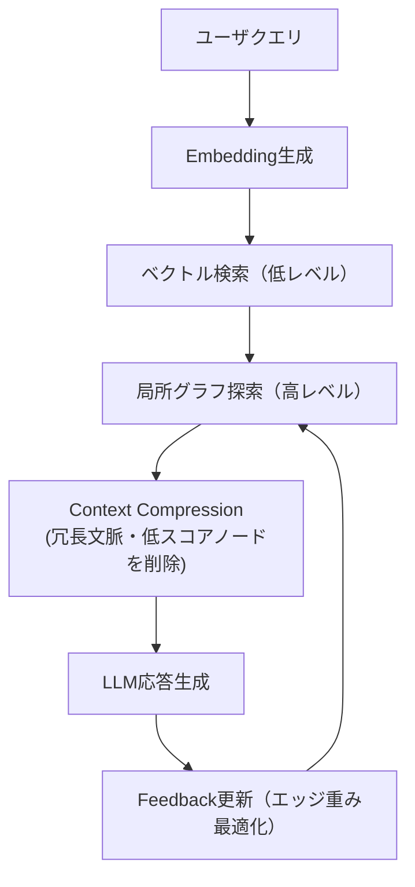

# GraphRAG の限界と LightRAG の登場

## はじめに — GraphRAG の限界と LightRAG の登場

RAG（Retrieval-Augmented Generation）は、外部知識を検索して回答生成を補う代表的な仕組みです。しかし、文書間の関係や因果構造を十分に理解できず、「文脈をつなぐ推論」が難しいという課題がありました。

この弱点を補う試みとして登場したのが **GraphRAG** です。GraphRAG は文書やエンティティをグラフ構造として結びつけ、LLM が「語り（narrative）」の流れをたどれるようにするアプローチです。ただし、その実装には探索コストや更新の難しさなど、現場での課題も多く指摘されています。

本稿では、GraphRAG の**構造的な限界**と、それを継承・発展させた **LightRAG** の設計思想・アーキテクチャを整理します。また、LightRAG を「RAG の改良版」ではなく、**"構造化生成モデル（Structure-first Generation）"**としての位置づけを示します。

※本稿は LightRAG の公式論文や実装を参照しつつ、エンジニアの立場で理解した内容を整理したものです。設計思想や構造の理解を共有することを目的としており、厳密な理論再現や研究的主張を意図したものではありません。

> 関連資料：GraphRAG や背景理論の基礎は「[RAG を超える知識統合](https://zenn.dev/knowledge_graph/articles/beyond-rag-knowledge-graph)」を参照してください。

## 背景 — GraphRAG の語り構造とその限界

GraphRAG は、文書間の関係をグラフで表し、LLM が「語りの骨格」を再構築する仕組みでした。Microsoft Research の _"GraphRAG — Unlocking LLM discovery on narrative private data"_ に代表されるように、目的は「ナラティブ（語り）を構造化して再発見する」ことです。

しかし、この“語りの発見（narrative discovery）”構造にはいくつかの限界があります。

### GraphRAG（narrative discovery）の限界 ── どこで詰まるのか

- **クラスター前提の要約バイアス**：意味が近い断片が「同じ物語」とみなされ、少数派の因果線が埋もれる。
- **固定深度探索の限界**：疎な関係を十分にたどれず、本質的な関係に届かない。
- **再現性の欠如**：どのエッジが答えに効いたのかが曖昧で、再実行時に説明性が失われる。
- **更新コストの高さ**：新しい文書や関係を追加するたびにグラフ全体を再構築する必要がある。

> **LightRAG が狙う穴**  
> これらの課題を解消するために、LightRAG は「全体グラフを常時保持せず、**クエリ依存の局所サブグラフをオンデマンドで構築**する」アプローチを採用します。

---

## LightRAG の設計思想とアーキテクチャ

LightRAG は GraphRAG の設計を軽量化し、動的かつ自己更新的にした構造化検索フレームワークです。その中核には次の三要素があります。

1. **軽量化（Lightweight）** — クエリ単位で局所グラフを構築し、全域探索を避ける
2. **階層化（Hierarchical Retrieval）** — ベクトル検索（低レベル）＋グラフ探索（高レベル）の二層検索
3. **適応学習（Adaptive Feedback）** — LLM の attention 重みに基づいてエッジ重みを動的調整

※重み更新の具体的な実装は環境により異なります（本リポの簡易実装では手動フィードバックが必要です）。

### Retrieval Flow



### LightRAG の構造と動き

LightRAG は、GraphRAG のように全体の知識グラフを常に維持するのではなく、「質問に関係のありそうな部分だけ」を一時的に取り出して使う仕組みです。

#### 構成のイメージ

| 構成要素       | 役割                                                  |
| -------------- | ----------------------------------------------------- |
| **ノード**     | 文書やエンティティ（それぞれに意味ベクトルを持つ）    |
| **エッジ**     | ノード同士の関係（たとえば “関連する” や “依存する”） |
| **サブグラフ** | クエリごとに動的に作られる小さなグラフ                |

LightRAG はこの「サブグラフ」を毎回つくり直し、まずベクトル検索で候補ノードを見つけ、それを起点に関係ノードをたどります。途中で関連性が低いノード（スコアが一定以下のもの）は切り捨て、探索の深さも 1〜2 ホップ程度に制限します。こうして、**必要な部分だけを軽く構築して使う**わけです。

GraphRAG が「全体マップを常に広げて探索する」方式だとすれば、LightRAG は「必要な範囲だけをその場でマッピングする」方式といえます。

この違いによって、

- GraphRAG は規模が大きくなるほど再構築コストが増える
- LightRAG はクエリ単位で再構成できるため、**スピードと柔軟性に優れる**

という特性の差が生まれます。実務では、更新頻度が高い・データが増え続ける場面ほど、この差が顕著になります。

---

### 実験環境での再現

（※ 詳細手順・API・比較スクリプトは **「ベンチマークと再現性」節**の GitHub README へのリンクに統合しています。）

## GraphRAG から LightRAG への転換点 ─ 構造化生成モデルとしての理解

ここでは便宜上、生成前に構造を決め、その構造に沿って生成する手法を"構造化生成モデル（Structure-first Generation）"と呼びます。

※本稿での"構造化生成モデル"は、論文側の厳密な定義語ではなく、LightRAG の設計を理解するための便宜的な呼称です。

LightRAG はクエリ単位で局所グラフを構築する設計です。私の理解では、これは"必要な範囲だけをその場でマッピングする"発想に近いです。

### 構造化生成モデルの設計原則

1. **Plan → Retrieve → Constrain → Generate**
   - 生成前に「何を・どの順で説明するか」を構造化（ノード・パス単位で計画）
2. **Justified Context**
   - 各生成文に「どのノード／エッジに基づいたか」をメタ情報として保持
3. **Adaptive Depth**
   - クエリの性質に応じて探索深度を動的制御

#### 擬似コード例

```python
plan = graph.plan(query, max_sections=3)
ctx  = graph.materialize(plan, d_max=2, theta=0.2)
ans  = llm.generate(template, sections=plan, context=ctx)
```

これにより、生成の順序や根拠を明確にし、再現性を高めることができます。

---

## LightRAG 以降の派生研究 ─ 弱点と補完関係

| 課題             | 派生手法          | 主要改善点                                            |
| ---------------- | ----------------- | ----------------------------------------------------- |
| 意味的深さ不足   | **HiRAG**         | トピック階層を導入し、「どの抽象度で答えるか」を制御  |
| ノイズ伝搬       | **E²GraphRAG**    | 探索幅と反復回数を理論的に制御し安定性を向上          |
| 二項関係の限界   | **HyperGraphRAG** | n-ary（多項）関係を表現し、因果・文脈の多項結合を処理 |
| 異種ノード最適化 | **NodeRAG**       | 異構造データのノードタイプごとに埋め込み層を最適化    |

これらの研究は、LightRAG を起点として「意味的階層」「効率」「汎用構造」を拡張する方向で進化しているように見えます。

---

## RDF/OWL との橋渡し ─ Semantic GraphRAG の実用と課題

LightRAG は構造的推論に優れますが、RDF/OWL が担う**意味論的整合性**を完全には代替できません。両者を組み合わせた **Semantic GraphRAG** は、次のように役割を分担していると理解できます。

| 層       | 処理内容                   | 技術例           |
| -------- | -------------------------- | ---------------- |
| 意味論層 | 制約・推論（RDF/OWL）      | RDFox, Stardog   |
| 構造層   | 関連探索・生成（LightRAG） | Neo4j, LangChain |

### 製造 BOM ユースケース

1. RDF/OWL で部品階層・制約を定義
2. Neo4j の `neosemantics (n10s)` で RDF を取り込み（Property Graph 化）
3. LightRAG で「設計変更の影響」を局所サブグラフで推論・生成

```cypher
// 初期設定（語彙URIの短縮など）
CALL n10s.graphconfig.init({ handleVocabUris: "SHORTEN" });
// RDF/Turtle を直接取り込み
CALL n10s.rdf.import.fetch("file:///bom.ttl", "Turtle");
```

```cypher
// n10s が作成した関係（例: dependsOn）を業務向けの関係へマッピング
MATCH (s)-[:dependsOn]->(t)
MERGE (s)-[r:DEPENDS_ON]->(t)
SET r.w_struct = coalesce(r.w_struct, 1.0)
```

これにより、「制約の整合性を保持しつつ、構造的に関連ノードを高速探索する」実運用構成が実現すると考えられます。

---

## ベンチマークと再現性 ─ 自分で動かす LightRAG

本記事で示す指標（レイテンシ、トークン投入量、正答率）は **リポ内の実験環境**で再現できます。手順・スクリプト・質問セットは以下にまとめています。

- 実験手順・API・比較ユースケース: [GitHub 上の実験用 README](https://github.com/DevRev-JP/tech-blog/blob/main/experiments/graphrag-lightrag/README.md)

> **重要**: 実験環境では、`kg-no-rag` 実験と同じデータセット（5 項目版の `docs.jsonl`）と質問セットを使用できます。これにより、**KG（ナレッジグラフ）、RAG（ベクトル検索）、GraphRAG、LightRAG** の 4 つの手法を同じ条件で比較できます。詳しくは実験用 README を参照してください。
>
> 注: 実測値はマシン構成・データセットで変動します。論点は**比較方法と可観測メトリクス**であり、固定値ではありません。

### 実験環境での参考値（2025-11-03 実測）

本リポジトリの実験環境（同一マシン・同一データセット）で `/eval` を実行した際の参考値です。

| データセット            | 精度 (GraphRAG vs LightRAG) | 探索ノード数 平均 (GraphRAG vs LightRAG) | レイテンシ 平均 ms (GraphRAG vs LightRAG) |
| ----------------------- | --------------------------- | ---------------------------------------- | ----------------------------------------- |
| small (~7 ノード)       | 4/5 vs 3/5                  | 5.0 vs 28.6                              | 12.39 vs 50.19                            |
| size50 (~50 ノード)     | 4/5 vs 2/5                  | 5.2 vs 24.8                              | 13.95 vs 55.48                            |
| size300 (~300 ノード)   | 1/5 vs 2/5                  | 283.0 vs 26.8 ← **逆転**                 | 258.71 vs 18.25 ← **逆転**                |
| size500 (~500 ノード)   | 0/5 vs 2/5                  | 255.8 vs 29.8                            | 266.47 vs 23.58                           |
| size1000 (~1000 ノード) | 0/5 vs 2/5                  | 457.8 vs 30.0                            | 675.39 vs 31.0                            |

**主な観測点**:

- **小規模（small）**: GraphRAG が精度・レイテンシともに有利（簡易実装では固定コストが小さいため）
- **中規模（size300）で逆転**: 探索ノード数とレイテンシが逆転し、LightRAG が優位に
- **大規模（size1000）**: GraphRAG は探索ノード数が 457.8（LightRAG の約 15 倍）、レイテンシが 675.39ms（LightRAG の約 22 倍）まで増加。一方、LightRAG は探索ノード数が約 30 で安定し、レイテンシも約 31ms と低く保たれる

> 注: 本実験の GraphRAG は学習用の簡易実装であり、大規模データセットでは精度が低下しやすい想定です。数値は環境や乱数により前後するため、あくまで目安としてご参照ください。

### 実装上の注意と解釈（誤解を避けるために）

- 本リポの GraphRAG/LightRAG は学習用の簡易実装です。**小規模データ（~7 ノード）では GraphRAG がやや有利**（精度 4/5 vs 3/5、レイテンシ 12.39ms vs 50.19ms）になり得ます。
- これは GraphRAG（簡易実装）が「キーワード → 局所探索」の固定コストのみで済む一方、LightRAG が「埋め込み生成＋ベクトル検索＋スコア統合」の固定オーバーヘッドを持つためです。
- **約 300 ノード以上の規模では逆転**します。実測では size300 で探索ノード数（GraphRAG 283.0 vs LightRAG 26.8）とレイテンシ（GraphRAG 258.71ms vs LightRAG 18.25ms）が逆転しました。size1000 では GraphRAG の探索ノード数が 457.8（LightRAG の約 15 倍）、レイテンシが 675.39ms（LightRAG の約 22 倍）まで増加する一方、LightRAG は探索ノード数が約 30 で安定し、レイテンシも約 31ms と低く保たれます。
- LightRAG の価値は、以下の運用面にあります。
  - `top_k` による文脈圧縮の可制御性（回答長・投入トークン量の予算管理）
  - クエリ毎の局所サブグラフ構築（全体再構築を前提としない）
  - `/feedback` による即時フィードバック反映（重み更新）
- 規模が大きいほど（全体グラフの維持コストが効くほど）、LightRAG は「入口で絞って局所化する」設計により、レイテンシや更新コスト面で相対優位になります。小規模の実測が逆転することは設計上想定される挙動と一致します。

### 使いどころ

**LightRAG を選ぶ**：更新が頻繁／全体再構築が高コスト／回答長（トークン）とレイテンシを予算管理したい／近義語が多く局所サブグラフで要点抽出したい。

**LightRAG を避ける**：NOT や n-ary など厳密な意味制約が主要要件（→ RDF/OWL を前段に）。

**GraphRAG を選ぶ**：集合演算（A∩B, A\B）や多ホップ経路照会が多い／コーパスが比較的安定／グローバル構造を維持したい。

**GraphRAG を避ける**：更新が頻繁で全体再生成が重い／回答長・レイテンシを厳密に管理したい。

**RDF/OWL を前段に置く**：否定・型制約・n-ary 関係・規制準拠など、意味論の厳密さが必須のとき（下流で LightRAG/GraphRAG を併用可）。

## まとめ ─ 構造を読む AI から構造を設計する AI へ

GraphRAG は「物語を読む仕組み」として登場しました。LightRAG はその流れを受けて、**構造を動的に扱い、最適化する方向**へ発展しています。今後は、**構造を計画し、意味を設計可能な生成パイプライン**として進化していくことが期待されます。

| 世代                       | 特徴                       | 役割             |
| -------------------------- | -------------------------- | ---------------- |
| GraphRAG                   | 語りを読む                 | 構造的探索の導入 |
| LightRAG                   | 構造を動的に最適化する     | 自己更新と軽量化 |
| Structure-first Generation | 構造を設計してから生成する | 意味と生成の融合 |

この流れは、「検索強化」ではなく「知識生成の体系化」そのものと捉えられます。構造化生成モデルは、**知識を使う AI から、知識を構成する AI へ**の移行点を示していると考えています。

---

### 参考文献

- Z. Guo 他 (2024-10). _LightRAG: Simple and Fast Retrieval-Augmented Generation_. 出典: arXiv. [https://arxiv.org/abs/2410.05779](https://arxiv.org/abs/2410.05779)
- H. Han 他 (2024-12). _Retrieval-Augmented Generation with Graphs (GraphRAG)_. 出典: arXiv. [https://arxiv.org/abs/2501.00309](https://arxiv.org/abs/2501.00309)
- H. Huang 他 (2025-03). _HiRAG: Retrieval-Augmented Generation with Hierarchical Knowledge_. 出典: arXiv. [https://arxiv.org/abs/2503.10150](https://arxiv.org/abs/2503.10150)
- Y. Zhao 他 (2025-05). _E²GraphRAG: Streamlining Graph-based RAG for High Efficiency and Effectiveness_. 出典: arXiv. [https://arxiv.org/abs/2505.24226](https://arxiv.org/abs/2505.24226)
- Neo4j Labs. _neosemantics (n10s): RDF import/export for Neo4j_. 出典: GitHub. [https://github.com/neo4j-labs/neosemantics](https://github.com/neo4j-labs/neosemantics)
- Microsoft. _GraphRAG Repository_. 出典: GitHub. [https://github.com/microsoft/graphrag](https://github.com/microsoft/graphrag)
- HKUDS. _LightRAG Repository_. 出典: GitHub. [https://github.com/HKUDS/LightRAG](https://github.com/HKUDS/LightRAG)

---

### 更新履歴

- 2025-11-04 — 参考文献のリンクを正規 URL に更新（GraphRAG/LightRAG/HiRAG/E²GraphRAG）。`rdf2pg` 言及を `neosemantics (n10s)` に置換し、BOM ユースケースの手順と Cypher 例を更新。
- 2025-11-03 — 初版公開

### 注記

本記事は AI を活用して執筆しています。内容に誤りや追加情報があれば、Zenn のコメントまたは[フィードバックフォーム](https://zenn.dev/knowledge_graph)よりお知らせください。
