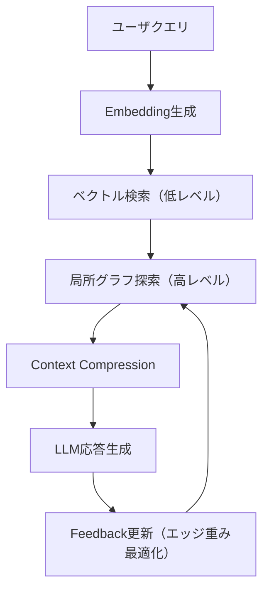
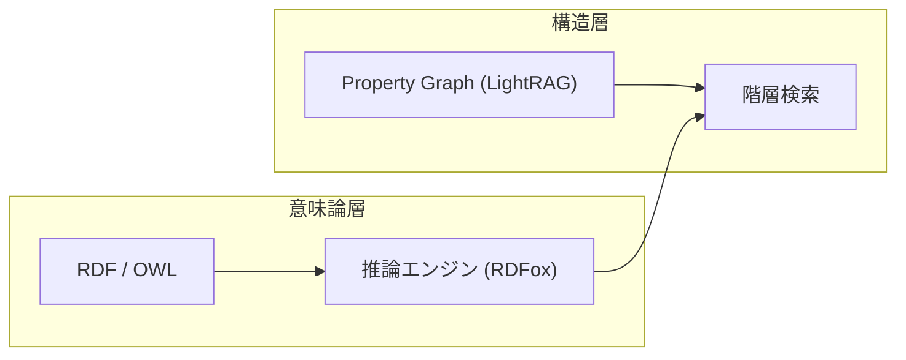

# GraphRAG の限界と LightRAG の登場

生成 AI における情報検索の中心技術である **RAG（Retrieval-Augmented Generation）** は、テキストベース検索に依存しており、文書間の関係性を十分に活用できないという限界を抱えていました。  
この課題を補う形で登場したのが **GraphRAG** です。  
さらに、GraphRAG の設計負荷やスループットの課題を解決するために生まれたのが、2024 年末から研究が進む **LightRAG** です。

---

## 背景 ──GraphRAG の登場と課題の継承

GraphRAG は、テキストをノード・エッジで表現し、知識の関連構造を検索過程に組み込むことで、単純なベクトル検索よりも多ホップ推論に強い RAG を実現しました。  
しかし実際の運用では次のような課題が明らかになりました。

- **構築コストの高さ**：グラフ生成と更新が重く、データ変動に追従しにくい。
- **スケーラビリティの制約**：多ホップ探索が指数的に膨らみ、リアルタイム応答が難しい。
- **意味的制約**：関係構造を保持しても、ノード間の意味推論（semantic reasoning）は依然として LLM 任せ。

この課題は「[RAG を超える知識統合](https://zenn.dev/knowledge_graph/articles/beyond-rag-knowledge-graph)」で詳細に整理されているため、  
本稿ではそれを前提に、**LightRAG がどこをどのように改善したのか** を技術的に掘り下げます。

---

## LightRAG とは ── 軽量化と階層化の設計思想

LightRAG は GraphRAG の基本構造を維持しつつ、より実運用しやすい形へ最適化されたアーキテクチャです。  
3 つの設計思想で構成されています。

1. **軽量化（Lightweight）**
   - グラフ全体ではなくクエリ依存のサブグラフを対象にする。
   - 動的な部分再構築により、更新コストを削減。
2. **階層化（Hierarchical Retrieval）**
   - ベクトルレベル（低レベル）とグラフレベル（高レベル）の二層検索。
   - 取得コンテキストを逐次圧縮して LLM 入力に最適化。
3. **適応（Adaptive Feedback）**
   - LLM の attention 重みをもとに、次回検索時のエッジ重みを動的調整。

この三要素により、GraphRAG が抱えていた「重く遅い構造検索」を解消しつつ、文脈的関連性を維持します。

---

## 内部構造とアルゴリズム

### データ構造（LightGraph Index の実体）

- **ノード**: `id, text_ref, emb (ℝ^d), degree, centrality`
- **エッジ**: `src, dst, rel, w_struct`（構造重み）, `w_attn`（注意重み）, `ts`（更新時刻）
- **局所サブグラフ**: `G_q = (V_q, E_q)`（クエリ q に依存してオンデマンド構築）
- **索引**: ベクトル側は `FAISS`/`Milvus` の `IVF-PQ` または `HNSW`、グラフ側は `adjacency list`。

LightGraph Index は「**全体グラフを常時最適化するのではなく、クエリごとに `G_q` を再構成して使い捨てる**」のが肝です。これにより、GraphRAG の全域トラバース依存を避け、探索を **O(k log n)** 前後に抑えます（k は最初段の top-k）。

以下のフローチャートは、LightRAG の Retrieval Flow を示しています。ユーザクエリから LLM 応答生成、そして Feedback 更新によるエッジ重み最適化までの一連の流れを表現しています。特に、Feedback が次のグラフ探索（Graph-level Retrieval）にフィードバックされる点（図中: `F --> G`）が、GraphRAG にはない LightRAG の特徴です。



### 1. Retrieval Flow

1. **ベクトル検索層（Vector-level Retrieval）**

   - 質問を埋め込み化し、FAISS/Milvus で top-k 文書を取得。
   - 取得結果のスコアを `α` として記録。

2. **グラフ探索層（Graph-level Retrieval）**

   - 取得ノードを中心に ego-network を構築。
   - 隣接ノードの関係性スコアを `β` として算出。
   - 検索停止条件は「深さ d」「スコア閾値 θ」で動的決定。

3. **重み統合**

ベクトル検索層で取得したスコア `α[node.id]` と、グラフ探索層で算出したスコア `β[node.id]` を統合します：

```python
# α: ベクトル検索で取得した各ノードの類似度スコア（低レベル）
# β: グラフ探索で算出した関係性スコア（構造重み w_struct と注意重み w_attn の組み合わせ、高レベル）
for node in graph_nodes:
    node.final_score = alpha[node.id] * 0.6 + beta[node.id] * 0.4
ranked = sorted(graph_nodes, key=lambda n: n.final_score, reverse=True)
```

比率 0.6/0.4 は、ベクトル検索の重要性をやや重視した設定例です。実際の実装では、データセットやクエリタイプに応じて調整します（例: 短いクエリでは `α` を高く、複雑な関係性を問うクエリでは `β` を高く設定する）。

#### 停止条件・計算量

- **深さ停止**: `depth >= d_max` で終了（デフォルト `d_max ∈ {1,2}`）。
- **スコア停止**: `node.final_score < θ` のノードは展開しない。
- **収束停止**: 反復で `||scores^{t} - scores^{t-1}||_1 < ε`。

探索複雑度（概算）:

- ベクトル段: `O(log n)`（HNSW）× `k`
- グラフ段: `O(|E_q|)` だが `|E_q| << |E|` となるよう `θ, d_max` で剪定
- 圧縮段: `O(|V_q| log |V_q|)`（ソート優先度付け）

> 実際の GraphRAG の計算量は、グラフ構造やクエリ内容に依存します。最悪ケースでは全ノードを探索するため O(n²) の可能性がありますが、平均的には事前分析（コミュニティ検出、中心性計算など）により効率化されています。ただし、この事前分析コストが高く、データ更新時に再計算が必要という課題があります。  
> LightRAG は事前分析を省き、クエリ時に `k` と `d_max` で束縛された局所サブグラフのみを構築することで、実質的な計算量を **O(k × d_max × avg_degree)** 程度に抑えます。例えば `k=8, d_max=2, avg_degree=5` の場合、約 80 ノード程度の探索に制約されます。

#### 更新フロー（部分再構築）

1. データ追加イベント（文書追加/更新）を検知
2. 対象チャンクを再埋め込み → ベクトル索引を部分更新（IVF の該当クラスタのみ）
3. エンティティ/関係抽出を差分実行 → `E_new, V_new` を生成
4. `adjacency` を差分マージ（重複ノード統合、孤立ノード清掃）
5. 既存のエッジ重み `w_struct` は減衰、`w_attn` は履歴を保持して再スケール

### 2. LightGraph Index（軽量インデクス設計）

LightRAG では全ノードを索引化せず、クエリ単位で局所的にサブグラフを構築します。  
これにより検索コストは O(k log n) に抑えられます。

擬似コード例：

```python
def build_local_graph(query_nodes, edges, max_depth=2):
    visited = set(query_nodes)
    frontier = list(query_nodes)
    for depth in range(max_depth):
        new_frontier = []
        for node in frontier:
            for neighbor in edges[node]:
                if neighbor not in visited:
                    visited.add(neighbor)
                    new_frontier.append(neighbor)
        frontier = new_frontier
    return visited
```

### 3. Context Compression（コンテキスト圧縮）

LightRAG は取得したノード群をそのまま LLM に渡さず、  
重要度（importance）を算出して上位 k 件に圧縮します。

```python
importance = tfidf_score * 0.5 + centrality * 0.5
top_nodes = sorted(nodes, key=lambda n: importance[n.id], reverse=True)[:k]
context = " ".join(n.text for n in top_nodes)
```

この処理により、取得ノード数を制限することで、LLM へのトークン入力量を削減できます。削減率はデータセットやクエリ内容に依存しますが、局所サブグラフのみを使用することで、GraphRAG の全体グラフ探索と比較して大幅な効率化が期待できます。実測値については、後述のベンチマーク手順を参照してください。

---

## LLM 注意重みフィードバック（Attention-guided Reweighting）

LightRAG では、LLM の出力時に取得できる attention map（注意重み分布）を、次回のグラフ探索のエッジ優先度に反映します（原論文: "attention-guided reweighting / feedback"）。  
このフィードバックメカニズムにより、検索経路が逐次最適化され、使えば使うほどクエリ依存構造が自律的にチューニングされていきます。  
この“協調推論ループ”は GraphRAG には存在しない LightRAG の革新要素です。

> **実験環境について**: 完全実装では LLM 統合により attention map が自動的に取得されますが、実験環境（簡易実装）では手動で `/feedback` エンドポイントを使用することで動作をシミュレートできます。詳細は[実験環境の README](../../experiments/graphrag-lightrag/README.md)を参照してください。

```python
for edge in graph.edges:
    if edge.src in attention_nodes:
        edge.weight *= (1 + attention_score[edge.src])
```

このフィードバックにより、検索経路は逐次最適化され、  
使えば使うほどクエリ依存構造が自律的にチューニングされていきます。  
一種の「自己学習型 RAG」として振る舞うのが LightRAG の特徴です。

ただし、このフィードバック機能には課題もあります。attention 重みがノイズを含むため、誤ったノード強調が累積するリスクがあり、継続学習フェーズでのドリフト対策が課題となっています（詳細は「今後の課題と批判的考察」を参照）。

---

## GraphRAG との定量的比較と改善点

| 比較軸             | GraphRAG                     | LightRAG                            | 改善点（技術的/定量的）                                      |
| ------------------ | ---------------------------- | ----------------------------------- | ------------------------------------------------------------ |
| 構造探索           | 全体グラフ事前分析           | クエリ依存サブグラフ                | 事前計算: O(n²) → O(1)、検索: O(n) → O(k log n) に制約       |
| 更新運用           | 手動リビルド（再計算必要）   | 部分更新（または手動再シード）      | 更新コスト削減、部分更新による柔軟性（完全実装では自動検知） |
| コンテキスト処理   | 静的連結                     | 動的圧縮（top_k 制御）              | トークン数削減、応答速度向上                                 |
| 推論メカニズム     | LLM 単独                     | LLM + attention 重み最適化          | フィードバックループによる逐次改善                           |
| 実装アーキテクチャ | Neo4j 必須（専用ツール依存） | Neo4j/Qdrant 選択可能（Python SDK） | Python SDK による柔軟な選択（LangChain・LlamaIndex 連携）    |

#### 設定例（LangChain 構成断片）

> **注記**: 以下のコード例は参考実装例です。実験環境（`experiments/graphrag-lightrag/`）では、FastAPI ベースの簡易実装を使用しています。完全な実装については、[LightRAG 公式リポジトリ](https://github.com/HKUDS/LightRAG)を参照してください。

```python
from langchain_community.vectorstores import FAISS
from langchain_community.graphs import Neo4jGraph
from langchain.retrievers import EnsembleRetriever

# 低レベル（ベクトル）
vstore = FAISS.from_texts(texts, embedding=emb_model)
vec_ret = vstore.as_retriever(search_type="mmr", search_kwargs={"k": 8})

# 高レベル（グラフ）
g = Neo4jGraph(url=NEO4J_URL, username=USER, password=PASS)
graph_ret = g.as_retriever(
    search_kwargs={"max_depth": 2, "relationship_weight_key": "w_struct"}
)

# 二層統合
ret = EnsembleRetriever(
    retrievers=[vec_ret, graph_ret],
    weights=[0.6, 0.4]  # α, β に対応
)
```

```yaml
# retriever.config.yaml（例）
vector:
  backend: faiss
  k: 8
  method: mmr
graph:
  backend: neo4j
  max_depth: 2
  score_keys: [w_struct, w_attn]
fusion:
  alpha: 0.6
  beta: 0.4
stopping:
  d_max: 2
  theta: 0.15
  epsilon: 1e-3
```

> **出典対応**: 「構造探索」「停止条件」「統合重み」は LightRAG/GraphRAG のアルゴリズム節に対応します。論文図版（パイプライン図/探索図）と合わせると、各行の主張がどこに紐づくか追いやすくなります。

#### 最小実装（疑似コード・動作サンプル）

> **注記**: 以下の疑似コードはアルゴリズムの流れを示すものです。実験環境の実装（`lightrag/pipeline.py`）とは一部異なる場合があります。実装の詳細については[実験環境の README](../../experiments/graphrag-lightrag/README.md)を参照してください。

```python
from typing import List
from langchain_core.prompts import ChatPromptTemplate

def build_context(query: str) -> str:
    # 1) 低レベル
    cands = vec_ret.get_relevant_documents(query)  # top-k
    seeds = [c.metadata["node_id"] for c in cands]

    # 2) 高レベル（局所サブグラフ）
    subgraph_nodes = g.expand(nodes=seeds, max_depth=2, theta=0.15)

    # 3) 圧縮
    ranked = rank_by(alpha_beta_scores(cands, subgraph_nodes))
    return "\n".join(n.payload for n in ranked[:K])

prompt = ChatPromptTemplate.from_template(
    "You are a helpful assistant. Use the context.\nContext:\n{ctx}\nQuestion:{q}"
)

def answer(query: str) -> str:
    ctx = build_context(query)
    return llm.invoke(prompt.format(ctx=ctx, q=query))
```

---

---

## RDF との壁 ── 構造と意味の接続

LightRAG の Property Graph 構造は操作性に優れますが、RDF/OWL に代表される**意味論的グラフ**とは根本的に異なります。  
RDF はトリプル（主語・述語・目的語）構造を持ち、推論規則や制約表現を備えます。

| 観点         | LightRAG           | RDF/OWL             |
| ------------ | ------------------ | ------------------- |
| モデル構造   | Property Graph     | Triple-based        |
| 推論機能     | 限定的（LLM 補完） | 明示的（Reasoner）  |
| 更新性       | 動的・軽量         | 厳密・再構築必要    |
| スキーマ共有 | アドホック         | 標準化（RDFS, OWL） |

両者の橋渡しとして近年注目されているのが **Semantic GraphRAG** の発想です。  
RDF 層で意味的推論を行い、その結果を LightRAG の構造層で高速取得するハイブリッド設計が研究されています。

> **注記**: Semantic GraphRAG の詳細な技術的考察は別記事で扱います。本稿では、LightRAG との関係性に焦点を当てます。



この図は、Semantic GraphRAG の二層構造を示しています。意味論層（RDF/OWL）で厳密な推論を行い、構造層（LightRAG）で効率的な検索を実行します。

### Semantic GraphRAG の適用範囲

しかし、RDF/OWL の「記号論理に基づく厳密な意味構造」と LightRAG の「統計的近似関係」は根本的に異なるため、**完全な整合性を保つことはできません**。ベクトルを介して両者を接続すると、非対称関係の対称化や制約の喪失といった「意味の座標変換問題」が生じます。

| 適用領域          | 推奨アプローチ    | 理由                                             |
| ----------------- | ----------------- | ------------------------------------------------ |
| 医療・法規・製造  | RDF/OWL 中心      | 意味の揺らぎを許容できない（誤推論が致命的）     |
| ナレッジ検索・CRM | LightRAG          | 高速な概念近似が重要、厳密推論不要               |
| 複合領域          | Semantic GraphRAG | 必要領域のみ RDF/OWL、その他は LightRAG で効率化 |

Semantic GraphRAG は万能な"意味論 RAG"ではなく、**意味をどこまで保持し、どこから曖昧さを許すか**という設計判断を伴うアプローチです。詳細な技術的考察や変換パイプラインについては、関連記事を参照してください。

## 今後の課題と批判的考察

LightRAG は大幅な効率化を実現しましたが、まだ実運用上の課題が存在します。

1. **フィードバックの不安定性**

   - attention 重みがノイズを含むため、誤ったノード強調が累積するリスク。
   - 継続学習フェーズでのドリフト対策が未確立。

2. **グラフ一貫性の検証**

   - 部分再構築を繰り返すと、グラフ整合性（重複・孤立ノード）が崩れる可能性。
   - オンライン正規化アルゴリズムの導入が必要。

3. **モデル更新追従性**

   - LLM を更新すると、attention 分布が変化し、過去の重み最適化が無効化される。
   - グラフ側の再チューニングコストを最小化する設計が求められる。

4. **意味論層との統合**
   - RDF との融合は理論的に有望だが、実装上の整合性（SPARQL⇔Cypher 変換など）が課題。

これらは、LightRAG が「GraphRAG の改良型」から「知識統合基盤」へ進化するためのボトルネックでもあります。

---

## まとめ ── 構造と意味の融合へ

LightRAG は GraphRAG を実装面で再構築しただけでなく、  
**構造知識と生成モデルを同時に最適化する試み** として重要なマイルストーンです。

- GraphRAG：構造的に「読む」AI
- LightRAG：構造を「動的に学習する」AI
- 次世代（Semantic RAG）：構造と意味を「統合して推論する」AI

構造化と意味理解の分断を埋める鍵は、  
RDF/OWL の意味層と LightRAG の階層構造を組み合わせた「Semantic GraphRAG」にあるでしょう。  
それは、単なる検索の最適化を超えた「知識駆動型生成 AI」の実装に向けた第一歩です。

---

## ベンチマーク手順と再現性

本稿では固定の数値を断言しません。公開環境・データ差分で揺れるため、再現可能な手順を提示します。

### 実験環境での簡易ベンチマーク

実験環境（`experiments/graphrag-lightrag/`）を使用して、GraphRAG と LightRAG の基本的な性能比較を実行できます：

```bash
# 1. サービス起動
cd experiments/graphrag-lightrag
docker compose up -d

# 2. ヘルスチェック
curl http://localhost:8200/healthz  # GraphRAG
curl http://localhost:8100/healthz  # LightRAG

# 3. レイテンシ測定の例
time curl -s -X POST "http://localhost:8200/ask" \
  -H "Content-Type: application/json" \
  -d '{"question": "製品一覧", "graph_walk": {"max_depth": 2}}' > /dev/null

time curl -s -X POST "http://localhost:8100/ask" \
  -H "Content-Type: application/json" \
  -d '{"question": "製品一覧", "top_k": 4, "depth": 2, "theta": 0.3}' > /dev/null
```

### 大規模ベンチマーク（参考）

より詳細なベンチマークを実行する場合：

1. **データセット**: `HotpotQA`（多ホップ）と `PubMedQA`（専門用語）を併用
2. **セットアップ**:
   - GraphRAG: Neo4j + グラフ全域トラバース（深さ=2）
   - LightRAG: 本稿の設定（`k=8, d_max=2, θ=0.15, α/β=0.6/0.4`）
3. **測定指標**:
   - レイテンシ p50/p95（ms）
   - トークン投入量（prompt+context）
   - EM/F1（QA での正答率）
4. **評価スクリプト（断片）**:

```python
import time
def eval(run, queries: List[str]):
    lat = []
    for q in queries:
        t0 = time.time(); _ = run(q); lat.append(1000*(time.time()-t0))
    return np.percentile(lat, [50,95]).tolist()
```

5. **報告**: 収集環境（GPU/CPU/メモリ/モデル）と設定ファイルを必ず添付

> **注意**: 実験環境は小規模データセット（8 ドキュメント）のため、大規模データセットでの実測値とは異なる可能性があります。完全なベンチマークには、より大きなデータセットでの検証が必要です。

---

### 参考文献

- Z. Guo 他 (2024-09). _LightRAG: Simple and Fast Retrieval-Augmented Generation_. 出典: OpenReview.
- H. Han 他 (2024-12). _Retrieval-Augmented Generation with Graphs (GraphRAG)_. 出典: arXiv.
- H. Huang 他 (2025-03). _HiRAG: Retrieval-Augmented Generation with Hierarchical Knowledge_. 出典: arXiv.
- Y. Zhao 他 (2025-05). _E²GraphRAG: Streamlining Graph-based RAG for High Efficiency and Effectiveness_. 出典: arXiv.
- Neo4j Labs. _rdf2pg: RDF to Property Graph Conversion Toolkit_. 出典: GitHub.
- Microsoft. **GraphRAG**（GitHub リポジトリ）. 出典: GitHub. [https://github.com/microsoft/graphrag](https://github.com/microsoft/graphrag)
- HKUDS. **LightRAG**（GitHub リポジトリ）. 出典: GitHub. [https://github.com/HKUDS/LightRAG](https://github.com/HKUDS/LightRAG)

---

### 実験環境

本記事で紹介した GraphRAG と LightRAG の比較実験を再現できる環境を用意しました。

- **実験ディレクトリ**: [`experiments/graphrag-lightrag/`](../../experiments/graphrag-lightrag/)
- **README**: 詳細なセットアップ手順とテストシナリオを記載

Docker Compose を使用して、以下の環境をローカルで構築できます：

- GraphRAG API (`http://localhost:8200`)
- LightRAG API (`http://localhost:8100`)
- Neo4j（グラフデータベース）
- Qdrant（ベクトルデータベース）

クイックスタートは `experiments/graphrag-lightrag/README.md` を参照してください。

#### 実験環境の実装状況

実験環境は**簡易実装**のため、以下の機能は実装の制約があります：

- **attention 重みの自動取得**: 記事で説明している「LLM の出力時に attention map を取得」機能は、完全実装には LLM 統合が必要なため、実験環境では手動で `/feedback` エンドポイントを使用する方式で代替しています。完全な動作については[LightRAG 公式リポジトリ](https://github.com/HKUDS/LightRAG)を参照してください。
- **データの自動再構築**: 記事で説明している「データ変更検知による部分更新」は、実験環境では `/reset` エンドポイントによる手動再シードで代替しています。

ただし、LightRAG の**核心的な特徴**である以下の機能は実験環境でも確認できます：

- ✅ **階層的検索**: ベクトル検索（低レベル）→ グラフ探索（高レベル）の二層検索
- ✅ **局所サブグラフ構築**: クエリ依存のサブグラフのみを探索（軽量化）
- ✅ **コンテキスト圧縮**: `top_k` パラメータによる動的圧縮

これらの機能により、GraphRAG との違い（軽量化、効率化）を実際に体感できます。

---

### 更新履歴

- 2025-10-29 — 技術拡充版ドラフト（内部構造と批判的考察を追加）

### 注記

本記事は AI を活用して執筆しています。  
内容に誤りや追加情報があれば、Zenn のコメントまたは  
[フィードバックフォーム](https://zenn.dev/knowledge_graph) よりお知らせください。
