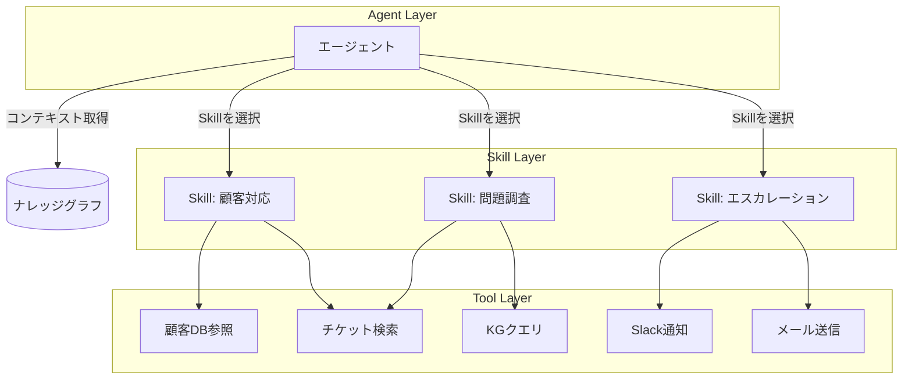

# ツールを100個並べてもAIエージェントは賢くならない

この記事はナレッジグラフを知らなくても読めます。KGが初めての方は第1回を先に読んでもよいですが、この記事単独でも理解できます。

---

## 問題：動くが、管理できない

「Difyでワークフローを10個作った。LangChainでエージェントを5個作った。どれも動くが全体として管理できない。新しいツールを追加するたびに、既存のエージェントの挙動が変わる」

日本のエンジニアと話すと、この話が頻繁に出てきます。個々のエージェントやワークフローは機能する。しかしスケールしない。チームで管理できない。精度が安定しない。

原因はツールの数ではありません。設計の構造にあります。

### 2つのアンチパターン

LangChain・CrewAI・Dify・Amazon Bedrock Agentsなどでエージェントを作っていると、必ずどちらかのアンチパターンに引っかかります。

**アンチパターン1：ツール増殖**

「エージェントに機能を追加したい」と思うたびにツールを追加します。10個になり、20個になり、50個になる。するとLLMはツールを選ぶたびに50個分のスキーマを読まなければならず、コンテキストウィンドウを圧迫します。ツールが多いほど、LLMが誤ったツールを選ぶ確率が上がります。

**アンチパターン2：Agent Sprawl**

「このユースケース専用のエージェントを作ろう」と積み上げていくと、エージェントが乱立します。似たような処理が別々のエージェントに重複実装され、一方を直しても他方が古いままになる。横断的な変更が全エージェントに影響し、どこから直せばよいか分からなくなる。

この2つに共通する根本原因は、**「ツール単位で考える」設計**です。

ツールは「何ができるか」を定義しますが、「いつ、何を目的に使うか」は定義しません。エージェントはその都度LLMの判断に委ねます。ツールが増えるほど、この即興判断の負荷が増大します。

---

## ナレッジグラフはどう貢献するか

### KGの役割：ツール呼び出しの前にコンテキストを確定する

ナレッジグラフとは、エンティティ（人・組織・製品・チケットなど）とそれらの関係性を構造化したグラフ型のデータ基盤です。エージェントが「何を知っているか」を事前に整理して置いておく場所です（詳細は[第1回](https://zenn.dev/knowledge_graph/articles/kg-agent-memory-first-design)を参照）。

KGをエージェント設計に組み込むと、ツール選択の問題が構造的に変わります。

エージェントはツールを呼び出す前に、まずKGに問い合わせます。「この顧客は過去にどんな問題を報告しているか」「この案件の担当者は誰で、どのチームに所属しているか」といったコンテキストをKGから取得してから、次のアクションを決めます。

これにより、100個のツールスキーマをLLMに渡す必要がなくなります。コンテキストが確定した後、その状況に必要なツールだけに絞れます。

### 3層アーキテクチャ：Agent / Skill / Tool

ツール増殖とAgent Sprawlを同時に解決する設計が、3層アーキテクチャです。



**Agent Layer**: KGからコンテキストを取得し、戦略的な判断を行います。「何をすべきか」を決める層。個々のAPI呼び出し方法は知りません。

**Skill Layer**: ドメイン固有のビジネスロジックをパッケージ化した層。「顧客対応」というSkillは、顧客DBの参照方法、チケット検索の条件、エスカレーションの判断基準を事前に定義して埋め込んでいます。

**Tool Layer**: 決定論的な実行のみを担う層。「読む・書く」という操作です。ビジネスロジックを持ちません。

### Skillとは何か

Skillは「再利用可能な思考パターン」です。単なるAPI呼び出しの羅列ではなく、「このドメインの問題に対して、どの順序で何を確認し、どう判断するか」の検証済みプランを埋め込んだものです。

同一のSkillを複数のエージェントが共有できます。「顧客対応」のロジックを変えたいとき、Skill定義を1か所直せば全エージェントに反映されます。

LangChainのToolと比較すると違いが明確です。

| 観点 | LangChain Tool | Skill（構造化コンテキスト設計） |
|---|---|---|
| 定義 | 関数 + スキーマ | 自然言語の指示 + ツール参照 + セッション認識 |
| 判断基準 | LLMがスキーマを見て毎回選択 | 検証済みのプランが埋め込まれている |
| コンテキスト | ツール呼び出し時にLLMが推測 | 構造化されたコンテキストから事前に確定 |
| 再利用性 | 関数レベルで再利用 | ドメイン知識ごとパッケージとして再利用 |
| 検証 | 個別テスト | 事前評価済み・ロールバック可能 |

**注意：Skill層はKG必須ではありません。** KGがあれば最も効果的に機能しますが、後述するようにKGなしでもSkill的な整理は今日から始められます。

### ワークフローとの双方向統合

もう一つ重要な設計の転換があります。「ルールベースのワークフロー」と「AI（LLM）」を対立させないことです。

エージェントはルールベースのワークフローをSkillとして呼び出せます。一方、ワークフローの中に「ここは判断が必要」という箇所があれば、エージェントを呼び出す設計にできます。

これにより「定型処理はワークフロー、判断はAI」という役割分担が自然に実現します。既存の業務フローを捨てる必要はありません。

### ナレッジグラフだけでは不十分な領域

- **Skill自体の定義・検証・バージョン管理**: KGはコンテキストを確定する基盤ですが、Skillの定義内容が正しいかどうかの検証はKGの責務ではありません。Skill設計には事前の定義・評価工数がかかります
- **設計コスト**: Skill化は「5分で終わる作業」ではありません。ドメインごとに「目的・判断基準・ツール参照」を整理するには設計の時間が必要です
- **ランタイムの即興対応力**: 想定外の問い合わせに対しては、検証済みSkillよりも純粋なLLM推論のほうが柔軟に対応できる場面があります。何でもSkillにすべきではありません
- **Skill化の判断基準**: 繰り返し発生するパターン・判断基準が明確なドメイン・複数エージェントで共有したいロジックに絞るのが現実的です

---

## 参照実装：DevRev Computer の Agent / Skills / Tools

DevRev Computerは、この3層アーキテクチャを本番スケールで実装しているシステムの一つです。

**設計の核心：少数のプライマリエージェント**

ユーザーと対面するのは少数のプライマリエージェントだけです。専門領域の処理は裏方のSpecialist Agentが担いますが、ユーザーはその存在を意識しません。この設計でAgent Sprawlを構造的に回避しています。

**Skillの定義**

DevRevにおけるSkillの定義は公開されており、`自然言語の指示 + ツール参照 + セッション認識` の組み合わせです。「何をするか」だけでなく「セッション上のどの状態を参照するか」が定義に含まれており、コンテキストが会話をまたいで持続します。

**Skillの検証・バージョン管理**

KGだけでは解決できないSkillの品質管理を補完するのが、Agent Studioのbuild-test-observe-improveサイクルです。数百件のリアルなクエリでSkillを事前評価し、問題があればロールバックできる設計になっています。これは「動いてから評価する」ではなく「評価済みのものだけ本番に出す」という設計思想です。

---

## 今日から始める1ステップ

KGがなくても、Skill的な整理は今日から始められます。

**次にやるべき1ステップ：自分のツール定義の中で最もよく使う3-5個を1つのグループにまとめ、「このグループを使う目的と判断基準」を5行の.mdファイルに書く。**

例えばこういう形です。

```markdown
## Skill: 顧客問い合わせ調査

**目的**: 問い合わせが来たとき、同じ問題の過去事例と担当者を特定する

**使うツール**: 顧客DB検索, チケット検索, KGクエリ

**判断基準**:
- 過去3か月以内に同一顧客から同種の問い合わせがあれば、前回の担当者に確認する
- 既知の問題に該当する場合は、既存の回答テンプレートを参照する
- 上記に該当しない場合は、エスカレーションフローに進む
```

ツール全部を整理する必要はありません。まず1グループだけ、5分で書いてみてください。書いたら、それをエージェントのシステムプロンプトから参照するようにします。これがSkillの最小形です。

エージェントの自律性のレベル分類に興味がある方はこちらも参考になります。  
[AI解像度の高いエンジニア向けのAIエージェント分類](https://zenn.dev/knowledge_graph/articles/ai-agent-classification-for-engineers-2026)

---

**技術リーダーの方へ**: 自社のエージェントのツール定義書を見て、「ドメインごとの目的と判断基準」が書かれているか確認してください。書かれていなければ、エージェントは毎回その場で判断を即興している状態です。

---

次の記事では、**AIエージェントを本番に出せない本当の理由**（権限管理・監査・ロールバックの設計）を扱います。

---

## 更新履歴

- 2026-05-24: 初版公開

## フィードバック受け付け

本記事は AI を活用して執筆しています。内容に誤りや追加情報があれば、Zenn のコメントよりお知らせください。
