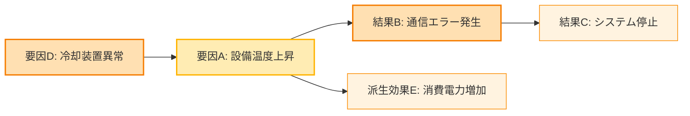

## はじめに

生成AI（LLM）の精度や再現性を高めるために **ナレッジグラフ（Knowledge Graph）** を活用する動きが国内でも広がっています。  
本記事では、国内企業の実装事例に絞って、狙い・方法・成果を簡潔に紹介します。GraphRAG は別記事で扱うため、言及は最小限にとどめます。

---

## AI 時代のナレッジグラフ ── 何が変わったのか

- **従来**: 構造化データの検索や推薦。静的なグラフ構築が前提で、更新が重い。  
- **現在**: LLM で関係を自動抽出し、グラフを継続更新。少量データでも仮説生成・因果のあたり付けが可能に。

---

## AI 連携のナレッジグラフ事例

### 1. 富士通：因果ナレッジグラフと少量データからの推論

**企業**: 富士通株式会社  
**発表時期**: 2024年10月（ホワイトペーパー）、2025年3月（実装）

**ポイント**: 因果関係を明示した「Fujitsu Causal Knowledge Graph」を提案。文献からの因果抽出＋統計的因果探索（PC、LiNGAM）を組み合わせ、少量データでも因果構造を推定。


**成果**:
- **推論高速化**: Layered LiNGAM により従来比で大幅高速化
- **応用**: ICT 障害解析、人事分析、ヘルスケア


**キャプション：**  
「因果ナレッジグラフ」は、イベント間の因果関係をノードとして表現し、“なぜ起こるのか”を推論可能にする。単なる関連リンクではなく、**原因と結果の方向性を保持**するのが特徴。


**関連プロジェクト**: 富士通は、NEDO（新エネルギー・産業技術総合開発機構）が推進する国内生成AI開発プロジェクト「GENIAC（Generative AI Accelerator Challenge）」にも採択され、ナレッジグラフと大規模言語モデルの融合研究開発を受託しています。これは、因果推論を含む知識構造化技術を国家レベルで強化する取り組みの一環と位置づけられています。  
（参考: [富士通プレスリリース](https://pr.fujitsu.com/jp/news/2024/05/17.html)）

**参考文献**:
- ホワイトペーパー: https://www.fujitsu.com/jp/about/research/article/202410-causal-knowledge-graph.html
- プレスリリース: https://pr.fujitsu.com/jp/news/updatesfj/2025/03/6.html

---


### 2. ストックマーク：産学連携での新規用途探索と自動名寄せ

**企業**: 株式会社ストックマーク  
**期間**: 2024年〜2025年  
**連携**: 日本触媒、日本ガイシ、産総研 ほか

**ポイント**: 社内文書や特許等から自動でナレッジグラフを構築し、**同義語・類義語の名寄せ**で企業固有語を統一。マルチモーダル（図表含む）文書にも対応。

**実績**:
- **日本触媒（2025年3月 業務適用開始）**: 新規用途提案の精度が基準をクリアし実運用へ。
- **日本ガイシ（2024年2月〜）**: コア技術と社会課題の対応付けにより新規事業候補を抽出。
- **産総研（2024年10月〜）**: 研究データと企業課題をグラフでマッチングし、用語差を自動吸収。

**参考文献**:
- https://stockmark.co.jp/news/20250327
- https://stockmark.co.jp/news/20240208
- https://stockmark.co.jp/news/20241015

```mermaid
graph TB
    subgraph 入力データ
    A1["顧客情報_営業部.csv"]:::input
    A2["CustomerData.xlsx"]:::input
    A3["cust_id_list.txt"]:::input
    end

    subgraph 名寄せ・統合処理
    B1["同義語辞書 + LLM補正"]
    B2["エンティティリンク生成"]
    B3["統合ナレッジグラフ構築"]
    end

    subgraph 出力グラフ
    C1["ノード: 顧客ID"]
    C2["属性: 契約情報, 地域, 取引履歴"]
    end

    A1 --> B1 --> B2 --> B3 --> C1
    A2 --> B1
    A3 --> B1
    C1 --> C2

    classDef input fill:#e3f2fd,stroke:#2196f3,stroke-width:1px;
```
**キャプション：**  
複数部署・システムからのデータを、**同義語・異表記を統合しながら1つの知識グラフにまとめる**。企業内の「言葉の壁」を超え、生成AIが利用できる“構造化知識”として再利用可能にする。

---

### 3. NEC：データ意味理解と自動マッピング

**企業**: NEC（日本電気株式会社）  
**期間**: 2019年〜2024年

**ポイント**: 複数データソース統合時の**列の意味推定**を自動化。単語・数値分布をグラフとして保持し、ネットワーク距離で意味を推定。手作業30日規模の統合を**約1時間**に短縮。

**技術**: 独自ナレッジグラフ、ネットワーク距離計算、LLM 補助推定  
**参考**: https://jpn.nec.com/press/201908/20190805_02.html

---

## 共通する実装パターンと技術トレンド

国内企業の AI × ナレッジグラフ事例から見えてくる共通パターン：

1. **自動グラフ構築が前提**: 手作業は現実的でなく、LLM＋レイアウト解析で自動抽出・更新。  
2. **因果推論の重視**: 相関ではなく因果構造の同定へ（富士通の先行事例）。  
3. **ドメイン特化**: オントロジー設計や名寄せ等の前処理が精度を左右（NEC、ストックマーク）。  
4. **産学連携**: 産総研・大学と共同で実装を加速。

---

## 従来型ナレッジグラフの事例（参考）

- **NTTコムウェア**: 4千万件のネットワーク構成を Neo4j で管理。RDB で80分の検索が数十秒に短縮。  
- **IIJ**: WAN 運用基盤で Neo4j を採用。数万デバイスの管理で障害ゼロ運用（約2年）。  
- **メルカリ**: KGCN を含むグラフ活用で推薦の解釈可能性を向上。  
- **GMOインターネット**: 企業・ファンド・役員等の関係をグラフ化し投資分析に活用。

---

## 国内と海外の動きの比較

| 観点 | 日本 | 欧米 |
|------|------|------|
| **事例の公開性** | 限定的（プレスリリース中心） | 充実（ブログ、学会発表が豊富） |
| **AI との統合** | 2024 年以降に急速に進展 | 2023 年から実装が進行 |
| **成功事例の領域** | 製造業、新規事業創出が目立つ | 消費者向けサービス、検索が中心 |
| **技術の独自性** | 富士通の因果ナレッジグラフなど独自技術が多い | OSS活用＋独自研究（例: GNN, Reasoning） |
| **研究機関との連携** | 産総研、大学との協業が活発化中 | Google、Amazon などが独自開発 |

---

## まとめ：国内企業における AI × ナレッジグラフの現在地

国内の実装は、製造業の新規用途探索、因果推論の実験・実装、そして産学連携の広がりが特徴です。公開情報は限定的ながら、2025年以降は実運用フェーズが増える見込みです。

**強み**
- 製造業での新規用途創出（日本触媒・日本ガイシ）
- 因果推論を重視した実装（富士通）
- 産学連携の加速（産総研・大学）

**課題**
- 事例・論文の公開不足
- データ品質と前処理（名寄せ・オントロジー）への依存
- GraphRAG の実装ノウハウは発展途上（本記事では詳細割愛）

**今後**
- 2025年以降、業務適用の増加
- 一部技術のオープンソース化の可能性
- 国際連携と競争力の強化

---

※本記事は AI を活用して執筆しています。
