Labeled Property Graph（LPG、いわゆる Property Graph）でナレッジグラフを作り始めると、最初はかなり自由に感じます。Nodeを作る。Labelを付ける。Relationshipでつなぐ。必要な情報はPropertyに入れる。RDBのように最初から厳密な構造定義は不要なので、グラフを形にするまでは比較的簡単です。難しくなるのはその後です。

エージェントやLLMがナレッジグラフを辿るとき、関係の型や同一性の曖昧さは、誤った経路や根拠の追跡不能につながります。モデル選定は [RDF vs Property Graph](https://zenn.dev/knowledge_graph/articles/rdf-vs-property-graph-2025)、型を誰が決めるかは [オントロジーは「先に決める」か「データから起こす」か](https://zenn.dev/knowledge_graph/articles/ontology-define-first-vs-induce) にまとまっています。この記事で取り扱うのは、LPGを選んだあとに意味をどこで表現するかです。

データソースや問い・履歴・根拠が増えると、以下のような判断が必要です。

- `Employee` はLabelなのか Roleなのか
- 住所はPropertyなのか独立したNodeなのか
- `WORKS_AT` の `role` や `since` はRelationship Propertyでよいのか
- `Employment` というNodeを作るべきなのか
- CRMやHR・Financeなどのバックオフィス系ツールで、別システムのPersonを同じNodeにしてよいのか
- テナント・情報源・アクセス制御の境界をLabelで表現してよいのか
- 分析のために切り出したグラフを本体の知識として保存するべきなのか

難しいのはNode・Relationship・Propertyの選び方より、**どの概念・関係・状態・根拠に独立した意味を与えるかを決めること**です。

> ここでいう「意味モデル」や「オントロジー」はOWL Ontologyではありません。LPG上でEntity Type・Relationship Type・Identity・Constraint・時間・境界をどう表現するかという実務上の設計を指します。

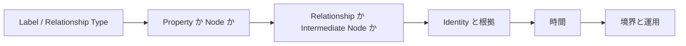

## まず表現の単位を決める

### Labelを「属性の便利な表現」にしない

LPGでは一つのNodeに複数のLabelを付けられます。

```cypher
(:Person:Employee)
```

このモデルは使えます。問題はLabelを追加する基準が曖昧になることです。

```cypher
(:Person:Employee:Male:TokyoResident:PremiumUser)
```

ここに入っている情報の種類は揃っていません。

- `Person` はEntity Typeなのか
- `Employee` はTypeなのかある時点のRoleなのか
- `Male` は分類なのかPropertyなのか
- `TokyoResident` は現在の状態なのか履歴を持つ事実なのか
- `PremiumUser` は契約状態なのか利用状況なのか

Labelの数より、そのLabelが何を意味するかを説明できなくなることが問題です。「このLabelで検索すると速いから」だけでLabelを増やすと、性能都合が意味モデルに混じります。Labelを追加するときは、そのNodeが「何であるか」を表すのか、属性・状態・アクセス範囲なのかを一度考えます。LPGはLabelを自由に付けられるので、Labelの意味は自分たちで管理する必要があります。

### Relationship Typeから意味を消さない

よく起きるのがRelationship Typeの過度な汎用化です。

```cypher
(:Person)-[:RELATED_TO { type: "WORKS_AT" }]->(:Company)
```

関係の種類をPropertyに入れられます。グラフを見ただけでは関係の意味が分かりにくくなります。Knowledge Graphでは、関係の種類をRelationship Typeに出すと意味が分かりやすいです。

```cypher
(:Person)-[:WORKS_AT]->(:Company)
```

Relationship Typeだけで関係の意味を区別できる粒度にしておくと、グラフそのものがドメインモデルとして読めます。すべての関係を極端に細分化する必要はありません。Relationship Typeだけで表現できる意味をPropertyへ逃がさないことです。

実装上は、所有者・顧客・対象製品のように参照Propertyとして持つ関係もあります。重要なのは格納形式ではなく、参照先・多重度・時間性・更新責任を含めて関係の意味を一貫して定義することです。

### 逆方向のRelationshipを安易に複製しない

```cypher
(:Person)-[:WORKS_AT]->(:Company)
```

CompanyからPersonを探索したいからといって、同じ事実を逆向きにも保存したくなります。

```cypher
(:Company)-[:EMPLOYS]->(:Person)
```

この二本が同じ事実なら二重管理です。`WORKS_AT` を削除したのに `EMPLOYS` が残れば矛盾します。

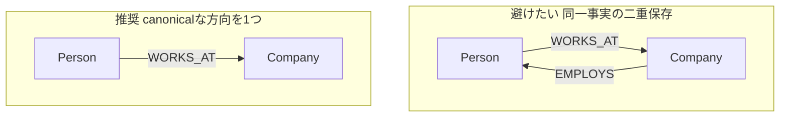

LPGのRelationshipには方向があります。ただし、多くのグラフDBではクエリ時に逆方向・双方向へ探索できます。**探索の都合だけで、逆向きのRelationshipを保存する必要はありません。**

同一事実についてはcanonicalな方向を一つ決めます。Relationshipの方向は、事実をどちらからどちらへ表現するかというドメイン上の表現です。逆方向が欲しいという理由だけで複製しない方がよいです。

逆方向のRelationshipを別に持つなら、単なるinverseか、別の業務意味やライフサイクルを持つかを確認します。たとえば本人が申告した所属と、会社側が管理する雇用関係は、同じ二者を結んでいても別の主張や別の事実です。情報源・承認・更新責任・有効期間が異なるなら、逆向きの複製ではなく異なる意味を持つ関係として扱います。

### NodeかPropertyかは「独立して語りたいか」で決める

LPG設計で最も迷いやすいのがNodeとPropertyの境界です。住所を表示用の文字列として持つならPropertyで十分です。

```cypher
(:Person { address: "Tokyo..." })
```

住所そのものを他の知識とつなげるならNodeにします。

```cypher
(:Person)-[:LIVES_AT]->(:Address)
(:Company)-[:REGISTERED_AT]->(:Address)
(:Address)-[:LOCATED_IN]->(:City)
```

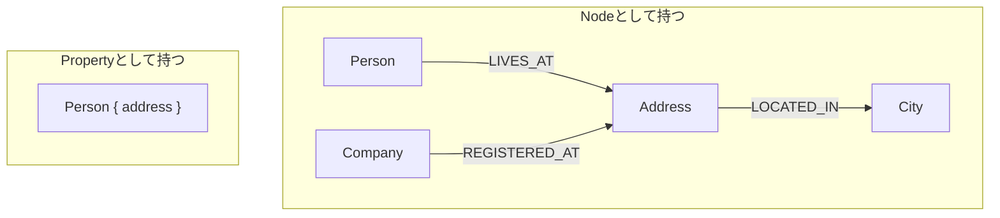

Node化を検討するのは、たとえば以下の場合です。

- 独立したIdentityを持たせたい
- Relationshipのendpointにしたい
- 単独で検索やTraversalをしたい
- 独立したLifecycleを管理したい
- 根拠・所有者・信頼度などの情報をつなげたい
- 複数のContextから同じ対象として参照したい

固有の原子的な値でそれ自体について語る必要がないならPropertyで十分です。住所をNodeにする理由は、住所だからではありません。住所を独立した知識として扱いたいからです。この判断はRole・契約・製品・チーム・タグ・状態・分類などにも共通します。

### Relationshipを「主語」にしたくなったらNode化を検討する

Relationship PropertyとIntermediate Node（関係をNodeとして実体化したもの）の境界もLPGの重要な設計判断です。たとえば以下のモデルは自然です。

```cypher
(:Person)-[:WORKS_AT {
  since: "2024-01-01",
  title: "Engineer"
}]->(:Company)
```

RelationshipがPropertyを持てるのはLPGの特徴です。Propertyが付いていること自体は問題ではありません。Role・契約・承認・部署・状態・情報源まで持たせたくなったときは、`Employment` を独立したEntityにします。

- どのRoleとして働いているか
- どの雇用契約に基づくか
- 誰が承認したか
- どのDepartmentに所属していたか
- Employment自体が現在どの状態か
- その情報をどの情報源が根拠としているか

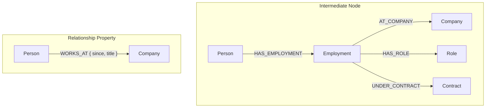

重要なのはRelationship Propertyの数ではなく、そのRelationshipを主語にして何かを語りたいかどうかです。「このEmploymentはいつ開始したか」「誰が承認したか」「どの契約に基づくか」といった問いが出てきたら、EmploymentはEdgeではなく独立したEntityです。最初はRelationship Propertyで足りていたものが、モデルの成長とともにEntityへ昇格することがあります。

### 3者以上の関係が出てきたらIntermediate Nodeを考える

Person・Company・Roleのように3者以上が一つの事実に関与する場合も、前節と同じ判断です。LPGのRelationshipは二つのNode間しか結べないため、組み合わせ自体を主語にしたいなら Intermediate Node が必要です。

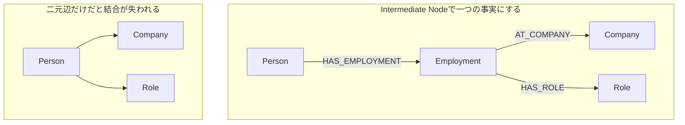

二元辺だけのモデルでは、どのCompanyにおけるRoleなのかが失われます。Employmentを中心にしたモデルは、「PersonがCompanyにRoleとして所属する」という一つの事実を表します。

## 次に事実の同一性と根拠を設計する

### Identity設計を後回しにしない

Knowledge Graphを長期間運用すると、ほぼ確実に問題になるのがIdentityです。企業内では同じ人物がCRM・HR・Finance・Support・Billing・Identity Providerなど、複数のシステムに存在します。最初から `CRM Contact = Person` とみなすのは危険です。CRMにあるのは「CRMが保持しているPersonについてのレコード」であることが多いです。人事マスタ側も同様で、「人事が保持しているPersonについてのレコード」です。

```cypher
(:CRMContactRecord)-[:DESCRIBES]->(:Person)
(:HRPersonRecord)-[:DESCRIBES]->(:Person)
```

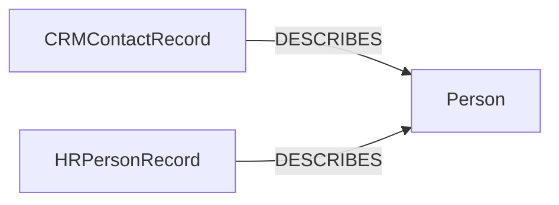

少なくとも以下の三つを区別します。

- 現実世界の対象：Person・Company・Productなど
- 情報源上のレコード：CRM Contact・HR Employee Recordなど
- 発生した出来事：契約・異動・問い合わせ・障害など

最初からすべて同じNodeとして統合すると、後から以下のような問題が起きます。

- この情報はどのシステムを根拠にしているのか
- CRMとHRで氏名や所属が異なる場合どちらを採用するのか
- 二つのレコードは本当に同じ人物を指しているのか
- 同一人物だという判断はいつどの根拠で行われたのか

Knowledge Graphでは、Nodeを作ることより **何をもって同一Entityと判断するか** の方が難しいことがあります。LPGは自由にNodeを作れるので、Entity ResolutionとIdentity Policyを後回しにしません。エージェントの記憶としてKGを使うときの名寄せは [ナレッジグラフをエージェントの「記憶」にする設計](https://zenn.dev/knowledge_graph/articles/kg-agent-ontology-design) にも書いています。

同一性判定は、確定した `sameAs` のようなLinkだけとは限りません。「同一と確定した」「同一候補である」「別Entityと確認した」「判断保留である」を区別する必要もあります。特に自動名寄せでは、判定結果と信頼度、判定規則、判定時点を残せるようにします。

情報源のレコードと統合後のEntityを常に別Nodeにする必要はありません。複数ソースの競合解決・監査・書き戻し・名寄せ判断の説明が必要なら両者を区別できるモデルにします。最終的に同一のPerson Nodeへ統合するか、監査用にレコードNodeを残すかは要件次第です。そうした要件がない初期段階では、情報源をPropertyやメタデータとして保持する設計でも十分です。

### 事実とその根拠を同じものとして扱わない

「AさんはB社に所属している」と「CRMのContactにそう書いてある」は違います。「AさんはB社に所属している」は実世界についての事実または事実として扱いたい主張です。「CRMのContactにそう書いてある」はその主張の根拠になる情報源上の記録です。

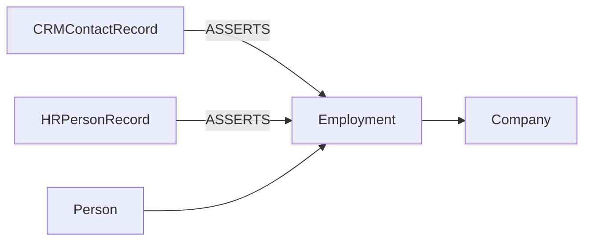

実装は要件によります。すべてのPropertyやRelationshipに根拠を持たせる必要はありません。情報源の統合・監査・データ品質・更新競合への対応が必要なら、後から以下の問いに答えられるようにします。

- この情報はどこから来たのか
- いつ観測・取得されたのか
- 複数の情報源が矛盾したときどのルールで扱うのか
- この統合や同一性判定は誰がどの根拠で行ったのか

根拠や由来の語彙整理には、たとえば [PROV-O](https://www.w3.org/TR/prov-o/) があります。LPGで同じ語彙をそのまま使う必要はありません。「対象」「活動」「エージェント」「由来」を分けるときに使えます。根拠には少なくとも二つの粒度があります。「どの情報源がその事実を主張したか」は主張の信頼性に影響します。「その値がどの連携・変換・更新を経て現在の状態になったか」は運用上の追跡可能性に影響します。Source Dataをそのままグラフへ転記すると情報源の構造は保存できます。情報源をまたいだ「対象」「事実」「根拠」の違いは表現できません。

### Source Dataからそのままグラフを作らない

Enterprise Knowledge Graphでありがちな出発点は、以下のような変換です。

```text
Table       -> Node
Column      -> Property
Foreign Key -> Relationship
```

グラフ自体は作れます。RDBの構造をグラフへ転写しただけ、ということもあります。Knowledge Graphとして設計するなら、Source Schemaより先に、このKnowledge Graphで何を知りたいのかを考えます。

たとえば以下の問いを先に定めます。

- Personが現在所属するOrganizationは何か
- このContractに関係するPersonとOrganizationは何か
- Product Aに依存しているServiceは何か
- このEntityや事実の根拠になったSource Recordは何か
- この事実はいつ有効だったのか
- この状態はいつ誰が観測したものか

問いを先に定義しモデルが答えられるかを繰り返し確認します。クエリ性能だけでモデルを決めません。意味構造と実際のTraversal Patternの両方を見ます。

### 既成の意味モデルを捨てて始めない

すべてのEntity TypeやRelationship Typeを組織ごとにゼロから定義する必要はありません。顧客・組織・製品・問い合わせ・作業項目・担当者のように多くの組織に共通する概念は、社内の業務マスタや製品のデータモデル、業界で使われている語彙を起点にした方が連携や横断的な探索を行いやすくなります。

設計の焦点は、どこまで既存の語彙を使い、どこから組織固有の概念や関係を追加するかです。既存モデルと独自拡張の境界にもIdentity・時間・根拠・アクセス制御のルールを適用します。

## 事実には時間がある

作り始めには不要でも、後から欲しくなるのが時間です。以下の関係だけでは、そのPersonが現在働いているのか、過去に働いていたのか分かりません。

```cypher
(:Person)-[:WORKS_AT]->(:Company)
```

最低限、関係に有効期間を持たせられます。

```cypher
(:Person)-[:WORKS_AT {
  validFrom: date("2024-01-01")
}]->(:Company)
```

終了していない関係では `validTo` を持たず、終了時にだけ設定することもできます。`validTo` が存在しないことを「現在も有効」と解釈するのか、明示的な `status` を持つのかはモデル全体で統一します。

Lifecycleが複雑ならEmploymentをEntity化する選択肢もあります。

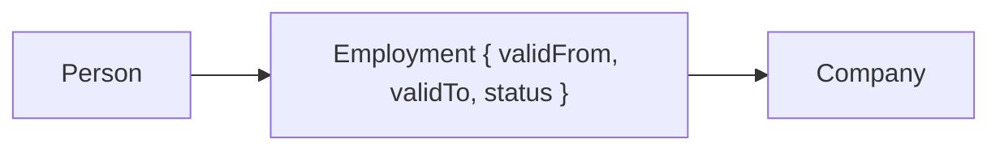

Node化は必須ではありません。**事実にはLifecycleがあることをモデルから消さない**ことが重要です。時間の種類も複数あります。

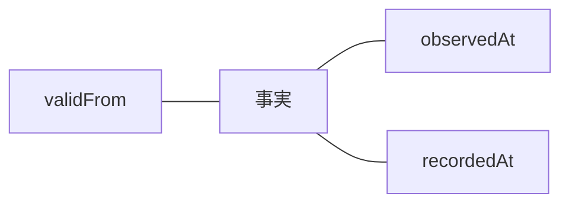

- `validFrom` / `validTo`：その事実が現実世界で有効だった期間
- `observedAt`：その情報を観測・取得した時点
- `recordedAt`：システムに記録された時点

7月に取得したデータが「6月1日から異動済み」と示す場合、有効になった時点と観測した時点は異なります。時間の種類を整理する語彙には [Time Ontology in OWL](https://www.w3.org/TR/owl-time/) があります。

有効期間を持つ状態と、その状態を変化させたイベントも同じではありません。`Employment` は「いつからいつまで雇用関係が有効だったか」を表し、`TransferEvent` は「いつ所属変更が起きたか」を表します。監査、再現、イベント駆動の自動化が必要なら、この二つを分けます。

厳密な時系列モデルが常に必要なわけではありません。現在値だけを上書きし続けると「2025年時点ではどうだったか」に後から答えられなくなります。

## 意味モデルを運用可能にする

### 「Schema-lessだから自由」を信用しすぎない

LPGは構造を完全に事前固定しなくても始められます。運用を始めると、たとえば以下のルールが生まれます。

```text
Personには必ずpersonIdがある。
CompanyにはcompanyIdがある。
WORKS_ATはPersonからCompanyへ接続する。
validFromはDateとして扱う。
```

明示的にSchemaを定義しなくても、暗黙のSchemaは生まれます。問題は、そのルールがコード・データ連携処理・クエリ・開発者の頭の中に分散することです。実運用では、利用しているLPG実装の一意性・必須項目・型・接続可能な関係などの検証を早い段階から使います。Neo4jであれば [Constraints](https://neo4j.com/docs/cypher-manual/current/constraints/) に加え [Graph types](https://neo4j.com/docs/cypher-manual/current/schema/graph-types/) でNode / Relationshipの型を明示できます。LPGの自由さは、**Schemaを後から進化させやすい**という意味です。

意味モデルは、AIが経路を選ぶ辞書でもあります。LabelやRelationship Typeの名前、Propertyの説明、許容値、接続可能なEntityが曖昧なら、AIも曖昧な経路を選びやすくなります。

### 意味上の境界とアクセス制御上の境界を混ぜない

マルチテナントでは、たとえば以下のLabelを作れます。

```text
:TenantA_Person
:TenantB_Person
```

`Person` はEntity Typeです。`TenantA` は管理単位やアクセス制御上の境界であることが多いです。この二つをLabel名の中で結合するとVocabularyが増えます。

```text
TenantA_Person
TenantA_Company
TenantA_Product
TenantB_Person
TenantB_Company
TenantB_Product
```

`tenantId` Propertyが常に最適とは限りません。境界の目的を区別します。

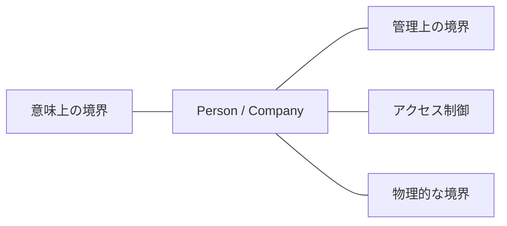

- 意味上の境界：PersonとCompany・ProductとServiceのようなドメイン上の区別
- 管理上の境界：所有チーム・運用責任・データ保持期間などの区別
- アクセス制御上の境界：誰がどのデータを閲覧・更新できるかという区別
- 物理的な境界：保存場所・リージョン・性能・障害分離などの区別

一致することもありますが、同じ概念ではありません。境界の目的を混ぜないことが、モデルと運用の複雑化を抑えます。アクセス制御を `tenantId` やLabelだけに委ねると、検索・集計・キャッシュ・エージェントによる要約など、読み取り経路ごとの漏れを防ぎにくくなります。アクセス制御上の境界は、すべての読み取り・更新で一貫して評価されるPolicyとして設計します。

### 物理分割は「関係が自然に切れるか」で考える

巨大なナレッジグラフでは、複数領域への分割を検討しやすくなります。

```text
Customer Graph
Product Graph
Support Graph
IAM Graph
```

見るべきはサイズより、分割後に主要なTraversalがどこをまたぐかです。CustomerとSupportの間を頻繁にTraversalするなら、物理分割後の主要なアクセスが境界をまたぎます。

分割が自然なのは、たとえば以下の場合です。

- 強いアクセス制御上の分離が必要である
- 地理的な保存要件が異なる
- Lifecycleやデータ保持期間が大きく異なる
- 所有・運用するチームが異なる
- 領域間のRelationshipがほとんどない

### Supernodeを見つけてもすぐモデルを壊さない

Country・Category・Organization・Popular Productのように、大量のRelationshipが集中するNodeが出てきます。いわゆるSupernodeです。性能問題が起きるとNodeを分割したくなります。意味的には一つのJapanなのに、性能だけで複数のJapan Nodeへ分けるとSemantic Identityが壊れます。

まず以下を確認します。

- どこからTraversalを開始しているか
- Relationship Typeや方向で十分に絞れているか
- 適切なIndexや検索条件を利用できているか
- 実行計画に不要な探索が含まれていないか

性能問題があっても、まず意味モデルを変えません。意味モデルを維持したままアクセスパターンを改善できないかを先に見ます。性能最適化のために意味を壊すと、あとから辿れないグラフになります。エージェントが人気カテゴリや組織ハブから辿り始めると、探索コストと誤経路が同時に増えやすいです。

### 分析用の見方と運用する知識を混ぜない

分析ではナレッジグラフのすべてが必要とは限りません。Person・`WORKS_AT`・Companyだけを抽出して中心性を計算したいことがあります。元のナレッジグラフそのものを書き換える必要はありません。運用中のグラフから、分析に必要な対象と関係だけを切り出した投影ビューを使います。**運用する知識と分析のための見方を分離します。** 検索補強のためのグラフ化（GraphRAG）とは別の話で、詳しくは [RAGを超える知識統合](https://zenn.dev/knowledge_graph/articles/beyond-rag-knowledge-graph) に書いています。

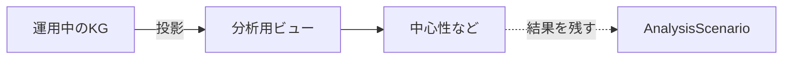

以下のような要件があるなら、分析結果やScenarioをナレッジグラフへ戻す設計もあります。

- この分析を誰がいつ実行したかを残したい
- Scenario AではどのEntityを対象にしたかを追跡したい
- アルゴリズム・バージョン・パラメータ・入力データの時点を再現したい
- 分析結果を次の判断や別の探索で再利用したい

```cypher
(:AnalysisScenario)-[:INCLUDES]->(:Company)
```

一時的な分析ビューと分析結果を永続的な知識として扱うことは分けます。

## 自分のグラフで確認すること

これから作るなら、まず以下の3つだけ決めるとよいです。

1. Personなど中核EntityのIdentity（情報源レコードと現実世界の対象を分けるか）
2. 所属・契約など「主語にしたくなる関係」をRelationshipのままにするか Intermediate Nodeにするか
3. 現在値だけか、有効期間（`validFrom` / `validTo`）を持たせるか

設計やレビューでは、以下も一度確認すると抜けに気づきやすいです。

- 各Labelは「何であるか」を表しているか。属性・状態・テナントが混ざっていないか
- Relationship Typeを見ただけで関係の意味が分かるか
- 同一事実の逆方向エッジを二重に持っていないか
- Propertyのままでは足りない対象を独立して語る必要があるか
- CRMやHR・Financeなどのバックオフィス系ツールで、情報源のレコードと現実世界のEntityを分けているか
- 現在値の上書きだけで過去の有効期間を消していないか
- 意味上の境界とアクセス制御・物理分割の境界を混ぜていないか

## 業務グラフでは設計が行動に影響する

顧客・製品・問い合わせ・作業項目を横断する業務グラフでは、Relationshipを検索用のLinkだけにしない方がよいです。Identityと関係の意味が一貫していないと、「どの顧客の、どの製品領域の、どの問い合わせが、どの開発課題につながったか」を辿れません。誤った担当への通知、権限外データの要約、誤ったシステム更新につながります。外部システムのRecordにも、情報源・更新時点・権限・必要なら統合判断の根拠を残します。

## 判断の軸

Node数やProperty数の閾値はありません。判断の軸はこれです。

**この概念・関係・状態・根拠についてKnowledge Graph上で独立して何かを語りたいか。**

検索や可視化だけなら、曖昧さを人間が補えます。AIが集計・通知・更新まで行うなら、Identity・根拠・時間・権限の曖昧さは誤った行動になります。最初は小さく始め、問いと情報源が増えたときに意味を育てられるようにしておくことが、LPGでKnowledge Graphを続けるコツです。

## 参考資料

- Neo4j Documentation: [Graph database concepts](https://neo4j.com/docs/getting-started/appendix/graphdb-concepts/)
- Neo4j Documentation: [Modeling designs](https://neo4j.com/docs/getting-started/data-modeling/modeling-designs/)
- Neo4j Cypher Manual: [Constraints](https://neo4j.com/docs/cypher-manual/current/constraints/)
- Neo4j Cypher Manual: [Graph types](https://neo4j.com/docs/cypher-manual/current/schema/graph-types/)
- W3C: [PROV-O: The PROV Ontology](https://www.w3.org/TR/prov-o/)
- W3C: [Time Ontology in OWL](https://www.w3.org/TR/owl-time/)

## 更新履歴

- 2026-08-13: 初版公開

## フィードバック受け付け

本記事は AI を活用して執筆しています。内容に誤りや追加情報があれば Zenn のコメントよりお知らせください。
