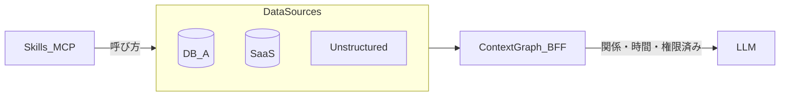
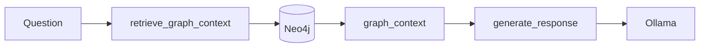

> **この記事の読み方**
> - 約10分: 問題提起〜Skill vs コンテキストグラフ（BFF）
> - 約15分: [experiment](../experiments/kg-puzzle-agent/) で Part0〜Part2 を体験（Neo4j: Podman、Ollama: ホスト）
> - 理論の詳細: [ツールを100個並べても…](https://zenn.dev/knowledge_graph/articles/kg-agent-skill-layer)、[コンテキストグラフ](https://zenn.dev/knowledge_graph/articles/context-graph-improves-llm) へリンクで統合

あなたのAIエージェントは、目隠しをしたまま1万ピースのジグソーパズルを解かされている。

RAGを組み込んだ。ツールを10個つないだ。Skillも増やした。それでも的外れな回答、存在しない関数の呼び出し、「それは違います」——。

私たちがLLMに渡しているのは**パズルのピースだけ**だ。完成図（box art）は渡していない。Confluence、Slack、Jira——バラバラのピースをLLMが「たぶんこう繋がる」と推測しているに過ぎない。

これはLLMの能力不足ではない。**情報アーキテクチャの設計不足**だ。本記事では、ナレッジグラフを**部分的な正解の絵**としてLLMの前に渡す設計と、Neo4j + LangGraph + Graphiti（Ollama）での再現方法を示す。

※ 本記事の **GraphRAG**（グラフでRAG検索を補強する手法）との区別は [RAG を超える知識統合](https://zenn.dev/knowledge_graph/articles/beyond-rag-knowledge-graph) を参照。ここでは **ナレッジグラフ / コンテキストグラフ** を、LLMの外側の意味レイヤとして扱う。

---

## なぜ外れるのか — 3つの壁

| 壁 | 何が起きるか |
|----|--------------|
| **断片化** | RAGチャンクは「形」（関係）を失う |
| **ツール爆発** | ツール数に応じて選択肢が爆発し、LLMが迷う |
| **データ散在** | CRM・ドキュメント・チャットにまたがり、接続手がかりがない |

LLMは賢い。しかし推測の域を出られない。推測が外れたものを、我々はハルシネーションと呼ぶ。

---

## ハーネスでは足りない

プロンプト、ガードレール、ルーティング——ハーネスは**枠**だ。「ここに置くな」とは言えるが、「ここに置け」とは言えない。正しい回答への確率は、ルールを増やしただけでは上がらない。

必要なのはルールの追加ではなく、**部分的にでも正解の絵を見せること**だ。

---

## Skill だけでは完成図は渡せない

「MCPつないだ」「Cursor Skill書いた」「Difyワークフロー増やした——Skill入れたらコンテキストグラフいらないのでは？」

**Skill**は**どう動くか**（ツールの呼び方・手順）を渡す層。**コンテキストグラフ**は**何が真か・どう繋がるか・誰に見えるか・いつまで有効か**をLLMの外に置く層だ。詳論は [ツールを100個並べてもAIエージェントは賢くならない](https://zenn.dev/knowledge_graph/articles/kg-agent-skill-layer) に譲る。

| 層 | 役割 | Skillだけで足りる？ |
|----|------|---------------------|
| Skill / MCP | 呼び方・ガードレール | 呼び方は書ける |
| **コンテキストグラフ** | 関係・時間・権限・根拠 | **推測させるとミスが増える** |
| Graph Traversal Contract | グラフの読み方 | [別記事](https://zenn.dev/knowledge_graph/articles/graph-traversal-contract-skill) 参照 |

---

## コンテキストグラフ = AI とデータソースの BFF

大規模・複数DB・非構造化データにまたがる処理を、Skillだけで綺麗に組んでも、**わかりきった関係性をLLMに推論させるとミスが増える**。先に関係を渡し、LLMが苦手な関係処理を減らす——それが目的だ。

配置としてはDB内蔵ではなく**AIに近いところ**がよい。ただしLLMはバージョンごとに破壊的変更もある。**LLMともデータソースとも疎結合**な中間層が要る。



この中間層が、Skill/MCP（フロント）と各データストア（バック）の間を取り持つ**BFF**として落ち着く。用語の整理は [Claude の外側にコンテキストグラフを置くと…](https://zenn.dev/knowledge_graph/articles/context-graph-improves-llm) を参照。

| 論点 | 体験 |
|------|------|
| 同一事実・断片 vs 構造 | Part0 `compare`（Q1） |
| **矛盾断片で Skill が外れる** | Part0 Q2（Team B vs Team A） |
| 関係を LLM の前に渡す | Part1 LangGraph |
| **プロンプト禁止でも Skill は漏れうる** | Part1 秘匿予算デモ |
| 一定期間有効（月曜 X → 今日 Y）+ **将来予定（10月）** | Part2 `--as-of monday` / `today` |
| 権限・視点で見える範囲が変わる | Part1 権限 + Part2 `--persona sales` / `eng` |
| 未解決の矛盾がグラフに残る | Part2 営業800万 vs エンジニア試算 |

---

## 部分的な完成図としてのナレッジグラフ

完成図は完璧でなくていい。「なんとなく色の配置が分かる」程度で、探索空間は劇的に狭まる。

- **ベクトル検索**: 色が似たピースを集める
- **グラフ検索**: 形が合うピースを特定する

ハイブリッドが実務では強いが、本記事の experiment では**グラフ側の効果**に焦点を当てる。

---

## Part0: 同一事実で Skill だけ vs グラフ

experiment では **Jira / Slack / Confluence は接続しない**。`tool_fragments.json` と `project_alpha.cypher` は **Project Alpha** の同一事実を表す（Part2 も同案件の顧客X拡張として続く）。

```bash
cd experiments/kg-puzzle-agent
./run_demo.sh compare   # または quick（Part1 権限まで）
```

**Q1（同一事実）** — A: 断片3つを推測で統合 / B: `Alpha -[:OWNED_BY]-> Team A` で関係固定

**Q2（矛盾断片）** — Jira「Team B 主担当」と Slack「Team A はサポートのみ」が共存。Skill は古い断片を採りやすい。グラフは `OWNED_BY` で **Team A** に固定される。

> Q1 だけだと両方正答しやすい。Q2 で「推測依存」の差が体感できる。

---

## Part1: 完成図を先に渡す LangGraph エージェント

スタック: **Neo4j（Podman）+ LangGraph + ホスト Ollama**（OpenAI API 不要。Mac では GPU/Metal 利用）。



要点:

1. **グラフコンテキストが最初** — LLMが考える前に完成図を渡す
2. **権限はグラフ上** — 到達不能なノードは渡さない
3. **全文コード** — [experiments/kg-puzzle-agent/app/](../experiments/kg-puzzle-agent/app/) を参照

```python
# 概念のみ — 全文は experiment 参照
workflow.set_entry_point("retrieve_context")
workflow.add_edge("retrieve_context", "generate")
```

> **動かす:** `./run_demo.sh quick`（Part0+権限、約1〜2分）または `./run_demo.sh part1`（+ LangGraph）

### 権限 — プロンプトではなくパストラバーサル

同じ質問でも、**誰が聞くかで正解が変わる**。`demo_permissions.py` では次も体験できる。

1. **Skill + 「社外秘を答えるな」** — 断片に秘匿予算（800万）があれば LLM が漏らしうる
2. **グラフ + user_guest** — パストラバーサル時点で到達不能。コンテキスト自体が空

`user_tanaka` は Alpha（と Deal）に到達し、`user_guest` は **最初から見えない**。

---

## Part2: チームの記憶 — なぜ800万かを説明する

**Project Alpha 拡張（顧客X）** — 2026年6月第4週: 月曜「500万」→水曜「800万」→木曜「10月中旬リリース予定」→金曜マネージャー確認。Skill に最新値だけ書いても **なぜ500万が無効か** は監査できない。

```bash
./run_demo.sh part2
# 取込済みなら as-of / 視点だけ再実行:
./run_demo.sh part2-search monday
./run_demo.sh part2-search today
./run_demo.sh part2-search sales
./run_demo.sh part2-search eng
```

ingest → SSOT → **as-of クエリ**（+ **視点フィルタ**）。各ファクトに **エピソード出所** を表示する。**today** as-of では **営業の800万前提**・**10月中旬リリース予定**・**エンジニアのリソース矛盾** がグラフ上に共存する（未解決の矛盾セクション）。**monday** as-of では 500万のみで、10月予定はまだ未登場。

**search** の出力イメージ（デフォルト `gemma2:2b` での代表例）:

```
=== 結論（2026-06-28 時点で有効なファクト）===
・山田部長は Project Alpha 拡張（顧客X）の予算を800万円まで拡大可能とのこと
  valid: 2026-06-25 〜 invalid: 現在有効
  出所: sales-update-wednesday / 営業チームSlack #deal-customer-x
…

=== 将来予定（グラフ上の計画 — 未到来のマイルストーン）===
・Project Alpha 拡張（顧客X）の本番リリース目標は2026年10月中旬
  出所: eng-estimate-thursday / エンジニアSlack #eng-estimates

=== 未解決の矛盾（マルチプレイヤー — 営業 vs エンジニア）===
・800万予算枠では最小3人月を確保できず、営業提示の800万前提と整合しない
  出所: eng-resource-friday / エンジニアSlack #eng-estimates
```

※ SSOT 詳細・モデル選定は [experiment README](../experiments/kg-puzzle-agent/README.md)。Neo4j Browser での可視化 Cypher も README に記載。

**history** では `500万（06/23〜06/25） → 800万（06/25〜現在）` の変遷と置換理由を表示する。Part1の「参照したグラフ」と対で、**根拠チェーン**という語彙で統一する。

---

## マルチプレイヤーAIの設計原則（要約）

- 各人が異なるピースを持つ → グラフに蓄積
- 見えるピースが人ごとに違う → 権限はグラフ上
- ピースに消費期限 → `valid_at` / `invalid_at`
- 正解は対話から生まれる → AIは**構造化のファシリテーター**

Memory-first 設計との関係は [AIエージェントが毎回データを取りに行く設計の限界](https://zenn.dev/knowledge_graph/articles/kg-agent-memory-first-design) を参照。

---

## まとめ

- 断片だけでは巨大パズルは解けない
- Skill は呼び方、コンテキストグラフ（BFF）は関係・時間・権限
- LLM の前に完成図を渡し、根拠チェーンまで見せる
- experiment: `./run_demo.sh quick` で約1〜2分、通しは `./run_demo.sh full`（十数分）

---

## 手を動かす

再現手順・全文コード・データの正（SSOT）は [experiments/kg-puzzle-agent](../experiments/kg-puzzle-agent/) を参照。

```bash
cd experiments/kg-puzzle-agent
cp env.sample .env
pip install -r requirements.txt
ollama serve   # ホスト（別ターミナル）
./run_demo.sh setup
./run_demo.sh quick          # 初回: Part0 + 権限（1〜2分）
./run_demo.sh full           # LangGraph + Part2 まで
# または段階的に:
# ./run_demo.sh compare && ./run_demo.sh part1 && ./run_demo.sh part2
```

LLM・モデル比較・Part2 の SSOT 詳細は experiment README のみに記載している。

---

## 参考

- [Graphiti](https://github.com/getzep/graphiti)
- [LangGraph](https://langchain-ai.github.io/langgraph/)
- [Neo4j Documentation](https://neo4j.com/docs/)

---

## 更新履歴

- 2026-06-28: 初版（下書き）
- 2026-06-28: UX 改善（Q2 矛盾断片、秘匿漏洩、as-of/視点、quick/full）
- 2026-06-28: デモ日付を 2026-06 第4週に更新、10月中旬リリース予定ファクト追加

---

## フィードバック受け付け

Skill vs コンテキストグラフの整理、experiment の再現性、BFF 比喩の分かりやすさについて、ご指摘を歓迎します。Zenn のコメントまたは社内フィードバックでお知らせください。
