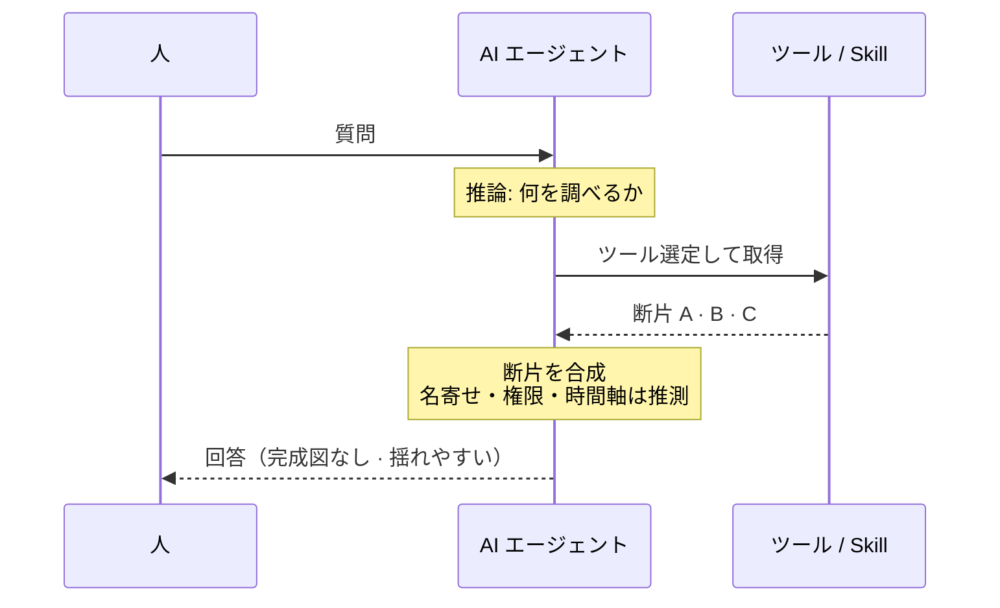
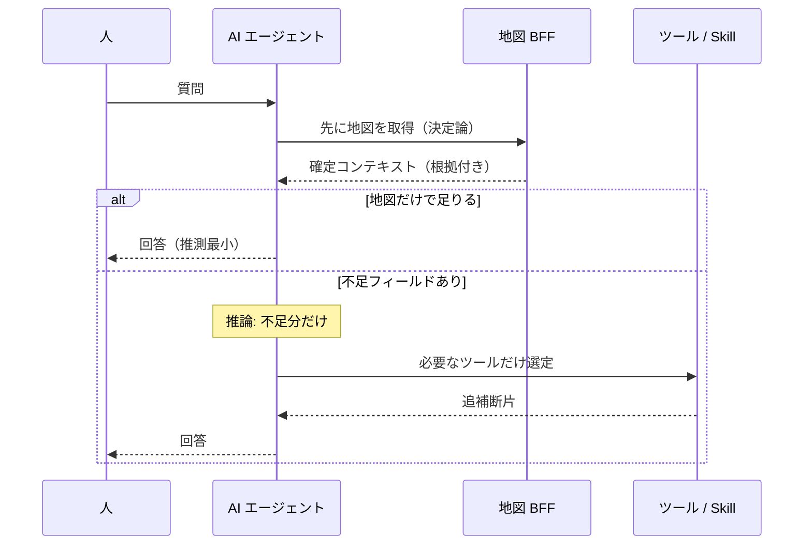
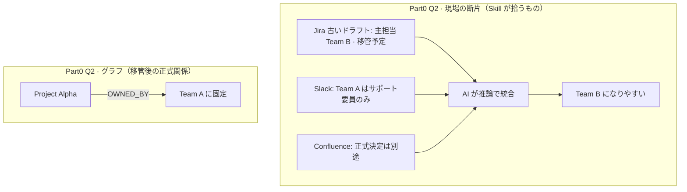
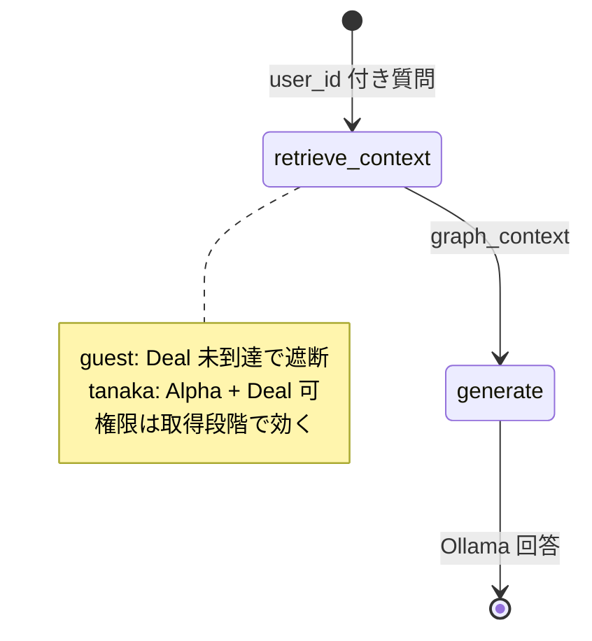
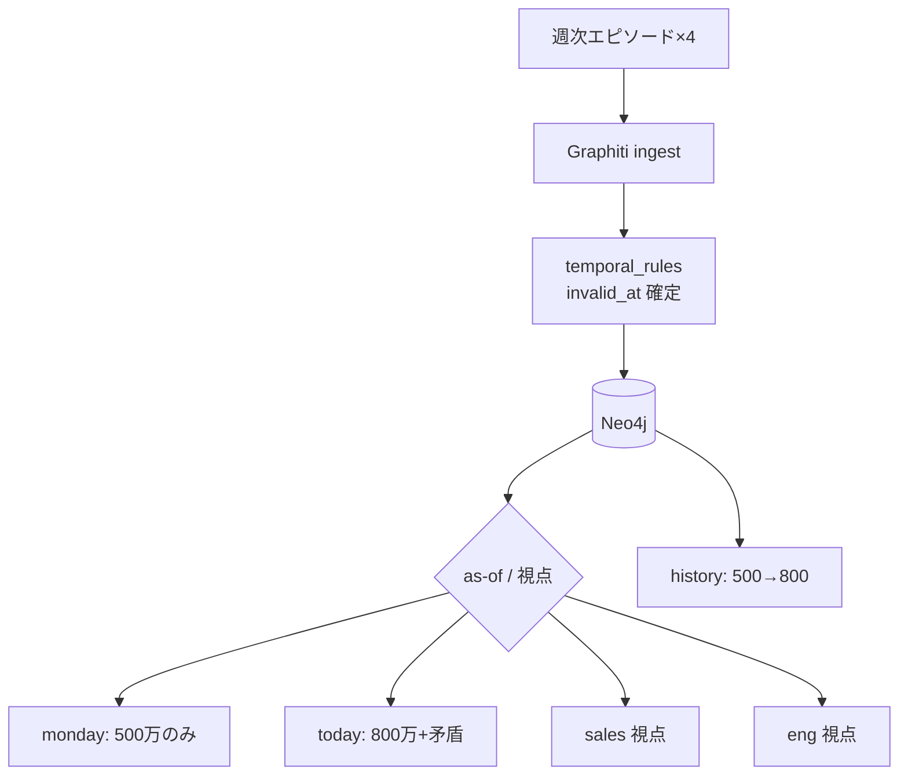
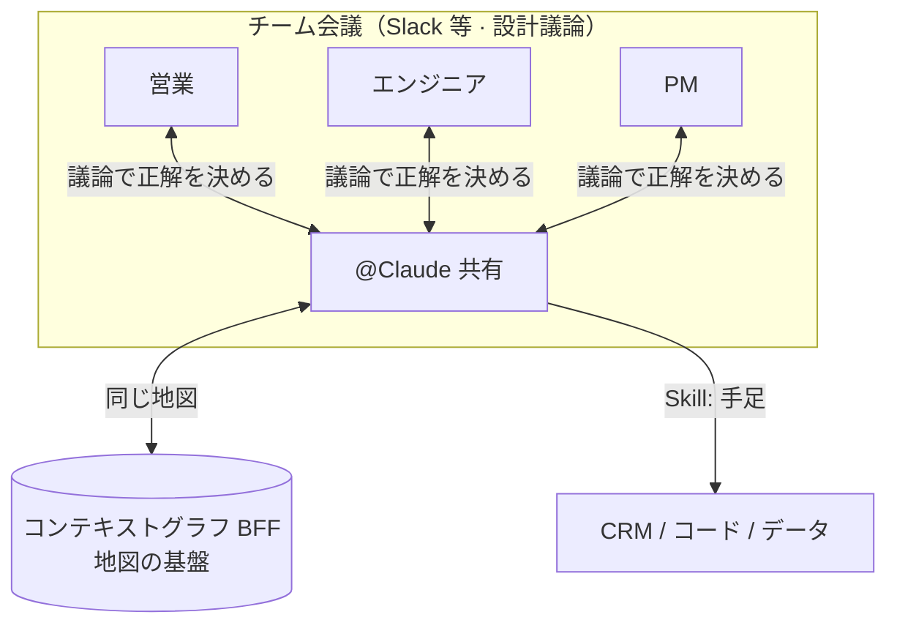

# LLMに巨大パズルを解かせるな：ナレッジグラフで「正解の絵」を渡すエージェント設計

> この記事は独立して読めます（約10分）。再現手順・コマンド・期待出力はすべて [experiment README](../experiments/kg-puzzle-agent/README.md) に集約しています。**experiment で本番と異なる点**（MCP 非接続、検索簡略化、Q3 ヒューリスティック等）は [README「デモと現実の差」](../experiments/kg-puzzle-agent/README.md#demo-vs-production) に明記しています。

:::message alert
**experiment の正直な位置づけ**: Jira / Slack / Confluence / MCP は **接続していません**。Part0 の「Skill 側」は JSON 断片の **プロンプト直渡し** です。LangGraph は 2 ノード、Q3 の矛盾検出は正規表現、Part2 の議論用行は固定テンプレです。設計思想は本番向きですが、**そのままコピペで本番エージェントになる構成ではありません**。詳細は [README](../experiments/kg-puzzle-agent/README.md#demo-vs-production) を参照してください。
:::

:::message
**前提知識**: Skill とデータ基盤の関係は「[ツールを100個並べてもAIエージェントは賢くならない](https://zenn.dev/knowledge_graph/articles/kg-agent-skill-layer)」、コンテキストグラフの位置づけは「[Claude の外側にコンテキストグラフを置くと…](https://zenn.dev/knowledge_graph/articles/context-graph-improves-llm)」を先に読むとスムーズです。GraphRAG（グラフで RAG 検索を補強する手法）との区別は「[RAG を超える知識統合](https://zenn.dev/knowledge_graph/articles/beyond-rag-knowledge-graph)」を参照してください。
:::

## この記事の要点

**LLM に渡しているのは、しばしば「パズルのピース」だけです。** Confluence、Slack、Jira などから取った断片を、その場でつなぎ合わせるしかない設計では、正答率が安定しにくくなります。

本記事では、ナレッジグラフを **部分的な正解の絵（完成図のラフ）** として LLM の前に置く設計を説明します。後半では Slack 等の **チーム会議に AI が入る** 形（[Claude Tag](https://www.anthropic.com/news/introducing-claude-tag) など）も触れます。共有エージェントの操作そのものは experiment では再現しませんが、マルチプレイヤーに必要な **地図の基盤**（権限・時系列・視点・根拠）は Part0〜2 で確認できます。実行方法は [experiment](../experiments/kg-puzzle-agent/) の README を参照してください。

---

## 問題：断片だけでは、関係を LLM に推測させることになる

RAG を組み込んだ。ツールを10個つないだ。Skill も増やした。それでも的外れな回答、存在しない関数の呼び出し、「それは違います」という経験は、日本のエンジニアとの会話でもよく出てきます。

比喩として言うなら、LLM は **目隠しをしたまま1万ピースのジグソーパズルを解かされている** 状態に近いです。ピース（チャンクや API の戻り値）は渡しているのに、**完成図（box art）** は渡していません。LLM が行っているのは、断片同士を「たぶんこう繋がる」と推測することに過ぎません。

これは LLM の能力不足というより、**情報アーキテクチャの設計不足** です。重要なのはどのモデルを使うかだけでなく、**モデルが何の上で推論するか** です（[Skill レイヤの記事](https://zenn.dev/knowledge_graph/articles/kg-agent-skill-layer) と同じ切り口です）。

---

## なぜ外れるのか：3つの壁

| 壁 | 何が起きるか |
|----|--------------|
| **断片化** | RAG チャンクは「形」（関係）を失いやすい |
| **ツール爆発** | ツール数に応じて選択肢が増え、LLM が迷いやすい |
| **データ散在** | CRM・ドキュメント・チャットにまたがり、接続の手がかりがない |

よくある対策は、ツールを **専門エージェントごとに分ける** ことです。CRM 担当、ドキュメント担当、開発ツール担当。個々は動きますが、問題は **ツール爆発** から **エージェント爆発** に移ります。オーケストレーターが「どのエージェントに振るか」を推測する必要があり、選択肢が増えただけで本質は変わりません（[Skill レイヤの記事](https://zenn.dev/knowledge_graph/articles/kg-agent-skill-layer) でも、分割だけでは精度が安定しない、という整理です）。

さらに厳しいのは、**多数のエージェントが同じ正しい共通コンテキストを共有し、互いにやり取りする** 設計です。100体のエージェントが、同じ顧客・同じ権限・同じ時系列を前提に会話できるようにするのは、1体に100ツールを渡すより難しいことが多いです。各エージェントのプロンプトや Skill だけでは、引き渡しのたびに名寄せと推測が発生します。ここで必要になるのが、後述する **コンテキストグラフ BFF** です。

LLM は賢い一方で、**推測の域を出られない** 場面があります。推測が外れた結果を、我々はハルシネーションと呼びます。

---

## ハーネスだけでは、正しい配置まで保証できない

プロンプト、ガードレール、ルーティング。これらはハーネスであり、**枠** として機能します。「ここに置くな」とは言えますが、「ここに置け」とまでは言えません。ルールを増やしただけでは、正しい回答への確率は必ずしも上がりません。

必要なのはルールの追加だけではなく、**部分的にでも正解の絵を見せること** です。完成図が完璧でなくても、「色の配置がだいたい分かる」程度で、探索空間は大きく狭まります。

---

## Skill だけでは、完成図は渡せない

「MCP をつないだ」「Cursor Skill を書いた」「Dify のワークフローを増やした。Skill を入れたらコンテキストグラフはいらないのでは？」という問いは、よくいただきます。

**Skill** は **どう動くか**（ツールの呼び方・手順）を渡す層です。**コンテキストグラフ** は **何が真か・どう繋がるか・誰に見えるか・いつまで有効か** を LLM の外に置く層です。詳論は [ツールを100個並べてもAIエージェントは賢くならない](https://zenn.dev/knowledge_graph/articles/kg-agent-skill-layer) に譲ります。

| 層 | 役割 | Skill だけで足りるか |
|----|------|----------------------|
| Skill / MCP | 呼び方・ガードレール | 呼び方は書ける |
| **コンテキストグラフ** | 関係・時間・権限・根拠 | **推測させるとミスが増える** |
| Graph Traversal Contract | グラフの読み方 | [別記事](https://zenn.dev/knowledge_graph/articles/graph-traversal-contract-skill) 参照 |

---

## コンテキストグラフ = AI とデータソースの BFF

大規模・複数 DB・非構造化データにまたがる処理を、Skill だけで綺麗に組んでも、**わかりきった関係性を LLM に推論させるとミスが増えます**。本記事で言う **地図**（部分的な正解の絵）を、**コンテキストグラフ BFF** として AI の近くに置き、先に決定論的に渡す。それが目的です。

LLM はバージョンごとに破壊的変更もあるため、**LLM ともデータソースとも疎結合** な中間層が要ります。データソースは CRM、SaaS、ドキュメントなど **多数** 存在し、利用する AI エージェントも **1体とは限りません**（専門エージェントを増やすほど、共有すべき地図の重要性が上がります）。コンテキストグラフは、それらを横断して統合した **地図** を保持し、各 AI から近い位置で問い合わせに応じます（[コンテキストグラフの記事](https://zenn.dev/knowledge_graph/articles/context-graph-improves-llm) と同じ整理です）。

### 従来：Skill がデータソースを直接叩く

Skill / MCP が API を直叩きして断片を返し、LLM が名寄せ・権限・時間軸を推測する一般的な経路は、[ツールを100個並べてもAIエージェントは賢くなない](https://zenn.dev/knowledge_graph/articles/kg-agent-skill-layer) の sequence 図で示しています（本記事では繰り返しません）。Scatter-gather 型との対比は [Memory-first の記事](https://zenn.dev/knowledge_graph/articles/kg-agent-memory-first-design) も参照してください。

本記事独自の切り口は **パズル比喩** です。完成図（box art）なしでは、次の **エージェント定番の流れ** になります。人が質問 → AI が推論 → ツールを選定 → 断片を合成、の順です。

### 本記事の整理：BFF で確定し、不足だけ Skill で取りに行く

コンテキストグラフ BFF には **地図**（関係・時間・権限・根拠）が載っています。**人 → AI** の入口は同じですが、AI は **先に地図 BFF へ** 行き、確定コンテキストを受け取ってから答えます。地図だけで足りれば、ツール選定と断片合成は最小になります。不足があるときだけ推論で **必要な Skill だけ** 選び、追補します。

Part1 の LangGraph（グラフ取得 → 回答生成）は、この **BFF 先** の最小形です（2 ノードのみ — [デモと現実の差](../experiments/kg-puzzle-agent/README.md#demo-vs-production)）。Part0 では断片 **直渡し**（Skill 相当・MCP 非接続）と、グラフコンテキストを先に渡した場合を比較します。

[experiment](../experiments/kg-puzzle-agent/) では、次の論点を Part0〜Part2 で体験できます。コマンド・確認チェックリスト・Neo4j Browser 用 Cypher は [README](../experiments/kg-puzzle-agent/README.md) を参照してください。

| 論点 | Part | README |
|------|------|--------|
| 同一事実・断片 vs 構造 | Part0 | [Part0](../experiments/kg-puzzle-agent/README.md#part0) |
| 矛盾断片で Skill が外れやすい | Part0 Q2（現場混在） | 同上 |
| 関係を LLM の前に渡す | Part1 | [Part1](../experiments/kg-puzzle-agent/README.md#part1) |
| プロンプト禁止でも Skill は漏れうる | Part1 | 同上 |
| 一定期間有効 + 将来予定 + 視点差 | Part2 | [Part2](../experiments/kg-puzzle-agent/README.md#part2) |
| 未解決の矛盾がグラフに残る | Part2 | 同上 |
| 矛盾時に推測せず確認・議論へ | Part0 Q3 / Part2 ⚠ | 同上 |

---

## 部分的な完成図（地図）としてのナレッジグラフ

本記事では、ナレッジグラフが保持する構造化コンテキストを **地図** と呼びます。完成図が完璧でなくても、「色の配置がだいたい分かる」程度で、探索空間は大きく狭まります。

- **ベクトル検索**は、色が似たピースを集めるイメージです。
- **グラフ検索**は、形が合うピースを特定するイメージです。

ハイブリッドが実務では強い一方、本記事の experiment では **グラフ側の効果** に焦点を当てています。SaaS 連携の PoC ではなく、同一事実のダミーデータで **断片直渡し（Skill 相当）** vs コンテキストグラフ（BFF 層の地図）の差を **公平に** 比較できる構成です。MCP や RAG パイプラインそのものは動かしていません（[デモと現実の差](../experiments/kg-puzzle-agent/README.md#demo-vs-production)）。

---

## Part0：同一事実で断片直渡し（Skill 相当） vs グラフ

experiment では Jira / Slack / Confluence は **接続せず**、**Project Alpha** の同一事実を断片（Skill **相当** — `tool_fragments.json` をプロンプトに貼るだけ）とグラフの両方で表現します。**MCP ツール選定や並列取得は再現していません**。断片は意図的に「きれいな正答セット」と「現場っぽい混在セット」の2通りを用意しています。

### 現実のデータは、きれいに揃っていない

Q2 で Team B と Team A が混ざって見えるのは、「デモ用に両方間違えた」わけではありません。**現場の断片はそうなりがち** だからです。

- **Jira** には、古いドラフトや移管前のチケットが残る（「主担当は Team B。移管予定。」）
- **Slack** には、会話の文脈依存の発言が残る（「Team A はサポート要員のみ」など、正式決定とは別レイヤの言い方）
- **Confluence** には、未確定を明示した記述がある（「担当チームの正式決定は別途。」）

チャットで「Project Alpha の担当、Team B だったよね？」と出てきたり、検索で古い Jira だけヒットしたり、**どれも「嘘」とは限らないが、全部を並べると矛盾する**、という状態です。Skill / RAG が返すのは、だいたいこうした **ラベル付き断片の束** です。AI は推論でツールを選び、取れた断片を合成するので、**どの発言を「正」とするか** を毎回推測することになります。

グラフ側は、移管完了後の **正式な関係** だけを `Project Alpha -[:OWNED_BY]-> Team A` として固定しています。Q2 は「散在した断片 vs 確定した関係」の対比です。

### Q1・Q2・Q3

**Q1（同一事実）** では、3つの断片が素直に揃うケースです。Skill でも正答しやすい一方、グラフは `OWNED_BY` と `USES` を **根拠付き** で示せます。

**Q2（現場混在）** では、上記の **現場混在** を再現した断片だけを渡します。Skill 側は Jira の古いドラフト（Team B 主担当）を採りやすく、グラフは `OWNED_BY` で **Team A** に固定されます。

> Q1 だけだと Skill も正答しやすいです。Q2 は **データがきれいでないとき** に、推測依存の差が体感しやすくなります。

### 矛盾が来たとき：推測で決める vs 人に確認する

断片直渡し（Skill 相当）だけの経路では、AI は **黙ってどちらかを選んで** 回答しがちです（Q2 では古い Jira 側に寄りやすい）。利用者から見ると、間違っていても **確信を持って答えたように見える** のが問題です。

KG では **いまグラフ上で有効な事実** と **新しく入ってきた情報** を並べて扱えます。矛盾が検出できれば、AI はいきなり確定せず、次のような **確認の質問** を返せます。

> 正式な担当は Team A です。一方、Jira ドラフトでは Team B 主担当・移管予定とあります。**現行の正はどちらですか？** 古いドラフトを失効させますか？

推測で「Team B だろう」と決め打ちするのではなく、**差分を可視化して人間の判断を仰ぐ** 動きです。**Q3** では `compare` の末尾（または `./run_demo.sh clarify`）で、グラフ Team A と Jira 古ドラフト Team B を突き合わせます。矛盾検出は **正規表現ヒューリスティック**（本番の ingest/スキーマ検証ではない）。**確認テンプレート**（決定論）に加え、Ollama で **チャット調の聞き返し**（確定回答なし・LangGraph 分岐なし）も表示します。Q2 B は移管済み `OWNED_BY` の **即答する最小例**、Q3 は **聞き返す例** です。Part2 の **未解決矛盾**（⚠ + `[デモ固定]` 議論用行）で、Slack 上の @Claude に近い「未確定のまま残す」体感ができます。

再現手順・期待出力は [README の Part0](../experiments/kg-puzzle-agent/README.md#part0) を参照してください。

---

## Part1：完成図を先に渡す LangGraph エージェント

グラフコンテキストを **先に** 取得し、その後に LLM が回答します。LangGraph は **retrieve → generate の 2 ノードのみ**（矛盾時の分岐・HITL は未実装 — [デモと現実の差](../experiments/kg-puzzle-agent/README.md#demo-vs-production)）。権限はパストラバーサル時点で効き、到達不能なノードはコンテキストに含めません。同じ質問でも **断片直渡し + 禁止指示** では秘匿断片が漏れうる一方、**グラフ + guest** では取得段階で遮断される、という対比も README の Part1 で確認できます。

実装の全文・スタック要件・実行コマンドは [README の Part1](../experiments/kg-puzzle-agent/README.md#part1) を参照してください。

---

## Part2：チームの記憶（なぜ800万かを説明する）

**Project Alpha 拡張（顧客X）** の2026年6月第4週ストーリー（500万 → 800万 → 10月リリース予定 → エンジニア試算の矛盾）を Graphiti で扱います。Skill に最新値だけ書いても **なぜ500万が無効か** は監査しにくい、という論点がここでの焦点です。

ingest → SSOT → as-of クエリ（+ 視点フィルタ）の3段構成です。**monday** as-of では500万のみ、**today** as-of では800万・10月予定・未解決矛盾が共存します。`history` では 500→800 の変遷と置換理由を表示し、Part1 の「参照したグラフ」と対で **根拠チェーン** という語彙で揃えています。

Part0 で述べた「どっちが正？」の確認は、Part2 では **未解決矛盾としてグラフに残す** 形で近づけています。営業の800万前提とエンジニアの3人月試算は、`eng_budget_conflict` として両方グラフ上に載り、search 出力の **⚠ 未解決** セクションに出ます。続けて **`[デモ固定]` 議論用行**（固定テンプレ — 本番の LLM 聞き返しそのものではない）も表示され、推測で片方を消さずチームの判断待ちに回せます。Slack 上の聞き返し UI までは experiment では再現しません（[1人1AIから…](#1人1aiからチーム会議の中のaiへ) の「人間が議論し、AI が手足になる」と対になります）。

再現手順・出力例・Neo4j Browser 用 Cypher は [README の Part2](../experiments/kg-puzzle-agent/README.md#part2) を参照してください。

---

## 1人1AIから、チーム会議の中のAIへ

Part2 までで扱ったのは、**1つの案件についてチームが共有する記憶** です。ここから先は、利用形態そのものが変わります。

これまで「AI エージェント」の話題の中心は、**1人の人間に対して AI が1体（または複数）** という構成でした。Cursor や Claude Code は個人の作業に AI を置く。専門エージェントを増やす議論も、結局は **その人の AI 群** をどう整理するか、に収まりがちです。

組織で本気で使う段階になると、前提が変わります。**チームミーティングの中に AI が座る** のです。2026年6月23日に Anthropic が公開した [Claude Tag](https://www.anthropic.com/news/introducing-claude-tag) は、その方向の具体例です。Slack チャンネルに **1つの共有 @Claude** が入り、チャンネル内の会話を追いながら、誰でもタスクを振り、前の人の続きから会話を再開できます。個人ごとに別ボットがいるのではなく、**チーム全員が同じ AI チームメイトを見ている** 形です。

### 人間が議論し、AI が手足になる

この形態では、役割分担がはっきりします。

- **人間（チームメンバー）**: パズルの **正解の配置** を、互いの発言から議論して決める。営業とエンジニアで「800万は通るが10月は無理」といった **未解決の矛盾** も、ここで扱う。
- **AI エージェント**: Skill で CRM を更新したり、コードを書いたり、データを取りに行く **手足**。都度の共同作業で、人間同士のやり取りに載っていた文脈を追い、実行に移す。

これまで人間同士の会話にしかなかった **暗黙の共有コンテキスト**（誰が何を知っているか、どの前提がまだ未確定か）を、AI が理解したうえで動く必要があります。Claude Tag がチャンネル記憶を蓄積する、という説明も、この要求の表れです。

### 複数人で1つのエージェントを操作する

だから **複数人で1つのエージェントを操作する** 設計が要ります。100人それぞれが別々の AI を持つより、**1つの共有エージェントに正しい共通コンテキストを渡す** 方が、組織利用では現実的です（前節の「100体のエージェント連携」よりこちらが先に来る、という整理です）。

その共通コンテキストを、プロンプトや Slack の直近ログだけに頼ると再び推測になります。**コンテキストグラフ BFF** が、チーム全員と共有 AI の **同じ地図** になります。

マルチプレイヤーだからこそ、この地図に載せる **基盤** が要ります。次のような要素は、会議の外に置かないと共有エージェントが一貫して動けません。

| 基盤 | マルチプレイヤーで必要な理由 | experiment で触れる部分 |
|------|------------------------------|-------------------------|
| **権限** | 同じ @Claude でも、人ごとに見える範囲が違う | Part1: `user_tanaka` / `user_guest` |
| **時系列・as-of** | 「今の正」が誰にとっても同じ基準で説明できる | Part2: monday / today |
| **視点** | 営業とエンジニアで見えるファクトが違う | Part2: `sales` / `eng` |
| **未解決矛盾** | 正解は会話で決まり、グラフ上に残る | Part2: 800万 vs 3人月（⚠ + 議論用行） |
| **根拠チェーン** | なぜその値かを、全員が同じ履歴で辿れる | Part2: `history` |
| **矛盾→確認** | 推測で決めず人に聞き返す | Part0 Q3 / Part2 議論用行 |

**Skill だけではここが難しい** です。Skill は呼び方と取得手順は書けますが、**誰に何が見えるか・いつ失効したか・未確定の矛盾をどう残すか** を、チーム全員と共有 AI が同じ座標系で参照する、という要件は Skill の説明文だけでは安定しません。チャンネルログを都度 LLM に渡しても、tanaka と guest、営業とエンジニアの差を **取得段階** で効かせるのは、グラフ側の仕事です。

:::message
**experiment の位置づけ**: Slack 連携や「複数人が同時に1つの @Claude を操作する」体験までは再現しません（CLI の単一セッションです）。一方で、上表の **地図の基盤** は Part0〜2 で確認できます。コマンド詳細は [experiment README](../experiments/kg-puzzle-agent/README.md#map-foundation) を参照してください。マルチプレイヤーの全体像は本節の設計議論として読み、基盤の必要性は experiment で体験してください。
:::

### 設計原則（要約）

- **複数人・1エージェント** では、全員が同じ地図を参照できることが前提になります。
- 各人が異なるピースを持つ → グラフに蓄積します。
- 見えるピースが人ごとに違う → 権限はグラフ上で制御します（Part1 の guest / tanaka と同型）。
- ピースに消費期限がある → `valid_at` / `invalid_at` で扱います（Part2）。
- 正解はチームの対話から生まれる → AI は **構造化のファシリテーター** と **手足** として位置づけられます。
- 専門エージェントを乱立させるより、**共有地図の上で1体を回す** 方が、組織では扱いやすいことが多いです。

Memory-first 設計との関係は [AIエージェントが毎回データを取りに行く設計の限界](https://zenn.dev/knowledge_graph/articles/kg-agent-memory-first-design) を参照してください。

---

## まとめ

- 断片だけでは、巨大パズルは安定して解けません。
- ツールを専門エージェントに分けても **エージェント爆発** になり、100体が正しい共通コンテキストで連携するのはさらに難しいです。
- Skill は呼び方、コンテキストグラフ（BFF）は関係・時間・権限を担います。
- LLM の前に完成図（部分的でよい）を渡し、**根拠チェーン** まで見せる設計が有効です。
- マルチプレイヤーには **地図の基盤**（権限・時系列・視点・矛盾の残し方・Q3 確認）が要り、Skill だけでは一貫した共有が難しい。experiment の Part0 Q3 / Part1/2 は CLI で確認できる。
- Part0〜2 は [experiment](../experiments/kg-puzzle-agent/) で体験できます（手順は [README](../experiments/kg-puzzle-agent/README.md)）。

---

## 手を動かす

再現手順・コマンド一覧・モデル選定・SSOT・トラブルシュートは [experiments/kg-puzzle-agent/README.md](../experiments/kg-puzzle-agent/README.md) に集約しています。

Neo4j Browser でグラフを目視する手順と、**`all` 実行後の実測出力例**（Entity 16 件・予算ファクト 3 行など）は [README の Neo4j Browser 節](../experiments/kg-puzzle-agent/README.md#neo4j-browser30秒ツア) を参照してください。

---

## 関連記事

| 記事 | テーマ |
|------|--------|
| [ツールを100個並べてもAIエージェントは賢くならない](https://zenn.dev/knowledge_graph/articles/kg-agent-skill-layer) | Skill の先にあるデータ基盤 |
| [Claude の外側にコンテキストグラフを置くと…](https://zenn.dev/knowledge_graph/articles/context-graph-improves-llm) | コンテキストグラフと BFF |
| [AIエージェントが毎回データを取りに行く設計の限界](https://zenn.dev/knowledge_graph/articles/kg-agent-memory-first-design) | Memory-first / scatter-gather |
| [Claude Code / Cursor Skill における Graph Traversal Contract](https://zenn.dev/knowledge_graph/articles/graph-traversal-contract-skill) | グラフの読み方の規約 |

---

## 参考

- [Introducing Claude Tag（Anthropic, 2026-06-23）](https://www.anthropic.com/news/introducing-claude-tag)
- [Graphiti](https://github.com/getzep/graphiti)
- [LangGraph](https://langchain-ai.github.io/langgraph/)
- [Neo4j Documentation](https://neo4j.com/docs/)

---

## 更新履歴

- 2026-06-28: 初版（下書き）
- 2026-06-28: experiment 追加（Part0 Q2、秘匿漏洩、as-of/視点、quick/full）
- 2026-06-28: 文体を既存シリーズに合わせて整備（ですます調・表現統一）
- 2026-06-28: 見出し・本文の em dash 表記を「：」および句読点に統一
- 2026-06-28: BFF 先のシーケンス図に差し替え（地図・決定論→不足時のみ Skill）
- 2026-06-28: 再現手順を README に集約（記事は体験内容のみ）
- 2026-06-28: ツール爆発の対策としての専門エージェント化（エージェント爆発）と共通コンテキストの難しさを追記
- 2026-06-28: 「マルチプレイヤーAI」を 1人1AI→チーム会議内の共有AI（Claude Tag 等）へ展開し、Part2 から接続
- 2026-06-28: 組織利用（共有エージェント）は experiment 非対応である旨を明記
- 2026-06-28: マルチプレイヤー向け地図基盤と Skill だけでは難しい点、experiment が素材として触れる範囲を整理
- 2026-06-28: Mermaid を本記事固有（Part0 Q2・Part2 パイプライン・共有 AI）に差し替え、汎用 API 直叩き sequence は Skill レイヤ記事へリンク
- 2026-06-28: BFF 対比図を「人→AI 推論→ツール選定→断片合成」の sequence に変更
- 2026-06-28: Part0 Q2 に現場データ混在（古 Jira・Slack 文脈・未確定記述）の説明を追加
- 2026-06-28: KG は矛盾時に推測で決めず確認・未解決として残せる点を Part0/2 に追記
- 2026-06-28: experiment Q3・Part2 議論用行と記事の地図基盤表を同期
- 2026-06-28: README「デモと現実の差」を追加。MCP 非接続・検索簡略・Q3 ヒューリスティック等を明記
- 2026-06-28: README Neo4j Browser 節にログイン手順・`all` 後の実測出力・Part0/Part2 の使い分けを追記

---

## フィードバック受け付け

本記事は AI を活用して執筆しています。Skill とコンテキストグラフの整理、experiment の再現性、比喩の分かりやすさについて、内容に誤りや追加情報があれば、Zenn のコメントよりお知らせください。
