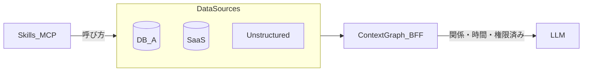
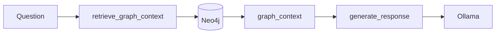

> **この記事の読み方**
> - 約10分: 問題提起〜Skill vs コンテキストグラフ（BFF）
> - 約15分: [experiment](../experiments/kg-puzzle-agent/) で Part0〜Part2 を体験（Neo4j: Podman、Ollama: ホスト）
> - 理論の詳細: [ツールを100個並べても…](https://zenn.dev/knowledge_graph/articles/kg-agent-skill-layer)、[コンテキストグラフ](https://zenn.dev/knowledge_graph/articles/context-graph-improves-llm) へリンクで統合

あなたのAIエージェントは、目隠しをしたまま1万ピースのジグソーパズルを解かされている。

RAGを組み込んだ。ツールを10個つないだ。Skillも増やした。それでも的外れな回答、存在しない関数の呼び出し、「それは違います」——。

私たちがLLMに渡しているのは**パズルのピースだけ**だ。完成図（box art）は渡していない。Confluence、Slack、Jira——バラバラのピースをLLMが「たぶんこう繋がる」と推測しているに過ぎない。

これはLLMの能力不足ではない。**情報アーキテクチャの設計不足**だ。本記事では、ナレッジグラフを**部分的な正解の絵**としてLLMの前に渡す設計と、Neo4j + LangGraph + Graphiti（Ollama）での再現方法を示す。

※ 本記事の **GraphRAG**（グラフでRAG検索を補強する手法）との区別は [RAG を超える知識統合](https://zenn.dev/knowledge_graph/articles/beyond-rag-knowledge-graph) を参照。ここでは **ナレッジグラフ / コンテキストグラフ** を、LLMの外側の意味レイヤとして扱う。

---

## なぜ外れるのか — 3つの壁

| 壁 | 何が起きるか |
|----|--------------|
| **断片化** | RAGチャンクは「形」（関係）を失う |
| **ツール爆発** | ツール数に応じて選択肢が爆発し、LLMが迷う |
| **データ散在** | CRM・ドキュメント・チャットにまたがり、接続手がかりがない |

LLMは賢い。しかし推測の域を出られない。推測が外れたものを、我々はハルシネーションと呼ぶ。

---

## ハーネスでは足りない

プロンプト、ガードレール、ルーティング——ハーネスは**枠**だ。「ここに置くな」とは言えるが、「ここに置け」とは言えない。正しい回答への確率は、ルールを増やしただけでは上がらない。

必要なのはルールの追加ではなく、**部分的にでも正解の絵を見せること**だ。

---

## Skill だけでは完成図は渡せない

「MCPつないだ」「Cursor Skill書いた」「Difyワークフロー増やした——Skill入れたらコンテキストグラフいらないのでは？」

**Skill**は**どう動くか**（ツールの呼び方・手順）を渡す層。**コンテキストグラフ**は**何が真か・どう繋がるか・誰に見えるか・いつまで有効か**をLLMの外に置く層だ。詳論は [ツールを100個並べてもAIエージェントは賢くならない](https://zenn.dev/knowledge_graph/articles/kg-agent-skill-layer) に譲る。

| 層 | 役割 | Skillだけで足りる？ |
|----|------|---------------------|
| Skill / MCP | 呼び方・ガードレール | 呼び方は書ける |
| **コンテキストグラフ** | 関係・時間・権限・根拠 | **推測させるとミスが増える** |
| Graph Traversal Contract | グラフの読み方 | [別記事](https://zenn.dev/knowledge_graph/articles/graph-traversal-contract-skill) 参照 |

---

## コンテキストグラフ = AI とデータソースの BFF

大規模・複数DB・非構造化データにまたがる処理を、Skillだけで綺麗に組んでも、**わかりきった関係性をLLMに推論させるとミスが増える**。先に関係を渡し、LLMが苦手な関係処理を減らす——それが目的だ。

配置としてはDB内蔵ではなく**AIに近いところ**がよい。ただしLLMはバージョンごとに破壊的変更もある。**LLMともデータソースとも疎結合**な中間層が要る。



この中間層が、Skill/MCP（フロント）と各データストア（バック）の間を取り持つ**BFF**として落ち着く。用語の整理は [Claude の外側にコンテキストグラフを置くと…](https://zenn.dev/knowledge_graph/articles/context-graph-improves-llm) を参照。

| 論点 | 体験 |
|------|------|
| 同一事実・断片 vs 構造 | Part0 `compare` |
| 関係をLLMの前に渡す | Part1 LangGraph |
| 一定期間有効（水曜までX、木曜からY） | Part2 Graphiti |
| 権限で見える範囲が変わる | Part1 権限デモ |

---

## 部分的な完成図としてのナレッジグラフ

完成図は完璧でなくていい。「なんとなく色の配置が分かる」程度で、探索空間は劇的に狭まる。

- **ベクトル検索**: 色が似たピースを集める
- **グラフ検索**: 形が合うピースを特定する

ハイブリッドが実務では強いが、本記事の experiment では**グラフ側の効果**に焦点を当てる。

---

## Part0: 同一事実で Skill だけ vs グラフ

experiment では **Jira / Slack / Confluence は接続しない**。`tool_fragments.json` の3断片と `project_alpha.cypher` のグラフは**同一の Project Alpha 事実**を表す。載せ方だけ変え、公平に比較する。

```bash
cd experiments/kg-puzzle-agent
./run_demo.sh compare
```

**A（Skill断片のみ）**: 3ソースのテキスト + 「統合せよ」→ つながりを**推測**

**B（コンテキストグラフ）**: 同一事実を `Alpha -[:OWNED_BY]-> Team A` 等で固定 → `## 参照したグラフ` 付きで回答

> 同じ事実なのに、Skill 断片だけだとつなぎ方を推測する。グラフなら関係が固定されているので、答えと根拠が安定する。

---

## Part1: 完成図を先に渡す LangGraph エージェント

スタック: **Neo4j（Podman）+ LangGraph + ホスト Ollama**（OpenAI API 不要。Mac では GPU/Metal 利用）。



要点:

1. **グラフコンテキストが最初** — LLMが考える前に完成図を渡す
2. **権限はグラフ上** — 到達不能なノードは渡さない
3. **全文コード** — [experiments/kg-puzzle-agent/app/](../experiments/kg-puzzle-agent/app/) を参照

```python
# 概念のみ — 全文は experiment 参照
workflow.set_entry_point("retrieve_context")
workflow.add_edge("retrieve_context", "generate")
```

> **動かす:** `./run_demo.sh part1`

### 権限 — プロンプトではなくパストラバーサル

同じ質問でも、**誰が聞くかで正解が変わる**。プロンプトで「見るな」と書いても、全文渡せば漏れる。グラフでは `user_tanaka` は Alpha に到達し、`user_guest` は到達不能——**最初から見えるものだけ**がコンテキストになる。

---

## Part2: チームの記憶 — なぜ800万かを説明する

マルチプレイヤーAIでは、月曜「予算500万」→水曜「800万まで」→金曜マネージャー確認、という**時間軸**が問題になる。Skillに最新値だけ書いても、**なぜ500万が無効か**は監査できない。

[Graphiti](https://github.com/getzep/graphiti) + Ollama で、エピソード取込 → search → history を体験できる。

```bash
./run_demo.sh part2
```

experiment では **Graphiti ingest → SSOT で `invalid_at` 確定 → 金曜 as-of クエリ** の3段に分けている。小モデルだけに任せると 800 万ファクトが抜けたり `invalid_at` が付かないことがあるため、ingest 後に `temporal_episodes.yaml` のルールで時系列を確定し、search / history は Neo4j 上の valid / invalid をそのまま見せる（詳細・モデル選定は [experiment README](../experiments/kg-puzzle-agent/README.md)）。

**search** の出力イメージ（デフォルト `gemma2:2b` での代表例）:

```
=== 結論（2024-11-08 時点で有効なファクト）===
・山田部長は予算を800万円まで拡大可能とのこと
  valid: 2024-11-06 〜 invalid: 現在有効
・ただし来期に跨ぐ場合は再稟議が必要とのこと
  valid: 2024-11-06 〜 invalid: 現在有効
・3ヶ月なら今期に収まる
  valid: 2024-11-07 〜 invalid: 現在有効

=== なぜ800万か（グラフの根拠）===
1. 2024-11-04「顧客Xの予算は500万円」→ invalid: 2024-11-06（sales-meeting-monday）
2. 2024-11-06「山田部長は予算を800万円まで拡大可能とのこと」→ 現在有効（sales-update-wednesday）
→ 水曜エピソード取込で月曜ファクトが invalid 化。金曜時点の正解は800万

=== 検索結果から除外されたもの（invalid_at により失効）===
・「顧客Xの予算は500万円」— invalid_at: 2024-11-06
```

※ 再稟議は SSOT（`reapproval` ルール）で常に載る。3ヶ月・来期跨ぎなど **エピソード全体をもっと厚く** 見せたい場合は、より抽出品質の高いモデルに差し替えると増えやすい（experiment README の「Part2 でもっと詳しく追いたい場合」参照）。invalid_at の骨格（500 万失効・800 万有効）は SSOT で同じ。

**history** では `500万（11/04〜11/06） → 800万（11/06〜現在）` の1行変遷と置換理由を表示する。Part1の「参照したグラフ」と対で、**根拠チェーン**という語彙で統一する。

---

## マルチプレイヤーAIの設計原則（要約）

- 各人が異なるピースを持つ → グラフに蓄積
- 見えるピースが人ごとに違う → 権限はグラフ上
- ピースに消費期限 → `valid_at` / `invalid_at`
- 正解は対話から生まれる → AIは**構造化のファシリテーター**

Memory-first 設計との関係は [AIエージェントが毎回データを取りに行く設計の限界](https://zenn.dev/knowledge_graph/articles/kg-agent-memory-first-design) を参照。

---

## まとめ

- 断片だけでは巨大パズルは解けない
- Skill は呼び方、コンテキストグラフ（BFF）は関係・時間・権限
- LLM の前に完成図を渡し、根拠チェーンまで見せる
- experiment で Part0 は数秒、Part0〜2 通しは十数分程度（Ollama ホスト推論）

---

## 手を動かす

再現手順・全文コード・データの正（SSOT）は [experiments/kg-puzzle-agent](../experiments/kg-puzzle-agent/) を参照。

```bash
cd experiments/kg-puzzle-agent
cp env.sample .env
pip install -r requirements.txt
ollama serve   # ホスト（別ターミナル）
./run_demo.sh setup   # Neo4j 起動 + ollama pull gemma2:2b 等
./run_demo.sh compare
./run_demo.sh part1
./run_demo.sh part2
```

LLM・モデル比較・Part2 の SSOT 詳細は experiment README のみに記載している。

---

## 参考

- [Graphiti](https://github.com/getzep/graphiti)
- [LangGraph](https://langchain-ai.github.io/langgraph/)
- [Neo4j Documentation](https://neo4j.com/docs/)

---

## 更新履歴

- 2026-06-28: 初版（下書き）

---

## フィードバック受け付け

Skill vs コンテキストグラフの整理、experiment の再現性、BFF 比喩の分かりやすさについて、ご指摘を歓迎します。Zenn のコメントまたは社内フィードバックでお知らせください。
