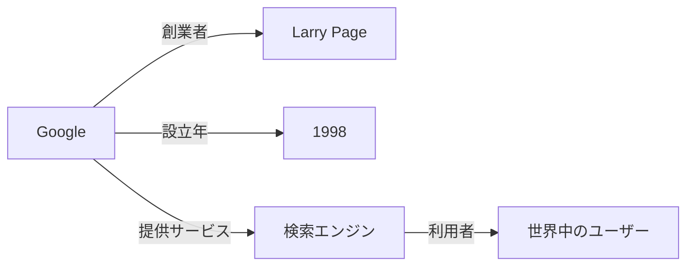

生成 AI が普及する中で、「AI は本当に理解しているのか？」という問いが生まれています。  
大規模言語モデル（LLM）は膨大なテキストをもとに言葉を生成できますが、その「意味」や「関係性」を構造的に把握しているわけではありません。  
本記事では、この課題を補う技術として注目されている「ナレッジグラフ」について解説します。

## 現在の AI の課題

現在の生成 AI は、確率的な言語モデルに基づいており、「もっともらしい回答」を出すことが得意です。  
しかし、以下のような課題があります。

- **幻覚（Hallucination）問題**：根拠のない情報を生成することがある。
- **知識の更新が困難**：学習済みモデルを再学習しない限り、新しい情報を反映できない。
- **推論の一貫性不足**：複数の文脈をまたいだ整合性を保つのが難しい。

## ナレッジグラフとは

ナレッジグラフとは、「知識」をノード（実体）とエッジ（関係性）で表現するデータ構造です。  
たとえば次のように、実世界の関係を明示的に表せます。

次の図は、複数の実体がどのようにつながっているかを示した簡単な例です。  
例えば「Google」という会社から始まり、その創業者「Larry Page」や関連するサービス「検索エンジン」までが階層的につながっていることがわかります。

このように、データ同士の「意味的なつながり」を表すことができます。  
RDF（Resource Description Framework）や OWL（Web Ontology Language）などの標準も整備されています。

RDF は、知識を「主語-述語-目的語」の三つ組（トリプル）で表現する仕組みで、これにより意味的な関係を明示的に記述できます。  
これらのトリプルは RDF ストアと呼ばれる専用のデータベースに格納され、検索や推論が可能です。  
RDF ストアは、トリプルの高速な格納・検索を実現し、SPARQL というクエリ言語を使って複雑な問い合わせを行うことができます。  
この仕組みにより、分散した情報を統合し、意味的に豊かな知識ベースを構築できます。

## ナレッジグラフの歴史と背景

ナレッジグラフの概念は、1990 年代後半から提唱された「セマンティックウェブ（Semantic Web）」の構想に端を発します。  
セマンティックウェブは、ウェブ上の情報に意味的なタグ付けを行い、機械が理解・処理できる形で知識を表現することを目指しました。

2012 年に Google が発表した「Google Knowledge Graph」は、ナレッジグラフの普及に大きな影響を与えました。  
これにより、検索結果に関連する実体やその関係性を視覚的かつ構造的に表示することが可能となり、ユーザー体験が大幅に向上しました。

その後、ナレッジグラフは単なる検索補助にとどまらず、企業内外のデータ統合基盤としても活用されるようになり、多様な分野での応用が進んでいます。

## 過去の活用事例

ナレッジグラフはさまざまな場面で活用されています。

- **Google 検索**：ユーザーの検索意図を理解し、関連する実体情報を直接提供することで、検索体験を向上させています。
- **ウィキデータ（Wikidata）**：誰でも編集可能なオープンなナレッジグラフで、構造化された知識の共有と活用を促進しています。
- **企業内ナレッジ統合**：異なるシステムやデータソースからの情報を統合し、業務効率化や意思決定支援に役立てています。
- **リコメンドエンジン**：ユーザーやアイテム間の関係性をグラフ構造で表すことで、嗜好や行動履歴から高精度な推薦を実現します。  
  Netflix や Amazon などでは、ナレッジグラフを用いて類似コンテンツの関連性を解析し、パーソナライズされた提案に活用しています。

これらの事例は、ナレッジグラフが情報の意味的なつながりを活用し、多様なデータの価値を引き出す有効な手段であることを示しています。

## ナレッジグラフが AI にもたらす価値

- **推論の透明性**：知識の関係が明示的なので、根拠を追跡できる。
- **更新性**：部分的な知識の追加・修正が容易。
- **LLM への依存が低い**：ナレッジグラフは大規模言語モデルに依存せず、モデルを更新しても知識構造への影響が少ない。
- **拡張性**：データを追加・拡張していく前提で設計されており、知識の更新や拡充に適している。
- **成熟した技術**：検索エンジンやリコメンドシステムなどで長年活用されており、信頼性の高い基盤技術として確立されています。
- **LLM との補完**：ナレッジグラフは、生成 AI とは異なる構造化知識の管理技術であり、両者を組み合わせる研究も進んでいます。  
  ただし、RAG（Retrieval-Augmented Generation）や GraphRAG のような手法とは目的や構造が異なります。  
  ナレッジグラフは、AI の知識基盤として整合性や透明性を高める役割を担います。

## まとめ

ナレッジグラフは、AI が「理解」へ近づくための基盤技術です。  
構造化された知識の上に、生成 AI を組み合わせることで、より信頼できる知的システムが実現できるでしょう。

※本記事は AI を活用して執筆しています。
