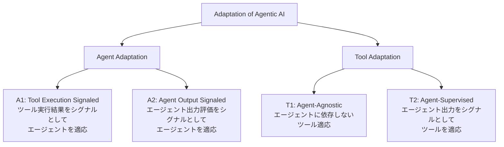
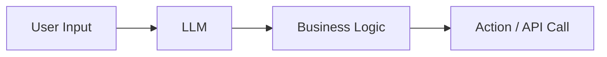
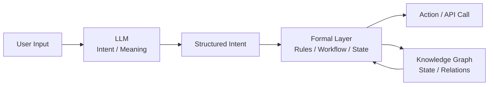
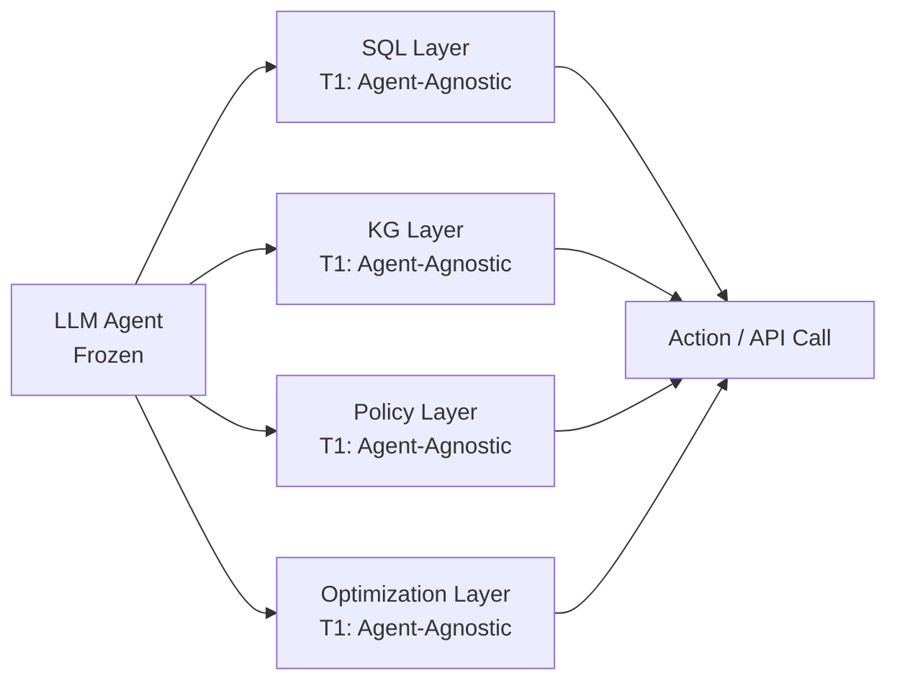
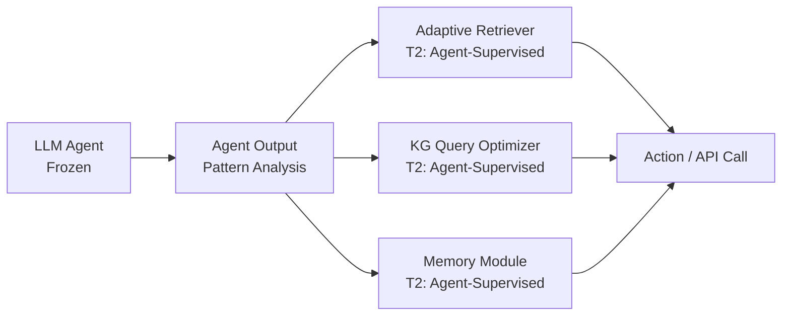
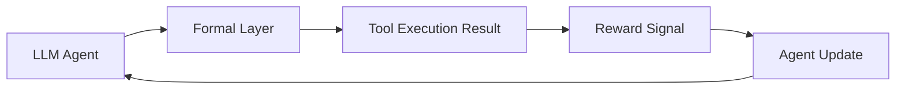
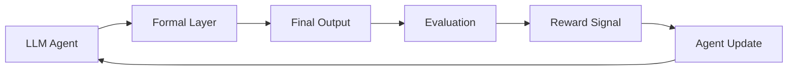
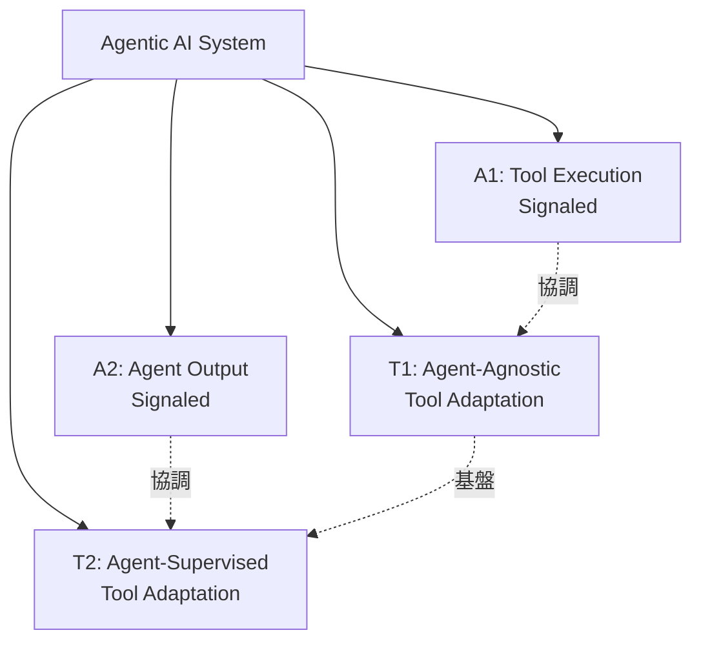
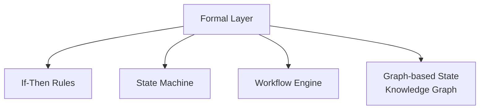
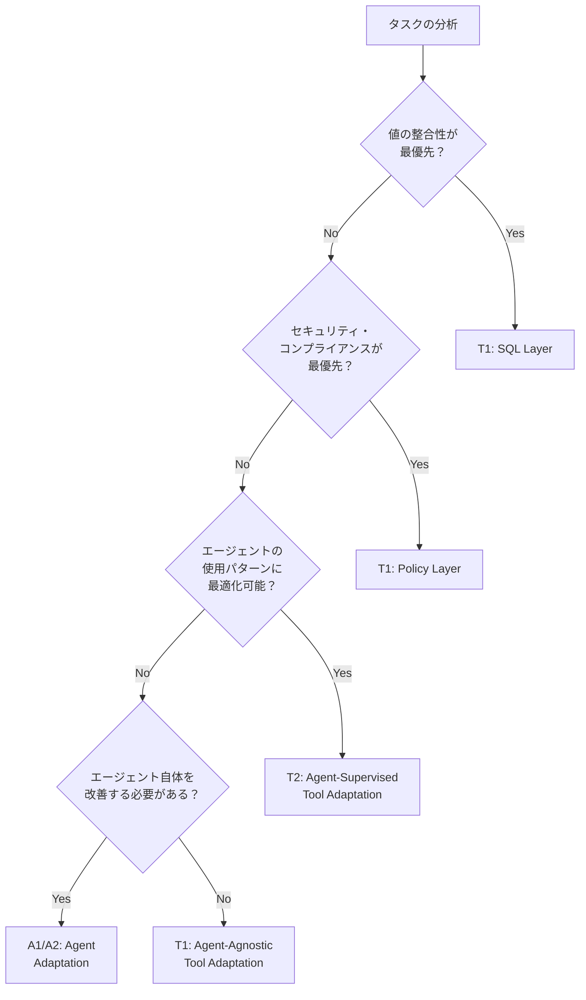

# LLM 依存度を下げる業務 AI アーキテクチャ設計

本記事では、業務 AI において **LLM の役割を意味理解に限定し、状態遷移や実行判断を形式レイヤとして分離する構成** を整理する。  
評価や思想ではなく、アーキテクチャ上の構造変化に焦点を当てる。

---

## 目次

1. [背景：Salesforce による言及](#背景salesforce-による言及)
2. [Agentic AI の適応フレームワーク](#agentic-ai-の適応フレームワーク)
3. [LLM 依存度が高い構成](#llm-依存度が高い構成)
4. [形式レイヤを分離した構成](#形式レイヤを分離した構成)
5. [形式レイヤと Tool Adaptation の関係](#形式レイヤと-tool-adaptation-の関係)
6. [Agent Adaptation と形式レイヤの協調](#agent-adaptation-と形式レイヤの協調)
7. [「決定論的自動化」を構成要素に分解する](#決定論的自動化を構成要素に分解する)
8. [実装パターンと適応戦略の選択](#実装パターンと適応戦略の選択)
9. [まとめ](#まとめ)
10. [参考文献](#参考文献)
11. [更新履歴](#更新履歴)
12. [注記](#注記)

---

## 背景：Salesforce による言及

本記事の背景として、Salesforce の経営幹部が公に言及した内容がある。

Salesforce は Agentforce を含む業務向け AI 機能について、  
**LLM に過度に依存した構成は、業務システムとしての再現性や安定性の観点で課題がある**  
という趣旨の発言を行っている。

The Information によると、"Salesforce Executives Say Trust in Generative AI Has Declined"（Dec 19, 2025）では、次のように述べられている。

> Exclusive  
> Salesforce Executives Say Trust in Generative AI Has Declined
>
> Over the past year, Salesforce CEO Marc Benioff has touted his company’s main AI product, Agentforce, as a money saver for businesses looking to automate work using the power of large language models.
>
> More recently, though, Salesforce executives have delivered a different message to customers: Agentforce sometimes works better when it doesn’t rely so much on LLMs, otherwise known as generative AI.
>
> The Takeaway
>
> - Salesforce executives now advocate less reliance on LLMs for Agentforce.
> - Trust in generative AI has declined due to LLMs’ inherent randomness.
> - Salesforce uses deterministic automation to improve Agentforce reliability and cut costs.

具体的には、生成モデルによる推論結果の揺らぎが、

- 業務フローの分岐
- 実行結果の再現
- テストや検証

といった点に影響を与える可能性があることを認めたうえで、  
**決定論的に振る舞うレイヤを明示的に分離する設計** に言及している。

本稿では、この発言内容を是非や評価として扱うのではなく、  
**アーキテクチャ上どのような構造変更を意味するのか** に焦点を当てて整理する。

## Agentic AI の適応フレームワーク

形式レイヤの分離を理解するために、まず Agentic AI における適応（Adaptation）の全体像を整理する。

近年の研究では、Agentic AI システムの適応戦略を体系的に分類するフレームワークが提案されている。  
Jiang et al. (2025) の "Adaptation of Agentic AI" では、適応を **Agent Adaptation** と **Tool Adaptation** の 2 次元で整理している。

### 4 つの適応パラダイム



#### A1: Tool Execution Signaled Agent Adaptation

ツール実行の結果（コードサンドボックスの出力、検索結果の関連度スコア、API 呼び出しの成否など）をシグナルとして、エージェントモデル自体を最適化する。

- **例**: コード実行結果が正しい場合に報酬を与えてエージェントを学習
- **特徴**: 検証可能な結果に基づく学習が可能

#### A2: Agent Output Signaled Agent Adaptation

エージェントの出力（最終回答、計画、推論過程など）に対する評価をシグナルとして、エージェントモデルを最適化する。

- **例**: 最終回答の正確性や好みスコアに基づく学習
- **特徴**: ツールを使わない場合も含む、より広範な適応

#### T1: Agent-Agnostic Tool Adaptation

エージェントから独立してツールを訓練する。凍結されたエージェントが、プラグアンドプレイ可能なモジュールとして使用する。

- **例**: 検索エンジン、ドメイン特化モデル、その他の事前訓練済みコンポーネント
- **特徴**: エージェントに依存しない汎用的なツール

#### T2: Agent-Supervised Tool Adaptation

エージェントは固定のまま、エージェントの出力から得られるシグナルを用いてツールを適応させる。

- **例**: 報酬駆動の検索エンジンチューニング、適応的リランカー、メモリ更新モジュール
- **特徴**: 特定のエージェントに最適化されたツール

### 形式レイヤとの対応関係

形式レイヤ（Formal Layer）は、このフレームワークにおいて **Tool Adaptation（T1, T2）** の文脈で位置づけられる。

- **T1（Agent-Agnostic）**: SQL、KG、ルールエンジン、制約ソルバなど、エージェントに依存しない決定論的なツール
- **T2（Agent-Supervised）**: エージェントの出力パターンに合わせて調整される形式レイヤ（例: エージェントが頻繁に参照する関係性に最適化された KG クエリ）

一方、**Agent Adaptation（A1, A2）** は、形式レイヤと協調しながらエージェント自体を改善する戦略として機能する。

## LLM 依存度が高い構成

業務 AI の初期設計では、LLM の出力をそのまま業務ロジックに接続する構成が採られることが多い。



- 推論結果がそのまま実行パスに影響する
- 中間状態が構造化されていない
- 再実行時の挙動が一定にならない

## 形式レイヤを分離した構成

LLM を意味理解に限定し、状態遷移や実行判断を外部レイヤとして分離した構成を考える。



- LLM の役割は Intent / Slot の抽出に限定される
- 状態と制約は形式レイヤ側で管理される
- ナレッジグラフは状態・関係性の参照および更新対象となる

## 形式レイヤと Tool Adaptation の関係

形式レイヤを分離した構成は、Tool Adaptation のフレームワークで整理すると理解が深まる。

### T1: Agent-Agnostic Tool Adaptation としての形式レイヤ

形式レイヤの多くは、エージェントに依存しない決定論的なツールとして設計される。



**特徴**:

- エージェントが変更されても、形式レイヤの動作は変わらない
- 複数のエージェントから再利用可能
- 決定論的な動作が保証される

**例**:

- SQL レイヤ: どのエージェントから呼ばれても、同じクエリパラメータに対して同じ結果を返す
- ポリシーレイヤ: OPA Rego ポリシーは、エージェントの種類に関係なく同じ判定ロジックを実行

### T2: Agent-Supervised Tool Adaptation としての形式レイヤ

一部の形式レイヤは、特定のエージェントの出力パターンに合わせて最適化される。



**特徴**:

- エージェントの出力パターン（頻繁に参照する関係性、よく使うクエリタイプなど）を分析
- その分析結果に基づいて形式レイヤを最適化
- エージェントの特性に合わせた性能向上が期待できる

**例**:

- 適応的リランカー: エージェントが頻繁に参照する文書タイプに重みを付けて検索結果を再ランク付け
- KG クエリ最適化: エージェントがよく使う関係性パターンに基づいてインデックスを最適化
- メモリモジュール: エージェントの会話履歴パターンに基づいて重要な情報を優先的に保持

### 形式レイヤの選択指針

| 形式レイヤの種類   | 適応戦略               | 選択指針                                                                         |
| ------------------ | ---------------------- | -------------------------------------------------------------------------------- |
| SQL Layer          | T1（Agent-Agnostic）   | 値の整合性が最優先。エージェントに依存しない決定論的動作が必要                   |
| Policy Layer       | T1（Agent-Agnostic）   | セキュリティ・コンプライアンスが最優先。エージェントに依存しない厳密な判定が必要 |
| KG Layer           | T1 または T2           | 基本的には T1。エージェントの使用パターンに最適化する場合は T2                   |
| Optimization Layer | T1（Agent-Agnostic）   | 制約充足問題の解決は数学的に決定論的。エージェントに依存しない                   |
| Retriever / Memory | T2（Agent-Supervised） | エージェントの出力パターンに合わせて最適化することで性能向上が期待できる         |

## Agent Adaptation と形式レイヤの協調

形式レイヤを分離した構成では、エージェント自体の適応（Agent Adaptation）も重要な役割を果たす。

### A1: Tool Execution Signaled Agent Adaptation

形式レイヤの実行結果をシグナルとして、エージェントを改善する。



**例**:

- SQL クエリが正しく実行された場合に報酬を与えて、エージェントのクエリ生成能力を向上
- ポリシーレイヤが許可したアクションに対して報酬を与えて、エージェントの意図抽出精度を向上

**メリット**:

- 形式レイヤの検証可能な結果に基づく学習が可能
- エージェントが形式レイヤを正しく活用する方法を学習

### A2: Agent Output Signaled Agent Adaptation

エージェントの出力（形式レイヤを経由した最終結果を含む）に対する評価をシグナルとして、エージェントを改善する。



**例**:

- 最終回答の正確性に基づく学習
- ユーザー満足度スコアに基づく学習
- 人間のフィードバックに基づく学習

**メリット**:

- エンドツーエンドの性能向上が期待できる
- 形式レイヤとエージェントの協調を改善

### 統合的な適応戦略

実践的には、複数の適応戦略を組み合わせることが多い。



**実装例**:

- **基盤**: T1 の形式レイヤ（SQL、Policy、KG、Optimization）を構築
- **最適化**: T2 でエージェントの使用パターンに合わせて一部のツールを最適化
- **学習**: A1 で形式レイヤの実行結果に基づいてエージェントを改善
- **評価**: A2 で最終出力の評価に基づいてエージェントを改善

## 「決定論的自動化」を構成要素に分解する

Salesforce はこれを _deterministic automation_ と表現しているが、  
実装上は、形式レイヤを構成する要素として分解すると理解しやすい。



- if-then ルール
- state machine
- workflow engine
- graph-based state

### 形式レイヤの実装パターン

各構成要素は、Tool Adaptation の文脈で以下のように実装される。

| 構成要素          | 実装例                            | 適応戦略             | 決定性の保証                                          |
| ----------------- | --------------------------------- | -------------------- | ----------------------------------------------------- |
| If-Then Rules     | OPA Rego, Cedar Policy            | T1（Agent-Agnostic） | ポリシー言語による厳密な判定                          |
| State Machine     | ワークフローエンジン、状態遷移図  | T1（Agent-Agnostic） | 状態遷移の数学的定義                                  |
| Workflow Engine   | Temporal, Airflow, Step Functions | T1（Agent-Agnostic） | DAG による実行順序の保証                              |
| Graph-based State | Neo4j, Amazon Neptune             | T1 または T2         | グラフクエリ言語（Cypher, Gremlin）による決定論的推論 |

## 実装パターンと適応戦略の選択

実際のシステム設計では、タスクの性質や制約に応じて適応戦略を選択する必要がある。

### 戦略選択の判断基準



### 実装パターンの例

#### パターン 1: 高信頼性が求められる業務システム

```
構成:
- T1: SQL Layer（値の整合性）
- T1: Policy Layer（セキュリティ・コンプライアンス）
- T1: KG Layer（関係性の推論）
- A1: ツール実行結果に基づくエージェント学習

特徴:
- エージェントに依存しない決定論的動作が最優先
- 形式レイヤの実行結果をシグナルとしてエージェントを改善
```

#### パターン 2: パーソナライゼーションが重要なシステム

```
構成:
- T1: SQL Layer, Policy Layer（基盤）
- T2: 適応的リランカー（エージェントの使用パターンに最適化）
- T2: メモリモジュール（会話履歴パターンに最適化）
- A2: ユーザー満足度に基づくエージェント学習

特徴:
- エージェントの出力パターンに合わせてツールを最適化
- エンドツーエンドの評価に基づいてエージェントを改善
```

#### パターン 3: 複雑な制約充足問題を含むシステム

```
構成:
- T1: Optimization Layer（制約ソルバ）
- T1: KG Layer（関係性の推論）
- A1: 制約充足結果に基づくエージェント学習

特徴:
- 数学的に決定論的な制約充足が最優先
- エージェントは制約抽出に専念し、解決は形式レイヤに委譲
```

### 適応戦略の組み合わせ

実践的には、複数の適応戦略を段階的に導入することが多い。

**段階 1: 基盤構築（T1 中心）**

- SQL Layer、Policy Layer、KG Layer、Optimization Layer を T1（Agent-Agnostic）として実装
- エージェントに依存しない決定論的動作を確保

**段階 2: 最適化（T2 の導入）**

- エージェントの使用パターンを分析
- 頻繁に使われるツール（リランカー、メモリモジュールなど）を T2（Agent-Supervised）として最適化

**段階 3: エージェント改善（A1/A2 の導入）**

- T1 の実行結果をシグナルとしてエージェントを学習（A1）
- 最終出力の評価に基づいてエージェントを改善（A2）

## まとめ

本稿では、LLM 依存度を下げる業務 AI アーキテクチャ設計について、以下の観点から整理した。

### 主要なポイント

1. **形式レイヤの分離**: LLM の役割を意味理解に限定し、状態遷移や実行判断を形式レイヤとして分離することで、業務フローの再現性や検証性を確保する。

2. **Tool Adaptation フレームワーク**: 形式レイヤは Tool Adaptation（T1, T2）の文脈で位置づけられる。

   - **T1（Agent-Agnostic）**: エージェントに依存しない決定論的なツール（SQL、Policy、KG、Optimization）
   - **T2（Agent-Supervised）**: エージェントの出力パターンに合わせて最適化されるツール（適応的リランカー、メモリモジュール）

3. **Agent Adaptation との協調**: 形式レイヤと協調しながらエージェント自体を改善する戦略（A1, A2）により、システム全体の性能向上が期待できる。

4. **実装パターンの選択**: タスクの性質や制約に応じて適応戦略を選択し、段階的に導入することが実践的。

### アーキテクチャ上の構造変化

Salesforce が言及した「決定論的自動化」は、単なる技術的改善ではなく、**Agentic AI システムのアーキテクチャ上の構造変化**を意味する。

- **従来**: LLM の出力がそのまま業務ロジックに接続される構成
- **新しい構成**: LLM は意味理解に限定し、決定論的な形式レイヤが状態遷移や実行判断を担う構成

この構造変化により、LLM を利用しながらも、業務システムとしての再現性、安定性、検証性を確保できる。

---

### 参考文献

- The Information (Dec 19, 2025), _Salesforce Executives Say Trust in Generative AI Has Declined_.
- Jiang, P., Lin, J., Shi, Z., et al. (2025). _Adaptation of Agentic AI_. arXiv preprint arXiv:2512.16301.  
  https://arxiv.org/pdf/2512.16301  
  GitHub: https://github.com/pat-jj/Awesome-Adaptation-of-Agentic-AI

### 更新履歴

- **2025-12-21** — 初版作成

### 注記

本記事は AI を活用して執筆しています。  
内容に誤りや追加情報があれば、Zenn のコメントよりお知らせください。
