# LLM 依存度を下げる業務 AI アーキテクチャ設計

本記事では、業務 AI において **LLM を形式レイヤでサンドイッチする構成** を整理する。  
Salesforce のアプローチ（固定ワークフロー重視）との違いを明確にし、ナレッジグラフが意味理解を担い、LLM に制約やコンテキストを提供する構成を提案する。  
評価や思想ではなく、アーキテクチャ上の構造変化に焦点を当てる。

## 本記事における「LLM 依存度を下げる」の意味

本記事で「LLM 依存度を下げる」とは、以下のことを意味する：

- **LLM の決定権を制限する**: LLM の出力を形式レイヤで検証し、実行可能なアクションに変換する。LLM が直接業務ロジックを決定するのではなく、形式レイヤが最終的な判断を担う
- **LLM の役割を明確化する**: LLM は推論・生成を担うが、意味理解や制約提供は KG（形式レイヤの一部）が担う。ワークフロー制御は SQL・ルール・ポリシーなどの KG 以外の形式レイヤが担う
- **再現性と検証性を確保する**: 形式レイヤによる決定論的な動作により、同じ入力に対して同じ結果が得られることを保証する

これにより、LLM を活用しつつも、業務システムとしての再現性、安定性、検証性を確保できる。

---

## 目次

1. [本記事における「LLM 依存度を下げる」の意味](#本記事におけるllm-依存度を下げるの意味)
2. [背景：Salesforce による言及](#背景salesforce-による言及)
3. [LLM 依存度が高い構成](#llm-依存度が高い構成)
4. [形式レイヤとは何か](#形式レイヤとは何か)
5. [形式レイヤを分離した構成](#形式レイヤを分離した構成)
6. [「決定論的自動化」を構成要素に分解する](#決定論的自動化を構成要素に分解する)
7. [Agentic AI の適応フレームワーク](#agentic-ai-の適応フレームワーク)
8. [形式レイヤと Tool Adaptation の関係](#形式レイヤと-tool-adaptation-の関係)
9. [Agent Adaptation と形式レイヤの協調](#agent-adaptation-と形式レイヤの協調)
10. [実装パターンと適応戦略の選択](#実装パターンと適応戦略の選択)
11. [まとめ](#まとめ)
12. [参考文献](#参考文献)
13. [更新履歴](#更新履歴)
14. [注記](#注記)

---

## 背景：Salesforce による言及

本記事の背景として、Salesforce の経営幹部が公に言及した内容がある。

Salesforce は Agentforce を含む業務向け AI 機能について、  
**LLM に過度に依存した構成は、業務システムとしての再現性や安定性の観点で課題がある**  
という趣旨の発言を行っている。

The Information によると、"Salesforce Executives Say Trust in Generative AI Has Declined"（Dec 19, 2025）では、次のように述べられている。

> Exclusive  
> Salesforce Executives Say Trust in Generative AI Has Declined
>
> Over the past year, Salesforce CEO Marc Benioff has touted his company’s main AI product, Agentforce, as a money saver for businesses looking to automate work using the power of large language models.
>
> More recently, though, Salesforce executives have delivered a different message to customers: Agentforce sometimes works better when it doesn’t rely so much on LLMs, otherwise known as generative AI.
>
> The Takeaway
>
> - Salesforce executives now advocate less reliance on LLMs for Agentforce.
> - Trust in generative AI has declined due to LLMs’ inherent randomness.
> - Salesforce uses deterministic automation to improve Agentforce reliability and cut costs.

具体的には、生成モデルによる推論結果の揺らぎが、

- 業務フローの分岐
- 実行結果の再現
- テストや検証

といった点に影響を与える可能性があることを認めたうえで、  
**決定論的に振る舞うレイヤを明示的に分離する設計** に言及している。

本稿では、この発言内容を是非や評価として扱うのではなく、  
**アーキテクチャ上どのような構造変更を意味するのか** に焦点を当てて整理する。

## LLM 依存度が高い構成

業務 AI の初期設計では、LLM の出力をそのまま業務ロジックに接続する構成が採られることが多い。

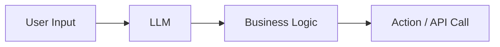

- 推論結果がそのまま実行パスに影響する
- 中間状態が構造化されていない
- 再実行時の挙動が一定にならない

## 形式レイヤとは何か

形式レイヤ（Formal Layer）の定義は、既存記事[「LLM/RAG の曖昧性を抑える『形式レイヤ』の実装ガイド」](https://zenn.dev/knowledge_graph/articles/formal-layer-llm-rag-2025-11)で詳しく解説している。

形式レイヤとは、**論理的・数学的・規則的に正しい結果を返す"決定性のある外部レイヤ"** の総称である。本記事では以下の 4 種を扱う。

- **SQL = 値レイヤ（Value Layer）**: 金額・在庫・残高などの値の整合性を保証
- **KG = 意味レイヤ（Semantic Layer）**: 関係性・推論などの意味構造を保持
- **ルールエンジン = ポリシーレイヤ（Policy Layer）**: アクセス制御・優先度判定などの判断を厳密化
- **制約ソルバ = 最適化レイヤ（Optimization Layer）**: スケジューリング・割り当てなどの制約充足問題を解決

KG は本記事では**形式レイヤの一部**として位置づける。主に LLM の意味理解を促進する **Longterm memory（長期記憶）** としての役割を持つ。Longterm memory とは、過去の会話履歴、関連エンティティ、関係性推論の結果などを永続的に保持し、LLM に制約やコンテキストを提供する仕組みである。

### 本記事における形式レイヤの用語について

本記事では、文脈に応じて「形式レイヤ」という用語を以下の意味で使用する：

- **4 種の形式レイヤ**: SQL、KG、ルールエンジン、制約ソルバの総称
- **入力側/出力側の形式レイヤ**: サンドイッチ構成において、LLM の前後で動作する形式レイヤ（主に SQL、ルール、ポリシーなど KG 以外の形式レイヤ）
- **T1/T2 としての形式レイヤ**: Tool Adaptation フレームワークにおける形式レイヤの位置づけ（T1: Agent-Agnostic、T2: Agent-Supervised）

詳細な実装方法やコード例については、既存記事[「LLM/RAG の曖昧性を抑える『形式レイヤ』の実装ガイド」](https://zenn.dev/knowledge_graph/articles/formal-layer-llm-rag-2025-11)を参照されたい。

## 形式レイヤを分離した構成

Salesforce のアプローチと、本記事で提案する構成の違いを整理する。

### Salesforce のアプローチ

Salesforce は、**LLM を意味理解に限定し、決定論的な形式レイヤが状態遷移や実行判断を担う構成**を推奨している。これは、広範なアクションのブレが許されないレイヤでの固定ワークフローを重視するアプローチである。

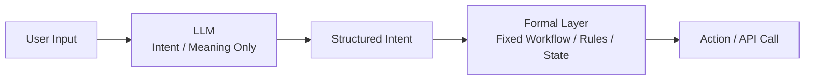

- LLM の役割は Intent / Slot の抽出に限定される
- 状態遷移や実行判断は形式レイヤ（固定ワークフロー、SQL、ルール、ポリシー）が決定論的に処理する
- アクションのブレを最小化し、再現性を最優先する

**適用場面**: 広範なアクションのブレが許されない業務フロー（例: 金融取引、医療診断、法的判断など）で、再現性と検証性が最優先される場合に適している。

### 本記事で提案する構成：LLM を形式レイヤでサンドイッチ

一方、本記事では、**LLM を形式レイヤでサンドイッチする構成**を提案する。この構成では、**KG（形式レイヤの一部）が意味理解と制約提供を担い、SQL・ルール・ポリシーなどの KG 以外の形式レイヤがワークフロー制御を担う**。

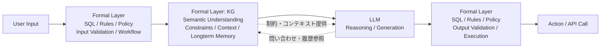

**特徴**:

- **入力側の形式レイヤ（KG 以外）**: SQL、ルール、ポリシーなどでユーザー入力を検証し、ワークフローを制御。具体的には、入力値の型チェック、アクセス権限の確認、ワークフローの状態遷移判定などを行う。KG から制約やコンテキストを取得して LLM に渡す準備を行う
- **ナレッジグラフ（KG、形式レイヤの一部）**: **意味理解**を担い、LLM に制約・コンテキスト・過去の履歴を提供。関係性推論や意味構造の管理を行う。**Longterm memory としての役割**を持ち、過去の会話履歴や関連エンティティを永続的に保持する。具体的には、顧客の契約情報、過去の会話履歴、関連するエンティティ（例: 顧客 → 契約 → プラン → SLA）などを提供する。**意味理解**とは、エンティティ間の関係性を推論し、制約（例: この顧客は Platinum プランに属する）やコンテキスト（例: 過去の会話で言及された Issue）を提供することを指す
- **LLM**: KG から提供された制約やコンテキストを活用し、人間の意図や過去の履歴を参照して新しい答えを導き出す。KG に対して問い合わせ（例: 特定の顧客の契約情報を取得）や履歴参照（例: 過去の会話で言及されたエンティティを参照）を行う。ただし、LLM の出力は形式レイヤで検証されるため、決定権が制限される
- **出力側の形式レイヤ（KG 以外）**: SQL、ルール、ポリシーなどで LLM の出力を検証し、ワークフローに従って実行可能なアクションに変換。具体的には、出力値の型チェック、ポリシー違反の検証、ワークフローの状態遷移の実行などを行う

**データフローの例**:

1. ユーザー入力「顧客 CUST-123 の SLA 優先度を教えて」
2. 入力側の形式レイヤ: 入力検証（顧客 ID の形式チェック、アクセス権限確認）
3. KG: 顧客 → 契約 → プラン → SLA の関係性を推論し、SLA 優先度を取得。過去の会話履歴も参照
4. LLM: KG から提供された情報を基に、自然言語で回答を生成
5. 出力側の形式レイヤ: 出力検証（ポリシー違反の有無、ワークフロー状態の更新）
6. アクション実行: 検証済みの回答を返す

この構成により、**KG（形式レイヤの一部）が意味理解と制約提供を担い、KG 以外の形式レイヤ（SQL、ルール、ポリシー）がワークフロー制御を担い、LLM がその制約やコンテキストを活用して推論・生成を行う**という役割分担が実現される。既存記事[「RAG を超える知識統合」](https://zenn.dev/knowledge_graph/articles/beyond-rag-knowledge-graph)や[「MCP の課題とナレッジグラフ」](https://zenn.dev/knowledge_graph/articles/mcp-knowledge-graph)で述べているとおり、KG は「意味の層（semantic layer）」として、LLM の理解力と学習能力を拡張する基盤となる。

## 「決定論的自動化」を構成要素に分解する

Salesforce はこれを _deterministic automation_ と表現しているが、  
実装上は、形式レイヤを構成する要素として分解すると理解しやすい。

### 形式レイヤの構成要素

形式レイヤは、既存記事で定義した 4 種（SQL、KG、ルールエンジン、制約ソルバ）に加えて、実装パターンとして以下の要素に分解できる。

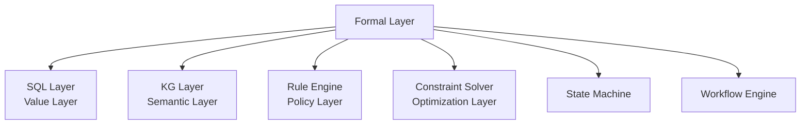

- **SQL Layer（値レイヤ）**: 金額・在庫・残高などの値の整合性を保証
- **KG Layer（意味レイヤ）**: 関係性・推論などの意味構造を保持
- **ルールエンジン（ポリシーレイヤ）**: アクセス制御・優先度判定などの判断を厳密化
- **制約ソルバ（最適化レイヤ）**: スケジューリング・割り当てなどの制約充足問題を解決
- **State Machine**: 状態遷移の数学的定義
- **Workflow Engine**: DAG による実行順序の保証

### 形式レイヤの実装パターン

各構成要素は、Tool Adaptation の文脈で以下のように実装される。

| 構成要素          | 実装例                            | 適応戦略             | 決定性の保証                                          |
| ----------------- | --------------------------------- | -------------------- | ----------------------------------------------------- |
| SQL Layer         | PostgreSQL, MySQL, SQLite         | T1（Agent-Agnostic） | ACID トランザクション、制約による整合性保証           |
| KG Layer          | Neo4j, Amazon Neptune             | T1 または T2         | グラフクエリ言語（Cypher, Gremlin）による決定論的推論 |
| If-Then Rules     | OPA Rego, Cedar Policy            | T1（Agent-Agnostic） | ポリシー言語による厳密な判定                          |
| State Machine     | ワークフローエンジン、状態遷移図  | T1（Agent-Agnostic） | 状態遷移の数学的定義                                  |
| Workflow Engine   | Temporal, Airflow, Step Functions | T1（Agent-Agnostic） | DAG による実行順序の保証                              |
| Constraint Solver | OR-Tools, Z3                      | T1（Agent-Agnostic） | 制約充足問題の数学的解決                              |

## Agentic AI の適応フレームワーク

形式レイヤの分離を理解するために、まず Agentic AI における適応（Adaptation）の全体像を整理する。

### 論文「Adaptation of Agentic AI」の位置づけ

近年、Agentic AI システムの適応戦略に関する研究が急速に拡大しているが、体系的な整理が不足していた。  
Jiang et al. (2025) の "Adaptation of Agentic AI"（arXiv:2512.16301）は、この分野を体系的に整理したサーベイ論文である。

**論文の主な貢献**:

- **統一フレームワークの提案**: Agentic AI の適応戦略を **Agent Adaptation** と **Tool Adaptation** の 2 次元で体系的に分類
- **4 つの適応パラダイムの明確化**: A1（Tool Execution Signaled）、A2（Agent Output Signaled）、T1（Agent-Agnostic）、T2（Agent-Supervised）の 4 つのパラダイムを定義
- **実装指針の提供**: 各パラダイムの強み・弱みを分析し、実装時の選択指針を提示
- **包括的なサーベイ**: 300 以上の関連研究を整理し、各パラダイムの代表的なアプローチをレビュー

このフレームワークは、形式レイヤの分離という設計判断を、より広範な Agentic AI の適応戦略の文脈で理解するための有用な視点を提供する。

### 4 つの適応パラダイム

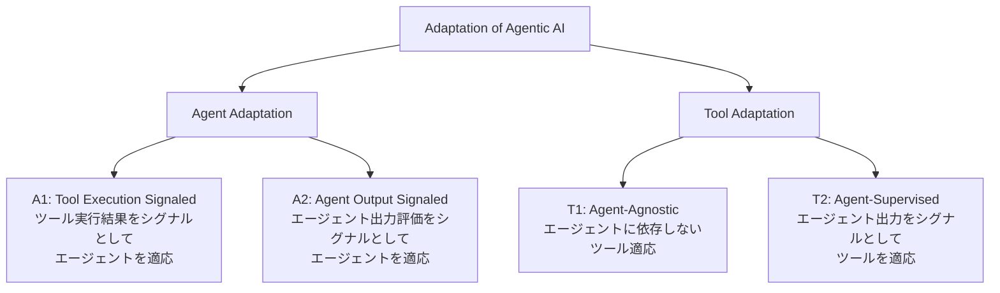

#### A1: Tool Execution Signaled Agent Adaptation

ツール実行の結果（コードサンドボックスの出力、検索結果の関連度スコア、API 呼び出しの成否など）をシグナルとして、エージェントモデル自体を最適化する。

**論文での位置づけ**: 論文では、コード実行結果、検索精度、API 呼び出しの成否など、**検証可能な結果**をシグナルとして用いる手法を A1 として分類している。

- **例**:
  - **ReAct**: コード実行結果をシグナルとして、エージェントが推論と行動を交互に行う手法
  - **Reflexion**: コード実行結果をフィードバックとして、エージェントが自己修正を行う手法
- **特徴**: 検証可能な結果に基づく学習が可能
- **形式レイヤとの関係**: 形式レイヤ（SQL、KG、ルールエンジンなど）の実行結果をシグナルとして、エージェントが形式レイヤを正しく活用する方法を学習できる。例えば、SQL クエリが正しく実行された場合に報酬を与えることで、エージェントのクエリ生成能力を向上させられる

#### A2: Agent Output Signaled Agent Adaptation

エージェントの出力（最終回答、計画、推論過程など）に対する評価をシグナルとして、エージェントモデルを最適化する。

**論文での位置づけ**: 論文では、最終回答の正確性、ユーザー満足度、人間のフィードバック（RLHF）など、**エージェントの出力に対する評価**をシグナルとして用いる手法を A2 として分類している。

- **例**:
  - **RLHF（Reinforcement Learning from Human Feedback）**: 人間のフィードバックを報酬として、エージェントを最適化する手法
  - **DPO（Direct Preference Optimization）**: 人間の好みデータを直接的に最適化する手法
- **特徴**: ツールを使わない場合も含む、より広範な適応
- **形式レイヤとの関係**: 形式レイヤを経由した最終出力の評価に基づいて、エージェントと形式レイヤの協調を改善できる。例えば、形式レイヤで検証済みの最終回答に対するユーザー満足度をシグナルとして、エージェントを改善できる。例えば、形式レイヤで検証済みの最終回答に対するユーザー満足度をシグナルとして、エージェントを改善できる

#### T1: Agent-Agnostic Tool Adaptation

エージェントから独立してツールを訓練する。凍結されたエージェントが、プラグアンドプレイ可能なモジュールとして使用する。

**論文での位置づけ**: 論文では、エージェントに依存しない汎用的なツール（検索エンジン、ドメイン特化モデル、事前訓練済みコンポーネントなど）を T1 として分類している。これらは複数のエージェントから再利用可能で、エージェントの変更に影響されない。

- **例**: 検索エンジン、ドメイン特化モデル、その他の事前訓練済みコンポーネント
- **特徴**: エージェントに依存しない汎用的なツール
- **形式レイヤとの関係**: SQL、KG、ルールエンジン、制約ソルバなどの形式レイヤは、典型的な T1 の例である。エージェントが変更されても、形式レイヤの動作は変わらない

#### T2: Agent-Supervised Tool Adaptation

エージェントは固定のまま、エージェントの出力から得られるシグナルを用いてツールを適応させる。

**論文での位置づけ**: 論文では、エージェントの出力パターンに基づいてツールを最適化する手法を T2 として分類している。報酬駆動の検索エンジンチューニング、適応的リランカー、メモリ更新モジュールなどが含まれる。

- **例**: 報酬駆動の検索エンジンチューニング、適応的リランカー、メモリ更新モジュール
- **特徴**: 特定のエージェントに最適化されたツール
- **形式レイヤとの関係**: KG クエリの最適化や、エージェントの使用パターンに基づく形式レイヤの調整は、T2 の例として位置づけられる

### 形式レイヤとの対応関係

論文のフレームワークにおいて、形式レイヤ（Formal Layer）は主に **Tool Adaptation（T1, T2）** の文脈で位置づけられる。

- **T1（Agent-Agnostic）**: SQL、KG、ルールエンジン、制約ソルバなど、エージェントに依存しない決定論的なツール。論文で言及されている「プラグアンドプレイ可能なモジュール」の典型例である。
- **T2（Agent-Supervised）**: エージェントの出力パターンに合わせて調整される形式レイヤ（例: エージェントが頻繁に参照する関係性に最適化された KG クエリ）。論文で言及されている「報酬駆動のツールチューニング」の一形態である。

一方、**Agent Adaptation（A1, A2）** は、形式レイヤと協調しながらエージェント自体を改善する戦略として機能する。論文では、これらの適応戦略を組み合わせることで、システム全体の性能向上が期待できると述べられている。

## 形式レイヤと Tool Adaptation の関係

形式レイヤを分離した構成は、Tool Adaptation のフレームワークで整理すると理解が深まる。特に、**サンドイッチ構成における入力側と出力側の形式レイヤ**は、主に T1（Agent-Agnostic）として位置づけられる。

### サンドイッチ構成と Tool Adaptation の対応関係

サンドイッチ構成（[「形式レイヤを分離した構成」セクション](#形式レイヤを分離した構成)を参照）における各レイヤは、Tool Adaptation フレームワークで以下のように位置づけられる：

- **入力側の形式レイヤ（KG 以外）**: T1（Agent-Agnostic）として位置づけられる。SQL、ルール、ポリシーなど、エージェントに依存しない決定論的なツール
- **KG（形式レイヤの一部）**: 基本的には T1（Agent-Agnostic）として位置づけられるが、エージェントの使用パターンに最適化する場合は T2（Agent-Supervised）として位置づけられる
- **出力側の形式レイヤ（KG 以外）**: T1（Agent-Agnostic）として位置づけられる。SQL、ルール、ポリシーなど、エージェントに依存しない決定論的なツール

これにより、サンドイッチ構成における形式レイヤの役割が、Tool Adaptation フレームワークで体系的に理解できる。

### T1: Agent-Agnostic Tool Adaptation としての形式レイヤ

形式レイヤの多くは、エージェントに依存しない決定論的なツールとして設計される。

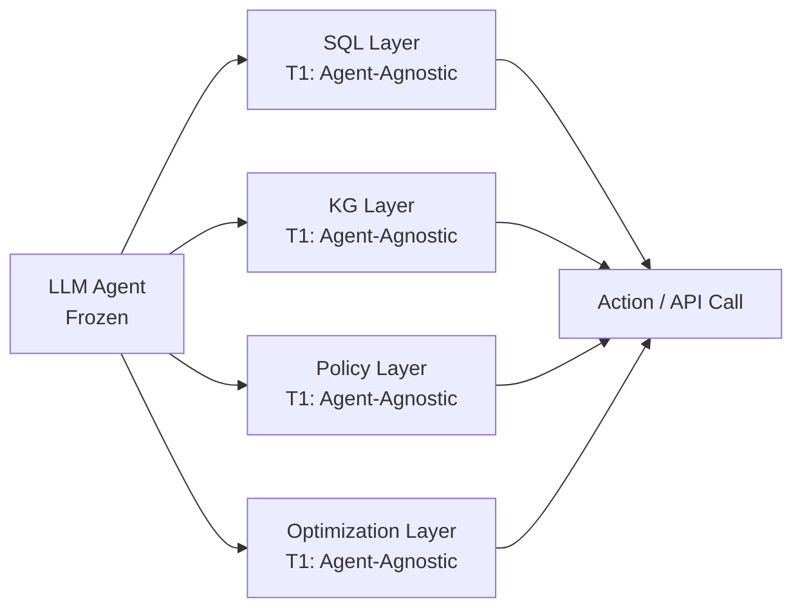

**特徴**:

- エージェントが変更されても、形式レイヤの動作は変わらない
- 複数のエージェントから再利用可能
- 決定論的な動作が保証される

**例**:

- SQL レイヤ: どのエージェントから呼ばれても、同じクエリパラメータに対して同じ結果を返す
- ポリシーレイヤ: OPA Rego ポリシーは、エージェントの種類に関係なく同じ判定ロジックを実行

### T2: Agent-Supervised Tool Adaptation としての形式レイヤ

一部の形式レイヤは、特定のエージェントの出力パターンに合わせて最適化される。

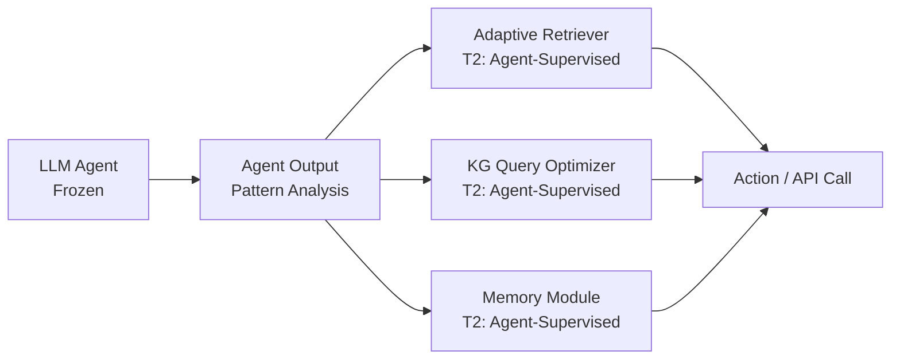

**特徴**:

- エージェントの出力パターン（頻繁に参照する関係性、よく使うクエリタイプなど）を分析
- その分析結果に基づいて形式レイヤを最適化
- エージェントの特性に合わせた性能向上が期待できる

**例**:

- 適応的リランカー: エージェントが頻繁に参照する文書タイプに重みを付けて検索結果を再ランク付け
- KG クエリ最適化: エージェントがよく使う関係性パターンに基づいてインデックスを最適化
- メモリモジュール: エージェントの会話履歴パターンに基づいて重要な情報を優先的に保持

### 形式レイヤの選択指針

| 形式レイヤの種類   | 適応戦略               | 選択指針                                                                         |
| ------------------ | ---------------------- | -------------------------------------------------------------------------------- |
| SQL Layer          | T1（Agent-Agnostic）   | 値の整合性が最優先。エージェントに依存しない決定論的動作が必要                   |
| Policy Layer       | T1（Agent-Agnostic）   | セキュリティ・コンプライアンスが最優先。エージェントに依存しない厳密な判定が必要 |
| KG Layer           | T1 または T2           | 基本的には T1。エージェントの使用パターンに最適化する場合は T2                   |
| Optimization Layer | T1（Agent-Agnostic）   | 制約充足問題の解決は数学的に決定論的。エージェントに依存しない                   |
| Retriever / Memory | T2（Agent-Supervised） | エージェントの出力パターンに合わせて最適化することで性能向上が期待できる         |

## Agent Adaptation と形式レイヤの協調

形式レイヤを分離した構成では、エージェント自体の適応（Agent Adaptation）も重要な役割を果たす。

### A1: Tool Execution Signaled Agent Adaptation

形式レイヤの実行結果をシグナルとして、エージェントを改善する。

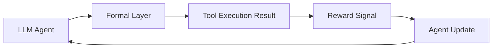

**例**:

- SQL クエリが正しく実行された場合に報酬を与えて、エージェントのクエリ生成能力を向上
- ポリシーレイヤが許可したアクションに対して報酬を与えて、エージェントの意図抽出精度を向上

**メリット**:

- 形式レイヤの検証可能な結果に基づく学習が可能
- エージェントが形式レイヤを正しく活用する方法を学習

### A2: Agent Output Signaled Agent Adaptation

エージェントの出力（形式レイヤを経由した最終結果を含む）に対する評価をシグナルとして、エージェントを改善する。

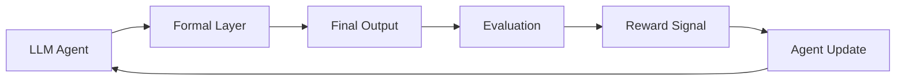

**例**:

- 最終回答の正確性に基づく学習
- ユーザー満足度スコアに基づく学習
- 人間のフィードバックに基づく学習

**メリット**:

- エンドツーエンドの性能向上が期待できる
- 形式レイヤとエージェントの協調を改善

### 統合的な適応戦略

論文では、実践的には複数の適応戦略を組み合わせることが多いと指摘されている。State-of-the-art システムでは、4 つのパラダイムを組み合わせることで最適な性能を達成している。

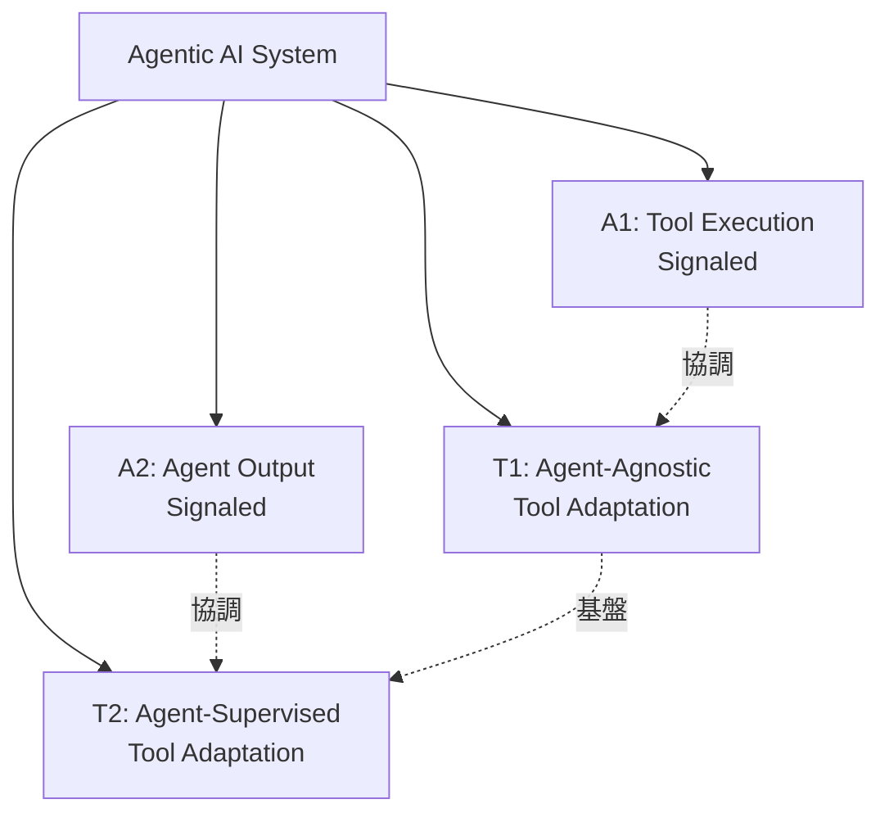

**論文で言及されている実装例**:

- **基盤**: T1 の形式レイヤ（SQL、Policy、KG、Optimization）を構築。エージェントに依存しない決定論的動作を確保
- **最適化**: T2 でエージェントの使用パターンに合わせて一部のツールを最適化。論文では、以下のシステムがこの組み合わせを採用している：
  - **DeepResearch**: 研究タスクに特化したエージェントシステム。T2 で検索エンジンを最適化し、A1/A2 でエージェントを改善
  - **AutoGPT**: 自律的なタスク実行を行うエージェントシステム。T2 でメモリモジュールを最適化し、A1 でコード実行結果をシグナルとして学習
- **学習**: A1 で形式レイヤの実行結果に基づいてエージェントを改善。コード実行結果や検索精度をシグナルとして学習（ReAct、Reflexion など）
- **評価**: A2 で最終出力の評価に基づいてエージェントを改善。RLHF や DPO などの手法が含まれる

論文では、これらの適応戦略の選択は、**監督シグナルの種類、タスク要件、システムレベルの制約**に基づいて行うべきだと述べられている。

## 実装パターンと適応戦略の選択

実際のシステム設計では、タスクの性質や制約に応じて適応戦略を選択する必要がある。

### 戦略選択の判断基準

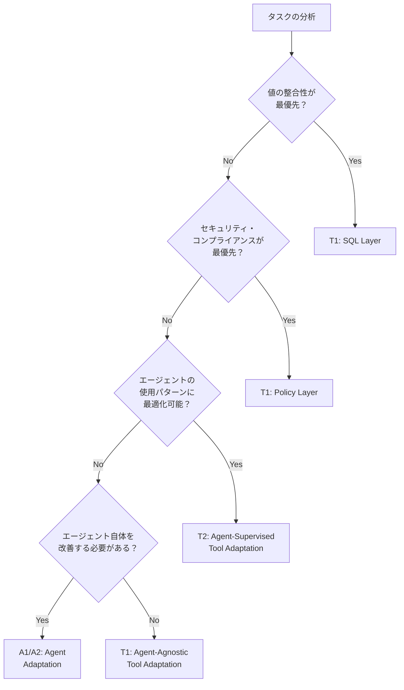

### 実装パターンの例

#### パターン 1: 高信頼性が求められる業務システム

```
構成:
- T1: SQL Layer（値の整合性）
- T1: Policy Layer（セキュリティ・コンプライアンス）
- T1: KG Layer（関係性の推論）
- A1: ツール実行結果に基づくエージェント学習

特徴:
- エージェントに依存しない決定論的動作が最優先
- 形式レイヤの実行結果をシグナルとしてエージェントを改善
```

#### パターン 2: パーソナライゼーションが重要なシステム

```
構成:
- T1: SQL Layer, Policy Layer（基盤）
- T2: 適応的リランカー（エージェントの使用パターンに最適化）
- T2: メモリモジュール（会話履歴パターンに最適化）
- A2: ユーザー満足度に基づくエージェント学習

特徴:
- エージェントの出力パターンに合わせてツールを最適化
- エンドツーエンドの評価に基づいてエージェントを改善
```

#### パターン 3: 複雑な制約充足問題を含むシステム

```
構成:
- T1: Optimization Layer（制約ソルバ）
- T1: KG Layer（関係性の推論）
- A1: 制約充足結果に基づくエージェント学習

特徴:
- 数学的に決定論的な制約充足が最優先
- エージェントは制約抽出に専念し、解決は形式レイヤに委譲
```

#### パターン 4: LLM を形式レイヤでサンドイッチする構成（本記事の提案）

```
構成:
- 入力側: T1（SQL Layer, Policy Layer）で入力検証・ワークフロー制御
- 中間: T1（KG Layer）で意味理解・制約提供・Longterm memory
- LLM: 推論・生成
- 出力側: T1（SQL Layer, Policy Layer）で出力検証・実行制御
- オプション: T2（KG Query Optimizer）でエージェントの使用パターンに最適化
- オプション: A1/A2 でエージェント改善

特徴:
- KG が意味理解と制約提供を担う
- KG 以外の形式レイヤがワークフロー制御を担う
- LLM は KG から提供された制約やコンテキストを活用して推論・生成を行う
- 人間の意図や過去の履歴を参照して新しい答えを導き出せる
- LLM の決定権が形式レイヤで制限されるため、依存度が下がる
```

**Salesforce のアプローチとの違い**:

- **Salesforce**: 固定ワークフロー重視、LLM は Intent/Slot 抽出に限定
- **本記事の提案**: KG が意味理解を担い、LLM に制約やコンテキストを提供。LLM は推論・生成を行うが、形式レイヤでサンドイッチされるため、決定権が制限される

**使い分けの判断基準**:

- **Salesforce のアプローチを選ぶ場合**: 広範なアクションのブレが許されない業務フロー（金融取引、医療診断、法的判断など）で、再現性と検証性が最優先される場合
- **サンドイッチ構成を選ぶ場合**: 人間の意図や過去の履歴を参照して新しい答えを導き出す必要がある場面（顧客サポート、ナレッジベース QA、パーソナライズされた推奨など）で、LLM の推論能力を活用しつつ、形式レイヤで決定権を制限したい場合

### 適応戦略の組み合わせ

実践的には、複数の適応戦略を段階的に導入することが多い。

**段階 1: 基盤構築（T1 中心）**

- SQL Layer、Policy Layer、KG Layer、Optimization Layer を T1（Agent-Agnostic）として実装
- エージェントに依存しない決定論的動作を確保

**段階 2: 最適化（T2 の導入）**

- エージェントの使用パターンを分析
- 頻繁に使われるツール（リランカー、メモリモジュールなど）を T2（Agent-Supervised）として最適化

**段階 3: エージェント改善（A1/A2 の導入）**

- T1 の実行結果をシグナルとしてエージェントを学習（A1）
- 最終出力の評価に基づいてエージェントを改善（A2）

## まとめ

本稿では、LLM 依存度を下げる業務 AI アーキテクチャ設計について、以下の観点から整理した。

### 主要なポイント

1. **形式レイヤの分離と LLM のサンドイッチ構成**: LLM を形式レイヤでサンドイッチすることで、入力検証・意味理解（ナレッジグラフ）・出力検証を分離し、業務フローの再現性や検証性を確保する。ナレッジグラフ（形式レイヤの一部）が意味理解と制約提供を担い、SQL・ルール・ポリシーなどの KG 以外の形式レイヤがワークフロー制御を担う。これにより、LLM の決定権が制限され、依存度が下がる。

2. **Tool Adaptation フレームワーク**: 形式レイヤは Tool Adaptation（T1, T2）の文脈で位置づけられる。

   - **T1（Agent-Agnostic）**: エージェントに依存しない決定論的なツール（SQL、Policy、KG、Optimization）
   - **T2（Agent-Supervised）**: エージェントの出力パターンに合わせて最適化されるツール（適応的リランカー、メモリモジュール）

3. **Agent Adaptation との協調**: 形式レイヤと協調しながらエージェント自体を改善する戦略（A1, A2）により、システム全体の性能向上が期待できる。

4. **実装パターンの選択**: タスクの性質や制約に応じて適応戦略を選択し、段階的に導入することが実践的。

### アーキテクチャ上の構造変化

Salesforce が言及した「決定論的自動化」は、単なる技術的改善ではなく、**Agentic AI システムのアーキテクチャ上の構造変化**を意味する。

- **従来**: LLM の出力がそのまま業務ロジックに接続される構成
- **Salesforce のアプローチ**: LLM は意味理解に限定し、決定論的な形式レイヤ（固定ワークフロー）が状態遷移や実行判断を担う構成
- **本記事で提案する構成**: LLM を形式レイヤでサンドイッチし、ナレッジグラフが意味理解を担って LLM に制約やコンテキストを提供する構成

この構造変化により、LLM を利用しながらも、業務システムとしての再現性、安定性、検証性を確保できる。

---

### 参考文献

- The Information (Dec 19, 2025), _Salesforce Executives Say Trust in Generative AI Has Declined_.  
  https://www.theinformation.com/articles/salesforce-executives-say-trust-generative-ai-declined
- Jiang, P., Lin, J., Shi, Z., et al. (2025). _Adaptation of Agentic AI_. arXiv preprint arXiv:2512.16301.  
  https://arxiv.org/pdf/2512.16301  
  GitHub: https://github.com/pat-jj/Awesome-Adaptation-of-Agentic-AI

#### 既存記事

- [「LLM/RAG の曖昧性を抑える『形式レイヤ』の実装ガイド」](https://zenn.dev/knowledge_graph/articles/formal-layer-llm-rag-2025-11)  
  形式レイヤの詳細な定義、実装方法、コード例について解説
- [「RAG を超える知識統合」](https://zenn.dev/knowledge_graph/articles/beyond-rag-knowledge-graph)  
  ナレッジグラフを意味レイヤとして扱うアプローチについて解説
- [「MCP の課題とナレッジグラフ」](https://zenn.dev/knowledge_graph/articles/mcp-knowledge-graph)  
  ナレッジグラフが意味の層（semantic layer）として LLM の理解力と学習能力を拡張する基盤となることについて解説

### 更新履歴

- **2025-12-21** — 初版作成

### 注記

本記事は AI を活用して執筆しています。  
内容に誤りや追加情報があれば、Zenn のコメントよりお知らせください。
