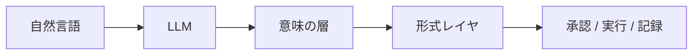

「LLM は次のトークンを予測しているだけ」。

API の課金単位にもトークンという言葉が使われます。ここでいうトークンは、人間が読む「1 文字」や「1 単語」そのものではありません。入力は Tokenizer により、よく出る文字列のかたまりに分割されます。モデルが見ているのはその並びで、次に続きそうなかたまりを確率で選んでいます。

次のトークン予測という計算系には、何が明示的に存在せず、それをシステムのどこで引き受けるべきなのか。

モデルが賢く見えるほど、状態・事実・制約・意味のつながりまでモデルに頼りたくなります。能力が上がるほど、この区別は重要になります。

エンジニア的に必要なのは、モデルの能力を見ると同時に、その計算構造が保証していないものを特定することです。

- LLM には、観測・順序・真偽・状態・反復計算について、種類の違う構造制約がある
- それらはすべて Transformer そのものの欠陥ではない。Tokenizer、Architecture、Training Objective、Inference Loop という、層の違うところから生じる
- スケールや学習でできることは増える。それでもシステムとして保証できることとは別
- 保証が必要なものは、LLM の外側に正解を置く
- 文書取得、意味構造、状態管理、実行制約は、それぞれ別のシステム責務として扱う

外側の正解は、必ずしも一つではありません。会社の SoR は種類ごとに複数あるのが普通で、データレイクできれいに一つにまとめられている例は規模が大きいほど少ないです。契約・在庫・権限・取引の状態は ERP 側に寄りやすい一方で、メールや社内チャット、お客様からの問い合わせ、会議の議事録などは別の場所に置かれていることが多いです。種類ごとに「ここを正解とする」記録を決めて、そこを見に行けば十分です。

## 1. LLM が見ている世界は文字でも単語でもない

冒頭にもトークンについて書いていますが、 LLM は文字列をそのまま処理しているわけではありません。入力は Tokenizer によってトークンへ変換され、モデルはトークン ID から得た Embedding の系列を処理します。

トークン内部の文字情報が完全に存在しないわけではありません。トークンと元の文字列には対応があるので、学習によって綴りや文字の性質を内部表現として持つことはできます。

しかし文字単位の構造は最初から明示的な基本表現として与えられていません。ある単語が複数のサブワードに分かれていても、Transformer にはトークンの中を文字列として直接見るという操作が最初から備わっているわけではありません。

そのため以下のような処理は、自然言語の生成とは性質が違います。

- 正確な文字数
- 1 文字単位の編集
- 厳密な識別子の照合
- 桁の位置に依存する計算
- 大きなファイルへの正確な修正

モデルが学習によってうまく出来るようになることはあります。それでも「できること」と「その表現形式が操作を保証していること」は違います。本番で文字単位の正確さが必要なら、コード、Parser、Schema、制約付きの出力、Validator などを使う方が安全です。

これはモデルの能力不足というより、表現と仕事の粒度が一致していないという構造上の問題です。

## 2. Attention は内容で関係づける仕組みであり、業務の状態管理ではない

Self-Attention の強さは、離れたトークン同士を、内容に基づいて直接関係付けられることにあります。

一方で、位置の情報を持たない Self-Attention だけでは、入力の並べ替えに応じて出力の並びも入れ替わる性質があります。だから実際の Transformer では、順序のための仕組みが別途入ります。代表例は次のとおりです。

- Causal Mask: 左から右へ文章を生成するとき、まだ書いていない右側の語を見ないようにするマスク。次の語を出す時点では、すでに出たトークンだけを使える
- 絶対位置の埋め込み: 「何番目のトークンか」という位置番号を、入力に足して教える
- RoPE（Rotary Position Embedding）: 位置番号をそのまま足すのではなく、トークン間の前後関係（どれだけ離れているか）を回転として埋め込む。相対的な位置関係を扱いやすくする方式
- ALiBi（Attention with Linear Biases）: Attention のスコアに「離れているほど弱くする」バイアスを足す。遠いトークンほど効きにくくして、順序・距離の感覚を入れる方式

ただし順序が入っていても、内容に基づく Attention は「いま承認済みか」「次は実行へ進んでよいか」を決まったルールで保持・更新する仕組みではありません。

例えば業務には次のような状態があります。

```text
新規 → 仕分け済 → 承認済 → 実行済
```

```text
いまの状態 = 承認済
次に進んでよい状態 = 実行済
```

この状態遷移を誰が正解として保持しているかが重要です。会話履歴から状態を読み取れることと、状態を管理していることは違います。

長く動くエージェントでは、案件の状態・Workflow・権限・実行履歴を Context Window 以外のシステムに持たせます。LLM は「承認へ進む」といった操作の候補を出し、いまの状態の正解は Workflow や Database が持ちます。

## 3. モデル内部の表現は、Database の列を書き換えるのとは違う

Transformer では、各層で前の層の計算結果に、その層の変換結果を足し込んで次へ渡します。この足し込みの流れを Residual Stream と呼びます。深いネットワークでも情報が伝わりやすくなる、強い仕組みです。

一方で、業務システムの以下のような更新とは別物です。

```text
state["ticket_status"] = "approved"
```

Database やワークフローなら、「ticket_status という欄を approved に書き換えた」と明示できます。誰が見ても、いまの値が何か、何が変わったかが分かります。

Residual Stream の中では、多くの特徴が重ねて表現されます。それがモデルの能力の源でもあります。ただ、次のような約束は持てません。

- この数値がいまの正しい案件状態である
- この値だけを更新した
- この状態遷移は許可されている
- この値は誰がいつ変えたか

長期の状態や業務上の正解は、Ticket、Database、Workflow Engine、Knowledge Graph など、更新内容を明示できる場所に持たせます。

## 4. 事前学習が直接やっているのは「次のトークン当て」

LLM の事前学習で直接やっているのは、だいたい「次に出てきそうなトークンを当てる」ことです。命題が現実世界で真かどうかを示すラベルを、学習の目的そのものにしているわけではありません。

大量の学習で、文法・概念・関係・パターン・多くの事実を内部表現として持つことはできます。それでも次のトークン予測の目的そのものには、「この命題は真である」「分からなければ棄権する」はありません。

あとから指示に従わせる学習（Instruction Tuning）、好みの答えを選ばせる学習（Preference Optimization / RLHF）、答えを別モデルで確かめる仕組み（Verifier）、途中手順を監督する学習（Process Supervision）などで大きく改善はできます。それでも「トークンの出やすさ」と「その文がどれだけ正しいと言い切れるか」は同じではありません。

「モデルが高い確率で生成した」ことと「この命題が現実世界で正しい」ことは区別しなければいけません。採用するときは、根拠の種類ごとに何を正解とするかを決めます。

| 情報                       | 主な置き場所            |
| -------------------------- | ----------------------- |
| 言語表現・一般的パターン   | LLM のパラメータ        |
| 文書中の情報               | Search / RAG            |
| Entity・Relation・意味構造 | Knowledge Graph         |
| いまの状態                 | Database / Workflow     |
| 計算結果                   | 決まった手順のツール    |
| 許可・禁止・制約           | 形式レイヤ / 社内ルール |
| 最終的な整合性             | Validator / Test        |

## 5. Temperature を下げても、業務ルールの代わりにはならない

LLM は確率分布を出します。推論ではその分布からトークンを選び続けて文章になります。いちばん確率の高い語だけを選ぶ（Greedy）、ばらつきの強さを変える（Temperature）、上位 k 個や確率の高い範囲だけから選ぶ（Top-k / Top-p）などで結果は変わります。Temperature を下げればばらつきは抑えられ、上げれば多様になります。

Temperature を 0 にすると正解が出やすくなる、と考える人もいます。実際に起きているのは、ばらつきが減って、モデルが出しやすい候補に寄りやすくなることです。出やすい候補が現実の正解である保証にはなりません。誤った内容でも、同じ誤りが繰り返し出やすくなることがあります。

たとえば次の条件は、Temperature を 0 にしても保証されません。

- 顧客 ID が実在する
- 金額が 0 以上
- 通貨が許可された種類だけ
- そのユーザーに返金権限がある

創造性も事実性も Sampling の影響を受けます。Hallucination を Sampling だけで説明し切ることもできません。

本番で優先したいのは、つまみの調整より「選べる範囲そのもの」を狭くすることです。Structured Output、JSON Schema、Constrained Decoding、Function Calling、型チェック、社内ルールのチェック、外側での検証などがその例です。

正しいものを選びそうな状態を作るのではなく、間違った操作を採用できない操作系処理を作る。

## 6. CoT は外部化した計算資源として考える

Transformer の 1 回の Forward には、有限の計算の深さがあります。多段の問題解決では、状態 → 中間結果 → 検証 → 次の状態 → 次の操作、のような反復が必要になります。

Chain of Thought が役に立つ理由の一つは、中間結果をトークン列として外に書き出し、あとからまた参照できることにあります。エンジニア的には、中間状態を書き出すことで追加の逐次計算を可能にしています。

ただし CoT で推論から出た中間結果も、トークンとして保存されている以上、現実システムの正しい情報ではありません。

```text
在庫 = 32
予約済み = 15
利用可能 = 17
```

とモデルが書いても、「利用可能在庫 17」が在庫システムの値になったわけではありません。同様に「この操作の権限があります」と推論しても、IAM や Policy Engine が許可したことにはなりません。

## 7. LLMの外側の正解は、役割ごとに置き場所が違う

外に出す対象ごとに責務が違います。文書・状態・意味・実行可否・実行本体を、同じ置き場所にまとめない方がよいです。

| 役割                 | 主に使うもの                   | 一言                                   |
| -------------------- | ------------------------------ | -------------------------------------- |
| 文書を取る           | 検索 / RAG                     | 「どの文書が関係しそうか」             |
| いまの状態・取引     | Database / Workflow            | 「いま承認済みか」                     |
| 言葉の意味をそろえる | Knowledge Graph + オントロジー | 「顧客・契約・商品・社内ルールの関係」 |
| 実行してよいかの判定 | 形式レイヤ                     | 「条件を満たせば実行可」               |
| 実際の実行           | 決まった手順のシステム         | API やデータベース更新                 |

Knowledge Graph は単なる検索インデックスではありません。Agent が「この顧客に対してこの契約と社内ルールがどういう意味関係か」を辿るときの意味の層になります。形式レイヤは意味構造といまの状態を使い、実行条件を決まった手順で評価します。



LLM は自然言語を解釈し、候補となる操作を出します。Knowledge Graph は意味を保持します。形式レイヤは制約を評価します。決まった手順のシステムが実行します。

LLM を弱くするための構造ではない。得意な仕事に集中できるようにするための構造です。

実装の進め方は [形式レイヤ実装ガイド](https://zenn.dev/knowledge_graph/articles/formal-layer-llm-rag-2025-11) と [LLM 依存度を下げる業務 AI アーキテクチャ](https://zenn.dev/knowledge_graph/articles/llm-formal-layer-architecture) に書いてあります。オントロジーがいつ必要かは [温泉トロジーで考える、オントロジーはいつ必要？](https://zenn.dev/knowledge_graph/articles/when-ontology-helps-qa) が手がかりになります。

## 8. 構造制約ごとに、外側で引き受ける役割を分ける

問題の発生源は一つではありません。

| 構造制約   | 主な発生源             | LLM 単体で起きやすいこと     | システム側の責務            |
| ---------- | ---------------------- | ---------------------------- | --------------------------- |
| 観測粒度   | Tokenizer / 入力表現   | 厳密な文字操作が不安定       | Parser / コード / Validator |
| 順序・状態 | Architecture / Context | 手順やいまの状態を推測に頼る | Workflow / 状態管理         |
| 内部状態   | 分散した内部表現       | 更新の約束を保証できない     | Database / Knowledge Graph  |
| 真偽・棄権 | Training Objective     | 流暢な誤答                   | 検索・根拠・検証            |
| 出力選択   | Decoding               | 許可されない値も出る         | Schema / 制約付き出力       |
| 多段計算   | Inference Loop         | 中間状態がトークンに閉じる   | ツール / 外の状態 / 検証    |

実際に起きているのは、確率的な言語モデルの周囲に、状態・意味・制約・検証・実行というシステムを組んでいることです。LLM が確率的だからこそ、Database や Workflow、型、監査ログといった既存の仕組みの重要性が上がっています。

## 9. 批判と過剰な擁護の間にある、設計の着地点

冒頭に書いた「LLM はただの統計だ」は半分正しいです。統計的な目的から、内部に複雑な回路や世界に対応する表現が生まれることはあります。内部表現があることと業務の正解として採用できることは異なります。Hallucination も RAG を付けただけで終わる話ではありません。

| 批判               | 過剰な擁護                   | エンジニア的な着地点                   |
| ------------------ | ---------------------------- | -------------------------------------- |
| ただの統計だ       | 創発しているから違う         | 統計的目的から複雑な内部構造は生まれる |
| 理解していない     | 内部に世界モデルがある       | 内部表現の存在と、接地した理解は別     |
| Hallucination する | RAG すれば解決する           | 事実の正解と検証を外に置く             |
| 思考していない     | Reasoning Model は考えている | 多段計算をどう実装・検証するかを見る   |
| 中身が Black Box   | Interpretability で読める    | 部分的な理解と、運用上の保証は別       |
| だから使えない     | だから人間を置き換える       | コンポーネントとして責務を限定する     |

本番で問うのは、どこまでをモデルに任せて、その出力をどの条件で採用するかです。

## 10. AI エージェントでは失敗の意味が変わる

チャットボットでは、LLM の誤りは多くの場合「間違った文章」で終わります。エージェントでは違います。モデル出力が、検索 → 判断 → API 呼び出し → 状態変更につながります。文章の誤りが、システムの変更になります。

だから「返金してよいと思います」という感想だけでは実行させられません。一方で、いつも「承認してください」で止まるエージェントも半人前です。人間が毎回承認するなら、その人間がボトルネックになります。社員がいつも「いいと思います」しか言わなければ評価は低いです。業務を自律的に行うためには以下のようなエージェントです。

- 100% 返金していいと確認できたなら、返金処理までやっておく
- どこか少しでも怪しいなら、何がどう怪しいかをまとめて承認を取りに来る

ここで区別して考えたいのはただの LLM の感想と、`refund_allowed = true` が成立することです。後者には顧客の特定、契約、商品、社内ルール、権限、上限、いまの取引状態などが関係します。LLM は自然言語から意図を読めますが、意味関係の正解、いまの状態、実行制約まで同じ確率モデルに頼ってしまうのは危険です。

```text
LLM
 ↓
「返金したい」
 ↓
意味の特定（顧客 → 契約 → 商品 → 社内ルール）
 ↓
形式レイヤ（権限 / 上限 / 状態）
 ↓
条件を満たす → 決まった手順で実行
条件を満たさない / 判断が割れる → 根拠を揃えて人に渡す
```

条件を満たせば実行し、満たせないなら根拠付きで承認を取りに行くということまでできて、初めてまともなエージェントになります。この動き自体は新入社員も同じで、「AI だから」と分けて考えるより、理想の社員の行動を言語化して AI で実装する、と考えた方が自然です。権限・追跡・元に戻す設計は [AI エージェントを本番に出せない本当の理由](https://zenn.dev/knowledge_graph/articles/kg-agent-production-safety) にまとまっています。

## 11. 次のトークンの先に置くもの

LLM は次のトークンを予測します。その単純な目的から、驚くほど複雑な能力が生まれます。ここまで見てきたのは、その能力の先に何を置くかです。

自然言語の入口と出口は LLM に任せ、文書は検索、意味のつながりは Knowledge Graph、いまの状態は Database / Workflow、実行してよいかは形式レイヤ、実行そのものは決まった手順のシステム、という分類でそれぞれのデータを適切なデータ保管技術で使い分けします。エージェントでは、文章の誤りが状態変更になるので、確かなときは実行し怪しいときは根拠を揃えて人に渡す、まで含めて境界を引きます。

「SaaS is Dead」のような言い方も見かけることがあります。シート単位のライセンスや、人が操作しやすい UI を売りにしてきた部分は形を変えていくでしょう。一方で SoR は LLM だけでは担えないレイヤです。契約・在庫・権限・取引の状態のように「ここを正解とする」記録の地位は、これからも必要です。

モデルが「できる」ことと、システムが「保証する」ことは違う。境界を消すことではなく、どこに境界を引くかです。

---

## 関連記事

| テーマ                         | 記事                                                                                                                |
| ------------------------------ | ------------------------------------------------------------------------------------------------------------------- |
| 盲信の症状と安全に使える範囲   | [LLM と RAG 盲信への警鐘](https://zenn.dev/knowledge_graph/articles/rag-warning-2025-11)                            |
| 形式レイヤの実装               | [形式レイヤ実装ガイド](https://zenn.dev/knowledge_graph/articles/formal-layer-llm-rag-2025-11)                      |
| 業務 AI の全体構成             | [LLM 依存度を下げる業務 AI アーキテクチャ](https://zenn.dev/knowledge_graph/articles/llm-formal-layer-architecture) |
| オントロジーはいつ必要か       | [温泉トロジーで考える、オントロジーはいつ必要？](https://zenn.dev/knowledge_graph/articles/when-ontology-helps-qa)  |
| 本番の権限・追跡・元に戻す設計 | [AI エージェントを本番に出せない本当の理由](https://zenn.dev/knowledge_graph/articles/kg-agent-production-safety)   |
| RAG と意味の層の区別           | [RAG を超える知識統合](https://zenn.dev/knowledge_graph/articles/beyond-rag-knowledge-graph)                        |

## 参考

- [A Survey on Hallucination in Large Language Models](https://arxiv.org/abs/2311.05232)
- 本ブログ: [LLM と RAG 盲信への警鐘](https://zenn.dev/knowledge_graph/articles/rag-warning-2025-11)
- 本ブログ: [LLM/RAG の曖昧性を抑える『形式レイヤ』の実装ガイド](https://zenn.dev/knowledge_graph/articles/formal-layer-llm-rag-2025-11)
- 本ブログ: [LLM 依存度を下げる業務 AI アーキテクチャ設計](https://zenn.dev/knowledge_graph/articles/llm-formal-layer-architecture)
- 本ブログ: [温泉トロジーで考える、オントロジーはいつ必要？](https://zenn.dev/knowledge_graph/articles/when-ontology-helps-qa)
- 本ブログ: [AI エージェントを本番に出せない本当の理由](https://zenn.dev/knowledge_graph/articles/kg-agent-production-safety)

## 更新履歴

- 2026-09-08: 初版公開

## フィードバック受け付け

本記事は AI を活用して執筆・推敲しています。誤りや補強したい点があれば Zenn のコメントでお知らせください。
