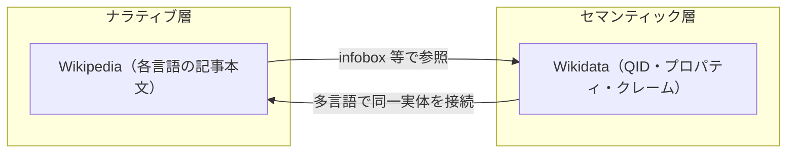

Wikipedia を読んだことはあっても、**Wikidata** という名前に馴染みがない方は多いです。Wikipedia ほど表舞台に出てこないので、知らないままでも不思議ではありません。

いまよく話題に上るのは、[Andrej Karpathy](https://karpathy.ai/) の **LLM Wiki** です。ソースを LLM に読ませ、Markdown のウィキとして育てるナラティブ中心の知識づくりとして、かなりの注目を集めています。[gist の原文](https://gist.github.com/karpathy/442a6bf555914893e9891c11519de94f) は冒頭で personal knowledge bases（個人の知識基盤）とし、利用者が選んだ生ソースと LLM が維持するウィキの二層を置くパターンを説いています。用途の例として Personal に限らず Research や Business/team（社内ウィキなど）にも触れています。index.md が moderate scale（おおよそ ~100 sources、数百ページ）で十分働くと書くなど、ベクトル検索インフラを前提としない中規模までを想定したトーンは強く、ウィキがさらに大きくなれば検索エンジンや CLI ツールが要るとも補足しています。インターネット上の議論では、企業の全ドキュメントを一枚岩で回すような文脈ではスケーラビリティが別問題になるのでは、という指摘も多く見られます。

一方で **Wikipedia** は、多言語・巨大コミュニティ・膨大な閲覧という意味で、世界規模でスケールしているウィキの代表です。同じ「wiki」と呼ぶのに、なぜ一方は実験室やチームの手の中で回り、もう一方は止まらないのか。設計を一言で切るなら、Wikipedia の画面に出てこない裏側に **Wikidata** があるからです。記事本文は言語ごとに読者向けの文章を書き分け、実体の同一性・数値・言語間の対応は Wikidata という別レイヤに寄せる。この二階建てが、スケールと正しさの運用を同時に回す前提になっています。

本稿は、プロダクトやデータ基盤の判断に近い立場のエンジニア向けに、その「裏側の地図」を一枚にまとめるものです。流れは、LLM Wiki の位置づけ → Wikidata の輪郭 → なぜ別レイヤが要るか → Wikipedia 上でどう見えるか → LLM Wiki に Wikidata 相当をどう載せるかです。

※本稿でいうナレッジグラフは、実体・関係・主張を機械が検証・照会しやすい形で持つ層の総称です。GraphRAG（検索の補強にグラフを使う手法）とは主目的が異なります。区別の整理は「[RAG を超える知識統合](https://zenn.dev/knowledge_graph/articles/beyond-rag-knowledge-graph)」を参照してください。KG の入門は「[ナレッジグラフ入門](https://zenn.dev/knowledge_graph/articles/knowledge-graph-intro)」、Docker での比較実験は「[RAG なしで始めるナレッジグラフ QA](https://zenn.dev/knowledge_graph/articles/kg-no-rag-starter)」を参照してください。

## 結論（要点）

[Andrej Karpathy](https://karpathy.ai/) の **LLM Wiki** は、ナラティブ（Markdown のウィキ）中心で知識基盤を組み立てる設計です。[gist](https://gist.github.com/karpathy/442a6bf555914893e9891c11519de94f) 上の Architecture にある schema（`CLAUDE.md` 等）は wiki の維持ルールであり、Wikipedia + Wikidata のようなセマンティック層の分離（実体 ID・プロパティ・クレームの共通基盤）そのものではありません。したがって LLM Wiki 単体（＝ gist が示すパターンにフォーカスした範囲）では、ナレッジグラフ相当（安定した実体 ID、クレームグラフ、機械可読なトリプル、矛盾の構造化など）を十分に満たさないことがあります。別リポジトリに RDF や社内ナレッジグラフを載せる構成はありえ、それはまさにセマンティック層をウィキの外に出した例です。足りない部分を別途設計する、というのが本稿の結論です。

---

## LLM Wiki：一次情報と、ナラティブ中心の強み

冒頭で触れたとおり、LLM Wiki の手順・思想は次の gist が一次情報です。

- [llm-wiki（Karpathy / GitHub Gist）](https://gist.github.com/karpathy/442a6bf555914893e9891c11519de94f)

gist では次のように三層が述べられています（英語原文からの抜粋です）。

> There are three layers: Raw sources — … The wiki — … The schema — a document (e.g. CLAUDE.md for Claude Code or AGENTS.md for Codex) that tells the LLM how the wiki is structured …

ナラティブ（説明文・ノート間のリンク）を蓄え、問いに答えるときにそれを参照する。この強みは、Obsidian などでリンクを可視化しながら人が回す用途と相性がよいです。

### gist の「三層」と Wikidata はそのまま対応しない

[gist の Architecture](https://gist.github.com/karpathy/442a6bf555914893e9891c11519de94f) では、Raw sources、The wiki（Markdown）、The schema（`CLAUDE.md` や `AGENTS.md` など）が述べられています。ここでいう schema は、wiki をどう維持するか・どんな慣例で回すかを LLM エージェントに伝える運用設計の文書に近いです。Wikipedia における **Wikidata**（実体 ID・プロパティ・クレームとして世界についての主張を束ねる）とは、箱が三つあるという点以外は同じものではありません。`CLAUDE.md` に QID のような強い識別子や型付きの関係制約があるわけでもないので、Wikidata と並べると「構造化された真実」の層としてはパワー不足、という見方もできます。

それでも、ナラティブ（人間向けの文章）だけに頼ると、LLM や他システムは毎回そこから解釈し直すことになり、同一実体かどうか・どの主張が競合するかを機械が保証する場所がありません。人が読むための説明と、機械が検証・照会・連携するための意味は、なるべく分けたいところです。その機械向けの側面を担うのがセマンティック層であり、Wikipedia ではそれが **Wikidata** です。LLM Wiki の流れを活かしつつ、企業やプロダクトで LLM・他サービスが同じ土俵で読む必要があるなら、gist の schema だけでは足りず、Wikidata 相当のセマンティック層を別途設計する、という整理になります（実装は RDF／プロパティグラフ／社内マスタなど、ドメインに合わせる）。

---

## Wikidata とは（概要）

世界規模で運用される **Wikipedia** では、記事本文だけで実体・数値・言語間リンクまで抱え込むと、運用が破綻しやすい領域が出ます。そこで文章の外に、束ねるレイヤを別に用意したのが **Wikidata** です。ざっくり言うと、役割分担は次のとおりです。

| レイヤ               | 代表                   | 何をするか                                     |
| -------------------- | ---------------------- | ---------------------------------------------- |
| ナラティブ層         | Wikipedia 各言語版   | 読者向けの文章で説明する                       |
| セマンティック層     | Wikidata               | 実体・関係・属性を構造化し、機械可読にする     |

- Wikipedia（例: 日本語版「東京」の記事）は、その言語の読者向けに段落・見出しで説明します。
- **Wikidata** は、言語に依存しない項目（アイテム）とプロパティで「誰が・何について・何を主張しているか」を格納します。各アイテムには Q 番号（例: 都市「東京」は [Q1490](https://www.wikidata.org/wiki/Q1490)）が付き、多言語の Wikipedia 記事はこの同一実体に紐づけられます。

設計上、Wikidata はざっくり次を担います（ナラティブ本文とは別枠）。

- 実体の同一性（entity identity）の管理
- 関係の構造（relation／プロパティによる接続）
- プロパティスキーマ（何について何を言えるか）
- 多言語リンクの統合（同一 QID）
- 機械可読なエクスポート（RDF 等）

公式・解説への入口は、まず次が分かりやすいです。

- [Wikidata（英語・ポータル）](https://www.wikidata.org/wiki/Wikidata)
- [Introduction to Wikidata（英語）](https://www.wikidata.org/wiki/Wikidata:Introduction)
- [Wikipedia:Wikidata（英語）](https://en.wikipedia.org/wiki/Wikipedia:Wikidata)

---

## なぜ Wikidata がないといけないか（スケールと、正しいデータの置き場）

Wikidata は「Wikipedia の付録」ではなく、構造化知識の共通基盤として設計されています。メリットが伝わりにくいのは、文章（ナラティブ）だけでも一見それっぽく見えるからです。ここでは、データの出どころと責任分界を決める側の人間にも引っかかるように、ストーリーで整理します。

### ナラティブだけだと、何が辛くなるか

Wikipedia には言語版がたくさんあります。もし人口・面積・緯度経度のような値を、各言語の記事本文にだけ書く運用だと想像してください。

- データが言語版の数だけコピーされる（＝アプリでいうと、同じカラムが何十・何百ファイルに散らばるに近い）。
- 国勢調査や境界変更で数値が変わったら、どの言語から直すか、取りこぼしがないかが運用負荷になります。
- 「東京」と「Tokyo」と「東京都」が、同じ都市を指しているかが文章だけだと曖昧になりやすいです。

つまりスケール（言語が増える・利用者が増える・更新頻度が上がる）ほど、正しい値を正しく保つコストが跳ね上がります。単一ソース・オブ・トゥルースに寄せつつ、同一実体を一意に指す識別子で束ねる、という種類の問題に近いです。

### Wikidata があると、何がラクになるか

Wikidata は、その負荷を別レイヤに逃がすための仕組みです。エンジニア向けに言い換えると、次に近いイメージです。

| 観点                   | ざっくり言うと                                                                                                                                                      |
| ---------------------- | ------------------------------------------------------------------------------------------------------------------------------------------------------------------- |
| 一か所で更新           | 人口などの「事実」を言語横断で 1 回メンテする。各言語の記事は、必要ならそこを参照する。正しさの更新が伝播しやすい。                                                |
| 実体に ID を付ける     | 各アイテムに QID（例: [Q1490](https://www.wikidata.org/wiki/Q1490)）。表記が違っても同じ主キーで束ねられる。同じものを同じものとして扱うが壊れにくい。               |
| 型とプロパティ         | 「人口」「面積」「公式サイト」などをプロパティとして分ける。文章の一行に数値が埋もれないので、何を直すべきかが構造上わかりやすい。                                   |
| 機械向けの出口         | RDF や [SPARQL](https://query.wikidata.org/) で、集計・検証・外部システム連携がしやすい。人が読む版とプログラムが読む版の役割分担になる。                          |

ここまでが、「Wikidata があることでスケールしやすくなり、正しいデータを正しく管理しやすくなる」という線につながります。  
スケールとは単に「データ量が増える」だけでなく、言語・プロジェクト・下流の利用者が増えても、更新と同一性の運用が破綻しにくいという意味です。

### Wikidata の存在理由を五つに整理する

Wikidata は Wikipedia の「補助ウィキ」ではなく、構造化知識の共通基盤として置かれています。目的をラベル分けすると、おおよそ次の五つに整理できます。

1. 構造化データの集中管理  
   生年月日・座標・国籍・人口・組織属性・外部識別子などを言語横断で一か所に寄せ、言語ごとの重複編集を減らす。

2. 多言語リンクの統合  
   同一エンティティを QID で束ねる。例: Tokyo（en）／東京（ja）／Tokio（de）はすべて [Q1490](https://www.wikidata.org/wiki/Q1490)。

3. Infobox との連携  
   Wikipedia の infobox は、人口・面積・座標・生年月日・国籍など、Wikidata を参照できる運用がある（テンプレートや言語版により差はあります）。

4. 機械可読な知識基盤  
   RDF として公開され、SPARQL、Linked Data、外部アプリケーション、知識グラフとしての探索が可能。

5. Wikimedia 全体の共通データ  
   Wikipedia 以外にも、Commons、Wikivoyage、Wikisource、Wiktionary などとデータを共有する前提がある。

「人間が読む文章」と「機械が束ねる実体・主張」の分離が、規模と多様性のなかで正しさを運用可能にするための設計です。

---

## Wikipedia は Wikidata をどう使っているか

画面を見ているだけでは分かりにくいのですが、Wikipedia には Wikidata 由来の情報が出ています。代表例は次のとおりです。

- Infobox（記事右側などの要約ボックス）の一部は、Wikidata の値を表示・同期する運用があります（テンプレートや言語版の方針により差はあります）。
- 言語間リンクは、実体ごとにまとめる仕組みとして Wikidata が使われます。同じ都市でも、英語版・日本語版・ドイツ語版の記事が同じ QID に対応します。

つまり「記事を読む」体験は Wikipedia ですが、「世界の実体を一つに束ねる」作業の多くは Wikidata 側で行われています。画面に出てくるのは主に記事本文なので、二階建ての全体像は見えにくい、という側面があります。

---

## 対応関係：LLM Wiki に「Wikidata 相当」がないとき

冒頭で述べた LLM Wiki（ナラティブ中心）と、上記の Wikipedia／Wikidata の二層を並べると、ざっくりの対応は次のようになります。先述のとおり、gist の schema（`CLAUDE.md` 等）は Wikidata の代替ではないので、下表の「Wikidata 相当」は「運用メモ」ではなく、機械可読な実体・主張の層を指します。

| 既存の二層                 | LLM Wiki 周辺での位置づけ                |
| -------------------------- | ---------------------------------------- |
| Wikipedia（ナラティブ）    | LLM が維持する Markdown ウィキに近い     |
| Wikidata（セマンティック） | 明示的に設計されていないことが多い       |

後者に相当するものがない、または弱いと、次が不足しがちです。

- 安定した実体 ID（stable entity ID。セッションや編集を超えて「同一のもの」として参照できる識別子）
- プロパティスキーマ（何を主張してよいか、型は何か）
- 型付きの関係（typed relations。曖昧な「関連」を、検証可能な関係へ）
- クレームグラフ（claim graph。主張の出典・時点をクレーム単位で持つ）
- 矛盾の整理（contradiction。競合する主張を、同一実体・同一プロパティ上で並べて扱える性質。実装としては Wikidata に限らず、本番運用でこうした整理が欲しくなるという意味合いです）
- 機械可読なトリプル構造（RDF 等へ安定して落とせる主語・述語・目的語）
- 決定論的な照会（同じ問いに対して、グラフ上の根拠パスを再現可能に取り出す）

これらはナレッジグラフの典型的な要求であり、「[ナレッジグラフ入門](https://zenn.dev/knowledge_graph/articles/knowledge-graph-intro)」で触れている意味をデータとして持つ方向と対応します。

---

## 設計上の示唆：LLM Wiki の「外」にセマンティック層を置く

LLM Wiki はナラティブ層として強力でありうる一方、前節で挙げたようなデータ面の不足があると、業務上の要求には素直には応えにくくなります。典型例は次のとおりです。

- 監査・説明責任：結論ではなく、同じ形で繰り返し示せる根拠の経路が要る
- 複数システム連携：CRM・地図・ID レジストリなどと同じ識別子でつなぐ必要がある
- ガバナンス：誰がどの主張を採用したかを、チャットではなくデータとして残す必要がある

したがって実務では、LLM Wiki をナラティブの中心にしつつ、

- 実体と関係を RDF／プロパティグラフ／オントロジーなどに載せる、
- あるいは限定ドメインから Wikidata や社内 ID にマッピングする、

といったセマンティック層を別設計する、という構成が検討対象になります。どの表現にするかは「[RDF vs Property Graph：知識グラフの二大構造を徹底比較](https://zenn.dev/knowledge_graph/articles/rdf-vs-property-graph-2025)」の論点と接続します。

### 自社・プロダクトでの切り分け（チェックリスト）

ナラティブだけで足りるか、セマンティック層が要るかを検討するときの足がかりです（すべてに「はい」が必要なわけではありません）。

1. 同一の顧客・製品・契約を、表記ゆれや文書のまたぎ越しで同じ ID として扱う必要があるか。
2. 数値・日付・関係を、文章ではなくプロパティとして更新・監査したいか。
3. LLM 以外のシステム（検索、BI、CRM、地図）が、API やクエリで同じ意味にアクセスする必要があるか。
4. 矛盾やバージョンを、チャットログではなくデータとして残し、誰がどの主張を採用したか説明する必要があるか。
5. 規制・説明責任の観点から、根拠の経路を何度も同じ形で示す必要があるか。

ここで複数が「はい」に近いほど、Wikidata 型のセマンティック層（またはそれに相当する社内 KG）の検討余地が大きくなります。

逆に、個人のメモや読書ノート、数日で捨てる試作（PoC）、監査要件が軽い調査メモのように、長期の同一性やシステム連携が主題でない場合は、ナラティブ中心のままで十分なことも多く、セマンティック層は過剰になり得ます。要件に合わせて選ぶ、という立場です。

---

## まとめ

- gist の三層（raw／wiki／schema）だけでは Wikipedia + Wikidata 型のセマンティック分離は置き換わらない。単体（gist パターンにフォーカスした範囲）では KG 相当が不足しうるが、ウィキ外に RDF／社内 KG を載せるのは、セマンティック層を足す一例になる。
- Wikipedia は Wikidata によって裏側から束ねられ、スケールと機械可読性を両立している。Wikidata が担う五つの目的や、画面での見え方は、本文の該当節を参照。
- 自社での判断は、本文のチェックリストと、対応関係・設計上の示唆の節を手がかりにするとよい。

---

## 参考文献・リンク

- Karpathy, A. [llm-wiki（GitHub Gist）](https://gist.github.com/karpathy/442a6bf555914893e9891c11519de94f)
- [Wikidata](https://www.wikidata.org/wiki/Wikidata)
- [Introduction to Wikidata](https://www.wikidata.org/wiki/Wikidata:Introduction)
- [Wikipedia:Wikidata](https://en.wikipedia.org/wiki/Wikipedia:Wikidata)
- Vrandečić, D., & Krötzsch, M. (2014). [_Wikidata: A free collaborative knowledgebase_](https://doi.org/10.1145/2629489). Communications of the ACM, 57(10).

---

## 注記

本記事の執筆に AI を活用しています。Wikipedia／Wikidata の挙動は言語版・テンプレート・時点で差があるため、最新のコミュニティ文書と画面で確認してください。LLM Wiki の前提や範囲については、[Karpathy の gist](https://gist.github.com/karpathy/442a6bf555914893e9891c11519de94f) が一次情報です。gist は更新されることがあるため、転載や社内資料に使うときは、参照した日付と該当箇所をメモしておくと安全です。

---

## 更新履歴

- 2026-04-05: 初版公開

---

## フィードバック受け付け

Wikidata の説明の正確性、LLM Wiki の解釈、Obsidian のリンクグラフとセマンティック KG の境界、あるいは GraphRAG との切り分けについて、誤りや補足があれば Zenn のコメントでお知らせください。
