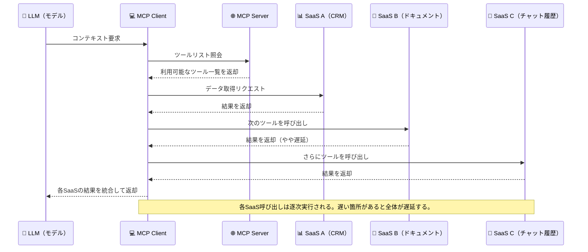
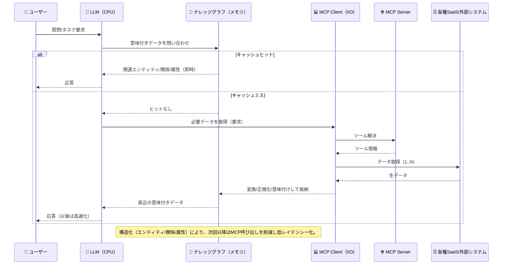

# MCP の課題とナレッジグラフ ──「USB-C」化する AI 接続と、意味をつなぐ記憶層

MCP は AI エージェントの「USB-C 化」を進めるプロトコルですが、同時にスケーラビリティと意味統合の課題も抱えています。本記事では、その技術的背景とナレッジグラフによる解決アプローチを解説します。

> 本稿では、MCP（Model Context Protocol）の実運用でよく起きる課題（呼び出し過多、429 レートリミット、レイテンシー、野良 MCP によるセキュリティリスク）を整理し、ナレッジグラフを「意味のあるキャッシュ＝記憶層」として位置づける設計を提案します。

---

## MCP とは何か ──「USB-C for AI」と呼ばれる理由

MCP は、LLM（大規模言語モデル）やエージェントが外部のツールやデータソースに**統一的なインターフェース**でアクセスできるようにするオープンな接続プロトコルとなります。個別 API の実装を最小化し、拡張可能な「ツール」単位で外部機能を呼び出せる点が魅力です。一方で、「つながる」ことと「すぐ活用できる」ことは必ずしも一致しません。

---

## MCP の課題

### 呼び出し過多とレートリミットの課題

MCP や API を通して**毎回**外部システムからデータを取得する設計は、HTTP 429（Too Many Requests）の誘発や、ネットワーク・認証・変換のオーバーヘッドによる**レイテンシー増大**を招きやすいです。多くの実装ではツール呼び出しが**基本的に直列（逐次）実行**となるため、どこか 1 つが遅いだけで全体が遅くなるという問題が起きます。  
MCP 自体は並列実行を妨げてはいませんが、主要 SDK では現時点で直列実行が標準であり、非同期 API 対応は提案・実装途上にあります。

下図は、MCP の基本フローと直列ツールコールによる待ち時間の発生を示すシーケンスです。

### 野良 MCP とアクセス集中のリスク

現在の MCP エコシステムでは、開発者が自らツールや SaaS を MCP サーバ化し公開する動きが急増しています。ここで言う「野良 MCP（非公式 MCP サーバ）」とは、認証や運用ガイドラインが明確でないサーバを指します。  
その結果、**野良 MCP（非公式または未検証のサーバ）**の数が増え、サービス提供者の想定を超えたアクセスが発生するケースも見られます。  
SDK やオープンソース実装が拡大し、誰でも短時間で MCP サーバを構築できるようになったことが背景にあります（例：Anthropic の MCP SDK、USDM レポートによる数千の公開 MCP サーバ記録など）。

このような状況のため、**SaaS 提供者側も無制限の MCP アクセスを許可することは難しく**、レートリミットや API 制限は不可避となっています。  
アクセス過多はシステム負荷やコスト、さらにはセキュリティリスクにも直結するため、**「安定した運用のための制限」**として設計されているのが実情です。  
その結果、ナレッジグラフのような**意味付きキャッシュ層を設け、再取得を最小限にする構成**が、MCP 時代の現実的なアプローチとして注目されています。

こうしたアクセス過多や制限の背景には、取得されたデータがそれぞれ独立した構造を持ち、**意味的に統合されていない**という構造的な課題も存在します。  
つまり、アクセス集中の背景には、個別の MCP サーバが共通スキーマを持たないまま接続され、データが相互に結びつかないという構造的問題も関係しています。

---

## LLM・MCP・ナレッジグラフの関係：CPU とメモリの比喩

- **LLM は CPU**：推論・計算を担い、一時的なキャッシュを内部に持ちます。
- **MCP は I/O バス**：外部システムとやり取りする汎用の接続レイヤーです。
- **ナレッジグラフはメモリ**：取得したデータを**意味付け**して保持し、再利用性を高めます。

MCP で「毎回呼び出す」設計は、CPU が逐一ストレージにアクセスするのに近く、**効率も安定性も悪化**しがちです。ナレッジグラフを**意味のあるキャッシュ（記憶層）**として挟むことで、レートリミットやレイテンシーの課題を緩和し、同じ知識を複数アプリ／複数モデルで再利用できます。

以下は、ナレッジグラフを介した**ヒット時は即応答、ミス時は MCP 経由で取得 → 意味付けして格納 → 以後高速化**という流れを表した図です。

---

## 複数システムをつなぐ時代の「意味設計」

企業システムは CRM、ERP、ドキュメント、チャット履歴など多様です。MCP は**接続**を簡素化しますが、**理解**にはスキーマ設計と関係性の明示が必要です。ナレッジグラフでは、

- エンティティ（例：顧客、案件、ドキュメント、担当者）
- 属性（例：更新時刻、出典、権限）
- 関係（例：所有、参照、履歴、添付）

を定義し、**「何が、誰に、どうつながるか」**を表現します。これにより、MCP で接続しただけのデータが「単なる取得対象」から「意味のある知識」へと格上げされます。

さらに重要なのは、**異なる SaaS から取得したデータが“意味的に繋がるか”**という点です。  
例えば、CRM の「顧客 ID」、ドキュメント管理の「ユーザー ID」、チャット履歴の「発信者 ID」が、それぞれ別スキーマであった場合、これらを「同じ顧客／人物」としてモデルやグラフ上で扱えるように**スキーママッチングやエンティティアライメント**などの処理が必要になります。 ([milvus.io](https://milvus.io/ai-quick-reference/what-is-schema-matching-in-knowledge-graphs?utm_source=chatgpt.com))

代表的な手法として、  
(1) 異スキーマ間の同義エンティティや属性をマッチングする、  
(2) データソースごとに統一スキーマへのマッピングルールを定義する、  
(3) スキーマ変化に対応できるナレッジグラフ構築手法を採る、  
といったアプローチがあります。 ([arxiv.org](https://arxiv.org/abs/2112.07493?utm_source=chatgpt.com))

しかし、これらはいずれも実務的には「管理コストが大きい」「自動化精度が十分でない」「ソースが多く・更新頻度が高いほど困難が増す」という落とし穴を持っています。  
つまり、**ただ MCP でデータを取得するだけでは“繋がる知識”にはならない**のです。

この観点から、ナレッジグラフは「取得したデータを構造化し、関係性・意味を付与して保管する」役割を果たすため、MCP 接続＋ナレッジグラフ設計という二段構えの重要性がより明らかになります。

---

こうしたアクセス集中やレートリミットを抑えるためには、実運用上でのキャッシュ戦略の設計が欠かせません。

## MCP にキャッシュ機構はあるか？

結論から言うと、**ツール呼び出し結果のキャッシュは MCP 仕様で必須ではありません**。キャッシュの有無・方式は**クライアント実装／サーバ実装次第**です。

- **プロトコルの位置付け**：MCP は JSON‑RPC でツール呼び出し等のメッセージ形式を定義しますが、**結果キャッシュの標準ルール（Cache‑Control、TTL 等）は規定していません**。
- **一部ランタイムの最適化**：たとえば、ランタイムが `tools/list` の結果（利用可能ツール一覧）を**セッション中のコンテキストにキャッシュ**して再取得を抑制する最適化はありますが、**ツール出力（ビジネスデータ）の汎用キャッシュ**は前提ではありません。
- **コミュニティの動向**：サーバから**キャッシュ可能性/TTL ヒント**を返す提案や、**長時間/非同期タスク**の標準化議論が進行しています（将来、共通パターンが整う見込み）。

### 推奨設計（本稿の主張）

- **ナレッジグラフを「意味のあるキャッシュ（記憶層）」として使う**：
  - キー設計（エンティティ ID ＋バージョン/更新時刻）、TTL/新鮮度、出典（プロヴェナンス）を属性として保持。
  - キャッシュヒット時は KG から即回答、ミス時は MCP で取得 → 正規化 →KG 格納のループにする。
- **変更検知と無効化**：SaaS 側の Webhook/更新時刻で**差分取得**し、関連ノードの再計算/無効化を行う。
- **監査と安全性**：キャッシュヒット率/429 率/平均レイテンシーを可視化し、野良 MCP や低信頼データソースを**KG 上で低信頼ノード**として管理。

> 要するに、「毎回コール」ではなく、**“意味付きキャッシュとしての KG”＋“必要時のみ MCP”**の 2 段構えが、コスト・SLA・信頼性の面で現実解です。

## まとめ

- **MCP でも API でも**、毎回の外部コールはレートリミットとレイテンシーの観点で不利になりがちです。
- **ナレッジグラフ**を「意味のあるキャッシュ（記憶層）」として設け、取得データを構造化して再利用可能にすることが鍵です。
- **LLM（CPU）× MCP（I/O）× ナレッジグラフ（メモリ）**という分業で、安定性・再現性・スピードを両立できます。

---

### 参考文献

- [Anthropic (2024), _Introducing the Model Context Protocol_（MCP SDK および開発者向け設計）](https://www.anthropic.com/news/model-context-protocol)
- [USDM (2024), _The Model Context Protocol in Life Sciences_（公開 MCP サーバ数と開発者動向）](https://usdm.com/resources/blogs/the-model-context-protocol-mcp-in-life-sciences)
- [TechRadar (2024), _The 4 most critical aspects of MCP for developers_（開発者主導の普及背景）](https://www.techradar.com/pro/the-4-most-critical-aspects-of-model-context-protocol-mcp-for-developers-building-ai-native-architectures)
- [Prompt Security (2024), _Top 10 MCP Security Risks_（野良 MCP・ツールポイズニングのセキュリティリスク）](https://www.prompt.security/blog/top-10-mcp-security-risks)
- [Milvus.io (2023), _What is schema matching in knowledge graphs?_（スキーママッチングの基礎解説）](https://milvus.io/ai-quick-reference/what-is-schema-matching-in-knowledge-graphs?utm_source=chatgpt.com)
- [ArXiv (2021), _Declarative Mapping Languages for RDF Data_（スキーママッピング手法に関する調査）](https://arxiv.org/abs/2112.07493?utm_source=chatgpt.com)

### 更新履歴

- 2025-10-28 — 初版公開

### 注記

本記事は AI を活用して執筆しています。
内容に誤りや追加情報があれば、Zenn のコメントよりお知らせください。

