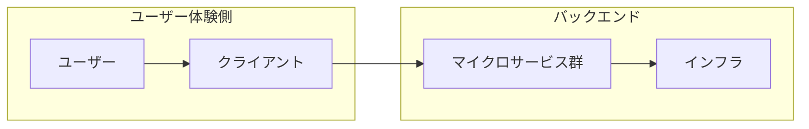

※本記事は、**観測・運用ドメインにオントロジーを敷いたナレッジグラフ**（E2EGraph）を扱います。GraphRAG など検索拡張目的のグラフとは用途が異なります。詳しくは「[本ブログの関連記事とのつながり](#本ブログの関連記事とのつながり)」を参照してください。

---

## はじめに

2026 年 3 月、英国ロンドンで開催された **QCon London 2026** において、Netflix のエンジニアによる次のセッションが行われました。

**Ontology‐Driven Observability: Building the E2E Knowledge Graph at Netflix Scale**

本稿では、**QCon 公式ページに掲載されたアブストラクト**および **InfoQ の会議レポート**を主な情報源として、公開情報の範囲で内容を整理します。**投資判断・ROI・自社導入の手順**までは扱いません。現時点では公式ページ上で**動画・スライドは未公開**です。後日公開された場合は、記述の精度を高めるために追記・修正する余地があります。

セッションでは **AutoSRE**（複数エージェントとグラフを組み合わせた運用支援）や将来の予測・自己修復にも触れられており、生成 AI／エージェントと**意味層（オントロジー＋ナレッジグラフ）**がどう接続するかという視点でも読めます。

本ブログでは、ナレッジグラフを **LLM の外側の意味層**として捉える立場を一貫して説明しています。本件はその立場の**大規模運用・Observability**における実例として読むことができます。既存記事との対応関係は、後述の「[本ブログの関連記事とのつながり](#本ブログの関連記事とのつながり)」にまとめました。

---

## Netflix における「別のナレッジグラフ」との関係

Netflix はこれまでにも、コンテンツ推薦などを支える **Entertainment Knowledge Graph** や、**UDA（Unified Data Architecture）** に関する技術ブログを公開しています。いずれも RDF／SHACL 等に触れた**データ統合・表現の哲学**に関する文脈であり、本稿の E2EGraph（E2E Observability 向け）と**同一システムの説明ではありません**。ただし、「意味をモデル化し、組織やシステムをまたいで一貫性を持たせる」という**方向性の参照**として読み進めることはできます。

- [Unlocking Entertainment Intelligence with Knowledge Graph](https://netflixtechblog.medium.com/unlocking-entertainment-intelligence-with-knowledge-graph-da4b22090141)（Tech Blog）
- [Model Once, Represent Everywhere: UDA (Unified Data Architecture)](https://netflixtechblog.com/model-once-represent-everywhere-uda-unified-data-architecture-at-netflix-6a6aee261d8d)（Tech Blog）

初歩的なナレッジグラフの説明は「[ナレッジグラフ入門](https://zenn.dev/knowledge_graph/articles/knowledge-graph-intro)」も参照してください。同記事では Netflix をリコメンド文脈で触れていますが、本稿の E2EGraph は**用途とドメインが異なる別系統**です。

国内企業の因果推論・実装事例を網羅している「[国内企業の AI × ナレッジグラフ活用事例](https://zenn.dev/knowledge_graph/articles/kg-japan-case-studies)」は、地域とドメインは違えど、**オントロジー設計と前処理が成果を左右する**という点で本件と比較対照になります。

---

## 背景：E2E Observability が「データ問題」になる理由

Netflix の規模では、クライアント（数百種類のデバイス）からバックエンド（多数のマイクロサービスとインフラ）まで、**ユーザー体験（QoE）とシステム挙動の因果**をつなぐことが難しくなります。メトリクス・ログ・トレースはシステム境界ごとに分断され、「この劣化はクライアントか、ネットワークか、依存バックエンドか」と答えるのが遅く、壊れやすい、という問題意識がアブストラクトで述べられています。

この文脈で紹介されているのが **E2EGraph（End-to-End Knowledge Graph）** です。単なるダッシュボードの統合ではなく、**体験とインフラを一つのつながったグラフとしてモデル化する**アプローチです。

ここでの本質は、サイロ化したメトリクスやログを「つなぎ直し」、**問いに対して論理構造に沿ってたどれる状態**にすることです。Netflix の事例は、**「たどり方」をオントロジーで固定する**という発想を、クライアントからインフラまでの**因果・横断調査**に拡張したイメージとして位置づけられます。

「ベクトル検索が苦手・グラフクエリが得意な問い」を小さなデータセットで確認したい場合は「[RAG なしで始めるナレッジグラフ QA](https://zenn.dev/knowledge_graph/articles/kg-no-rag-starter)」も参照してください（検証用の最小例であり、セッション規模とは桁が異なります）。

---

## E2EGraph の考え方

アブストラクトによれば、ユーザ体験を **ユーザー・クライアント・サービス・インフラ**およびそれらの相互作用からなる**接続グラフ**として表します。視聴セッションごとに多数のノードとエッジが生じうる、大規模なグラフである点も強調されています。

アブストラクトの説明をもとに補足すると、ノードにはユーザセッション、クライアントアプリ、マイクロサービス、ネットワーク要素などが含まれ、エッジにはリクエスト・ユーザ操作・依存関係が載り、レイテンシ、エラー率、QoE への影響、バージョン、地理情報などの属性が付与される、というイメージです。

（図は概念的なレイヤー構造のみを示す。エッジへの属性付与や双方向の依存関係は省略）

---

## オントロジーの役割

セッションでは、**ドメイン向けのオントロジー**（正式な型・プロパティ・関係の仕様）によって、観測データを正規化し、スタック全体で**一貫した意味づけと推論**を可能にすることが焦点の一つになっています。

アブストラクトで例示されている概念には、たとえば次のようなものがあります（表記は英語のまま）。

- User Session
- API Call
- Deployment Event
- Experimentation（A/B テスト等）
- QoE Regression

さらに、異種データ（クライアントテレメトリ、サーバログ、トレース、インフラメトリクス、実験、デプロイメント等）を取り込み、観測用に**統一オントロジー**へ正規化するデータエンジニアリング上の課題が述べられています。劣化時点でのグラフのスナップショットを保持し、「健全」と「劣化」の状態を時間軸で比較する、という設計も言及されています。

InfoQ のレポートでは、オントロジーを**型・プロパティ・関係の形式的な仕様**として紹介し、**Triple（主語・述語・目的語）**で事実を表す例が示されています。また、運用系の知識が複数の名前空間に散在しうる状況と、オントロジーが**機械可読な構造**として秩序を与える、という説明が要約されています。

Triple を中心にした表現と、プロパティグラフとの使い分けは「[RDF vs Property Graph：知識グラフの二大構造を徹底比較](https://zenn.dev/knowledge_graph/articles/rdf-vs-property-graph-2025)」で整理しています。本稿の E2EGraph が最終的にどちらの実装スタイルかは公開情報からは断定できませんが、**意味を契約として固定する**という点では、同記事で述べる RDF 系の設計思想と通じる部分があります。

なお、複数ツールや SaaS を MCP 等で**その場結合**するだけでは、共通スキーマがなく分析の信頼性が落ちやすい、という問題意識は「[MCP の課題とナレッジグラフ](https://zenn.dev/knowledge_graph/articles/mcp-knowledge-graph)」で述べています。Netflix が**統一オントロジー**を Observability の中心に据えたのは、「接続」と「意味の一貫性」を同時に満たす方向性としての**一つの対比**として読めます（MCP そのものの採用を語ったものではありません）。

---

## AutoSRE とロードマップ（アブストラクトより）

アブストラクトでは、このグラフの上に **AutoSRE**（自動根本原因分析を目指す仕組み）を構築していることが述べられています。概要は次のようなイメージです。

- **コーディネータエージェント**が、自然言語に近い問い（例：特定 UI の指標がなぜ劣化したか）をサブタスクに分解する。
- **専門エージェント**（メトリクス、アラート、実験、クライアントプラットフォーム、デプロイ／イベント等）が、**共有オントロジーを通じて**グラフを問い合わせる。
- コーディネータが結果を統合し、**最もありそうな根本原因**を提案する。

将来像としては、グラフ上のパターン学習による**問題の予測**や、検知・予測に基づく**自己修復**（ロールバック、トラフィックシフト、フラグ変更、キャパシティ調整等）への発展も言及されています。

**どこまでがルール・グラフクエリ・オントロジー上の推論で、どこからが（言及されている）学習モデルやエージェントの生成・分類か**は、現時点の公開情報だけでは切り分けができません。録画・スライド・追記公開があれば、補足しやすくなります。

コーディネータと専門エージェントにタスクを分ける構成は、エージェントの役割分担を整理した「[AI 解像度の高いエンジニア向けの AI エージェント分類](https://zenn.dev/knowledge_graph/articles/ai-agent-classification-for-engineers-2026)」で扱う階層イメージとも接続できます。通信プロトコルより手前に、**共有グラフとオントロジーという意味の契約**がある、という読み方です。より経営レポートとの対応で「学習と統合の土台」としてナレッジグラフを位置づける議論は「[「GenAI Divide」とナレッジグラフ](https://zenn.dev/knowledge_graph/articles/genai-divide-knowledge-graph)」も参照してください。

---

## 経営・導入で論点になりやすいこと（検討起点の整理）

公開情報に基づく技術紹介にとどめますが、オントロジー駆動の観測基盤を検討する際には、次のような論点がよく挙がります。以下は**正解の列挙ではなく、検討の観点として読める**整理です。

- **オントロジーは資産であると同時に、保守コストの中心**になる。ドメイン変更・組織変更に追随するガバナンス（誰が概念を承認するか）が、クエリ性能と同じくらい効くことがある。
- **パイロットでは「クエリが通ること」より、ステークホルダー間の概念合意**がボトルネックになりやすい、という報告はオントロジー系プロジェクトで一般的です（本セッション固有の主張ではありません）。
- **投資対効果**は、インシデント短縮・誤検知削減・実験影響の説明責任など、組織の KPI に結びつけて設計することが多い。

---

## 設計上の留意点（公開情報の範囲）

ソースがアブストラクト中心のため、次のような**一般的な論点**に触れるだけにします。Netflix 固有の設計・数値は、公開が増えた段階で追記の候補です。

- **データの鮮度・完全性・権限境界**（誰がどのサブグラフを参照できるか）。観測系グラフはセキュリティ・コンプライアンスと直結しやすい。
- **グラフのスキーマ進化**（後方互換、マイグレーション、ダブルライト等）。E2E でノード種が増えるほど、変更管理が重くなる。
- **誤った因果の提示**（相関と因果の混同、観測バイアス）。AutoSRE の提案は、運用上は人間の検証プロセスとセットで設計されることが多い、という留意です。

---

## 本ブログの関連記事とのつながり

| 観点                           | 本件（Netflix / QCon）で触れること               | あわせて読む記事                                                                                                                                                                                                        |
| ------------------------------ | ------------------------------------------------ | ----------------------------------------------------------------------------------------------------------------------------------------------------------------------------------------------------------------------- |
| RAG／GraphRAG と KG の違い     | 本稿は検索拡張ではなく、運用知識の統合と因果追跡 | [RAG を超える知識統合](https://zenn.dev/knowledge_graph/articles/beyond-rag-knowledge-graph)、[GraphRAG の限界と LightRAG の登場](https://zenn.dev/knowledge_graph/articles/graphrag-light-rag-2025-10)                 |
| グラフクエリで「たどれる」こと | 小規模実験での比較                               | [RAG なしで始めるナレッジグラフ QA](https://zenn.dev/knowledge_graph/articles/kg-no-rag-starter)                                                                                                                        |
| Triple／RDF と PG              | 会議レポートでの Triple 言及                     | [RDF vs Property Graph](https://zenn.dev/knowledge_graph/articles/rdf-vs-property-graph-2025)                                                                                                                           |
| 接続と意味の契約               | MCP 文脈での「オントロジー不足」問題             | [MCP の課題とナレッジグラフ](https://zenn.dev/knowledge_graph/articles/mcp-knowledge-graph)                                                                                                                             |
| 企業の学習基盤・エージェント   | オントロジーを土台にした協調                     | [「GenAI Divide」とナレッジグラフ](https://zenn.dev/knowledge_graph/articles/genai-divide-knowledge-graph)、[AI エージェント分類](https://zenn.dev/knowledge_graph/articles/ai-agent-classification-for-engineers-2026) |
| 国内事例との対比               | 海外・大規模・Observability                      | [国内企業の AI × ナレッジグラフ活用事例](https://zenn.dev/knowledge_graph/articles/kg-japan-case-studies)                                                                                                               |
| 入門                           | 用語の前提                                       | [ナレッジグラフ入門](https://zenn.dev/knowledge_graph/articles/knowledge-graph-intro)                                                                                                                                   |

---

## まとめ

QCon London 2026 のこのセッションは、公開情報の範囲で見る限り、**超大規模な配信サービスにおいて Observability をオントロジーで束ねた E2E ナレッジグラフ**として設計する、という一例です。区別の詳細は冒頭の注記と対照表を参照してください。ここでは**運用上の因果と意味の一貫性を、グラフと契約として持つ**、という**一つの読み方**にとどめます。

本稿の内容はアブストラクトと会議レポートに依存します。録画やスライド、Netflix の追加公開が出た段階で、設計・評価指標・境界（ルールと学習の分担など）を追記します。

---

## 参考文献

- [QCon London 2026 — Ontology‐Driven Observability: Building the E2E Knowledge Graph at Netflix Scale（セッションページ・アブストラクト）](https://qconlondon.com/presentation/mar2026/ontology-driven-observability-building-e2e-knowledge-graph-netflix-scale)
- [InfoQ (2026) — QCon London 2026: Ontology‐Driven Observability: Building the E2E Knowledge Graph at Netflix Scale（会議レポート）](https://www.infoq.com/news/2026/03/ontology-at-netflix/)
- [Netflix Technology Blog — Unlocking Entertainment Intelligence with Knowledge Graph](https://netflixtechblog.medium.com/unlocking-entertainment-intelligence-with-knowledge-graph-da4b22090141)
- [Netflix Technology Blog — Model Once, Represent Everywhere: UDA (Unified Data Architecture) at Netflix](https://netflixtechblog.com/model-once-represent-everywhere-uda-unified-data-architecture-at-netflix-6a6aee261d8d)
- [QCon London 2026 — Observability トピック一覧](https://qconlondon.com/topic/observability)
- [QCon London 2026 — Modern Data Engineering & Architectures トラック](https://qconlondon.com/track/mar2026/modern-data-engineering-architectures)

---

## 更新履歴

- 2026-03-21: 初版公開

---

## フィードバック受け付け

内容に誤りや追加情報があれば、Zenn のコメントよりお知らせください。

---

## 注記

本記事は AI を活用して執筆しています。
公開情報の解釈や、会議レポートの要約には著者の整理が含まれます。アブストラクトにない具体は、可能な範囲で InfoQ などの出所を本文で区別しています。
