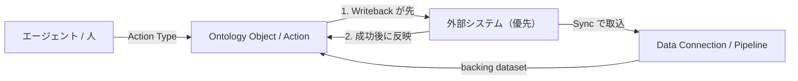
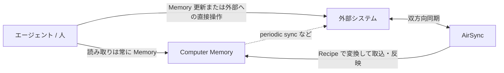

> この記事は独立して読めます（約20分）

[gura105/operational-ontology](https://github.com/gura105/operational-ontology) が話題になり、ブログやコードを追いながら理解を深めているうちに、公式情報を読まないと解けない箇所が出てきました。そこで [Foundry の公式ドキュメント](https://www.palantir.com/docs/foundry/ontology/overview/) を読み込み、自社で作っている DevRev と Palantir の技術的な違いをはっきりさせたくてこの記事を書きました。

読者として想定しているのは、主に DevRev のお客様やパートナー、そしてこれから DevRev に入社するエンジニアです。優劣を決める比較ではなく、思想と実装の差を公式ドキュメントと公開情報に沿って整理した備忘録として読んでください。Palantir 側は公式ドキュメントに従い、DevRev 側は公開情報と本ブログの過去記事を根拠にします。

---

## なぜ今、この比較が必要か

サポートに問い合わせが来る。営業案件が進む。顧客の会社名が変わる。そのたびに裏側でチケット起票・優先度付け・開発へのエスカレーション・リリース・顧客への回答が動きます。

ところが顧客マスタ・問い合わせ・開発チケットは別システムに散らばっているのが普通です。kintone と Zendesk と Jira の組み合わせでも Salesforce でも同じで、「接点で起きたこと」と「裏側で進んでいること」が一つの文脈になりません。

ここにエージェントを入れると、顧客に何が起きていて開発側で何が進んでいるかを横断して把握できない、あるいは業務上許されない更新や権限外の操作を通してしまう、のどちらかでつまずきます。

バラバラの SaaS をその場で呼び出すだけでは解けません。業務の意味とその間の関係を表すオントロジーが必要になります。誰が、何を、何をしているのかを、どう型にしてどうつなぐかという話です。Foundry も DevRev もこの問題を解こうとしています。アプローチが違うだけです。

---

## 3つの差

この記事の結論はこの節にまとまっています。以降は根拠と各機能の詳細です。

### 1. オントロジーの設計

Foundry の Ontology は、[公式 Overview](https://www.palantir.com/docs/foundry/ontology/overview/) で組織の operational layer、そして "the digital twin of an organization" と説明されています。データセットやモデルの上に、注文・設備・顧客といった実世界の対象を対応づけます。要素は semantic elements（名詞。objects / properties / links）と kinetic elements（動詞。actions / functions / dynamic security）に分かれ、Ontology 全体は "not a 'semantic layer'" と明言されています。読むだけの意味レイヤーではなく、変更まで含めて運用する層だという主張です。

構成要素は次に挙げるものが中心です。

- Object Type / Object: 実世界の実体・イベントの型とそのインスタンス。データセットにマッピングされる
- Property: 特性の型
- Link Type / Link: 2つの Object Type 間の関係の型とそのインスタンス
- Action Type: オブジェクト・プロパティ・リンクへの一連の変更を一度に行う定義。通知や webhook などの付随処理も含む
- Functions: Action の裏側でビジネスロジックを書く層。これに支えられたものを function-backed action と呼ぶ
- Interfaces: 共通の形を持つ Object Type をまとめて扱うための型

この Object Type と Link Type を、導入する側が白紙から設計します。

DevRev の Computer Memory もオントロジーですが、Identity（Dev / Rev）、Parts（製品階層）、Work（Ticket / Issue など）という3本柱が最初から製品に入っています。Work は Part に紐づく、Part が顧客と作り手をつなぐ、といった関係の型も含まれ、Trails がそれを可視化します。設計の詳細は「[ナレッジグラフをエージェントの「記憶」にする設計](https://zenn.dev/knowledge_graph/articles/kg-agent-ontology-design)」と「[特許から読む DevRev の思想](https://zenn.dev/knowledge_graph/articles/devrev-philosophy-from-patents)」にあります。

ここがいちばん大きい差です。Foundry は対象を選ばず何でも表現できる汎用のモデリング基盤で、自由度が高い代わりにモデリングそのものへの投資が前提になります。DevRev はモデリングの手間がほぼ消えてすぐ動き出す代わりに、扱う範囲が企業活動を中心に定まります。

この記事で言う「ナレッジグラフ」は、ノードとエッジを多段にたどって低レイテンシで文脈を組み立てる記憶のことです。この意味では Foundry Ontology はナレッジグラフではありません。公式の中心はデータセットにマッピングされた Object Type / Property / Link Type と、変更を統制する Action Type / Functions です。Link Type は Object 間の関係を表しますし、Vertex というグラフ探索アプリもありますが、製品の中核は「グラフをたどる記憶」ではなく「オブジェクトモデルとしてのデジタルツイン」と「Action による変更のルール」に置かれています。DevRev 側は逆に、権限付きグラフを多段にたどることを前提にしています（Memory-first。詳細は「[AIエージェントが毎回データを取りに行く設計の限界](https://zenn.dev/knowledge_graph/articles/kg-agent-memory-first-design)」）。

### 2. 更新の順序と競合

Foundry では、source-backed プロパティは外部を先に更新し、成功したあとで Ontology を更新します（Writeback Webhook）。editable / ontology-owned プロパティは Foundry 内が先です。プロパティ単位でどちらを先にするかを選べます。

DevRev では読み取りが常に Memory 側です。書き込みは Memory の更新に加えて、Safe Actions や MCP 経由で外部を直接操作する経路もあります。

ここで分けて考えるべきことが2つあります。エージェントが先に触る場所と、同期で競合したときにどちらが優先されるかです。DevRev は読み取りが Memory-first でも、periodic sync（デフォルト1時間ごと）が有効な状態で両側の同じフィールドを同時に変えた場合、AirSync は DevRev 側の変更を残さず全フィールドを外部の値で上書きします。2-way 構成ならその後 DevRev から外部への同期で DevRev 側の変更が戻り、次の取込で両側が揃いますが、1回の同期では終わりません。「Memory が常に優先」ではない点は押さえておく必要があります。1-way 運用や 2-way を組んでいないフィールドでは、DevRev 側の変更が失われることがあります。

### 3. 外部システムとのつなぎ方

Foundry には取込用の [Data Connection](https://www.palantir.com/docs/foundry/data-connection/overview/)、Ontology へのマッピングを担う Pipeline、書き戻し用の Action / Writeback Webhook / Function / OSDK という部品が揃っています。外部接続をゼロから書く必要はありません。ただし DevRev の AirSync のような「外部とオントロジーを双方向同期する完成品」を標準装備する思想ではないため、取込から書き戻しまでの流れは導入側で設計・実装します。writeback dataset は Ontology 編集の Foundry 内スナップショットであり、外部システムへ自動では流れません。

DevRev は [AirSync](https://support.devrev.ai/en-US/devrev/article/i96Xvth5-airsync-overview) がプラットフォーム標準の双方向同期です。Recipe manager でオブジェクト型・フィールド単位に取り込む対象と変換を定義し、Memory への取込と外部への反映を同じ枠で扱います。

図にすると流れの違いはこうなります。

Palantir Foundry（source-backed プロパティを代表に図示）

DevRev（Memory-first）

---

## 比較の対応表

Foundry の機能一覧は [Application reference](https://www.palantir.com/docs/foundry/getting-started/application-reference/) にまとまっています。ここはこの記事で扱う範囲の対応表です。

| 観点 | Palantir Foundry | DevRev |
| --- | --- | --- |
| 取込 | Data Connection から Pipeline で Ontology へ | AirSync（Recipe で変換。ほぼリアルタイム双方向） |
| ERP/CRM から一気に | HyperAuto（Sync・Pipeline・Ontology 生成） | native snap-in。取込と継続双方向同期 |
| 更新の優先 | Writeback など。プロパティ単位で選べる | 読み取りは Memory-first。競合時は外部優先 |
| 変更モデル | Action Type と Functions | Memory 更新と Safe Actions。MCP 等の外部直接操作もあり |
| 業務 UI | Workshop が主。Slate / OSDK React / Pilot も | Support / Build / Grow、PLuG、Vista |
| 自動化 | Automate（条件と Effect） | Workflow engine と Automate 系 snap-in |
| 承認・操作理由 | Approvals と Checkpoint | Safe Actions の HITL と監査ログ |
| 探索・分析 | Object Explorer / Contour / Quiver / Insight | Enterprise Search / Text2SQL / Vista Reports |
| 配布 | DevOps Product から Marketplace | Snap-in Marketplace、Agent Studio の版管理 |
| 権限 | Object / Action の permissioning | グラフ ACL 伝播（クエリ時） |
| エージェント | AIP / OSDK / Ontology API | Computer / Agent / Skills |
| 取込から書き戻しまで | 導入側で設計・実装 | 双方向同期が標準 |

---

## Foundry を詳しく見る

思想の差は周辺機能の設計にも出ます。ここからは Foundry を公式ドキュメントに沿って見ていき、各節の最後に DevRev 側を対比します。

### Action Type と Writeback Webhook

Foundry で変更の中心にあるのは Action Type です。submission criteria・Functions・権限ポリシーが付き、「この変更が許されるか」を業務ルールとして事前条件に書けます。変更の定義がモデルとして一か所に集まるのがこの設計の狙いです。

書き戻しの順序は [Webhooks のドキュメント](https://www.palantir.com/docs/foundry/action-types/webhooks/) に整理されています。Writeback Webhook は他のルール評価や Ontology 変更の前に実行され、外部が失敗すれば Ontology は変わりません（1つの Action につき Webhook は1つ）。保証は "some degree of transactionality" にとどまり、外部が成功したあとに Ontology 側が失敗する余地は公式も認めています。Side effect モードの webhook は Ontology 変更の後に走るため、順序が逆になります。

DevRev 側では、変更のルールはデータモデル・権限・ワークフローに分かれます。実行時の安全装置が Safe Actions で、エージェントの書き込みはまず下書きとしてステージングされ、機微な操作は人間の承認（HITL）を挟み、実行後は72時間ロールバックでき、全操作が監査ログに残ります。Agent Studio でもツール単位に承認の要否を設定できます。詳細は「[AIエージェントを本番に出せない本当の理由](https://zenn.dev/knowledge_graph/articles/kg-agent-production-safety)」にあります。

違いは、許される変更をモデルとして宣言するか、実行時にゲートをかけるかです。

### 権限と可視性

差は厳しさではなく、何に対してポリシーを適用するかです。

Foundry の対象は Object（型・インスタンス・プロパティ）と Action Type です。[Object permissioning](https://www.palantir.com/docs/foundry/object-permissioning/overview/) は Ontology resources（型）と Objects and links（実データ）の二層になっています。閲覧には backing datasource へのアクセスに加え、object / property の security policy（行・列レベルを含む）も必要です。Action の実行には action type と対象 object type などの権限が必要で、デフォルトは restrictive default です。

DevRev の対象はグラフ上のエンティティとリレーション、そしてソース由来の ACL・ロールの伝播です。オブジェクトに加えてフィールドレベルまで継承します（対象は ticket / issue / account / rev_users / dev_users。opportunity は現状オブジェクトレベルのみ）。Salesforce のロール階層のような継承モデルは現状ありません。権限の取り込みは外部から DevRev への一方向のみで、ソースで見えないものは Computer でも見えません。権限は LLM に届く前、グラフ探索の時点で適用されます。セッション開始時のキャッシュではありません。

Foundry は「このオブジェクトが見えるか」「この Action を取れるか」を統制し、DevRev は「この関係をたどれるか」を統制します。

### エージェントからどう触るか

Foundry では AIP（Agents / Logic など）や OSDK / Ontology API から Ontology を操作します。Workshop などを通じて人も同じオントロジー上の Action を実行します。対話利用では問い合わせたユーザーの権限で動くのが基本で、OSDK / Developer Console 経由ではアプリケーション権限（サービスユーザー相当）で動かす構成もあります。

DevRev では Computer / Agent / Skills が読み取りを常に Memory から行います。書き込みは Memory の更新に加え、Safe Actions や MCP 経由の外部操作もあります。実行権限は問い合わせたユーザーの権限（Execute as User）かサービスアカウントの権限かを選べ、Skills はモデルが意図から選びます。

どちらも LLM にすべてを任せません。オントロジー側で、読める範囲と実行可能な操作に制約をかけます。

### HyperAuto：ERP/CRM からの自動生成

[HyperAuto](https://www.palantir.com/docs/foundry/hyperauto/overview/)（別名 Software-Defined Data Integration / SDDI）は、よく使う業務システム向けに取込から使える出力までをまとめて用意する仕組みです。ウィザードで設定し、生データからワークフローに使える dataset や Ontology までを短時間で作ります。代表ソースは SAP（V2）、Salesforce と Oracle NetSuite（V1）です。V2 は UX と性能が新しくリアルタイム・ストリーミング対応もありますが、Overview 時点で対応ソースは SAP のみです。V1 は ERP/CRM を広くサポートし、Derived Elements や Ontology の自動生成も含みます。

[V2 の Architecture](https://www.palantir.com/docs/foundry/hyperauto/architecture/) では、Data Syncs（ソースから Foundry への同期）、Builder Pipelines（Pipeline Builder 上に自動生成される変換）、Ontology（出力 dataset から Object / Link を定義。任意）の3つをオーケストレーションすると説明されています。ソースのメタデータをリアルタイムに問い合わせ、どう Sync するか、どんな変換が妥当か、Ontology をどう設計するかについて推奨設定付きの初期案を出します。生成されたパイプラインの編集は、HyperAuto の設定を提案（proposal）経由で変える形が基本です。リネーム・クレンジング・非正規化・重複排除などは推奨設定のデフォルトで自動化されます。

HyperAuto は「Data Connection と Pipeline と Ontology 定義を手組みする」作業の ERP/CRM 向けショートカットです。AirSync のような継続的な双方向同期そのものではなく、Foundry に取り込むまでの自動化が中心です。

DevRev では、ソースからオントロジーへの道筋を AirSync の native snap-in コネクタが担います。Salesforce・Jira・Zendesk・ServiceNow・HubSpot・Google Drive などのコネクタが Marketplace にあり、ワンクリックで導入できます。設定は Recipe manager で、どのオブジェクト型・フィールドを取り込むか、どう変換するかを選ぶ形です。取込・変換に加えて継続的な双方向同期までを1つの仕組みで提供します。

違いは、HyperAuto がソースのデータモデルから Ontology の設計案まで出すのに対し、AirSync の Recipe は既定オントロジー（Identity / Parts / Work）へのマッピングが前提な点です。

### Workshop：Ontology 上の業務アプリ

[Workshop](https://www.palantir.com/docs/foundry/workshop/overview/) は運用ユーザー向けの対話的アプリを作るビルダーです。データの読み取りは Object Data Layer が主で、Object Type 間の link をそのまま使えます。書き込みは Actions、ロジックは Functions です。コンポーネントは共通のデザインシステムに揃い、Layouts と Events で単なるダッシュボードより React 製カスタムアプリに近い操作性を狙います。

公式が挙げるパターンは、トリアージや優先度付けを行う Inbox / タスク管理と、地図・指標・フィルタ・他画面への導線をまとめた Common Operational Picture です。Widget は Object Table / Object View・チャート・地図・フィルタ・Inline Action・AIP Chatbot など多数あり、モバイル、Scenario（仮説適用）、Marketplace へのパッケージ化にも対応します。

周辺のアプリビルダーとしては、HTML/CSS/JS 寄りで重いカスタムに向く Slate、React と OSDK による完全カスタム UI の OSDK React、自然言語からアプリを生成する Pilot、複数アプリをまとめるポータルの Carbon があります。

DevRev で同じ役割になるのは Support / Build / Grow などのアプリ、顧客向けの PLuG、横断ビューの Vista です。Vista は Memory 上の Work（Ticket・Issue・Opportunity など）に対するカスタムビューで、ロールに応じた見え方を作れます。Vista Reports はその上のダッシュボードです。

Workshop が「同じ Ontology の上に業務ごとのカスタムアプリを作る汎用ビルダー」なのに対し、DevRev は既定ドメイン向けの既製アプリが主で、そこへカスタムビューやカスタムオブジェクトを足す形です。

### Automate：条件と Effect による業務自動化

[Automate](https://www.palantir.com/docs/foundry/automate/overview/) はプラットフォーム上の業務自動化の入口です。条件を継続またはスケジュールで評価し、満たしたら Effect を自動実行します。条件は時刻（毎週月曜 9:00 など）、Ontology 上のオブジェクトデータ（priority が high の Alert が追加された、など）、およびその組み合わせです。Effect には Foundry Action の実行、AIP Logic の起動、Foundry Function の実行、プラットフォーム通知・メールがあります。定期レポート送信、閾値超過のデータアラート、異常オブジェクトへの Action 適用、保存済み探索の監視といった使い方が公式に挙がっています。

[Effect settings](https://www.palantir.com/docs/foundry/automate/effect-settings/) で押さえておくべき点が3つあります。複数の Automate が同時に発火すると並列になり、実行順は不定です。1つの Automate 内の Effect は Action / Logic / Function を直列にできます（失敗すれば後続は走らず、fallback が成功してもシーケンスは続行しません）。そして実行の保証は at-least-once です。同じトリガで Effect が再実行されうるため、Action / Function 側で再実行に耐える設計が必要になります。

DevRev で対応するのは Workflow engine と Automate 系の snap-in です。Workflow は Trigger / Action / Control / Delay の4種類のノードで組みます。トリガはイベント（チケット作成・更新など）、タイマー、手動、API があり、Control で条件分岐やループ、Delay で長時間の待機（承認や契約日まで数日から数週間の停止）ができます。ナレッジグラフ上の変更が snap-in を起動する点は、Automate が Ontology 上のオブジェクトデータ条件で発火するのと同じ発想です。

対応関係を見ると、Foundry の「条件から Effect」は DevRev の「Trigger から Action」に当たります。AI の組み込み方には差があり、Foundry は Effect として AIP Logic を呼びますが、DevRev は Workflow の途中に AI ノードを差し込み、決定論的ロジックと AI 判断を1つのキャンバスで組み合わせます（「怒っている顧客なので優先度を P0 にする」のような分岐）。実行基盤は DevRev の snap-in が serverless で、コールドスタート・メモリ・リトライはプラットフォームが管理します。

ただし Automate の「at-least-once、同時発火時は順序不定」に相当する再実行耐性・順序保証を、DevRev 側は Foundry ほど明文化していません。厳密な冪等性が要る自動化では、その前提を自分で設計する必要があります。

### Approvals と Checkpoint：変更ガバナンス

権限ポリシーとは別に、Foundry には変更の申請・承認と、機微な操作で理由を書かせる仕組みの二層があります。

[Approvals](https://www.palantir.com/docs/foundry/approvals/overview/) は、権限がなくて直接変えられないときに変更を申請し、管理者の承認を得てから適用する流れを管理します。Request は1つ以上の Task を含み、全部承認されて初めて適用されます。Task の例はグループメンバー追加、Project へのロール付与、Marking への追加、Ontology proposal（Ontology 変更）などです。完了済みの申請も残り、過去判断の監査ログとして参照できます。

[Checkpoint](https://www.palantir.com/docs/foundry/checkpoints/overview/) は、機微な操作の直前に「なぜその操作をするか」を書かせ、記録・監査するガバナンスツールです。誰にどの操作でどんな入力を出すかを checkpoint configuration で決め、時刻・ユーザー・書いた理由・関連リソースなどが checkpoint record に残ります。同期操作だけでなく Approvals 経由の非同期申請にも組み込め、公式は60以上の Foundry 操作に組み込まれていると説明しています。

Action Type の submission criteria が「この変更を実行可能か」の業務ルールなら、Approvals と Checkpoint は「プラットフォーム上の変更・機微操作を誰がなぜ行ったか」のガバナンス層です。

DevRev で近いのは Safe Actions（前掲）です。粒度は異なります。Approvals は権限不足の変更を申請して承認を得る汎用ワークフロー、Checkpoint は多数の操作の直前に理由を書かせる独立層ですが、Safe Actions と HITL は主にエージェント書き込みの実行時安全装置で、操作ごとに理由を残す仕組みや申請受信箱を同じ細かさでは持ちません。

### 探索と分析

Foundry の分析は、対象が dataset か Ontology かで道具が分かれます。

[Contour](https://www.palantir.com/docs/foundry/contour/overview/) は大規模な表データ向けのポイント＆クリック分析です。公式が向いている条件として挙げるのは、データの一部または全部が Ontology に載っていない場合、非常に大きなデータ（10万オブジェクト超の join、5万行超の集計など）、分析結果を dataset として他ツールへ渡したい場合です。

[Quiver](https://www.palantir.com/docs/foundry/quiver/overview/) は Ontology 上のオブジェクトと時系列向けです。link を search around でたどれるので主キー結合を自分で書く必要がありません。時系列ライブラリ、Workshop や Object View へのダッシュボード埋め込み、そして Action による Ontology への書き戻しが強みです。

Insight は既知の Ontology データに対するステップ型の分析（リンク走査・集計・地図・SQL・writeback）です。[Object Explorer](https://www.palantir.com/docs/foundry/object-explorer/overview/) は Ontology 全体の検索・探索で、設定が少なく非エンジニア寄りの入口になります。Object Views はオブジェクト型ごとの標準の見せ方を定義する側です。Vertex はオブジェクト関係のグラフ探索・シミュレーション向けのアプリです。

分析ツールそのものはオントロジーの設計ではありません。ただし Foundry では、同じ Ontology を業務 UI（Workshop）、自動化（Automate）、分析（Quiver）、探索（Object Explorer）が共有するのが設計の中心です。分析専用のサイロがあるか、運用オントロジーとつながっているかという点が違います。

DevRev の探索・分析は、専用ツールが並ぶより、ナレッジグラフの上に少数の入口を重ねる形です。Enterprise Search はグラフを横断する意味検索で、エンティティ解決済みのグラフをたどり出典付きで答えます。Text2SQL は自然言語を SQL に変換し、Memory のスキーマに実在するテーブル・カラム・関係だけを参照してクエリを生成します。決定論的な集計や多段計算に使います。Vista Reports はグラフ上のワークに対するダッシュボードで、ブラウザ内の DuckDB で動くため低レイテンシですが、データ更新は約1時間ごとでリアルタイムではありません。ビジュアルエディタ（3オブジェクトまで、JOIN 不可）と、SQL で JOIN や複雑計算ができる JSON エディタの2系統があります。

違いは2点です。DevRev では同じナレッジグラフの上に検索・SQL・ダッシュボードが載るため、「表データ向けは Contour、Ontology 向けは Quiver」のようにツールを分ける必要がありません。また Quiver のように分析ツールから直接オントロジーへ書き戻す流れは、DevRev では分析側ではなく Computer や Safe Actions 側の役割です。分析は状態を読む側、変更は Safe Actions を通す、という分担です。

### Marketplace と DevOps：成果物の配布

[Marketplace](https://www.palantir.com/docs/foundry/marketplace/overview/) は公開された data product を見つけてインストールするカタログで、ガイド付きインストール・自動アップグレード・メンテナンスウィンドウ・リリースチャネルがあります。Application reference では DevOps が Product の作成・バージョン・インストール管理、Marketplace が発見・インストール側と整理されています。Workshop アプリ、Automate、Checkpoint 設定、Quiver ダッシュボード、Action Type、Ontology 型定義など多くのリソースを1つの Product に含められます。オントロジー中心のユースケースを、一度作って終わりにせずバージョン付き製品として横展開する層がプラットフォーム標準にある、ということです。

DevRev の配布側は Snap-in と Marketplace、そしてエージェント・スキルの Agent Studio です。Snap-in は TypeScript の serverless モジュールで、Marketplace から公開してワンクリック導入でき、導入時にツールがエージェントへ自動アタッチされます。プライベート配布も可能です。Agent Studio は draft-and-publish の版管理を持ち、下書きで編集してサンドボックスやバルク評価でテストしてから公開し、問題があればワンクリックでロールバックします。

違いは配布の単位です。Foundry は多様なリソースを1つの Product に束ねて横展開でき、DevRev は snap-in（コード拡張・コネクタ・自動化）とエージェント・スキルが主な配布単位です。

---

## 注意点

機能単位ではほぼ同じことができるので、選定で効くのは注意点の方です。

### Palantir Foundry Ontology

- ノードとエッジを多段にたどる記憶ではないため、エージェント向けのグラフ記憶とは仕組みが違う
- 取込から書き戻しまでを導入側で設計・実装する前提（HyperAuto も Foundry への取込までの自動化）
- Writeback の保証は片側にとどまり、複数の外部システムを厳密に同時更新するなら別設計が必要
- Action・Automate・Approvals・Checkpoint・分析アプリまで含めると、定義・保守と学習のコストが増える
- 取込と書き戻しの経路が薄いと、デジタルツインと外部のどちらが今の状態か曖昧になりやすい

### DevRev（Computer Memory）

- 変更のルールを Action Type ほど明示的なモデルとして定義しにくく、データモデル・権限・ワークフローに分かれる
- 同期競合のデフォルトは外部優先で、外部反映までの一時的なずれも起きうる
- 権限の取り込みは外部から DevRev への一方向のみ。フィールドレベル ACL の対象オブジェクトも現状は限られる
- 何を Memory に入れるか、名寄せと Recipe・スキーマ設計が品質を決める
- Safe Actions はあるが、Foundry の Action カタログと事前条件と同じ細かさで揃えるなら別途の設計が必要
- 企業活動の芯から外れる課題はカスタムオブジェクトで広げられるが、Foundry ほどの柔軟性はない

---

## どちらを選ぶか

設計の違いから、用途と規模の向き不向きが決まります。

用途で見ると、Foundry はサプライチェーンや生産計画の最適化、物理世界のシミュレーション、大規模な資源配分、社会インフラや情報分析、防衛といった、対象そのものを白紙からモデル化して深く作り込みたい領域に向きます。DevRev は顧客・製品・サポート・営業・開発という企業や組織のユースケースが主戦場です。プリビルドのオントロジーが企業活動を対象にしているため、オントロジーエンジニアを確保できない、あるいは確保し続けたくない組織でも利用開始と運用がしやすくなっています。

規模で見ると、Foundry はオントロジーを設計・運用できる人がいれば国や世界規模まで伸ばせます。DevRev は中小規模から大規模まで対応しますが、対象は企業・組織のユースケースに寄ります。

DevRev もカスタムオブジェクトや custom fields で対象を広げられます。製造ラインの設備を Parts 配下や Account 周辺のカスタムオブジェクトで持ち、異常対応を Work で扱い、Rev / Dev Parts へ紐づけるといった使い方です。企業活動の芯につなげて併用する範囲なら十分ですが、カスタムオブジェクトがグラフの大半を占めて既定の芯から独立すると、プリビルドの利点は薄れます。

迷ったら、社内でオントロジーエンジニアを確保して細かく制御したいのか、プリビルドで企業活動から早く始めたいのか、で見ると早いです。

---

## まとめ

1. どちらもオントロジーが中心で、機能単位でできることは近い。差は設計の前提にある
2. Foundry は白紙から設計する汎用のオブジェクトモデル、DevRev は企業活動向けのプリビルドオントロジーを持つ権限付きグラフ
3. 読み取りの前提と同期競合時の優先は別の話で、外部連携を導入側で組むか標準機能に載せるかが選定の分かれ目になる

---

## 参考・出典

- [Ontology building Overview（Palantir）](https://www.palantir.com/docs/foundry/ontology/overview/)
- [Application reference（Palantir）](https://www.palantir.com/docs/foundry/getting-started/application-reference/)
- [Data Connection Overview（Palantir）](https://www.palantir.com/docs/foundry/data-connection/overview/)
- [HyperAuto (SDDI) Overview（Palantir）](https://www.palantir.com/docs/foundry/hyperauto/overview/)
- [HyperAuto V2 Architecture（Palantir）](https://www.palantir.com/docs/foundry/hyperauto/architecture/)
- [Workshop Overview（Palantir）](https://www.palantir.com/docs/foundry/workshop/overview/)
- [Automate Overview（Palantir）](https://www.palantir.com/docs/foundry/automate/overview/)
- [Automate Effect settings（Palantir）](https://www.palantir.com/docs/foundry/automate/effect-settings/)
- [Approvals Overview（Palantir）](https://www.palantir.com/docs/foundry/approvals/overview/)
- [Checkpoints Overview（Palantir）](https://www.palantir.com/docs/foundry/checkpoints/overview/)
- [Contour Overview（Palantir）](https://www.palantir.com/docs/foundry/contour/overview/)
- [Quiver Overview（Palantir）](https://www.palantir.com/docs/foundry/quiver/overview/)
- [Object Explorer Overview（Palantir）](https://www.palantir.com/docs/foundry/object-explorer/overview/)
- [Marketplace Overview（Palantir）](https://www.palantir.com/docs/foundry/marketplace/overview/)
- [Action types Overview（Palantir）](https://www.palantir.com/docs/foundry/action-types/overview/)
- [Webhooks: Writeback vs. side effect（Palantir）](https://www.palantir.com/docs/foundry/action-types/webhooks/)
- [Object permissioning Overview（Palantir）](https://www.palantir.com/docs/foundry/object-permissioning/overview/)
- [AirSync Overview（DevRev）](https://support.devrev.ai/en-US/devrev/article/i96Xvth5-airsync-overview)
- [gura105/operational-ontology](https://github.com/gura105/operational-ontology)（本記事のきっかけとなった公開実装）
- [AIエージェントが毎回データを取りに行く設計の限界](https://zenn.dev/knowledge_graph/articles/kg-agent-memory-first-design)
- [ナレッジグラフをエージェントの「記憶」にする設計](https://zenn.dev/knowledge_graph/articles/kg-agent-ontology-design)
- [AIエージェントを本番に出せない本当の理由](https://zenn.dev/knowledge_graph/articles/kg-agent-production-safety)
- [特許から読む DevRev の思想](https://zenn.dev/knowledge_graph/articles/devrev-philosophy-from-patents)

---

## 更新履歴

- 2026-07-27: 初版公開

## フィードバック受け付け

本記事は AI を活用して執筆しています。内容に誤りや追加情報があれば Zenn のコメントよりお知らせください。
