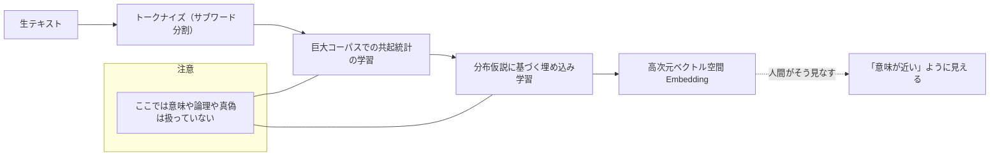
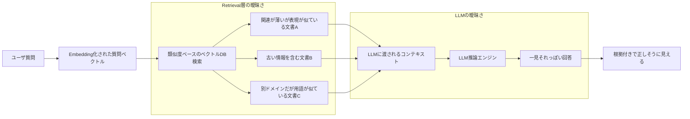
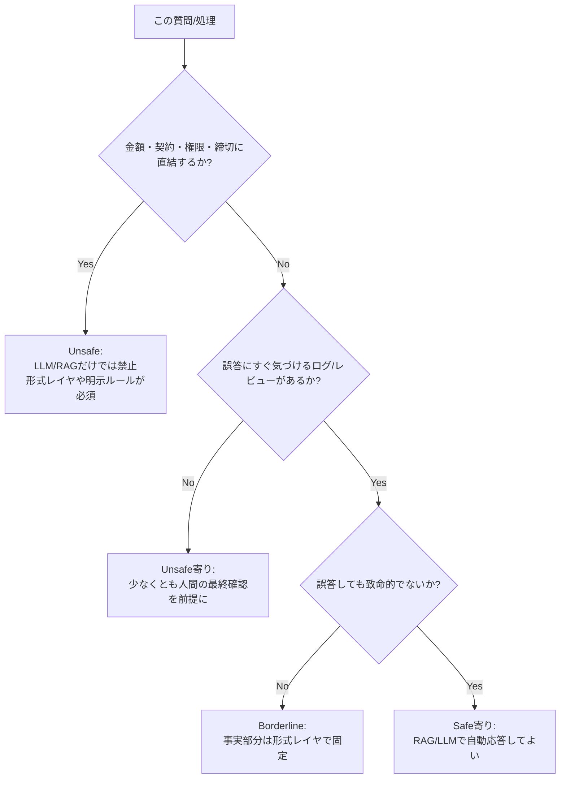

## はじめに：LLM + RAG は「銀の弾丸」ではありません

※ 本記事は、すでに LLM / RAG を用いた PoC や小規模プロダクトを経験し、「そろそろ限界や違和感が見えてきた」と感じている中級レベル以上のエンジニアを想定しています。  
 一般向けの入門ではなく、実運用を前提にどこまでを LLM / RAG に任せ、どこから先を別レイヤに逃がすべきかを整理することを目的としています。

ここ数年、プロダクトや社内ツールの文脈で、

- 「LLM に RAG をかませれば正確になる」
- 「ベクトル DB にマニュアルを全部突っ込めば、あとは自然言語で検索できる」

という期待が広がっています。

しかし、**LLM と RAG は構造的に「真実性や整合性を保証する仕組み」を持ちません**。  
うまく動いているように見えるケースがあっても、それは「正確性が保証されている」わけではありません。

この記事の目的は次の 3 点です。

- LLM / RAG を盲信してはいけない**構造的理由**を整理すること
- **どこから先が LLM / RAG の危険領域になるのか**を明確にすること
- **KG・SQL・ルールエンジンなど形式的レイヤとの組み合わせが不可欠である理由**を示すこと

なお、本記事は「RAG を使うべきではない」という主張ではありません。  
むしろ **どの領域なら LLM / RAG を安全に活用できるか（Safe Zone）** を明確にすることが狙いです。

また、KG やナレッジモデリングの基礎については、以下の既存記事で解説しています。

- ナレッジグラフ入門  
  https://zenn.dev/knowledge_graph/articles/knowledge-graph-intro
- RAG なしで始めるナレッジグラフ QA  
  https://zenn.dev/knowledge_graph/articles/kg-no-rag-starter
- GenAI Divide とナレッジグラフ  
  https://zenn.dev/knowledge_graph/articles/genai-divide-knowledge-graph

本記事ではそれらと重複しないように、LLM/RAG の「限界」と「設計思想」に絞って解説します。

形式レイヤの詳細な設計・実装については、続編「LLM/RAG の曖昧性を抑える『形式レイヤ』」 で近日解説予定です。

---

## LLM の限界：もっともらしさを最適化する装置

LLM は「理解している」ように見えることがありますが、内部で行っているのは次の処理です。

> コンテキストから次に出現しそうなトークンの確率分布を推定し、その中からもっともらしい系列を選ぶ

これは **「正しい回答を生成するための仕組み」ではありません**。

- 真偽の概念は扱いません
- 整合性を検証する機構もありません
- もっともらしい文章を出力しようとする性質上、「それっぽい誤り」を生成します

LLM 幻覚については、近年の多数のサーベイ（例：[A Survey on Hallucination in Large Language Models, 2024](https://arxiv.org/abs/2311.05232)）でも構造的課題として整理されています。

---

## RAG の限界：Embedding は「意味」ではなく「統計パターン」

RAG は次のステップで動作します。

1. 質問を Embedding に変換する
2. ベクトル DB で近い文書を取得する
3. LLM に回答を生成させる

しかし、Embedding が表しているのは **人間にとっての「意味そのもの」ではなく、大量のテキストの中での使われ方のパターンをざっくり圧縮したベクトル表現**です。

Embedding の距離が近くても、それは「人間にとっての意味が近い」こととイコールではありません。

なお、実際の学習過程ではトランスフォーマや自己教師あり学習、コントラスト学習のような手法が使われますが、本記事では上級者向けの話題として扱いません。ここでは「大量テキストの使われ方パターンを圧縮したベクトル」くらいにラフに理解してもらえれば十分です。

- 最新かどうか
- 文脈が正しいか
- 製品名や番号が正しいか

こうした**正しさの観点は一切評価していません**。  
RAG の限界や評価方法については、近年のサーベイでも「retrieval の揺らぎ」と「LLM 側の幻覚」が複合的に影響することが指摘されています（例：[A Survey on Retrieval-Augmentation Generation, 2025](https://link.springer.com/article/10.1007/s00521-025-11666-9)）。

これは、その後の Retrieval で生じる曖昧性につながる基盤的な問題です。

現場では、この問題を軽減するために、

- インデックス時や検索時に **メタデータフィルタ**（日付・プロジェクトなど）を必須にする
- 類似度だけでなく、別モデルやルールによる **リランキング** を挟む

といった工夫を行います。  
ただし、これらは「改善策」であり、**問題を完全に解消するものではありません**。

---

## RAG が曖昧さを「緩和」ではなく「増幅」してしまう理由

RAG は「幻覚を抑える」と紹介されがちですが、実際には構造的に **幻覚を増幅しうるメカニズム** を持っています。

- Retrieval 層は「似ている文書」を返します
- LLM はそれを「正しい前提」として合成します
- UI 上では「根拠付き回答」に見えます

結果、**誤情報が“もっともらしく補強される”構造**になります。

この構造的揺らぎのため、実運用では必然的に“根拠リンクを提示して人間が確認する”運用が必要になります。

実務では、

- コーパスをドメイン単位で分離する
- メタデータフィルタや再ランキングを強制する
- 「この種の質問は RAG を通さない」といったガードレールを設ける

ことで、この増幅を抑え込むことができます。  
ただし **「とりあえず全部 RAG に投げる」構成は危険です**。  
中級者以上のエンジニアは、質問タイプごとに「RAG を使う・使わない」の線引きを設計段階で定義しておくと安全です。

---

## RAG では「根拠リンクを人間が確認する」運用は構造的に必須

先ほど述べた Retrieval と LLM の構造的曖昧性の結果として、

RAG ベースの QA を運用すると、最終的にこうなります。

1. LLM が回答を生成
2. 「参照した根拠リンク」が提示される
3. 人間がリンクを開き、内容が正しいか確認する

自動評価や自己検査系の手法でかなり改善できますが、**現状の到達点としては、ほとんどのユースケースで人間による最終確認が必要になる場面を完全には避けられません。** 一方で、ドメインが十分に限定され、かつ誤答のコストが低い軽量タスクであれば、RAG ベースの自動応答だけで回している事例も存在します。

（ここで挙げた用語は、ざっくり「**LLM 同士で相互チェックする**」「**怪しいときはスコアを下げる**」といった自動チェックだと思ってもらえれば十分です。詳細を覚える必要はありません。）

- 検索が統計的
- LLM が前提を検証しない
- 整合性の自動検証機構が存在しない

したがって、**現実的には「人間が最終審査を行う」前提で設計しておくのが安全です。**

---

## どこから先は LLM / RAG だけで頑張るべきではないか

LLM/RAG では危険となる領域：

- 契約・法務・ポリシー解釈
- 金額・数量・台帳データ
- アクセス制御・承認ロジック
- SLA やペナルティが発生する判断

これらは**誤ったときのコストが非常に高く、LLM/RAG の特性と相性が悪い領域**です。

最初のうちは、まず「この質問に間違って答えたら、誰がどれくらい困るか？」をざっくり想像してみるだけでも十分です。お金・契約・権限・締切が絡むものは、だいたい要注意ゾーンだと思ってください。

どちらか迷うときは、**常に危険側に倒す**くらいでちょうど良いです。  
迷うということは、誤答した際に誰かが困る可能性があるケースであることが多いためです。

### RAG Safe / Unsafe 判断フロー（実務向けの簡易版）

実案件では、例えば次のような線引きが現実的です。

- 料金計算や請求金額の決定 → SQL / 会計システムを唯一の真実として扱い、LLM は説明だけに使う
- SLA に影響する優先度判定 → ルールエンジンやワークフローエンジンに任せ、LLM は補足説明のみ
- ヘルプセンターの記事案内や、「どのドキュメントを読むべきか」の推薦 → Safe 寄りの領域として RAG を使う

---

## LLM/RAG が安全に使える領域（Safe Zone）

- 間違えてもいい FAQ 回答生成
- ドキュメント要約
- 顧客問い合わせの一次分類（回答ではなく分類のみ）
- アイデア生成（正解のない創造的なもの）
- 読み取り専用の情報参照（検索補助的な扱い）

**誤答のコストが低いか、LLM が意思決定しないこと**が条件です。  
逆に Safe Zone に近いものは、「間違っても笑ってやり直せるか？」「人間があとから簡単に直せるか？」といった観点で考えるとイメージしやすくなります。

迷ったときは、

1. この回答が 100% 間違っていても問題ないか？
2. 間違いに気づける仕組み（レビューやログ）があるか？
3. それでも自動返答してよいと思えるか？

の 3 点を自問してみてください。1 つでも不安なら形式レイヤを挟むべきサインです。

---

## 曖昧性を抑える「形式レイヤ」の役割

次のような形式システムは、曖昧性を完全に排除できます。

- **SQL**（制約・整合性の保証）
- **ナレッジグラフ**（関係性の明示と推論）
- **ルールエンジン**（IF-THEN の決定ロジック）
- **制約ソルバ**（条件下での最適解探索）

RAG と異なり、「似ているから返す」ことはありません。  
**条件に一致したデータのみを返します。**

これら形式レイヤは LLM 単体では扱えない「決定性・整合性・制約」を提供しますが、実際のシステムでは **これらを LLM にそのまま見せるのではなく、安全に公開する必要があります。MCP（Model Context Protocol）もその一つの選択肢です。**

---

### 形式レイヤの種類（概要のみ）

本記事では詳細な設計や実装パターンには踏み込みませんが、曖昧性を抑える「形式レイヤ」は大きく次の 4 つに分けられます。

- SQL：台帳・金額・在庫など、正確な値と整合性が重要なデータの管理に向く
- KG（ナレッジグラフ）：「誰が・何が・どう繋がっているか」といった関係性を辿るのに向く。なお、KG は体系的な関係性を扱う意味レイヤとしての側面も持ちますが、本記事では形式レイヤの一部として位置付けています。
- ルールエンジン：アクセス制御や承認フロー、SLA など、IF-THEN で書けるビジネスルール向け
- 制約ソルバ：スケジューリングやリソース割当など、組合せ・最適化問題向け

実システムでは、これらをすべて一度に入れる必要はなく、「LLM に決定させたくない部分」を洗い出し、そこだけでも形式レイヤに逃がすところから始めるのが現実的です。各レイヤの設計・実装パターンは別記事で掘り下げる予定です。

---

### MCP（Model Context Protocol）の位置づけと役割

MCP（Model Context Protocol）は、LLM と外部システムの間に**安全な境界（インターフェース）**を定義するためのプロトコルです。

重要なのは、次のような点を宣言的に管理できることです。

- LLM が「何にアクセスできるか」を制御する（権限制御）
- 外部システム呼び出しの入力／出力スキーマを定義する（型安全）
- LLM は宣言された範囲内のツールだけを利用できるようにする（サンドボックス化）

なお、MCP は外部システム接続のための **I/O バス** を提供するものであり、データの意味統合やスキーマ整合性、キャッシュ戦略といった「記憶の管理」までは規定しません。これらの役割は、既存記事「MCP の課題とナレッジグラフ」で述べているとおり、形式レイヤ側が担います。両者を組み合わせることで、LLM/RAG の曖昧性を安全に扱うための構造が完成します。

---

### MCP が生み出すもう一つの可能性：標準化とガバナンス

MCP は単に技術的な接続手段ではなく、ツールエコシステムやガバナンスの観点でも重要です。

- LLM プラグイン／ツール呼び出し方式を標準化するレイヤになり得る
- 監査ログを取りやすく、コンプライアンス要件と相性が良い
- 大規模組織での「安全な LLM 自動化」の共通基盤になり得る

本記事では概要の紹介に留め、実運用レベルの設計は別記事に分離します。
MCP はまだ新しい技術のためまだまだ課題がたくさんあります。
課題について詳細を知りたい方は別記事[「MCP の課題とナレッジグラフ」](https://zenn.dev/knowledge_graph/articles/mcp-knowledge-graph)を参照してください。

---

## RAG の落とし穴：実務で頻発するアンチパターン

RAG 運用で発生する問題は「症状」と「構造的な設計ミス」が表裏一体です。本節では、よくある症状（あるある）と、それを生むアンチパターンを統合して整理します。

---

### アンチパターン 1：個人・組織・履歴を RAG だけで扱おうとする

**代表的な症状（あるある）**

- 全員に同じ回答が返る（パーソナライズ不能）
- 「このユーザ」「この顧客」「このチケット」といった ID ベースの問い合わせに答えられない

**原因（設計レベルの問題）**

RAG が扱うのはテキスト断片（チャンク）と埋め込みのみであり、  
user_id / customer_id / ticket_id の概念が存在しないためです。

**対策**

- 個人・顧客・履歴情報は SQL / KG など形式レイヤで管理
- LLM は ID 抽出 → 形式レイヤで検索 → 結果を説明する構成に寄せる
- MCP を利用して「ユーザ情報 API」「顧客情報 API」を安全に公開する

---

### アンチパターン 2：RAG の揺らぎ（Retrieval + LLM）を放置する

**症状**

- 昨日は正しかったのに今日は変な回答
- 同じ質問でも微妙に違う回答
- 推論の再現性がない

**原因**

- ベクトル探索のゆらぎ（近傍が微妙に変わる）
- LLM のサンプリングによる変動

**対策**

- Retrieval を決定的にする（ランダム性の排除）
- temperature を低く固定
- 重要な決定ロジックは形式レイヤで確定し、LLM は説明だけにする

---

### アンチパターン 3：ドキュメントライフサイクルを無視した RAG 運用

**症状**

- 廃止済み機能の手順を回答に含める
- 旧バージョンの仕様を拾ってしまう
- 文書更新が反映されず、事故が起きる

**原因**

- インデックス更新がドキュメント更新に追随していない
- 文書に「有効期間」「バージョン」「公開／非公開」などのメタデータがない

**対策**

- ドキュメント管理フローとインデックス更新を CI 的に連動
- バージョン・日付・機能名によるフィルタを必須化
- “最新のみ検索” のルールをルーティング層に明示

---

### アンチパターン 4：アクセス制御（権限・テナント分離）を類似度に任せる

**症状**

- 権限のない情報が RAG 経由で返ってしまう
- 社内ドキュメントと社外 FAQ が混ざる
- テナント分離ができず情報漏洩リスクが発生

**原因**

- コーパス全体を単一のベクトル空間に突っ込んでいる
- アクセス制御を「RAG の前処理」で誤魔化している

**対策**

- アクセス制御は必ず SQL / ルールエンジン側で実装
- インデックスを権限・テナント単位で物理的/論理的に分離
- MCP 経由で「このユーザがアクセス可能なコーパス」を絞り込んでから RAG に流す

---

### アンチパターン 5：評価・モニタリングなしで本番投入する

**症状**

- 精度が劣化しても誰も気づかない
- 特定カテゴリだけ事故が多発
- PoC の手触りのまま運用に突入し、原因追跡不能

**原因**

- RAG を「検索エンジンの延長」と誤解し、評価指標・代表質問セット・ゴールド回答を用意していない
- Retrieval と生成を分けて評価していない

**対策**

- 小さくてもよいので代表的な質問セット + 正解データ（ゴールドセット）を作成
- Retrieval の精度と LLM 生成の品質を個別に評価
- Safe / Unsafe の質問タイプごとに監視項目と閾値を設定する

---

### アンチパターン 6：似ている文書を拾うだけで「正しい文書」を拾えない

**症状**

- 似ている機能の説明を拾ってしまう
- 正しい手順をスキップする
- 文脈がズレることで誤情報が補強される

**原因**

- Embedding は「意味そのもの」ではなく「使われ方パターンの圧縮」であるため、正しさや妥当性を評価しない
- バージョン・機能名・モジュールなどのメタデータを使っていない

**対策**

- メタデータフィルタリングを必須にする
- 再ランキングモデル（BM25 / クロスエンコーダ等）を併用
- チャンク単位の見直し（機能単位・FAQ 単位への再構成）

---

これらのアンチパターンを避けるには、  
**RAG を「万能検索」ではなく、前段にルーティング層、後段に形式レイヤを置く構造**として設計することが不可欠です。

---

## おわりに：LLM / RAG は強力ですが、すべてを支える“唯一の基盤”にはできません

LLM や RAG は強力なツールで、UX を大きく変革します。  
しかし、**事実・整合性・安全性を支える基盤として設計されていません**。

- LLM は確率的な生成器
- RAG は統計的に近い文書を返す仕組み
- 両者とも真実性の保証とは無関係です

だからこそ、

> **LLM / RAG を万能の基盤と誤解せず、曖昧な自然言語の入り口と出口として位置づけ、  
> その内側に形式的なレイヤをしっかり持つべきです。**

なお、本文で触れた MCP など、LLM と形式レイヤの間に安全な境界を設けるためのプロトコルや API 設計も、プロダクト設計における重要度が増しています。MCP 自体の位置づけや想定ユースケース、ナレッジグラフとの役割分担については、既存記事「MCP の課題とナレッジグラフ」で整理しています。

本記事と続編「LLM/RAG の曖昧性を抑える『形式レイヤ』の実装ガイド」を合わせて読むことで、LLM/RAG の限界から形式レイヤの具体実装まで一通り理解できる構成になっています。

---

## 参考文献

- Zenn: ナレッジグラフ入門  
  https://zenn.dev/knowledge_graph/articles/knowledge-graph-intro
- Zenn: RAG なしで始めるナレッジグラフ QA  
  https://zenn.dev/knowledge_graph/articles/kg-no-rag-starter
- Zenn: GenAI Divide とナレッジグラフ  
  https://zenn.dev/knowledge_graph/articles/genai-divide-knowledge-graph
- Zenn: RAG を超える知識統合  
  https://zenn.dev/knowledge_graph/articles/beyond-rag-knowledge-graph
- Zenn: MCP の課題とナレッジグラフ
  https://zenn.dev/knowledge_graph/articles/mcp-knowledge-graph

- RAG Survey: "A Survey on Retrieval-Augmentation Generation (RAG)", 2025  
  https://link.springer.com/article/10.1007/s00521-025-11666-9
- RAG Evaluation Survey: "Evaluation of Retrieval-Augmented Generation: A Survey", 2024  
  https://arxiv.org/abs/2405.07437
- LLM Hallucination Survey: "A Survey on Hallucination in Large Language Models", 2024  
  https://arxiv.org/abs/2311.05232
- Automatic Evaluation: "Evaluating Correctness and Faithfulness of Instruction-Following Models", 2024  
  https://aclanthology.org/2024.tacl-1.38/
- Faithfulness / UQ: "Faithfulness-Aware Uncertainty Quantification for Fact Verification of LLMs", 2025  
  https://arxiv.org/abs/2505.21072
- Cleanlab Blog: Real-Time Evaluation Models for RAG / hallucination detection 比較  
  https://cleanlab.ai/blog/rag-evaluation-models/

---

## 更新履歴

- 2025-11-26 — 初版作成

## 注記

本記事は AI を用いて執筆されています。内容に誤りや追加情報がある場合は、Zenn のコメントよりお知らせください。
