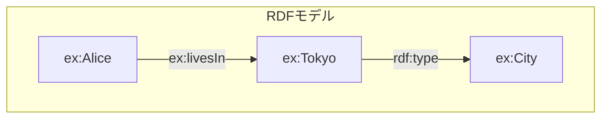
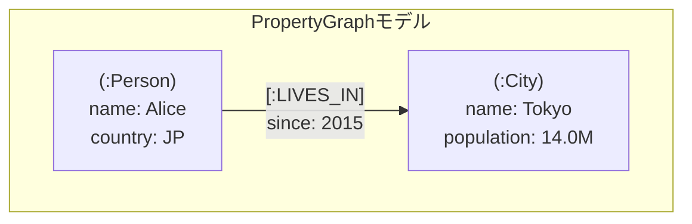

# RDF vs Property Graph：知識グラフの二大構造を徹底比較

近年、データの意味や関係性を表現する技術として「RDF（Resource Description Framework）」と「Property Graph」が注目されています。どちらもグラフ構造を用いて情報をモデル化しますが、その設計思想や用途には大きな違いがあります。本記事では、両者の特徴、構造、利用シーンを詳しく解説し、適切な使い分けのポイントを示します。

---

## 目次

1. [はじめに](#はじめに)
2. [RDF：意味論的ウェブの基盤](#rdf意味論的ウェブの基盤)
3. [プロパティグラフ（Property Graph）：探索を担う層](#プロパティグラフproperty-graph探索を担う層)
4. [RDF と Property Graph の比較](#rdfとproperty-graphの比較)
5. [適用例と選定基準](#適用例と選定基準)
6. [まとめ](#まとめ)

---

## はじめに

情報技術の進展に伴い、単なるデータの集積ではなく、データ間の意味的な関係性を明確に表現し活用するニーズが高まっています。グラフデータベースはこうしたニーズに応える技術であり、特に RDF と Property Graph は知識グラフ構築の二大アプローチとして存在感を示しています。

---

## RDF：意味論的ウェブの基盤

RDF は W3C によって標準化されたフレームワークで、主にウェブ上のリソースの意味を記述するために設計されました。RDF の基本単位は「トリプル（主語・述語・目的語）」であり、リソース間の関係を表現します。

### RDF の特徴

- **トリプル構造**：`(Subject, Predicate, Object)` の形式で情報を表現。
- **URI による一意識別**：すべてのリソースは URI で識別され、グローバルな結合が可能。
- **意味論的推論の基盤**：RDFS や OWL などの語彙や推論エンジンと連携し、意味の拡張や検証が可能。
- **標準化されたクエリ言語**：SPARQL による複雑な意味検索が可能。

### RDF の例

```turtle
@prefix ex: <http://example.org/> .

ex:Alice ex:livesIn ex:Tokyo .
ex:Tokyo rdf:type ex:City .
```

この例では、Alice が Tokyo に住んでいることと、Tokyo が City であることを示しています。

---

## プロパティグラフ（Property Graph）：探索を担う層

Property Graph はノードとエッジに属性（プロパティ）を持たせることで、データの柔軟な表現と効率的な探索を可能にします。特にグラフデータベース（Neo4j や JanusGraph など）で広く採用されており、実務的なクエリや分析に強みがあります。

### RDF と Property Graph の構造イメージ



> **図 1. RDF の典型的なトリプル**  
> 主語・述語・目的語の各リソースは URI で識別され、述語も一級のエッジとして表現される。`rdf:type` のような語彙はメタデータや推論の基盤になる。



> **図 2. Property Graph のノードとエッジ**  
> ラベルや属性をノード／エッジに直に保持できるため、トラバースや分析クエリで属性フィルタを同時に適用できる。

RDF はグローバルな識別子とオープンワールドの意味論を提供し、Property Graph はアプリケーション固有の表現と探索最適化に特化する、という棲み分けが図に示されています。

代表的な RDF ベースの知識グラフとして、Wikipedia を構造化した DBpedia や、コモンズ主導の Wikidata が挙げられます（Lehmann et al., 2015; Vrandečić & Krötzsch, 2014）。どちらもリンクトデータとして公開され、SPARQL エンドポイント経由で第三者がクエリを実行できる点が特徴です。

### Property Graph の特徴

- **ノードとエッジに属性を持つ**：属性はキー・バリュー形式で格納される。
- **ラベル付け**：ノードやエッジに複数のラベルを付けられ、分類が容易。
- **柔軟な構造**：スキーマレスで、データの追加や変更が容易。
- **効率的な探索**：グラフアルゴリズムやパス探索が高速。

---

Property Graph は、詐欺検知やサプライチェーンの可視化といったリアルタイム探索が求められる用途で採用が進んでおり、例えば PayPal は Neo4j ベースの Property Graph でトランザクション間の不正リンクを検出しています（Neo4j, 2022）。

---

## RDF と Property Graph の比較

| 項目         | RDF                                              | Property Graph                                                 |
| ------------ | ------------------------------------------------ | -------------------------------------------------------------- |
| データモデル | トリプル（Subject-Predicate-Object）             | ノードとエッジ、両方に属性を持つ                               |
| 識別子       | URI によるグローバル一意識別                     | グラフ内 ID とラベル                                           |
| 意味論       | オープンワールド仮定、単調推論                   | 形式仕様は未整備。多くの DB 実装は閉世界的に評価               |
| スキーマ     | RDFS/OWL による厳密な意味論                      | スキーマレスまたは柔軟なスキーマ                               |
| クエリ言語   | SPARQL（W3C 標準）                               | Gremlin、Cypher、PGQL、ISO/IEC 39075 (GQL)                     |
| 推論機能     | RDFS/OWL、SHACL などで推論・検証が可能           | 推論は限定的、アプリケーション実装依存                         |
| 標準化状況   | W3C 勧告として成熟                               | 実装主導。ISO/IEC 39075:2023 (GQL) が発行済み                  |
| 適用分野     | セマンティックウェブ、データ統合、ナレッジベース | ソーシャルネットワーク、トランザクション分析、リアルタイム探索 |

---

## RDF と Property Graph を接続するアプローチ

実システムでは、意味論層としての RDF と、運用・探索層としての Property Graph を併用するケースが増えています。代表的なアプローチを以下に挙げます。

- **デュアルスタック型グラフ DB**：Amazon Neptune は同一クラスタで RDF エンドポイント（SPARQL）と Property Graph エンドポイント（Gremlin/openCypher）を提供しますが、データロードやクエリエンジンは別系統です。RDF と PG の両方で利用したい場合は、それぞれのモデルに適合する形で取り込み・同期を行う前提になります。
- **双方向マッピング**：Neo4j の拡張モジュール「neosemantics (n10s)」は、RDF タートルを Property Graph へインポートする際の語彙マッピングや、Property Graph のエクスポートを RDF で表現する機能を提供します。GraphDB や Stardog といった RDF ファーストな製品でも、SPARQL CONSTRUCT・SHACL・外部 ETL を組み合わせて Property Graph 向けのビューやサブセットを生成する形で連携が行われています。
- **RDF-star / SPARQL-star**：W3C の RDF-star ワーキングドラフト（2024 年時点）は、トリプル自体にメタデータを付与できる拡張です。ドラフト段階ではあるものの、エッジ属性を扱う Property Graph との表現差を縮める取り組みとして注目されています。
- **メタデータ駆動の連携**：RML や ShEx のような記述言語を使って、外部ソースからの取り込み時に RDF 用語集と Property Graph スキーマを同時に管理するパターンも一般化しつつあります。

どの方法を選ぶにしても、URI 設計や語彙管理といった RDF 側の厳密さを保ちつつ、Property Graph 側ではラベルやプロパティをアプリケーション視点で調整する二層構造が鍵となります。

---

## 適用例と選定基準

### RDF が適しているケース

- 意味論的な推論や知識表現が必要な場合
- 標準化された語彙やオントロジーを利用したい場合
- 複数のデータソースを統合し、リンクデータとして公開する場合（例：DBpedia や Wikidata によるオープンデータ公開）

### Property Graph が適しているケース

- 大規模なグラフ探索やパス検索が中心の場合
- 柔軟なスキーマで高速なデータ操作が求められる場合
- ビジネスアプリケーションでのリアルタイム分析や可視化（例：PayPal による詐欺検知ワークロード（Neo4j, 2022））

---

## まとめ

RDF と Property Graph はそれぞれ異なる強みを持つグラフデータモデルです。RDF は意味論的な表現と推論に優れ、Property Graph は柔軟な属性管理と高速な探索に向いています。目的や用途に応じて適切に選択・組み合わせることで、より効果的な知識グラフ構築が可能となります。

今後も両者の技術進化と連携が進むことで、より高度で実用的な知識活用基盤が期待されます。

---

### 参考文献

- W3C (2014), _RDF 1.1 Concepts and Abstract Syntax_. https://www.w3.org/TR/rdf11-concepts/
- W3C RDF-star Working Group (2024), _RDF-star and SPARQL-star_（Working Draft）. https://w3c.github.io/rdf-star/cg-spec/
- AWS (2024), _Amazon Neptune User Guide — Working with the Property Graph and RDF Models_. https://docs.aws.amazon.com/neptune/
- Neo4j (2023), _neosemantics User Guide_. https://neo4j.com/labs/neosemantics/
- ISO/IEC JTC 1/SC 32 (2024 draft), _ISO/IEC 39075 Graph Query Language (GQL)_.
- Lehmann, J. et al. (2015), _DBpedia – A large-scale, multilingual knowledge base extracted from Wikipedia_. Semantic Web Journal 6(2). http://jens-lehmann.org/files/2015/swj_dbpedia.pdf
- Vrandečić, D., & Krötzsch, M. (2014), _Wikidata: A free collaborative knowledgebase_. Communications of the ACM 57(10). https://cacm.acm.org/magazines/2014/10/178785-wikidata/
- Neo4j (2022), _PayPal Fights Fraud with Neo4j_. https://neo4j.com/case-studies/paypal/

### 更新履歴

- **2025-10-30** — 初版公開

### 注記

本記事は AI を活用して執筆しています。
内容に誤りや追加情報があれば、Zenn のコメントよりお知らせください。

