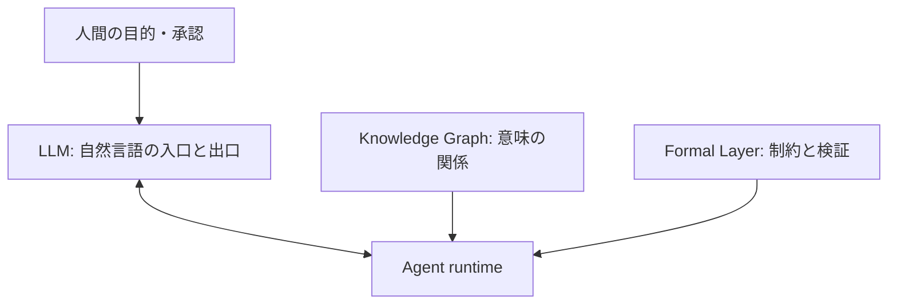

英語圏では、企業が**人間ではなく AI エージェントを相手先（購買・操作の当事者）とする**動きを、略称の **B2A** やフル表記の **Business-to-Agent** で説明する、という言い方が増えています（社内の「AI 活用」全般を指す **Business to AI** とは区別されることが多い）。**Business-to-Agent** を見出しに据えた英語記事の例は、後述の「海外での関連語と議論」内の小見出しに挙げます。本稿は、その**最新の整理を日本の読者に正しく伝える**ことを目的の一つにし、日本語表記では **BtoA** を主に使い、意味は **Business-to-Agent（AI エージェントを相手先とする設計・取引・最適化）** に固定します。

国内の note や SNS では **「toA」**（多くは **to AI Agent** の略）で語られることが多く、下記はその例です。**toA と BtoA は略の作り方は違っても、本稿が扱う問題意識（実行主体がエージェントに移る）は同じ**として読み替えられます。

- [顧客は人間ではない。プロが読み解く Claude が加速させる「toA」時代の生存戦略（TokiDoki / note）](https://note.com/jazzy_newt6179/n/n28f835ffad01)
- [Claude が加速させる「toA」という新潮流（パジ / note）](https://note.com/hajimeataka/n/nc0b26748e302)

前者は投資・マーケ視点で「ゼロクリック・ウェブ」や AEO（Answer Engine Optimization / Agent Engine Optimization）など、**人間ではなくエージェントが入口を握る**ことの帰結を論じています。**AEO** は業界・記事ごとに指す範囲や略の取り方がまだ固定されておらず、**Answer** と **Agent** のどちらを主に指すかも文脈依存です。後者はエージェント向けサービスを多数分類し、エージェントが自律するための**生存条件**を整理しています。

いずれも、メール・記憶・ブラウザ操作・認証・決済・マーケットプレイスなど、**AI エージェント向けの周辺プロダクトや議論が増えている**という認識は共有できます。

本稿ではそのうえで一歩踏み込み、**本当に起きている変化は「新しい顧客セグメントが増えたこと」だけではない**と考えます。

**ソフトウェアの実行主体そのものが変わり始めています。**

**BtoA** は市場の分類ラベルとしてだけ捉えるより、**計算主体（誰が・何として・どの権限で動くか）の転換**として読んだほうが、エンジニアリング上の含意が明確になります。

**本稿の主な価値**は、投資論やマーケ用語の解説ではなく、**AI エンジニアが BtoA／toA をバズワードのままにせず、設計レビューと優先度付けに落とすための「読み替え」と「先に埋める論点」**を提示することです。**ここでいう「読み替え」**は、**市場ラベルではなく実行主体・runtime として読む**ことです。**「先に埋める論点」**は、直後の**三つの問い**（主語・外付け・検証）に集約します。**外付け**は、本ブログの既存記事どおり **LLM に任せず形式レイヤに逃がす内容**を指します。海外語彙・経営論にも触れますが、いずれも**手を動かす人の判断軸に接続する補助線**として置いています。

---

## AI エンジニア向け：BtoA をどう解くか

SNS やニュースで **BtoA** や **toA** が出てきたとき、**言葉だけ拾って終わり**にしないための分解の仕方を、先に固定します。

1. **主語のチェック**　「新しい顧客」として語られていても、まず **ランタイム上で誰が連続的に手を動かすか（実行の主語）** を書き分ける（人・決め打ちの M2M・**LLM エージェント**など）。
2. **「外付け」のチェック（LLM に任せず形式レイヤに逃がすもの）**　人間向けの画面では、**例外の意味・暗黙の前提・その場の判断**を、利用者の頭の中で処理できていました。エージェントが主役になると、それを**プロンプト内だけに閉じたまま**では、再現性も監査も担保できません。[「LLM と RAG 盲信への警鐘」](https://zenn.dev/knowledge_graph/articles/rag-warning-2025-11) が整理するのと同じく、**どこから先を LLM に任せず、決定性のある外部レイヤ（形式レイヤ）に逃がすか**が設計の中心になります。**API・スキーマ・ポリシー・ログ・長期記憶の置き場**のどこに、何を**明示するか**を列挙する、という進め方です。メール・認証など**人向けにはすでに成熟した領域**に、BtoA 向けの新プロダクトが立ち上がるのは、**この逃がし（外付け）がまだ足りない**ことの裏返しとして読めます（形式レイヤの語彙は [「LLM/RAG の曖昧性を抑える『形式レイヤ』の実装ガイド」](https://zenn.dev/knowledge_graph/articles/formal-layer-llm-rag-2025-11)）。
3. **検証の所在のチェック**　モデル出力を信頼の根拠にせず、**どのレイヤが決定性を担保し、再現・監査・冪等を保証するか** を決める（形式レイヤ、評価ハーネス、業務定義）。

このあとの節は、この骨格に沿って配置しています。

| 読み取りの焦点                                | 主に対応する節                               |
| --------------------------------------------- | -------------------------------------------- |
| 主語が人からエージェントに変わるとは何か      | toC・toB と BtoA、枯れた領域の再発明         |
| 生存条件を「市場」ではなく runtime として読む | 「5 つの生存条件」、ミニシナリオ             |
| 本番で最初に詰まる技術論点                    | 技術視点：本番で詰まりやすいポイント         |
| 意味・制約・信頼をどう積むか                  | 5 条件だけでは足りない話、KG／形式レイヤ・図 |
| 価値が UI からどこへ移るか                    | BtoA が変えている価値の中心                  |

**経営・事業の論点**は、上の**三つの問いに沿った技術的な整理**を **PO・経営との優先度交渉に翻訳するときの材料**です。**海外での関連語**は、英語の記事・仕様を追うときの **用語の対応表**です。いずれも本稿の主線（三つの問いによる読み替え）を置き換えるものではありません。

CTO 層の読者にも同じ軸はそのまま使えますが、**第一の想定読者は設計・実装・レビューに携わる AI エンジニア**です。

---

## 海外での関連語と議論（BtoA との接点）

**「toA」は日本語圏の記事や SNS で目にしやすい**一方、英語圏では **B2A / Business-to-Agent** に加え、同じ問題意識を **machine customers** と呼ぶ調査会社の整理、**Agentic Commerce** の仕様など、語彙が分かれています。用語は一致しなくても、**「人間ではなく機械が経済活動の当事者になる」**という軸では重なります。

### Machine Customers（Gartner）

調査会社 Gartner は、対価を支払って財やサービスを得る**非人間の経済主体**を **machine customers** と呼び、デジタルコマースに匹敵する規模の機会になるとしています（連結デバイスや補充アルゴリズム、インテリジェント・アシスタントなど、LLM エージェントに限らない広い定義）。生成 AI の進展が、この動きを加速させる、という趣旨の説明も公表されています。プレスリリースの見出しは**調査会社のメッセージング**であり、**数値予測の検証は本稿のスコープ外**です（本稿では問題意識の出典として参照します）。

- [Gartner Says Machine Customers Represent One of the Biggest New Growth Opportunities of the Decade](https://www.gartner.com/en/newsroom/press-releases/03-16-2023-gartner-says-machine-customers-represent-one-of-the-biggest-new-growth-opportunities-of-the-decade)（Gartner プレスリリース、2023）
- 解説コラム（Gartner アナリスト寄稿）：[Machine Customers Offer Limitless Opportunities](https://www.informationweek.com/machine-learning-ai/machine-customers-offer-limitless-opportunities)（InformationWeek、2024）

本稿の「実行主体が AI エージェントに移る」という主張と、**完全に同じ枠組みではありません**（machine customers は IoT や自動発注など、人間の LLM エージェント以外も含む）。ただし「**人間可読のストアフロントだけでは足りない**」「**API・データ交換・イベント**で機械顧客に応える」といった含意は、**BtoA の議論**と接続できます。

### Agentic Commerce Protocol（OpenAI / Stripe）

**商取引の当事者として AI エージェントを明示的に想定した**動きとして、OpenAI と Stripe が関与する **Agentic Commerce Protocol（ACP）** があります。商品カタログの構造化フィードや、エージェント経由の購入フローなど、**「エージェントが買い手の代理」として動く**前提の仕様が公開されています。

- [Agentic Commerce Protocol | OpenAI Developers](https://developers.openai.com/commerce/)（公式ドキュメント）
- [agentic-commerce-protocol / agentic-commerce-protocol](https://github.com/agentic-commerce-protocol/agentic-commerce-protocol)（GitHub 上の仕様リポジトリ）

日本語の note で触れられる **AEO（Answer Engine Optimization / Agent Engine Optimization）** や「ゼロクリック・ウェブ」とも、**発見・比較・購入の入口が人間のクリックではなくエージェントに寄る**という点で、ACP や machine customers 議論と並べて読むと、**国内語彙と海外語彙の対応関係**が掴みやすいです。

### 英語圏での「B2A / Business-to-Agent」という語

**Business-to-Agent** を見出しに据えた英語の解説もあります（例：[Is B2C is Dead?—B2A is Here: Why AI Agents Are Your New Customers（The CDO TIMES、2025）](https://cdotimes.com/2025/02/07/is-b2c-is-dead-b2a-is-here-why-ai-agents-are-your-new-customers/)）。学術用語ではなく**メディア・ベンダーごとのラベル**であり、定義は厳密には一致しません。本稿では **machine customers** や **ACP** と同様、**問題意識（機械が購買・操作の相手先になりうる）**をつなぐための**裏取り用の参照**として位置づけます。

---

## toC・toB と BtoA：そもそも「主体」が違う

toC も toB も、**典型的な画面・契約・承認のフロー**では、誰に売るかは違っても、クリックやフォーム、現場判断の最後に立つ**主体は人間**でした。人が検索し、比較し、例外が出れば人が解釈します。多くのプロダクトは**人間が読み、触り、意味づけられる**前提で設計されてきました。

一方で、B2B には **API 連携・バッチ・ヘッドレス**のように、**機械同士が主経路**の処理も以前からあります。ここは **BtoA と完全に無関係**ではなく、**すでに「人間のクリック以外が実行の中心」**になりうる領域です。それでも **BtoA** と決定的に違うのは、**あらかじめ固定された IF とバッチ設計だけでなく、自然言語とツール呼び出しを介した試行錯誤が、業務の主経路になりうる**点です。目的・例外・優先度が**ランタイム上で編成**され、人は目的・上限・承認に寄り、**連続的に状態を更新し続ける主語が AI エージェント**になります。

つまり BtoA は「toC でも toB でもない第 3 のセグメント」というより、**顧客の属性ラベルが増えたのではなく、実行の主体が人から AI にずれる**という意味で、これまでとは構造が大きく違います。

| 観点           | toC / toB（従来の前提）                  | BtoA（本稿の整理）                                               |
| -------------- | ---------------------------------------- | ---------------------------------------------------------------- |
| **操作の主体** | 人が UI を通じて操作する（典型）         | エージェントが API・ツール連続で操作する                         |
| **曖昧さ**     | 文言の揺れや例外は人が吸収する           | 曖昧さを機械が処理するには、仕様・制約の明示が必要               |
| **状態と文脈** | 多くを人の頭とセッション外の記憶に預ける | セッションを跨いだ状態・権限・記憶をシステムが保持する必要がある |
| **責任と監査** | 人が読めばよい説明・画面                 | 誰が何をしたかを機械的に検証できることの比重が高い               |

この表は「BtoA だけが正しい」という意味ではありません。**同じ Web サービスでも、人が主に使うのか、エージェントが主に使うのかで、求められる設計が変わる**という整理です。

「顧客が増えた」より**「走らせるプロセスの主語が誰か」**、**誰向けの UI を増やすか**より**どの主体がランタイム上で連続的に振る舞うか**が問われます。これが「新市場」の話より先に、実行主体の問題として切り出したい点です。

---

## なぜ「枯れた領域」が AI 向けに再発明されるのか

興味深いのは、BtoA 向けサービスの多くがまったく新しいカテゴリではないことです。

- メール
- 記憶
- 認証
- ブラウザ操作
- 外部ツール接続
- 決済

どれも人間向けには成熟しきった領域です。それにもかかわらず、AI エージェント向けには新しいサービスが次々に立ち上がっています。

これは「市場の空白があったから」ではありません。

**利用主体が変わったから必要条件が変わった**のです。

人間向けサービスはおおむねこう設計されてきました。

- UI 中心
- 曖昧さを人間が吸収する
- エラー時に人が介入できる
- 文脈は人間が保持する
- 判断は人間が行う

一方、AI エージェント向けサービスでは前提がまったく異なります。

- API 中心
- 曖昧さを吸収できない（または吸収コストが致命的）
- 自律実行が前提
- セッションを跨ぐ状態保持が必要
- 権限と制約が明示されている必要がある

つまり BtoA は成熟市場の単純な延長ではありません。

**人間が暗黙に担っていた補正機能を、システム側の形式レイヤに外付けする動き**です。

---

## 「5 つの生存条件」は市場分類ではなく runtime requirements

エージェントが自律的に動くために、次の 5 つが必要だという整理があります。[パジ（2026）の note](https://note.com/hajimeataka/n/nc0b26748e302) でエージェント向けサービスを分類する文脈に沿った**本稿での言い換え**です（元記事の見出し語と 1 対 1 ではありません）。

- 存在証明
- 実行環境
- 操作手段
- 記憶
- 経済活動

これはサービスカテゴリの棚卸しのように見えます。しかし実際には違います。

**自律エージェントの実行要件そのもの**です。

言い換えると次のようになります。

| 生存条件（語り口） | 技術的意味（本稿での呼び方） |
| ------------------ | ---------------------------- |
| 存在証明           | agent identity / authority   |
| 実行環境           | agent runtime                |
| 操作手段           | world interface              |
| 記憶               | persistent context substrate |
| 経済活動           | transaction capability       |

つまり BtoA 向けサービスの増加は、単に「新しい市場が膨らんだ」だけではありません。

**agent runtime stack が形成され始めている**という読みができます。

さらに整理すると、BtoA 向けサービスは大まかに二層に分かれます。

**基盤層**

- identity
- runtime
- interface
- memory
- settlement

**運用・拡張層**（監視、評価、ガードレール、通信、音声、生成、orchestration など）

この構造が見えてくると、BtoA は単なるサービス一覧ではなく、**どのレイヤを自分で持ち、どこを外部化するか**の設計問題になります。

### ミニシナリオ：二重発注のあとで見えるもの

社内の調達エージェントが、**同じ購買依頼に対しタイムアウト後に再試行し、発注 API を二度呼び、同一部品がダブル発注された**とします。人間がブラウザで操作していれば「画面を一度しか進めていない」感覚で防げたかもしれないギャップが、エージェントでは**断片化したログだけでは再現しづらい**形で現れます。

同時に問われるのは、(1) 発注 API に **冪等キー**や重複検知があるか、(2) どの金額・カテゴリで **人の承認**を挟むか、(3) 「発注完了」の **業務上の定義**が形式レイヤ側で固定されているか、です。いずれも後述の **semantic contract** と **Formal Layer** に接続します。**なぜ外付けの規則が要るか**の構造論は、後述の技術節と [「LLM と RAG 盲信への警鐘」](https://zenn.dev/knowledge_graph/articles/rag-warning-2025-11) に集約し、ここでは繰り返しません。

これは **BtoA 固有の新種のバグ**というより、**分散システムと業務システムで積み上げてきた教訓が、エージェント経由で一気に表に出る**イメージとして捉えるとよいです。

---

## 技術視点：本番で詰まりやすいポイント

前節の **外付け（形式レイヤに逃がすもの）**と**検証の所在**のうち、**本番に出した瞬間に露呈しやすい論点**を列挙します。BtoA を「新しい API の束」として片付けると、運用で想定外に落ちやすいです。人間向け Web とは**失敗の形・観測の単位・再試行の前提**が違います。

後述の **LLM・KG・形式レイヤの関係図**（「BtoA を本番で回すには…」の節）では、**Agent runtime** が **Formal Layer（制約・検証）** と **Knowledge Graph（意味の関係）** に支えられるイメージを示します。**本節は、その外周で具体的に壊れやすい場所**に対応する整理です。

代表的な論点だけ挙げます。

### 観測・デバッグ

人間がブラウザで操作するとき、多くは「画面の状態」が真実です。エージェント実行では、**中間のツール呼び出し・部分失敗・再試行**が常態化します。HTTP アクセスログだけでは足りず、**エージェント単位のトレース**（どの目的に対し、どのツールが何回、どのパラメータで呼ばれたか）がないと、インシデントの再現が困難になります。

### 冪等性と副作用

同じ指示の再実行、タイムアウト後のリトライ、並列サブエージェントが同じリソースを触る、といった状況が起きやすいです。**二重課金・二重登録・部分だけ成功**を防ぐには、ツール側の冪等キーや、業務上の「成功の定義」を形式レイヤで固定する必要が出てきます。

### ツール契約（スキーマを超えた約束事）

OpenAPI のパラメータが揃っていても、**「この操作はいつ合法か」「成功したらどのエンティティがどう変わるか」**が共有されないと、エージェントは安定しません。これが前節の **semantic contract** です。社内 API ほど、人間の口頭運用で握っていた前提が露出します。

業務オブジェクトやコードベースを **KG としてエージェントに渡す**場合も同様で、**グラフの辿り方（入口・向き・深さ・証拠の出し方）を固定しないと**、実行ごとにクエリ解釈がブレ、ツール呼び出しが不安定になります。Skill やプロジェクトルールに **探索の契約を書く**実務例は、[「Claude Code / Cursor Skill における Graph Traversal Contract」](https://zenn.dev/knowledge_graph/articles/graph-traversal-contract-skill) が、**semantic contract を補強する一つの型**として参照できます（形式レイヤ全般は [形式レイヤの実装ガイド](https://zenn.dev/knowledge_graph/articles/formal-layer-llm-rag-2025-11)）。

### 権限・秘密情報

エージェントに渡すのは、ユーザーの OAuth トークンなのか、サービスアカウントなのか、委任された決済上限はどこまでか。**スコープの最小化**と**ローテーション・失効**が、従来の「人がログインする」前提より厳しく問われます。

### 評価と回帰

UI の E2E テストに加え、**ツール選択の妥当性・ポリシー逸脱の有無・同じ入力での揺らぎ**をどう測るかが課題になります。モデルのアップデートで挙動が変わるため、**評価ハーネスとゴールデンセット**を資産として持つかどうかが、継続運用の分岐点になります。

### コストとレイテンシ

トークン課金に加え、外部ツールの従量課金・検索 API・サンドボックス実行が積み上がります。**誰のどのタスクにいくらかかったか**の帰属が曖昧なままだと、事業側の判断ができません。

### ツール接続の標準化（MCP など）

エージェントと外部システムをつなぐ枠組みとして **MCP（Model Context Protocol）** などの動きがあります。接続の「USB-C 化」に近い利点がある一方、**レート制限・認証・野良サーバのリスク**など、運用上の論点は別です。詳しくは [「MCP の課題とナレッジグラフ」](https://zenn.dev/knowledge_graph/articles/mcp-knowledge-graph) を参照してください。

**従来の分散システムと続き物の論点も多い**です。冪等性は決済 Webhook やメッセージング、分散トレースはマイクロサービス、権限の最小化はゼロトラストでも語られてきました。BtoA で変わるのは用語そのものより、**自然言語とモデルの揺らぎを挟んだうえで、問題が表に出やすい**点です。LLM に真偽・整合性を期待しない**構造的理由**は [「LLM と RAG 盲信への警鐘」](https://zenn.dev/knowledge_graph/articles/rag-warning-2025-11) が整理し、**何を形式レイヤに逃がすか**の設計語彙は [「LLM/RAG の曖昧性を抑える『形式レイヤ』の実装ガイド」](https://zenn.dev/knowledge_graph/articles/formal-layer-llm-rag-2025-11) が補います。

これらはいずれも「モデルを賢くする」より先に、**実行基盤と契約・観測の設計**が詰まる、という意味で、本稿の「実行主体の変化」と同じ方向の話です。

---

## しかし 5 つの条件だけではエージェントは「社会」で動けない

ここが重要なポイントです。

存在証明、実行環境、操作手段、記憶、経済活動。これだけ揃っても、エージェントはまだ**社会的な実行主体**として安定しきりません。

不足しがちなのは次の 3 つです。

- **意味**
- **制約**
- **信頼**

### 意味

ここでいう「意味」は、**ツールが何を達成するかを関係者と機械の両方が同じ解釈で共有できるか**という層です。**OpenAPI のパラメータを超えた semantic contract** の整理は、すでに前節「ツール契約（スキーマを超えた約束事）」で扱いました。設計パターンや形式レイヤとの対応づけの詳細は [「LLM/RAG の曖昧性を抑える『形式レイヤ』の実装ガイド」](https://zenn.dev/knowledge_graph/articles/formal-layer-llm-rag-2025-11) を参照してください。本節では **制約・信頼**へ進むために位置だけ揃えます。

### 制約

人間の代わりに動く以上、どこまで動いてよいかが定義されていなければなりません。

- どの権限で実行するのか
- どの記憶にアクセスできるのか
- どの範囲の決済が許可されているのか
- どの操作は禁止されているのか

これは **policy** の問題です。

### 信頼

エージェントが増えるほど、選定・比較・評価・監査が必要になります。

- このエージェントは何ができるのか
- どんな実績があるのか
- どの環境で動作保証されているのか
- 誰が評価したのか
- どの制約下で安全に動くのか

これは **provenance と trust** の問題です。

まとめると次のようになります。

**BtoA 市場（エージェントを相手先とする設計・取引）**は 5 つの生存条件で立ち上がりますが、成熟するためには意味・制約・信頼の層が必要になります。

---

## BtoA を本番で回すには、意味基盤と制約基盤が実質的に問われる

ここまで整理すると、次のことが見えてきます。

AI エージェントが継続的に仕事を実行するには、

- identity
- capability
- memory
- authority
- tool
- outcome

の関係を**関係として**保持する必要があります。しかしこれらをプロンプトだけで管理するのは限界があります。ドキュメントやログ単体でも、**意味と制約を一貫して機械処理可能な形で持ち上げる**のは難しいです。

**ナレッジグラフ（KG）**は、その関係を意味構造として結びつける候補の一つです。エージェント・ツール・権限・記憶・実行対象・成果物などを、グラフ上の関係として扱えます。コーディングエージェント文脈での動機づけや MCP との組み合わせは、[「Claude Code / Cursor Skill における Graph Traversal Contract」](https://zenn.dev/knowledge_graph/articles/graph-traversal-contract-skill) の冒頭に詳しくあります。**探索の契約**で semantic contract を補強する話は、前節「ツール契約」と重複するため、本節では繰り返しません。

一方、**何が許可され、どこまで実行できるか**をグラフの話だけに還元するのは難しく、**ポリシー・検証・実行境界**は別の仕組みで扱う必要があります。**形式レイヤの四種（SQL・KG・ルールエンジン・制約ソルバ）や KG を意味レイヤとして扱う定義**は [形式レイヤの実装ガイド](https://zenn.dev/knowledge_graph/articles/formal-layer-llm-rag-2025-11) と [LLM 依存度を下げる業務 AI アーキテクチャ設計](https://zenn.dev/knowledge_graph/articles/llm-formal-layer-architecture) の主たる説明領域であり、本稿では **BtoA 文脈での配置（図と一文）**に留めます。

本稿の図では、説明のため**「意味の関係」を KG**、**許可・検証・境界を FL** と並べて示します。実装では、OPA のようなポリシーエンジンや監査ログ中心の設計など、**KG を併用しない構成**も十分あり得ます。重要なのは、**意味と制約をプロンプト内に閉じず、外付けで扱えるか**です。

詳細は [「LLM/RAG の曖昧性を抑える『形式レイヤ』の実装ガイド」](https://zenn.dev/knowledge_graph/articles/formal-layer-llm-rag-2025-11) や [「LLM 依存度を下げる業務 AI アーキテクチャ設計」](https://zenn.dev/knowledge_graph/articles/llm-formal-layer-architecture) を参照してください。

**「技術視点：本番で詰まりやすいポイント」**で挙げた観測・冪等性・ツール契約・権限・評価・コストは、いずれも下図の **Agent runtime** が **FL（制約・検証）** と **KG（意味の関係）** に依存する**具体的な理由**に対応します。図は抽象モデルであり、実装ではコンポーネントを統合したり、KG を使わずポリシーとログだけで回す構成もあり得ます。

ざっくりとした関係を図示すると次のようになります。

BtoA を本番で広げていくほど、**単一モデルの性能だけではなく、LLM の外側にある意味基盤と制約基盤**がボトルネックになりやすい、という見方ができます。

**ナレッジグラフの入門・RAG との違い・GraphRAG と意味レイヤとしての KG の切り分け**は、[「ナレッジグラフ入門」](https://zenn.dev/knowledge_graph/articles/knowledge-graph-intro)、[「RAG なしで始めるナレッジグラフ QA」](https://zenn.dev/knowledge_graph/articles/kg-no-rag-starter)、[「RAG を超える知識統合」](https://zenn.dev/knowledge_graph/articles/beyond-rag-knowledge-graph) で既に展開しています。本稿では **実行主体が変わったときに、その知識層がなぜ表に出るか**に限定します。

---

## BtoA が変えているのはソフトウェアの価値の中心

これまでソフトウェアは人間が使うものでした。だから価値は、

- UI
- UX
- discoverability
- documentation

に置かれやすかったです。

しかしエージェントが利用主体になると、重要になるのは次のような軸です。

- semantic addressability（意味的に参照・実行できること）
- executable policy（実行可能なポリシー）
- capability description（能力の機械可読な記述）
- provenance（出自・監査可能性）
- trust structure（信頼の構造）

つまり価値の中心は、**UI から runtime substrate（実行を支える下層）へ移動**しています。

エージェントの「自律度」の整理として、[「AI 解像度の高いエンジニア向けの AI エージェント分類」](https://zenn.dev/knowledge_graph/articles/ai-agent-classification-for-engineers-2026) のような枠組みとも接続できます。重要なのは、レベルが上がるほど、**下層の意味と制約の設計**が成果を決めるという点です（検索回答と業務実行の境界は前節でリンクした [「RAG を超える知識統合」](https://zenn.dev/knowledge_graph/articles/beyond-rag-knowledge-graph) を参照）。

---

## 経営・事業の論点（エンジニア向けの翻訳レイヤ）

ここまでの **主語・外付け・検証**という枠組みを、プロダクトオーナーや経営と会話するときに**どう言い換えるか**の材料です。本稿の中心がエンジニアの思考法であることは変わりません。

技術だけの話に見えても、BtoA は**誰が何に責任を持ち、どこに金と人を配分するか**を揺らします。意思決定で押さえやすい軸に整理します。

### 投資の置き場所のずれ

従来は「モデル性能」「チャット UI」「プロンプト」に予算が寄りがちでした。実行主体がエージェントになると、**ツール接続の堅牢性・ポリシー・監査・評価基盤・データの機械可読化**に同じかそれ以上の投資が必要になる、という論点が立ち上がります。海外の **machine customers** や **Agentic Commerce** の議論が、いきなり「マーケ予算」ではなく**デジタル基盤・API・カタログ品質**に言及するのも、同じ構造です。

差別化の中心が「生の知性」より **何に使うか（プロセス・ワークフロー・文脈）** に残る、という見方は、本ブログで整理した a16z の論考紹介 [「AI はアプリケーションソフトを食べる」](https://zenn.dev/knowledge_graph/articles/a16z-ai-will-eat-application-software) とも噛み合います。**BtoA で問われる runtime substrate** は、そのプロセスを機械が実行するための下敷きだと捉えられます。一方で、エージェントが組織の知識を再利用できないままだと学習ギャップが固定化する、という話は [「GenAI Divide とナレッジグラフ」](https://zenn.dev/knowledge_graph/articles/genai-divide-knowledge-graph) が別角度から補います。

### ガバナンスとステークホルダ

エージェントに業務を任せると、承認者は**事業責任者**だけでは済みません。**法務**（契約・代理・自動決済）、**セキュリティ**（権限・漏えい・サプライチェーン）、**財務**（支出上限・監査証跡）、**CS／ブランド**（誤作動時の顧客影響）が同時に絡みます。「PoC は成功したが本番化で止まる」典型は、**このテーブルが後から初めて揃う**パターンです。

### リスクの種類が変わる

- **オペレーションリスク**：誤ったツール呼び出しによる誤発注・誤更新
- **レピュテーション**：エージェント経由で「選ばれない」「誤解される」ブランド被害（AEO・構造化データの欠落）
- **ベンダー依存**：特定モデル／エージェント基盤／BtoA 向け SaaS への固定と、**出口コスト**
- **説明責任**：規制当局・取引先・株主に対し、**自動判断の根拠**をどう示すか

いずれも「AI を入れた」こと自体より、**委任の境界が変わった**ことから生じます。

### 指標（KPI）の置き換え

人間向けの**クリック率・滞在時間**だけでは足りず、たとえば次のような軸が並立しやすくなります。

- **タスク完遂率**（エージェントが目的を達した割合）と**人へのエスカレーション率**
- **ポリシー逸脱件数**（禁止操作の試行やブロック）
- **エージェント経由の売上・コスト**（ツール課金・トークンを含む単位経済）
- **機械可読性**（スキーマ整備率、カタログ鮮度、API の安定性）

経営と現場で**同じ数字を見る**ためには、前節の技術視点（観測・帰属）とセットで設計する必要があります。

### 競争上の含意

競合が**エージェントにとって買いやすい API・データ・信頼シグナル**を先に整えると、自社は「人間向けサイトは魅力的でも、エージェントの選択肢に入らない」状態になり得ます。これは技術だけでなく、**プロダクトの優先度付けとパートナー戦略**の話です。

本稿では ROI の数値モデルや組織図までは扱いませんが、**実行主体の変化は、技術ロードマップと事業・リスクの意思決定を分離できない**、というのが経営視点の要約です。

### 本稿があえて固定しないこと

実務では **エージェント用ポリシーの最終オーナー**（デジタル・セキュリティ・事業・法務のどこを主軸にするか）や、**クラウド費用と人件費のどの科目に計上するか**は、組織と会計規程で異なります。本稿では意思決定の**型**だけ示し、**役職名や会計処理の正解を一つに決めない**ようにしています。

---

## まとめ：BtoA は「AI 向けサービス市場」ではなく基盤条件の露出

BtoA は新しい顧客カテゴリというより、**AI エージェントが現実の業務を実行するために必要な条件が、初めて可視化された状態**と捉えられます。BtoA 時代に重要なのは、AI エージェントを賢く見せることだけではなく、**意味構造と制約構造を定義できること**です。

**エンジニアが持ち帰る三つの問い**（冒頭のチェックリスト）に戻ると、**実行の主語は誰か**、**暗黙の前提を形式レイヤのどこに外に出したか（外付け）**、**何をもって成功・失敗と検証するか**です。本文の「5 つの生存条件」（誰として・どの権限で・何を記憶し・どの関係の中で・どの制約の下で動くか）は、この三問いを**ランタイム要件として分解した**イメージとして読めます。**BtoA** や **toA** という語が出た議論では、まずここを埋めてから、モデル選定や BtoA 向け SaaS の可否に進むと、未解のまま積み上がりにくくなります。

---

## 本稿と既存記事の役割分担

**AI エンジニア向けの三つの問い（主語・外付け・検証）**という主線を薄めずに、詳細は専門記事へ読者を送るためのルーティングです。下表は「本稿をどこまで読めばよいか」の補助であり、主価値の置き換えではありません。

本ブログでは題材が重なる記事が多いため、**本稿の位置づけ**を明示しておきます。

| 本稿ですること                                                                         | 本稿で深掘りしないこと（参照先）                                                                                                                                                                                                                                |
| -------------------------------------------------------------------------------------- | --------------------------------------------------------------------------------------------------------------------------------------------------------------------------------------------------------------------------------------------------------------- |
| **BtoA／実行主体**というラベルを、市場分類ではなく**ランタイムと責任の転換**として読む | 形式レイヤ各論の実装手順 → [形式レイヤの実装ガイド](https://zenn.dev/knowledge_graph/articles/formal-layer-llm-rag-2025-11)、[業務 AI アーキテクチャ](https://zenn.dev/knowledge_graph/articles/llm-formal-layer-architecture)                                  |
| 本番で表に出る**観測・冪等・契約**などの論点を、BtoA 文脈に接続する                    | LLM が真偽を保証しない**構造論の本丸** → [LLM と RAG 盲信への警鐘](https://zenn.dev/knowledge_graph/articles/rag-warning-2025-11)                                                                                                                               |
| **MCP・KG・探索契約**への入口                                                          | MCP の負荷・セキュリティ・意味キャッシュ → [MCP の課題とナレッジグラフ](https://zenn.dev/knowledge_graph/articles/mcp-knowledge-graph)、探索契約の書き方 → [Graph Traversal Contract](https://zenn.dev/knowledge_graph/articles/graph-traversal-contract-skill) |
| **自律度の段階**へのリンク                                                             | 自動運転レベルとの対応の詳細 → [AI エージェント分類](https://zenn.dev/knowledge_graph/articles/ai-agent-classification-for-engineers-2026)                                                                                                                      |
| **プロセス・モート・学習ギャップ**への経営接続                                         | a16z 論考の要約全体 → [アプリを食べる記事](https://zenn.dev/knowledge_graph/articles/a16z-ai-will-eat-application-software)、学習構造 → [GenAI Divide とナレッジグラフ](https://zenn.dev/knowledge_graph/articles/genai-divide-knowledge-graph)                 |
| **RAG／GraphRAG／KG**の混同防止の一言                                                  | 知識統合の本論 → [RAG を超える知識統合](https://zenn.dev/knowledge_graph/articles/beyond-rag-knowledge-graph)、入門 → [ナレッジグラフ入門](https://zenn.dev/knowledge_graph/articles/knowledge-graph-intro)                                                     |

---

## 参考・出典

### 日本語（note）

- TokiDoki（2026-03-26）.[顧客は人間ではない。プロが読み解く Claude が加速させる「toA」時代の生存戦略](https://note.com/jazzy_newt6179/n/n28f835ffad01)（note）
- パジ（2026-03-26）.[Claude が加速させる「toA」という新潮流](https://note.com/hajimeataka/n/nc0b26748e302)（note）

### 海外（英語・公式・一次に近い資料）

- [Is B2C is Dead?—B2A is Here: Why AI Agents Are Your New Customers](https://cdotimes.com/2025/02/07/is-b2c-is-dead-b2a-is-here-why-ai-agents-are-your-new-customers/)（The CDO TIMES、2025。**Business-to-Agent** ラベルの英語裏取り用）
- [Gartner Says Machine Customers Represent One of the Biggest New Growth Opportunities of the Decade](https://www.gartner.com/en/newsroom/press-releases/03-16-2023-gartner-says-machine-customers-represent-one-of-the-biggest-new-growth-opportunities-of-the-decade)（Gartner プレスリリース、2023）
- [Machine Customers Offer Limitless Opportunities](https://www.informationweek.com/machine-learning-ai/machine-customers-offer-limitless-opportunities)（InformationWeek、Gartner アナリスト寄稿、2024）
- [Agentic Commerce Protocol | OpenAI Developers](https://developers.openai.com/commerce/)（OpenAI）
- [agentic-commerce-protocol / agentic-commerce-protocol](https://github.com/agentic-commerce-protocol/agentic-commerce-protocol)（GitHub）

### 本ブログ内の関連記事（本稿で参照）

- [LLM と RAG 盲信への警鐘](https://zenn.dev/knowledge_graph/articles/rag-warning-2025-11)（LLM に真偽を期待しない構造）
- [LLM/RAG の曖昧性を抑える『形式レイヤ』の実装ガイド](https://zenn.dev/knowledge_graph/articles/formal-layer-llm-rag-2025-11)
- [LLM 依存度を下げる業務 AI アーキテクチャ設計](https://zenn.dev/knowledge_graph/articles/llm-formal-layer-architecture)
- [MCP の課題とナレッジグラフ](https://zenn.dev/knowledge_graph/articles/mcp-knowledge-graph)
- [Claude Code / Cursor Skill における Graph Traversal Contract](https://zenn.dev/knowledge_graph/articles/graph-traversal-contract-skill)（KG の探索契約）
- [AI 解像度の高いエンジニア向けの AI エージェント分類](https://zenn.dev/knowledge_graph/articles/ai-agent-classification-for-engineers-2026)
- [RAG を超える知識統合](https://zenn.dev/knowledge_graph/articles/beyond-rag-knowledge-graph)（GraphRAG と KG の区別）
- [AI はアプリケーションソフトを「食べる」](https://zenn.dev/knowledge_graph/articles/a16z-ai-will-eat-application-software)（プロセス・モート）
- [GenAI Divide とナレッジグラフ](https://zenn.dev/knowledge_graph/articles/genai-divide-knowledge-graph)（学習ギャップ）
- [ナレッジグラフ入門](https://zenn.dev/knowledge_graph/articles/knowledge-graph-intro) / [RAG なしで始めるナレッジグラフ QA](https://zenn.dev/knowledge_graph/articles/kg-no-rag-starter)（本文中でも言及）

---

## 更新履歴

- 2026-03-29: 初版公開

---

## フィードバック受け付け

BtoA／toA の定義の取り方、**三つの問いへの落とし方**、英語圏の B2A との対応、本ブログ内の関連記事との接続の仕方など、誤りや補強したい点があれば、Zenn のコメントでお知らせください。

