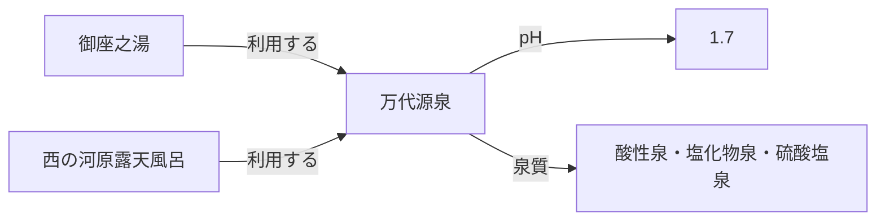

X で「温泉オントロジー」という言葉を見かけました。気になって、GitHub の [kazuhitogo/onsentology](https://github.com/kazuhitogo/onsentology) と、Qiita の「[温泉オントロジーを作って『整理されたデータ』の意味を測る](https://qiita.com/kazuneet/items/8b890ba7903326209729)」を読んでみました。

このプロジェクトでは、温泉施設や源泉、泉質の関係を RDF/OWL で表し、LLM がツールを使って調べられるようにしています。ところが、グラフに入っている情報を読みやすい Markdown に書き出して渡しても、LLM は同じくらい正確に答えられました。

ここで素朴な疑問が出ます。

> Markdown で答えられるなら、わざわざオントロジーを作る意味はどこにあるのでしょうか。

ここでいうオントロジーは、「施設」「源泉」「泉質」といった言葉の意味と、それらがどうつながるかを決めたルール集です。RDF/OWL は、そのルールとデータをコンピューターが読める形で書く方法です。

温泉トロジーのデータを使って考えてみます。先に結論を言うと、今回のような小さなデータでは、LLM に情報を渡すだけなら Markdown で十分でした。ただし、それは「データの管理も Markdown が一番よい」という意味ではありません。ポイントは、質問の難しさよりも、**同じ情報を何度も直すようになったか、違うシステムの間で言葉の意味を揃えたくなったか**です。

## まずは Markdown と比べてみる

元の検証では、pH、泉質、湯の使い方、適応症などについて 12 問を出しています。たとえば、次のような質問です。

1. 草津の湯畑源泉の pH はいくつか
2. 湯畑・万代・煮川で pH はどう違うか
3. 有馬の金の湯はかけ流しか
4. 高血圧の薬を飲んでいる人が草津の湯に入ってよいか
5. 玉川温泉の湯は飲めるか。1 日どれくらいまでか
6. 加水・加温・循環ろ過・消毒をしていない湯はあるか

ここで試しているのは回答方法です。実際に入浴や飲泉をしてよいかを判断するものではありません。

比較した条件は次のとおりです。

| 条件 | LLM が情報を調べる方法 |
| ---- | ---------------------- |
| 素の LLM | 追加データなし。モデルがもともと持っている知識だけで答える |
| 揃えた Markdown | 施設ごとに同じ項目を並べた Markdown を検索する |
| オントロジー | RDF/OWL に入った施設・源泉・泉質を専用ツールで検索する |

「揃えた Markdown」は、Web の記事をそのまま集めたものではありません。グラフから情報を取り出し、どの施設も同じ見出し、同じ順番で読めるようにした文書です。加水しているか確認できない場合も、空欄にせず「不明」と書いてあります。普通の文章というより、Markdown で作った表に近いものです。

ここは大事な点です。この実験で比べているのは、**整理済みの情報を LLM にどう渡すか**です。元の情報を集めて項目を揃える手間や、あとから更新する手間まで比べているわけではありません。

また、RDF のファイルと Markdown のファイルを LLM に直接読ませた比較でもありません。片方は RDF/OWL を調べる専用ツール、もう片方は Markdown を検索するツールを使っています。つまり、ファイル形式だけでなく、検索ツールまで含めた比較です。

12 問を各モデルで 3 回ずつ実行した結果がこちらです。数字は、正しい施設名や数値など、あらかじめ決めた採点項目をどれだけ満たしたかを表します。文章の意味ではなく文字のパターンで採点しているため、言い方が違うだけで点を落とすこともあります。

| モデル | 素の LLM | 揃えた Markdown | オントロジー（当時の検索ツール） |
| ------ | -------- | --------- | ---------------------------------- |
| Haiku 4.5 | 34.3% | 88.2% | 71.6% |
| Sonnet 4.6 | 44.1% | 95.1% | 92.2% |

この試行では、揃えた Markdown の点数がオントロジーを上回りました。オントロジーに情報が入っていても、当時のツールには源泉名から直接調べる入口がなく、Haiku が途中で探すのをやめることがあったためです。ただし、実行は 3 回だけです。数ポイントの差だけで、どちらが優れているとは言えません。

ここから分かるのは、RDF と Markdown の勝ち負けではありません。LLM が答えられるかどうかは、少なくとも次の 3 つで決まります。

1. 必要な事実が保存されているか
2. その事実を取り出す手段があるか
3. モデルが適切な手段を選び、結果を処理できるか

どれだけ丁寧なオントロジーがあっても、LLM が必要な情報を取り出せなければ答えには使えません。

## 少し難しい質問も足してみた

では、質問を難しくしたら差が出るのでしょうか。複数の施設を見比べて数える質問を 1 問足しました。

> データセット内で「加水あり」かつ「消毒あり」の施設の件数と割合を出せ。そのうち泉質名に「塩化物泉」が含まれるものは何件か。

正解はこちらです。

- 加水と消毒の両方を実施: 2 件（金の湯、銀の湯）
- 全 15 施設に占める割合: 13.3%
- そのうち塩化物泉を含む施設: 1 件（金の湯）

元の GitHub リポジトリをクローンし、データには手を加えず、質問だけを追加しています。ここではオントロジーとは比べず、揃えた Markdown だけでどこまで答えられるかを見ました。各モデルで 3 回ずつ実行し、1 回につき次の 3 点を確認しました。

- 2 施設と答えたか
- 金の湯と銀の湯を挙げたか
- 塩化物泉は 1 件と答えたか

| モデル | 通過した採点項目 |
| ------ | ---------------- |
| Haiku 4.5 | 0/9 |
| Sonnet 4.6 | 9/9 |

Haiku は Markdown の検索を使わず、3 回とも答えられませんでした。一方、Sonnet は 3 回とも正解しました。

質問を複雑にすればオントロジーが勝つかもしれない、と考えていました。しかし、15 施設の情報が同じ書き方で並んでいれば、Sonnet 4.6 は Markdown からでも数えられました。

もちろん、追加したのは 1 問だけです。「Sonnet ならどんな集計でもできる」とまでは言えません。それでも、この小さなデータでは、質問を難しくするだけで明確な差が出るとは限りませんでした。

そこで、見方を変えてみます。オントロジーの価値は、LLM が質問に正解できるかどうかだけなのでしょうか。

## 境界 1：同じ情報を何度も直すようになったら

最初に問題になるのは、同じ情報が複数の Markdown に書かれることです。

たとえば、万代源泉は御座之湯と西の河原露天風呂の両方で使われています。



施設ごとに Markdown を作ると、万代源泉の pH や泉質は御座之湯のページにも、西の河原露天風呂のページにも書かれます。pH が更新されたら、両方を探して直さなければなりません。片方を直し忘れると、同じ源泉なのにページによって値が違う状態になります。

データベースなら、万代源泉を 1 件だけ登録し、2 つの施設から参照できます。pH を直す場所は 1 か所です。「万代源泉を使っている施設はどこか」という逆向きの検索もしやすくなります。

ただし、これはオントロジーだけの利点ではありません。SQL データベースでも、1 つの JSON ファイルでも構いません。元データを 1 か所に置き、そこから Markdown を自動生成すれば、同じ情報を何度も手で直さずに済みます。

つまり、ここで必要なのはオントロジーではなく、まず「正しい元データはここ」と決めることです。そのうえで、施設から源泉、源泉から泉質というように関係をたどる検索が増えてきたら、Property Graph が候補になります。

もちろん、データベースを動かすにも費用はかかります。更新がほとんどないなら、Markdown を手で直すほうが簡単です。同じ情報のコピーと修正が増え、管理がつらくなってきたときが、データベースを考えるタイミングです。

## 境界 2：同じ言葉の意味がずれ始めたら

データを 1 か所にまとめても、まだ解決しない問題があります。同じ言葉や値を、みんなが同じ意味で使っているとは限らないからです。

温泉トロジーには、間違えると答えが変わる区別があります。

- 「加水していない」と確認済みの `false` と、掲示を確認できない「不明」
- 成分分析の測定値から判定した泉質と、施設が掲示した泉質名
- 施設、源泉、泉質を別の実体として扱うこと
- どの施設がどの源泉を利用できるかという関係と制約

たとえば、「加水していない」と「加水しているか分からない」は別です。分からないものまで `false` にすると、「加水していない施設」の一覧に、確認できていない施設が混ざってしまいます。

「酸性泉」という名前も同じです。成分を測って酸性泉と判断したのか、施設の看板に書かれた名前を転記したのかで、情報の確かさが違います。

1 つのチームが 1 つのシステムを作るだけなら、項目の書き方を決めた共有スキーマで十分です。たとえば、「加水」は `true`、`false`、`unknown` のどれかにする、と JSON Schema やデータベースの制約で決められます。

オントロジーが役立つのは、別々に作られたデータをつなぐときです。たとえば、施設側のデータには「掲示された泉質名」があり、分析側のデータには「成分から判定した泉質」があるとします。項目名も作り方も違いますが、どちらも泉質についての情報です。

オントロジーでは、「この 2 つはどちらも泉質に関する情報だが、根拠が違う」と定義できます。また、「施設が源泉を使う」と「源泉が施設で使われる」は、同じ関係を反対側から見たものだと定義できます。実際の検索はデータベースが行いますが、関係の意味はどのシステムでも同じように読めます。こうした共通ルールを作るのがオントロジーです。

共有スキーマとオントロジーは、どちらが上という関係ではありません。

- 1 つの決まったデータ構造を守らせたいなら、共有スキーマ
- 別々のデータ構造に出てくる言葉や関係をつなぎたいなら、オントロジー

役割が違います。

文章と、その裏にある意味のデータを分ける考え方は「[LLM Wiki と Wikipedia／Wikidata：ナラティブ層とセマンティック層の対応関係](https://zenn.dev/knowledge_graph/articles/llm-wiki-wikidata-narrative-semantic)」で詳しく紹介しています。

## 温泉データなら Property Graph も分かりやすい

元の温泉トロジーは RDF/OWL で作られています。ただ、施設、浴槽、源泉のつながりを管理するなら、Property Graph も分かりやすそうです。

Property Graph は、ものを「点」、つながりを「線」として保存します。今回の例なら、次のように書けます。

```text
(施設)-[:HAS_BATH]->(浴槽)-[:USES]->(源泉)
(浴槽)-[:HAS_TREATMENT]->(湯使い宣言 {
  type: "加水", applied: true,
  reason: "温度調整のため", source: "施設の掲示URL"
})
(源泉)-[:HAS_QUALITY_ASSERTION]->(泉質の主張 {
  basis: "measurement", source: "温泉分析書URL",
  measuredAt: "利用施設", measuredOn: "分析年月日"
})-[:CLASSIFIES_AS]->(泉質)
```

「加水あり」という真偽値だけで終わらせず、どの浴槽の話か、なぜ加水しているのか、どの掲示を根拠にしたのかまで残します。泉質についても、測定した結果なのか、施設が掲示した名前なのかを残します。

RDF/OWL を Property Graph に変えれば、データの難しさが消えるわけではありません。それでも、「この施設はこの浴槽を持つ」「この浴槽はこの源泉を使う」といったつながりを、そのまま検索しやすいのは利点です。

これは RDF/OWL と Property Graph を同じ条件で比べた実験結果ではなく、データの形を見たうえでの設計案です。

外部の標準データとつなぐ、組織をまたいで同じ識別子を使う、書かれた関係から別の関係を自動で導く、といったことを重視するなら RDF/OWL が向いています。Property Graph をデータベースとして使い、言葉の意味だけをオントロジーとして別に定める方法もあります。

Property Graph のどこに意味や根拠を置くかは「[ナレッジグラフ設計で後から問われるのは、意味をどこで表現するか](https://zenn.dev/knowledge_graph/articles/kg-meaning-placement)」、RDF との違いは「[RDF vs Property Graph：知識グラフの二大構造を徹底比較](https://zenn.dev/knowledge_graph/articles/rdf-vs-property-graph-2025)」にまとめています。

## 件数ではなく、解決したい課題から選ぶ

では、何件を超えたらオントロジーを使うべきなのでしょうか。残念ながら、「100 件を超えたら」のような答えはありません。データが多くても単純な表で足りることはあります。反対に、件数が少なくても、複数の会社で言葉の意味を揃えたいこともあります。

件数より、いま何に困っているかで選ぶほうが分かりやすいです。

| いまの課題 | まず試すもの |
| ---------- | ------------ |
| 少数の文書を LLM に読ませたい | 項目を揃えた Markdown |
| 同じ情報を何か所も直している | SQL、JSON など、元データを 1 か所にまとめる仕組み |
| 「A から B、B から C」のような関係をよく検索する | Property Graph |
| 1 つのシステム内で型や入力ルールを揃えたい | DB の制約や JSON Schema |
| 別々のシステムにある言葉や関係を対応づけたい | オントロジー |
| 外部の標準データとの接続や、自動的な推論を重視する | RDF/OWL |

今回のデータは 15 施設です。1 つの LLM に質問させるだけなら、揃えた Markdown で十分でした。

もし今後、同じ源泉を使う施設が増え、データの更新も多くなれば、まずデータベースを考えます。施設、源泉、泉質のつながりをよく検索するなら、Property Graph が候補です。さらに、施設のデータ、分析機関のデータ、自治体のデータをつなぎたいなら、そこでオントロジーが役立ちます。

ただし、データベースを入れれば管理が楽になるとは限りません。データの取り込み、名前の揺れを直す作業、バックアップ、監視も必要です。Markdown を直す手間と、データベースを運用する手間のどちらが大きいかを比べて決めます。

## まとめ

温泉トロジーの 15 施設では、整理された Markdown を Sonnet 4.6 に渡すだけで、元の質問にも、今回足した集計の質問にも答えられました。少なくとも今回の試験では、LLM に答えさせるためだけに RDF 検索を使う必要はありませんでした。

ただし、この試験で分かったのは「LLM にどう渡すか」までです。データを作り、更新し続ける費用まで Markdown のほうが安いと証明したわけではありません。

選び方をまとめると、次のようになります。

1. **LLM に読ませるだけなら、揃えた Markdown で十分なことがある。**
2. **同じ情報を何度も直すようになったら、元データを 1 か所にまとめる。**
3. **関係をたどる検索が増えたら、Property Graph を考える。**
4. **別々のシステムで言葉の意味を揃えたくなったら、オントロジーを考える。**

「1 か所を直せば全部に反映される」のは、オントロジーではなく、元データを 1 か所にまとめる効果です。オントロジーの価値は、その先にあります。別々のデータに出てくる言葉や関係を、「これは同じもの」「これは意味が違う」と共有できることです。

温泉トロジーから見えたのは、Markdown と RDF のどちらが勝つかではありません。**LLM にどう読ませるか、データをどう管理するか、言葉の意味をどう揃えるかは、別々に決めてよい**ということでした。

## 参考

- [kazuhitogo/onsentology](https://github.com/kazuhitogo/onsentology)
- [温泉オントロジーを作って「整理されたデータ」の意味を測る（Qiita）](https://qiita.com/kazuneet/items/8b890ba7903326209729)
- [LLM Wiki と Wikipedia／Wikidata：ナラティブ層とセマンティック層の対応関係](https://zenn.dev/knowledge_graph/articles/llm-wiki-wikidata-narrative-semantic)
- [ナレッジグラフ設計で後から問われるのは、意味をどこで表現するか](https://zenn.dev/knowledge_graph/articles/kg-meaning-placement)
- [RDF vs Property Graph：知識グラフの二大構造を徹底比較](https://zenn.dev/knowledge_graph/articles/rdf-vs-property-graph-2025)
- 環境省 [鉱泉分析法指針](https://www.env.go.jp/nature/onsen/pdf/2-5_p_11.pdf) / [掲示基準](https://www.env.go.jp/nature/onsen/)

## 更新履歴

- 2026-08-21: 初版公開

## フィードバック受け付け

本記事は AI を活用して執筆しています。内容に誤りや追加情報があれば Zenn のコメントよりお知らせください。
