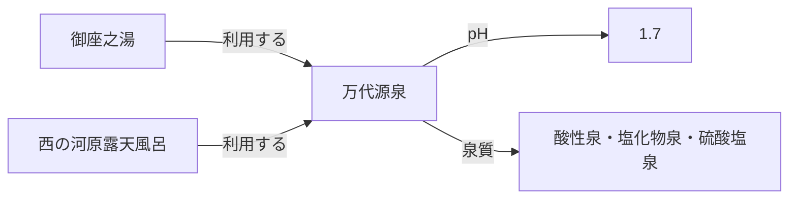

X で「温泉オントロジー」というキーワードが流れてきました。面白そうだったので、GitHub の [kazuhitogo/onsentology](https://github.com/kazuhitogo/onsentology) と、Qiita の検証記事「[温泉オントロジーを作って『整理されたデータ』の意味を測る](https://qiita.com/kazuneet/items/8b890ba7903326209729)」を読みました。

この検証では、環境省の掲示基準や温泉施設の公表情報を RDF/OWL でモデル化し、LLM がツール経由で参照しています。一方、グラフ内の事実を項目順の揃った Markdown に書き出して検索させる条件も、高い回答精度を示しました。

同じ答えを Markdown から得られるなら、なぜオントロジーを作るのでしょうか。

本稿では、温泉トロジーのデータと実測結果を手がかりに、オントロジーの価値を LLM の回答精度だけでなく、**変更、共有、意味、運用コスト**から考えます。結論を先に言うと、今回の規模と質問セットでは、LLM へ情報を渡す形式として Markdown で十分でした。ただし、これは Markdown だけで同じ知識を安く構築・維持できることまでは示しません。導入の境界は、質問の難しさよりも、知識を維持し、異なる利用先で意味を揃える複雑さにあります。

## 整形済み Markdown でも答えられた

元の検証で使われた質問は、pH、泉質、湯使い、適応症などを尋ねる 12 問です。代表例を挙げます。

1. 草津の湯畑源泉の pH はいくつか
2. 湯畑・万代・煮川で pH はどう違うか
3. 有馬の金の湯はかけ流しか
4. 高血圧の薬を飲んでいる人が草津の湯に入ってよいか
5. 玉川温泉の湯は飲めるか。1 日どれくらいまでか
6. 加水・加温・循環ろ過・消毒をしていない湯はあるか

これらは回答方式を評価するための質問であり、個人の入浴や飲泉を判断するための医療情報ではありません。

比較した条件は次のとおりです。

| 条件 | モデルに渡すもの |
| ---- | ---------------- |
| 素の LLM | 温泉の知識人という役割だけ。数値や施設一覧は渡さない |
| 揃えた MD | グラフに明示された施設・源泉・泉質・湯使いを、同じ見出しと順序で並べた Markdown |
| オントロジー | 施設・源泉・泉質などを RDF/OWL から取得するツール |

ここでいう「揃えた MD」は、一般的な説明記事を集めたものではありません。グラフから事実を取り出し、施設ごとに同じ項目を並べた文書です。加水などが確認できない場合も、単なる記載漏れではなく「不明」と書き分けています。人間向けの散文というより、Markdown で作った構造化ビューに近いものです。

したがって、この比較が測るのは主に **LLM へ知識を配信・検索させる形式**です。一次情報から項目を揃え、欠損の意味を決め、知識を維持する費用まで Markdown とオントロジーで比較したものではありません。

比較しているのは、Turtle と Markdown の構文を LLM に直接読ませた結果ではありません。RDF/OWL を検索する専用ツールと、Markdown を検索するツールを含む、エージェント全体の比較です。

12 問を各モデルで 3 回ずつ実行した公開結果は次のとおりです。数値は、事前に定義した採点項目の通過率を 3 回で平均したものです。採点には正規表現を使っているため、意味が近くても言い回しによって失点する場合があります。

| モデル | 素の LLM | 揃えた MD | オントロジー（当時の検索ツール） |
| ------ | -------- | --------- | ---------------------------------- |
| Haiku 4.5 | 34.3% | 88.2% | 71.6% |
| Sonnet 4.6 | 44.1% | 95.1% | 92.2% |

この試行では、揃えた MD の得点が当時のオントロジー条件を上回りました。オントロジー側には値があっても、源泉名から値を取得するツールがなく、Haiku が検索を途中で諦めるケースもありました。3 回の試行なので、小さな得点差を方式そのものの優劣とは解釈できません。

この結果が示しているのは、RDF と Markdown の優劣だけではありません。LLM が回答できるかどうかは、少なくとも次の 3 要素で決まります。

1. 必要な事実が保存されているか
2. その事実を取り出す手段があるか
3. モデルが適切な手段を選び、結果を処理できるか

オントロジーが存在するだけで、LLM が自動的に全体を理解できるわけではありません。

## 追加した横断・集計の 1 問でも答えられた

次に、揃えた MD の限界を見るため、施設を横断し、複数条件を組み合わせて集計する質問を追加しました。

> データセット内で「加水あり」かつ「消毒あり」の施設の件数と割合を出せ。そのうち泉質名に「塩化物泉」が含まれるものは何件か。

正解は次のとおりです。

- 加水と消毒の両方を実施: 2 件（金の湯、銀の湯）
- 全 15 施設に占める割合: 13.3%
- そのうち塩化物泉を含む施設: 1 件（金の湯）

この追加試験では、元の GitHub リポジトリをクローンし、質問だけを 1 問追加しました。オントロジーとの優劣は比べず、揃えた MD をどこまで処理できるかだけを確認しています。各モデルで 3 回ずつ実行し、1 回につき「2 施設と答える」「金の湯と銀の湯を挙げる」「塩化物泉は 1 件と答える」の 3 項目を採点しました。

| モデル | 通過した採点項目 |
| ------ | ---------------- |
| Haiku 4.5 | 0/9 |
| Sonnet 4.6 | 9/9 |

Haiku は文書検索を呼ばず、3 回とも数え切れませんでした。一方、Sonnet は 3 回とも正解しました。

質問を複雑にすれば、オントロジー側の優位性が現れるのではないか。しかし、今回追加した 1 問では、全 15 施設の事実を同じ形式で並べた Markdown と Sonnet 4.6 の組み合わせが、3 回とも正解しました。1 問だけの結果なので、横断・集計全般を処理できると一般化はできません。それでも、この規模では質問を複雑にするだけで明確な差が出るとは限らないことが分かります。

この結果を受けて、あらためてオントロジーの価値を考えてみます。オントロジーの価値は、LLM の回答精度を上げることだけで測れるのでしょうか。

## 境界 1：同じ事実の複製が課題になる

最初に現れるのは、Markdown からデータベースへ移る境界です。

たとえば、万代源泉は御座之湯と西の河原露天風呂の両方で使われています。



施設ごとの Markdown に源泉情報を展開すると、万代源泉の pH や泉質が複数箇所に現れます。分析結果が更新されたときは、同じ事実を含む箇所を探して直す必要があります。

一方、万代源泉を 1 つの実体として保持し、2 施設から参照すれば、値の更新箇所は 1 つです。同じ源泉を利用する施設の逆引きや、源泉から泉質を経由した横断探索も、その関係から作れます。

これはオントロジー固有の効果ではありません。正規化した SQL データベースや JSON を単一の参照元にし、そこから Markdown を生成しても複製は避けられます。ここで解決したいのは、**同じ事実の同期と、関係をたどる問い合わせ**です。関係の探索が中心になるなら、データベースの選択肢として Property Graph が浮かびます。

単一の参照元が実際に安いかどうかは、今回の実験では測っていません。更新頻度が低ければ Markdown の手修正で十分です。複製箇所と更新回数が増え、その同期費用がデータベースの運用費を上回りそうになったときが、移行を検討する地点です。

## 境界 2：共有スキーマだけでは、意味をつなげられなくなる

次に現れるのが、共有スキーマからオントロジーへ進む境界です。データベースに一元化しても、値をどう解釈するかまでは自動的に揃いません。

温泉トロジーでは、たとえば次の区別が回答を変えます。

- 「加水していない」と確認済みの `false` と、掲示を確認できない「不明」
- 成分分析の測定値から判定した泉質と、施設が掲示した泉質名
- 施設、源泉、泉質を別の実体として扱うこと
- どの施設がどの源泉を利用できるかという関係と制約

不明を `false` と扱えば、「加水していない施設」の検索結果が変わります。「酸性泉」という同じ文字列でも、測定から判定したのか、掲示名を転記したのかによって、回答で断定できる範囲が変わります。

これらは Markdown や通常のスキーマにも記述できます。同じ組織が 1 つのデータモデルを使い、入力処理、API、Web、LLM で定義を共有するだけなら、DB 制約や JSON Schema などで十分な場合があります。複数の利用先があることだけを理由に、オントロジーを導入する必要はありません。

オントロジーが候補になるのは、異なるデータモデルや組織の間で、概念の対応と関係の意味を機械可読な形で共有したいときです。たとえば、施設システムの「掲示泉質名」と分析システムの「成分値から判定した泉質」を、どちらも泉質に関する主張として検索しながら、由来の違いは失わないようにします。より広いプロパティへの包含関係、施設から源泉を使う関係の逆引き、クラス階層などを定義すれば、利用側が個別の変換コードを持たなくても共通の関係として解釈できます。

ここでの違いは、スキーマが劣っているという話ではありません。**合意済みの 1 つのデータ構造を検証する**なら共有スキーマ、**異なる構造の間で概念を対応づけ、関係から新しい事実を導く**ならオントロジー、という役割の違いです。

つまり、2 つの境界が扱う問題は異なります。第 1 の境界は、同じ事実をどう一元管理し、探索するかという問題です。第 2 の境界は、異なるデータ構造の間で意味をどう対応づけるかという問題です。その間には、関係探索のための Property Graph や、1 つのデータモデルを検証する共有スキーマという選択肢があります。

文書と意味レイヤを分ける一般的な考え方は「[LLM Wiki と Wikipedia／Wikidata：ナラティブ層とセマンティック層の対応関係](https://zenn.dev/knowledge_graph/articles/llm-wiki-wikidata-narrative-semantic)」で詳しく扱っています。

## この題材では Property Graph が実装候補になる

今回の実装は RDF/OWL です。ただし、温泉施設の運用データを横断する目的に限れば、Property Graph でも関係を素直に表現できます。

```text
(施設)-[:HAS_BATH]->(浴槽)-[:USES]->(源泉)
(浴槽)-[:HAS_TREATMENT]->(湯使い宣言 {
  type: "加水", applied: true,
  reason: "温度調整のため", source: "施設の掲示URL"
})
(源泉)-[:HAS_QUALITY_ASSERTION]->(泉質の主張 {
  basis: "measurement", source: "温泉分析書URL",
  measuredAt: "利用施設", measuredOn: "分析年月日"
})-[:CLASSIFIES_AS]->(泉質)
```

湯使いを単純な真偽値に潰さず、どの浴槽に対する掲示か、実施理由と出典は何かを 1 つの主張として保持します。泉質も、分類名だけでなく、測定由来か掲示名由来かを主張単位で残します。Property Graph にしても、このドメインの複雑さ自体が消えるわけではありません。そのうえで、ノードと関係を業務オブジェクトとして扱い、関係をたどる実装や問い合わせを簡潔にしやすいと考えます。

これは RDF/OWL と Property Graph を同じ条件で測ったベンチマーク結果ではなく、対象モデルと想定する運用からの設計上の判断です。

一方、標準語彙や外部データとの接続、組織をまたぐ URI の共有、形式的な推論が重要なら RDF/OWL が有力です。「RDF か、オントロジーを諦めるか」の二択でもありません。Property Graph を運用基盤にし、その上で軽量なドメインオントロジーを共有する構成も取れます。

Property Graph で意味や根拠をどこに置くかは「[ナレッジグラフ設計で後から問われるのは、意味をどこで表現するか](https://zenn.dev/knowledge_graph/articles/kg-meaning-placement)」、RDF との方式比較は「[RDF vs Property Graph：知識グラフの二大構造を徹底比較](https://zenn.dev/knowledge_graph/articles/rdf-vs-property-graph-2025)」を参照してください。

## 件数ではなく、解決したい課題から選ぶ

「何件を超えたらオントロジーか」という一律の境界は引けません。少ないデータでも多くのシステムで意味を共有することはあり、大量でも単純な表で足りることがあります。実務では、解決したい課題から選択肢を絞れます。

| 解決したい課題・要求 | 次に検討するもの |
| -------------------- | ---------------- |
| 既知の質問に、少数の文書から答えられればよい | 整形した Markdown |
| 同じ事実を複数箇所で直している | 正規化した SQL、JSON などの単一の参照元 |
| 逆引きや多段の関係探索が主要な操作になった | Property Graph |
| 1 つのデータモデル内で型、欠損、制約を共有したい | DB 制約、JSON Schema などの共有スキーマ |
| 異なるデータモデル間で概念を対応づけ、関係の意味や推論規則を共有したい | オントロジー |
| 標準語彙、外部連携、形式推論が重要になった | RDF/OWL |

今回の評価対象は 15 施設の小規模データです。この質問セットへ 1 つのエージェントが答える配信形式としては、揃えた Markdown で十分でした。今後、共有源泉の更新が増え、複数のアプリケーションが多方向に関係をたどるなら、まず正規化したデータベース、特に Property Graph を検討できます。1 つのデータモデル内で不明値や由来の扱いを揃えるだけなら、共有スキーマが候補です。さらに、施設データ、分析データ、自治体データなど異なる構造の間で概念を対応づけ、共通の関係として利用するなら、オントロジーの価値が具体化します。

もちろん、データベースには取り込み、名寄せ、バックアップ、監視、問い合わせツールの保守が必要です。導入によってメンテナンスが消えるのではなく、**文書の複製と同期にかかる費用を、知識基盤の運用費へ置き換える**ことになります。どちらが安いかは件数だけでなく、変更頻度、関係の複雑さ、利用先の数で判断します。

## まとめ

温泉トロジーの実験では、グラフから生成した揃えた Markdown を Sonnet 4.6 に渡すと、元の質問セットに加え、15 施設を横断する追加の 1 問にも 3 回とも回答できました。この範囲では、LLM への配信形式を RDF 検索にする必然性は見つかりませんでした。ただし、知識を整理・維持する費用まで Markdown の方が安いと示した実験ではありません。

一方、実験から一歩引いて知識のライフサイクルを見ると、導入判断は次の段階に分かれます。

1. **LLM への配信形式としては、整形済み Markdown で十分な場合がある。**
2. **複製と横断探索が苦しくなったら、正規化したデータベースや Property Graph を検討する。**
3. **1 つのデータモデル内で型や制約を揃えるなら、まず共有スキーマを検討する。**
4. **異なるデータモデルの概念対応や推論規則を共有したくなったら、オントロジーを検討する。**

「1 か所を直せば全利用先へ反映される」のは、まず単一の参照元を持つデータ設計の価値です。オントロジーの本当の価値は、その上で、異なる構造に現れる何を同じ実体や概念と見なし、どの関係を共通にたどれ、何を導出できるかを、個別のアプリケーションから独立して定義することにあります。

温泉トロジーが示したのは、「Markdown か RDF か」というファイル形式の勝敗ではありません。**LLM へどう渡すか、事実をどこで一元管理するか、異なる利用先の意味をどうつなぐかは、別々の設計判断である**ということです。

## 参考

- [kazuhitogo/onsentology](https://github.com/kazuhitogo/onsentology)
- [温泉オントロジーを作って「整理されたデータ」の意味を測る（Qiita）](https://qiita.com/kazuneet/items/8b890ba7903326209729)
- [LLM Wiki と Wikipedia／Wikidata：ナラティブ層とセマンティック層の対応関係](https://zenn.dev/knowledge_graph/articles/llm-wiki-wikidata-narrative-semantic)
- [ナレッジグラフ設計で後から問われるのは、意味をどこで表現するか](https://zenn.dev/knowledge_graph/articles/kg-meaning-placement)
- [RDF vs Property Graph：知識グラフの二大構造を徹底比較](https://zenn.dev/knowledge_graph/articles/rdf-vs-property-graph-2025)
- 環境省 [鉱泉分析法指針](https://www.env.go.jp/nature/onsen/pdf/2-5_p_11.pdf) / [掲示基準](https://www.env.go.jp/nature/onsen/)

## 更新履歴

- 2026-08-21: 初版公開

## フィードバック受け付け

本記事は AI を活用して執筆しています。内容に誤りや追加情報があれば Zenn のコメントよりお知らせください。
