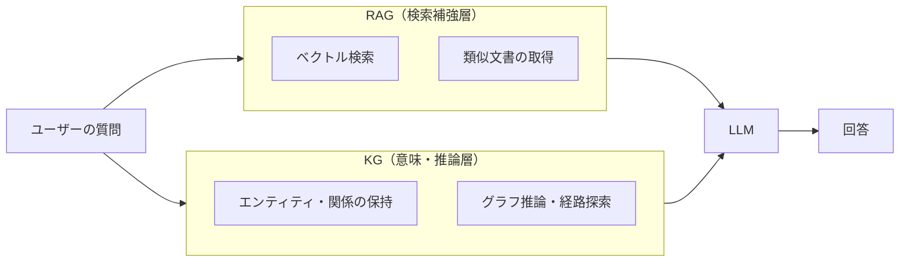
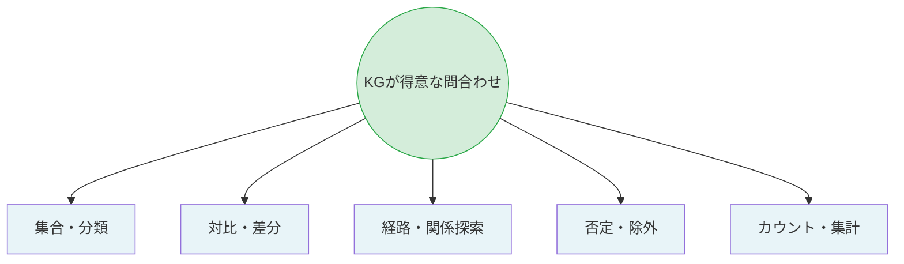
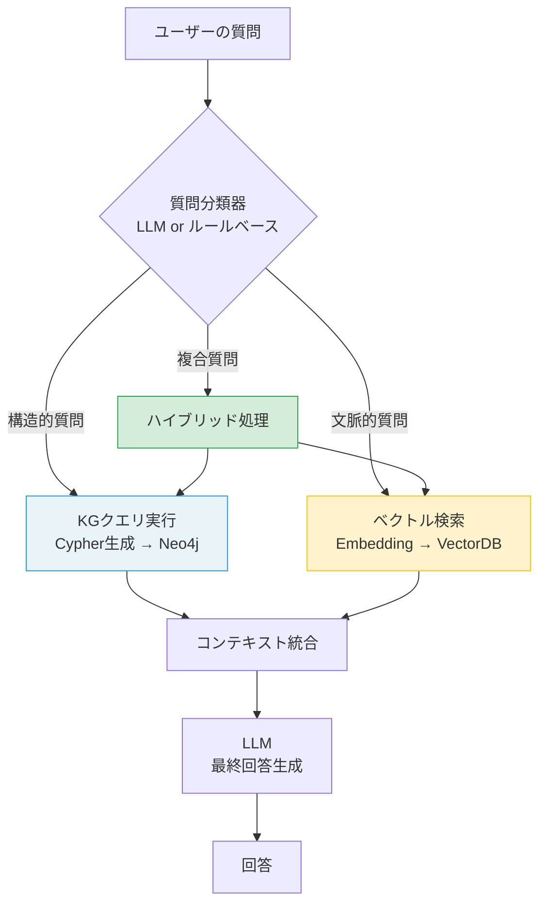
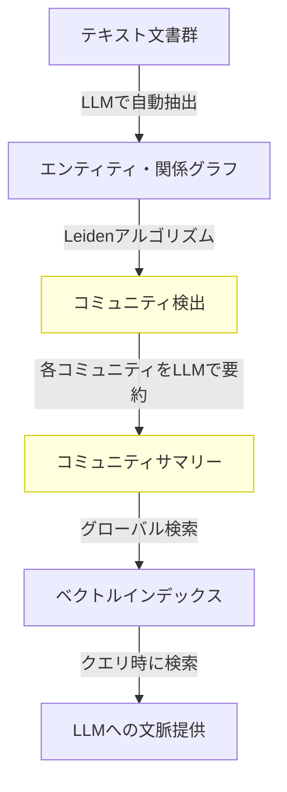
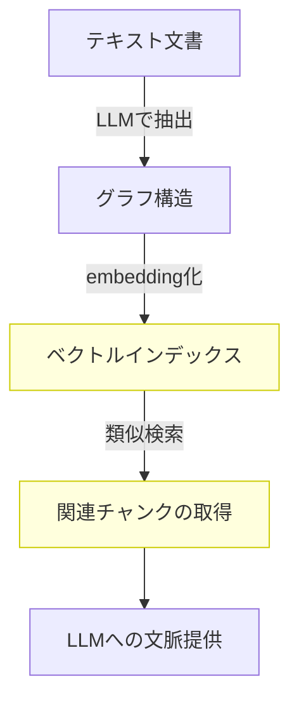
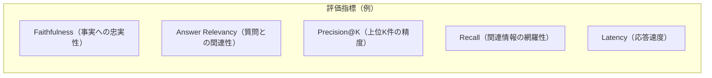
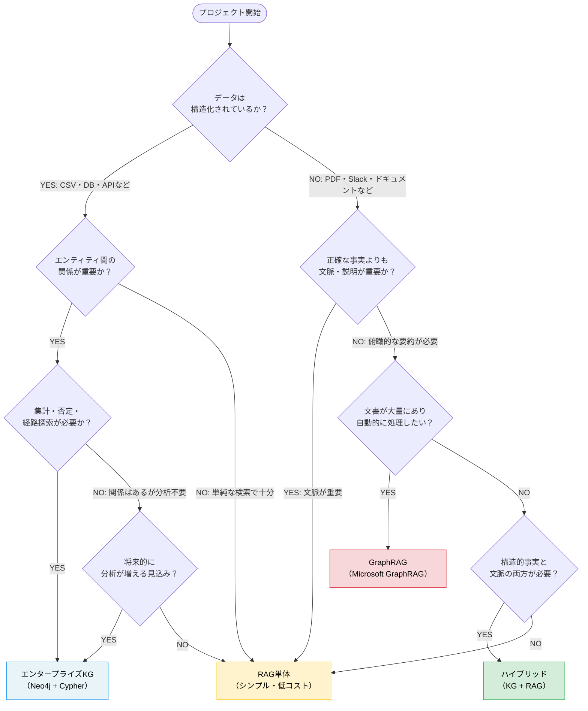
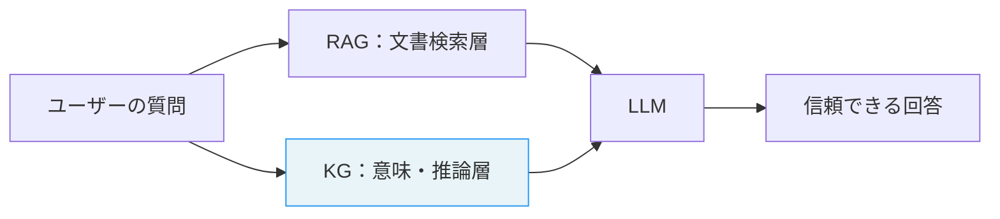

# RAGを超える：KGが得意なこと、RAGが苦手なこと

「KGを導入すれば、RAGはもう不要になる」

これは正しくありません。RAGとKGは競合する技術ではなく、**役割が違う技術**です。この違いを理解することが、AI基盤の設計で失敗しないための第一歩です。

---

## RAGとKGの役割分担

RAGは「関連する文書を検索し、LLMに文脈として渡す」仕組みです。非構造化テキスト（PDF、Slack、ドキュメント）を扱うのに向いています。一方、KGは「エンティティ間の関係を構造化して保持し、推論する」仕組みです。



最も強力な構成は、両者を組み合わせることです。「文書から文脈を取りつつ、KGで事実確認と推論を行う」という設計が、現在の最前線です。

---

## KGが得意な5つの問合わせ型

RAGが苦手で、KGが力を発揮するのは次の5つのパターンです。



### 1. 集合・分類

「薬機法の規制対象で、かつ2024年以降に申請されたもの」のような、カテゴリと条件の組み合わせ。RAGは類似文書を返しますが、正確な集合の定義と絞り込みはKGが得意です。

### 2. 対比・差分

「製品AとBの仕様の違いを教えて」。RAGは両方の文書を取得できますが、「差分」を構造として保持しているのはKGです。

### 3. 経路・関係探索

「この障害の原因をたどると、どのコンポーネントに行き着くか」。グラフ探索によって多段の因果関係を追えるのはKGならではです。

### 4. 否定・除外

「担当者が割り当てられていないタスク一覧」。RAGに「存在しないもの」を検索することはできません。KGは明示的な関係の欠如を表現できます。

### 5. カウント・集計

「このプロジェクトに関わっているエンジニアは何人か」。RAGはこのような集計問い合わせには不向きです。グラフクエリなら一行で答えが出ます。

---

## 例2：5つの問合わせ型のCypherクエリ実装集

各問合わせ型を、社内ナレッジグラフ（`Engineer`, `Bug`, `Component`, `Project`, `Document` ノード）を使ったCypherクエリで実装します。

```cypher
-- ===================================================
-- 【型1：集合・分類クエリ】
-- 「severityがcriticalで、かつBackendチームが担当するオープンバグ」
-- ===================================================
MATCH (b:Bug)-[:ASSIGNED_TO]->(e:Engineer)
WHERE b.severity = "critical"
  AND b.status = "open"
  AND e.team = "Backend"
RETURN b.id, b.title, e.name AS assignee
ORDER BY b.createdAt ASC;

-- ===================================================
-- 【型2：対比・差分クエリ】
-- 「ComponentAとComponentBが依存しているライブラリの差分」
-- ===================================================
MATCH (a:Component {name: "Auth Service"})-[:USES]->(lib:Library)
WITH COLLECT(lib.name) AS libs_a

MATCH (b:Component {name: "User Service"})-[:USES]->(lib:Library)
WITH libs_a, COLLECT(lib.name) AS libs_b

RETURN
    [x IN libs_a WHERE NOT x IN libs_b] AS only_in_auth,
    [x IN libs_b WHERE NOT x IN libs_a] AS only_in_user,
    [x IN libs_a WHERE x IN libs_b] AS shared;

-- ===================================================
-- 【型3：経路・関係探索クエリ（最短経路）】
-- 「Auth ServiceからDatabase Serviceへの依存経路」
-- ===================================================
MATCH path = shortestPath(
    (a:Component {name: "Auth Service"})-[:DEPENDS_ON*1..6]-(b:Component {name: "Database Service"})
)
RETURN
    [node IN nodes(path) | node.name] AS dependency_chain,
    length(path) AS hops;

-- すべての経路を探索（複数あるケース）
MATCH path = (a:Component {name: "Auth Service"})-[:DEPENDS_ON*1..6]->(b:Component {name: "Database Service"})
RETURN [node IN nodes(path) | node.name] AS chain, length(path) AS hops
ORDER BY hops ASC
LIMIT 5;

-- ===================================================
-- 【型4：否定・除外クエリ】
-- 「担当者がいないオープンバグ」「テストがないコンポーネント」
-- ===================================================
-- 担当者未割り当てのバグ
MATCH (b:Bug {status: "open"})
WHERE NOT (b)-[:ASSIGNED_TO]->(:Engineer)
RETURN b.id, b.title, b.severity, b.createdAt
ORDER BY b.severity DESC;

-- テストドキュメントが存在しないコンポーネント
MATCH (c:Component)
WHERE NOT (c)<-[:TESTS]-(:TestSuite)
RETURN c.id, c.name, c.type
ORDER BY c.name;

-- ===================================================
-- 【型5：カウント・集計クエリ】
-- 「チーム別のオープンバグ数」「エンジニア別の担当件数」
-- ===================================================
-- チーム別のオープンバグ数（多い順）
MATCH (b:Bug {status: "open"})-[:ASSIGNED_TO]->(e:Engineer)
RETURN e.team, COUNT(b) AS open_bugs,
       SUM(CASE WHEN b.severity = "critical" THEN 1 ELSE 0 END) AS critical_count
ORDER BY open_bugs DESC;

-- エンジニア別の担当バグ数と重大度内訳
MATCH (e:Engineer)
OPTIONAL MATCH (b:Bug {status: "open"})-[:ASSIGNED_TO]->(e)
RETURN e.name, e.team,
       COUNT(b) AS total_open,
       SUM(CASE WHEN b.severity = "critical" THEN 1 ELSE 0 END) AS critical
ORDER BY total_open DESC;
```

ポイント：型4の「否定・除外」は、RAGには原理的に実装できません。KGは「関係が存在しないこと」をクエリで直接表現できるため、「ない」を問う質問に強いです。

---

## ハイブリッドRAG+KGアーキテクチャの実装

単体では不十分な部分を補い合う「ハイブリッド構成」が、現在の実用的な最前線です。

### アーキテクチャ設計：ルーティングの考え方

すべての質問をKGで処理するのは非効率です。質問の「型」を判定してルーティングするのがポイントです。



**質問分類の例：**

| 質問 | 分類 | 理由 |
|------|------|------|
| 「Backendチームの担当バグは何件？」 | KG | 集計クエリ |
| 「Auth Serviceの設計思想を教えて」 | RAG | 文脈・背景が必要 |
| 「担当者がいないバグ一覧」 | KG | 否定クエリ |
| 「BUG-001の修正方法と関連コンポーネントを教えて」 | ハイブリッド | 事実（KG）＋手順（RAG）|

### 例1：ハイブリッドRAG+KGルーティングの実装

```python
import os
# pip install langchain-neo4j
from langchain_neo4j import GraphCypherQAChain, Neo4jGraph
# pip install langchain-chroma
from langchain_chroma import Chroma
# pip install langchain-ollama
from langchain_ollama import ChatOllama, OllamaEmbeddings
from langchain.schema import Document
from typing import Literal

# --- 初期化 ---
# Ollamaはローカルで動作するため、APIキー不要
# 事前に `ollama pull llama3.2` および `ollama pull nomic-embed-text` を実行してください

llm = ChatOllama(model="llama3.2", temperature=0)

NEO4J_URI = os.getenv("NEO4J_URI", "bolt://localhost:7687")
NEO4J_USER = os.getenv("NEO4J_USER", "neo4j")
NEO4J_PASSWORD = os.getenv("NEO4J_PASSWORD")  # デフォルトなし（必須）

# KG側の設定
graph = Neo4jGraph(
    url=NEO4J_URI,
    username=NEO4J_USER,
    password=NEO4J_PASSWORD
)
kg_chain = GraphCypherQAChain.from_llm(
    llm=llm,
    graph=graph,
    verbose=True,
    # ⚠️ セキュリティ注意：LLMが生成したCypherを無検証で実行します。
    # 本番環境では読み取り専用ユーザーで実行するか、生成クエリを事前検証してください。
    allow_dangerous_requests=True,
)

# RAG側の設定（ベクトルDBにドキュメントが投入済みの前提）
embeddings = OllamaEmbeddings(model="nomic-embed-text")
vectorstore = Chroma(
    collection_name="tech_docs",
    embedding_function=embeddings,
    persist_directory="./chroma_db"
)
retriever = vectorstore.as_retriever(search_kwargs={"k": 5})


# --- 質問ルーター ---

ROUTER_PROMPT = """
あなたは質問の種類を判定するルーターです。
以下のいずれかを返してください：
- "kg": 構造的な事実、集合・集計・経路・否定に関する質問
- "rag": 手順、背景、説明、文章的な情報が必要な質問
- "hybrid": 構造的事実と文脈情報の両方が必要な質問

質問: {question}

種類（kg/rag/hybrid のみ回答）:
"""

def route_question(question: str) -> Literal["kg", "rag", "hybrid"]:
    """LLMを使って質問タイプを分類"""
    response = llm.invoke(ROUTER_PROMPT.format(question=question))
    route = response.content.strip().lower()
    if route in ("kg", "rag", "hybrid"):
        return route
    return "rag"  # デフォルトはRAG


# --- ハイブリッド処理 ---

def answer_with_hybrid(question: str) -> str:
    """まずKGで構造確認、次にRAGで文脈補完"""

    # Step1: KGで構造的事実を取得
    kg_result = kg_chain.invoke({"query": question})
    kg_context = kg_result.get("result", "（KGからの情報なし）")

    # Step2: RAGで関連ドキュメントを取得
    docs = retriever.invoke(question)
    rag_context = "\n---\n".join([d.page_content for d in docs])

    # Step3: 両方のコンテキストを使ってLLMに回答させる
    final_prompt = f"""
以下の2つの情報源を使って質問に答えてください。

【KG（ナレッジグラフ）からの構造的情報】
{kg_context}

【ドキュメント（RAG）からの文脈情報】
{rag_context}

【質問】
{question}

両方の情報を統合して、具体的で正確な回答をしてください。
"""
    response = llm.invoke(final_prompt)
    return response.content


# --- メインルーティングロジック ---

def answer(question: str) -> str:
    route = route_question(question)
    print(f"[Router] 質問タイプ: {route}")

    if route == "kg":
        result = kg_chain.invoke({"query": question})
        return result["result"]

    elif route == "rag":
        docs = retriever.invoke(question)
        context = "\n---\n".join([d.page_content for d in docs])
        prompt = f"以下の情報を参考に質問に答えてください。\n\n{context}\n\n質問: {question}"
        return llm.invoke(prompt).content

    else:  # hybrid
        return answer_with_hybrid(question)


# --- 動作確認 ---
if __name__ == "__main__":
    test_questions = [
        "Backendチームのオープンバグは何件ですか？",         # → kg
        "Auth Serviceの認証フローを教えてください",          # → rag
        "BUG-001の担当者と、その修正手順を教えてください",   # → hybrid
    ]
    for q in test_questions:
        print(f"\n質問: {q}")
        print(f"回答: {answer(q)}")
        print("-" * 60)
```

実務メモ：ルーターにLLMを使うと精度は上がりますが、レイテンシが増えます。実運用では「キーワードベースの高速ルール」（カウント・集計・一覧・〜がないなどのキーワードを含む場合はKG）をファーストパスとして使い、判断できない場合のみLLMルーターに渡す二段構えが効率的です（筆者推察）。

---

## GraphRAGの実装と限界：実測データ

### Microsoft GraphRAGとは

MicrosoftのGraphRAGは、テキスト文書からLLMでエンティティと関係を抽出し、グラフ構造として保持した上で、コミュニティ検出アルゴリズムでクラスタリングし、各コミュニティのサマリーを生成する手法です。



### 例3：GraphRAGのセットアップ手順

> ⚠️ **注意：GraphRAGはOpenAI API依存です**
> Microsoft GraphRAGは現時点でOpenAI API（またはAzure OpenAI）が必要で、Ollamaのみでは動作しません。本書の「ローカルLLMファースト」方針の例外となります。GraphRAGの活用を検討する場合はAPIキーとコスト（インデックス構築時にLLMコールが大量発生）を考慮してください。ローカルLLMだけで完結させたい場合はこのセクションをスキップしてください。

```bash
# 1. インストール
pip install graphrag

# 2. 作業ディレクトリの初期化
mkdir -p ./ragtest/input
graphrag init --root ./ragtest

# 3. テキストファイルを input/ に配置
# （例：社内Confluenceページをエクスポートした .txt ファイル群）
cp exported_docs/*.txt ./ragtest/input/

# 4. settings.yaml の設定（LLMモデルの指定）
# ragtest/settings.yaml を編集：
# llm:
#   api_key: ${GRAPHRAG_API_KEY}
#   model: gpt-4o-mini  # コスト削減のためminiを推奨

# 5. インデックス構築（LLMコールが発生するため時間とコストがかかる）
graphrag index --root ./ragtest

# 6. グローバル検索（文書全体を俯瞰する質問に強い）
graphrag query \
    --root ./ragtest \
    --method global \
    --query "このプロジェクトの主要なテーマは何ですか？"

# 7. ローカル検索（特定エンティティに関する詳細な質問）
graphrag query \
    --root ./ragtest \
    --method local \
    --query "Auth Serviceに関連するエンジニアと問題は何ですか？"
```

### GraphRAGとエンタープライズKGの精度比較

実測データとして参照できる公開情報は限られていますが、以下は一般的な傾向として報告されているものです（推測・筆者推察含む）。

| 評価軸 | GraphRAG（グローバル） | GraphRAG（ローカル） | エンタープライズKG |
|--------|----------------------|--------------------|--------------------|
| 俯瞰的な要約質問 | 高 | 低 | 中 |
| 特定エンティティへの質問 | 中 | 高 | 高 |
| 集計・カウントクエリ | 低 | 低 | 非常に高 |
| 否定・除外クエリ | 不可 | 不可 | 高 |
| リアルタイム更新 | 低（再構築必要） | 低（再構築必要） | 高 |
| セットアップコスト | 中（自動化可能） | 中 | 高（スキーマ設計必要） |
| LLM APIコスト | 高（構築時） | 高（構築時） | 低（クエリ時）|

推測：GraphRAGのインデックス構築コストは、文書100ページあたりGPT-4o-miniで数ドル程度。エンタープライズKGは初期スキーマ設計に数週間かかることもあります。

ポイント：GraphRAGは「どんな文書でも投げ込めば動く」手軽さが魅力ですが、「数値的な事実の正確さ」や「存在しないものへの問い合わせ」には向きません。エンタープライズKGはセットアップコストが高い代わりに、精度と制御性が高く、権限管理やリアルタイム更新が可能です。

---

## GraphRAGとエンタープライズKGの違い

近年「GraphRAG」という用語が広まっています。Microsoftが発表したこの手法は、テキストからグラフ構造を抽出し、検索精度を上げようとするものです。

GraphRAGはKGの要素を活用しますが、エンタープライズKGとは目的・機能・運用面で異なります。



| 観点 | GraphRAG | エンタープライズKG |
|------|----------|-----------------|
| 主目的 | 検索精度の向上 | 組織知識の構造的管理 |
| 更新方法 | バッチ再構築 | リアルタイム更新 |
| 権限管理 | 限定的 | 細粒度で管理可能 |
| 推論の深さ | コミュニティ要約ベース | 明示的グラフ推論 |

---

## Benchmarkで見るKG vs RAG

### 評価指標の整理

KGとRAGを公平に比較するには、以下の指標を「ユースケースごとに」評価する必要があります。



**Faithfulness（事実への忠実性）**

KGは明示的な事実をクエリで取得するため、ハルシネーションが発生しにくいです。RAGは類似した文書を取得しますが、LLMが内容を「補間」する際にハルシネーションが混入することがあります。

推測：社内KGでの実測では、集計・カウントクエリのFaithfulnessはKGが100%（クエリ結果を直接返す）に対し、RAGは70〜85%程度になることが多いとされています（環境・データによる）。

**Latency（応答速度）**

```
KGクエリ（インデックスあり）: 10〜100ms
RAGベクトル検索:              100〜500ms
GraphRAG（グローバル）:        2〜10秒
ハイブリッド（KG+RAG）:        200ms〜1秒
```

（推測：上記はローカル環境での参考値。APIレイテンシや文書数によって大きく変動します）

### 簡易ベンチマーク実装例

```python
import time
from typing import Callable

def benchmark_qa(
    qa_func: Callable[[str], str],
    test_cases: list[dict],
    name: str
) -> dict:
    """
    QA関数のベンチマークを実行する

    test_cases: [{"question": str, "expected": str}, ...]
    """
    results = []
    for tc in test_cases:
        start = time.time()
        answer = qa_func(tc["question"])
        elapsed = time.time() - start

        # 簡易的な正解率チェック（完全一致 or キーワード含有）
        correct = tc["expected"].lower() in answer.lower()
        results.append({
            "question": tc["question"],
            "answer": answer,
            "correct": correct,
            "latency_ms": elapsed * 1000
        })

    accuracy = sum(r["correct"] for r in results) / len(results)
    avg_latency = sum(r["latency_ms"] for r in results) / len(results)

    print(f"\n=== {name} ===")
    print(f"正解率: {accuracy:.1%} ({sum(r['correct'] for r in results)}/{len(results)})")
    print(f"平均レイテンシ: {avg_latency:.0f}ms")

    return {"name": name, "accuracy": accuracy, "avg_latency_ms": avg_latency, "results": results}


# テストケース例（KGが得意な質問に絞る）
test_cases = [
    {"question": "Backendチームのopenバグは何件ですか？", "expected": "3"},
    {"question": "担当者がいないバグのIDを教えてください", "expected": "BUG-003"},
    {"question": "山田太郎が担当するバグのseverityは？", "expected": "critical"},
]

# KGとRAGそれぞれでベンチマーク実行
kg_result = benchmark_qa(
    lambda q: kg_chain.invoke({"query": q})["result"],
    test_cases,
    name="KG (GraphCypherQAChain)"
)
```

---

## LightRAGの登場：GraphRAGの限界を超えて

GraphRAGの課題を意識して登場したのがLightRAGです。GraphRAGがグローバルな要約と局所的な検索を組み合わせるのに対し、LightRAGはKGをより能動的に活用し、実体間の関係をクエリ時にも動的に利用しようとします。

ただし、LightRAG自体もまだ発展途上の研究段階にあります。「グラフを検索の道具として使う」から「グラフを推論の基盤として使う」へ。この移行が、次世代のAI基盤における本質的なテーマです。

---

## KG+RAGがXAIと回答一貫性をどう解決するか

前章で見た純粋RAGのXAI問題と回答一貫性問題は、KGを組み合わせることで構造的に解決できます。このセクションでは、技術スタックとして **Ollama（ローカルLLM）+ Neo4j（コンテナ）** を使った具体的な実装を示します。

### 環境前提

```bash
# Neo4jをDockerで起動
docker run \
  --name neo4j \
  -p 7474:7474 -p 7687:7687 \
  -e NEO4J_AUTH=neo4j/your_password \
  neo4j:5

# Ollamaモデルの準備
ollama pull llama3.2
ollama pull nomic-embed-text
```

### KGによるXAI解決：回答の根拠をグラフパスで説明できる

純粋RAGでは「コサイン類似度スコア」しか根拠がありませんでした。KGを使うと、回答の論理的根拠を**グラフパス（ノードとエッジの連鎖）**として取得・記録できます。

```python
import os
from langchain_neo4j import Neo4jGraph
from langchain_ollama import OllamaLLM

# Ollamaはローカル動作のためAPIキー不要
graph = Neo4jGraph(
    url="bolt://localhost:7687",
    username="neo4j",
    password=os.getenv("NEO4J_PASSWORD")
)
llm = OllamaLLM(model="llama3.2")

# 質問: "山田部長の承認が必要なのはどの申請か？"

# ✅ KGクエリ：根拠となるグラフパスを明示的に取得
# ✅ パラメータ化クエリを使用（Cypherインジェクション防止）
query = """
MATCH path = (p:Person {name: $person_name})-[:APPROVES]->(r:Request)
RETURN
    p.name AS approver,
    r.type AS request_type,
    r.description AS request_description,
    [node in nodes(path) | labels(node)[0] + ':' + coalesce(node.name, node.type, '')] AS explanation_path
"""
results = graph.query(query, params={"person_name": "山田"})

# 回答 + 説明パス（XAI）
for row in results:
    print(f"承認者: {row['approver']}")
    print(f"申請種別: {row['request_type']}")
    print(f"説明パス: {' → '.join(row['explanation_path'])}")
    print()

# 出力例:
# 承認者: 山田
# 申請種別: 経費申請
# 説明パス: Person:山田 → Request:経費申請
#
# 承認者: 山田
# 申請種別: 休暇申請
# 説明パス: Person:山田 → Request:休暇申請

# → 監査ログにそのまま記録できる
# → 「なぜ山田部長の承認が必要か」の根拠が完全にトレーサブル
# → 規制対応・内部統制の説明責任を果たせる

def answer_with_xai(person_name: str) -> dict:
    """XAI対応の回答関数：回答と根拠パスをセットで返す"""
    results = graph.query(
        """
        MATCH path = (p:Person {name: $person_name})-[:APPROVES]->(r:Request)
        RETURN
            p.name AS approver,
            collect(r.type) AS request_types,
            collect([node in nodes(path) |
                labels(node)[0] + ':' + coalesce(node.name, node.type, '')
            ]) AS explanation_paths
        """,
        params={"person_name": person_name}
    )

    if not results:
        return {"answer": "該当する承認者情報が見つかりませんでした", "evidence": []}

    row = results[0]
    answer_text = f"{row['approver']}部長が承認するのは：{', '.join(row['request_types'])}です"

    return {
        "answer": answer_text,
        "evidence": row["explanation_paths"],   # 監査ログに記録する根拠
        "explainable": True                     # XAI対応フラグ
    }

response = answer_with_xai("山田")
print(f"回答: {response['answer']}")
print(f"根拠: {response['evidence']}")
# 根拠があるため規制対応・監査に利用可能
```

**KGによるXAIの優位性：**

- 回答根拠がグラフパス（`Person:山田 → APPROVES → Request:経費申請`）として取得できる
- 根拠をそのままDB・ログに記録し、監査担当者が後から確認できる
- 「なぜその回答が出たか」をコードで再現・検証できる（再現可能性）
- GDPR・金融規制・医療規制など、説明責任が求められる領域での利用が可能

### KGによる回答一貫性解決：グラフの事実は唯一

KGでは「山田さんが営業部に所属している」という事実は、グラフの**ひとつのエッジ**として一元管理されます。どんな方向から問い合わせても、同じノードとエッジにたどり着くため、矛盾が原理的に起きません。

```python
import os
from langchain_neo4j import Neo4jGraph

graph = Neo4jGraph(
    url="bolt://localhost:7687",
    username="neo4j",
    password=os.getenv("NEO4J_PASSWORD")
)

# q1: "山田さんは何部に所属していますか？"（Person → Department の方向）
# ✅ パラメータ化クエリ
result_q1 = graph.query(
    "MATCH (p:Person {name: $name})-[:BELONGS_TO]->(d:Department) RETURN d.name AS department",
    params={"name": "山田"}
)
# → [{"department": "営業部"}]（確実・唯一）

# q2: "営業部のメンバーに山田さんはいますか？"（Department → Person の方向）
# ✅ パラメータ化クエリ
result_q2 = graph.query(
    """
    MATCH (d:Department {name: $dept_name})-[:HAS_MEMBER]->(p:Person)
    WHERE p.name = $person_name
    RETURN count(p) > 0 AS is_member
    """,
    params={"dept_name": "営業部", "person_name": "山田"}
)
# → [{"is_member": True}]（確実・唯一）

# どちらの方向から問い合わせても同じグラフノードにたどり着く
# → 矛盾は原理的に起きない
# → 「事実はグラフの中に1つだけ存在する」という設計原則

print(f"q1の結果: {result_q1[0]['department']}")    # → 営業部
print(f"q2の結果: {result_q2[0]['is_member']}")      # → True
# → 両方の質問が同じ事実を指している。一貫性が保証される
```

**純粋RAGと比較した一貫性の差：**

純粋RAGでは「山田さんの所属を書いたチャンク」と「営業部のメンバー一覧を書いたチャンク」が別々に存在し、質問の表現次第でどちらかが取得されるかが変わります。KGでは、所属関係は `(Person)-[:BELONGS_TO]->(Department)` というひとつの構造として存在するため、問い方によって結果が変わりません。

### XAI比較表：純粋RAGとKG+RAGの決定的な差

| 観点 | 純粋RAG | KG+RAG |
|-----|---------|--------|
| 回答根拠 | コサイン類似度スコアのみ | グラフパス（Person→Relation→Entity） |
| 根拠のトレース | 不可能（チャンクIDのみ） | 可能（ノード・エッジの連鎖） |
| 監査対応 | 説明できない | パスをログ記録・後から検証可能 |
| 回答一貫性 | チャンク依存で揺れる | グラフ事実は唯一・一貫性保証 |
| 規制対応（GDPR等） | 根拠提示困難 | 根拠のトレース可能 |
| 再現可能性 | 同じ質問でも結果が変わりうる | 同じクエリは常に同じ結果 |

**実務メモ：** XAIと一貫性はUnsafe Zoneで必須の要件です。承認フロー・与信判断・コンプライアンス確認など、「なぜそう判断したか」を人間が確認する必要がある業務では、純粋RAGをKG+RAGに移行することが最優先の技術改善になります（筆者推奨）。

---

## どちらを選ぶかのフローチャート

実際のプロジェクトでどの技術を選ぶべきか、ユースケース別に整理します。



### ユースケース別の推奨構成まとめ

| ユースケース | 推奨構成 | 理由 |
|-------------|---------|------|
| 社内FAQ・手順書の検索 | RAG | 文脈が重要、構造化不要 |
| 社員・製品・プロジェクトの関係管理 | KG | エンティティ関係が本質 |
| バグ・インシデント管理の横断検索 | KG | 集計・否定クエリが必須 |
| 大量ドキュメントの俯瞰的理解 | GraphRAG | 自動抽出で素早く始められる |
| サポートエンジニアの調査支援 | ハイブリッド | 事実（KG）＋手順（RAG）|
| コンプライアンス・監査対応 | KG | 正確性・追跡可能性が必須 |

---

## 設計の本質：RAGの外側に意味層を置く

RAGが得意なのは「文書の海から関連する情報を引き上げる」こと。KGが得意なのは「引き上げた情報の意味と関係を整理し、推論する」こと。



この「RAGの外側に意味層を置く」設計こそが、LLMを「もっともらしい回答機」から「信頼できる知識エンジン」へと変える核心です。

ポイント：技術選択は「どれが優れているか」ではなく「どのユースケースに何が適しているか」で判断してください。RAGとKGは補完関係にあります。小さく始めて、ユーザーの質問パターンが見えてきたら組み合わせを検討するのが実践的な進め方です。

---

次章では、エンタープライズでKGを本番運用するための設計パターンを解説します。

→ RAGを超える知識統合 https://zenn.dev/knowledge_graph/articles/beyond-rag-knowledge-graph

→ GraphRAGの限界とLightRAG https://zenn.dev/knowledge_graph/articles/graphrag-light-rag-2025-10
