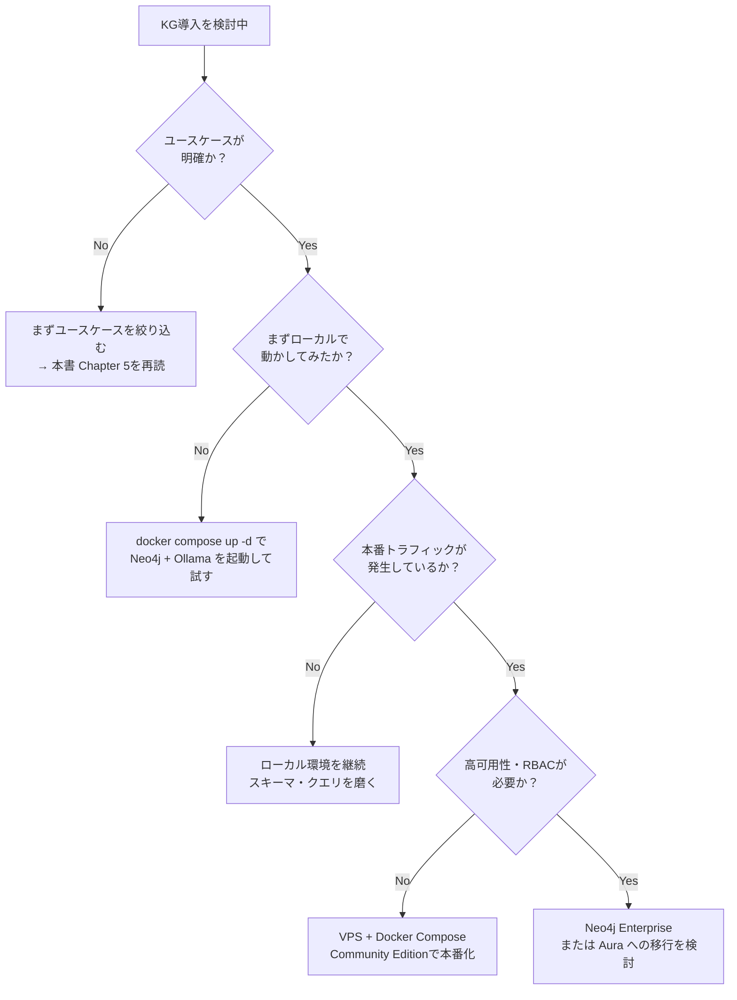

# スモールスタートで始めるKG実装：ローカル環境から本番への移行

ここまでの章で、ナレッジグラフがAIシステムの信頼性を支える基盤であることを見てきました。では実際に「自分たちで作る」となったとき、どんな課題が待ち受けているのでしょうか。

この章では、スモールスタートを前提とした実践的な判断軸を提示します。

本書のコードはすべて **ローカル環境（Ollama + Neo4j Docker）** で動作します。クラウドへの移行は要件が固まってからで十分です。

---

## KGを導入するときの現実的な課題

KGの概念はシンプルですが、本番運用レベルに持っていくには4つの根本的な課題があります。エンタープライズと同じ課題ですが、スモールスタートのコンテキストでは意味合いが異なります。

### 課題1：データ統合

「社内のデータを一元管理したい」と言っても、データはCRM・チケット管理・Slack・Notionなど複数のSaaSに散在しています。エンタープライズなら専任チームを組めますが、少人数チームでは1〜2人のエンジニアがこの問題を扱わなければなりません。

**スモールスタートの現実：** まず1〜2のデータソースに絞り込み、手作業ETLでも動くスモールスタートが現実的です。

### 課題2：権限管理

KGは「つながり」を追跡するデータ構造のため、権限管理を後付けで実装しようとすると、構造全体の設計を見直す必要が生じます。

**スモールスタートの現実：** 権限の種類が少ない段階では、シンプルなロールベースアクセス（閲覧/編集/管理の3段階）から始められます。スキーマ設計の初期段階から権限を意識しておくことがポイントです。

### 課題3：継続的更新

業務は変化します。組織改編があれば担当者ノードの関係が変わります。製品仕様が更新されれば、関連するすべてのエッジを見直す必要があります。

**スモールスタートの現実：** リアルタイム同期は過剰投資になりやすいです。週次バッチや手動トリガーによる更新から始め、自動化は必要性が明確になってから追加する戦略が有効です。

### 課題4：AI Agentとの統合

KGをAI Agentが活用するためには、単なるデータ取得APIでは不十分です。エージェントが文脈を理解しながらKGを参照し、業務フローの中でシームレスに動く仕組みが必要です。

**スモールスタートの現実：** LangChainの `GraphCypherQAChain` や `Neo4jGraph` を使えば、数十行でKG+LLMパイプラインが動きます（前章参照）。まずこのシンプルな構成から始め、要件に応じて拡張する方針が現実的です。

| 課題 | 技術難易度 | 優先度 | スモールスタートの入口 |
|------|-----------|--------|---------------------|
| データ統合 | 高 | 高 | 1データソースから始める |
| 権限管理 | 中〜高 | 中 | 3段階のロールで設計 |
| 継続的更新 | 中 | 中 | 週次バッチから始める |
| AI Agent統合 | 高 | 高 | LangChain+Neo4jで最短実装 |

---

## OSS実装の現実的なコスト試算

「自前で作れば安い」と思いがちですが、実態を確認しましょう。

| フェーズ | 工数（人月） | エンジニア人件費（推測） |
|---------|------------|----------------------|
| スキーマ設計・データモデリング | 1〜2ヶ月 | 80〜160万円 |
| データ統合・ETLパイプライン構築 | 2〜3ヶ月 | 160〜240万円 |
| LLM連携・クエリ最適化 | 1〜2ヶ月 | 80〜160万円 |
| 権限管理・マルチテナント対応 | 1〜2ヶ月 | 80〜160万円 |
| 本番運用体制・監視設計 | 1ヶ月 | 80万円 |
| **合計** | **6〜10ヶ月** | **推測480〜800万円** |

※ エンジニア単価80万円/月・1人作業の前提。推測値であり、要件・チーム体制により大幅に変動します。

**スモールスタートで読むと：** 専任エンジニアを1人立てて6〜10ヶ月は現実的ではありません。「1ユースケース・2データソース・読み取り専用KG」に絞れば、設計〜PoC稼働を1〜2ヶ月に短縮できます。スコープを絞ることが最大の武器です。

ローカル環境（Docker）であればインフラコストは0円です。エンジニア工数が主なコストになるため、内製化するかどうかの判断は「チームにKGを学ぶ時間的余裕があるか」が核心になります。

---

## 「今すぐ動く」ためのミニマム構成

理論より実践。最速でKG+LLMを動かすための最小構成を示します。

### 構成：Neo4j（Docker）+ Ollama + LangChain

```
[ユーザーの質問]
    ↓
[LangChain GraphCypherQAChain]
    ↓ Cypherクエリ自動生成
[Neo4j（Docker コンテナ）]
    ↓ グラフ探索結果
[Ollama（ローカルLLM）]
    ↓ 自然言語で回答生成
[ユーザーへの回答]
```

この構成の特徴：

- **Neo4j（Docker）**：`docker compose up -d` だけで起動。インフラコスト0円
- **Ollama（ローカルLLM）**：`llama3.2` がローカルで動作。APIキー不要
- **LangChain**：Neo4jとOllamaをつなぐグルーコード。`GraphCypherQAChain` で自然言語→Cypher変換を自動化

セットアップ方法は本書「KGの作り方」章のdocker-compose.ymlを参照してください。

実装の詳細（コード含む）は前章「KGの作り方」で解説済みです。

### 最初の1ユースケースを選ぶ

ミニマム構成で試すユースケースの選び方：

- **誤答コストが中程度**（致命的ではないが、間違いが頻発すると困る）
- **データが手元にある**（CSVやJSON形式で100〜1000件程度）
- **質問パターンが絞れる**（3〜5種類の典型的なクエリが想定できる）

例として適しているユースケース：
- 社内FAQ・ドキュメントの関係管理（「この手順書に関連するドキュメントは？」）
- バグ・チケットと担当者・コンポーネントの関係管理
- 製品カタログの仕様・互換性管理

**アドバイス：** まず1つのユースケースで動かしてみることが何より重要です。「完璧なKGを設計してから始める」という発想を捨て、「動くものを作って育てる」サイクルに入ることが成功パターンです。

---

## ローカル環境から本番への段階的移行ガイド

ローカルで動作確認ができたら、次のステップは本番化です。無理に一気に移行する必要はありません。段階的に進めましょう。

### Phase 1：Docker Compose（ローカル・開発）

本書のdocker-compose.ymlがこのフェーズに対応しています。1台のマシンで完結するシンプルな構成です。

```
docker compose up -d
→ Neo4j + Ollama が同一ホストで動作
→ 開発・検証に最適
```

**Neo4j Community Edition の制限（このフェーズで把握しておくこと）**

- クラスタリング（複数ノード構成）は Enterprise Edition のみ
- ロールベースアクセス制御（RBAC）の詳細設定は Enterprise Edition のみ
- バックアップ・リストアは Community でも可能（コマンドラインで手動実行）

小規模チームの開発・検証用途であれば Community で十分です。

### Phase 2：VPS / クラウドVMへの移行

本番トラフィックが発生し始めたら、VPS（さくらのVPS、Hetzner等）またはクラウドVM（AWS EC2、GCPのCompute Engine等）への移行を検討します。

基本的にdocker-compose.ymlをそのままVPSにデプロイできます。追加で必要な作業：

```bash
# 1. パスワードを強力なものに変更
# .env ファイルを作成
echo "NEO4J_PASSWORD=your-strong-password-here" > .env

# 2. ファイアウォールで7474/7687ポートを内部のみに制限
# （例: UFW使用時）
ufw allow from 10.0.0.0/8 to any port 7474
ufw allow from 10.0.0.0/8 to any port 7687
```

> ⚠️ **本番環境では強力なパスワードを使用してください。** ポート7474・7687は外部に公開しないようにファイアウォールで制限してください。

### Phase 3：Docker Swarm / Kubernetes への移行

複数サーバーへのスケールアウトが必要になった場合の移行先です。このフェーズに到達するのは、かなりの規模（DAU数万人以上）になってからが多いです。

**Docker Swarm（比較的シンプル）**

```bash
# Swarmの初期化
docker swarm init

# docker-compose.yml を Swarm スタックとしてデプロイ
docker stack deploy -c docker-compose.yml kg-stack
```

**Neo4j Community → Enterprise へのアップグレード判断基準**

| 検討トリガー | Community | Enterprise |
|-------------|-----------|------------|
| 高可用性（HA）が必要 | × | ◎ |
| 細かいRBACが必要 | △ | ◎ |
| 無停止バックアップ | △ | ◎ |
| サポート契約が必要 | × | ◎ |
| 月額コスト | 無料 | 要問い合わせ（数万円〜） |

**判断の目安：** 「システムが止まると直接ビジネス損失が発生する」「複数部署が異なる権限でアクセスする」といった要件が出てきたタイミングでEnterpriseを検討してください。それまでは Community + 定期バックアップで十分です。

### Ollama → クラウドLLM切り替えのコスト試算

ローカルOllamaで動作確認ができたら、精度要件に応じてクラウドLLMへの切り替えを検討できます。

| LLM | 推定コスト（100万トークン） | 特徴 |
|-----|--------------------------|------|
| Ollama（llama3.2） | 0円（ローカル実行） | ローカル動作。精度はモデル依存 |
| OpenAI GPT-4o | 約$10〜$30 | 高精度。Cypher生成の品質が高い |
| Anthropic Claude Sonnet | 約$3〜$15 | バランス型。長文コンテキストに強い |

LangChainを使っている場合、LLMの切り替えは1行の変更で済みます：

```python
# ローカル（デフォルト）
from langchain_ollama import OllamaLLM
llm = OllamaLLM(model="llama3.2", base_url="http://localhost:11434")

# クラウドLLMに切り替える場合（オプション）
# from langchain_anthropic import ChatAnthropic
# llm = ChatAnthropic(model="claude-sonnet-4-6")
```

**切り替えの判断基準：** Ollamaで生成されるCypherクエリの精度が実用に足りるかどうかを先に検証してください。多くのユースケースでは `llama3.2` で十分な精度が出ます。クラウドLLMは「精度が明らかに不足している」と判明してから検討しても遅くありません。

---

## クラウドサービスの選択肢（参考）

自前構築が難しい場合の選択肢として、以下のマネージドサービスも存在します。

- **Neo4j Aura**（クラウド版Neo4j）：ローカル環境と同じCypherクエリが使える
- **Amazon Neptune**：AWS環境に統合したい場合
- **TigerGraph**：大規模グラフ処理が必要な場合

ただし本書のコードはすべてローカルのNeo4j（Docker）で動作します。クラウド移行は要件が固まってからで十分です。

---

## 判断フローチャート

どのアプローチを選ぶべきか迷ったときは、以下のフローで考えてみてください。



---

## AI PoCを成功させるための5原則

技術の選択より前に、PoCそのものの成否を左右する設計があります。

実務や各種調査で繰り返し示されるのは、PoCが止まる理由の多くが「技術が動かなかった」ではなく、スコープ・意思決定・データ準備・運用設計といった「技術の外側」にある、という点です。KGを使ったシステムも例外ではありません。以下の5原則は、PoCを本番に届けるための判断基準です。

**1. Diagnose Before Prescribe（処方より診断を先に）**

問題が「検索精度の低さ」なのか「データの欠落」なのか「業務フローの設計ミス」なのかを診断せずに技術選定をしてはいけません。RAGで十分な問題にKGを持ち込むと、コストと複雑さが増すだけです。スキーマ設計の前に「なぜこの問題が起きているか」の診断を行うことが、KG導入の最初のステップです。

**2. Vision Re-Engineering（ビジョンを本番スケールで描く）**

「PoCが動いた」と「本番でスケールできる」は別の問いです。PoC段階で「このシステムが社内500人に使われた場合、どの部分が壊れるか」を描けていない場合、本番化で失速します。ローカルDockerで動いたシステムが本番に届かない最大の原因は、ここにあります。

**3. Trusted Advisor（業務とAIの両方を知る人を置く）**

社内に「AIに詳しい人」を置くだけでは、PoCは十分に前に進みにくいです。必要なのは「この業務のどこにAIが効くか・効かないか」を判断できる人材です。技術だけに詳しいエンジニアと、業務だけに詳しい担当者の「間」に立てる人をPoC初日から関与させてください。

**4. Disciplined Validation（計測可能な指標で検証する）**

「精度が上がった気がする」では本番化の根拠になりません。レイテンシ・回答精度・コスト・ユーザー拒否率など、計測可能な指標を最初に定義し、それに基づいてGoを判断します。KGのCypherクエリ実行ログは、参照した事実（ノード・関係性）を追跡する材料になります。一方でLLMの生成品質や業務KPIは別レイヤなので、そこは別途計測が必要です。

**5. Red Flags（中止すべきサインを知る）**

以下のどれかが当てはまる場合、PoCを続けても本番には届きません:

- 「全部入り」要件定義（スコープが最初から絞られていない）
- 「データクレンジングが終わったら始める」待ち（データは常に汚い）
- 「承認者が決まっていない」（誰もGoと言える人がいない）

KG導入の場合、特に「データ統合の担当者が決まっていない」は運用不全になりやすいサインです。スキーマ設計がどれだけ優れていても、データを誰が・いつ・どう更新するかが決まっていなければ、KGは数ヶ月で陳腐化しやすくなります。

---

## まとめ：KG実装戦略

### 「作って終わり」にしないために

KGは構築したら完成ではありません。業務が変化すればデータも変化します。継続的に価値を出し続けるための戦略を3点挙げます。

**1. 小さく始めて育てる**

最初のKGは「使い捨てPoC」として設計しても構いません。1ユースケースで動かし、チームがKGの価値を体感できたら、次のユースケースを追加する。この繰り返しで自然とKGが育っていきます。

**2. スキーマの変更コストを下げる**

初期設計はシンプルに保ち、ノードタイプ5〜10個・エッジタイプ10〜20個から始めることを推奨します（第2章参照）。Neo4jはRDBのALTER TABLEほどスキーマ変更のコストが高くないため、「まず動かす、後で洗練させる」アプローチが成立します。

**3. 更新フローを業務に組み込む**

KGが古くなれば価値は失われます。「誰がどのタイミングでKGを更新するか」をチームのワークフローに組み込んでおくことが、長期的な品質維持の鍵です。GitHub Actionsや既存のCIパイプラインに週次更新ジョブを仕込む方法が実践的です。

### KGロードマップ（参考）

```
Phase 1（1〜2ヶ月）：1ユースケースでPoC
  → docker compose up -d で Neo4j + Ollama を起動
  → LangChain + GraphCypherQAChain で動くものを作る

Phase 2（3〜6ヶ月）：本番化と拡張
  → VPS + Docker Compose で本番デプロイ
  → データ品質・権限管理・更新フローを整備
  → 2〜3ユースケースに拡張
  → 必要に応じてクラウドLLMへ切り替え

Phase 3（6ヶ月以降）：組織知識基盤として育てる
  → AI Agentとの統合を本格化
  → 必要に応じて Neo4j Enterprise / マネージドサービスへ移行を検討
```

---

→ さらに深く：[Neo4j 公式ドキュメント - Getting Started](https://neo4j.com/docs/getting-started/)

→ さらに深く：[LangChain × Neo4j 統合ガイド](https://python.langchain.com/docs/integrations/providers/neo4j/)

---

## おわりに：ナレッジグラフの先へ

本書を最後まで読んでいただき、ありがとうございます。

KG＋LLMは「作って終わり」の技術ではありません。スキーマを育て、ユースケースを積み重ね、チームの知識をグラフに蓄積していくことで、時間とともに価値が増していくシステムです。

まず1つ、動かしてみてください。最小限の構成（Neo4j + Ollama + LangChain）で、自分のデータをグラフに乗せる。そこから先は、本書で学んだ設計思想が自然と道を示してくれるはずです。

---

**ナレッジグラフに関するご質問・ご相談**

設計の相談、実装でつまずいた点、「自分のユースケースに使えるか？」といった問いかけなど、KGに関することであればお気軽にどうぞ。

Zennのコメント欄、またはX（旧Twitter）[@takanorisuzuki](https://x.com/takanorisuzuki) のDMでご連絡ください。
