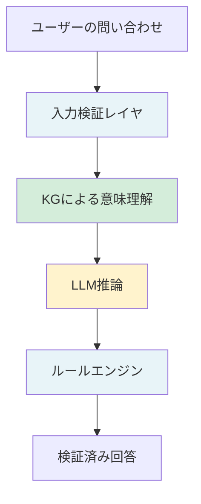
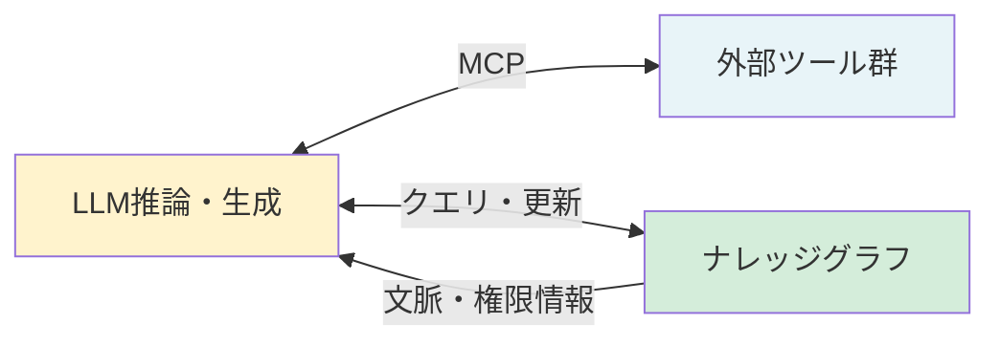
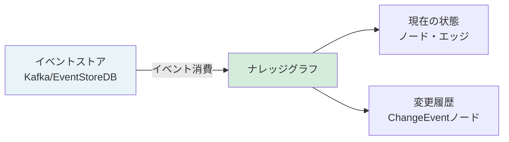
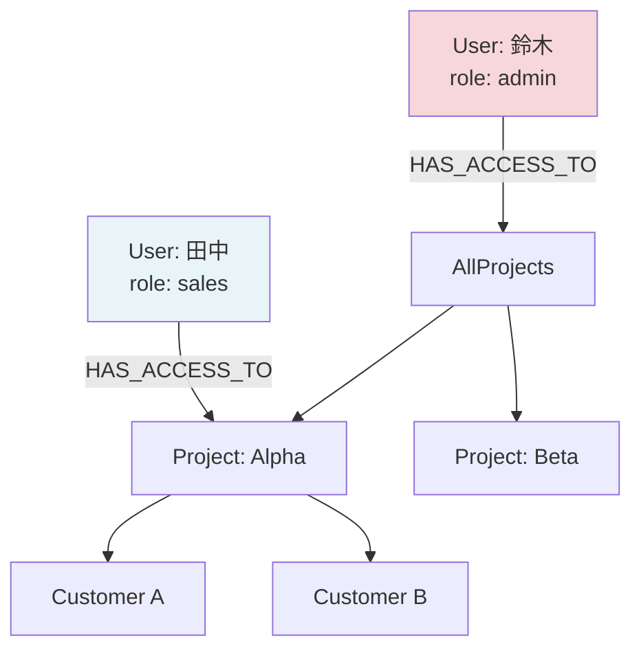
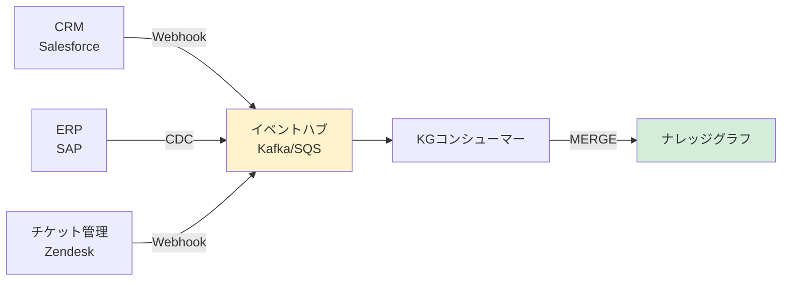
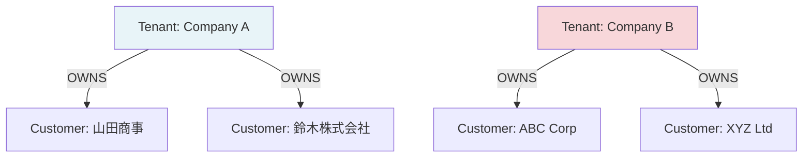
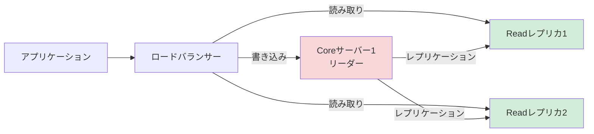

# エンタープライズKGの設計：LLMを形式レイヤでサンドイッチする

「社内AIを作ったが、答えが毎回ブレる」「LLMに業務ルールを覚えさせたが、適用が不安定」。エンタープライズでAI活用を進めようとすると、こういった問題に突き当たります。

その根本原因は、LLMだけで「判断」まで担わせていることにあります。

## エンタープライズでKGが難しい理由

ナレッジグラフが業務AIにとって重要だと分かっていても、実際に導入しようとすると複数の壁が立ちはだかります。

- **スキーマ設計**：業務概念（顧客・案件・組織・製品）をどのようにノードとエッジで定義するか。設計を誤ると後から修正が困難です
- **権限管理**：「このユーザーにはこのノードを見せない」という制御をグラフ上でどう実現するか
- **継続的更新**：業務は日々変化します。KGが陳腐化しないよう、変更をリアルタイムに反映する仕組みが必要です
- **他システム統合**：CRM・ERP・チケット管理・ドキュメント管理……複数のシステムに散らばったデータをどう一元化するか

これらを一気に解決しようとするのは現実的ではありません。そこで有効な考え方が「形式レイヤ」です。

## 「形式レイヤ」という概念

形式レイヤとは、**決定論的に正しい結果を返す処理層**のことです。LLMが確率的に答えを生成するのとは対照的に、形式レイヤは入力が同じなら必ず同じ答えを返します。

形式レイヤには主に3種類あります。

| レイヤ | 役割 | 向いている処理 |
|--------|------|----------------|
| SQL / データベース | 値の整合性保証 | 金額・数量・日付などの正確な取得 |
| ナレッジグラフ | 意味と関係性の推論 | 「この顧客の担当者は誰か」「この製品に関連するポリシーは」 |
| ルールエンジン | ポリシー判断 | 「承認フローはどうなるか」「この操作は権限的に許可されるか」「GDPRやSOX法などのコンプライアンス要件を満たしているか」 |

これらをLLMの前後に配置することで、「入力の検証」と「出力の保証」が実現します。

## サンドイッチ構成：LLMを形式レイヤで挟む



このアーキテクチャでLLMが担うのは「文脈を踏まえた自然言語の生成」に限定されます。事実の取得はKG・SQL、判断はルールエンジンが担います。

「LLMだけで業務AIを作るのは、暗算だけで監査を通ろうとするようなものです。」LLMに業務ロジックをすべて委ねることはリスクが高すぎます。

## MCPとKGを組み合わせた三層設計

Anthropicが2024年に発表したMCP（Model Context Protocol）は、LLMが外部システム（ファイル、データベース、APIなど）へアクセスするための標準オープン規格です。いわば「LLMと外部世界をつなぐUSBケーブルの規格」であり、対応ツールであれば同じ仕様でLLMと接続できます。ただしMCPはI/O（入出力）を担うものであり、それだけでは「記憶」がありません。

そこでKGをメモリ層として組み合わせることで、より強固な設計が実現します。



MCPはI/O（入出力）を担い、KGはメモリ（長期記憶）を担います。MCPで取得した情報をKGに蓄積し、次回以降の推論に活かす。このサイクルが「学習し続けるエンタープライズAI」の基盤になります。

---

## スキーマ設計のベストプラクティス

KGの設計で最初に直面するのがスキーマ設計です。「どのエンティティをノードにして、どの情報をプロパティにするか」の判断が、後の拡張性を大きく左右します。

### ノードvsプロパティの判断基準

KG設計でよく迷うのが「これはノードにすべきか、それともプロパティ（属性）にすべきか」です。

**ノードにすべきケース**

- 他のエンティティとの関係（エッジ）を持つ可能性がある
- そのエンティティ自体に複数の属性がある
- 同じエンティティが複数の場所から参照される
- クエリの起点・終点になりうる

**プロパティにすべきケース**

- 単純な値（文字列・数値・日付）
- 他のエンティティと関係を持たない
- そのエンティティ単独でクエリされることがない

**実例で考える**

例：顧客の「住所」はノードにすべきかプロパティにすべきか。

:::details 例（展開）

```
// プロパティとして扱う場合（シンプルだが拡張性が低い）
CREATE (c:Customer {
    id: "cust-001",
    name: "田中太郎",
    address: "東京都渋谷区..."
})

// ノードとして扱う場合（複雑だが拡張性が高い）
CREATE (c:Customer {id: "cust-001", name: "田中太郎"})
CREATE (a:Address {
    id: "addr-001",
    prefecture: "東京都",
    city: "渋谷区",
    street: "..."
})
CREATE (c)-[:LIVES_AT {since: "2020-01"}]->(a)
```

:::

住所を「ノード化」するメリット：「渋谷区に住む顧客は何人か」「同じ住所に複数の顧客が登録されているか（不正検知）」などのクエリが効率的になります。一方でシンプルなシステムでは過剰設計になります。

ポイント：迷ったら「このエンティティを起点・終点としたクエリを将来実行するか？」という問いで判断しましょう。答えがYesなら、ノード化を検討してください。

### イベントソーシングパターンとKGの相性

イベントソーシングとは「システムの状態変化をすべてイベントとして記録する」設計パターンです。KGとの相性は非常に良く、特に「いつ、誰が、何を変更したか」の追跡が重要なエンタープライズシステムに適しています。



イベントをKGで表現する場合、「変更そのものをノード」として持つ設計が有効です。

:::details コード例（展開）

```python
# イベントソーシング × KGの実装例（Cypher）
# 顧客が製品を購入するイベントをKGに記録

def record_purchase_event(driver, event: dict):
    query = """
    // イベントノードを作成
    CREATE (e:PurchaseEvent {
        id: $event_id,
        occurred_at: datetime($occurred_at),
        amount: $amount,
        currency: $currency
    })

    // 顧客との関係
    WITH e
    MATCH (c:Customer {id: $customer_id})
    CREATE (c)-[:PERFORMED]->(e)

    // 製品との関係
    WITH e
    MATCH (p:Product {id: $product_id})
    CREATE (e)-[:PURCHASED]->(p)

    // 最新の購入状態を更新（現在のスナップショット）
    WITH e
    MATCH (c:Customer {id: $customer_id})
    MERGE (c)-[r:CURRENTLY_OWNS]->(p)
    ON CREATE SET r.since = datetime($occurred_at)
    ON MATCH SET r.last_updated = datetime($occurred_at)

    RETURN e.id AS recorded_event
    """
    with driver.session() as session:
        result = session.run(query, **event)
        return result.single()["recorded_event"]
```

:::

このアプローチでは、KGには「現在の状態（スナップショット）」と「変更履歴（イベント）」の両方が共存します。「この顧客が過去1年間に購入した製品はどれか」というクエリは履歴ノードを辿り、「この顧客が現在何を持っているか」はスナップショットから取得するという使い分けができます。

### バージョン管理：KGのスキーマをどう進化させるか

KGのスキーマは、ビジネスの変化に伴って変化します。「CustomerノードにLTV（顧客生涯価値）プロパティを追加したい」「従来のDEPARTMENT関係をORG_UNITという新しいノードタイプに移行したい」。こうした変更をどう安全に行うかが、長期運用の課題です。

**マイグレーション戦略**

:::details コード例（展開）

```python
class KGSchemaMigration:
    """KGスキーマのバージョン管理"""

    def __init__(self, driver):
        self.driver = driver

    def get_current_version(self) -> str:
        query = """
        MATCH (v:SchemaVersion)
        RETURN v.version AS version
        ORDER BY v.applied_at DESC
        LIMIT 1
        """
        with self.driver.session() as session:
            result = session.run(query)
            record = result.single()
            return record["version"] if record else "0.0.0"

    def apply_migration(self, version: str, migration_fn):
        """マイグレーションを適用し、バージョンを記録"""
        current = self.get_current_version()
        print(f"現在バージョン: {current} → 適用バージョン: {version}")

        # マイグレーション実行
        migration_fn(self.driver)

        # バージョンを記録
        with self.driver.session() as session:
            session.run("""
            CREATE (v:SchemaVersion {
                version: $version,
                applied_at: datetime(),
                applied_by: $applied_by
            })
            """, version=version, applied_by="migration-script")

        print(f"マイグレーション {version} 完了")

# 使用例：CustomerノードにLTVプロパティを追加
def migration_add_ltv(driver):
    with driver.session() as session:
        # 既存顧客にデフォルト値でLTVを追加
        session.run("""
        MATCH (c:Customer)
        WHERE c.ltv IS NULL
        SET c.ltv = 0.0, c.ltv_calculated_at = datetime()
        """)

migration = KGSchemaMigration(driver)
migration.apply_migration("1.2.0", migration_add_ltv)
```

:::

実務メモ：KGのスキーマ変更は「後方互換性を保つ追加」を基本方針にしましょう。既存のプロパティ名を変更するより、新しいプロパティを追加して移行期間中に両方を持つ「ダブルライト期間」を設けるアプローチが安全です。

---

## 権限管理の実装パターン

エンタープライズKGで最も設計が難しいのが権限管理です。「AさんはCustomerノードを参照できるが、顧客の年収プロパティは見えない」「BさんはProject:Alpha以下のノードしか操作できない」。こうした細かい制御をKGでどう実現するかを見ていきます。

### Row-level security相当をKGで実現する方法

RDBMSでは「Row-level security」という機能で行単位のアクセス制御ができます。KGでは「Node-level security」に相当する仕組みを自前で実装します。

基本アプローチは「ユーザーのアクセス可能なノードをKG内に定義する」です。



:::details コード例（展開）

```python
def get_accessible_customers(driver, user_id: str) -> list[dict]:
    """ユーザーがアクセス可能な顧客のみを返す（Row-level security相当）"""
    query = """
    MATCH (u:User {id: $user_id})-[:HAS_ACCESS_TO|MEMBER_OF*1..3]->(scope)
    MATCH (scope)-[:CONTAINS|OWNS*0..2]->(c:Customer)
    RETURN DISTINCT
        c.id AS customer_id,
        c.name AS customer_name,
        c.plan AS plan
    // センシティブプロパティはここでフィルタリング
    // （c.annual_revenue など機密情報は返さない）
    """
    with driver.session() as session:
        result = session.run(query, user_id=user_id)
        return [dict(record) for record in result]
```

:::

このクエリの特徴は、ユーザーのロールやプロジェクト所属を辿って、アクセス可能なノードを動的に計算している点です。ユーザーのアクセス権限が変わればKGのエッジを変えるだけで即時反映されます。

### 属性ベースアクセス制御（ABAC）のKGへの適用

ABAC（Attribute-Based Access Control）は「ユーザーの属性」「リソースの属性」「環境の属性（時間・場所など）」を組み合わせてアクセス制御を行う方式です。KGの場合、これらの属性をノード・プロパティとして表現することで、ABAC相当の制御が実装できます。

:::details コード例（展開）

```python
def check_access_permission(driver, user_id: str, resource_id: str, action: str) -> dict:
    """
    ABACポリシーをKGで評価する
    返値: {"allowed": bool, "reason": str}
    """
    query = """
    MATCH (u:User {id: $user_id})
    MATCH (r:Resource {id: $resource_id})

    // ユーザーの属性（ロール、部署、セキュリティクリアランスレベル）
    OPTIONAL MATCH (u)-[:HAS_ROLE]->(role:Role)
    OPTIONAL MATCH (u)-[:BELONGS_TO]->(dept:Department)

    // リソースの属性（機密レベル、オーナー部署）
    OPTIONAL MATCH (r)-[:CLASSIFIED_AS]->(classification:SecurityLevel)
    OPTIONAL MATCH (r)-[:OWNED_BY]->(owner_dept:Department)

    // アクセスポリシーを評価
    MATCH (policy:AccessPolicy)
    WHERE policy.action = $action
    AND policy.user_role = role.name
    AND (policy.resource_classification IS NULL
         OR policy.resource_classification = classification.level)
    AND (policy.same_dept_only = false
         OR dept.id = owner_dept.id)

    RETURN
        count(policy) > 0 AS allowed,
        collect(policy.description) AS matching_policies
    """
    with driver.session() as session:
        result = session.run(
            query,
            user_id=user_id,
            resource_id=resource_id,
            action=action
        )
        record = result.single()
        if record and record["allowed"]:
            return {"allowed": True, "reason": f"ポリシー適用: {record['matching_policies']}"}
        return {"allowed": False, "reason": "アクセス権限なし"}
```

:::

### Cypherクエリレベルでの権限フィルタリング実装例

すべてのクエリに権限フィルタリングを手動で追加するのは非現実的です。実際の実装では、クエリラッパーとして権限チェックを注入する仕組みを作ります。

> ⚠️ **以下は概念説明のための疑似実装です**
> `run_with_auth` は権限フィルタをクエリに実際には適用していません（auth_prefixがRETURN節に注入されていない）。本番環境でKGの権限制御を実装する場合は、**Neo4j Enterprise の RBAC**（Role-Based Access Control）または専用の認可ライブラリを使用してください。このコードをそのまま本番に使用しないでください。

:::details コード例（展開）

```python
class SecureKGClient:
    """権限チェック付きKGクライアント（概念説明用・疑似実装）"""

    def __init__(self, driver, user_id: str):
        self.driver = driver
        self.user_id = user_id
        self._user_scope = None

    def _get_user_scope(self) -> list[str]:
        """ユーザーがアクセス可能なスコープIDを取得（キャッシュ付き）"""
        if self._user_scope is not None:
            return self._user_scope

        query = """
        MATCH (u:User {id: $user_id})-[:HAS_ACCESS_TO|MEMBER_OF*1..3]->(scope)
        RETURN collect(DISTINCT scope.id) AS scope_ids
        """
        with self.driver.session() as session:
            result = session.run(query, user_id=self.user_id)
            self._user_scope = result.single()["scope_ids"]
        return self._user_scope

    def run_with_auth(self, query: str, params: dict = None) -> list[dict]:
        """権限フィルタリングを注入してクエリを実行"""
        scope_ids = self._get_user_scope()

        # パラメータに権限スコープを追加
        auth_params = {**(params or {}), "_scope_ids": scope_ids}

        # クエリの先頭に権限チェックを注入
        auth_prefix = """
        WITH $__scope_ids AS __allowed_scopes
        """
        # 注意：実際の実装では、クエリをパースしてWHERE節を安全に注入する
        # この例は概念を示すための簡略化したもの

        with self.driver.session() as session:
            result = session.run(query, auth_params)
            return [dict(record) for record in result]

# 使用例
client = SecureKGClient(driver, user_id="user-tanaka")
customers = client.run_with_auth(
    "MATCH (c:Customer) RETURN c.name, c.plan"
)
```

:::

実務メモ：Neo4j Enterpriseを使っている場合は、Role-Based Access Control（RBAC）がネイティブサポートされており、データベースレベルで権限を設定できます。自前実装よりもNeo4j組み込みのRBACを使う方が、セキュリティホールが少なくなります。

---

## KGの継続的更新パターン

KGは一度作って終わりではありません。業務の変化に合わせてリアルタイムで更新し続けることが、KGの価値を維持する鍵です。

### イベントドリブン更新（Kafka/Webhookとの連携）

最も推奨されるアーキテクチャは「イベントドリブン更新」です。業務システムでデータが変化するたびにイベントが発行され、そのイベントをコンシューマーがKGに反映します。



:::details コード例（展開）

```python
import json
from kafka import KafkaConsumer
from neo4j import GraphDatabase

class KGUpdateConsumer:
    """Kafkaからイベントを消費してKGを更新するコンシューマー"""

    def __init__(self, kafka_bootstrap: str, neo4j_uri: str, neo4j_auth: tuple):
        self.consumer = KafkaConsumer(
            'crm-events',
            bootstrap_servers=kafka_bootstrap,
            value_deserializer=lambda m: json.loads(m.decode('utf-8')),
            group_id='kg-updater'
        )
        self.driver = GraphDatabase.driver(neo4j_uri, auth=neo4j_auth)

    def process_events(self):
        for message in self.consumer:
            event = message.value
            event_type = event.get("type")

            if event_type == "customer.created":
                self._upsert_customer(event["data"])
            elif event_type == "customer.updated":
                self._update_customer(event["data"])
            elif event_type == "deal.closed":
                self._record_deal(event["data"])
            else:
                print(f"未処理のイベントタイプ: {event_type}")

    def _upsert_customer(self, data: dict):
        """顧客ノードをUPSERT（存在すれば更新、なければ作成）"""
        query = """
        MERGE (c:Customer {id: $id})
        SET c.name = $name,
            c.plan = $plan,
            c.updated_at = datetime()
        RETURN c.id
        """
        with self.driver.session() as session:
            # **data ではなくフィールドを明示的に渡す（Neo4jドライバーが予約済みキーワードと衝突する場合があるため）
            session.run(query, id=data["id"], name=data["name"], plan=data["plan"])
            print(f"顧客 {data['id']} をKGに反映")

    def _record_deal(self, data: dict):
        """成約情報をKGに記録"""
        query = """
        MATCH (c:Customer {id: $customer_id})
        MATCH (p:Product {id: $product_id})
        CREATE (d:Deal {
            id: $deal_id,
            amount: $amount,
            closed_at: datetime($closed_at)
        })
        CREATE (c)-[:CLOSED]->(d)
        CREATE (d)-[:FOR]->(p)
        """
        with self.driver.session() as session:
            # **data ではなくフィールドを明示的に渡す（余分なキーによるエラーを防ぐため）
            session.run(
                query,
                customer_id=data["customer_id"],
                product_id=data["product_id"],
                deal_id=data["deal_id"],
                amount=data["amount"],
                closed_at=data["closed_at"]
            )
```

:::

### 変更検知と差分更新

すべてのシステムがWebhookやKafkaに対応しているわけではありません。レガシーシステムでは「定期的にポーリングして差分を検知する」アプローチが現実的です。

:::details コード例（展開）

```python
import hashlib

class KGDiffUpdater:
    """差分検知によるKG更新"""

    def __init__(self, driver):
        self.driver = driver

    def compute_entity_hash(self, entity: dict) -> str:
        """エンティティの内容からハッシュを計算（変更検知用）"""
        # IDを除いたプロパティでハッシュ計算
        content = {k: v for k, v in sorted(entity.items()) if k != 'id'}
        return hashlib.md5(json.dumps(content).encode()).hexdigest()

    def sync_customers(self, source_customers: list[dict]):
        """ソースシステムからの顧客リストとKGを同期"""
        updated = 0
        created = 0

        for customer in source_customers:
            new_hash = self.compute_entity_hash(customer)

            with self.driver.session() as session:
                result = session.run("""
                MERGE (c:Customer {id: $id})
                ON CREATE SET
                    c += $props,
                    c._hash = $hash,
                    c._created_at = datetime(),
                    c._updated_at = datetime(),
                    c._is_new = true
                ON MATCH SET
                    c += CASE WHEN c._hash <> $hash THEN $props ELSE {} END,
                    c._hash = $hash,
                    c._updated_at = CASE WHEN c._hash <> $hash THEN datetime() ELSE c._updated_at END,
                    c._is_new = false
                RETURN c._is_new AS is_new
                """,
                id=customer["id"],
                props=customer,
                hash=new_hash
                )
                record = result.single()
                if record and record["is_new"]:
                    created += 1
                else:
                    updated += 1

        print(f"同期完了: 新規作成={created}, 更新={updated}")
```

:::

### データ品質モニタリング

KGの品質を継続的に監視することも重要です。「孤立したノード（エッジがないノード）」「プロパティが欠落しているノード」「矛盾した関係」などを定期的にチェックします。

:::details コード例（展開）

```python
def run_kg_quality_checks(driver) -> dict:
    """KGデータ品質チェック"""
    checks = {}

    with driver.session() as session:
        # チェック1: 孤立した顧客ノード（関係がない）
        result = session.run("""
        MATCH (c:Customer)
        WHERE NOT (c)-[]-()
        RETURN count(c) AS isolated_customers
        """)
        checks["isolated_customers"] = result.single()["isolated_customers"]

        # チェック2: 必須プロパティが欠落しているノード
        result = session.run("""
        MATCH (c:Customer)
        WHERE c.name IS NULL OR c.plan IS NULL
        RETURN count(c) AS missing_required_props
        """)
        checks["missing_required_props"] = result.single()["missing_required_props"]

        # チェック3: 重複の可能性があるノード（同じ名前の顧客）
        result = session.run("""
        MATCH (c1:Customer), (c2:Customer)
        WHERE c1.id < c2.id AND c1.name = c2.name
        RETURN count(*) AS potential_duplicates
        """)
        checks["potential_duplicates"] = result.single()["potential_duplicates"]

    # アラート閾値チェック
    if checks["isolated_customers"] > 100:
        print(f"警告: 孤立ノードが{checks['isolated_customers']}件あります")
    if checks["potential_duplicates"] > 0:
        print(f"警告: 重複の可能性があるノードが{checks['potential_duplicates']}件あります")

    return checks
```

:::

---

## マルチテナントKGの設計

SaaSプロダクトでKGを使う場合、複数顧客（テナント）のデータを同一のKGインスタンスで管理する必要が出てきます。テナント間のデータ漏洩を防ぎながら、コスト効率よく運用するための設計が求められます。

### アプローチ1：テナントノードによるスコーピング

最もシンプルなアプローチは、すべてのノードにテナントIDを持たせ、すべてのクエリにテナントフィルタを入れる方法です。

:::details コード例（展開）

```python
# マルチテナントKGのクエリパターン
def get_customer_data(driver, tenant_id: str, customer_id: str) -> dict:
    """
    テナントスコープ付きクエリ
    テナントIDが一致するノードのみ返す
    """
    query = """
    MATCH (t:Tenant {id: $tenant_id})-[:OWNS]->(c:Customer {id: $customer_id})
    RETURN c
    """
    with driver.session() as session:
        result = session.run(query, tenant_id=tenant_id, customer_id=customer_id)
        record = result.single()
        return dict(record["c"]) if record else None
```

:::



このアプローチのメリットは実装がシンプルであることです。デメリットは「テナントIDの注入を忘れると全テナントのデータが見えてしまう」リスクがあることです。先ほど示した`SecureKGClient`のようなラッパーで、テナントIDの注入を強制するのが安全です。

### アプローチ2：テナント別データベース（Neo4j Enterprise）

データ分離を厳密にしたい場合、テナントごとに別のNeo4jデータベースを使う方法があります。Neo4j Enterpriseでは1つのインスタンスで複数のデータベースをホストできます。

:::details コード例（展開）

```python
class MultiTenantKGManager:
    """テナント別データベースを管理するクラス"""

    def __init__(self, driver):
        self.driver = driver

    def create_tenant_database(self, tenant_id: str):
        """新テナント用のデータベースを作成"""
        db_name = f"tenant_{tenant_id.replace('-', '_')}"
        with self.driver.session(database="system") as session:
            session.run(f"CREATE DATABASE {db_name} IF NOT EXISTS")
        print(f"テナント {tenant_id} のデータベース {db_name} を作成")
        return db_name

    def get_tenant_session(self, tenant_id: str):
        """テナント専用セッションを取得"""
        db_name = f"tenant_{tenant_id.replace('-', '_')}"
        return self.driver.session(database=db_name)
```

:::

実務メモ：テナント数が多い（100テナント以上）SaaSでは、テナント別データベースはインスタンスのオーバーヘッドが大きくなります。データ量と分離要件のトレードオフを考慮して選択してください。

---

## 本番運用のチェックリスト

KGを本番環境で運用する際に確認すべき事項を整理します。

### 可用性

- [ ] Neo4j Causal Cluster（または選択したグラフDBのHA構成）の設定
- [ ] ヘルスチェックエンドポイントの実装と死活監視の設定
- [ ] 接続プールのサイズ調整（同時クエリ数に応じた設定）
- [ ] タイムアウト設定（長時間クエリによるスレッド枯渇防止）

### バックアップ

:::details コード例（展開）

```bash
# Neo4jのバックアップコマンド例
neo4j-admin database dump --database=neo4j --to-path=/backup/kg-$(date +%Y%m%d).dump

# S3への自動バックアップ例（cron設定）
# 0 2 * * * neo4j-admin database dump ... && aws s3 cp /backup/kg-$(date +%Y%m%d).dump s3://my-bucket/kg-backups/
```

:::

- [ ] 日次バックアップの自動化
- [ ] バックアップからのリストア手順の文書化と定期訓練
- [ ] バックアップファイルの暗号化（顧客データを含む場合は必須）

### スケーリング



- [ ] 読み取りワークロードをReadレプリカへルーティングする設定
- [ ] インデックスの最適化（頻繁にクエリされるプロパティにインデックスを追加）
- [ ] クエリプロファイリングの実施（`EXPLAIN`/`PROFILE`コマンドの活用）
- [ ] キャッシュ層の設計（同一クエリの繰り返し実行を避ける）

### セキュリティ

- [ ] KGへの通信はTLS暗号化
- [ ] 本番DBへのアクセスは踏み台サーバー経由のみ
- [ ] サービスアカウントのパスワードローテーション
- [ ] クエリログの有効化と監査ログの保存

ポイント：「本番KGへの書き込みは、マイグレーションスクリプトと自動化されたイベントコンシューマー経由のみ」とするポリシーを最初から設けておくと、人為的なデータ破損を防げます。

---

## まとめ：構造が信頼を生む

LLMの確率的な性質を理解した上で、形式レイヤというガードレールを設計することが、エンタープライズAIの信頼性につながります。KGは「AIのための業務知識データベース」であり、単なるドキュメント検索の補助ではありません。

スキーマ設計・権限管理・継続的更新・マルチテナント対応。これらを最初から全部完璧に作ろうとする必要はありません。「1チームの知識から始めて、段階的に拡張する」アプローチで、まず動くKGを作ることが最も重要です。

---

次章では、AI AgentとKGを組み合わせて自律的なシステムを実現する方法を見ていきます。

→ さらに深く：[LLM依存を下げる業務AIアーキテクチャ https://zenn.dev/knowledge_graph/articles/llm-formal-layer-architecture](https://zenn.dev/knowledge_graph/articles/llm-formal-layer-architecture)

→ さらに深く：[形式レイヤの実装ガイド https://zenn.dev/knowledge_graph/articles/formal-layer-llm-rag-2025-11](https://zenn.dev/knowledge_graph/articles/formal-layer-llm-rag-2025-11)

→ さらに深く：[MCPの課題とKG https://zenn.dev/knowledge_graph/articles/mcp-knowledge-graph](https://zenn.dev/knowledge_graph/articles/mcp-knowledge-graph)
