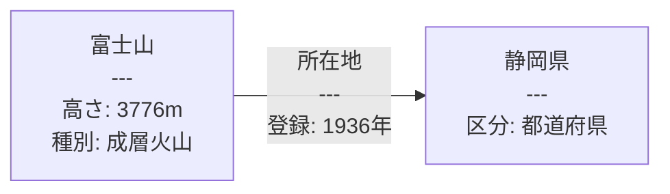
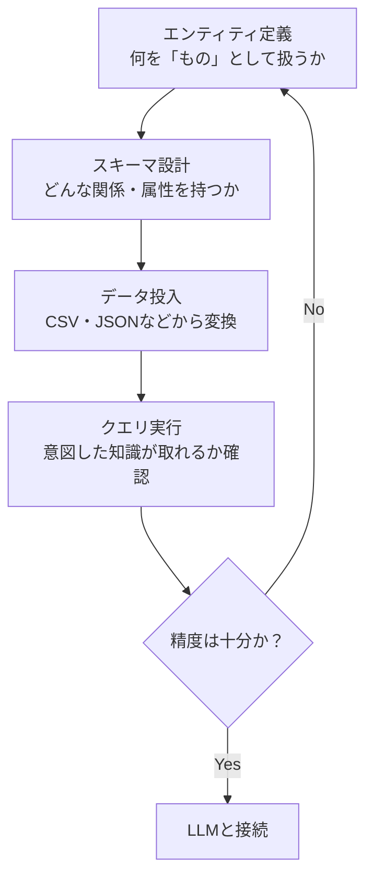
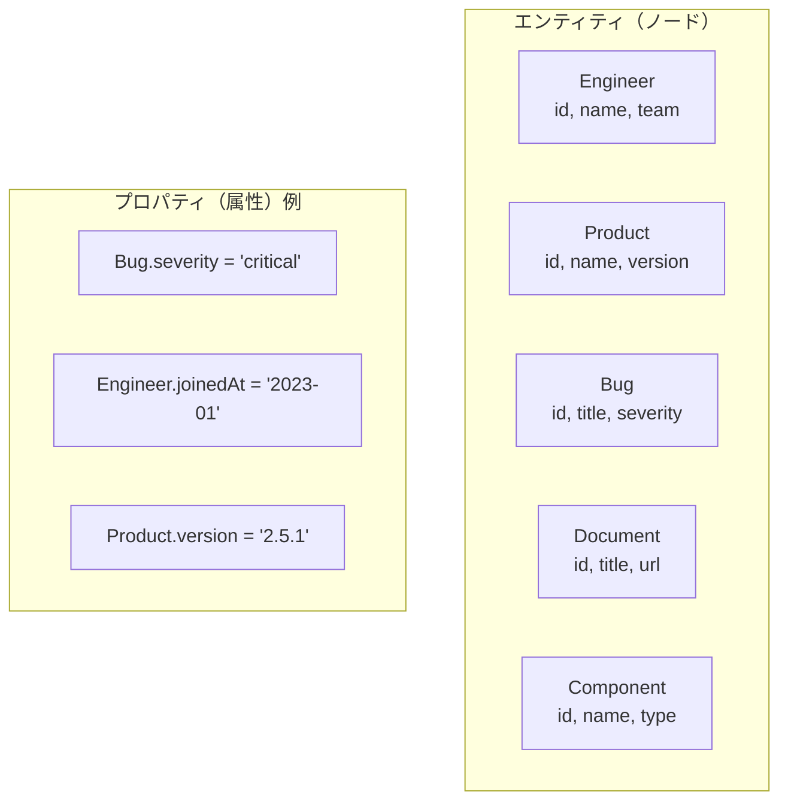
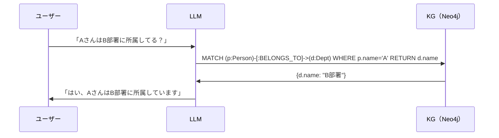

# KGの作り方：RDFとProperty Graph、そしてDockerで試す

ここからは実際に手を動かす内容に入ります。コードに不慣れな方は概念を確認するだけでも構いません。次章の設計パターンから読み始めることもできます。

「ナレッジグラフを使ってみたい。でも、何から始めればいいか分からない」

この章では、KGを実際に作るための基礎知識と、今日から試せる具体的な手順をお伝えします。難しい数学は不要です。大事なのは「どのツールを選ぶか」という判断と、「まず動かしてみる」という姿勢です。

---

## ステップ0：ユースケースの絞り込み（KGを作る前にやること）

KGを作り始める前に、多くのチームが見落とすことがあります。それが「スコープの定義」です。

「社内のすべての知識をグラフ化したい」という目標は素晴らしいですが、そのまま着手すると失敗します。理由は3つです。

**理由1：モデリングの複雑度が指数的に増加する**

エンティティが増えるほど、関係の組み合わせは爆発的に増えます。「人」「製品」「プロジェクト」「ドキュメント」「組織」「タグ」を同時にモデリングしようとすると、関係の種類だけで50を超えることがあります。

**理由2：「誰が何のために使うか」が曖昧になる**

スコープが広いと、特定のユーザーにとって使いやすいクエリ設計が難しくなります。結果として「何でも入っているが、何かを調べるには使いにくい」KGが生まれます。

**理由3：データ品質の担保が難しい**

範囲が広いほど、データ整合性の維持コストが上がります。最初から完璧なKGを目指すと、データ投入・更新のフローが重くなり、結局更新されないKGになります。

### ユースケース絞り込みの実践

以下の4つの問いに答えることで、最初のスコープを決めます。

:::details 例（展開）

```
1. 誰が使うか（ペルソナ）
   例：カスタマーサポート担当者、新入社員、プロダクトマネージャー

2. 何を知りたいか（代表的な質問3〜5つ）
   例：「この製品に対応するドキュメントは？」
       「このバグを修正できるエンジニアは誰？」
       「A製品とB製品の仕様の違いは？」

3. どんなデータが手元にあるか（既存データソース）
   例：Confluenceページ、JIRAチケット、社員データベース

4. どのくらいの頻度で更新が必要か
   例：日次バッチ、リアルタイム、月次メンテナンス
```

:::

ポイント：最初のKGは「1ペルソナ、5〜10クエリ、1〜2データソース」から始めるのが成功率が高いです。

実務メモ：あるSaaSスタートアップの事例では、KG導入の初期フェーズでは「サポートエンジニアがバグレポートから関連コンポーネントを特定する」という単一ユースケースに絞りました。全社的な知識グラフの構築はその後の段階です。

---

## KGの2大アーキテクチャ

KGを構築するとき、まず選択が必要なのが「どのデータモデルを使うか」です。現在の主流は2つです。

### RDF（Resource Description Framework）

W3Cが標準化したモデルで、知識を「主語・述語・目的語」の3要素（トリプル）で表現します。

:::details 例（展開）

```
（東京）—[首都である]→（日本）
（富士山）—[高さは]→（3776m）
```

:::

クエリ言語はSPARQLで、セマンティックウェブや学術・政府系データとの互換性が高いのが特徴です。

### Property Graph

ノード（実体）とエッジ（関係）それぞれに、任意の属性（プロパティ）を持たせられる柔軟なモデルです。Neo4jやAmazon Neptuneが代表的な実装で、クエリ言語はCypherがよく使われます。



### どちらを選ぶか

| 判断基準 | RDF | Property Graph |
|---------|-----|----------------|
| W3C標準・相互運用性が必要 | ◎ | △ |
| 政府・学術データとの連携 | ◎ | △ |
| 開発速度・柔軟な設計 | △ | ◎ |
| LLMとの組み合わせ | ○ | ◎ |
| エンジニアの学習コスト | 高め | 低め |

**結論として**：W3Cへの準拠や既存のLinked Dataとの接続が不要なら、Property Graphから始めるほうが圧倒的に取り組みやすいです。

---

## KG構築の基本フロー

どのモデルを選んでも、KGを作る手順は共通しています。



### ステップ1：エンティティ定義

まず「何をノードにするか」を決めます。例えば社内ナレッジグラフなら、「製品」「部署」「担当者」「ドキュメント」「手順」などがエンティティ候補です。

### ステップ2：スキーマ設計

エンティティ間の関係と属性を定義します。「担当者は部署に所属する」「製品はドキュメントを持つ」といった関係性を明文化することが、KGの価値を決めます。

### ステップ3：データ投入

既存のCSVやデータベースから変換スクリプトを書いてデータを流し込みます。完璧を目指す前に、まず小規模なデータで動作を確認することが重要です。

### ステップ4：クエリで確認

「この製品の担当者は誰か」「この手順に関連するドキュメントは何か」といったクエリを実行し、期待通りの結果が得られるか確認します。

---

## エンティティ設計の実践：社内ナレッジグラフを例に

ここでは「社内技術ナレッジグラフ」を例に、エンティティ設計の具体的な手順を解説します。このKGのゴールは「サポートエンジニアが、受けた問い合わせから関連する製品・ドキュメント・担当者を素早く特定できる」ことです。

### エンティティ候補の洗い出し方

まず、代表的なユーザーストーリーを3〜5つ書き出し、そこに登場する「名詞」をリストアップします。名詞がエンティティ候補です。

:::details 例（展開）

```
ユーザーストーリー例：
- 「サポートエンジニアが、顧客から報告されたバグをJIRAチケットとして登録し、
   関連する製品コンポーネントを特定して、担当エンジニアにアサインする」

抽出された名詞（エンティティ候補）：
- サポートエンジニア
- 顧客
- バグ
- JIRAチケット
- 製品コンポーネント
- 担当エンジニア
```

:::

次に、これらの候補を「エンティティ（ノード）にする」か「プロパティ（属性）にする」かを判断します。

**エンティティにすべきもの（ノード化の基準）：**
- 他のエンティティと複数の関係を持つ
- 独立して参照・更新される
- 「それ自体について知りたいこと」がある

**プロパティにすべきもの（属性化の基準）：**
- 特定のエンティティの付加情報
- 他のエンティティとの関係がない
- 変化しないか、変化してもトラッキング不要



### アンチパターン：エンティティにすべき情報をプロパティに詰め込みすぎる問題

最もよくある設計ミスが「プロパティの肥大化」です。

**悪い例：**

:::details コード例（展開）

```cypher
// Bug ノードにすべての情報を詰め込む（アンチパターン）
CREATE (b:Bug {
    id: "BUG-001",
    title: "ログイン画面がフリーズする",
    severity: "critical",
    assigneeName: "山田太郎",          // 本来はノードにすべき
    assigneeEmail: "yamada@example.com", // 本来はノードにすべき
    componentName: "Auth Service",      // 本来はノードにすべき
    componentVersion: "1.2.3",          // 本来はノードにすべき
    relatedDocTitle: "認証フロー設計書"  // 本来はノードにすべき
})
```

:::

このモデルでは「山田太郎が担当するバグ一覧」や「Auth Serviceに関連するドキュメント一覧」を取得するのに文字列マッチングが必要になります。更新も手間がかかります（山田さんのメールアドレスが変わったら全Bugノードを更新する必要がある）。

**良い例：**

:::details コード例（展開）

```cypher
// 関係として表現する（推奨）
CREATE (b:Bug {id: "BUG-001", title: "ログイン画面がフリーズする", severity: "critical"})
CREATE (e:Engineer {id: "ENG-001", name: "山田太郎", email: "yamada@example.com"})
CREATE (c:Component {id: "COMP-001", name: "Auth Service", version: "1.2.3"})
CREATE (d:Document {id: "DOC-001", title: "認証フロー設計書", url: "https://..."})

// 関係を定義
CREATE (b)-[:ASSIGNED_TO]->(e)
CREATE (b)-[:AFFECTS]->(c)
CREATE (c)-[:DOCUMENTED_BY]->(d)
```

:::

ポイント：「あるノードAの情報を変更したときに、他のノードも変更が必要になる」場合、その情報は独立したエンティティにすべきです。

### 関係（エッジ）の命名規則

エッジの命名は、KGの可読性と拡張性を大きく左右します。以下のルールを守ると、チーム内での認識齟齬が減ります。

**命名規則1：動詞の大文字スネークケース**

:::details コード例（展開）

```cypher
// 良い例（動詞形・方向が明確）
(Engineer)-[:WORKS_ON]->(Project)
(Bug)-[:ASSIGNED_TO]->(Engineer)
(Document)-[:DESCRIBES]->(Component)
(Engineer)-[:REPORTED]->(Bug)

// 悪い例（名詞形・方向が曖昧）
(Engineer)-[:PROJECT]->(Project)        // 何の関係？
(Bug)-[:ENGINEER]->(Engineer)           // 担当？報告？承認？
```

:::

**命名規則2：方向性を意識する**

エッジには向きがあります。「AがBに何をするか」という視点で方向を決めます。

:::details 例（展開）

```
(Bug)-[:AFFECTS]->(Component)    ✓ 「バグはコンポーネントに影響する」
(Component)-[:AFFECTED_BY]->(Bug) △ 逆方向も表現可能だが、冗長になりやすい
```

:::

逆方向のクエリが頻繁に必要な場合を除き、片方向のエッジで統一し、クエリ側で方向を指定するほうが管理しやすいです。

**命名規則3：多重度の記録**

スキーマ定義ドキュメントに「1:N」「N:M」を明示します。

:::details 例（展開）

```
Engineer -[WORKS_ON]-> Project   : N:M（1人が複数PJに参加可能、1PJに複数人）
Bug -[ASSIGNED_TO]-> Engineer   : N:1（1バグに担当者は1人）
Document -[DESCRIBES]-> Component : N:M
```

:::

実務メモ：命名規則はチームでドキュメント化しておくこと。命名がバラバラになると、後からCypherクエリを書くときに「このエッジ名は何だったっけ」という問題が頻発します。

---

## Cypherクエリ入門（実践例7〜10クエリ）

CypherはNeo4jのクエリ言語です。SQLに似た構造で読みやすく、グラフ特有の経路探索も直感的に書けます。

### 基本構文の読み方

:::details コード例（展開）

```cypher
MATCH (n:ラベル {プロパティ: 値})-[:エッジ種別]->(m:ラベル)
WHERE n.プロパティ条件
RETURN n, m
```

:::

- `()` はノードを表す
- `[]` はエッジ（関係）を表す
- `->` は方向を表す（`-` は方向なし）
- `MATCH` は検索、`WHERE` は絞り込み、`RETURN` は出力

### クエリ1：基本的なノードの作成（CREATE）

:::details コード例（展開）

```cypher
// エンジニアと製品コンポーネントを作成
CREATE (e:Engineer {id: "ENG-001", name: "山田太郎", team: "Backend"})
CREATE (c:Component {id: "COMP-001", name: "Auth Service", language: "Go"})
RETURN e, c
```

:::

### クエリ2：重複を避けた作成（MERGE）

`CREATE` は毎回新しいノードを作りますが、`MERGE` は「なければ作る、あれば何もしない」という冪等な操作です。データ投入スクリプトでは `MERGE` を基本にします。

:::details コード例（展開）

```cypher
// 同じidのエンジニアが既存なら作成せず、なければ作成
MERGE (e:Engineer {id: "ENG-001"})
ON CREATE SET e.name = "山田太郎", e.team = "Backend", e.createdAt = datetime()
ON MATCH SET e.updatedAt = datetime()
RETURN e
```

:::

### クエリ3：関係の作成

:::details コード例（展開）

```cypher
// 既存ノードを取得して関係を作成
MATCH (e:Engineer {id: "ENG-001"})
MATCH (c:Component {id: "COMP-001"})
MERGE (e)-[:OWNS {since: "2023-04"}]->(c)
```

:::

### クエリ4：条件付き検索（WHERE句）

:::details コード例（展開）

```cypher
// severityが "critical" のバグと、その担当エンジニアを取得
MATCH (b:Bug)-[:ASSIGNED_TO]->(e:Engineer)
WHERE b.severity = "critical" AND b.status <> "resolved"
RETURN b.id, b.title, e.name
ORDER BY b.createdAt DESC
LIMIT 10
```

:::

### クエリ5：多段リレーションシップの探索

:::details コード例（展開）

```cypher
// エンジニア → 担当プロジェクト → 関連ドキュメントを2ステップで取得
MATCH (e:Engineer {name: "山田太郎"})-[:WORKS_ON]->(p:Project)-[:HAS_DOCUMENT]->(d:Document)
RETURN e.name, p.name, d.title
```

:::

### クエリ6：集計クエリ（COUNT・GROUP BY相当）

:::details コード例（展開）

```cypher
// 各エンジニアのオープンバグ数をカウント（多い順）
MATCH (e:Engineer)<-[:ASSIGNED_TO]-(b:Bug)
WHERE b.status = "open"
RETURN e.name, COUNT(b) AS bug_count
ORDER BY bug_count DESC
```

:::

### クエリ7：最短経路探索

:::details コード例（展開）

```cypher
// コンポーネントAからコンポーネントBへの依存経路を探索
MATCH path = shortestPath(
    (a:Component {name: "Auth Service"})-[:DEPENDS_ON*]-(b:Component {name: "Database"})
)
RETURN path, length(path) AS hops
```

:::

### クエリ8：否定・除外クエリ（担当者のいないバグ）

:::details コード例（展開）

```cypher
// 担当者がアサインされていないオープンバグ一覧
MATCH (b:Bug)
WHERE b.status = "open"
  AND NOT (b)-[:ASSIGNED_TO]->(:Engineer)
RETURN b.id, b.title, b.severity, b.createdAt
ORDER BY b.createdAt ASC
```

:::

### クエリ9：プロパティの更新

:::details コード例（展開）

```cypher
// バグのステータスを更新し、解決者と解決日時を記録
MATCH (b:Bug {id: "BUG-001"})
SET b.status = "resolved",
    b.resolvedAt = datetime(),
    b.resolvedBy = "ENG-001"
RETURN b
```

:::

### クエリ10：サブグラフの削除

:::details コード例（展開）

```cypher
// 解決済みバグとその関係をすべて削除（注意：本番では慎重に）
MATCH (b:Bug {status: "resolved"})
DETACH DELETE b
```

:::

ポイント：`DELETE` はノードのみ削除し、関係が残るとエラーになります。`DETACH DELETE` はノードとその関係をまとめて削除します。

---

## ローカル環境のセットアップ（Docker Compose）

本書のコードはすべて、ローカル環境（Ollama + Neo4j Docker）で動作します。クラウドサービスへの登録やAPIキーは不要です。

### docker-compose.yml

プロジェクトルートに以下の `docker-compose.yml` を作成してください。

:::details コード例（展開）

```yaml
# docker-compose.yml
version: "3.9"
services:
  neo4j:
    image: neo4j:5.13-community
    container_name: kg-neo4j
    ports:
      - "7474:7474"
      - "7687:7687"
    environment:
      - NEO4J_AUTH=neo4j/${NEO4J_PASSWORD:?NEO4J_PASSWORDを.envで設定してください}
    volumes:
      - neo4j_data:/data
    healthcheck:
      test: ["CMD", "wget", "-q", "--spider", "http://localhost:7474"]
      interval: 10s
      timeout: 5s
      retries: 5

  ollama:
    image: ollama/ollama:latest
    container_name: kg-ollama
    ports:
      - "11434:11434"
    volumes:
      - ollama_data:/root/.ollama

volumes:
  neo4j_data:
  ollama_data:
```

:::

> ⚠️ **セキュリティ注意：** `NEO4J_PASSWORD` は必ず `.env` ファイルで設定してください。未設定のままコンテナを起動しようとするとエラーになります。本番環境では強力なパスワードを使用し、外部からのアクセスを制限してください。
>
> ```bash
> # .env（このファイルは .gitignore に追加してください）
> NEO4J_PASSWORD=your-strong-password-here
> ```

### セットアップ手順

:::details コード例（展開）

```bash
# 1. コンテナ起動
docker compose up -d

# 2. Ollamaモデルのダウンロード（初回のみ）
docker exec kg-ollama ollama pull llama3.2
docker exec kg-ollama ollama pull nomic-embed-text

# 3. 動作確認
curl http://localhost:11434/api/generate \
  -d '{"model":"llama3.2","prompt":"Hello","stream":false}'
```

:::

起動後、ブラウザで `http://localhost:7474` を開けば、Neo4jのグラフ可視化UIが使えます。

---

## データ投入スクリプト（Python）：CSVからNeo4jへ

実際のプロジェクトでは、既存のCSVやスプレッドシートからKGを構築することが多いです。以下は `neo4j` Pythonドライバーを使った実装例です。

### 前提：サンプルCSVの構造

:::details 例（展開）

```
engineers.csv:
id,name,team,email
ENG-001,山田太郎,Backend,yamada@example.com
ENG-002,鈴木花子,Frontend,suzuki@example.com

bugs.csv:
id,title,severity,status,assignee_id
BUG-001,ログイン画面がフリーズする,critical,open,ENG-001
BUG-002,検索結果が0件になる,high,open,ENG-002
```

:::

### 例1：CSVからNeo4jへの一括投入スクリプト

:::details コード例（展開）

```python
import csv
from neo4j import GraphDatabase
from typing import Optional

class KnowledgeGraphBuilder:
    def __init__(self, uri: str, auth: Optional[tuple] = None):
        self.driver = GraphDatabase.driver(uri, auth=auth)

    def close(self):
        self.driver.close()

    def load_engineers(self, csv_path: str):
        """エンジニアCSVをNeo4jに投入"""
        with open(csv_path, "r", encoding="utf-8") as f:
            engineers = list(csv.DictReader(f))

        with self.driver.session() as session:
            # バッチ処理でパフォーマンスを改善
            session.execute_write(self._batch_create_engineers, engineers)
        print(f"  {len(engineers)} 人のエンジニアを投入しました")

    @staticmethod
    def _batch_create_engineers(tx, engineers: list):
        """MERGEを使った冪等な一括投入"""
        query = """
        UNWIND $engineers AS eng
        MERGE (e:Engineer {id: eng.id})
        ON CREATE SET
            e.name = eng.name,
            e.team = eng.team,
            e.email = eng.email,
            e.createdAt = datetime()
        ON MATCH SET
            e.name = eng.name,
            e.team = eng.team,
            e.updatedAt = datetime()
        """
        tx.run(query, engineers=engineers)

    def load_bugs(self, csv_path: str):
        """バグCSVをNeo4jに投入し、担当者との関係も作成"""
        with open(csv_path, "r", encoding="utf-8") as f:
            bugs = list(csv.DictReader(f))

        with self.driver.session() as session:
            session.execute_write(self._batch_create_bugs, bugs)
        print(f"  {len(bugs)} 件のバグを投入しました")

    @staticmethod
    def _batch_create_bugs(tx, bugs: list):
        query = """
        UNWIND $bugs AS bug
        MERGE (b:Bug {id: bug.id})
        ON CREATE SET
            b.title     = bug.title,
            b.severity  = bug.severity,
            b.status    = bug.status,
            b.createdAt = datetime()
        ON MATCH SET
            b.status    = bug.status,
            b.updatedAt = datetime()
        WITH b, bug
        // 担当者エンジニアが存在する場合のみ関係を作成
        WHERE bug.assignee_id <> ""
        MATCH (e:Engineer {id: bug.assignee_id})
        MERGE (b)-[:ASSIGNED_TO]->(e)
        """
        tx.run(query, bugs=bugs)

    def create_indexes(self):
        """検索高速化のためのインデックス作成"""
        with self.driver.session() as session:
            indexes = [
                "CREATE INDEX engineer_id IF NOT EXISTS FOR (e:Engineer) ON (e.id)",
                "CREATE INDEX bug_id IF NOT EXISTS FOR (b:Bug) ON (b.id)",
                "CREATE INDEX bug_severity IF NOT EXISTS FOR (b:Bug) ON (b.severity)",
                "CREATE INDEX bug_status IF NOT EXISTS FOR (b:Bug) ON (b.status)",
            ]
            for index_query in indexes:
                session.run(index_query)
        print("  インデックスを作成しました")


def main():
    import os
    # ローカルDocker環境への接続（環境変数からパスワードを取得）
    builder = KnowledgeGraphBuilder(
        uri=os.getenv("NEO4J_URI", "bolt://localhost:7687"),
        auth=(
            os.getenv("NEO4J_USER", "neo4j"),
            os.getenv("NEO4J_PASSWORD")  # .envで設定必須
        )
    )

    try:
        builder.create_indexes()
        builder.load_engineers("data/engineers.csv")
        builder.load_bugs("data/bugs.csv")
        print("KG構築完了")
    finally:
        builder.close()


if __name__ == "__main__":
    main()
```

:::

実務メモ：`UNWIND $list` を使ったバッチ処理は、1件ずつ `session.run()` を呼ぶよりも大幅に高速です。1万件のノード投入で、単発実行との差は10倍以上になることがあります（推測：環境依存）。

---

## LangChainとNeo4jの連携

KGにデータが入ったら、次は「自然言語でKGに質問する」仕組みを作ります。LangChainの `GraphCypherQAChain` と `Neo4jGraph` を組み合わせると、数十行で自然言語→Cypherクエリ生成→回答のパイプラインが動きます。

### 例2：LangChain + Neo4jGraph で自然言語QA

:::details コード例（展開）

```python
import os
# pip install langchain-neo4j langchain-ollama
from langchain_neo4j import GraphCypherQAChain, Neo4jGraph
from langchain_ollama import OllamaLLM

NEO4J_URI = os.getenv("NEO4J_URI", "bolt://localhost:7687")
NEO4J_USER = os.getenv("NEO4J_USER", "neo4j")
NEO4J_PASSWORD = os.getenv("NEO4J_PASSWORD")
assert NEO4J_PASSWORD, "NEO4J_PASSWORD環境変数を設定してください（.envファイル推奨）"

# Neo4jGraphはスキーマを自動取得してLLMのプロンプトに含める
graph = Neo4jGraph(
    url=NEO4J_URI,
    username=NEO4J_USER,
    password=NEO4J_PASSWORD
)

# スキーマを確認（LLMへのコンテキストとして使われる）
print(graph.schema)
# 出力例:
# Node properties are the following:
# Engineer {id: STRING, name: STRING, team: STRING}
# Bug {id: STRING, title: STRING, severity: STRING, status: STRING}
# Relationship properties are the following:
# ASSIGNED_TO {}
# The relationships are the following:
# (:Bug)-[:ASSIGNED_TO]->(:Engineer)

# ローカルLLM（Ollama）でチェーンを設定
llm = OllamaLLM(model="llama3.2", base_url="http://localhost:11434")

chain = GraphCypherQAChain.from_llm(
    llm=llm,
    graph=graph,
    verbose=True,       # 生成されたCypherクエリを出力
    return_intermediate_steps=True,  # デバッグ用
    # ⚠️ セキュリティ注意：LLMが生成したCypherを無検証で実行します。
    # 本番環境では読み取り専用ユーザーで実行するか、生成クエリを事前検証してください。
    allow_dangerous_requests=True,   # LangChain v0.2以降は必要
)

# 自然言語で質問
questions = [
    "criticalなオープンバグは何件ありますか？",
    "山田太郎が担当しているバグのタイトルを教えてください",
    "Backendチームのエンジニアが担当しているバグ一覧を教えてください",
]

for q in questions:
    print(f"\n質問: {q}")
    result = chain.invoke({"query": q})
    print(f"回答: {result['result']}")
    # intermediate_stepsでLLMが生成したCypherクエリも確認できる
    cypher = result["intermediate_steps"][0]["query"]
    print(f"生成されたCypher: {cypher}")

# クラウドLLMを使う場合（オプション）
# from langchain_anthropic import ChatAnthropic
# llm = ChatAnthropic(model="claude-sonnet-4-6")
```

:::

### LLMが生成するCypherの例

上のコードを実行すると、LLMがスキーマを読んで以下のようなCypherを自動生成します。

:::details コード例（展開）

```cypher
-- 「criticalなオープンバグは何件ありますか？」に対して生成されるクエリ例
MATCH (b:Bug)
WHERE b.severity = 'critical' AND b.status = 'open'
RETURN COUNT(b) AS count

-- 「山田太郎が担当しているバグ」に対して生成されるクエリ例
MATCH (b:Bug)-[:ASSIGNED_TO]->(e:Engineer {name: '山田太郎'})
RETURN b.title, b.severity, b.status
```

:::

ポイント：`Neo4jGraph` がスキーマを自動取得してLLMのシステムプロンプトに含めるため、LLMはノード名・プロパティ名・関係の種類を「知った上で」Cypherを生成します。スキーマの品質がCypher生成の精度を直接左右します。

---

## RAGなしでもQAができる

ここで一つ、多くの方が驚く事実をお伝えします。**KGはRAGなしでも質問応答ができます。**

LLMとKGを組み合わせた最もシンプルな構成では、LLMがユーザーの質問をCypherクエリに変換し、KGから直接事実を取得して回答します。



`MATCH`（〜を検索する）、`WHERE`（絞り込み条件）、`RETURN`（返す値）という構文です。SQLに近い読み方ができます。

ベクトル検索も埋め込みモデルも不要。構造化された知識があれば、それだけで推論が成立します。これがKGの本質的な強みです。

---

## よくあるつまずきポイントと対処法

KGを実際に構築・運用する中で頻出する問題と、その対処法をまとめます。

### つまずき1：インデックス忘れによる検索の遅さ

Neo4jはデフォルトでは全ノードをスキャンします。数千ノードを超えると検索が遅くなります。

**症状：** クエリが数秒以上かかる、`EXPLAIN` で `NodeByLabelScan` が表示される

**対処：**

:::details コード例（展開）

```cypher
-- 検索頻度の高いプロパティにインデックスを作成
CREATE INDEX engineer_name IF NOT EXISTS FOR (e:Engineer) ON (e.name);
CREATE INDEX bug_severity IF NOT EXISTS FOR (b:Bug) ON (b.severity);
CREATE INDEX bug_status IF NOT EXISTS FOR (b:Bug) ON (b.status);

-- インデックスが使われているか確認
EXPLAIN MATCH (b:Bug {status: "open"}) RETURN b;
-- "NodeIndexSeek" が表示されればOK
```

:::

実務メモ：`PROFILE` キーワードを使うと、実際のクエリ実行計画と各ステップのコストが確認できます。パフォーマンス問題のデバッグに必須です。

### つまずき2：大量データ投入でのメモリ不足

一度に大量のノードを作成しようとすると、トランザクションメモリが不足してエラーになることがあります。

**症状：** `Java heap space` エラー、投入途中でクラッシュ

**対処：CALL { } IN TRANSACTIONS を使ったバッチ分割**

:::details コード例（展開）

```cypher
-- APOC不要。Neo4j 4.4以降のネイティブ機能でバッチ処理
LOAD CSV WITH HEADERS FROM 'file:///bugs.csv' AS row
CALL {
    WITH row
    MERGE (b:Bug {id: row.id})
    SET b.title = row.title,
        b.severity = row.severity,
        b.status = row.status
} IN TRANSACTIONS OF 1000 ROWS
```

:::

Pythonスクリプトでの対処：

:::details コード例（展開）

```python
def batch_insert(tx_function, data: list, batch_size: int = 500):
    """データをバッチに分割して投入"""
    for i in range(0, len(data), batch_size):
        batch = data[i:i + batch_size]
        with driver.session() as session:
            session.execute_write(tx_function, batch)
        print(f"  {min(i + batch_size, len(data))}/{len(data)} 件完了")
```

:::

### つまずき3：トランザクション設計のミス

複数のノード・エッジを同時に作成する際、一部が成功して一部が失敗すると、データが不整合な状態になります。

**対処：** 関連するCREATE/MERGEは一つのトランザクション内にまとめる

:::details コード例（展開）

```python
def create_bug_with_assignment(tx, bug_data: dict, engineer_id: str):
    """バグの作成と担当者アサインをアトミックに実行"""
    query = """
    MERGE (b:Bug {id: $bug_id})
    SET b.title = $title, b.status = $status
    WITH b
    MATCH (e:Engineer {id: $engineer_id})
    MERGE (b)-[:ASSIGNED_TO]->(e)
    RETURN b, e
    """
    return tx.run(query,
        bug_id=bug_data["id"],
        title=bug_data["title"],
        status=bug_data["status"],
        engineer_id=engineer_id
    ).data()

# トランザクション内でまとめて実行
with driver.session() as session:
    result = session.execute_write(
        create_bug_with_assignment,
        bug_data={"id": "BUG-100", "title": "新しいバグ", "status": "open"},
        engineer_id="ENG-001"
    )
```

:::

### つまずき4：MERGEの誤用（部分マッチ問題）

`MERGE` はすべてのプロパティが一致するノードを探します。一部のプロパティだけでMERGEすると、意図しない重複が発生します。

:::details コード例（展開）

```cypher
-- 危険：name が同じなら既存ノードを再利用するが、
-- team が違う場合でもマッチしてしまう
MERGE (e:Engineer {name: "山田太郎"})
SET e.team = "Frontend"

-- 安全：一意キー（id）でMERGEし、他のプロパティはSETで更新
MERGE (e:Engineer {id: "ENG-001"})
SET e.name = "山田太郎", e.team = "Frontend"
```

:::

ポイント：`MERGE` は常に「一意識別子」のプロパティだけで行い、それ以外は `SET` で更新するパターンを徹底してください。

---

## KGの品質チェック：サニティクエリ集

### 例3：サニティチェッククエリ集

KGを本番で使う前に、以下のクエリでデータ品質を確認します。

:::details コード例（展開）

```cypher
-- ===================================
-- 1. 孤立ノード検出（関係を持たないノード）
-- ===================================
MATCH (n)
WHERE NOT (n)--()
RETURN labels(n) AS label, COUNT(n) AS isolated_count
ORDER BY isolated_count DESC;
-- 孤立ノードが多い場合：データ投入スクリプトの関係作成部分にバグがある可能性

-- ===================================
-- 2. 担当者のいないオープンバグ
-- ===================================
MATCH (b:Bug)
WHERE b.status = "open"
  AND NOT (b)-[:ASSIGNED_TO]->(:Engineer)
RETURN b.id, b.title, b.severity, b.createdAt
ORDER BY b.severity DESC, b.createdAt ASC;

-- ===================================
-- 3. 存在しないエンジニアIDを参照しているバグ
-- （外部キー整合性チェック相当）
-- ===================================
MATCH (b:Bug)
WHERE b.assignee_id IS NOT NULL
  AND NOT EXISTS {
      MATCH (:Engineer {id: b.assignee_id})
  }
RETURN b.id, b.title, b.assignee_id AS dangling_reference;

-- ===================================
-- 4. 重複ノードの検出
-- ===================================
MATCH (e:Engineer)
WITH e.email AS email, COLLECT(e.id) AS ids, COUNT(*) AS cnt
WHERE cnt > 1
RETURN email, ids, cnt
ORDER BY cnt DESC;

-- ===================================
-- 5. ノード・エッジの総数確認（ヘルスチェック）
-- ===================================
MATCH (n)
RETURN labels(n)[0] AS label, COUNT(n) AS node_count
ORDER BY node_count DESC;

MATCH ()-[r]->()
RETURN type(r) AS relationship_type, COUNT(r) AS rel_count
ORDER BY rel_count DESC;

-- ===================================
-- 6. 循環参照の検出（DEPENDS_ONの場合）
-- ===================================
MATCH path = (a:Component)-[:DEPENDS_ON*]->(a)
RETURN [node IN nodes(path) | node.name] AS cycle_path
LIMIT 10;
-- 結果が返ってきた場合：循環依存があり、経路探索クエリが無限ループする可能性

-- ===================================
-- 7. 古いデータの検出（90日以上更新なし）
-- ===================================
MATCH (b:Bug {status: "open"})
WHERE b.createdAt < datetime() - duration({days: 90})
  AND b.updatedAt IS NULL
RETURN b.id, b.title, b.createdAt,
       duration.between(b.createdAt, datetime()).days AS days_open
ORDER BY days_open DESC
LIMIT 20;
```

:::

実務メモ：サニティチェックは週次のCIジョブとして自動実行することを推奨します。問題を早期に検出するほど、修正コストが下がります。

---

次章では、KGとRAGの役割分担について、それぞれの得意・苦手を整理していきます。

---

→ RDF vs Property Graph比較 https://zenn.dev/knowledge_graph/articles/rdf-vs-property-graph-2025

→ RAGなしで始めるKG QA https://zenn.dev/knowledge_graph/articles/kg-no-rag-starter

---

## サンプルコード

本章のコード（KG構築スクリプト・LangChain QAチェーン）はGitHubで公開しています。

→ [hands-on-kg-builder](https://github.com/DevRev-JP/tech-blog/tree/main/experiments/hands-on-kg-builder)

`docker compose up -d` でNeo4j + Ollamaをローカルに起動し、すぐに試せます。
