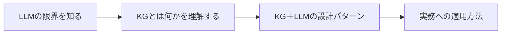
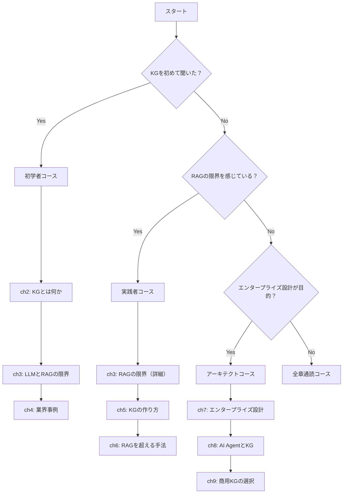
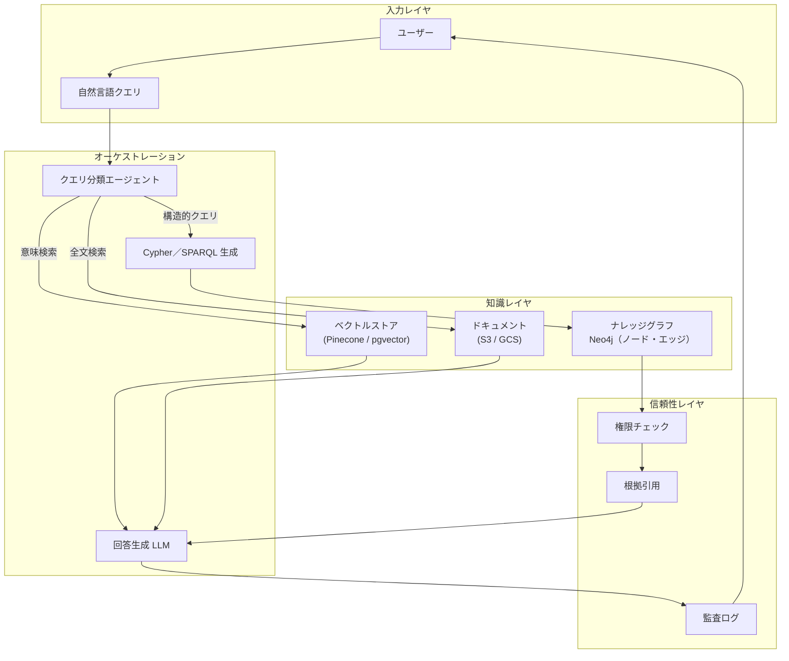

# はじめに：なぜLLMにナレッジグラフが必要なのか

「ChatGPTに同じ質問をしたら、昨日と今日で答えが違った」
「社内のルールを教えてもすぐ忘れる」
「もっともらしい回答が返ってくるのに、どこか信用しきれない」

こうした経験に心当たりがある方に、この本は書かれています。

## LLMは賢い。でも「確実」ではない

大規模言語モデル（LLM）は、テキスト生成の品質という意味では驚異的な進歩を遂げました。文章を要約する、コードを書く、質問に答える。いずれも2020年以前には考えられなかったレベルです。

しかし、業務で本格的に使おうとすると、すぐに壁にぶつかります。

- 回答が毎回ゆらぐ（同じ質問に異なる答え）
- 社内固有の情報（規程・製品仕様・顧客データ）を持っていない
- 「なぜそう答えたか」が追えない（ブラックボックス）
- 金額・契約条件・権限範囲などで誤答が起きると致命的

RAGを組み合わせれば解決する、と言われることもあります。しかしRAGを導入しても、根本的な問題が残るケースは少なくありません。その理由は後の章で詳しく見ていきます。

## この本の読者像

本書の主な想定読者は、**AIを業務に本気で活用しようとしているエンジニア**です。具体的には次のような方を想定しています。

- LLMやRAGを導入したが、精度・信頼性・説明可能性に限界を感じているエンジニア
- 「なぜその答えを返したか」を説明できるAIシステムを作りたい技術リーダー
- ナレッジグラフという言葉は知っているが、実務でどう使うか分からない方
- 商用プラットフォームではなく、OSSで自前実装できる技術スタックを求めている方

機械学習の数学的な知識は不要です。「構造化された知識とLLMを組み合わせる」という考え方を、具体的なコードとともに理解していただくことを目標にしています。

**本書のアプローチ：** 大企業向けの商用プラットフォームではなく、OSS・オンプレで自前実装できる技術を中心に解説します。Neo4jやLangChainなどOSSエコシステムを活用し、ローカル環境からVPS・本番環境まで段階的にスケールできる設計を目指します。

## 本書で分かること



各章の内容は次のとおりです。

1. **はじめに**（本章）：問題提起と本書の全体像
2. **ナレッジグラフとは何か**：ノードとエッジで知識を表現する仕組みと歴史
3. **LLMとRAGが抱える本当の問題**：なぜ生成AIパイロット案件の95%が失敗するのか
4. **世界はナレッジグラフをどう使っているか**：業界別の活用事例と国内外の先進企業
5. **KGの作り方**：RDFとProperty Graphの選択からDocker実装まで
6. **RAGを超える**：KGが得意な5つの問合わせ型とGraphRAGとの違い
7. **エンタープライズKGの設計**：形式レイヤとMCPを組み合わせた本番運用アーキテクチャ
8. **AI AgentとKG**：L1〜L5エージェント分類と権限認識型KGの必要性
9. **商用KGの世界**：自前構築vs商用プロダクトの判断基準と実装事例

SaaSスタートアップのエンジニアとして、実務でKGと向き合う立場から執筆しています。

## 一行で言うと

**ナレッジグラフは、LLMを「もっともらしい回答機」から「信頼できる知識エンジン」へと変える仕組みです。**

なぜそう言えるのか、次の章から一緒に見ていきましょう。

次章では、ナレッジグラフの仕組みと歴史を基礎から解説します。

---

## 執筆者について：なぜこのテーマで書くのか

筆者はSaaSスタートアップのエンジニアとして、カスタマーサポート・製品フィードバック・ナレッジ管理を統合するプラットフォームの開発に携わっています。

この業務の性質上、「誰がどのチケットを担当しているか」「ある製品バグとどの顧客が関係しているか」「サポート担当者が参照すべきドキュメントはどれか」といった、**関係性と構造を伴う知識**を扱う場面が日常的にあります。

そうした実務の中で、LLM単体やシンプルなRAGでは解決しきれない問題に繰り返し直面してきました。本書はその経験の蒸留です。

特定プロダクトの宣伝が目的ではありません。「構造化された知識をAIと組み合わせる」という設計思想は、どんな組織・どんな技術スタックにも適用できる普遍的なアプローチだと信じています。

**ポイント：** 実務の現場で生まれた問いを出発点にしているため、本書の内容は「試してみたら動いた」という実装よりも「なぜこの設計が必要か」という問いに多くの紙面を割いています。

---

## 本書の想定する技術スタック

本書では、以下のツール・ライブラリを中心に解説します。事前知識は必須ではありませんが、ある程度Pythonが読めると理解が深まります。

### グラフデータベース

| ツール | 用途 | 本書での位置づけ |
|--------|------|----------------|
| **Neo4j** | Property Graph型KGの代表格 | 主要実装例として使用 |
| Amazon Neptune | AWSマネージドグラフDB | 商用選択肢の一つとして紹介 |
| Apache Jena / RDF4J | RDF（トリプルストア）系 | RDF解説時に言及 |

### LLM・埋め込みレイヤ

| ツール | 用途 | 本書での位置づけ |
|--------|------|----------------|
| **LangChain** | LLMオーケストレーション | KG+LLM連携の実装例 |
| **LlamaIndex** | ドキュメントインデックス＋RAG | GraphRAGとの比較で使用 |
| **Ollama** | ローカルLLM実行エンジン | **コード例の主要LLMバックエンド** |
| OpenAI API / Claude API | クラウドLLM | オプション（コード例にコメントで記載） |

**本書のLLMスタンス：** コード例はすべて **Ollama（llama3.2 / nomic-embed-text）** をデフォルトとし、APIキー不要・完全ローカルで動作します。クラウドLLMへの切り替えはコメントとして各章に記載しています。

### Python ライブラリ

:::details コード例（展開）

```python
# 本書で使用する主なライブラリ
# pip install neo4j                # Neo4j Pythonドライバー
# pip install langchain-neo4j>=0.3 # LangChain Neo4j連携
# pip install langchain-ollama>=0.1 # LangChain Ollama連携
# pip install networkx             # 軽量グラフ操作（概念説明用）
# pip install rdflib               # RDFトリプル操作
```

:::

**実務メモ：** ローカル環境のセットアップは `podman-compose`（またはDocker Compose）で行います。Neo4j + Ollamaの全スタックを1コマンドで起動する `podman-compose.yml` を第6章で提供しています。Apple Silicon Mac および Linux（x86_64/ARM64）に対応しています。

---

## 読み方ガイド：あなたはどの読者タイプ？

本書は直線的に読む必要はありません。自分のゴールに合わせて、読む章を選んでください。



### 初学者コース（KGを初めて聞いた方）

→ **第2章 → 第3章 → 第4章** の順に読んでください。コードは読み飛ばしても概念は理解できます。

### 実践者コース（RAGを導入済みだが限界を感じている方）

→ **第3章 → 第5章 → 第6章** を優先してください。特に第5章のDocker実装と第6章のGraphRAGパターンが実務に直結します。

### アーキテクトコース（本番システム設計が目的の方）

→ **第7章・第8章・第9章** が本番アーキテクチャの核心です。第2〜6章を概念理解として流し読みした後、第7章から精読することをお勧めします。

**ポイント：** どのコースでも、第3章「LLMとRAGが抱える本当の問題」は読んでおくことをお勧めします。「なぜKGが必要か」の動機付けが明確になり、その後の内容がより腑に落ちます。

---

## この本で扱わないこと（スコープの明確化）

本書が「扱わないこと」を明示しておくことも重要です。期待値のミスマッチを防ぐためです。

### 扱わないこと

| トピック | 理由 |
|---------|------|
| **LLMの学習・ファインチューニング** | 本書のテーマはLLMの出力を「どう活用するか」であり、モデルそのものの改造は対象外 |
| **グラフアルゴリズムの数学的解説** | PageRank、Louvain等のアルゴリズム詳細は別の専門書に譲る |
| **SPARQL完全リファレンス** | RDFとSPARQLは概念レベルで触れるが、クエリ言語の網羅的解説はしない |
| **MLパイプラインの構築** | ベクトル埋め込みの生成手順は扱うが、機械学習モデルのトレーニングは対象外 |
| **特定クラウドの詳細設定** | AWSやGCPのコンソール操作手順は扱わない。設計思想を中心に解説する |
| **リアルタイムKG更新（ストリーミング）** | CDC（変更データキャプチャ）等のリアルタイム技術は発展的なトピックとして触れる程度にとどめる |

### 扱うこと（再確認）

- KGの概念・設計思想・選択基準
- Property Graph（Neo4j）による実装パターン
- LLM + KGを組み合わせたシステムの設計
- GraphRAGの仕組みと通常RAGとの違い
- エンタープライズでの本番運用を見据えたアーキテクチャ

**実務メモ：** 本書はどちらかというと「設計の書」です。コードは理解を助けるためのものです。実装の詳細は公式ドキュメントや後述の参考リンクを参照してください。

---

## KGとRAGを組み合わせたシステムの全体像

本書全体を通して実装を目指すアーキテクチャを、ここで先に見ておきましょう。詳細は各章で解説しますが、全体像を掴んでおくと個々のコンポーネントの位置づけが理解しやすくなります。オーケストレーション層は LangChain／LlamaIndex などで組み立てる想定です（図では短縮しています）。



このアーキテクチャのポイントは**クエリの種類によって経路を分けること**です。

- 「AさんはBプロジェクトの承認権限を持つか？」→ KGへの構造的クエリ
- 「先月の議事録に似た文書を探して」→ ベクトル類似度検索
- 「製品マニュアルの第3章を参照して」→ ドキュメントストアへの全文検索

すべてをベクトル検索一本で処理しようとするのが、多くのRAGが失敗する理由の一つです。

**ポイント：** このアーキテクチャは本書のゴールです。各章を読み進めながら、「今学んでいることがどこに位置するか」をこの図で確認してください。

---

次章では、ナレッジグラフの仕組みと歴史を基礎から解説します。

---

## 免責事項

本書に掲載しているコードおよび設定例は、**学習・検証目的**のものです。本番環境への適用にあたっては、以下の点にご注意ください。

- **セキュリティ設定**：本書のコード例にはデフォルトパスワードや認証省略のサンプルが含まれます。本番環境では必ず適切な認証・アクセス制御を設定してください
- **ライブラリバージョン**：LangChain・Neo4j・Ollamaは活発に更新されています。本書執筆時点（2026年3月）の動作を確認していますが、バージョンアップによりAPIが変更される場合があります
- **事例・統計データ**：本書に記載の企業事例・統計は出典を明記していますが、筆者が独自に確認できていないものには注記を付けています。重要な意思決定の根拠として使用する場合は一次ソースをご確認ください
- **損害責任**：本書の内容を参考にした実装・運用によって生じたいかなる損害についても、筆者は責任を負いかねます

専門的なシステム設計・セキュリティ要件については、適切な専門家にご相談ください。
