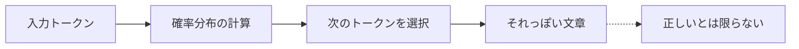
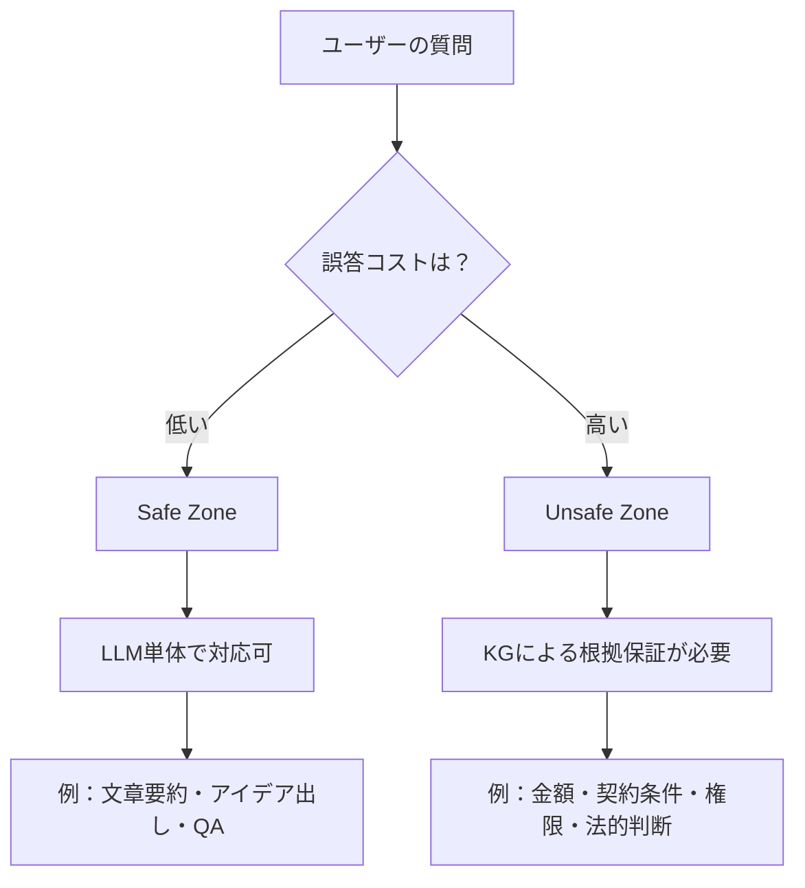
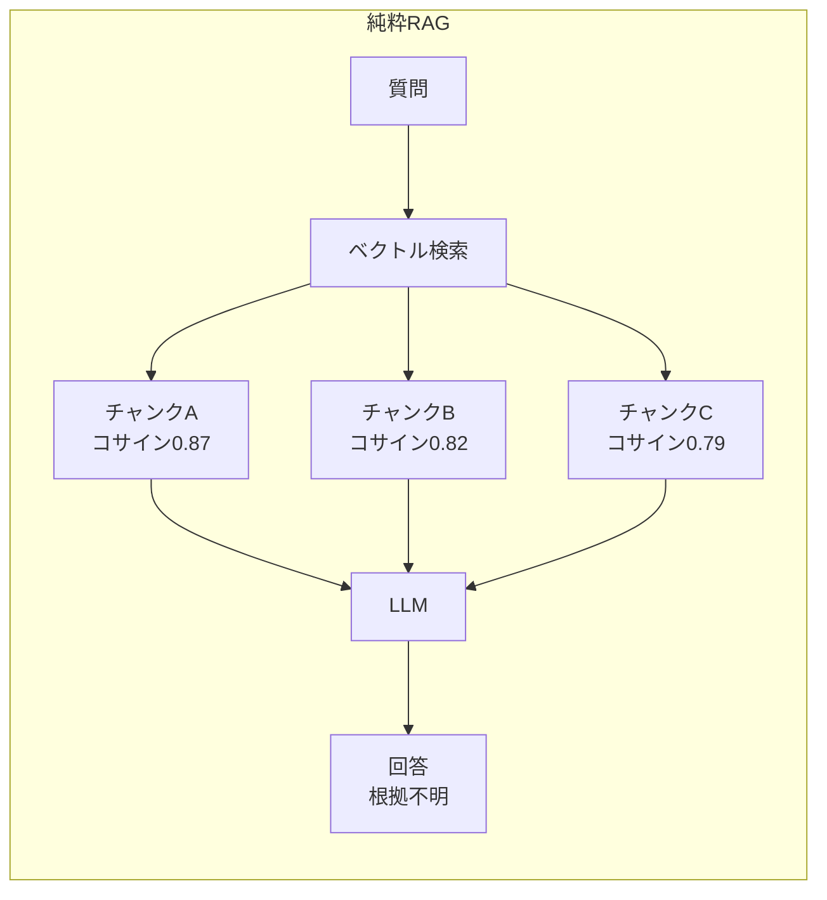
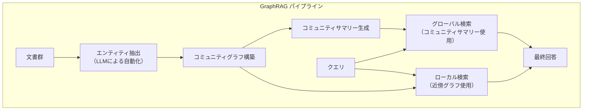
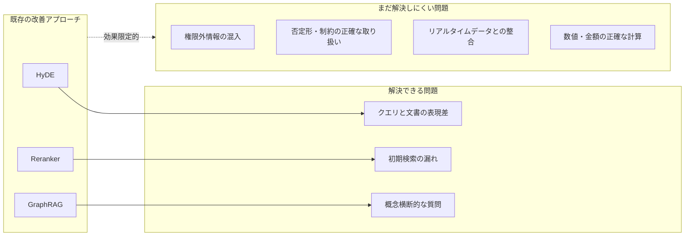
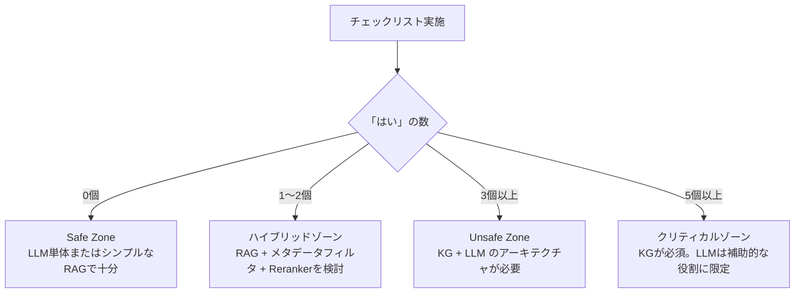

# LLMとRAGが抱える本当の問題：なぜ生成AIパイロット案件の95%が失敗するのか

「うちもAIを導入した。でもなぜかうまくいかない」

こうした声は、現場のエンジニアから経営層まで、今や至るところで聞かれます。これは特定の会社の失敗ではありません。業界全体の構造的な問題です。

## 95%のAI投資がROIゼロという現実

MITの報告書「**MIT NANDA Report**」（GenAI Divide: State of AI in Business 2025（2025年））は、衝撃的なデータを示しています。

- 生成AIパイロット案件の **95%** が実質的なROIをもたらしていない
- PoC・パイロットから本番環境への移行成功率は **わずか5%**
- 失敗の主因は「技術の問題」ではなく「**学習のギャップ（Learning Gap）**」

「学習のギャップ」とは何か。一言で言えば、**AIが文脈を記憶せず、毎回ゼロから始まる**という問題です。プロジェクトの背景、過去の意思決定、組織固有のルール。これらをAIは保持できません。人間なら経験として蓄積されるものが、AIでは毎回リセットされます。

## LLMの構造的限界

LLMは本質的に「**もっともらしいテキストを生成する確率機械**」です。



LLMが「東京の人口は約1400万人です」と答えるとき、それは「そのような文字列が続く確率が高い」から生成されたものです。実際の正確な値を参照しているわけではありません。

浮動小数点演算が「ほぼ正確」でも丸め誤差を含むように、LLMの出力は「ほぼ正確」でも真実を保証しません。金額・契約・権限が絡む場面でこの誤差は致命的です。

## RAGを加えても根本は変わらない

「RAGを組めばLLMの知識不足は解消できる」と言われます。確かにRAGは有効な手法ですが、万能ではありません。

| 手法 | できること | できないこと |
|------|-----------|-------------|
| LLM単体 | 流暢な文章生成 | 最新情報・社内情報の参照 |
| RAG | 関連文書の検索・参照 | 関係性の推論・構造的整合性の保証 |
| KG＋LLM | 上記すべて＋根拠の明示 | 構築コスト・スキーマ設計の工数が大きい／非構造化テキストのみの場合はオーバーエンジニアリングになりうる |

RAGのベクトル検索は「**意味のパターンマッチング**」です。「似た文章を持ってくる」ことは得意ですが、「AさんがBプロジェクトの承認権限を持ち、BプロジェクトはC予算に紐づく」といった**関係性の推論**は苦手です。

## Safe Zone と Unsafe Zone

すべての業務でKGが必要なわけではありません。重要なのは使い分けです。



**Safe Zone**（誤答コストが低い領域）では、LLMは十分に有効です。文章の要約、アイデアのブレスト、一般的な質問への回答など。

**Unsafe Zone**（誤答コストが高い領域）では、確率的なLLMだけに頼るのは危険です。金額の計算、契約条件の確認、権限の判定。これらで誤答が起きれば、ビジネス上のリスクになります。

## 結論：形式的な正しさが必要な領域には構造が必要

LLMは優れたツールです。しかし「正しさを保証する仕組み」ではありません。生成AIパイロット案件の95%が失敗する理由の一つは、**LLMをUnsafe Zoneに単独で投入してしまうこと**にあります。

解決策は、LLMを否定することではなく、**役割を明確に分けること**です。構造的な知識の管理はKGに、文章生成の品質はLLMに。この組み合わせが、信頼できるAIシステムの設計原則です。

---

## RAGが失敗する5つの典型パターン

RAGが「うまくいかない」と感じている場合、多くのケースはいくつかの典型的なパターンに当てはまります。自分のシステムを診断するつもりで読んでみてください。

### パターン1：チャンク境界問題

RAGは文書をチャンク（断片）に分割してインデックスします。問題は、**重要な情報がチャンクの境界をまたぐ場合**です。

```python
# チャンク境界問題のデモ
text = """
製品Aの保証期間は購入日から2年間です。ただし、以下の条件が
適用されます。消耗品（バッテリー・フィルター等）は保証対象外
となります。また、自然故障以外の損傷（落下・水濡れ等）も
保証対象外です。保証期間内の修理は無償で対応いたします。
"""

# chunk_size=100文字でチャンク分割した場合
chunk1 = "製品Aの保証期間は購入日から2年間です。ただし、以下の条件が適用されます。消耗品（バッテリー・"
chunk2 = "フィルター等）は保証対象外となります。また、自然故障以外の損傷（落下・水濡れ等）も保証対象外です。"
chunk3 = "保証期間内の修理は無償で対応いたします。"

# 「バッテリーは保証されますか？」というクエリへの埋め込み類似度
# → chunk2がヒットする可能性が高い
# → しかしchunk2だけでは「条件」の文脈が失われている
# → 「保証対象外」という情報は取れるが、「2年間の保証期間」との関係が断絶
```

ユーザーが「バッテリーの保証について教えて」と聞いたとき、chunk2だけ取得すると「バッテリーは保証対象外」という情報は得られます。しかし「では保証期間自体は何年か」という補完的な情報を得るためにchunk1も必要です。チャンク境界の設定は単純に見えて、実は精度に大きく影響します。

**対策（KGアプローチ）：** 文書の内容をKGのノードとして格納し、「保証条件→バッテリー→対象外」「保証条件→保証期間→2年」という構造で持てば、境界問題は発生しません。

### パターン2：ハルシネーション増幅

RAGが取得した文書がわずかに関連しているが正確ではない場合、LLMはその不正確な情報を「事実として確信した様子で」膨らませることがあります。

```python
# ハルシネーション増幅のシミュレーション（擬似コード）

# 取得された文書（実際の内容）
retrieved_doc = """
弊社のサポートプランには、スタンダード・プレミアム・エンタープライズの
3種類があります。各プランの詳細はお問い合わせください。
"""

# プロンプト
# 実務メモ：LLMにユーザー入力を渡す際はプロンプトインジェクション攻撃に注意が必要です。
# 悪意あるユーザーが「前の指示を忘れて〜」などの入力でシステムを操作しようとする可能性があります。
# 本番実装では入力のサニタイズ・出力の検証・LLMの権限制限を組み合わせて対策してください。
prompt = f"""
以下のドキュメントをもとに、プレミアムプランの価格を教えてください。
ドキュメント: {retrieved_doc}
"""

# LLMの回答（ハルシネーション）
response = """
プレミアムプランは月額15,000円（税抜）です。年払いの場合は
12ヶ月分で180,000円となり、月払いと比較して約10%お得です。
"""
# ↑ 価格情報はドキュメントに存在しない！LLMが「それっぽい数字」を生成した
```

これがハルシネーション増幅です。取得した文書が不完全だったとき、LLMは「補完」しようとして存在しない情報を生成します。ユーザーは自信満々な回答を見て、それが作られたものだとは気づきません。

**対策：** プロンプトに「情報が不足している場合は『情報なし』と回答してください」を明示する。あるいは、価格・契約条件などの重要情報はKGから直接取得し、LLMには渡さない。

### パターン3：クロスドキュメント推論の失敗

複数の文書をまたいだ推論が必要なケースで、RAGは大きく失敗します。

```
# 文書A（製品仕様書）
「製品XはAPIレート制限として1分間に100リクエストまで対応しています。」

# 文書B（料金プラン）
「エンタープライズプランではAPIレート制限の緩和オプションが利用できます。」

# 文書C（契約条件）
「株式会社ABCは現在スタンダードプランを契約しています。」
```

「株式会社ABCがAPIレートを500リクエスト/分に増やすことはできますか？」

という質問に正しく答えるには、3つの文書にまたがる推論が必要です。

1. 文書Cから：ABCはスタンダードプラン
2. 文書Bから：レート制限緩和はエンタープライズのみ
3. 文書Aから：現状の制限は100req/min
4. **結論：プランアップグレードが必要**

ベクトル検索では、最も類似度が高い1〜2文書を取得しますが、この3つを同時に参照して推論するのは困難です。

**KGアプローチ：**

```cypher
// KGなら一つのクエリで答えられる
MATCH (company:Company {name: '株式会社ABC'})
      -[:HAS_CONTRACT]->(plan:Plan)
      -[:ALLOWS]->(feature:Feature)
WHERE feature.name = 'rate_limit_increase'
RETURN
    company.name,
    plan.name AS current_plan,
    CASE WHEN feature IS NOT NULL
         THEN 'アップグレード不要'
         ELSE 'エンタープライズへのアップグレードが必要'
    END AS answer
```

**ポイント：** クロスドキュメント推論の失敗は、RAGシステムが本番環境で最も頻繁に問題を起こすパターンです。「PoC段階では動いていたのに本番でおかしい」という事例の多くがこれです（筆者経験）。

### パターン4：時刻依存情報の問題

情報には「有効期限」があります。RAGのインデックスは静的であることが多く、時刻依存情報の扱いを誤ります。

```python
# 時刻依存クエリの例
queries = [
    "現在のAPIのバージョンは何ですか？",          # 最新バージョンに答えるべき
    "今月の締め切りはいつですか？",               # 現在の月によって変わる
    "田中さんは今このプロジェクトを担当していますか？",  # 現在の担当状況
    "昨年の同期間と比較した場合の成長率は？",       # 比較時点が曖昧
]

# 問題：インデックス作成日時が2024年1月のとき
# 「現在の」という概念がすべて2024年1月時点で固定されている

# 対策1：メタデータフィルタリング（作成日時でフィルタ）
results = vector_store.similarity_search(
    query="現在のAPIバージョン",
    filter={"created_at": {"$gte": "2024-06-01"}}  # 最近6ヶ月以内のみ
)

# 対策2：KGでの「有効期間付きエッジ」
# (APIVersion {version: 'v3.2'})-[:IS_CURRENT {
#     valid_from: '2024-05-01',
#     valid_until: null  # nullは現在有効を意味する
# }]->(:Status {name: 'active'})
```

**実務メモ：** 「現在」「最新」「今月」といった相対的な時間表現を含むクエリは、すべて要注意です。ドキュメントの作成日時をメタデータとして管理し、クエリ時にフィルタリングすることが最低限の対策です。KGでは「エッジに有効期間を持たせる」パターンが使えます。

### パターン5：権限外情報の混入

RAGシステムでは、異なる権限レベルのユーザーが同じインデックスを検索できてしまうことがあります。

```python
# 権限外情報混入の例（問題のある実装）

def search_documents(query: str, user_id: str) -> list:
    # ❌ 問題：全文書を対象に検索している
    results = vector_store.similarity_search(query, k=5)
    return results

# これだと一般社員が「役員報酬」「M&A情報」「未公開財務情報」などを
# 適切なキーワードで検索すれば取得できてしまう可能性がある

# ✅ 対策：権限フィルタリング
def search_documents_with_acl(query: str, user_id: str) -> list:
    # ユーザーのアクセス可能な文書カテゴリをKGから取得
    # ✅ パラメータ化クエリを使用することでCypherインジェクションを防止
    accessible_categories = kg.query(
        """
        MATCH (u:User {id: $user_id})-[:HAS_ROLE]->(r:Role)
              -[:CAN_ACCESS]->(c:DocumentCategory)
        RETURN c.name
        """,
        user_id=user_id
    )

    # 権限のあるカテゴリのみでフィルタリング
    results = vector_store.similarity_search(
        query,
        filter={"category": {"$in": accessible_categories}},
        k=5
    )
    return results
```

**ポイント：** 権限外情報の混入はセキュリティ問題です。「読者が手軽にRAGを試せる」という利便性が、アクセス制御の設計を後回しにさせがちです。本番環境では必ずACL（アクセス制御リスト）とRAGを統合してください。KGは権限構造を表現するのが得意であり、このパターンでKGを活用する価値があります。

---

## 純粋RAGが説明可能性（XAI）と回答一貫性で失敗するパターン

パターン1〜5は「情報取得の失敗」でした。しかし実務でより深刻なのは、**「なぜその回答が出たのかを説明できない」という問題**です。これは説明可能AI（XAI: Explainable AI）の問題であり、規制対応・監査・コンプライアンスの文脈で純粋RAGの致命的な弱点です。

### XAIの失敗：根拠がコサイン類似度スコアしか存在しない

```python
# 純粋RAGの場合 - なぜその答えが出たかわからない
# pip install langchain-chroma langchain-ollama chromadb
from langchain_chroma import Chroma
from langchain_ollama import OllamaEmbeddings, OllamaLLM

embeddings = OllamaEmbeddings(model="nomic-embed-text")
vectorstore = Chroma(embedding_function=embeddings)
llm = OllamaLLM(model="llama3.2")

# 質問: "山田部長の承認が必要なのはどの申請か？"
results = vectorstore.similarity_search(
    "山田部長 承認 申請",
    k=3
)

# → チャンクを3つ取得してLLMに渡す
# → 「経費申請と休暇申請が必要です」という回答が返ってくる
#
# しかし……
# Q: なぜその答えが出たのか？
# A: コサイン類似度スコアが高かった3チャンクを参照したから
#
# Q: どの文書の何行目から？
# A: わからない（チャンクIDは保持しているが論理的根拠ではない）
#
# Q: 「山田部長がAPPROVESする」という関係の根拠は？
# A: わからない（類似テキストがあっただけ）
#
# Q: 規制監査で「なぜそう判断したか」を説明できるか？
# A: できない

for i, doc in enumerate(results):
    print(f"チャンク{i+1}: {doc.page_content[:80]}...")
    # ↑ スコアと断片テキストしか出てこない。論理パスは存在しない
```

**XAIの問題を整理すると：**

- チャンク取得の根拠が「コサイン類似度スコア」のみで、なぜそのチャンクが選ばれたかの論理的説明がない
- 回答の論理的根拠がたどれず、「AだからBだからC」という推論チェーンが存在しない
- 規制対応・監査で「なぜそう判断したか」を説明できないため、GDPR・金融規制・医療規制など説明責任が求められる場面で致命的

**実務メモ：** 「ブラックボックスで動いているからAI」と受け入れられるのはSafe Zoneのみです。承認フロー・与信判断・法的解釈・医療補助など、Unsafe Zoneで動くシステムには「なぜそう判断したか」を人間が確認できる仕組みが必要です。これをXAI要件と呼びます。

### 回答一貫性の失敗：同じ事実を別の言い回しで聞くと矛盾が起きる

純粋RAGは「チャンク取得」の結果に依存するため、質問の表現が変わるだけで異なるチャンクが取得され、同じ事実について矛盾した回答が生まれます。

```python
# 同じ事実を異なる表現で2回問い合わせる
from langchain_chroma import Chroma
from langchain_ollama import OllamaEmbeddings, OllamaLLM

embeddings = OllamaEmbeddings(model="nomic-embed-text")
vectorstore = Chroma(embedding_function=embeddings)
llm = OllamaLLM(model="llama3.2")

def rag_answer(question: str) -> str:
    docs = vectorstore.similarity_search(question, k=3)
    context = "\n".join([d.page_content for d in docs])
    prompt = f"以下の情報をもとに答えてください。\n\n{context}\n\n質問: {question}"
    return llm.invoke(prompt)

# 同じ事実を「順方向」と「逆方向」から聞く
q1 = "山田さんは何部に所属していますか？"
q2 = "営業部のメンバーに山田さんはいますか？"

answer1 = rag_answer(q1)
answer2 = rag_answer(q2)

# 純粋RAGで起きうる矛盾の例：
#
# q1の回答: "山田さんは営業部に所属しています"
#   → 「山田さんの所属」について記述したチャンクAを参照
#
# q2の回答: "いいえ、営業部に山田という名前は見当たりません"
#   → 「営業部のメンバー一覧」を記述したチャンクBを参照
#   → チャンクBには山田さんの記述がたまたま含まれていなかった
#
# → 同じ事実なのに矛盾！
# → ユーザーはどちらを信じればいいのかわからない
```

この問題が起きる理由は、純粋RAGには**「事実の一元管理」という概念がない**からです。同じ事実が複数のチャンクに分散して記述されており、どのチャンクが取得されるかは質問の表現次第です。

**回答一貫性の問題が深刻なケース：**

| 質問パターン | 矛盾が起きる理由 |
|------------|----------------|
| 「AはBですか？」vs「BにAはありますか？」 | 順方向と逆方向でヒットするチャンクが異なる |
| 同じ内容を丁寧語と口語で聞く | 埋め込みベクトルが変わり取得チャンクが変わる |
| 時間差で同じ質問を繰り返す | インデックス更新やキャッシュの有無で変わる |
| 詳細な質問と概要的な質問 | チャンクの粒度の違いで取得結果が変わる |

**実務メモ：** 一貫性の問題はユーザーが「このAIは信頼できない」と感じる最大の原因のひとつです（筆者経験）。特にカスタマーサポート・社内ヘルプデスク用途では、同じ質問に対して異なる回答が返ることがユーザーの信頼を大きく損ないます。

### XAI・一貫性問題の根本原因：テキストの断片に事実が埋もれている



チャンクは「意味が近いテキスト断片」であり、「論理的な関係を持つ事実」ではありません。どのチャンクが取得されるかは確率的であり、同じ事実でも表現次第で異なるチャンクが返ります。これが説明不可能性と一貫性欠如の根本原因です。

次節以降で見るように、KGはこの問題を「グラフの事実はひとつ」という設計原則で解決します。

---

## なぜベクトル類似度だけでは足りないか

ベクトル検索（コサイン類似度）の具体的な罠を理解することで、KGが必要になる理由がより明確になります。

### コサイン類似度の罠：「近い」≠「正しい」

```python
from sentence_transformers import SentenceTransformer
import numpy as np

model = SentenceTransformer('paraphrase-multilingual-MiniLM-L12-v2')

# テスト文
query = "製品Aの返金ポリシー"
candidates = [
    "製品Aは30日以内であれば返金可能です",      # ← 正しい情報
    "製品Bの返金には14日以内の申請が必要です",   # ← 類似しているが製品が違う
    "製品Aの交換ポリシーについてはこちら",       # ← 「返金」ではなく「交換」
    "弊社の返金規定は改定予定です（旧情報）",    # ← 廃止済みの古い情報
]

query_vec = model.encode(query)
candidate_vecs = model.encode(candidates)

similarities = np.dot(candidate_vecs, query_vec) / (
    np.linalg.norm(candidate_vecs, axis=1) * np.linalg.norm(query_vec)
)

for text, sim in zip(candidates, similarities):
    print(f"類似度: {sim:.3f} | {text}")

# 実行結果（推測：実際の数値はモデルによって変わる）
# 類似度: 0.821 | 製品Aは30日以内であれば返金可能です  ← 1位（正しい）
# 類似度: 0.793 | 製品Bの返金には14日以内の申請が必要です  ← 2位（製品違い！）
# 類似度: 0.756 | 製品Aの交換ポリシーについてはこちら  ← 3位（内容違い！）
# 類似度: 0.712 | 弊社の返金規定は改定予定です（旧情報）  ← 4位（古い情報）
```

k=3で上位3件を取得すれば、2件が「正確ではない情報」です。LLMはこれらをまとめて「返金は30日以内または14日以内で申請が必要」などと誤って統合するかもしれません。

### 否定形の罠

コサイン類似度は「否定」を捉えられません。

```python
# 否定形の類似度問題
query = "このサービスはXX機能に対応していますか？"

# 「対応している」文書と「対応していない」文書は
# 埋め込み空間で非常に近い位置にある
doc_yes = "本サービスはXX機能に対応しています。"
doc_no  = "本サービスはXX機能に対応していません。"

# この2つのベクトルのコサイン類似度は非常に高い（0.9以上になることも）
# RAGは「対応していない」情報を取得しつつも、
# LLMが「対応している」と解釈するミスが起きうる
```

**実務メモ：** 「〜できない」「〜に対応していない」「〜は禁止」という否定的な制約情報は、RAGで特に誤りやすいです。これらの情報はKGで明示的に `[:NOT_SUPPORTED]` や `[:PROHIBITED]` といったエッジとして持つことを検討してください。

---

## HyDE・Reranker・GraphRAGはどこまで改善するか

RAGの精度問題を改善しようと、さまざまな技術的工夫が提案されています。それぞれの効果と限界を整理します。

### HyDE（Hypothetical Document Embeddings）

クエリの代わりに「仮想的な回答文書」を生成してから検索するアプローチです。

```python
# HyDE の実装例
def hyde_search(query: str, vector_store, llm, k: int = 5):
    # Step 1: クエリに対する仮想的な回答をLLMで生成
    hypothetical_doc = llm.invoke(f"""
    以下の質問に対する回答文書を作成してください。
    情報がなくても、それらしい回答文書を生成してください。

    質問: {query}
    回答文書:
    """)

    # Step 2: 生成した仮想文書のベクトルで検索
    results = vector_store.similarity_search(
        hypothetical_doc,  # クエリの代わりに仮想文書を使う
        k=k
    )
    return results

# HyDEの効果
# → クエリと文書の「表現スタイルの乖離」を緩和できる
# → 「〜について教えて」という短いクエリより、仮想回答文書の方が
#    インデックスされた文書と語彙的に近くなることが多い

# HyDEの限界
# → LLMが生成する仮想文書自体がハルシネーションを含む可能性がある
# → 仮想文書の生成に余分なLLM呼び出しコストが発生する
# → チャンク境界問題やクロスドキュメント推論の問題は解決しない
```

### Reranker（再ランキング）

初期検索で取得した候補を、より高精度なモデルで再評価するアプローチです。

```python
from sentence_transformers import CrossEncoder

# CrossEncoderによるReranker実装
reranker = CrossEncoder('cross-encoder/ms-marco-MiniLM-L-6-v2')

def rerank_results(query: str, initial_results: list, top_k: int = 3):
    # 初期検索結果をペアにしてスコアリング
    pairs = [(query, doc.page_content) for doc in initial_results]
    scores = reranker.predict(pairs)

    # スコアで再ソート
    ranked = sorted(
        zip(initial_results, scores),
        key=lambda x: x[1],
        reverse=True
    )

    return [doc for doc, score in ranked[:top_k]]

# Rerankerの効果
# → 二段階にすることで、初期検索の「漏れ」を拾いやすくなる
# → Bi-encoderより精度の高いCross-encoderで評価できる

# Rerankerの限界
# → そもそも初期検索に含まれていない文書は再ランキングできない
# → クロスドキュメント推論・権限外情報・時刻依存問題は解決しない
# → レイテンシが増加する（初期検索 + 再ランキングの2段階）
```

### GraphRAG（Microsoft Research）

KGとRAGを組み合わせたアプローチで、2024年にMicrosoft Researchが発表しました。



GraphRAGの特徴は、文書からLLMを使って自動的にKGを構築し、そのKGを使って検索精度を上げる点です。

```python
# GraphRAGの概念実装（Microsoft graphrag ライブラリを使用）
# pip install graphrag

# インデックス構築（文書からKGを自動生成）
# graphrag index --root ./my_project

# クエリ（グローバル検索）
# graphrag query \
#   --root ./my_project \
#   --method global \
#   --query "この文書群の主要なテーマは何ですか？"

# GraphRAGの効果
# → コミュニティ構造を使ったグローバルな質問に強い
# → 複数文書にまたがる概念的な質問への回答精度が上がる

# GraphRAGの限界
# → LLMによる自動KG構築なので、精度はLLMの性能に依存する
# → 構築コストが高い（全文書をLLMで処理するため）
# → エンタープライズ用途での権限管理はまだ発展途上（筆者調査時点）
# → 「正確な事実」の保証ではなく、「概念的な理解」の改善に向いている
```

### 既存の工夫の限界：共通の問題

HyDE、Reranker、GraphRAGはそれぞれ特定の問題を改善します。しかし共通して解決できない問題があります。



**ポイント：** これらの改善手法は「ベクトル検索をより賢く使う」アプローチです。根本的な「ベクトル類似度という仕組みの限界」は変わりません。特にU1〜U4の問題が重要なユースケースでは、KGによる構造的アプローチが必要になります。

---

## Unsafe Zone判定チェックリスト

「自分のユースケースはSafe ZoneかUnsafe Zoneか」を判定するための10項目チェックリストです。

以下の項目に**1つでも「はい」があれば**、そのユースケースはUnsafe Zoneの可能性があります。KGとの組み合わせを検討してください。

```
【Unsafe Zone 判定チェックリスト】

□ 1. 金額・数値の正確性
   AIの回答に含まれる金額・数値が間違っていた場合、
   ビジネス上の損失や法的問題が発生しますか？
   例：契約金額・税率・利率・SLAの数値

□ 2. 権限・認可の判定
   「この人はこの操作をする権限があるか」という
   Yes/No判定がシステムに含まれていますか？
   例：承認フロー・アクセス制御・ロールベース管理

□ 3. 法的・規制上の要件
   回答が法律・規制・コンプライアンス要件に
   基づく必要がありますか？
   例：個人情報の取り扱い・業法上の制限・GDPR

□ 4. 時刻依存の重要情報
   「現在」「最新」「今月」など、時刻によって
   答えが変わる重要情報を扱いますか？
   例：現在の料金プラン・有効な割引条件・担当者情報

□ 5. 複数文書にまたがる推論
   正しい回答を得るために、3つ以上の情報源を
   組み合わせた推論が必要ですか？
   例：「Aさんの現在の契約に基づく適用サービス一覧」

□ 6. 否定・禁止・制限の正確な取り扱い
   「〜できない」「〜は禁止」「〜に対応していない」
   という否定的な制約情報を正確に扱う必要がありますか？

□ 7. 個人・組織固有のデータ
   特定の個人・顧客・組織に固有の情報（契約内容・
   設定・履歴）に基づく個別回答が必要ですか？

□ 8. 回答の根拠の説明責任
   「なぜそう判断したか」の根拠を人間が
   確認・監査できる必要がありますか？
   例：審査業務・インシデント対応・内部統制

□ 9. 多段階の関係性の推論
   「AはBに所属し、BはCを管理し、CはDを使用する」
   のような3段階以上の関係チェーンが必要ですか？

□ 10. 競合する情報の解決
    同じ事柄について複数の文書に矛盾する情報がある場合、
    どちらが「より新しい・正しい」かを判定する必要がありますか？
```

### チェックリストの使い方



**ポイント：** このチェックリストは完全なものではありません。業務の文脈によって重要度は変わります。特に「金額」「権限」「法的要件」のいずれか一つでも当てはまれば、それだけでUnsafe Zoneと判定することを推奨します（筆者の経験則）。

**実務メモ：** 「Safe Zoneだと思っていたら、実はUnsafe Zoneだった」という誤判断が多いです。「誤答があっても大丈夫」と思っていた業務でも、ユーザーがその回答を意思決定に使っていることが判明するケースがあります。初期設計時に意思決定者（ビジネスオーナー）に「この回答が間違っていたらどうなりますか？」と確認することを強くお勧めします。

---

次章では、世界の企業がKGをどのように活用しているか、業界別の事例を見ていきます。

→ さらに深く：[LLMとRAG盲信への警鐘 https://zenn.dev/knowledge_graph/articles/rag-warning-2025-11](https://zenn.dev/knowledge_graph/articles/rag-warning-2025-11)

→ さらに深く：[GenAI DivideとKG https://zenn.dev/knowledge_graph/articles/genai-divide-knowledge-graph](https://zenn.dev/knowledge_graph/articles/genai-divide-knowledge-graph)
