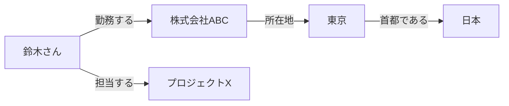
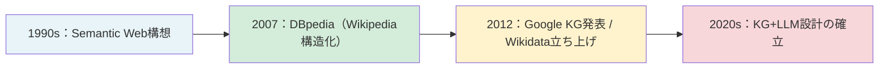
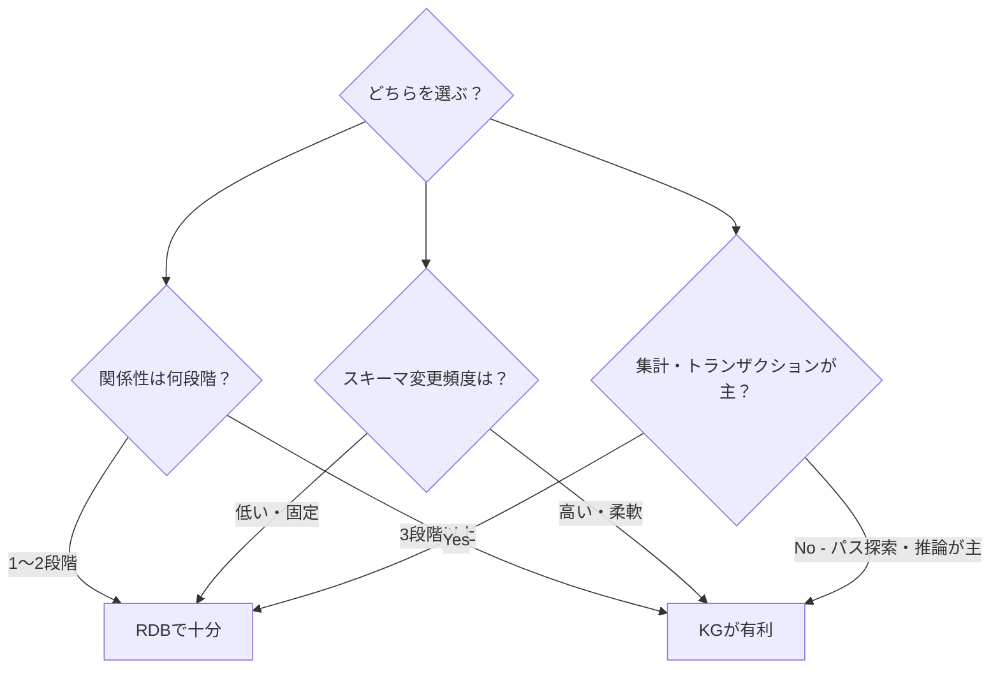
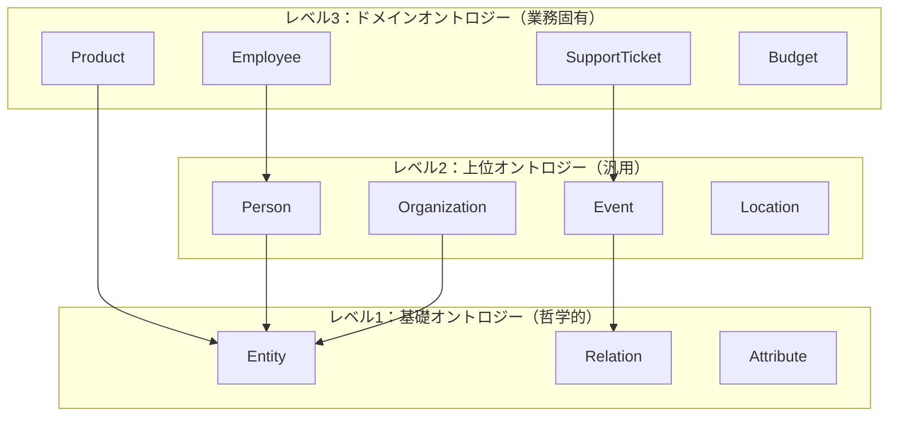

# ナレッジグラフとは何か：知識を"つながり"で表現する

「知識をデータとして持つ」と聞いたとき、多くの人はまずデータベースのテーブルや、Excelのような表形式を思い浮かべるかもしれません。しかしナレッジグラフ（Knowledge Graph、以下KG）は、もう少し違うアプローチを取ります。**知識を「もの」と「つながり」で表現する**のです。

## ノードとエッジで世界を描く

KGの基本単位は非常にシンプルです。

- **ノード（Node）**：実体（もの・概念）
- **エッジ（Edge）**：実体どうしの関係



このグラフが表しているのは「鈴木さんは株式会社ABCに勤めており、同社は東京に拠点を持ち、東京は日本の首都である」という知識の連鎖です。テーブル形式では複数のJOINが必要な情報を、KGは自然な形で一枚の図に収めます。

## 「文字列」ではなく「実体」を扱う

2012年、Googleはナレッジグラフを発表し、次の言葉でその本質を説明しました。

> **"Things, not strings."**（文字列ではなく、実体を）

検索エンジンがそれまで扱っていたのは「キーワード」という文字列でした。しかしKGは「東京」という文字列ではなく、**「東京」という実体そのもの**（緯度・経度、人口、歴史的事実、他の都市との関係……）を扱います。

この違いは、AIシステムの信頼性に直結します。LLMが「東京」と書くとき、それは確率的に生成されたトークンです。KGが「東京」を参照するとき、それは定義済みの実体IDです。

## 歴史的背景

KGの概念は一夜にして生まれたものではありません。



1990年代のSemantic Webは「機械が理解できるWeb」という野心的な構想でしたが、普及には至りませんでした。Googleが2012年に検索に組み込んだことで、KGは実用技術として広く認知されます。そしてLLMが普及した2020年代、KGは再び脚光を浴びています。今度は「LLMの弱点を補う構造」として。

## KGがAIにもたらす3つの価値

### 1. 推論の透明性

KGでは「AはBである、なぜなら（エッジ）」という根拠が明示されます。LLMの「なんとなくそれっぽい」回答とは根本的に異なり、**回答の根拠をトレース**できます。

### 2. 更新性

LLMの知識は学習時点で固定されます。一方KGはデータベースと同様に、情報を追加・修正・削除できます。組織の規程が変われば、KGを更新するだけで済みます。

### 3. LLMへの依存低減

金額・契約・権限など「間違えてはいけない情報」はKGから直接取得し、LLMには文章生成だけを担当させる。こうした役割分担が、信頼性の高いシステムを実現します。

---

## トリプルで世界を表現する：RDFの基本

KGの最もシンプルな表現形式が「トリプル（Triple）」です。**主語 - 述語 - 目的語** の3要素で、あらゆる知識を表現します。

```
<主語（Subject）> <述語（Predicate）> <目的語（Object）>
```

これはW3CのRDF（Resource Description Framework）仕様に基づいており、セマンティックWeb時代から使われてきた形式です。

### 具体的なトリプルの例

以下に、実際の業務シナリオを想定したトリプルを示します。

```turtle
# Turtle形式（RDFの記述形式のひとつ）

# 人物と組織の関係
<鈴木一郎> <所属する> <株式会社テックサービス> .
<鈴木一郎> <役職> "エンジニア" .
<鈴木一郎> <担当プロジェクト> <プロジェクトAlpha> .

# 組織の属性
<株式会社テックサービス> <業種> "SaaS" .
<株式会社テックサービス> <本社所在地> <東京> .

# 製品とバグの関係
<バグ#12345> <影響製品> <製品A v2.3> .
<バグ#12345> <報告者> <田中花子> .
<バグ#12345> <優先度> "Critical" .
<バグ#12345> <関連チケット> <チケット#9876> .

# 地理的関係
<東京> <属する国> <日本> .
<東京> <人口（2023年推定）> "13,960,000" .
```

**ポイント：** トリプルは「一つの事実＝一行」という原則です。どんなに複雑な知識も、このシンプルな3要素の積み重ねで表現できます。これがKGのスケーラビリティの源泉です。

### なぜトリプルが強力か

トリプルの真価は「**連鎖**」にあります。

```turtle
<鈴木一郎> <担当プロジェクト> <プロジェクトAlpha> .
<プロジェクトAlpha> <予算承認者> <山田部長> .
<山田部長> <メールアドレス> "yamada@example.com" .
```

この3つのトリプルがあれば、「鈴木さんが担当するプロジェクトの予算承認者のメールアドレスを教えて」というクエリが、グラフのパスをたどるだけで答えられます。RDBなら3テーブルのJOINが必要なところを、KGは自然に解けます。

---

## KGとRDBの違い：JOINの壁

「それって普通のデータベースでもできるんじゃないの？」

この疑問は自然です。実際、小規模・単純なケースではRDBで十分です。問題は**関係性が深くなったとき**に起きます。

### SQL JOIN地獄

次のようなケースを考えましょう。「ある顧客が報告したバグに、どのエンジニアが現在アサインされていて、そのエンジニアが同時に抱える他のクリティカルチケットは何か」を知りたいとします。

RDBでは、こうなります。

```sql
-- RDBでの「3段階の関係」を追うクエリ
SELECT DISTINCT
    e.name AS engineer_name,
    t2.title AS other_critical_tickets
FROM customers c
JOIN tickets t1 ON c.id = t1.customer_id
JOIN bug_assignments ba ON t1.bug_id = ba.bug_id
JOIN engineers e ON ba.engineer_id = e.id
JOIN ticket_assignments ta ON e.id = ta.engineer_id
JOIN tickets t2 ON ta.ticket_id = t2.id
WHERE c.name = '顧客X'
  AND t1.type = 'bug'
  AND t2.priority = 'critical'
  AND t2.id != t1.id;
```

これで6テーブルのJOINです。さらに「そのエンジニアの担当チームのマネージャーは誰か」を加えると、JOIN数はさらに増えます。

パフォーマンスの問題だけではありません。**スキーマの変更が困難**になります。「チケットに複数のエンジニアをアサインできるようにしたい」という要件変更が起きたら、テーブル構造の変更・既存クエリのリライト・インデックスの見直しが必要です。

### Cypherによるグラフ探索

同じクエリをNeo4jのCypherで書くとこうなります。

```cypher
// Neo4j Cypher：同じ「3段階の関係」をたどるクエリ
MATCH (c:Customer {name: '顧客X'})-[:REPORTED]->(b:Bug)
      <-[:ASSIGNED_TO]-(e:Engineer)
      -[:WORKS_ON]->(t:Ticket {priority: 'critical'})
WHERE t <> b
RETURN e.name AS engineer_name, t.title AS other_critical_tickets
```

**JOINは不要です。** エッジをたどるだけです。

そして「チームのマネージャーも知りたい」という追加要件は、1行追加するだけです。

```cypher
MATCH (c:Customer {name: '顧客X'})-[:REPORTED]->(b:Bug)
      <-[:ASSIGNED_TO]-(e:Engineer)
      -[:BELONGS_TO]->(:Team)-[:MANAGED_BY]->(m:Manager)
      , (e)-[:WORKS_ON]->(t:Ticket {priority: 'critical'})
WHERE t <> b
RETURN e.name, t.title, m.name AS manager_name
```

**ポイント：** グラフDBはスキーマの変更にも強いです。新しいノードタイプやエッジタイプを追加しても、既存のクエリは壊れません。RDBのALTER TABLEのような痛みがありません。

### RDBとKGの使い分け



**実務メモ：** 実際のシステムではRDBとKGを共存させるアーキテクチャが多いです。「ユーザー情報・請求情報はPostgreSQL、関係性・権限・知識構造はNeo4j」という分担です。データの性質で使い分けることがベストプラクティスです。

---

## KGとベクトルDBの違い：意味検索 vs 構造推論

最近「ベクトルDB」という言葉も広く聞かれるようになりました。RAGの実装でよく使われるPinecone、Weaviate、pgvectorなどです。KGとベクトルDBの違いを整理しておきましょう。

### ベクトルDB：意味の近さを捉える

ベクトルDBは文書やフレーズを**高次元ベクトル（埋め込み）** に変換し、コサイン類似度などで「意味的に近い情報」を検索します。

```python
# ベクトル検索のイメージ（擬似コード）
from sentence_transformers import SentenceTransformer

model = SentenceTransformer('all-MiniLM-L6-v2')

query = "予算承認のプロセスについて教えて"
docs = [
    "予算申請は部長承認が必要です",
    "経費精算の締め日は毎月末です",
    "稟議書のフォーマットはこちら",
]

query_vec = model.encode(query)
doc_vecs = model.encode(docs)

# コサイン類似度で最も近い文書を返す
# → 「予算申請は部長承認が必要です」が最上位にくる可能性が高い
```

ベクトル検索が得意なのは「**この文書と意味的に似た文書を見つける**」という曖昧な検索です。キーワードが一致しなくても、意味が近ければ見つかります。

### KG：構造と関係を推論する

KGが得意なのは「**特定の関係パスをたどる**」クエリです。

```cypher
// 「田中さんの上長（2段階まで）が承認できる最大予算額は？」
MATCH (e:Employee {name: '田中花子'})
      -[:REPORTS_TO*1..2]->(m:Manager)
      -[:CAN_APPROVE]->(b:Budget)
RETURN m.name, b.max_amount
ORDER BY b.max_amount DESC
```

このクエリに「意味の近さ」は関係ありません。正確な関係構造をたどって、正確な答えを返します。

### 二つのアプローチの対比

| 観点 | ベクトルDB | ナレッジグラフ |
|------|-----------|--------------|
| **検索の基礎** | コサイン類似度（意味の近さ） | グラフ探索（関係のパス） |
| **得意な問い** | 「〜に似た文書は？」 | 「AとBの関係は？」 |
| **答えの性質** | 確率的・ランキング | 決定論的・正確 |
| **更新** | 再インデックスが必要なことも | ノード/エッジの追加で即反映 |
| **スキーマ** | 不要（テキストをそのまま格納） | 必要（ノードタイプ・エッジタイプの定義） |
| **説明可能性** | 低い（なぜこの文書？が言いにくい） | 高い（どのパスを通ったか明示できる） |
| **弱点** | 「Aさんは承認権限を持つか」には答えにくい | 非構造化テキストの格納に不向き |

**ポイント：** ベクトルDBとKGは競合するものではなく、**補完関係**にあります。「意味の曖昧な検索はベクトルDB、正確な関係の推論はKG」という役割分担が、現代のAIシステム設計のベストプラクティスです。第6章で解説するGraphRAGは、この二つを組み合わせたアーキテクチャです。

---

## オントロジーとスキーマ：KGに型システムを導入する

「ノードとエッジで何でも表現できる」と言いましたが、実際の業務システムでは**型（タイプ）の定義**が重要です。これを**オントロジー（Ontology）** と呼びます。

### なぜ型が必要か

型のないKGの危険性を考えてみましょう。

```
# 型なしKGの例（トラブルの元）
<鈴木一郎> <所属する> <株式会社ABC>      # 正しい
<鈴木一郎> <所属する> <プロジェクトAlpha>  # エッジの意味が違う！
<東京> <所属する> <日本>                  # これも「所属する」？
```

同じ「所属する」というエッジが、「人→会社」「人→プロジェクト」「都市→国」の関係に混在しています。クエリが意図通りに動かない原因になります。

### Neo4jでのスキーマ定義（ノードラベルとリレーションシップタイプ）

Neo4jのProperty Graphでは、ノードに**ラベル**、エッジに**タイプ名**を付けることでスキーマを表現します。

```cypher
// ノードの作成（ラベル付き）
CREATE (e:Employee {
    id: 'emp-001',
    name: '鈴木一郎',
    email: 'suzuki@example.com'
})

CREATE (c:Company {
    id: 'company-001',
    name: '株式会社ABC',
    industry: 'SaaS'
})

CREATE (p:Project {
    id: 'project-alpha',
    name: 'プロジェクトAlpha',
    status: 'active'
})

// リレーションシップの作成（タイプ名付き）
MATCH (e:Employee {id: 'emp-001'}), (c:Company {id: 'company-001'})
CREATE (e)-[:WORKS_FOR {since: '2022-04-01', role: 'Engineer'}]->(c)

MATCH (e:Employee {id: 'emp-001'}), (p:Project {id: 'project-alpha'})
CREATE (e)-[:ASSIGNED_TO {allocation_rate: 0.8}]->(p)
```

`Employee`、`Company`、`Project` というラベルと、`WORKS_FOR`、`ASSIGNED_TO` というリレーションシップタイプが型の役割を果たします。

### オントロジーの3つのレベル



実務では**レベル3のドメインオントロジー**を自分たちで設計することになります。「どんなノードタイプが必要か」「どんなリレーションシップが必要か」という設計判断が、KG設計の核心です。

**実務メモ：** オントロジー設計は一度決めると変更コストが高いです。初期設計時は「必要最小限」を原則に、ノードタイプ5〜10個・リレーションシップタイプ10〜20個程度から始めることをお勧めします。Googleが開発に使ったスキーマも、最初は非常にシンプルだったと言われています（筆者推察）。

---

## Pythonで3行のグラフ操作：NetworkXで試す

概念を理解したら、手を動かしてみましょう。Neo4jがなくても、Pythonの`networkx`ライブラリでグラフの基本操作をすぐに試せます。

```python
import networkx as nx

# グラフの作成（有向グラフ）
G = nx.DiGraph()

# ノードの追加（属性付き）
G.add_node("鈴木一郎", type="Employee", email="suzuki@example.com")
G.add_node("株式会社ABC", type="Company", industry="SaaS")
G.add_node("プロジェクトAlpha", type="Project", status="active")
G.add_node("山田部長", type="Manager", email="yamada@example.com")

# エッジ（関係）の追加
G.add_edge("鈴木一郎", "株式会社ABC", relation="WORKS_FOR", since="2022-04-01")
G.add_edge("鈴木一郎", "プロジェクトAlpha", relation="ASSIGNED_TO", rate=0.8)
G.add_edge("プロジェクトAlpha", "山田部長", relation="APPROVED_BY")
G.add_edge("山田部長", "株式会社ABC", relation="MANAGES")
```

```python
# パス探索：「鈴木さんのプロジェクトの承認者は誰か」
def find_approver(G, employee_name):
    # 担当プロジェクトを探す
    projects = [
        n for n in G.successors(employee_name)
        if G.nodes[n].get("type") == "Project"
    ]

    approvers = []
    for project in projects:
        # プロジェクトの承認者を探す
        for node in G.successors(project):
            edge_data = G.get_edge_data(project, node)
            if edge_data.get("relation") == "APPROVED_BY":
                approvers.append({
                    "project": project,
                    "approver": node,
                    "email": G.nodes[node].get("email")
                })
    return approvers

result = find_approver(G, "鈴木一郎")
print(result)
# → [{'project': 'プロジェクトAlpha', 'approver': '山田部長', 'email': 'yamada@example.com'}]
```

```python
# 2ホップ先までの関係をすべて表示
def show_neighborhood(G, start_node, max_hops=2):
    """指定ノードから2段階以内の関係をすべて表示"""
    visited = {start_node}
    current_level = {start_node}

    for hop in range(1, max_hops + 1):
        next_level = set()
        for node in current_level:
            for neighbor in G.successors(node):
                if neighbor not in visited:
                    edge = G.get_edge_data(node, neighbor)
                    print(f"  {'  ' * hop}{node} --[{edge['relation']}]--> {neighbor}")
                    next_level.add(neighbor)
                    visited.add(neighbor)
        current_level = next_level

show_neighborhood(G, "鈴木一郎")
# 出力:
#   鈴木一郎 --[WORKS_FOR]--> 株式会社ABC
#   鈴木一郎 --[ASSIGNED_TO]--> プロジェクトAlpha
#     プロジェクトAlpha --[APPROVED_BY]--> 山田部長
```

**ポイント：** NetworkxはNeo4jほど高機能ではありませんが、アルゴリズムの理解やプロトタイプ作成に最適です。本番環境ではNeo4jやAmazon Neptuneへの移行を前提に、まずNetworkxで設計を検証するアプローチが効率的です。

**実務メモ：** NetworkxはインメモリなのでデータはPython終了と同時に消えます。`nx.write_graphml(G, "graph.graphml")` でファイルに保存しておきましょう。GraphML形式はNeo4jへのインポートにも対応しています。

---

## KGの弱点とトレードオフ

ここまでKGの優位性を説明してきましたが、公平のために**弱点**も正直に述べます。KGはすべての問題を解決する銀の弾丸ではありません。

### 弱点1：構築コストが高い

KGを「正しく」構築するには、ドメイン知識のある人間がデータを確認・整理する必要があります。

- スキーマ（ノードタイプ・エッジタイプ）の設計：数日〜数週間
- 既存データのKGへの変換（ETL）：データ量に依存するが大規模では数ヶ月
- 継続的なメンテナンス：情報が古くなればKGも陳腐化する

ベクトルDBなら「テキストを突っ込んで埋め込みを生成するだけ」で動き始めます。KGはその10倍以上の初期投資が必要なこともあります（筆者推察：組織規模・データの複雑さによる）。

### 弱点2：スキーマ設計の難しさ

「どんな関係を定義するか」という判断は非常に難しいです。

```
# 悪いスキーマ設計の例
<鈴木一郎> <関係する> <プロジェクトAlpha>  # 「関係する」は曖昧すぎる

# 良いスキーマ設計の例
<鈴木一郎> <ASSIGNED_TO> <プロジェクトAlpha>
<鈴木一郎> <REVIEWS> <プロジェクトAlpha>
<鈴木一郎> <SPONSORS> <プロジェクトAlpha>
```

最初から完璧なスキーマを作るのは不可能です。業務が変わればスキーマも変わります。しかしKGのスキーマ変更はRDBのALTER TABLEよりは柔軟とはいえ、既存データとの整合性を保つ作業は決して小さくありません。

### 弱点3：非構造化テキストへの限界

KGは**構造化された情報**を前提とします。「会議の議事録」「サポートメールの文面」「SNSの投稿」のような非構造化テキストを直接KGに格納するのは難しいです。

非構造化テキストからKGを自動構築する技術（NLP・情報抽出）は進歩していますが、精度は完全ではありません。人手によるレビューが不可欠なことも多いです（筆者経験）。

### 弱点4：クエリ言語の学習コスト

CypherもSPARQLも、SQLとは異なる独特の記法があります。チームメンバー全員がグラフクエリを書けるようになるまでに、一定の学習投資が必要です。

### トレードオフのまとめ

| アプローチ | 構築コスト | 回答信頼性 | 推奨場面 |
|-----------|-----------|-----------|---------|
| LLM単体 | 低 | 低 | プロトタイプ・雑談系 |
| シンプルRAG | 低〜中 | 中 | 一般的なQ&A |
| ファインチューニング | 中 | 中 | 特定ドメインの語調調整 |
| GraphRAG | 中〜高 | 中〜高 | 大量文書の俯瞰的要約 |
| フルKG + LLM | 高 | 高 | 構造的事実・権限・集計が必要な業務 |

**ポイント：** KGの構築は「投資」です。誤答コストが高い領域（第3章で説明するUnsafe Zone）では、このコストは正当化されます。しかし誤答コストが低い用途でKGを構築するのは過剰投資です。「どこにKGが本当に必要か」を見極めることが、実務では最も重要な判断です。

**実務メモ：** 多くの企業が「まずRAGで始めて、精度の天井にぶつかったらKGを検討する」という段階的アプローチを取っています。これは合理的な判断です。最初からKGを目指す必要はありません。

---

次章では、LLMとRAGが構造的に抱える限界を、データから明らかにします。

→ さらに深く：[ナレッジグラフ入門 https://zenn.dev/knowledge_graph/articles/knowledge-graph-intro](https://zenn.dev/knowledge_graph/articles/knowledge-graph-intro)
