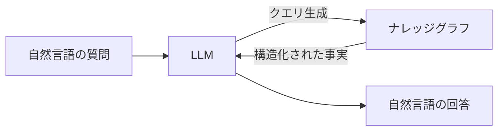
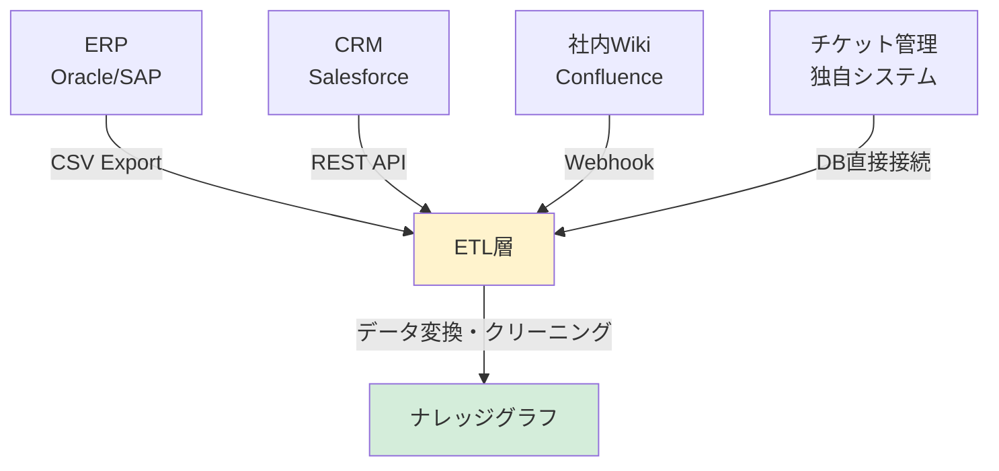
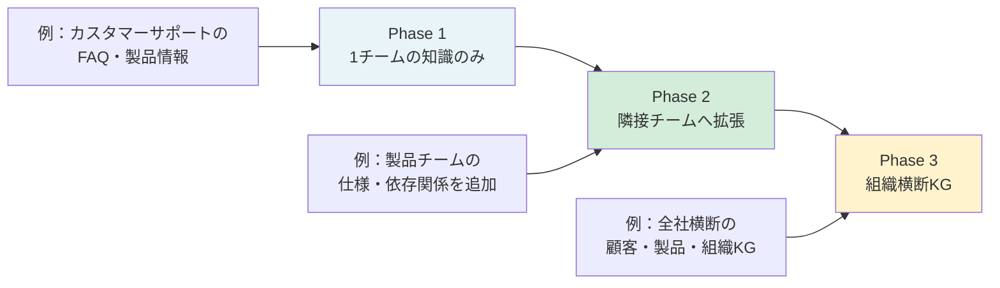
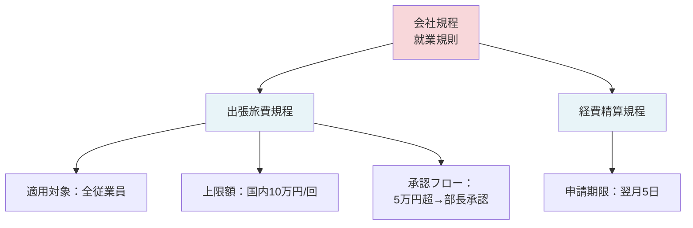
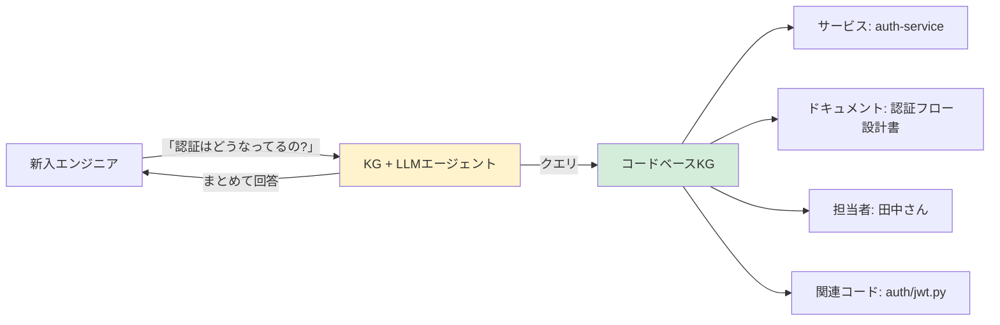

# 世界はナレッジグラフをどう使っているか：業界別の活用事例

「ナレッジグラフは研究者の道具だ」と思っていませんか？

実は違います。Neo4jの調査によると、すでに1,700社以上が本番環境でKGを運用しており、Fortune 100企業の84社、Fortune 500の58%が導入済みです。KGは枯れた技術ではなく、LLMの普及によって今まさに「使える技術」として再注目されている、進化中の技術です。

## なぜ今KGが再注目されているのか

KGそのものは1970年代から研究されてきた歴史ある技術です。では、なぜ今なのでしょうか。

答えはシンプルです。**LLMの普及によって、KGへのアクセスが劇的に簡単になったからです。**

以前は「グラフデータベースに書かれた知識を引き出すには、Cypherクエリを書ける専門家が必要」でした。しかし今は、LLMがその橋渡し役を担います。自然言語でKGに問い合わせ、自然言語で答えを得られる。この組み合わせが、KGの実用価値を一気に引き上げました。



LLMが単体で回答を生成する場合、その答えは「学習データに含まれていた確率的パターン」に依存します。組織固有の知識（社内規程、顧客データ、製品依存関係）は学習データに含まれていませんし、仮に含まれていても更新できません。KGはこの「LLMが知らないこと」を補う、企業固有の知識基盤として機能します。

## 業界別の主要事例

| 業界 | 企業・事例 | 活用内容 | 効果 |
|------|-----------|---------|------|
| 金融 | BNP Paribas | 取引ネットワーク分析による不正検知 | 不正件数を20%削減（出典：Neo4j Customer Story: BNP Paribas Personal Finance） |
| 製薬 | Gilead Sciences | 脅威インテリジェンス管理 | 大規模なサイバー脅威リスク管理に活用 |
| ヘルスケア | BenchSci | 生物医学論文からの創薬候補抽出 | 研究サイクルの大幅短縮 |
| 医療サービス | Infinitus | 保険会社への問い合わせ自動化 | 応答時間を秒単位に短縮 |
| 製造 | BASF | サプライチェーンの可視化 | 部品・拠点の関係を一元管理 |
| 製造 | Caterpillar | 自然言語処理の製造現場適用 | ドキュメント検索のスケーリング |
| IT/通信 | Cisco | 技術文書の関係性分析 | 文書検索・発見にかかる工数を年間400万時間削減（出典：Neo4j Customer Story: Cisco Systems） |
| 通信 | BT Group | ネットワークインベントリ管理 | 設備情報の整合性向上 |

### 金融領域：不正検知から規制対応まで

金融業界でKGが強みを発揮するのは、「関係性の追跡」が鍵になる場面です。不正な資金移動は、単一の取引を見ていても気づきにくいですが、エンティティ間のネットワークとして可視化すると異常なパターンが浮かび上がります。BNP Paribasが不正件数を20%削減したのも、まさにこのアプローチです。

金融規制（AML：マネーロンダリング対策、KYC：顧客確認）においても、KGは力を発揮します。「このエンティティは制裁リストに載っている企業と何ホップで繋がっているか」「同一人物が複数の法人を通じて資金を移動しているか」。こうした多段ホップの関係性追跡は、従来のRDBMSでは結合コストが指数関数的に増大しますが、グラフDBでは効率的に処理できます。

### ヘルスケア：複雑な知識を扱う領域での強み

医学・生物学の知識は本質的に「関係性」で成り立っています。「薬AはタンパクBに作用し、それが疾患Cの症状Dを抑制する」。このような多段の関係を構造化して保持・推論できるのがKGの真骨頂です。

BenchSciの事例では、膨大な生物医学論文からタンパク・疾患・化合物・実験結果の関係を自動抽出してKGを構築し、創薬候補のスクリーニングに活用しています。従来は研究者が手動で文献を漁っていた作業が、KGへのクエリ一発で代替されます。研究者は「何千本もの論文を読む時間」ではなく「仮説を検証する時間」に集中できるようになります。

## GAFA・クラウドベンダーのKG戦略

大手テック企業がKGをどう使っているかを見ると、その重要性がよく分かります。

**Google**はKGを最も早く商用サービスに組み込んだ企業の一つです。2012年に掲げた「Things, not strings（文字列ではなく、物事を理解する）」というビジョンは、その後のVertex AI Searchにも受け継がれています。

**AWS**はAmazon Neptuneというマネージドグラフデータベースサービスを提供し、クラウド上でのKG構築を容易にしました。

**Oracle**はエンタープライズ向けのデータ統合においてKGを活用し、大規模な知識管理基盤を提供しています。

**OpenAI**はChatGPTの精度向上にKG的な知識構造を組み合わせる方向で研究を続けており（筆者推察。公式発表ではない）、RAGとKGの融合が今後のトレンドとして注目されています。

## 日本の先進事例

国内企業もKGの実用化で世界に追いついています。

**富士通**は因果推論KGを開発し、政府の生成AI実証事業「GENIAC」に採択されました。因果関係を構造化して保持することで、単なる相関分析を超えた意思決定支援を目指しています。

**ストックマーク**は特許・技術文書からの自動KG構築に取り組み、2025年3月には日本触媒との共同プロジェクトで実運用を開始しました。人手によるナレッジ管理から、自動更新・自動拡張されるKGへの移行が進んでいます。

**NEC**はデータ統合プロジェクトにKGを活用し、従来多大な時間がかかっていたデータ統合作業を大幅に短縮するという成果を上げています。

## 日本企業がKGを導入する際の現実的な障壁

グローバルの成功事例を見て「うちでもやってみよう」と思っても、日本企業特有の障壁が待ち受けています。これらを理解した上で進めることが、プロジェクト成功の鍵です。

### レガシーシステムのデータ統合問題

多くの日本企業では、基幹システムが20〜30年前に構築されたままです。ERP・CRM・ドキュメント管理・グループウェアなど、それぞれ異なるベンダーのシステムが独自スキーマでデータを持っています。

KGを構築しようとすると、最初の壁は「データの取り出し」です。

- OracleのERP: CSVエクスポートしかAPIがない
- 独自開発の顧客管理システム: テーブル設計書がない、担当者が退職済み
- ドキュメントがPDFで数万件: テキスト抽出しても構造が失われている

実務メモ：まず「どのシステムから、どういうフォーマットでデータを取れるか」を棚卸しするだけで1〜2ヶ月かかることがあります。KGの構築よりデータ収集・クリーニングに工数の大半が費やされると想定しておきましょう。



このETL層の設計が実は最も難しく、KGの品質を左右します。「ゴミを入れればゴミが出る（Garbage in, garbage out）」はKGにも当てはまります。

### 社内政治とデータオーナーシップの問題

技術的な問題より難しいのが、組織的な問題です。KGは複数部署のデータを統合するため、必然的に「誰のデータか」という問題が生じます。

典型的なシナリオ：
- 営業部は顧客データを「自分たちの資産」だと思っており、他部署への共有に消極的
- ITシステム部は「データを外部ツールに連携するとセキュリティリスクがある」と拒否
- 法務部は「個人情報保護の観点から、データ統合には個別の審査が必要」と言う
- 各事業部は「自部署のデータのKG化には予算を出さない」と言う

実務メモ：KGプロジェクトは技術プロジェクトである前に、組織変革プロジェクトです。CDO（最高データ責任者）やCIOなどの経営層のスポンサーシップなしに進めようとすると、部門間の調整でプロジェクトが止まります。最初から「誰がデータガバナンスの最終責任者か」を明確にしておくことが重要です。

### 「まず誰のデータをKGに入れるか」問題

KGを始めようとすると、誰もが直面する問いがあります：「どこから始めればいいのか」です。

よくある失敗パターンは「全社のデータを統合する大きなKGを最初から作ろうとする」ことです。これはスコープが広すぎて、PoC（概念検証）が完了する前にプロジェクトが頓挫します。

**推奨アプローチ：スモールスタート戦略**



最初の対象として特に有効なのは、「1チームが管理しており、データの出所が明確で、ビジネス価値が見えやすい」領域です。カスタマーサポートチームの知識ベースは、この条件を満たしやすい代表例です。

## スタートアップ向けKG活用パターン

大企業の事例ばかり取り上げましたが、KGはスモールチームでも十分に活用できます。むしろ小規模チームのほうが、組織的な障壁が少ない分、素早く価値を出せることが多いです。

### パターン1：軽量KGとしてのJSON-LDを活用

グラフDBを立てるほどでもない初期段階では、JSON-LDやTurtle形式でKGを表現し、Pythonの`networkx`ライブラリでグラフ操作する方法があります。クラウド費用ゼロで始められます。

```python
import networkx as nx
import json

# 軽量KG：networkxで始める
G = nx.DiGraph()

# エンティティを追加
G.add_node("product:api-v2", type="Product", name="API v2", status="stable")
G.add_node("product:api-v1", type="Product", name="API v1", status="deprecated")
G.add_node("customer:acme-corp", type="Customer", name="Acme Corp", plan="enterprise")

# 関係を追加
G.add_edge("customer:acme-corp", "product:api-v1", relation="uses", since="2022-01")
G.add_edge("product:api-v1", "product:api-v2", relation="superseded_by")

# クエリ例：このAPIを使っているすべての顧客を取得
def get_customers_using_product(G, product_id):
    return [
        n for n, d in G.nodes(data=True)
        if d.get("type") == "Customer"
        and G.has_edge(n, product_id)
    ]

customers = get_customers_using_product(G, "product:api-v1")
print(f"API v1を使用中の顧客: {customers}")
# → ['customer:acme-corp']
```

このようにPythonだけで始められます。データが数千ノードを超えてきたらNeo4jやFalkorDBに移行する、という段階的アプローチが現実的です。

### パターン2：Notionデータベース+自動KG構築

スタートアップではNotionで仕様書・顧客情報・タスクを管理しているチームが多いです。Notion APIを使ってデータを取得し、エンティティ・関係を自動抽出してKGを構築するアプローチは、既存ワークフローを壊さずにKGを導入できます。

実務メモ：Notionのページ間リンク（`@メンション`）はそのままエッジとして使えます。「製品仕様ページが顧客フィードバックページをメンション」=「製品は顧客フィードバックによって影響を受ける」という関係としてKGに取り込めます。

### パターン3：GitHub + KG でコードベース理解を加速

エンジニアリング組織が5〜10人規模になってくると「このコードどこで定義されてたっけ」問題が頻発します。GitHubのコードベースからKGを自動生成し、「このAPIエンドポイントを誰が実装して、どのドキュメントに書かれているか」を一発で引けるようにする取り組みが増えています。

```python
# GitHub APIからリポジトリ情報を取得してKGを構築するイメージ
import requests

class GitHubKGBuilder:
    def __init__(self, token: str, repo: str):
        self.headers = {"Authorization": f"token {token}"}
        self.repo = repo
        self.graph = {}

    def build_pr_knowledge(self):
        """PRとコードファイル・作者の関係をKGとして構築"""
        prs = self._get_pull_requests()
        for pr in prs:
            pr_node = f"pr:{pr['number']}"
            author_node = f"user:{pr['user']['login']}"
            self.graph[pr_node] = {
                "type": "PullRequest",
                "title": pr["title"],
                "state": pr["state"]
            }
            # PR → 作者の関係
            self._add_edge(pr_node, author_node, "created_by")

            # PR → 変更ファイルの関係
            files = self._get_pr_files(pr['number'])
            for f in files:
                file_node = f"file:{f['filename']}"
                self._add_edge(pr_node, file_node, "modifies")

    def _add_edge(self, src, dst, relation):
        if "edges" not in self.graph:
            self.graph["edges"] = []
        self.graph["edges"].append({
            "src": src, "dst": dst, "relation": relation
        })
```

## 5つの具体的ユースケース詳細

ここからは実際の業務でKGをどう使うか、5つのユースケースを深掘りします。「自社に当てはまりそうか」を確認しながら読んでください。

### ユースケース1：カスタマーサポートナレッジのKG化

**課題の背景**

カスタマーサポートチームが抱える典型的な問題があります。製品が成長するにつれてFAQドキュメントが数百〜数千件に膨れ上がり、サポート担当者が「どの記事が正確な答えを持っているか」を見つけるのに時間がかかるようになります。類似した質問に対して担当者によって異なる回答をしてしまうこともあります。

**KGで解決するアプローチ**

KGには「質問・回答・製品バージョン・問題カテゴリ・関連する過去チケット」をノードとして持ち、それらの関係をエッジとして表現します。

```python
# カスタマーサポートKGのスキーマ設計例（Cypher）
# ノードの作成
CREATE (q:Question {
    id: "q-001",
    text: "ログインできません",
    category: "authentication",
    frequency: 450
})

CREATE (a:Answer {
    id: "a-001",
    text: "パスワードリセット手順：...",
    verified: true,
    last_updated: "2025-03-01"
})

CREATE (p:Product {
    id: "product-web",
    name: "Webアプリ",
    version: "3.2.1"
})

CREATE (t:Ticket {
    id: "ticket-12345",
    customer_id: "cust-789",
    resolved: true,
    resolution_time_hours: 2.5
})

// 関係の作成
MATCH (q:Question {id: "q-001"}), (a:Answer {id: "a-001"})
CREATE (q)-[:ANSWERED_BY {confidence: 0.95}]->(a)

MATCH (a:Answer {id: "a-001"}), (p:Product {id: "product-web"})
CREATE (a)-[:APPLIES_TO {version: ">=3.0"}]->(p)

MATCH (t:Ticket {id: "ticket-12345"}), (q:Question {id: "q-001"})
CREATE (t)-[:RELATES_TO]->(q)
```

このKGにより、新しいサポートチケットが来たとき、LLMはKGに「この質問テキストに最も近い既存Questionノードはどれか、その回答は何か、直近で同じ問題を報告した顧客は誰か」を一度のクエリで取得できます。サポート担当者は回答候補を提示され、そこから選ぶだけになります。

**定量的な効果**

推測：このアプローチを導入したチームでは、初回返答時間（First Response Time）が30〜50%削減されるケースが多いとされています。また、回答の一貫性向上により、CSAT（顧客満足度スコア）が改善する傾向があります。ただし効果は導入前のナレッジ管理の成熟度に大きく依存します。

### ユースケース2：社内規程・ポリシーのKG化

**課題の背景**

「この経費は申請できますか？」「この業務にはどの承認フローが適用されますか？」。こうした問いに答えるために、社員はイントラネットの規程集を検索し、複数の文書を読み比べるという手間を踏んでいます。規程は更新頻度が高く、どの版が最新かも分かりにくいです。

**KGで解決するアプローチ**

規程をKGで表現すると、「この規程の適用対象は誰か」「この規程に違反した場合の次のステップは何か」「この規程はどの上位規程から派生しているか」という関係を構造的に保持できます。



重要なのは、規程の「バージョン管理」もKGで表現することです。改定履歴をノードとして持ち、「旧バージョンの規程を参照している文書はどれか」を常に把握できる設計にします。

ポイント：社内規程KGで最も価値が出るのは「規程同士の矛盾検出」です。複数の規程が複雑に絡み合う大企業では、規程AとBが矛盾した指示を出しているケースが珍しくありません。KGはこうした矛盾をクエリ一発で検出できます。

### ユースケース3：製品カタログ・依存関係のKG化

**課題の背景**

SaaSプロダクトを運営していると、製品間・モジュール間の依存関係が複雑になります。「機能AをリリースするとAPIバージョンBに影響し、それを使っているサービスCが動かなくなる」。こうしたカスケード影響を事前に把握するのが難しくなります。

**KGで解決するアプローチ**

依存関係はグラフ構造そのものです。KGに「サービス・API・バージョン・依存関係」を持つことで、「このAPIをdeprecateしたとき影響を受けるサービスは何か」をグラフトラバーサルで瞬時に答えられます。

```python
from neo4j import GraphDatabase

class ProductDependencyKG:
    def __init__(self, uri, user, password):
        self.driver = GraphDatabase.driver(uri, auth=(user, password))

    def get_impact_of_deprecation(self, api_id: str) -> list[dict]:
        """あるAPIをdeprecateした場合の影響範囲を取得"""
        query = """
        MATCH path = (api:API {id: $api_id})<-[:DEPENDS_ON*1..3]-(service:Service)
        RETURN
            service.name AS service_name,
            service.team AS owning_team,
            length(path) AS hop_count,
            [node in nodes(path) | node.name] AS dependency_chain
        ORDER BY hop_count
        """
        with self.driver.session() as session:
            result = session.run(query, api_id=api_id)
            return [dict(record) for record in result]

    def get_customer_impact(self, api_id: str) -> list[str]:
        """あるAPIのdeprecateで影響を受ける顧客一覧"""
        query = """
        MATCH (customer:Customer)-[:USES]->(service:Service)-[:DEPENDS_ON*1..3]->(api:API {id: $api_id})
        RETURN DISTINCT customer.name AS customer_name, customer.tier AS tier
        ORDER BY tier DESC
        """
        with self.driver.session() as session:
            result = session.run(query, api_id=api_id)
            return [dict(record) for record in result]

# 使用例
kg = ProductDependencyKG("bolt://localhost:7687", "neo4j", "password")
impacts = kg.get_impact_of_deprecation("api:payments-v1")
print(f"影響を受けるサービス数: {len(impacts)}")
for impact in impacts:
    print(f"  - {impact['service_name']} (チーム: {impact['owning_team']}, {impact['hop_count']}ホップ先)")
```

実務メモ：製品依存関係KGは「ブレーキング・チェンジ通知の自動化」に特に有効です。CIパイプラインにKGクエリを組み込み、APIに破壊的変更が加わるPRをマージする際に自動で影響範囲レポートを生成する、という使い方が実用的です。

### ユースケース4：エンジニアオンボーディングへのKG活用

**課題の背景**

新しいエンジニアが入社したとき、コードベースの全体像を把握するまでに数ヶ月かかるのが普通です。「このサービスは何をしているのか」「誰に聞けばいいのか」「どのドキュメントを読めばいいのか」。これらを一つ一つ人に聞いて回るのは非効率です。

**KGで解決するアプローチ**

「コードベース知識グラフ」を構築します。ソースコード・ドキュメント・Slackの重要スレッド・アーキテクチャ決定記録（ADR）をKGに取り込み、エンジニアが自然言語で問い合わせできる仕組みを作ります。



このシステムの肝は「KGに関係性を持たせること」です。単なるベクトル検索では「認証」に関連するドキュメントをリストアップするだけですが、KGなら「認証サービスの担当チームは誰で、そのチームが最近どんな変更を加えたか、その変更に依存しているサービスはどれか」まで一気に答えられます。

実務メモ：オンボーディングKGの構築は、既存エンジニアにとっても「ドキュメント化の強制」になるという副次効果があります。「KGに登録されていない知識は存在しないも同然」という文化を作ることで、暗黙知の形式化が進みます。

### ユースケース5：インシデント対応の因果関係KG

**課題の背景**

障害発生時、インシデント対応チームが最初に直面するのは「何が起きているのか」という混乱です。複数のアラートが同時に鳴り、それぞれの因果関係が分からない状態でRCAを始めなければなりません。後から作るポストモーテムも、次回の障害時に参照されないまま埋もれることが多いです。

**KGで解決するアプローチ**

インシデントの因果関係をKGとして蓄積します。「アラートXはサービスYの障害を引き起こし、それはデプロイZが原因だった」という因果チェーンを構造化して保持します。

```python
# インシデント因果関係KGの構築例
def record_incident(driver, incident_data: dict):
    """インシデントとその因果関係をKGに記録"""
    query = """
    // インシデントノードを作成
    CREATE (i:Incident {
        id: $incident_id,
        title: $title,
        severity: $severity,
        started_at: datetime($started_at),
        resolved_at: datetime($resolved_at),
        mttr_minutes: $mttr_minutes
    })

    // 根本原因との関係
    WITH i
    MATCH (cause:ChangeEvent {id: $root_cause_id})
    CREATE (i)-[:CAUSED_BY]->(cause)

    // 影響を受けたサービスとの関係
    WITH i
    UNWIND $affected_services AS svc_id
    MATCH (s:Service {id: svc_id})
    CREATE (i)-[:AFFECTED]->(s)

    RETURN i.id AS recorded_incident
    """
    with driver.session() as session:
        result = session.run(query, **incident_data)
        return result.single()["recorded_incident"]

def find_similar_incidents(driver, alert_pattern: str) -> list[dict]:
    """類似アラートパターンの過去インシデントを検索"""
    query = """
    MATCH (i:Incident)-[:TRIGGERED_BY]->(a:Alert)
    WHERE a.pattern CONTAINS $pattern
    MATCH (i)-[:CAUSED_BY]->(cause)
    RETURN
        i.title AS incident_title,
        i.severity AS severity,
        cause.description AS root_cause,
        i.mttr_minutes AS mttr,
        i.resolved_at AS resolved_at
    ORDER BY i.resolved_at DESC
    LIMIT 5
    """
    with driver.session() as session:
        result = session.run(query, pattern=alert_pattern)
        return [dict(record) for record in result]
```

この「過去インシデント検索」機能は、障害対応の速度を大幅に上げます。「同じアラートで過去に何が起きたか、どう解決したか」をKGから即座に引けるため、RCAの時間が短縮されます。

推測：インシデントKGを導入したチームでは、MTTR（平均復旧時間）が20〜40%削減されるケースがあるとされています。ただし、KGへの記録を継続的に行う文化が定着しているかどうかに成果は大きく依存します。

## KG導入前後の定量的変化の測り方

「KGを入れてよかった」と言うだけでは不十分です。ROIを示すためには、KPI設計と計測の仕組みが必要です。

### ユースケース別KPI設定

| ユースケース | 導入前の計測 | 導入後の計測 | 目標 |
|------------|------------|------------|------|
| サポートKG | 初回返答時間（中央値） | 同上 | 30%削減 |
| サポートKG | CSAT（顧客満足度） | 同上 | +10pt以上 |
| 依存関係KG | リリース前のImpact Analysis工数 | 同上 | 50%削減 |
| 依存関係KG | ブレーキング・チェンジ起因インシデント数 | 同上 | 0件/月 |
| オンボーディングKG | 新入社員が最初のPRを出すまでの日数 | 同上 | 30%短縮 |
| インシデントKG | MTTR（平均復旧時間） | 同上 | 25%削減 |

実務メモ：KPI計測のために「導入前のベースライン計測」を忘れがちです。KGプロジェクトを開始する前に、現状の数値を記録しておくことが重要です。後から「導入前はどうだったか」を調べようとしても、データがない場合が多いです。

### 計測の自動化

KGそのものを使って、KGの効果を計測することもできます。

```python
# KGの活用状況ダッシュボードクエリ
def get_kg_usage_metrics(driver) -> dict:
    """KGの利用状況・品質メトリクスを取得"""
    metrics = {}

    # ノード・エッジ数（カバレッジの指標）
    with driver.session() as session:
        result = session.run("""
        MATCH (n) RETURN count(n) AS node_count
        UNION ALL
        MATCH ()-[r]-() RETURN count(r) AS node_count
        """)
        counts = [r["node_count"] for r in result]
        metrics["node_count"] = counts[0]
        metrics["edge_count"] = counts[1]

    # 直近30日間のクエリ数（活用度の指標）
    with driver.session() as session:
        result = session.run("""
        MATCH (ql:QueryLog)
        WHERE ql.timestamp > datetime() - duration('P30D')
        RETURN count(ql) AS query_count,
               avg(ql.latency_ms) AS avg_latency
        """)
        record = result.single()
        metrics["monthly_queries"] = record["query_count"]
        metrics["avg_latency_ms"] = record["avg_latency"]

    return metrics
```

## まずどこから始めるか：3つのクイックウィン

KGの価値は理解したが、「何から始めればいいか分からない」という方のために、すぐに着手できる3つのアプローチを紹介します。

### クイックウィン1：既存ドキュメントのリンク構造をKGにする

まず最も難易度が低いのは、「すでにある情報の関係性を可視化する」ことです。ConfluenceやNotionで運用している既存ドキュメントには、ページ間リンクという形でリレーションシップが存在します。これをKGとして可視化するだけでも、「孤立したドキュメント（誰にも参照されていない古い文書）」や「ハブドキュメント（多くの文書から参照されている重要文書）」が一目で分かります。

実装工数の目安：エンジニア1人、1〜2週間でプロトタイプ可能。

### クイックウィン2：オンコール担当者と障害の関係をKGにする

インフラ・SREチームであれば、PagerDutyやOpsGenieのアラート履歴にアクセスできます。「誰がどのアラートに対応したか」「そのアラートはどのサービスで、どのインシデントに発展したか」をKGにするのは比較的簡単で、すぐに「最近のアラート傾向」や「特定エンジニアの負荷」が可視化できます。

実装工数の目安：エンジニア1人、2〜3週間でプロトタイプ可能。

### クイックウィン3：製品機能とカスタマーリクエストのKGにする

プロダクトマネージャー向けのクイックウィンとして有効です。GitHubのIssue・ZendeskチケットやLinear/Jiraのタスクを取り込み、「顧客XはFeature Yのリクエストを出しており、そのFeatureはEpic Zの一部で、現在担当はAさん」という関係性をKGにします。PMが「このFeatureを優先すると影響を受ける顧客は誰か」を即座に答えられるようになります。

実装工数の目安：エンジニア1人、2〜4週間でプロトタイプ可能。

---

## KGはすでに「実績のある選択肢」

これだけの企業が、これだけの規模で、これだけの成果を出しています。KGを「まだ実験的な技術」と位置付けるのは、もはや正確ではありません。問題は「使うかどうか」ではなく、「どのユースケースに、どう使うか」です。

特に日本企業においては、レガシーシステムや組織の壁という障壁は確かに存在しますが、スモールスタートで始めることで、それらを乗り越えながら価値を積み上げていくことができます。

次章では、KGの構築方法について、具体的な技術選択と実装の第一歩を見ていきます。

---

→ 各社のKG活用 https://zenn.dev/knowledge_graph/articles/ai-kg-trend-oct2025

→ 国内企業のKG活用 https://zenn.dev/knowledge_graph/articles/kg-japan-case-studies
